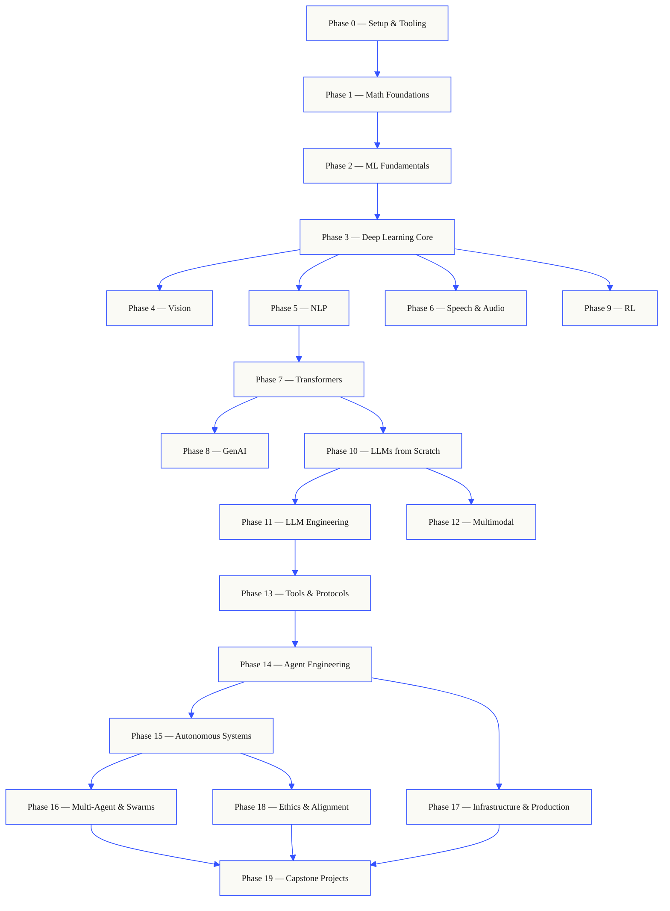
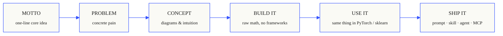

<p align="center">
  
</p>

<p align="center">
  <a href="LICENSE"></a>
  <a href="ROADMAP.md"></a>
  <a href="#contents"></a>
  <a href="https://github.com/fancyboi999/ai-engineering-from-scratch-zh/stargazers"></a>
  <a href="https://ai-engineering-from-scratch-zh.vercel.app"></a>
</p>

```
░░░▒▒▒░░░▒▒▒░░░▒▒▒░░░▒▒▒░░░▒▒▒░░░▒▒▒░░░▒▒▒░░░▒▒▒░░░▒▒▒░░░▒▒▒░░░▒▒▒░░░▒▒▒░░░▒▒▒░░░▒▒▒░░░▒▒▒
```

> **84% 的学生已经在用 AI 工具，可只有 18% 觉得自己能在专业场景里用好它们。**
> 这套课程要填的就是这道沟。
>
> 435 节课，20 个阶段，约 320 小时。Python、TypeScript、Rust、Julia。每节课都交付一件
> 能复用的东西：一个提示词、一个技能、一个 agent、一个 MCP server。免费，开源，MIT。
>
> 你不只是学 AI，你亲手把它造出来。从头到尾，全手写。

> 本项目是 [AI Engineering from Scratch](https://github.com/rohitg00/ai-engineering-from-scratch) 的简体中文翻译版。感谢原作者 [Rohit Ghumare](https://github.com/rohitg00) 创作并开源了这套课程。

## How this works

大多数 AI 教材都是碎片化教学。这儿一篇论文，那儿一篇微调心得，别处再来个炫酷的 agent
demo。这些碎片很少能拼到一起。你做出了一个聊天机器人，却讲不清它的 loss 曲线；你给
agent 挂了个函数，却说不出调用它的那个模型内部，attention 到底在干什么。

这套课程就是那根脊椎。20 个阶段，435 节课，四种语言：Python、TypeScript、Rust、Julia。
一头是线性代数，另一头是自主 agent 集群。每个算法都先从最原始的数学手写出来。反向传播、
分词器、注意力、agent 循环——等 PyTorch 登场时，你已经知道它底层在做什么了。

每节课都跑同一个循环：读懂问题、推导数学、写代码、跑测试、留下产物。没有五分钟速成视频，
没有复制粘贴式部署，没有手把手喂饭。免费，开源，在你自己的笔记本上就能跑。

```
░░░▒▒▒░░░▒▒▒░░░▒▒▒░░░▒▒▒░░░▒▒▒░░░▒▒▒░░░▒▒▒░░░▒▒▒░░░▒▒▒░░░▒▒▒░░░▒▒▒░░░▒▒▒░░░▒▒▒░░░▒▒▒░░░▒▒▒
```

## The shape of the curriculum

二十个阶段层层叠起来。数学是地基，agent 和生产部署是屋顶。下层的东西你已经会了，就尽管
往前跳；但别跳过去之后，又回头纳闷上层为什么塌了。



```
░░░▒▒▒░░░▒▒▒░░░▒▒▒░░░▒▒▒░░░▒▒▒░░░▒▒▒░░░▒▒▒░░░▒▒▒░░░▒▒▒░░░▒▒▒░░░▒▒▒░░░▒▒▒░░░▒▒▒░░░▒▒▒░░░▒▒▒
```

## The shape of a lesson

每节课都待在自己的文件夹里，整套课程结构统一：

```
phases/<NN>-<phase-name>/<NN>-<lesson-name>/
├── code/      可运行的实现（Python、TypeScript、Rust、Julia）
├── docs/
│   └── en.md  课程正文
└── outputs/   本节课产出的提示词、技能、agent 或 MCP server
```

每节课都走六个节拍。其中 *Build It / Use It*（动手构建 / 上手使用）的拆分是整节课的脊椎——
你先从零实现算法，再用生产级的库把同样的事跑一遍。你之所以懂框架在做什么，是因为那个更小的
版本你自己写过。



## Getting started

三种入门方式。挑一个。

**方式 A —— 阅读。** 在
[ai-engineering-from-scratch-zh.vercel.app](https://ai-engineering-from-scratch-zh.vercel.app) 上打开任意一节已完成的课程，
或展开 [目录](#contents) 里的某个阶段。无需配置，无需 clone。

**方式 B —— clone 下来跑。**

```bash
git clone https://github.com/fancyboi999/ai-engineering-from-scratch-zh.git
cd ai-engineering-from-scratch-zh
python phases/01-math-foundations/01-linear-algebra-intuition/code/vectors.py
```

**方式 C —— 测一测你的水平 *(推荐)*。** 聪明地跳级。在 Claude、Cursor、Codex、OpenClaw、Hermes，或任何装了本课程技能的 agent 里：

```bash
/find-your-level
```

十道题。把你的知识映射到一个起始阶段，生成一条带课时估算的个性化路径。每学完一个阶段：

```bash
/check-understanding 3        # 测验你对阶段 3 的掌握
ls phases/03-deep-learning-core/05-loss-functions/outputs/
# ├── prompt-loss-function-selector.md
# └── prompt-loss-debugger.md
```

### 前置要求

- 你会写代码（任何语言都行，会 Python 更好）。
- 你想搞懂 AI **到底是怎么运作的**，而不只是调调 API。

### 内置 agent 技能（Claude、Cursor、Codex、OpenClaw、Hermes）

| 技能 | 作用 |
|---|---|
| [`/find-your-level`](.claude/skills/find-your-level/SKILL.md) | 十道题的定级测验。把你的知识映射到一个起始阶段，生成带课时估算的个性化路径。 |
| [`/check-understanding <phase>`](.claude/skills/check-understanding/SKILL.md) | 按阶段测验，八道题，附反馈和需要复习的具体课程。 |

```
░░░▒▒▒░░░▒▒▒░░░▒▒▒░░░▒▒▒░░░▒▒▒░░░▒▒▒░░░▒▒▒░░░▒▒▒░░░▒▒▒░░░▒▒▒░░░▒▒▒░░░▒▒▒░░░▒▒▒░░░▒▒▒░░░▒▒▒
```

## Every lesson ships something

别的课程结尾是一句 *"恭喜，你学会了 X。"* 这里每节课的结尾，是一件你能直接装上、
或粘进日常工作流的 **可复用工具**。

<table>
<tr>
<th align="left" width="25%"><br/><sub>FIG_001 · A</sub><br/><b>PROMPTS</b></th>
<th align="left" width="25%"><br/><sub>FIG_001 · B</sub><br/><b>SKILLS</b></th>
<th align="left" width="25%"><br/><sub>FIG_001 · C</sub><br/><b>AGENTS</b></th>
<th align="left" width="25%"><br/><sub>FIG_001 · D</sub><br/><b>MCP SERVERS</b></th>
</tr>
<tr>
<td valign="top">粘进任意 AI 助手，在某个细分任务上获得专家级帮助。</td>
<td valign="top">放进 Claude、Cursor、Codex、OpenClaw、Hermes，或任何能读 <code>SKILL.md</code> 的 agent。</td>
<td valign="top">作为自主 worker 部署——那个循环你在阶段 14 自己写过。</td>
<td valign="top">接入任意兼容 MCP 的客户端。在阶段 13 里从头到尾构建。</td>
</tr>
</table>

> 用 `python3 scripts/install_skills.py` 一次性全部安装。是真家伙，不是课后作业。
> 学完整套课程，你会攒下 435 件作品——你是真懂它们，因为它们都是你亲手造的。

### FIG_002 · 一个实例

阶段 14，第 1 课：agent 循环。约 120 行纯 Python，零依赖。

<table>
<tr>
<td valign="top" width="50%">

**`code/agent_loop.py`** &nbsp; <sub><i>动手构建</i></sub>

```python
def run(query, tools):
    history = [user(query)]
    for step in range(MAX_STEPS):
        msg = llm(history)
        if msg.tool_calls:
            for call in msg.tool_calls:
                result = tools[call.name](**call.args)
                history.append(tool_result(call.id, result))
            continue
        return msg.content
    raise StepLimitExceeded
```

</td>
<td valign="top" width="50%">

**`outputs/skill-agent-loop.md`** &nbsp; <sub><i>交付</i></sub>

```markdown
---
name: agent-loop
description: ReAct-style loop for any tool list
phase: 14
lesson: 01
---

Implement a minimal agent loop that...
```

**`outputs/prompt-debug-agent.md`**

```markdown
You are an agent debugger. Given the trace
of an agent run, identify the step where
the agent went wrong and explain why...
```

</td>
</tr>
</table>

```
░░░▒▒▒░░░▒▒▒░░░▒▒▒░░░▒▒▒░░░▒▒▒░░░▒▒▒░░░▒▒▒░░░▒▒▒░░░▒▒▒░░░▒▒▒░░░▒▒▒░░░▒▒▒░░░▒▒▒░░░▒▒▒░░░▒▒▒
```

<a id="contents"></a>

## Contents

二十个阶段。点开任意阶段即可展开它的课程列表。

<a id="phase-0"></a>
### Phase 0: 配置与工具链 `12 lessons`
> 把环境准备好，迎接后面所有的内容。

| # | Lesson | Type | Lang |
|:---:|--------|:----:|------|
| 01 | [开发环境](phases/00-setup-and-tooling/01-dev-environment/) | Build | Python |
| 02 | [Git 与协作](phases/00-setup-and-tooling/02-git-and-collaboration/) | Learn | — |
| 03 | [GPU 配置与云端](phases/00-setup-and-tooling/03-gpu-setup-and-cloud/) | Build | Python |
| 04 | [API 与密钥](phases/00-setup-and-tooling/04-apis-and-keys/) | Build | Python |
| 05 | [Jupyter Notebook](phases/00-setup-and-tooling/05-jupyter-notebooks/) | Build | Python |
| 06 | [Python 环境管理](phases/00-setup-and-tooling/06-python-environments/) | Build | Shell |
| 07 | [面向 AI 的 Docker](phases/00-setup-and-tooling/07-docker-for-ai/) | Build | Docker |
| 08 | [编辑器配置](phases/00-setup-and-tooling/08-editor-setup/) | Build | — |
| 09 | [数据管理](phases/00-setup-and-tooling/09-data-management/) | Build | Python |
| 10 | [终端与 Shell](phases/00-setup-and-tooling/10-terminal-and-shell/) | Learn | — |
| 11 | [面向 AI 的 Linux](phases/00-setup-and-tooling/11-linux-for-ai/) | Learn | — |
| 12 | [调试与性能分析](phases/00-setup-and-tooling/12-debugging-and-profiling/) | Build | Python |

<details id="phase-1">
<summary><b>Phase 1 — 数学基础</b> &nbsp;<code>22 lessons</code>&nbsp; <em>每个 AI 算法背后的直觉，用代码讲清楚。</em></summary>
<br/>

| # | Lesson | Type | Lang |
|:---:|--------|:----:|------|
| 01 | [线性代数直觉](phases/01-math-foundations/01-linear-algebra-intuition/) | Learn | Python, Julia |
| 02 | [向量、矩阵与运算](phases/01-math-foundations/02-vectors-matrices-operations/) | Build | Python, Julia |
| 03 | [矩阵变换与特征值](phases/01-math-foundations/03-matrix-transformations/) | Build | Python, Julia |
| 04 | [机器学习里的微积分：导数与梯度](phases/01-math-foundations/04-calculus-for-ml/) | Learn | Python |
| 05 | [链式法则与自动微分](phases/01-math-foundations/05-chain-rule-and-autodiff/) | Build | Python |
| 06 | [概率与分布](phases/01-math-foundations/06-probability-and-distributions/) | Learn | Python |
| 07 | [贝叶斯定理与统计思维](phases/01-math-foundations/07-bayes-theorem/) | Build | Python |
| 08 | [优化：梯度下降家族](phases/01-math-foundations/08-optimization/) | Build | Python |
| 09 | [信息论：熵与 KL 散度](phases/01-math-foundations/09-information-theory/) | Learn | Python |
| 10 | [降维：PCA、t-SNE、UMAP](phases/01-math-foundations/10-dimensionality-reduction/) | Build | Python |
| 11 | [奇异值分解](phases/01-math-foundations/11-singular-value-decomposition/) | Build | Python, Julia |
| 12 | [张量运算](phases/01-math-foundations/12-tensor-operations/) | Build | Python |
| 13 | [数值稳定性](phases/01-math-foundations/13-numerical-stability/) | Build | Python |
| 14 | [范数与距离](phases/01-math-foundations/14-norms-and-distances/) | Build | Python |
| 15 | [机器学习里的统计学](phases/01-math-foundations/15-statistics-for-ml/) | Build | Python |
| 16 | [采样方法](phases/01-math-foundations/16-sampling-methods/) | Build | Python |
| 17 | [线性方程组](phases/01-math-foundations/17-linear-systems/) | Build | Python |
| 18 | [凸优化](phases/01-math-foundations/18-convex-optimization/) | Build | Python |
| 19 | [面向 AI 的复数](phases/01-math-foundations/19-complex-numbers/) | Learn | Python |
| 20 | [傅里叶变换](phases/01-math-foundations/20-fourier-transform/) | Build | Python |
| 21 | [机器学习里的图论](phases/01-math-foundations/21-graph-theory/) | Build | Python |
| 22 | [随机过程](phases/01-math-foundations/22-stochastic-processes/) | Learn | Python |

</details>

<details id="phase-2">
<summary><b>Phase 2 — 机器学习基础</b> &nbsp;<code>18 lessons</code>&nbsp; <em>经典机器学习——至今仍是大多数生产 AI 的骨架。</em></summary>
<br/>

| # | Lesson | Type | Lang |
|:---:|--------|:----:|------|
| 01 | [什么是机器学习](phases/02-ml-fundamentals/01-what-is-machine-learning/) | Learn | Python |
| 02 | [从零实现线性回归](phases/02-ml-fundamentals/02-linear-regression/) | Build | Python |
| 03 | [逻辑回归与分类](phases/02-ml-fundamentals/03-logistic-regression/) | Build | Python |
| 04 | [决策树与随机森林](phases/02-ml-fundamentals/04-decision-trees/) | Build | Python |
| 05 | [支持向量机](phases/02-ml-fundamentals/05-support-vector-machines/) | Build | Python |
| 06 | [KNN 与距离度量](phases/02-ml-fundamentals/06-knn-and-distances/) | Build | Python |
| 07 | [无监督学习：K-Means、DBSCAN](phases/02-ml-fundamentals/07-unsupervised-learning/) | Build | Python |
| 08 | [特征工程与特征选择](phases/02-ml-fundamentals/08-feature-engineering/) | Build | Python |
| 09 | [模型评估：指标与交叉验证](phases/02-ml-fundamentals/09-model-evaluation/) | Build | Python |
| 10 | [偏差、方差与学习曲线](phases/02-ml-fundamentals/10-bias-variance/) | Learn | Python |
| 11 | [集成方法：Boosting、Bagging、Stacking](phases/02-ml-fundamentals/11-ensemble-methods/) | Build | Python |
| 12 | [超参数调优](phases/02-ml-fundamentals/12-hyperparameter-tuning/) | Build | Python |
| 13 | [机器学习流水线与实验追踪](phases/02-ml-fundamentals/13-ml-pipelines/) | Build | Python |
| 14 | [朴素贝叶斯](phases/02-ml-fundamentals/14-naive-bayes/) | Build | Python |
| 15 | [时间序列基础](phases/02-ml-fundamentals/15-time-series/) | Build | Python |
| 16 | [异常检测](phases/02-ml-fundamentals/16-anomaly-detection/) | Build | Python |
| 17 | [处理不平衡数据](phases/02-ml-fundamentals/17-imbalanced-data/) | Build | Python |
| 18 | [特征选择](phases/02-ml-fundamentals/18-feature-selection/) | Build | Python |

</details>

<details id="phase-3">
<summary><b>Phase 3 — 深度学习核心</b> &nbsp;<code>13 lessons</code>&nbsp; <em>从第一性原理出发的神经网络。先自己造一个，再碰框架。</em></summary>
<br/>

| # | Lesson | Type | Lang |
|:---:|--------|:----:|------|
| 01 | [感知机：一切的起点](phases/03-deep-learning-core/01-the-perceptron/) | Build | Python |
| 02 | [多层网络与前向传播](phases/03-deep-learning-core/02-multi-layer-networks/) | Build | Python |
| 03 | [从零实现反向传播](phases/03-deep-learning-core/03-backpropagation/) | Build | Python |
| 04 | [激活函数：ReLU、Sigmoid、GELU 及其原因](phases/03-deep-learning-core/04-activation-functions/) | Build | Python |
| 05 | [损失函数：MSE、交叉熵、对比损失](phases/03-deep-learning-core/05-loss-functions/) | Build | Python |
| 06 | [优化器：SGD、Momentum、Adam、AdamW](phases/03-deep-learning-core/06-optimizers/) | Build | Python |
| 07 | [正则化：Dropout、权重衰减、BatchNorm](phases/03-deep-learning-core/07-regularization/) | Build | Python |
| 08 | [权重初始化与训练稳定性](phases/03-deep-learning-core/08-weight-initialization/) | Build | Python |
| 09 | [学习率调度与 Warmup](phases/03-deep-learning-core/09-learning-rate-schedules/) | Build | Python |
| 10 | [造一个你自己的迷你框架](phases/03-deep-learning-core/10-mini-framework/) | Build | Python |
| 11 | [PyTorch 入门](phases/03-deep-learning-core/11-intro-to-pytorch/) | Build | Python |
| 12 | [JAX 入门](phases/03-deep-learning-core/12-intro-to-jax/) | Build | Python |
| 13 | [调试神经网络](phases/03-deep-learning-core/13-debugging-neural-networks/) | Build | Python |

</details>

<details id="phase-4">
<summary><b>Phase 4 — 计算机视觉</b> &nbsp;<code>28 lessons</code>&nbsp; <em>从像素到理解——图像、视频、3D、VLM 和世界模型。</em></summary>
<br/>

| # | Lesson | Type | Lang |
|:---:|--------|:----:|------|
| 01 | [图像基础：像素、通道、色彩空间](phases/04-computer-vision/01-image-fundamentals/) | Learn | Python |
| 02 | [从零实现卷积](phases/04-computer-vision/02-convolutions-from-scratch/) | Build | Python |
| 03 | [CNN：从 LeNet 到 ResNet](phases/04-computer-vision/03-cnns-lenet-to-resnet/) | Build | Python |
| 04 | [图像分类](phases/04-computer-vision/04-image-classification/) | Build | Python |
| 05 | [迁移学习与微调](phases/04-computer-vision/05-transfer-learning/) | Build | Python |
| 06 | [目标检测——从零实现 YOLO](phases/04-computer-vision/06-object-detection-yolo/) | Build | Python |
| 07 | [语义分割——U-Net](phases/04-computer-vision/07-semantic-segmentation-unet/) | Build | Python |
| 08 | [实例分割——Mask R-CNN](phases/04-computer-vision/08-instance-segmentation-mask-rcnn/) | Build | Python |
| 09 | [图像生成——GAN](phases/04-computer-vision/09-image-generation-gans/) | Build | Python |
| 10 | [图像生成——扩散模型](phases/04-computer-vision/10-image-generation-diffusion/) | Build | Python |
| 11 | [Stable Diffusion——架构与微调](phases/04-computer-vision/11-stable-diffusion/) | Build | Python |
| 12 | [视频理解——时序建模](phases/04-computer-vision/12-video-understanding/) | Build | Python |
| 13 | [3D 视觉：点云、NeRF](phases/04-computer-vision/13-3d-vision-nerf/) | Build | Python |
| 14 | [Vision Transformer（ViT）](phases/04-computer-vision/14-vision-transformers/) | Build | Python |
| 15 | [实时视觉：边缘部署](phases/04-computer-vision/15-real-time-edge/) | Build | Python |
| 16 | [构建一条完整的视觉流水线](phases/04-computer-vision/16-vision-pipeline-capstone/) | Build | Python |
| 17 | [自监督视觉——SimCLR、DINO、MAE](phases/04-computer-vision/17-self-supervised-vision/) | Build | Python |
| 18 | [开放词表视觉——CLIP](phases/04-computer-vision/18-open-vocab-clip/) | Build | Python |
| 19 | [OCR 与文档理解](phases/04-computer-vision/19-ocr-document-understanding/) | Build | Python |
| 20 | [图像检索与度量学习](phases/04-computer-vision/20-image-retrieval-metric/) | Build | Python |
| 21 | [关键点检测与姿态估计](phases/04-computer-vision/21-keypoint-pose/) | Build | Python |
| 22 | [从零实现 3D 高斯泼溅](phases/04-computer-vision/22-3d-gaussian-splatting/) | Build | Python |
| 23 | [Diffusion Transformer 与 Rectified Flow](phases/04-computer-vision/23-diffusion-transformers-rectified-flow/) | Build | Python |
| 24 | [SAM 3 与开放词表分割](phases/04-computer-vision/24-sam3-open-vocab-segmentation/) | Build | Python |
| 25 | [视觉语言模型（ViT-MLP-LLM）](phases/04-computer-vision/25-vision-language-models/) | Build | Python |
| 26 | [单目深度与几何估计](phases/04-computer-vision/26-monocular-depth/) | Build | Python |
| 27 | [多目标跟踪与视频记忆](phases/04-computer-vision/27-multi-object-tracking/) | Build | Python |
| 28 | [世界模型与视频扩散](phases/04-computer-vision/28-world-models-video-diffusion/) | Build | Python |

</details>

<details id="phase-5">
<summary><b>Phase 5 — NLP：从基础到进阶</b> &nbsp;<code>29 lessons</code>&nbsp; <em>语言是通往智能的接口。</em></summary>
<br/>

| # | Lesson | Type | Lang |
|:---:|--------|:----:|------|
| 01 | [文本处理：分词、词干提取、词形还原](phases/05-nlp-foundations-to-advanced/01-text-processing/) | Build | Python |
| 02 | [词袋、TF-IDF 与文本表示](phases/05-nlp-foundations-to-advanced/02-bag-of-words-tfidf/) | Build | Python |
| 03 | [词嵌入：从零实现 Word2Vec](phases/05-nlp-foundations-to-advanced/03-word-embeddings-word2vec/) | Build | Python |
| 04 | [GloVe、FastText 与子词嵌入](phases/05-nlp-foundations-to-advanced/04-glove-fasttext-subword/) | Build | Python |
| 05 | [情感分析](phases/05-nlp-foundations-to-advanced/05-sentiment-analysis/) | Build | Python |
| 06 | [命名实体识别（NER）](phases/05-nlp-foundations-to-advanced/06-named-entity-recognition/) | Build | Python |
| 07 | [词性标注与句法分析](phases/05-nlp-foundations-to-advanced/07-pos-tagging-parsing/) | Build | Python |
| 08 | [文本分类——用于文本的 CNN 与 RNN](phases/05-nlp-foundations-to-advanced/08-cnns-rnns-for-text/) | Build | Python |
| 09 | [序列到序列模型](phases/05-nlp-foundations-to-advanced/09-sequence-to-sequence/) | Build | Python |
| 10 | [注意力机制——那次突破](phases/05-nlp-foundations-to-advanced/10-attention-mechanism/) | Build | Python |
| 11 | [机器翻译](phases/05-nlp-foundations-to-advanced/11-machine-translation/) | Build | Python |
| 12 | [文本摘要](phases/05-nlp-foundations-to-advanced/12-text-summarization/) | Build | Python |
| 13 | [问答系统](phases/05-nlp-foundations-to-advanced/13-question-answering/) | Build | Python |
| 14 | [信息检索与搜索](phases/05-nlp-foundations-to-advanced/14-information-retrieval-search/) | Build | Python |
| 15 | [主题建模：LDA、BERTopic](phases/05-nlp-foundations-to-advanced/15-topic-modeling/) | Build | Python |
| 16 | [文本生成](phases/05-nlp-foundations-to-advanced/16-text-generation-pre-transformer/) | Build | Python |
| 17 | [聊天机器人：从规则到神经网络](phases/05-nlp-foundations-to-advanced/17-chatbots-rule-to-neural/) | Build | Python |
| 18 | [多语言 NLP](phases/05-nlp-foundations-to-advanced/18-multilingual-nlp/) | Build | Python |
| 19 | [子词分词：BPE、WordPiece、Unigram、SentencePiece](phases/05-nlp-foundations-to-advanced/19-subword-tokenization/) | Learn | Python |
| 20 | [结构化输出与约束解码](phases/05-nlp-foundations-to-advanced/20-structured-outputs-constrained-decoding/) | Build | Python |
| 21 | [自然语言推理与文本蕴含](phases/05-nlp-foundations-to-advanced/21-nli-textual-entailment/) | Learn | Python |
| 22 | [嵌入模型深入剖析](phases/05-nlp-foundations-to-advanced/22-embedding-models-deep-dive/) | Learn | Python |
| 23 | [RAG 的分块策略](phases/05-nlp-foundations-to-advanced/23-chunking-strategies-rag/) | Build | Python |
| 24 | [指代消解](phases/05-nlp-foundations-to-advanced/24-coreference-resolution/) | Learn | Python |
| 25 | [实体链接与消歧](phases/05-nlp-foundations-to-advanced/25-entity-linking/) | Build | Python |
| 26 | [关系抽取与知识图谱构建](phases/05-nlp-foundations-to-advanced/26-relation-extraction-kg/) | Build | Python |
| 27 | [LLM 评估：RAGAS、DeepEval、G-Eval](phases/05-nlp-foundations-to-advanced/27-llm-evaluation-frameworks/) | Build | Python |
| 28 | [长上下文评估：NIAH、RULER、LongBench、MRCR](phases/05-nlp-foundations-to-advanced/28-long-context-evaluation/) | Learn | Python |
| 29 | [对话状态跟踪](phases/05-nlp-foundations-to-advanced/29-dialogue-state-tracking/) | Build | Python |

</details>

<details id="phase-6">
<summary><b>Phase 6 — 语音与音频</b> &nbsp;<code>17 lessons</code>&nbsp; <em>听见、听懂、开口说。</em></summary>
<br/>

| # | Lesson | Type | Lang |
|:---:|--------|:----:|------|
| 01 | [音频基础：波形、采样、FFT](phases/06-speech-and-audio/01-audio-fundamentals) | Learn | Python |
| 02 | [频谱图、梅尔刻度与音频特征](phases/06-speech-and-audio/02-spectrograms-mel-features) | Build | Python |
| 03 | [音频分类](phases/06-speech-and-audio/03-audio-classification) | Build | Python |
| 04 | [语音识别（ASR）](phases/06-speech-and-audio/04-speech-recognition-asr) | Build | Python |
| 05 | [Whisper：架构与微调](phases/06-speech-and-audio/05-whisper-architecture-finetuning) | Build | Python |
| 06 | [说话人识别与验证](phases/06-speech-and-audio/06-speaker-recognition-verification) | Build | Python |
| 07 | [文本转语音（TTS）](phases/06-speech-and-audio/07-text-to-speech) | Build | Python |
| 08 | [声音克隆与音色转换](phases/06-speech-and-audio/08-voice-cloning-conversion) | Build | Python |
| 09 | [音乐生成](phases/06-speech-and-audio/09-music-generation) | Build | Python |
| 10 | [音频语言模型](phases/06-speech-and-audio/10-audio-language-models) | Build | Python |
| 11 | [实时音频处理](phases/06-speech-and-audio/11-real-time-audio-processing) | Build | Python |
| 12 | [搭一条语音助手流水线](phases/06-speech-and-audio/12-voice-assistant-pipeline) | Build | Python |
| 13 | [神经音频编解码器——EnCodec、SNAC、Mimi、DAC](phases/06-speech-and-audio/13-neural-audio-codecs) | Learn | Python |
| 14 | [语音活动检测与轮次切换](phases/06-speech-and-audio/14-voice-activity-detection-turn-taking) | Build | Python |
| 15 | [流式语音到语音——Moshi、Hibiki](phases/06-speech-and-audio/15-streaming-speech-to-speech-moshi-hibiki) | Learn | Python |
| 16 | [语音防伪与音频水印](phases/06-speech-and-audio/16-anti-spoofing-audio-watermarking) | Build | Python |
| 17 | [音频评估——WER、MOS、MMAU、排行榜](phases/06-speech-and-audio/17-audio-evaluation-metrics) | Learn | Python |

</details>

<details id="phase-7">
<summary><b>Phase 7 — Transformer 深入剖析</b> &nbsp;<code>14 lessons</code>&nbsp; <em>那个改变了一切的架构。</em></summary>
<br/>

| # | Lesson | Type | Lang |
|:---:|--------|:----:|------|
| 01 | [为什么用 Transformer：RNN 的问题](phases/07-transformers-deep-dive/01-why-transformers/) | Learn | Python |
| 02 | [从零实现自注意力](phases/07-transformers-deep-dive/02-self-attention-from-scratch/) | Build | Python |
| 03 | [多头注意力](phases/07-transformers-deep-dive/03-multi-head-attention/) | Build | Python |
| 04 | [位置编码：正弦、RoPE、ALiBi](phases/07-transformers-deep-dive/04-positional-encoding/) | Build | Python |
| 05 | [完整的 Transformer：编码器 + 解码器](phases/07-transformers-deep-dive/05-full-transformer/) | Build | Python |
| 06 | [BERT——掩码语言建模](phases/07-transformers-deep-dive/06-bert-masked-language-modeling/) | Build | Python |
| 07 | [GPT——因果语言建模](phases/07-transformers-deep-dive/07-gpt-causal-language-modeling/) | Build | Python |
| 08 | [T5、BART——编码器-解码器模型](phases/07-transformers-deep-dive/08-t5-bart-encoder-decoder/) | Learn | Python |
| 09 | [Vision Transformer（ViT）](phases/07-transformers-deep-dive/09-vision-transformers/) | Build | Python |
| 10 | [音频 Transformer——Whisper 架构](phases/07-transformers-deep-dive/10-audio-transformers-whisper/) | Learn | Python |
| 11 | [专家混合（MoE）](phases/07-transformers-deep-dive/11-mixture-of-experts/) | Build | Python |
| 12 | [KV Cache、Flash Attention 与推理优化](phases/07-transformers-deep-dive/12-kv-cache-flash-attention/) | Build | Python |
| 13 | [缩放定律](phases/07-transformers-deep-dive/13-scaling-laws/) | Learn | Python |
| 14 | [从零构建一个 Transformer](phases/07-transformers-deep-dive/14-build-a-transformer-capstone/) | Build | Python |

</details>

<details id="phase-8">
<summary><b>Phase 8 — 生成式 AI</b> &nbsp;<code>14 lessons</code>&nbsp; <em>生成图像、视频、音频、3D，等等。</em></summary>
<br/>

| # | Lesson | Type | Lang |
|:---:|--------|:----:|------|
| 01 | [生成模型：分类与历史](phases/08-generative-ai/01-generative-models-taxonomy-history/) | Learn | Python |
| 02 | [自编码器与 VAE](phases/08-generative-ai/02-autoencoders-vae/) | Build | Python |
| 03 | [GAN：生成器 vs 判别器](phases/08-generative-ai/03-gans-generator-discriminator/) | Build | Python |
| 04 | [条件 GAN 与 Pix2Pix](phases/08-generative-ai/04-conditional-gans-pix2pix/) | Build | Python |
| 05 | [StyleGAN](phases/08-generative-ai/05-stylegan/) | Build | Python |
| 06 | [扩散模型——从零实现 DDPM](phases/08-generative-ai/06-diffusion-ddpm-from-scratch/) | Build | Python |
| 07 | [潜在扩散与 Stable Diffusion](phases/08-generative-ai/07-latent-diffusion-stable-diffusion/) | Build | Python |
| 08 | [ControlNet、LoRA 与条件控制](phases/08-generative-ai/08-controlnet-lora-conditioning/) | Build | Python |
| 09 | [图像修复、扩展与编辑](phases/08-generative-ai/09-inpainting-outpainting-editing/) | Build | Python |
| 10 | [视频生成](phases/08-generative-ai/10-video-generation/) | Build | Python |
| 11 | [音频生成](phases/08-generative-ai/11-audio-generation/) | Build | Python |
| 12 | [3D 生成](phases/08-generative-ai/12-3d-generation/) | Build | Python |
| 13 | [Flow Matching 与 Rectified Flow](phases/08-generative-ai/13-flow-matching-rectified-flows/) | Build | Python |
| 14 | [评估：FID、CLIP Score](phases/08-generative-ai/14-evaluation-fid-clip-score/) | Build | Python |

</details>

<details id="phase-9">
<summary><b>Phase 9 — 强化学习</b> &nbsp;<code>12 lessons</code>&nbsp; <em>RLHF 和会玩游戏的 AI 的基石。</em></summary>
<br/>

| # | Lesson | Type | Lang |
|:---:|--------|:----:|------|
| 01 | [MDP、状态、动作与奖励](phases/09-reinforcement-learning/01-mdps-states-actions-rewards/) | Learn | Python |
| 02 | [动态规划](phases/09-reinforcement-learning/02-dynamic-programming/) | Build | Python |
| 03 | [蒙特卡洛方法](phases/09-reinforcement-learning/03-monte-carlo-methods/) | Build | Python |
| 04 | [Q-Learning、SARSA](phases/09-reinforcement-learning/04-q-learning-sarsa/) | Build | Python |
| 05 | [深度 Q 网络（DQN）](phases/09-reinforcement-learning/05-dqn/) | Build | Python |
| 06 | [策略梯度——REINFORCE](phases/09-reinforcement-learning/06-policy-gradients-reinforce/) | Build | Python |
| 07 | [Actor-Critic——A2C、A3C](phases/09-reinforcement-learning/07-actor-critic-a2c-a3c/) | Build | Python |
| 08 | [PPO](phases/09-reinforcement-learning/08-ppo/) | Build | Python |
| 09 | [奖励建模与 RLHF](phases/09-reinforcement-learning/09-reward-modeling-rlhf/) | Build | Python |
| 10 | [多智能体强化学习](phases/09-reinforcement-learning/10-multi-agent-rl/) | Build | Python |
| 11 | [仿真到现实的迁移](phases/09-reinforcement-learning/11-sim-to-real-transfer/) | Build | Python |
| 12 | [游戏中的强化学习](phases/09-reinforcement-learning/12-rl-for-games/) | Build | Python |

</details>

<details id="phase-10">
<summary><b>Phase 10 — 从零实现 LLM</b> &nbsp;<code>22 lessons</code>&nbsp; <em>构建、训练并真正理解大语言模型。</em></summary>
<br/>

| # | Lesson | Type | Lang |
|:---:|--------|:----:|------|
| 01 | [分词器：BPE、WordPiece、SentencePiece](phases/10-llms-from-scratch/01-tokenizers/) | Build | Python, Rust |
| 02 | [从零实现一个分词器](phases/10-llms-from-scratch/02-building-a-tokenizer/) | Build | Python |
| 03 | [预训练的数据流水线](phases/10-llms-from-scratch/03-data-pipelines/) | Build | Python |
| 04 | [预训练一个迷你 GPT（124M）](phases/10-llms-from-scratch/04-pre-training-mini-gpt/) | Build | Python |
| 05 | [分布式训练、FSDP、DeepSpeed](phases/10-llms-from-scratch/05-scaling-distributed/) | Build | Python |
| 06 | [指令微调——SFT](phases/10-llms-from-scratch/06-instruction-tuning-sft/) | Build | Python |
| 07 | [RLHF——奖励模型 + PPO](phases/10-llms-from-scratch/07-rlhf/) | Build | Python |
| 08 | [DPO——直接偏好优化](phases/10-llms-from-scratch/08-dpo/) | Build | Python |
| 09 | [Constitutional AI 与自我改进](phases/10-llms-from-scratch/09-constitutional-ai-self-improvement/) | Build | Python |
| 10 | [评估——基准与 evals](phases/10-llms-from-scratch/10-evaluation/) | Build | Python |
| 11 | [量化：INT8、GPTQ、AWQ、GGUF](phases/10-llms-from-scratch/11-quantization/) | Build | Python |
| 12 | [推理优化](phases/10-llms-from-scratch/12-inference-optimization/) | Build | Python |
| 13 | [搭一条完整的 LLM 流水线](phases/10-llms-from-scratch/13-building-complete-llm-pipeline/) | Build | Python |
| 14 | [开源模型：架构逐一拆解](phases/10-llms-from-scratch/14-open-models-architecture-walkthroughs/) | Learn | Python |
| 15 | [投机解码与 EAGLE-3](phases/10-llms-from-scratch/15-speculative-decoding-eagle3/) | Build | Python |
| 16 | [差分注意力（V2）](phases/10-llms-from-scratch/16-differential-attention-v2/) | Build | Python |
| 17 | [原生稀疏注意力（DeepSeek NSA）](phases/10-llms-from-scratch/17-native-sparse-attention/) | Build | Python |
| 18 | [多 token 预测（MTP）](phases/10-llms-from-scratch/18-multi-token-prediction/) | Build | Python |
| 19 | [DualPipe 并行](phases/10-llms-from-scratch/19-dualpipe-parallelism/) | Learn | Python |
| 20 | [DeepSeek-V3 架构拆解](phases/10-llms-from-scratch/20-deepseek-v3-walkthrough/) | Learn | Python |
| 21 | [Jamba——SSM-Transformer 混合架构](phases/10-llms-from-scratch/21-jamba-hybrid-ssm-transformer/) | Learn | Python |
| 22 | [异步与 Hogwild! 推理](phases/10-llms-from-scratch/22-async-hogwild-inference/) | Build | Python |

</details>

<details id="phase-11">
<summary><b>Phase 11 — LLM 工程</b> &nbsp;<code>17 lessons</code>&nbsp; <em>让 LLM 在生产环境里干活。</em></summary>
<br/>

| # | Lesson | Type | Lang |
|:---:|--------|:----:|------|
| 01 | [提示工程：技巧与套路](phases/11-llm-engineering/01-prompt-engineering/) | Build | Python |
| 02 | [Few-Shot、CoT、Tree-of-Thought](phases/11-llm-engineering/02-few-shot-cot/) | Build | Python |
| 03 | [结构化输出](phases/11-llm-engineering/03-structured-outputs/) | Build | Python |
| 04 | [嵌入与向量表示](phases/11-llm-engineering/04-embeddings/) | Build | Python |
| 05 | [上下文工程](phases/11-llm-engineering/05-context-engineering/) | Build | Python |
| 06 | [RAG：检索增强生成](phases/11-llm-engineering/06-rag/) | Build | Python |
| 07 | [进阶 RAG：分块、重排](phases/11-llm-engineering/07-advanced-rag/) | Build | Python |
| 08 | [用 LoRA 与 QLoRA 微调](phases/11-llm-engineering/08-fine-tuning-lora/) | Build | Python |
| 09 | [函数调用与工具使用](phases/11-llm-engineering/09-function-calling/) | Build | Python |
| 10 | [评估与测试](phases/11-llm-engineering/10-evaluation/) | Build | Python |
| 11 | [缓存、限流与成本](phases/11-llm-engineering/11-caching-cost/) | Build | Python |
| 12 | [护栏与安全](phases/11-llm-engineering/12-guardrails/) | Build | Python |
| 13 | [构建一个生产级 LLM 应用](phases/11-llm-engineering/13-production-app/) | Build | Python |
| 14 | [模型上下文协议（MCP）](phases/11-llm-engineering/14-model-context-protocol/) | Build | Python |
| 15 | [提示缓存与上下文缓存](phases/11-llm-engineering/15-prompt-caching/) | Build | Python |
| 16 | [LangGraph：面向 agent 的状态机](phases/11-llm-engineering/16-langgraph-state-machines/) | Build | Python |
| 17 | [agent 框架的取舍](phases/11-llm-engineering/17-agent-framework-tradeoffs/) | Learn | Python |

</details>

<details id="phase-12">
<summary><b>Phase 12 — 多模态 AI</b> &nbsp;<code>25 lessons</code>&nbsp; <em>跨模态地看、听、读、推理——从 ViT 的图块到操作电脑的 agent。</em></summary>
<br/>

| # | Lesson | Type | Lang |
|:---:|--------|:----:|------|
| 01 | [Vision Transformer 与图块-token 原语](phases/12-multimodal-ai/01-vision-transformer-patch-tokens/) | Learn | Python |
| 02 | [CLIP 与对比式视觉语言预训练](phases/12-multimodal-ai/02-clip-contrastive-pretraining/) | Build | Python |
| 03 | [BLIP-2 Q-Former 作为模态桥梁](phases/12-multimodal-ai/03-blip2-qformer-bridge/) | Build | Python |
| 04 | [Flamingo 与门控交叉注意力](phases/12-multimodal-ai/04-flamingo-gated-cross-attention/) | Learn | Python |
| 05 | [LLaVA 与视觉指令微调](phases/12-multimodal-ai/05-llava-visual-instruction-tuning/) | Build | Python |
| 06 | [任意分辨率视觉——Patch-n'-Pack 与 NaFlex](phases/12-multimodal-ai/06-any-resolution-patch-n-pack/) | Build | Python |
| 07 | [开源权重 VLM 配方：真正要紧的是什么](phases/12-multimodal-ai/07-open-weight-vlm-recipes/) | Learn | Python |
| 08 | [LLaVA-OneVision：单图、多图、视频](phases/12-multimodal-ai/08-llava-onevision-single-multi-video/) | Build | Python |
| 09 | [Qwen-VL 家族与动态 FPS 视频](phases/12-multimodal-ai/09-qwen-vl-family-dynamic-fps/) | Learn | Python |
| 10 | [InternVL3 原生多模态预训练](phases/12-multimodal-ai/10-internvl3-native-multimodal/) | Learn | Python |
| 11 | [Chameleon 早融合纯 token](phases/12-multimodal-ai/11-chameleon-early-fusion-tokens/) | Build | Python |
| 12 | [Emu3 用下一 token 预测做生成](phases/12-multimodal-ai/12-emu3-next-token-for-generation/) | Learn | Python |
| 13 | [Transfusion：自回归 + 扩散](phases/12-multimodal-ai/13-transfusion-autoregressive-diffusion/) | Build | Python |
| 14 | [Show-o 离散扩散统一架构](phases/12-multimodal-ai/14-show-o-discrete-diffusion-unified/) | Learn | Python |
| 15 | [Janus-Pro 解耦编码器](phases/12-multimodal-ai/15-janus-pro-decoupled-encoders/) | Build | Python |
| 16 | [MIO 任意到任意流式](phases/12-multimodal-ai/16-mio-any-to-any-streaming/) | Learn | Python |
| 17 | [视频语言时序定位](phases/12-multimodal-ai/17-video-language-temporal-grounding/) | Build | Python |
| 18 | [百万 token 上下文下的长视频](phases/12-multimodal-ai/18-long-video-million-token/) | Build | Python |
| 19 | [音频语言模型：从 Whisper 到 AF3](phases/12-multimodal-ai/19-audio-language-whisper-to-af3/) | Build | Python |
| 20 | [Omni 模型：Thinker-Talker 流式](phases/12-multimodal-ai/20-omni-models-thinker-talker/) | Build | Python |
| 21 | [具身 VLA：RT-2、OpenVLA、π0、GR00T](phases/12-multimodal-ai/21-embodied-vlas-openvla-pi0-groot/) | Learn | Python |
| 22 | [文档与图表理解](phases/12-multimodal-ai/22-document-diagram-understanding/) | Build | Python |
| 23 | [ColPali 视觉原生文档 RAG](phases/12-multimodal-ai/23-colpali-vision-native-rag/) | Build | Python |
| 24 | [多模态 RAG 与跨模态检索](phases/12-multimodal-ai/24-multimodal-rag-cross-modal/) | Build | Python |
| 25 | [多模态 agent 与操作电脑（综合项目）](phases/12-multimodal-ai/25-multimodal-agents-computer-use/) | Build | Python |

</details>

<details id="phase-13">
<summary><b>Phase 13 — 工具与协议</b> &nbsp;<code>23 lessons</code>&nbsp; <em>AI 与真实世界之间的接口。</em></summary>
<br/>

| # | Lesson | Type | Lang |
|:---:|--------|:----:|------|
| 01 | [工具接口](phases/13-tools-and-protocols/01-the-tool-interface/) | Learn | Python |
| 02 | [函数调用深入剖析](phases/13-tools-and-protocols/02-function-calling-deep-dive/) | Build | Python |
| 03 | [并行与流式工具调用](phases/13-tools-and-protocols/03-parallel-and-streaming-tool-calls/) | Build | Python |
| 04 | [结构化输出](phases/13-tools-and-protocols/04-structured-output/) | Build | Python |
| 05 | [工具 Schema 设计](phases/13-tools-and-protocols/05-tool-schema-design/) | Learn | Python |
| 06 | [MCP 基础](phases/13-tools-and-protocols/06-mcp-fundamentals/) | Learn | Python |
| 07 | [构建一个 MCP server](phases/13-tools-and-protocols/07-building-an-mcp-server/) | Build | Python |
| 08 | [构建一个 MCP client](phases/13-tools-and-protocols/08-building-an-mcp-client/) | Build | Python |
| 09 | [MCP 传输层](phases/13-tools-and-protocols/09-mcp-transports/) | Learn | Python |
| 10 | [MCP 资源与提示](phases/13-tools-and-protocols/10-mcp-resources-and-prompts/) | Build | Python |
| 11 | [MCP Sampling](phases/13-tools-and-protocols/11-mcp-sampling/) | Build | Python |
| 12 | [MCP Roots 与 Elicitation](phases/13-tools-and-protocols/12-mcp-roots-and-elicitation/) | Build | Python |
| 13 | [MCP 异步任务](phases/13-tools-and-protocols/13-mcp-async-tasks/) | Build | Python |
| 14 | [MCP Apps](phases/13-tools-and-protocols/14-mcp-apps/) | Build | Python |
| 15 | [MCP 安全 I——工具投毒](phases/13-tools-and-protocols/15-mcp-security-tool-poisoning/) | Learn | Python |
| 16 | [MCP 安全 II——OAuth 2.1](phases/13-tools-and-protocols/16-mcp-security-oauth-2-1/) | Build | Python |
| 17 | [MCP 网关与注册表](phases/13-tools-and-protocols/17-mcp-gateways-and-registries/) | Learn | Python |
| 18 | [生产环境的 MCP 认证——iii 上的 DCR + JWKS](phases/13-tools-and-protocols/18-mcp-auth-production/) | Build | Python |
| 19 | [A2A 协议](phases/13-tools-and-protocols/19-a2a-protocol/) | Build | Python |
| 20 | [OpenTelemetry GenAI](phases/13-tools-and-protocols/20-opentelemetry-genai/) | Build | Python |
| 21 | [LLM 路由层](phases/13-tools-and-protocols/21-llm-routing-layer/) | Learn | Python |
| 22 | [Skills 与 Agent SDK](phases/13-tools-and-protocols/22-skills-and-agent-sdks/) | Learn | Python |
| 23 | [综合项目——工具生态](phases/13-tools-and-protocols/23-capstone-tool-ecosystem/) | Build | Python |

</details>

<details id="phase-14">
<summary><b>Phase 14 — Agent 工程</b> &nbsp;<code>42 lessons</code>&nbsp; <em>从第一性原理构建 agent——循环、记忆、规划、框架、基准、生产、工作台。</em></summary>
<br/>

| # | Lesson | Type | Lang |
|:---:|--------|:----:|------|
| 01 | [Agent 循环](phases/14-agent-engineering/01-the-agent-loop/) | Build | Python |
| 02 | [ReWOO 与 Plan-and-Execute](phases/14-agent-engineering/02-rewoo-plan-and-execute/) | Build | Python |
| 03 | [Reflexion 与言语强化学习](phases/14-agent-engineering/03-reflexion-verbal-rl/) | Build | Python |
| 04 | [Tree of Thoughts 与 LATS](phases/14-agent-engineering/04-tree-of-thoughts-lats/) | Build | Python |
| 05 | [Self-Refine 与 CRITIC](phases/14-agent-engineering/05-self-refine-and-critic/) | Build | Python |
| 06 | [工具使用与函数调用](phases/14-agent-engineering/06-tool-use-and-function-calling/) | Build | Python |
| 07 | [记忆——虚拟上下文与 MemGPT](phases/14-agent-engineering/07-memory-virtual-context-memgpt/) | Build | Python |
| 08 | [记忆块与睡眠时计算](phases/14-agent-engineering/08-memory-blocks-sleep-time-compute/) | Build | Python |
| 09 | [混合记忆——Mem0 向量 + 图 + KV](phases/14-agent-engineering/09-hybrid-memory-mem0/) | Build | Python |
| 10 | [技能库与终身学习——Voyager](phases/14-agent-engineering/10-skill-libraries-voyager/) | Build | Python |
| 11 | [用 HTN 与进化搜索做规划](phases/14-agent-engineering/11-planning-htn-and-evolutionary/) | Build | Python |
| 12 | [Anthropic 的工作流模式](phases/14-agent-engineering/12-anthropic-workflow-patterns/) | Build | Python |
| 13 | [LangGraph——有状态图与持久化执行](phases/14-agent-engineering/13-langgraph-stateful-graphs/) | Build | Python |
| 14 | [AutoGen v0.4——Actor 模型](phases/14-agent-engineering/14-autogen-actor-model/) | Build | Python |
| 15 | [CrewAI——基于角色的团队与流程](phases/14-agent-engineering/15-crewai-role-based-crews/) | Build | Python |
| 16 | [OpenAI Agents SDK——交接、护栏、追踪](phases/14-agent-engineering/16-openai-agents-sdk/) | Build | Python |
| 17 | [Claude Agent SDK——子 agent 与会话存储](phases/14-agent-engineering/17-claude-agent-sdk/) | Build | Python |
| 18 | [Agno 与 Mastra——生产级运行时](phases/14-agent-engineering/18-agno-and-mastra-runtimes/) | Learn | Python |
| 19 | [基准——SWE-bench、GAIA、AgentBench](phases/14-agent-engineering/19-benchmarks-swebench-gaia/) | Learn | Python |
| 20 | [基准——WebArena 与 OSWorld](phases/14-agent-engineering/20-benchmarks-webarena-osworld/) | Learn | Python |
| 21 | [操作电脑——Claude、OpenAI CUA、Gemini](phases/14-agent-engineering/21-computer-use-agents/) | Build | Python |
| 22 | [语音 agent——Pipecat 与 LiveKit](phases/14-agent-engineering/22-voice-agents-pipecat-livekit/) | Build | Python |
| 23 | [OpenTelemetry GenAI 语义约定](phases/14-agent-engineering/23-otel-genai-conventions/) | Build | Python |
| 24 | [Agent 可观测性——Langfuse、Phoenix、Opik](phases/14-agent-engineering/24-agent-observability-platforms/) | Learn | Python |
| 25 | [多 agent 辩论与协作](phases/14-agent-engineering/25-multi-agent-debate/) | Build | Python |
| 26 | [失败模式——agent 为什么会崩](phases/14-agent-engineering/26-failure-modes-agentic/) | Build | Python |
| 27 | [提示注入与 PVE 防御](phases/14-agent-engineering/27-prompt-injection-defense/) | Build | Python |
| 28 | [编排模式——Supervisor、Swarm、分层](phases/14-agent-engineering/28-orchestration-patterns/) | Build | Python |
| 29 | [生产级运行时——队列、事件、Cron](phases/14-agent-engineering/29-production-runtimes/) | Learn | Python |
| 30 | [Eval 驱动的 agent 开发](phases/14-agent-engineering/30-eval-driven-agent-development/) | Build | Python |
| 31 | [Agent 工作台：能力强的模型为什么仍会失败](phases/14-agent-engineering/31-agent-workbench-why-models-fail/) | Learn | Python |
| 32 | [最小化 agent 工作台](phases/14-agent-engineering/32-minimal-agent-workbench/) | Build | Python |
| 33 | [把 agent 指令写成可执行约束](phases/14-agent-engineering/33-instructions-as-executable-constraints/) | Build | Python |
| 34 | [仓库记忆与持久化状态](phases/14-agent-engineering/34-repo-memory-and-state/) | Build | Python |
| 35 | [给 agent 的初始化脚本](phases/14-agent-engineering/35-initialization-scripts/) | Build | Python |
| 36 | [范围契约与任务边界](phases/14-agent-engineering/36-scope-contracts/) | Build | Python |
| 37 | [运行时反馈回路](phases/14-agent-engineering/37-runtime-feedback-loops/) | Build | Python |
| 38 | [验证关卡](phases/14-agent-engineering/38-verification-gates/) | Build | Python |
| 39 | [审查 agent：把构建者和评判者分开](phases/14-agent-engineering/39-reviewer-agent/) | Build | Python |
| 40 | [多会话交接](phases/14-agent-engineering/40-multi-session-handoff/) | Build | Python |
| 41 | [在真实仓库上跑工作台](phases/14-agent-engineering/41-workbench-for-real-repos/) | Build | Python |
| 42 | [综合项目：交付一套可复用的 agent 工作台包](phases/14-agent-engineering/42-agent-workbench-capstone/) | Build | Python |

阶段 14 里每节工作台课程（31-42）都附带一份 `mission.md`，在 agent 打开完整课程文档前先给它做简报。

</details>

<details id="phase-15">
<summary><b>Phase 15 — 自主系统</b> &nbsp;<code>22 lessons</code>&nbsp; <em>长程 agent、自我改进，以及 2026 年的安全技术栈。</em></summary>
<br/>

| # | Lesson | Type | Lang |
|:---:|--------|:----:|------|
| 01 | [从聊天机器人到长程 agent（METR）](phases/15-autonomous-systems/01-long-horizon-agents/) | Learn | Python |
| 02 | [STaR、V-STaR、Quiet-STaR：自学推理](phases/15-autonomous-systems/02-star-family-reasoning/) | Learn | Python |
| 03 | [AlphaEvolve：进化式编码 agent](phases/15-autonomous-systems/03-alphaevolve-evolutionary-coding/) | Learn | Python |
| 04 | [Darwin Gödel Machine：自我修改的 agent](phases/15-autonomous-systems/04-darwin-godel-machine/) | Learn | Python |
| 05 | [AI Scientist v2：研讨会级别的科研](phases/15-autonomous-systems/05-ai-scientist-v2/) | Learn | Python |
| 06 | [自动化对齐研究（Anthropic AAR）](phases/15-autonomous-systems/06-automated-alignment-research/) | Learn | Python |
| 07 | [递归式自我改进：能力 vs 对齐](phases/15-autonomous-systems/07-recursive-self-improvement/) | Learn | Python |
| 08 | [有界自我改进的设计](phases/15-autonomous-systems/08-bounded-self-improvement/) | Learn | Python |
| 09 | [自主编码 agent 全景（SWE-bench、CodeAct）](phases/15-autonomous-systems/09-coding-agent-landscape/) | Learn | Python |
| 10 | [Claude Code 的权限模式与 Auto 模式](phases/15-autonomous-systems/10-claude-code-permission-modes/) | Learn | Python |
| 11 | [浏览器 agent 与间接提示注入](phases/15-autonomous-systems/11-browser-agents/) | Learn | Python |
| 12 | [长时运行 agent 的持久化执行](phases/15-autonomous-systems/12-durable-execution/) | Learn | Python |
| 13 | [动作预算、迭代上限、成本管控](phases/15-autonomous-systems/13-cost-governors/) | Learn | Python |
| 14 | [急停开关、熔断器、金丝雀 token](phases/15-autonomous-systems/14-kill-switches-canaries/) | Learn | Python |
| 15 | [人在回路：先提议后提交](phases/15-autonomous-systems/15-propose-then-commit/) | Learn | Python |
| 16 | [检查点与回滚](phases/15-autonomous-systems/16-checkpoints-rollback/) | Learn | Python |
| 17 | [Constitutional AI 与规则覆盖](phases/15-autonomous-systems/17-constitutional-ai/) | Learn | Python |
| 18 | [Llama Guard 与输入/输出分类](phases/15-autonomous-systems/18-llama-guard/) | Learn | Python |
| 19 | [Anthropic 负责任扩展政策 v3.0](phases/15-autonomous-systems/19-anthropic-rsp/) | Learn | Python |
| 20 | [OpenAI Preparedness 框架与 DeepMind FSF](phases/15-autonomous-systems/20-openai-preparedness-deepmind-fsf/) | Learn | Python |
| 21 | [METR 时间跨度与外部评估](phases/15-autonomous-systems/21-metr-external-evaluation/) | Learn | Python |
| 22 | [CAIS、CAISI 与社会规模风险](phases/15-autonomous-systems/22-cais-caisi-societal-risk/) | Learn | Python |

</details>

<details id="phase-16">
<summary><b>Phase 16 — 多 agent 与集群</b> &nbsp;<code>25 lessons</code>&nbsp; <em>协调、涌现，以及集体智能。</em></summary>
<br/>

| # | Lesson | Type | Lang |
|:---:|--------|:----:|------|
| 01 | [为什么要多 agent](phases/16-multi-agent-and-swarms/01-why-multi-agent/) | Learn | TypeScript |
| 02 | [FIPA-ACL 传承与言语行为](phases/16-multi-agent-and-swarms/02-fipa-acl-heritage/) | Learn | Python |
| 03 | [通信协议](phases/16-multi-agent-and-swarms/03-communication-protocols/) | Build | TypeScript |
| 04 | [多 agent 原语模型](phases/16-multi-agent-and-swarms/04-primitive-model/) | Learn | Python |
| 05 | [Supervisor / 编排者-worker 模式](phases/16-multi-agent-and-swarms/05-supervisor-orchestrator-pattern/) | Build | Python |
| 06 | [分层架构与分解漂移](phases/16-multi-agent-and-swarms/06-hierarchical-architecture/) | Learn | Python |
| 07 | [心智社会与多 agent 辩论](phases/16-multi-agent-and-swarms/07-society-of-mind-debate/) | Build | Python |
| 08 | [角色专精——规划者 / 批评者 / 执行者 / 验证者](phases/16-multi-agent-and-swarms/08-role-specialization/) | Build | Python |
| 09 | [并行集群与网络化架构](phases/16-multi-agent-and-swarms/09-parallel-swarm-networks/) | Build | Python |
| 10 | [群聊与发言人选择](phases/16-multi-agent-and-swarms/10-group-chat-speaker-selection/) | Build | Python |
| 11 | [交接与例程（无状态编排）](phases/16-multi-agent-and-swarms/11-handoffs-and-routines/) | Build | Python |
| 12 | [A2A——Agent 到 Agent 协议](phases/16-multi-agent-and-swarms/12-a2a-protocol/) | Build | Python |
| 13 | [共享记忆与黑板模式](phases/16-multi-agent-and-swarms/13-shared-memory-blackboard/) | Build | Python |
| 14 | [共识与拜占庭容错](phases/16-multi-agent-and-swarms/14-consensus-and-bft/) | Build | Python |
| 15 | [投票、自洽性与辩论拓扑](phases/16-multi-agent-and-swarms/15-voting-debate-topology/) | Build | Python |
| 16 | [协商与议价](phases/16-multi-agent-and-swarms/16-negotiation-bargaining/) | Build | Python |
| 17 | [生成式 agent 与涌现式仿真](phases/16-multi-agent-and-swarms/17-generative-agents-simulation/) | Build | Python |
| 18 | [心智理论与涌现式协调](phases/16-multi-agent-and-swarms/18-theory-of-mind-coordination/) | Build | Python |
| 19 | [群体优化（PSO、ACO）](phases/16-multi-agent-and-swarms/19-swarm-optimization-pso-aco/) | Build | Python |
| 20 | [MARL——MADDPG、QMIX、MAPPO](phases/16-multi-agent-and-swarms/20-marl-maddpg-qmix-mappo/) | Learn | Python |
| 21 | [Agent 经济、token 激励、声誉](phases/16-multi-agent-and-swarms/21-agent-economies/) | Learn | Python |
| 22 | [生产级扩展——队列、检查点、持久性](phases/16-multi-agent-and-swarms/22-production-scaling-queues-checkpoints/) | Build | Python |
| 23 | [失败模式——MAST、群体思维、单一文化](phases/16-multi-agent-and-swarms/23-failure-modes-mast-groupthink/) | Learn | Python |
| 24 | [评估与协调基准](phases/16-multi-agent-and-swarms/24-evaluation-coordination-benchmarks/) | Learn | Python |
| 25 | [案例研究与 2026 最新进展](phases/16-multi-agent-and-swarms/25-case-studies-2026-sota/) | Learn | Python |

</details>

<details id="phase-17">
<summary><b>Phase 17 — 基础设施与生产</b> &nbsp;<code>28 lessons</code>&nbsp; <em>把 AI 交付到真实世界。</em></summary>
<br/>

| # | Lesson | Type | Lang |
|:---:|--------|:----:|------|
| 01 | [托管 LLM 平台 — Bedrock、Azure OpenAI、Vertex AI](phases/17-infrastructure-and-production/01-managed-llm-platforms/) | Learn | Python |
| 02 | [推理平台经济学 — Fireworks、Together、Baseten、Modal](phases/17-infrastructure-and-production/02-inference-platform-economics/) | Learn | Python |
| 03 | [Kubernetes 上的 GPU 自动扩缩 — Karpenter、KAI Scheduler](phases/17-infrastructure-and-production/03-gpu-autoscaling-kubernetes/) | Learn | Python |
| 04 | [vLLM 服务内部机制 — PagedAttention、连续批处理、分块预填充](phases/17-infrastructure-and-production/04-vllm-serving-internals/) | Learn | Python |
| 05 | [生产环境中的 EAGLE-3 推测解码](phases/17-infrastructure-and-production/05-eagle3-speculative-decoding/) | Learn | Python |
| 06 | [面向前缀密集型负载的 SGLang 与 RadixAttention](phases/17-infrastructure-and-production/06-sglang-radixattention/) | Learn | Python |
| 07 | [Blackwell 上用 FP8 与 NVFP4 的 TensorRT-LLM](phases/17-infrastructure-and-production/07-tensorrt-llm-blackwell/) | Learn | Python |
| 08 | [推理指标 — TTFT、TPOT、ITL、Goodput、P99](phases/17-infrastructure-and-production/08-inference-metrics-goodput/) | Learn | Python |
| 09 | [生产级量化 — AWQ、GPTQ、GGUF、FP8、NVFP4](phases/17-infrastructure-and-production/09-production-quantization/) | Learn | Python |
| 10 | [无服务器 LLM 的冷启动缓解](phases/17-infrastructure-and-production/10-cold-start-mitigation/) | Learn | Python |
| 11 | [多区域 LLM 服务与 KV 缓存局部性](phases/17-infrastructure-and-production/11-multi-region-kv-locality/) | Learn | Python |
| 12 | [边缘推理 — ANE、Hexagon、WebGPU、Jetson](phases/17-infrastructure-and-production/12-edge-inference/) | Learn | Python |
| 13 | [LLM 可观测性技术栈选型](phases/17-infrastructure-and-production/13-llm-observability/) | Learn | Python |
| 14 | [提示缓存与语义缓存的经济学](phases/17-infrastructure-and-production/14-prompt-semantic-caching/) | Learn | Python |
| 15 | [批处理 API — 50% 折扣作为行业标准](phases/17-infrastructure-and-production/15-batch-apis/) | Learn | Python |
| 16 | [把模型路由作为降本原语](phases/17-infrastructure-and-production/16-model-routing/) | Learn | Python |
| 17 | [预填充/解码分离 — NVIDIA Dynamo 与 llm-d](phases/17-infrastructure-and-production/17-disaggregated-prefill-decode/) | Learn | Python |
| 18 | [带 LMCache KV 卸载的 vLLM 生产栈](phases/17-infrastructure-and-production/18-vllm-production-stack-lmcache/) | Learn | Python |
| 19 | [AI 网关 — LiteLLM、Portkey、Kong、Bifrost](phases/17-infrastructure-and-production/19-ai-gateways/) | Learn | Python |
| 20 | [影子、金丝雀与渐进式部署](phases/17-infrastructure-and-production/20-shadow-canary-progressive/) | Learn | Python |
| 21 | [LLM 功能的 A/B 测试 — GrowthBook 与 Statsig](phases/17-infrastructure-and-production/21-ab-testing-llm-features/) | Learn | Python |
| 22 | [LLM API 的负载测试 — k6、LLMPerf、GenAI-Perf](phases/17-infrastructure-and-production/22-load-testing-llm-apis/) | Build | Python |
| 23 | [面向 AI 的 SRE — 多智能体事件响应](phases/17-infrastructure-and-production/23-sre-for-ai/) | Learn | Python |
| 24 | [面向 LLM 生产的混沌工程](phases/17-infrastructure-and-production/24-chaos-engineering-llm/) | Learn | Python |
| 25 | [安全 — 密钥、PII 脱敏、审计日志](phases/17-infrastructure-and-production/25-security-secrets-audit/) | Learn | Python |
| 26 | [合规 — SOC 2、HIPAA、GDPR、EU AI Act、ISO 42001](phases/17-infrastructure-and-production/26-compliance-frameworks/) | Learn | Python |
| 27 | [面向 LLM 的 FinOps — 单位经济与多租户归因](phases/17-infrastructure-and-production/27-finops-llms/) | Learn | Python |
| 28 | [自托管服务选型 — llama.cpp、Ollama、TGI、vLLM、SGLang](phases/17-infrastructure-and-production/28-self-hosted-serving-selection/) | Learn | Python |

</details>

<details id="phase-18">
<summary><b>Phase 18 — 伦理、安全与对齐</b> &nbsp;<code>30 lessons</code>&nbsp; <em>构建对人类有益的 AI。这不是选修。</em></summary>
<br/>

| # | Lesson | Type | Lang |
|:---:|--------|:----:|------|
| 01 | [把遵循指令当作对齐信号](phases/18-ethics-safety-alignment/01-instruction-following-alignment-signal/) | Learn | Python |
| 02 | [奖励黑客与古德哈特定律](phases/18-ethics-safety-alignment/02-reward-hacking-goodhart/) | Learn | Python |
| 03 | [直接偏好优化家族](phases/18-ethics-safety-alignment/03-direct-preference-optimization-family/) | Learn | Python |
| 04 | [阿谀奉承：RLHF 的放大效应](phases/18-ethics-safety-alignment/04-sycophancy-rlhf-amplification/) | Learn | Python |
| 05 | [Constitutional AI 与 RLAIF](phases/18-ethics-safety-alignment/05-constitutional-ai-rlaif/) | Learn | Python |
| 06 | [Mesa 优化与欺骗性对齐](phases/18-ethics-safety-alignment/06-mesa-optimization-deceptive-alignment/) | Learn | Python |
| 07 | [潜伏 agent——持续性欺骗](phases/18-ethics-safety-alignment/07-sleeper-agents-persistent-deception/) | Learn | Python |
| 08 | [前沿模型中的上下文内谋划](phases/18-ethics-safety-alignment/08-in-context-scheming-frontier-models/) | Learn | Python |
| 09 | [对齐造假](phases/18-ethics-safety-alignment/09-alignment-faking/) | Learn | Python |
| 10 | [AI Control——即便被颠覆也保安全](phases/18-ethics-safety-alignment/10-ai-control-subversion/) | Learn | Python |
| 11 | [可扩展监督与弱到强](phases/18-ethics-safety-alignment/11-scalable-oversight-weak-to-strong/) | Learn | Python |
| 12 | [红队：PAIR 与自动化攻击](phases/18-ethics-safety-alignment/12-red-teaming-pair-automated-attacks/) | Build | Python |
| 13 | [多样本越狱](phases/18-ethics-safety-alignment/13-many-shot-jailbreaking/) | Learn | Python |
| 14 | [ASCII 字符画与视觉越狱](phases/18-ethics-safety-alignment/14-ascii-art-visual-jailbreaks/) | Build | Python |
| 15 | [间接提示注入](phases/18-ethics-safety-alignment/15-indirect-prompt-injection/) | Build | Python |
| 16 | [红队工具：Garak、Llama Guard、PyRIT](phases/18-ethics-safety-alignment/16-red-team-tooling-garak-llamaguard-pyrit/) | Build | Python |
| 17 | [WMDP 与双用途能力评估](phases/18-ethics-safety-alignment/17-wmdp-dual-use-evaluation/) | Learn | Python |
| 18 | [前沿安全框架——RSP、PF、FSF](phases/18-ethics-safety-alignment/18-frontier-safety-frameworks-rsp-pf-fsf/) | Learn | Python |
| 19 | [模型福祉研究](phases/18-ethics-safety-alignment/19-model-welfare-research/) | Learn | Python |
| 20 | [偏见与表征伤害](phases/18-ethics-safety-alignment/20-bias-representational-harm/) | Build | Python |
| 21 | [公平性准则：群体、个体、反事实](phases/18-ethics-safety-alignment/21-fairness-criteria-group-individual-counterfactual/) | Learn | Python |
| 22 | [面向 LLM 的差分隐私](phases/18-ethics-safety-alignment/22-differential-privacy-for-llms/) | Build | Python |
| 23 | [水印：SynthID、Stable Signature、C2PA](phases/18-ethics-safety-alignment/23-watermarking-synthid-stable-signature-c2pa/) | Build | Python |
| 24 | [监管框架：欧盟、美国、英国、韩国](phases/18-ethics-safety-alignment/24-regulatory-frameworks-eu-us-uk-korea/) | Learn | Python |
| 25 | [EchoLeak 与 AI 的 CVE](phases/18-ethics-safety-alignment/25-echoleak-cves-for-ai/) | Learn | Python |
| 26 | [模型卡、系统卡与数据集卡](phases/18-ethics-safety-alignment/26-model-system-dataset-cards/) | Build | Python |
| 27 | [数据溯源与训练数据治理](phases/18-ethics-safety-alignment/27-data-provenance-training-governance/) | Learn | Python |
| 28 | [对齐研究生态：MATS、Redwood、Apollo、METR](phases/18-ethics-safety-alignment/28-alignment-research-ecosystem/) | Learn | Python |
| 29 | [内容审核系统：OpenAI、Perspective、Llama Guard](phases/18-ethics-safety-alignment/29-moderation-systems-openai-perspective-llamaguard/) | Build | Python |
| 30 | [双用途风险：网络、生物、化学、核](phases/18-ethics-safety-alignment/30-dual-use-risk-cyber-bio-chem-nuclear/) | Learn | Python |

</details>

<details id="phase-19">
<summary><b>Phase 19 — 综合项目</b> &nbsp;<code>17 projects</code>&nbsp; <em>2026 年的端到端可交付产品，每个 20-40 小时。</em></summary>
<br/>

| # | Project | Combines | Lang |
|:---:|---------|----------|------|
| 01 | [终端原生编码 agent](phases/19-capstone-projects/01-terminal-native-coding-agent/) | P0 P5 P7 P10 P11 P13 P14 P15 P17 P18 | Python |
| 02 | [代码库 RAG（跨仓库语义搜索）](phases/19-capstone-projects/02-rag-over-codebase/) | P5 P7 P11 P13 P17 | Python |
| 03 | [实时语音助手（ASR → LLM → TTS）](phases/19-capstone-projects/03-realtime-voice-assistant/) | P6 P7 P11 P13 P14 P17 | Python |
| 04 | [多模态文档问答（视觉优先）](phases/19-capstone-projects/04-multimodal-document-qa/) | P4 P5 P7 P11 P12 P17 | Python |
| 05 | [自主科研 agent（AI-Scientist 级别）](phases/19-capstone-projects/05-autonomous-research-agent/) | P0 P2 P3 P7 P10 P14 P15 P16 P18 | Python |
| 06 | [面向 Kubernetes 的 DevOps 排障 agent](phases/19-capstone-projects/06-devops-troubleshooting-agent/) | P11 P13 P14 P15 P17 P18 | Python |
| 07 | [端到端微调流水线](phases/19-capstone-projects/07-end-to-end-fine-tuning-pipeline/) | P2 P3 P7 P10 P11 P17 P18 | Python |
| 08 | [生产级 RAG 聊天机器人（受监管垂直行业）](phases/19-capstone-projects/08-production-rag-chatbot/) | P5 P7 P11 P12 P17 P18 | Python |
| 09 | [代码迁移 agent（仓库级升级）](phases/19-capstone-projects/09-code-migration-agent/) | P5 P7 P11 P13 P14 P15 P17 | Python |
| 10 | [多 agent 软件工程团队](phases/19-capstone-projects/10-multi-agent-software-team/) | P11 P13 P14 P15 P16 P17 | Python |
| 11 | [LLM 可观测性与 Eval 仪表盘](phases/19-capstone-projects/11-llm-observability-dashboard/) | P11 P13 P17 P18 | Python |
| 12 | [视频理解流水线（场景 → 问答）](phases/19-capstone-projects/12-video-understanding-pipeline/) | P4 P6 P7 P11 P12 P17 | Python |
| 13 | [带注册表与治理的 MCP server](phases/19-capstone-projects/13-mcp-server-with-registry/) | P11 P13 P14 P17 P18 | Python |
| 14 | [投机解码推理服务器](phases/19-capstone-projects/14-speculative-decoding-server/) | P3 P7 P10 P17 | Python |
| 15 | [Constitutional 安全测试架 + 红队靶场](phases/19-capstone-projects/15-constitutional-safety-harness/) | P10 P11 P13 P14 P18 | Python |
| 16 | [GitHub Issue 到 PR 的自主 agent](phases/19-capstone-projects/16-github-issue-to-pr-agent/) | P11 P13 P14 P15 P17 | Python |
| 17 | [个人 AI 导师（自适应、多模态）](phases/19-capstone-projects/17-personal-ai-tutor/) | P5 P6 P11 P12 P14 P17 P18 | Python |

</details>

```
░░░▒▒▒░░░▒▒▒░░░▒▒▒░░░▒▒▒░░░▒▒▒░░░▒▒▒░░░▒▒▒░░░▒▒▒░░░▒▒▒░░░▒▒▒░░░▒▒▒░░░▒▒▒░░░▒▒▒░░░▒▒▒░░░▒▒▒
```

## 工具箱

每节课都会产出一件可复用的产物。学完之后，你手里会有：

```
outputs/
├── prompts/      覆盖每类 AI 任务的提示词模板
└── skills/       给 AI 编码 agent 用的 SKILL.md 文件
```

用 `npx skills add` 安装。把它们接进 Claude、Cursor、Codex、OpenClaw、Hermes，
或任何能读 SKILL.md / AGENTS.md 目录的 agent。都是真家伙，不是课后作业。

### 把所有课程技能装进你的 agent

仓库在 `phases/**/outputs/` 下交付了 378 个技能和 99 个提示词。

**推荐：通过 [skills.sh](https://skills.sh) 安装。** 不用 clone，不用 Python，
自动识别你 agent 的技能目录：

```bash
npx skills add fancyboi999/ai-engineering-from-scratch-zh                       # 所有技能
npx skills add fancyboi999/ai-engineering-from-scratch-zh --skill agent-loop    # 单个技能
npx skills add fancyboi999/ai-engineering-from-scratch-zh --phase 14            # 单个阶段
```

`skills` 会写到你 agent 实际读取的那个目录：`.claude/skills/`、`.cursor/skills/`、
`.codex/skills/`、OpenClaw 的技能文件夹、Hermes 的 bundle 路径，或任何识别 SKILL.md
的工具。一条命令，覆盖所有 agent。

**进阶：用 `scripts/install_skills.py` 做离线 / 自定义布局。** 需要先 clone 仓库。
当你需要按标签过滤、dry-run，或非默认布局时很有用：

```bash
python3 scripts/install_skills.py <target>                                 # 所有技能，默认 --layout skills（嵌套）
python3 scripts/install_skills.py <target> --layout skills                 # 同上，显式写出
python3 scripts/install_skills.py <target> --type all                      # 技能 + 提示词 + agent
python3 scripts/install_skills.py <target> --phase 14                      # 只装一个阶段
python3 scripts/install_skills.py <target> --tag rag                       # 按标签过滤
python3 scripts/install_skills.py <target> --layout flat                   # 扁平文件
python3 scripts/install_skills.py <target> --dry-run                       # 只预览，不写入
python3 scripts/install_skills.py <target> --force                         # 覆盖已有文件
```

`<target>` 是你 agent 的技能目录（例如：
`~/.claude/skills/`、`~/.cursor/skills/`、`~/.config/openclaw/skills/`、
`.skills/`，或任何你 agent 读取的路径）。

默认情况下，脚本拒绝覆盖已存在的目标，会列出每个冲突路径后以退出码 1 退出。
用 `--dry-run` 预览冲突，或用 `--force` 覆盖。每次非 dry-run 的运行都会在目标里
写一份 `manifest.json`，按类型和阶段分组列出完整清单。挑你 agent 读取的那种布局：

| `--layout`  | Path written |
|---|---|
| `skills`    | `<target>/<name>/SKILL.md`（嵌套约定，Claude / Cursor / Codex / OpenClaw / Hermes 都支持） |
| `by-phase`  | `<target>/phase-NN/<name>.md` |
| `flat`      | `<target>/<name>.md` |

### 把 agent 工作台塞进你自己的仓库

阶段 14 的综合项目交付了一套可复用的 Agent Workbench 包（AGENTS.md、schema、
init / verify / handoff 脚本）。用下面的命令把它脚手架进任意仓库：

```bash
python3 scripts/scaffold_workbench.py path/to/your-repo            # 完整包 + 种子文件
python3 scripts/scaffold_workbench.py path/to/your-repo --minimal  # 跳过 docs/
python3 scripts/scaffold_workbench.py path/to/your-repo --dry-run  # 只预览
python3 scripts/scaffold_workbench.py path/to/your-repo --force    # 覆盖
```

你会得到接好线的七个工作台界面、一份起步用的 `task_board.json`，
以及一份 `schema_version: 1` 的全新 `agent_state.json`。从这里开始：编辑任务、
编辑 `AGENTS.md`、运行 `scripts/init_agent.py`，把契约交给你的 agent。包的源码在
`phases/14-agent-engineering/42-agent-workbench-capstone/outputs/agent-workbench-pack/`。

### 把整套课程当 JSON 来浏览

`scripts/build_catalog.py` 会遍历磁盘上的每个阶段、每节课、每件产物，
在仓库根目录写出 `catalog.json`。一个文件，囊括课程的全部真相。

```bash
python3 scripts/build_catalog.py               # 写到 <repo>/catalog.json
python3 scripts/build_catalog.py --stdout      # 输出到 stdout，不动仓库
python3 scripts/build_catalog.py --out path/to/file.json
```

这份目录是从文件系统派生的，不是从 README 派生的，所以计数永远和磁盘上的实际内容一致。
可以用它做站点构建、下游工具，或核对 README 的计数有没有漂移。Schema 在脚本顶部有说明。

一个 GitHub Action（`.github/workflows/curriculum.yml`）会在每个 PR 上重建
`catalog.json`，如果提交的文件过期就让构建失败。改完任意课程后，跑一遍
`python3 scripts/build_catalog.py` 并提交结果，否则 CI 会拒掉 PR。同一个工作流还会以
warn-only 模式运行 `audit_lessons.py`（这样已有的漂移不会卡住贡献者）。

### 给每节课的 Python 代码做冒烟检查

`scripts/lesson_run.py` 会逐字节编译每节课 `code/` 目录下的每个 `.py` 文件。
默认模式只做语法检查——不执行、不需要 API key、不需要重型 ML 依赖。专抓贡献者最常
引入的回归（缩进错误、f-string 写坏、误改）。

```bash
python3 scripts/lesson_run.py                  # 语法检查整套课程
python3 scripts/lesson_run.py --phase 14       # 只查一个阶段
python3 scripts/lesson_run.py --json           # 在 stdout 输出 JSON 报告
python3 scripts/lesson_run.py --strict         # 任一课程失败就 exit 1
python3 scripts/lesson_run.py --execute        # 真正运行，每节课 10 秒超时
```

`--execute` 会运行每节课的 `code/main.py`（或第一个 `.py` 文件），10 秒超时。
入口文件开头带 `# requires: pkg1, pkg2` 注释（列出非标准库依赖）的课程会被跳过，
原因标为 `needs <deps>`。这个脚本是可选的，没接入 CI。

仅用标准库，Python 3.10+。设置 `LINK_CHECK_SKIP=domain1,domain2` 可以覆盖默认跳过名单
（`twitter.com`、`x.com`、`linkedin.com`、`instagram.com`、`medium.com`——这些域名
会主动屏蔽自动化的 HEAD/GET）。

## 从哪里开始

| Background | Start at | Estimated time |
|---|---|---|
| 编程和 AI 都是新手 | Phase 0 — 配置 | ~306 hours |
| 会 Python，刚接触 ML | Phase 1 — 数学基础 | ~270 hours |
| 懂 ML，刚接触深度学习 | Phase 3 — 深度学习核心 | ~200 hours |
| 懂深度学习，想学 LLM 和 agent | Phase 10 — 从零实现 LLM | ~100 hours |
| 资深工程师，只想要 agent 工程 | Phase 14 — Agent 工程 | ~60 hours |

```
░░░▒▒▒░░░▒▒▒░░░▒▒▒░░░▒▒▒░░░▒▒▒░░░▒▒▒░░░▒▒▒░░░▒▒▒░░░▒▒▒░░░▒▒▒░░░▒▒▒░░░▒▒▒░░░▒▒▒░░░▒▒▒░░░▒▒▒
```

## 为什么这件事现在很重要

<table>
<tr>
<th align="left" width="50%"><sub>FIG_003 · A</sub><br/><b>THE INDUSTRY SIGNAL</b></th>
<th align="left" width="50%"><sub>FIG_003 · B</sub><br/><b>FOUNDATIONAL PAPERS COVERED</b></th>
</tr>
<tr>
<td valign="top">

> *"最热门的新编程语言，是英语。"*<br/>
> — **Andrej Karpathy** ([tweet](https://x.com/karpathy/status/1617979122625712128))

> *"软件工程正在我们眼前被重塑。"*<br/>
> — **Boris Cherny**，Claude Code 的作者

> *"模型只会越来越强。真正会复利增长的技能，是**知道该造什么**。"*<br/>
> — 行业共识，2026

</td>
<td valign="top">

- *Attention Is All You Need* — Vaswani et al., 2017 → [Phase 7](#phase-7)
- *Language Models are Few-Shot Learners* (GPT-3) → [Phase 10](#phase-10)
- *Denoising Diffusion Probabilistic Models* → [Phase 8](#phase-8)
- *InstructGPT / RLHF* → [Phase 10](#phase-10)
- *Direct Preference Optimization* → [Phase 10](#phase-10)
- *Chain-of-Thought Prompting* → [Phase 11](#phase-11)
- *ReAct: Reasoning + Acting in LLMs* → [Phase 14](#phase-14)
- *Model Context Protocol* — Anthropic → [Phase 13](#phase-13)

</td>
</tr>
</table>

```
░░░▒▒▒░░░▒▒▒░░░▒▒▒░░░▒▒▒░░░▒▒▒░░░▒▒▒░░░▒▒▒░░░▒▒▒░░░▒▒▒░░░▒▒▒░░░▒▒▒░░░▒▒▒░░░▒▒▒░░░▒▒▒░░░▒▒▒
```

## 参与贡献

| Goal | Read |
|---|---|
| 贡献一节课或一处修复 | [CONTRIBUTING.md](CONTRIBUTING.md) |
| 为你的团队或学校 fork | [FORKING.md](FORKING.md) |
| 课程模板 | [LESSON_TEMPLATE.md](LESSON_TEMPLATE.md) |
| 跟踪进度 | [ROADMAP.md](ROADMAP.md) |
| 术语表 | [glossary/terms.md](glossary/terms.md) |
| 行为准则 | [CODE_OF_CONDUCT.md](CODE_OF_CONDUCT.md) |

提交一节课之前，先跑一遍不变量检查：

```bash
python3 scripts/audit_lessons.py           # 整套课程
python3 scripts/audit_lessons.py --phase 14  # 单个阶段
python3 scripts/audit_lessons.py --json    # 适合 CI 的输出
```

任一规则失败时退出码非零。规则（L001–L010）会校验目录结构、`docs/en.md` 是否存在
及是否有 H1、`code/` 是否非空、`quiz.json` 的 schema（拒绝引发 issue #102 的旧版
`q/choices/answer` 键），以及课程文档里的相对链接。

```
░░░▒▒▒░░░▒▒▒░░░▒▒▒░░░▒▒▒░░░▒▒▒░░░▒▒▒░░░▒▒▒░░░▒▒▒░░░▒▒▒░░░▒▒▒░░░▒▒▒░░░▒▒▒░░░▒▒▒░░░▒▒▒░░░▒▒▒
```

## 赞助这项工作

免费、MIT 许可、435 节课。这套课程仅靠赞助维持。只接受现金。

**触达数据（2026-05-14 核实）：** 月访客 55,593 · 页面浏览 90,709 · 7.5K stars ·
Twitter/X 是第一大获客渠道。

**当前赞助商：** [CodeRabbit](https://coderabbit.link/rohit-ghumare) · [iii](https://iii.dev?utm_source=ai-engineering-from-scratch&utm_medium=readme&utm_campaign=sponsor)

| Tier | $/mo | What you get |
|------|------|---|
| Backer | $25 | 在 BACKERS.md 留名 |
| Bronze | $250 | README 赞助区一行纯文字 + 上线当天的推文 |
| Silver | $750 | README 里的小 logo + 在 API 课程中列为受支持的服务商之一 |
| Gold | $2,000 | README 里的中号 logo + 赞助页面 + 每季度 X / LinkedIn 联合推荐 |
| Platinum | $5,000 | 首屏顶部的主视觉 logo + 一节专属集成课程，最多 1 个合作方 |

完整价目表、硬性规则、定价锚点和触达数据见 [SPONSORS.md](SPONSORS.md)。
通过 [GitHub Sponsors](https://github.com/sponsors/rohitg00) 报名。

```
░░░▒▒▒░░░▒▒▒░░░▒▒▒░░░▒▒▒░░░▒▒▒░░░▒▒▒░░░▒▒▒░░░▒▒▒░░░▒▒▒░░░▒▒▒░░░▒▒▒░░░▒▒▒░░░▒▒▒░░░▒▒▒░░░▒▒▒
```

## Star 历史

<a href="https://star-history.com/#fancyboi999/ai-engineering-from-scratch-zh&Date">
  <picture>
    <source media="(prefers-color-scheme: dark)" srcset="https://api.star-history.com/svg?repos=fancyboi999/ai-engineering-from-scratch-zh&type=Date&theme=dark">
    
  </picture>
</a>

如果这份手册帮到了你，给仓库点个 star。这能让项目活下去。

## 许可

MIT。随你怎么用——fork、拿去教学、拿去卖、拿去交付。欢迎署名，但不强制。

由 [Rohit Ghumare](https://github.com/rohitg00) 和社区共同维护。

<sub>
  <a href="https://x.com/ghumare64">@ghumare64</a> &nbsp;·&nbsp;
  <a href="https://ai-engineering-from-scratch-zh.vercel.app">ai-engineering-from-scratch-zh.vercel.app</a> &nbsp;·&nbsp;
  <a href="https://github.com/fancyboi999/ai-engineering-from-scratch-zh/issues/new/choose">Report / Suggest</a>
</sub>
