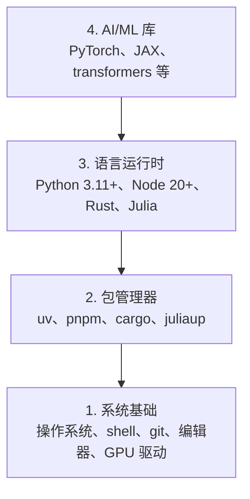

# 开发环境

> 你的工具塑造你的思维。一次配置到位，就配置对。

**类型：** Build
**语言：** Python、Node.js、Rust
**前置要求：** 无
**预计时间：** ~45 分钟

## 学习目标

- 从零搭建 Python 3.11+、Node.js 20+ 和 Rust 工具链
- 配置虚拟环境和包管理器，实现可复现的构建
- 用 CUDA/MPS 验证 GPU 访问，并运行一次测试张量运算
- 理解四层技术栈：系统、包、运行时、AI 库

## 问题所在

你即将用 Python、TypeScript、Rust 和 Julia 学习 200+ 节 AI 工程课程。如果你的环境是坏的，那么每一节课都会变成和工具链的搏斗，而不是学习本身。

大多数人跳过环境搭建。然后他们花上好几个小时去调试 import 错误、版本冲突和缺失的 CUDA 驱动。我们要把这件事一次性做好、做对。

## 核心概念

一个 AI 工程环境有四层：



我们自底向上安装。每一层都依赖它下面的那一层。

## 动手构建

### 第 1 步：系统基础

检查你的系统并安装基础工具。

```bash
# macOS
xcode-select --install
brew install git curl wget

# Ubuntu/Debian
sudo apt update && sudo apt install -y build-essential git curl wget

# Windows（使用 WSL2）
wsl --install -d Ubuntu-24.04
```

### 第 2 步：用 uv 配置 Python

我们使用 `uv` —— 它比 pip 快 10-100 倍，并且自动管理虚拟环境。

```bash
curl -LsSf https://astral.sh/uv/install.sh | sh

uv python install 3.12

uv venv
source .venv/bin/activate  # Windows 上用 .venv\Scripts\activate

uv pip install numpy matplotlib jupyter
```

验证：

```python
import sys
print(f"Python {sys.version}")

import numpy as np
print(f"NumPy {np.__version__}")
a = np.array([1, 2, 3])
print(f"Vector: {a}, dot product with itself: {np.dot(a, a)}")
```

### 第 3 步：用 pnpm 配置 Node.js

用于 TypeScript 课程（agents、MCP 服务器、Web 应用）。

```bash
curl -fsSL https://fnm.vercel.app/install | bash
fnm install 22
fnm use 22

npm install -g pnpm

node -e "console.log('Node', process.version)"
```

### 第 4 步：Rust

用于性能关键的课程（推理、系统）。

```bash
curl --proto '=https' --tlsv1.2 -sSf https://sh.rustup.rs | sh

rustc --version
cargo --version
```

### 第 5 步：Julia（可选）

用于 Julia 大放异彩的数学密集型课程。

```bash
curl -fsSL https://install.julialang.org | sh

julia -e 'println("Julia ", VERSION)'
```

### 第 6 步：GPU 配置（如果你有 GPU）

```bash
# NVIDIA
nvidia-smi

# 安装带 CUDA 的 PyTorch
uv pip install torch torchvision torchaudio --index-url https://download.pytorch.org/whl/cu124
```

```python
import torch
print(f"CUDA available: {torch.cuda.is_available()}")
if torch.cuda.is_available():
    print(f"GPU: {torch.cuda.get_device_name(0)}")
```

没有 GPU？没问题。大多数课程在 CPU 上就能跑。对于训练密集型课程，可以用 Google Colab 或云端 GPU。

### 第 7 步：验证一切

运行验证脚本：

```bash
python phases/00-setup-and-tooling/01-dev-environment/code/verify.py
```

## 上手使用

你的环境现在已经为本课程的每一节课准备就绪。下面是各部分的用途：

| 语言 | 用于 | 包管理器 |
|----------|---------|-----------------|
| Python | 阶段 1-12（ML、DL、NLP、视觉、音频、LLM） | uv |
| TypeScript | 阶段 13-17（工具、Agent、集群、基础设施） | pnpm |
| Rust | 阶段 12、15-17（性能关键系统） | cargo |
| Julia | 阶段 1（数学基础） | Pkg |

## 交付

本节课产出一个验证脚本，任何人都可以运行它来检查自己的配置。

参见 `outputs/prompt-env-check.md`，里面有一个帮助 AI 助手诊断环境问题的提示词。

## 练习

1. 运行验证脚本并修复任何失败项
2. 为本课程创建一个 Python 虚拟环境并安装 PyTorch
3. 用全部四种语言写一个 "hello world" 并各自运行
