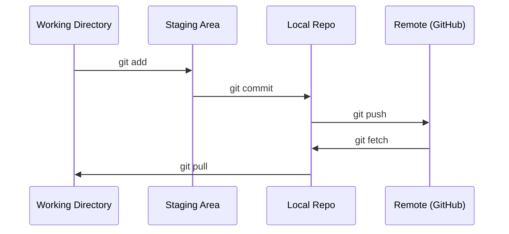

# Git 与协作

> 版本控制不是可选项。你在这里做的每一次实验、每一个模型、每一节课，都会被记录下来。

**类型：** Learn
**语言：** --
**前置要求：** 阶段 0，第 01 课
**预计时间：** ~30 分钟

## 学习目标

- 配置 git 身份，掌握 add、commit、push 的日常工作流
- 创建并合并分支，隔离实验而不破坏 main
- 写一个 `.gitignore`，把模型 checkpoint 和大型二进制文件排除掉
- 用 `git log` 浏览提交历史，看清项目是怎么演化的

## 问题所在

接下来你会在 20 个阶段里写下数百个代码文件。没有版本控制，你会丢失工作、把东西改坏却撤不回来，也没法和别人协作。

Git 是工具，GitHub 是代码存放的地方。这节课只讲本课程需要的部分，多一点都不讲。

## 核心概念



记住三件事：
1. 经常保存（`git commit`）
2. 推到远端（`git push`）
3. 为实验开分支（`git checkout -b experiment`）

## 动手构建

### 第 1 步：配置 git

```bash
git config --global user.name "Your Name"
git config --global user.email "you@example.com"
```

### 第 2 步：日常工作流

```bash
git status
git add file.py
git commit -m "Add perceptron implementation"
git push origin main
```

### 第 3 步：为实验开分支

```bash
git checkout -b experiment/new-optimizer

# ……改代码，提交……

git checkout main
git merge experiment/new-optimizer
```

### 第 4 步：在本课程仓库里干活

```bash
git clone https://github.com/rohitg00/ai-engineering-from-scratch.git
cd ai-engineering-from-scratch

git checkout -b my-progress
# 跟着课程做，提交你的代码
git push origin my-progress
```

## 上手使用

本课程你只需要这几条命令：

| 命令 | 什么时候用 |
|---------|------|
| `git clone` | 拉取课程仓库 |
| `git add` + `git commit` | 保存你的工作 |
| `git push` | 备份到 GitHub |
| `git checkout -b` | 试点东西，又不破坏 main |
| `git log --oneline` | 看看自己做了些什么 |

就这些。这门课不需要 rebase、cherry-pick，也不需要 submodule。

## 练习

1. 克隆这个仓库，创建一个叫 `my-progress` 的分支，建一个文件，提交并推送
2. 写一个 `.gitignore`，排除模型 checkpoint 文件（`.pt`、`.pth`、`.safetensors`）
3. 用 `git log --oneline` 看看这个仓库的提交历史，读一读课程是怎么一节节加进来的

## 关键术语

| 术语 | 大家怎么说 | 它实际是什么 |
|------|----------------|----------------------|
| Commit | "保存" | 在某个时间点对整个项目的一次快照 |
| Branch | "一份拷贝" | 指向某次提交的指针，随着你干活不断前移 |
| Merge | "合并代码" | 把一个分支的改动取过来，应用到另一个分支上 |
| Remote | "云端" | 托管在别处（GitHub、GitLab）的仓库副本 |
