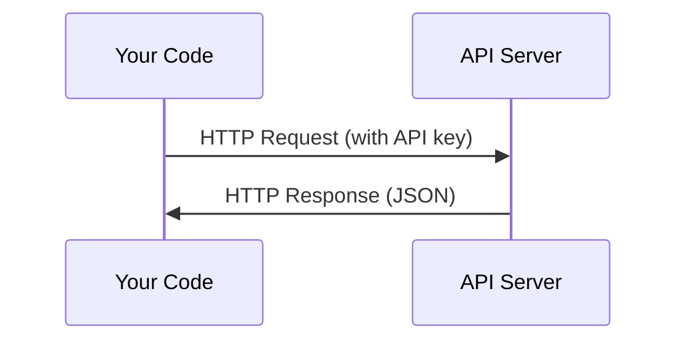

# API 与密钥

> 所有 AI API 的工作方式都一样：发请求，收响应。细节会变，套路不变。

**类型：** Build
**语言：** Python、TypeScript
**前置要求：** 阶段 0，第 01 课
**预计时间：** ~30 分钟

## 学习目标

- 用环境变量和 `.env` 文件安全地存放 API 密钥
- 分别用 Anthropic Python SDK 和原始 HTTP 发起一次 LLM API 调用
- 对比 SDK 和原始 HTTP 的请求/响应格式，方便调试
- 识别并处理常见的 API 错误，包括鉴权失败和限流

## 问题所在

从阶段 11 开始，你会调用各家 LLM API（Anthropic、OpenAI、Google）。在阶段 13-16，你会构建在循环里使用这些 API 的 agent。你得搞清楚 API 密钥是怎么回事、怎么安全存放、以及怎么发出你的第一个 API 调用。

## 核心概念



每一次 API 调用都包含：
1. 一个端点（URL）
2. 一个 API 密钥（鉴权）
3. 一个请求体（你想要什么）
4. 一个响应体（你拿回什么）

## 动手构建

### 第 1 步：安全存放 API 密钥

绝不要把 API 密钥写进代码。用环境变量。

```bash
export ANTHROPIC_API_KEY="sk-ant-..."
export OPENAI_API_KEY="sk-..."
```

或者用 `.env` 文件（记得加进 `.gitignore`）：

```
ANTHROPIC_API_KEY=sk-ant-...
OPENAI_API_KEY=sk-...
```

### 第 2 步：第一个 API 调用（Python）

```python
import anthropic

client = anthropic.Anthropic()

response = client.messages.create(
    model="claude-sonnet-4-20250514",
    max_tokens=256,
    messages=[{"role": "user", "content": "What is a neural network in one sentence?"}]
)

print(response.content[0].text)
```

### 第 3 步：第一个 API 调用（TypeScript）

```typescript
import Anthropic from "@anthropic-ai/sdk";

const client = new Anthropic();

const response = await client.messages.create({
  model: "claude-sonnet-4-20250514",
  max_tokens: 256,
  messages: [{ role: "user", content: "What is a neural network in one sentence?" }],
});

console.log(response.content[0].text);
```

### 第 4 步：原始 HTTP（不用 SDK）

```python
import os
import urllib.request
import json

url = "https://api.anthropic.com/v1/messages"
headers = {
    "Content-Type": "application/json",
    "x-api-key": os.environ["ANTHROPIC_API_KEY"],
    "anthropic-version": "2023-06-01",
}
body = json.dumps({
    "model": "claude-sonnet-4-20250514",
    "max_tokens": 256,
    "messages": [{"role": "user", "content": "What is a neural network in one sentence?"}],
}).encode()

req = urllib.request.Request(url, data=body, headers=headers, method="POST")
with urllib.request.urlopen(req) as resp:
    result = json.loads(resp.read())
    print(result["content"][0]["text"])
```

SDK 在底层干的就是这件事。看懂原始 HTTP 调用，调试时会更得心应手。

## 上手使用

本课程用到：

| API | 什么时候需要 | 免费额度 |
|-----|-----------------|-----------|
| Anthropic (Claude) | 阶段 11-16（agent、工具） | 注册送 $5 额度 |
| OpenAI | 阶段 11（对比） | 注册送 $5 额度 |
| Hugging Face | 阶段 4-10（模型、数据集） | 免费 |

现在不用全都准备好。哪节课要用，就去配哪个。

## 交付

这节课产出：
- `outputs/prompt-api-troubleshooter.md` —— 诊断常见的 API 错误

## 练习

1. 申请一个 Anthropic API 密钥，发出你的第一个 API 调用
2. 试试原始 HTTP 版本，把它的响应格式和 SDK 版本对比一下
3. 故意用一个错误的 API 密钥，读一读报错信息

## 关键术语

| 术语 | 大家怎么说 | 它实际是什么 |
|------|----------------|----------------------|
| API key | "API 的密码" | 一串唯一字符串，标识你的账号并授权请求 |
| Rate limit | "它在限我速" | 每分钟/每小时的最大请求数，防滥用、保公平 |
| Token | "一个词"（在 API 语境下） | 计费单位：输入 token 和输出 token 分开计数、分开计费 |
| Streaming | "实时响应" | 一个词一个词地拿到响应，而不是干等整段返回 |
