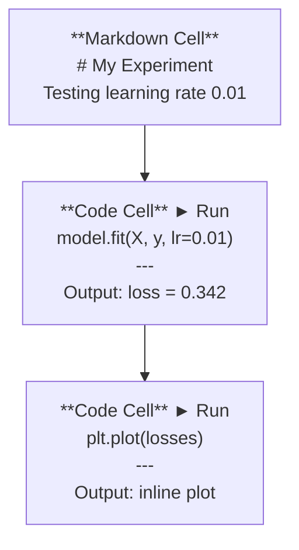
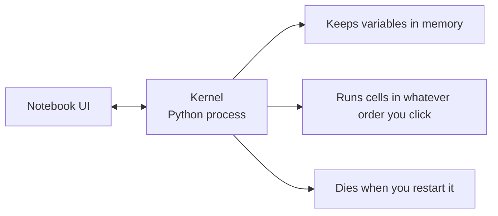

# Jupyter Notebooks

> Notebook 是 AI 工程的实验台。先在这里做原型，再把跑通的东西搬进生产环境。

**类型：** Build
**语言：** Python
**前置要求：** 阶段 0，第 1 课
**预计时间：** ~30 分钟

## 学习目标

- 安装并启动 JupyterLab、Jupyter Notebook，或装了 Jupyter 扩展的 VS Code
- 用魔法命令（`%timeit`、`%%time`、`%matplotlib inline`）做基准测试和内联可视化
- 分清什么时候用 notebook、什么时候用脚本，并践行「在 notebook 里探索，用脚本交付」的工作流
- 识别并避开 notebook 的常见坑：乱序执行、隐藏状态、内存泄漏

## 问题所在

每一篇 AI 论文、每一份教程、每一场 Kaggle 比赛都在用 Jupyter notebook。它让你分块跑代码、内联看输出、把代码和讲解混在一起、快速迭代。学 AI 却不用 notebook，就像做数学作业不打草稿。

但 notebook 有实打实的坑。人们什么都拿它来干，包括那些它根本不擅长的事。知道什么时候该用 notebook、什么时候该用脚本，能帮你日后省下无数调试噩梦。

## 核心概念

一个 notebook 就是一串单元格（cell）。每个 cell 要么是代码，要么是文本。



内核（kernel）是一个在后台运行的 Python 进程。你运行一个 cell，它把代码发给 kernel，kernel 执行后把结果发回来。所有 cell 共享同一个 kernel，所以变量在 cell 之间是保留的。



那个「你点哪个就跑哪个」的特性，既是超能力，也是脚下的地雷。

## 动手构建

### 第 1 步：选你的界面

三种选择，一种格式：

| 界面 | 安装 | 适合 |
|-----------|---------|----------|
| JupyterLab | `pip install jupyterlab` 然后 `jupyter lab` | 完整 IDE 体验，多标签页、文件浏览器、终端 |
| Jupyter Notebook | `pip install notebook` 然后 `jupyter notebook` | 简单、轻量，一次开一个 notebook |
| VS Code | 安装 "Jupyter" 扩展 | 就在你的编辑器里，git 集成、调试 |

三者读写的都是同一个 `.ipynb` 文件。挑你喜欢的就行。JupyterLab 在 AI 工作里最常见。

```bash
pip install jupyterlab
jupyter lab
```

### 第 2 步：真正重要的快捷键

你在两种模式下操作。按 `Escape` 进命令模式（左侧蓝色竖条），按 `Enter` 进编辑模式（绿色竖条）。

**命令模式（最常用）：**

| 按键 | 操作 |
|-----|--------|
| `Shift+Enter` | 运行当前 cell，移到下一个 |
| `A` | 在上方插入 cell |
| `B` | 在下方插入 cell |
| `DD` | 删除 cell |
| `M` | 转为 markdown |
| `Y` | 转为代码 |
| `Z` | 撤销 cell 操作 |
| `Ctrl+Shift+H` | 显示所有快捷键 |

**编辑模式：**

| 按键 | 操作 |
|-----|--------|
| `Tab` | 自动补全 |
| `Shift+Tab` | 显示函数签名 |
| `Ctrl+/` | 注释切换 |

`Shift+Enter` 是你每天要用上千次的那个。先把它学会。

### 第 3 步：cell 类型

**代码 cell** 运行 Python 并显示输出：

```python
import numpy as np
data = np.random.randn(1000)
data.mean(), data.std()
```

输出：`(0.0032, 0.9987)`

**Markdown cell** 渲染格式化文本。用它记录你在做什么、为什么这么做。支持标题、粗体、斜体、LaTeX 数学公式（`$E = mc^2$`）、表格和图片。

### 第 4 步：魔法命令

这些不是 Python。它们是 Jupyter 专属命令，以 `%` 开头（行魔法）或 `%%` 开头（cell 魔法）。

**给代码计时：**

```python
%timeit np.random.randn(10000)
```

输出：`45.2 us +/- 1.3 us per loop`

```python
%%time
model.fit(X_train, y_train, epochs=10)
```

输出：`Wall time: 2.34 s`

`%timeit` 把代码跑很多遍再取平均。`%%time` 只跑一遍。微基准测试用 `%timeit`，训练任务用 `%%time`。

**开启内联绘图：**

```python
%matplotlib inline
```

现在每次 `plt.plot()` 或 `plt.show()` 都会直接渲染在 notebook 里。

**不离开 notebook 就装包：**

```python
!pip install scikit-learn
```

`!` 前缀可以运行任何 shell 命令。

**查看环境变量：**

```python
%env CUDA_VISIBLE_DEVICES
```

### 第 5 步：内联展示富输出

Notebook 会自动显示一个 cell 里的最后一个表达式。但你可以控制它：

```python
import pandas as pd

df = pd.DataFrame({
    "model": ["Linear", "Random Forest", "Neural Net"],
    "accuracy": [0.72, 0.89, 0.94],
    "training_time": [0.1, 2.3, 45.6]
})
df
```

这会渲染成一个格式化的 HTML 表格，而不是一坨文本。绘图也一样：

```python
import matplotlib.pyplot as plt

plt.figure(figsize=(8, 4))
plt.plot([1, 2, 3, 4], [1, 4, 2, 3])
plt.title("Inline Plot")
plt.show()
```

图会出现在 cell 正下方。这正是 notebook 在 AI 工作里独占鳌头的原因：数据、图和代码你能一起看到。

显示图片：

```python
from IPython.display import Image, display
display(Image(filename="architecture.png"))
```

### 第 6 步：Google Colab

Colab 是云端免费的 Jupyter notebook。它给你一块 GPU、预装好的库，还能跟 Google Drive 集成。零配置。

1. 打开 [colab.research.google.com](https://colab.research.google.com)
2. 上传本课程的任意一个 `.ipynb` 文件
3. Runtime > Change runtime type > T4 GPU（免费）

Colab 和本地 Jupyter 的区别：
- 文件不在会话之间保留（存到 Drive 或下载下来）
- 预装：numpy、pandas、matplotlib、torch、tensorflow、sklearn
- `from google.colab import files` 用来上传/下载文件
- `from google.colab import drive; drive.mount('/content/drive')` 用来持久化存储
- 闲置 90 分钟后会话超时（免费版）

## 上手使用

### Notebook 还是脚本：什么时候用哪个

| 用 notebook 干 | 用脚本干 |
|-------------------|-----------------|
| 探索数据集 | 训练流水线 |
| 给模型做原型 | 可复用的工具函数 |
| 可视化结果 | 任何带 `if __name__` 的东西 |
| 讲解你的工作 | 定时运行的代码 |
| 快速实验 | 生产代码 |
| 课程练习 | 包和库 |

铁律：**在 notebook 里探索，用脚本交付**。

AI 里一个常见工作流：
1. 在 notebook 里探索数据
2. 在 notebook 里给模型做原型
3. 一旦跑通，把代码搬到 `.py` 文件里
4. 把这些 `.py` 文件再 import 回 notebook，继续做实验

### 常见的坑

**乱序执行。** 你跑了 cell 5，再跑 cell 2，又跑 cell 7。notebook 在你机器上能跑，但别人从头到尾跑就崩了。修法：分享前先 Kernel > Restart & Run All。

**隐藏状态。** 你删了一个 cell，但它创建的变量还在内存里。notebook 看着干净，实际却依赖一个幽灵 cell。修法：定期重启 kernel。

**内存泄漏。** 加载一个 4GB 数据集，训练一个模型，再加载另一个数据集。什么都没被释放。修法：`del variable_name` 加 `gc.collect()`，或者重启 kernel。

## 交付

本节课产出：
- `outputs/prompt-notebook-helper.md`，用于调试 notebook 问题

## 练习

1. 打开 JupyterLab，建一个 notebook，用 `%timeit` 对比列表推导式和 numpy 创建 100,000 个随机数组的速度
2. 建一个同时含 markdown 和代码 cell 的 notebook，加载一个 CSV、显示一个 dataframe、画一张图。然后跑 Kernel > Restart & Run All，验证它能从头到尾跑通
3. 把 `code/notebook_tips.py` 里的代码粘进一个 Colab notebook，用免费 GPU 跑一遍

## 关键术语

| 术语 | 大家口头怎么说 | 它实际指什么 |
|------|----------------|----------------------|
| Kernel（内核） | "跑我代码的那个东西" | 一个独立的 Python 进程，负责执行 cell 并把变量保存在内存里 |
| Cell（单元格） | "一个代码块" | notebook 里可独立运行的单元，要么是代码，要么是 markdown |
| 魔法命令 | "Jupyter 的小技巧" | 以 `%` 或 `%%` 开头的特殊命令，用来控制 notebook 环境 |
| `.ipynb` | "notebook 文件" | 一个 JSON 文件，包含 cell、输出和元数据。代表 IPython Notebook |

## 延伸阅读

- [JupyterLab Docs](https://jupyterlab.readthedocs.io/)，了解完整功能集
- [Google Colab FAQ](https://research.google.com/colaboratory/faq.html)，了解 Colab 专属的限制和特性
- [28 Jupyter Notebook Tips](https://www.dataquest.io/blog/jupyter-notebook-tips-tricks-shortcuts/)，给高手的快捷键
