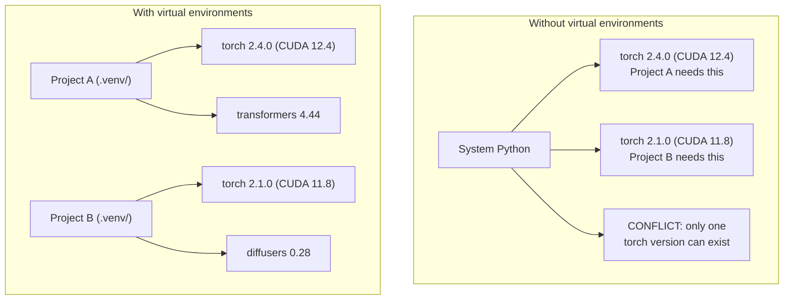

# Python Environments

> 依赖地狱是真实存在的。虚拟环境就是解药。

**类型：** Build
**语言：** Shell
**前置要求：** 阶段 0，第 1 课
**预计时间：** ~30 分钟

## 学习目标

- 用 `uv`、`venv` 或 `conda` 创建隔离的虚拟环境
- 写一个带可选依赖组的 `pyproject.toml`，并生成 lockfile 保证可复现
- 诊断并修复常见陷阱：全局安装、pip/conda 混用、CUDA 版本不匹配
- 为有依赖冲突的项目实施一套按阶段划分的环境策略

## 问题所在

你为一个微调项目装了 PyTorch 2.4。下周，另一个项目需要 PyTorch 2.1，因为它的 CUDA 构建被钉死了。你全局升级，第一个项目崩了。你降级，第二个又崩了。

这就是依赖地狱。它在 AI/ML 工作里时时刻刻都在发生，因为：

- PyTorch、JAX、TensorFlow 各自带着自己的 CUDA 绑定
- 模型库会钉死特定的框架版本
- 一次全局 `pip install` 会覆盖之前装的东西
- CUDA 11.8 的构建跑不动 CUDA 12.x 的驱动（反之亦然）

解法：每个项目都有自己隔离的环境，装自己的包。

## 核心概念



## 动手构建

### 方案 1：uv venv（推荐）

`uv` 是最快的 Python 包管理器（比 pip 快 10-100 倍）。它在一个工具里搞定虚拟环境、Python 版本和依赖求解。

```bash
curl -LsSf https://astral.sh/uv/install.sh | sh

uv python install 3.12

cd your-project
uv venv
source .venv/bin/activate
```

安装包：

```bash
uv pip install torch numpy
```

一步创建一个带 `pyproject.toml` 的项目：

```bash
uv init my-ai-project
cd my-ai-project
uv add torch numpy matplotlib
```

### 方案 2：venv（内置）

如果你没法装 `uv`，Python 自带 `venv`：

```bash
python3 -m venv .venv
source .venv/bin/activate  # Linux/macOS
.venv\Scripts\activate     # Windows

pip install torch numpy
```

比 `uv` 慢，但凡是装了 Python 的地方都能用。

### 方案 3：conda（在你需要它的时候）

Conda 管理非 Python 的依赖，比如 CUDA 工具包、cuDNN 和 C 库。以下情况用它：

- 你需要某个特定的 CUDA 工具包版本，又不想装到系统全局
- 你在一个共享集群上，没法装系统包
- 某个库的安装说明写着「用 conda」

```bash
# 安装 miniconda（不是完整版 Anaconda）
curl -LsSf https://repo.anaconda.com/miniconda/Miniconda3-latest-Linux-x86_64.sh -o miniconda.sh
bash miniconda.sh -b

conda create -n myproject python=3.12
conda activate myproject

conda install pytorch torchvision torchaudio pytorch-cuda=12.4 -c pytorch -c nvidia
```

一条规则：如果某个环境用了 conda，那这个环境里所有的包都用 conda 装。往 conda 环境里混 `pip install` 会引发极其难调的依赖冲突。

### 本课程的做法：按阶段划分策略

你可以为整门课建一个环境。别这么干。不同阶段需要不同的（有时还相互冲突的）依赖。

策略：

```
ai-engineering-from-scratch/
├── .venv/                    <-- 阶段 0-3 共享的轻量环境
├── phases/
│   ├── 04-neural-networks/
│   │   └── .venv/            <-- PyTorch 环境
│   ├── 05-cnns/
│   │   └── .venv/            <-- 同一个 PyTorch 环境（软链接或共享）
│   ├── 08-transformers/
│   │   └── .venv/            <-- 可能需要不同的 transformer 版本
│   └── 11-llm-apis/
│       └── .venv/            <-- API SDK，不需要 torch
```

`code/env_setup.sh` 里的脚本会为本课程创建基础环境。

## pyproject.toml 基础

每个 Python 项目都该有一个 `pyproject.toml`。它一个文件就取代了 `setup.py`、`setup.cfg` 和 `requirements.txt`。

```toml
[project]
name = "ai-engineering-from-scratch"
version = "0.1.0"
requires-python = ">=3.11"
dependencies = [
    "numpy>=1.26",
    "matplotlib>=3.8",
    "jupyter>=1.0",
    "scikit-learn>=1.4",
]

[project.optional-dependencies]
torch = ["torch>=2.3", "torchvision>=0.18"]
llm = ["anthropic>=0.39", "openai>=1.50"]
```

然后安装：

```bash
uv pip install -e ".[torch]"    # 基础 + PyTorch
uv pip install -e ".[llm]"     # 基础 + LLM SDK
uv pip install -e ".[torch,llm]" # 全部
```

## Lockfile

lockfile 把每一个依赖（包括传递依赖）都钉到精确版本。这保证了可复现：任何人从 lockfile 安装，拿到的包都一模一样。

```bash
# 用 uv add 时，uv 会自动生成 uv.lock
uv add numpy

# pip-tools 的做法
uv pip compile pyproject.toml -o requirements.lock
uv pip install -r requirements.lock
```

把 lockfile 提交进 git。别人克隆仓库后，从 lockfile 安装，拿到完全一致的版本。

## 常见错误

### 1. 装到全局

```bash
pip install torch  # 差：装进了系统 Python

source .venv/bin/activate
pip install torch  # 好：装进了虚拟环境
```

检查你的包装到哪去了：

```bash
which python       # 应该显示 .venv/bin/python，而不是 /usr/bin/python
which pip           # 应该显示 .venv/bin/pip
```

### 2. pip 和 conda 混用

```bash
conda create -n myenv python=3.12
conda activate myenv
conda install pytorch -c pytorch
pip install some-other-package   # 差：可能破坏 conda 的依赖追踪
conda install some-other-package # 好：让 conda 管所有东西
```

如果你非得在 conda 里用 pip（有些包只有 pip 版），先装完所有 conda 包，最后再装 pip 包。

### 3. 忘记激活

```bash
python train.py           # 用的是系统 Python，缺包
source .venv/bin/activate
python train.py           # 用的是项目 Python，包都找得到
```

你的 shell 提示符应该显示环境名：

```
(.venv) $ python train.py
```

### 4. 把 .venv 提交进 git

```bash
echo ".venv/" >> .gitignore
```

虚拟环境有 200MB-2GB。它们是本地的，不能在机器之间移植。提交 `pyproject.toml` 和 lockfile 就行。

### 5. CUDA 版本不匹配

```bash
nvidia-smi                # 显示驱动的 CUDA 版本（比如 12.4）
python -c "import torch; print(torch.version.cuda)"  # 显示 PyTorch 的 CUDA 版本

# 这两者必须兼容。
# PyTorch 的 CUDA 版本必须 <= 驱动的 CUDA 版本。
```

## 上手使用

运行配置脚本来创建你的课程环境：

```bash
bash phases/00-setup-and-tooling/06-python-environments/code/env_setup.sh
```

这会在仓库根目录建一个 `.venv`，装好核心依赖并验证通过。

## 练习

1. 运行 `env_setup.sh`，确认所有检查通过
2. 创建第二个虚拟环境，在里面装一个不同版本的 numpy，确认两个环境彼此隔离
3. 为一个同时需要 PyTorch 和 Anthropic SDK 的项目写一个 `pyproject.toml`
4. 故意全局装一个包（不激活 venv），看看它去了哪，然后卸载它

## 关键术语

| 术语 | 大家口头怎么说 | 它实际指什么 |
|------|----------------|----------------------|
| 虚拟环境 | "一个 venv" | 一个隔离的目录，包含一个 Python 解释器和一堆包，跟系统 Python 分开 |
| Lockfile | "钉死的依赖" | 一个列出每个包及其精确版本的文件，保证跨机器安装完全一致 |
| pyproject.toml | "新版 setup.py" | 标准的 Python 项目配置文件，取代了 setup.py/setup.cfg/requirements.txt |
| 传递依赖 | "依赖的依赖" | 包 B 依赖 C；你装了依赖 B 的 A，那 C 就是 A 的传递依赖 |
| CUDA 不匹配 | "我的 GPU 不工作了" | PyTorch 是为另一个 CUDA 版本编译的，跟你 GPU 驱动支持的版本对不上 |
