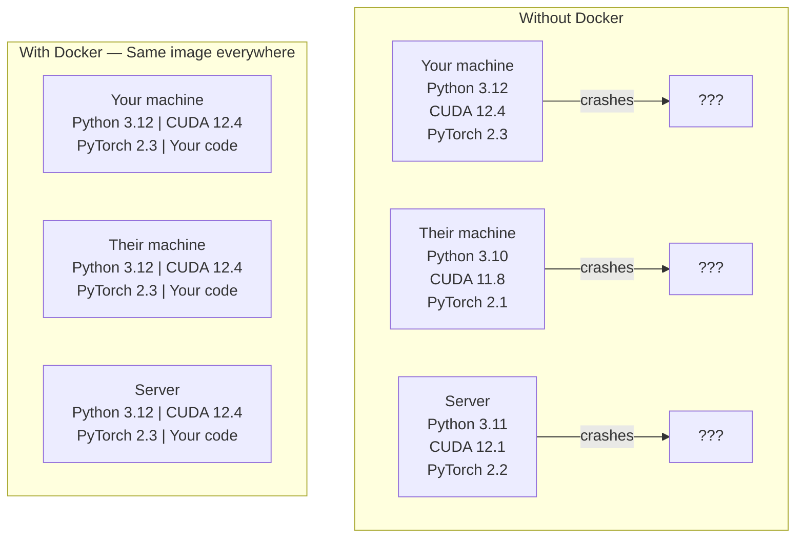

# Docker for AI

> 容器让「在我机器上能跑」成为过去式。

**类型：** Build
**语言：** Docker
**前置要求：** 阶段 0，第 1 课和第 3 课
**预计时间：** ~60 分钟

## 学习目标

- 从一个 Dockerfile 构建带 CUDA、PyTorch 和各种 AI 库的 GPU 镜像
- 把宿主机目录挂载为卷（volume），让模型、数据集和代码在容器重建后依然保留
- 配置 NVIDIA Container Toolkit，把 GPU 暴露进容器
- 用 Docker Compose 编排多服务 AI 应用（推理服务器 + 向量数据库）

## 问题所在

你在自己的笔记本上用 PyTorch 2.3、CUDA 12.4、Python 3.12 训练了一个模型。你同事用的是 PyTorch 2.1、CUDA 11.8、Python 3.10。你的模型在他机器上崩了。但你的 Dockerfile 在两边都能跑。

AI 项目是依赖噩梦。一个典型的技术栈包括 Python、PyTorch、CUDA 驱动、cuDNN、系统级 C 库，还有像 flash-attn 这种需要精确编译器版本的特殊包。Docker 把这一切打包成一个镜像，在哪都跑得一模一样。

## 核心概念

Docker 把你的代码、运行时、库和系统工具包进一个叫容器（container）的隔离单元。可以把它想成一个轻量虚拟机，区别在于它共享宿主机的 OS 内核而不是自己跑一个，所以启动是秒级而非分钟级。



### 为什么 AI 项目比大多数项目更需要 Docker

1. **GPU 驱动很脆弱。** CUDA 12.4 的代码跑不动 CUDA 11.8。Docker 把 CUDA 工具包隔离在容器内部，同时通过 NVIDIA Container Toolkit 共享宿主机的 GPU 驱动。

2. **模型权重很大。** 一个 7B 参数的模型在 fp16 下就是 14 GB。你不会想每次重建都重新下载一遍。Docker 卷让你从宿主机挂载一个 models 目录。

3. **多服务架构很常见。** 一个真实的 AI 应用不只是一个 Python 脚本。它是一个推理服务器，一个给 RAG 用的向量数据库，可能还有一个 Web 前端。Docker Compose 一条命令就把这些全编排起来。

### 关键词汇

| 术语 | 含义 |
|------|---------------|
| Image（镜像） | 一个只读模板。你的配方。从 Dockerfile 构建而来。 |
| Container（容器） | 镜像运行起来的实例。你的厨房。 |
| Dockerfile | 构建镜像的指令。一层一层。 |
| Volume（卷） | 持久化存储，在容器重启后依然存在。 |
| docker-compose | 用 YAML 定义多容器应用的工具。 |

### AI 里常见的容器模式

```
开发容器（Dev Container）
  完整工具链。编辑器支持。Jupyter。调试工具。
  用于开发和实验阶段。

训练容器（Training Container）
  极简。只有训练脚本和依赖。
  跑在 GPU 集群上。没有编辑器，没有 Jupyter。

推理容器（Inference Container）
  为服务而优化。镜像小。冷启动快。
  生产环境里跑在负载均衡器后面。
```

## 动手构建

### 第 1 步：安装 Docker

```bash
# macOS
brew install --cask docker
open /Applications/Docker.app

# Ubuntu
curl -fsSL https://get.docker.com | sh
sudo usermod -aG docker $USER
# 注销再登录，让用户组变更生效
```

验证：

```bash
docker --version
docker run hello-world
```

### 第 2 步：安装 NVIDIA Container Toolkit（带 NVIDIA GPU 的 Linux）

它让 Docker 容器能访问你的 GPU。macOS 和 Windows（WSL2）用户可以跳过；Docker Desktop 在这些平台上用不同的方式处理 GPU 透传。

```bash
distribution=$(. /etc/os-release;echo $ID$VERSION_ID)
curl -fsSL https://nvidia.github.io/libnvidia-container/gpgkey | sudo gpg --dearmor -o /usr/share/keyrings/nvidia-container-toolkit-keyring.gpg
curl -s -L https://nvidia.github.io/libnvidia-container/$distribution/libnvidia-container.list | \
    sed 's#deb https://#deb [signed-by=/usr/share/keyrings/nvidia-container-toolkit-keyring.gpg] https://#g' | \
    sudo tee /etc/apt/sources.list.d/nvidia-container-toolkit.list

sudo apt-get update
sudo apt-get install -y nvidia-container-toolkit
sudo nvidia-ctk runtime configure --runtime=docker
sudo systemctl restart docker
```

测试容器内的 GPU 访问：

```bash
docker run --rm --gpus all nvidia/cuda:12.4.1-base-ubuntu22.04 nvidia-smi
```

如果你看到了自己的 GPU 信息，说明 toolkit 正常工作。

### 第 3 步：理解基础镜像

选对基础镜像能省下好几个小时的调试。

```
nvidia/cuda:12.4.1-devel-ubuntu22.04
  完整 CUDA 工具包。带编译器。
  用于：构建需要 nvcc 的包（flash-attn、bitsandbytes）
  大小：~4 GB

nvidia/cuda:12.4.1-runtime-ubuntu22.04
  只有 CUDA 运行时。没有编译器。
  用于：运行预构建好的代码
  大小：~1.5 GB

pytorch/pytorch:2.3.1-cuda12.4-cudnn9-runtime
  在 CUDA 之上预装了 PyTorch。
  用于：跳过装 PyTorch 这一步
  大小：~6 GB

python:3.12-slim
  没有 CUDA。纯 CPU。
  用于：CPU 推理、轻量工具
  大小：~150 MB
```

### 第 4 步：为 AI 开发写一个 Dockerfile

这是 `code/Dockerfile` 里的 Dockerfile。逐段过一遍：

```dockerfile
FROM nvidia/cuda:12.4.1-devel-ubuntu22.04

ENV DEBIAN_FRONTEND=noninteractive
ENV PYTHONUNBUFFERED=1

RUN apt-get update && apt-get install -y --no-install-recommends \
    python3.12 \
    python3.12-venv \
    python3.12-dev \
    python3-pip \
    git \
    curl \
    build-essential \
    && rm -rf /var/lib/apt/lists/*

RUN update-alternatives --install /usr/bin/python python /usr/bin/python3.12 1

RUN python -m pip install --no-cache-dir --upgrade pip setuptools wheel

RUN python -m pip install --no-cache-dir \
    torch==2.3.1 \
    torchvision==0.18.1 \
    torchaudio==2.3.1 \
    --index-url https://download.pytorch.org/whl/cu124

RUN python -m pip install --no-cache-dir \
    numpy \
    pandas \
    scikit-learn \
    matplotlib \
    jupyter \
    transformers \
    datasets \
    accelerate \
    safetensors

WORKDIR /workspace

VOLUME ["/workspace", "/models"]

EXPOSE 8888

CMD ["python"]
```

构建它：

```bash
docker build -t ai-dev -f phases/00-setup-and-tooling/07-docker-for-ai/code/Dockerfile .
```

第一次会花点时间（下载 CUDA 基础镜像 + PyTorch）。之后的构建会用缓存层。

运行它：

```bash
docker run --rm -it --gpus all \
    -v $(pwd):/workspace \
    -v ~/models:/models \
    ai-dev python -c "import torch; print(f'PyTorch {torch.__version__}, CUDA: {torch.cuda.is_available()}')"
```

在容器内跑 Jupyter：

```bash
docker run --rm -it --gpus all \
    -v $(pwd):/workspace \
    -v ~/models:/models \
    -p 8888:8888 \
    ai-dev jupyter notebook --ip=0.0.0.0 --port=8888 --no-browser --allow-root
```

### 第 5 步：给数据和模型挂载卷

卷挂载对 AI 工作至关重要。没有它，你那 14 GB 的模型下载会在容器停止时消失得无影无踪。

```bash
# 挂载你的代码
-v $(pwd):/workspace

# 挂载一个共享的 models 目录
-v ~/models:/models

# 挂载数据集
-v ~/datasets:/data
```

在你的训练脚本里，从挂载的路径加载：

```python
from transformers import AutoModel

model = AutoModel.from_pretrained("/models/llama-7b")
```

模型存在你宿主机的文件系统上。你想重建多少次容器都行，不用重新下载。

### 第 6 步：用 Docker Compose 跑多服务 AI 应用

一个真实的 RAG 应用需要一个推理服务器和一个向量数据库。Docker Compose 一条命令把两个都跑起来。

参见 `code/docker-compose.yml`：

```yaml
services:
  ai-dev:
    build:
      context: .
      dockerfile: Dockerfile
    deploy:
      resources:
        reservations:
          devices:
            - driver: nvidia
              count: all
              capabilities: [gpu]
    volumes:
      - ../../../:/workspace
      - ~/models:/models
      - ~/datasets:/data
    ports:
      - "8888:8888"
    stdin_open: true
    tty: true
    command: jupyter notebook --ip=0.0.0.0 --port=8888 --no-browser --allow-root

  qdrant:
    image: qdrant/qdrant:v1.12.5
    ports:
      - "6333:6333"
      - "6334:6334"
    volumes:
      - qdrant_data:/qdrant/storage

volumes:
  qdrant_data:
```

把所有东西都启动起来：

```bash
cd phases/00-setup-and-tooling/07-docker-for-ai/code
docker compose up -d
```

现在你的 AI 开发容器可以用服务名在 `http://qdrant:6333` 访问到向量数据库。Docker Compose 会自动创建一个共享网络。

从 AI 容器内部测试连接：

```python
from qdrant_client import QdrantClient

client = QdrantClient(host="qdrant", port=6333)
print(client.get_collections())
```

把所有东西停掉：

```bash
docker compose down
```

加上 `-v` 还会一并删掉 qdrant 卷：

```bash
docker compose down -v
```

### 第 7 步：AI 工作里好用的 Docker 命令

```bash
# 列出运行中的容器
docker ps

# 列出所有镜像及其大小
docker images

# 删除未使用的镜像（回收磁盘空间）
docker system prune -a

# 查看运行中容器内的 GPU 使用情况
docker exec -it <container_id> nvidia-smi

# 把文件从容器拷到宿主机
docker cp <container_id>:/workspace/results.csv ./results.csv

# 查看容器日志
docker logs -f <container_id>
```

## 上手使用

你现在有了一个可复现的 AI 开发环境。本课程接下来：

- 用 `docker compose up` 同时启动你的开发环境和向量数据库
- 把代码、模型和数据挂载为卷，重建之间什么都不丢
- 当某节课需要一个新的 Python 包时，把它加进 Dockerfile 再重建
- 把你的 Dockerfile 分享给队友。他们拿到的是一模一样的环境。

### 没有 GPU？

去掉 `--gpus all` 标志和 NVIDIA 的 deploy 块。容器照样能跑基于 CPU 的课。PyTorch 检测到没有 CUDA 会自动回退到 CPU。

## 练习

1. 构建这个 Dockerfile，在容器里运行 `python -c "import torch; print(torch.__version__)"`
2. 启动 docker-compose 栈，验证从 AI 容器能在 `http://qdrant:6333/collections` 访问到 Qdrant
3. 往 Dockerfile 里加上 `flask`，重建，在 5000 端口跑一个简单的 API 服务器。用 `-p 5000:5000` 映射端口
4. 用 `docker images` 量一下镜像大小。试着把基础镜像从 `devel` 换成 `runtime`，对比两者大小

## 关键术语

| 术语 | 大家口头怎么说 | 它实际指什么 |
|------|----------------|----------------------|
| 容器 | "轻量虚拟机" | 一个用宿主机内核的隔离进程，有自己的文件系统和网络 |
| 镜像层 | "缓存的步骤" | 每条 Dockerfile 指令创建一层。没变的层会被缓存，所以重建很快。 |
| NVIDIA Container Toolkit | "Docker 里的 GPU" | 一个运行时钩子，通过 `--gpus` 标志把宿主机 GPU 暴露给容器 |
| 卷挂载 | "共享文件夹" | 宿主机上的一个目录映射进容器。改动在容器停止后依然保留。 |
| 基础镜像 | "起点" | 你 Dockerfile 里 `FROM` 的那个镜像。决定了预装了什么。 |
