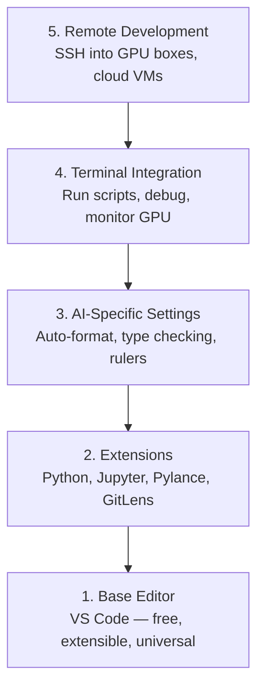

# Editor Setup

> 你的编辑器是你的副驾驶。配置一次，让它不再碍事，开始帮你出力。

**类型：** Build
**语言：** --
**前置要求：** 阶段 0，第 1 课
**预计时间：** ~20 分钟

## 学习目标

- 安装 VS Code，配齐 Python、Jupyter、linting 和远程 SSH 的核心扩展
- 为 AI 工作流配置保存时格式化、类型检查和 notebook 输出滚动
- 配好 Remote SSH，像操作本地一样在远程 GPU 机器上编辑和调试代码
- 评估其他编辑器（Cursor、Windsurf、Neovim）以及它们在 AI 工作中的取舍

## 问题所在

你会在编辑器里花上数千小时写 Python、跑 notebook、调训练循环、SSH 进 GPU 机器。一个没配好的编辑器会把每次开工都变成阻力：没有自动补全、没有类型提示、没有内联报错、手动格式化，还有一个别扭的终端工作流。

配好它要 20 分钟。不配，每天都要赔上 20 分钟。

## 核心概念

一套 AI 工程的编辑器配置需要五样东西：



## 动手构建

### 第 1 步：安装 VS Code

VS Code 是推荐的编辑器。它免费、跑在所有操作系统上、有一流的 Jupyter notebook 支持，扩展生态覆盖了 AI 工作所需的一切。

从 [code.visualstudio.com](https://code.visualstudio.com/) 下载。

在终端里验证：

```bash
code --version
```

如果 macOS 上找不到 `code`，打开 VS Code，按 `Cmd+Shift+P`，输入 "Shell Command"，选 "Install 'code' command in PATH"。

### 第 2 步：安装核心扩展

在 VS Code 里打开集成终端（`Ctrl+`` ` 或 `` Cmd+` ``），装上对 AI 工作要紧的扩展：

```bash
code --install-extension ms-python.python
code --install-extension ms-python.vscode-pylance
code --install-extension ms-toolsai.jupyter
code --install-extension eamodio.gitlens
code --install-extension ms-vscode-remote.remote-ssh
code --install-extension ms-python.debugpy
code --install-extension ms-python.black-formatter
code --install-extension charliermarsh.ruff
```

每个分别干什么：

| 扩展 | 为什么 |
|-----------|-----|
| Python | 语言支持、虚拟环境检测、运行/调试 |
| Pylance | 快速类型检查、自动补全、import 解析 |
| Jupyter | 在 VS Code 里跑 notebook，变量浏览器 |
| GitLens | 看谁改了什么，内联 git blame |
| Remote SSH | 像操作本地一样打开远程 GPU 机器上的文件夹 |
| Debugpy | Python 的单步调试 |
| Black Formatter | 保存时自动格式化，风格统一 |
| Ruff | 快速 linting，抓常见错误 |

本节课里的 `code/.vscode/extensions.json` 包含完整的推荐列表。你打开项目文件夹时，VS Code 会提示你安装它们。

### 第 3 步：配置设置

从本节课的 `code/.vscode/settings.json` 复制设置，或者通过 `Settings > Open Settings (JSON)` 手动应用。

AI 工作的关键设置：

```jsonc
{
    "python.analysis.typeCheckingMode": "basic",
    "editor.formatOnSave": true,
    "editor.rulers": [88, 120],
    "notebook.output.scrolling": true,
    "files.autoSave": "afterDelay"
}
```

它们为什么要紧：

- **类型检查设为 basic**：在你运行之前就抓出参数类型错误。在张量形状不匹配和 API 参数写错上能省下调试时间。
- **保存时格式化**：再也不用操心格式。Black 全包了。
- **88 和 120 处的标尺**：Black 在 88 处换行。120 那条线提示你 docstring 和注释什么时候太长了。
- **notebook 输出滚动**：训练循环会打印上千行。没有滚动，输出面板会爆。
- **自动保存**：你会忘了保存。你的训练脚本会跑旧代码。自动保存能防住这个。

### 第 4 步：终端集成

VS Code 的集成终端是你跑训练脚本、盯 GPU、管环境的地方。

把它配好：

```jsonc
{
    "terminal.integrated.defaultProfile.osx": "zsh",
    "terminal.integrated.defaultProfile.linux": "bash",
    "terminal.integrated.fontSize": 13,
    "terminal.integrated.scrollback": 10000
}
```

好用的快捷键：

| 操作 | macOS | Linux/Windows |
|--------|-------|---------------|
| 切换终端 | `` Ctrl+` `` | `` Ctrl+` `` |
| 新建终端 | `Ctrl+Shift+`` ` | `Ctrl+Shift+`` ` |
| 拆分终端 | `Cmd+\` | `Ctrl+\` |

拆分终端很有用：一个跑你的脚本，一个用 `nvidia-smi -l 1` 或 `watch -n 1 nvidia-smi` 盯 GPU。

### 第 5 步：远程开发（SSH 进 GPU 机器）

这是 AI 工作里最重要的扩展。你会在远程机器上跑训练（云 VM、实验室服务器、Lambda、Vast.ai）。Remote SSH 让你打开远程文件系统、编辑文件、跑终端、调试，就像这一切都在本地。

配置：

1. 装 Remote SSH 扩展（第 2 步已经做了）。
2. 按 `Ctrl+Shift+P`（或 `Cmd+Shift+P`），输入 "Remote-SSH: Connect to Host"。
3. 输入 `user@your-gpu-box-ip`。
4. VS Code 会自动在远程机器上装它的服务端组件。

要免密访问，配上 SSH 密钥：

```bash
ssh-keygen -t ed25519 -C "your-email@example.com"
ssh-copy-id user@your-gpu-box-ip
```

把主机加进 `~/.ssh/config`，省事：

```
Host gpu-box
    HostName 203.0.113.50
    User ubuntu
    IdentityFile ~/.ssh/id_ed25519
    ForwardAgent yes
```

现在 `Remote-SSH: Connect to Host > gpu-box` 一下就连上了。

## 其他选择

### Cursor

[cursor.com](https://cursor.com) 是 VS Code 的一个分支，内置了 AI 代码生成。它用的是同一套扩展生态和设置格式。如果你用 Cursor，本节课的一切照样适用。导入同样的 `settings.json` 和 `extensions.json` 就行。

### Windsurf

[windsurf.com](https://windsurf.com) 是另一个 AI 优先的 VS Code 分支。同样的套路：同样的扩展、同样的设置格式、同样支持 Remote SSH。

### Vim/Neovim

如果你已经在用 Vim 或 Neovim 而且用得很顺手，那就留在那里。AI Python 工作的最低配置：

- **pyright** 或 **pylsp** 做类型检查（通过 Mason 或手动安装）
- **nvim-lspconfig** 做语言服务器集成
- **jupyter-vim** 或 **molten-nvim** 做类 notebook 的执行
- **telescope.nvim** 做文件/符号搜索
- **none-ls.nvim** 配 black 和 ruff 做格式化/linting

如果你还没在用 Vim，现在别开始。它的学习曲线会跟学 AI 工程抢精力。用 VS Code。

## 上手使用

有了这套配置，你的日常工作流是这样：

1. 在 VS Code 里打开项目文件夹（或通过 Remote SSH 连到一台 GPU 机器）。
2. 在编辑器里写 Python，带自动补全、类型提示和内联报错。
3. 用 Jupyter 扩展内联跑 notebook。
4. 用集成终端跑训练脚本、`uv pip install` 和 GPU 监控。
5. 提交前用 GitLens 审阅改动。

## 练习

1. 安装 VS Code 和第 2 步里列出的所有扩展
2. 把本节课的 `settings.json` 复制进你的 VS Code 配置
3. 打开一个 Python 文件，验证 Pylance 显示类型提示、Black 在保存时格式化
4. 如果你有一台远程机器可用，配好 Remote SSH 并打开它上面的一个文件夹

## 关键术语

| 术语 | 大家口头怎么说 | 它实际指什么 |
|------|----------------|----------------------|
| LSP | "自动补全引擎" | 语言服务器协议（Language Server Protocol）：一套标准，让编辑器从特定语言的服务器获取类型信息、补全和诊断 |
| Pylance | "那个 Python 插件" | 微软的 Python 语言服务器，用 Pyright 做类型检查和 IntelliSense |
| Remote SSH | "在服务器上干活" | VS Code 扩展，在远程机器上跑一个轻量服务端，把 UI 串流到你的本地编辑器 |
| 保存时格式化 | "自动 prettier" | 你每次保存时编辑器跑一个格式化器（Black、Ruff），让代码风格始终一致 |
