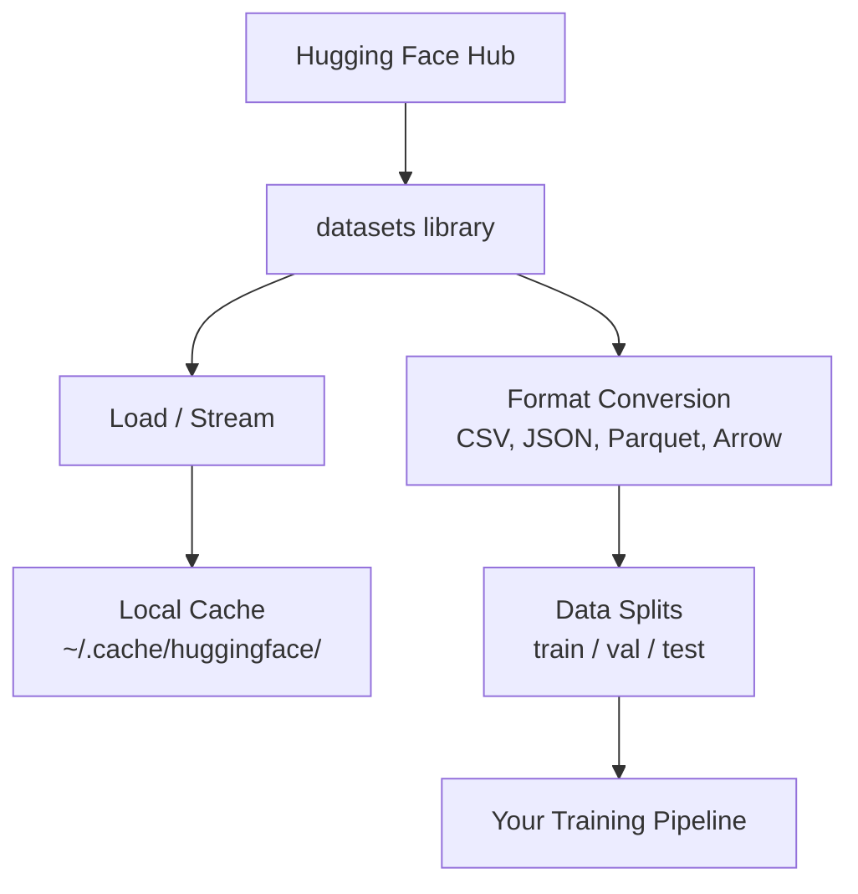

# Data Management

> 数据是燃料。你怎么管理它，决定你能跑多快。

**类型：** Build
**语言：** Python
**前置要求：** 阶段 0，第 1 课
**预计时间：** ~45 分钟

## 学习目标

- 用 Hugging Face `datasets` 库加载、流式读取和缓存数据集
- 在 CSV、JSON、Parquet 和 Arrow 格式之间转换，并讲清它们各自的取舍
- 用固定随机种子创建可复现的 train/validation/test 划分
- 用 `.gitignore`、Git LFS 或 DVC 管理大模型和大数据集文件

## 问题所在

每个 AI 项目都从数据开始。你得找数据集、下载它们、在格式之间转换、为训练和评估划分它们，还要给它们做版本管理好让实验可复现。每次都手动来做又慢又容易出错。你需要一个可重复的工作流。

## 核心概念



Hugging Face 的 `datasets` 库是 AI 工作里加载数据的标准方式。它开箱就处理好下载、缓存、格式转换和流式读取。

## 动手构建

### 第 1 步：安装 datasets 库

```bash
pip install datasets huggingface_hub
```

### 第 2 步：加载一个数据集

```python
from datasets import load_dataset

dataset = load_dataset("imdb")
print(dataset)
print(dataset["train"][0])
```

这会下载 IMDB 影评数据集。第一次下载之后，它会从 `~/.cache/huggingface/datasets/` 的缓存加载。

### 第 3 步：流式读取大数据集

有些数据集大到放不下磁盘。流式读取一行一行地加载它们，不用下载整个东西。

```python
dataset = load_dataset("wikimedia/wikipedia", "20220301.en", split="train", streaming=True)

for i, example in enumerate(dataset):
    print(example["title"])
    if i >= 4:
        break
```

流式读取给你一个 `IterableDataset`。数据来一行你处理一行。不管数据集多大，内存占用都是恒定的。

### 第 4 步：数据集格式

`datasets` 库底层用的是 Apache Arrow。你可以根据流水线的需要转成其他格式。

```python
dataset = load_dataset("imdb", split="train")

dataset.to_csv("imdb_train.csv")
dataset.to_json("imdb_train.json")
dataset.to_parquet("imdb_train.parquet")
```

格式对比：

| 格式 | 大小 | 读取速度 | 适合 |
|--------|------|-----------|----------|
| CSV | 大 | 慢 | 人类可读、电子表格 |
| JSON | 大 | 慢 | API、嵌套数据 |
| Parquet | 小 | 快 | 分析、列式查询 |
| Arrow | 小 | 最快 | 内存中处理（`datasets` 内部用的就是它） |

对 AI 工作来说，Parquet 是最好的存储格式。Arrow 是你在内存里打交道的东西。CSV 和 JSON 用来交换。

### 第 5 步：数据划分

每个 ML 项目都需要三个划分：

- **Train（训练）**：模型从这上面学习（通常 80%）
- **Validation（验证）**：训练过程中你用它查进度（通常 10%）
- **Test（测试）**：训练结束后的最终评估（通常 10%）

有些数据集自带划分。没有的时候，自己来划：

```python
dataset = load_dataset("imdb", split="train")

split = dataset.train_test_split(test_size=0.2, seed=42)
train_val = split["train"].train_test_split(test_size=0.125, seed=42)

train_ds = train_val["train"]
val_ds = train_val["test"]
test_ds = split["test"]

print(f"Train: {len(train_ds)}, Val: {len(val_ds)}, Test: {len(test_ds)}")
```

为了可复现，永远设一个种子。同一个种子每次产出同样的划分。

### 第 6 步：下载并缓存模型

模型是大文件。`huggingface_hub` 库负责下载和缓存。

```python
from huggingface_hub import hf_hub_download, snapshot_download

model_path = hf_hub_download(
    repo_id="sentence-transformers/all-MiniLM-L6-v2",
    filename="config.json"
)
print(f"Cached at: {model_path}")

model_dir = snapshot_download("sentence-transformers/all-MiniLM-L6-v2")
print(f"Full model at: {model_dir}")
```

模型缓存到 `~/.cache/huggingface/hub/`。下载一次后，后续运行就秒加载。

### 第 7 步：处理大文件

模型权重和大数据集不该进 git。三种选择：

**方案 A：.gitignore（最简单）**

```
*.bin
*.safetensors
*.pt
*.onnx
data/*.parquet
data/*.csv
models/
```

**方案 B：Git LFS（用 git 追踪大文件）**

```bash
git lfs install
git lfs track "*.bin"
git lfs track "*.safetensors"
git add .gitattributes
```

Git LFS 在你仓库里存指针，实际文件存在另一台服务器上。GitHub 免费给你 1 GB。

**方案 C：DVC（数据版本控制）**

```bash
pip install dvc
dvc init
dvc add data/training_set.parquet
git add data/training_set.parquet.dvc data/.gitignore
git commit -m "Track training data with DVC"
```

DVC 创建指向你数据的小 `.dvc` 文件。数据本身存在 S3、GCS 或其他远端存储后端。

| 做法 | 复杂度 | 适合 |
|----------|-----------|----------|
| .gitignore | 低 | 个人项目、能重新拉取的下载数据 |
| Git LFS | 中 | 团队通过 git 共享模型权重 |
| DVC | 高 | 可复现的实验、大数据集、团队 |

本课程用 `.gitignore` 就够了。当你需要在多台机器上复现完全一致的实验时再用 DVC。

### 第 8 步：存储模式

**本地存储** 适合 ~10 GB 以下的数据集。HF 缓存自动搞定这个。

**云存储** 用于更大的、或者要在多台机器间共享的数据：

```python
import os

local_path = os.path.expanduser("~/.cache/huggingface/datasets/")

# s3_path = "s3://my-bucket/datasets/"
# gcs_path = "gs://my-bucket/datasets/"
```

DVC 直接和 S3、GCS 集成：

```bash
dvc remote add -d myremote s3://my-bucket/dvc-store
dvc push
```

本课程用本地存储就够。当你在远程 GPU 实例上微调时，云存储才变得相关。

## 本课程用到的数据集

| 数据集 | 课次 | 大小 | 教什么 |
|---------|---------|------|----------------|
| IMDB | 分词、分类 | 84 MB | 文本分类基础 |
| WikiText | 语言建模 | 181 MB | 下一个 token 预测 |
| SQuAD | 问答系统 | 35 MB | 问答、片段（span） |
| Common Crawl（子集） | 嵌入（embedding） | 不定 | 大规模文本处理 |
| MNIST | 视觉基础 | 21 MB | 图像分类基本功 |
| COCO（子集） | 多模态 | 不定 | 图文对 |

你现在不用把这些都下下来。每节课会说明它需要什么。

## 上手使用

运行工具脚本来验证一切正常：

```bash
python code/data_utils.py
```

这会下载一个小数据集，转换它、划分它，并打印一份摘要。

## 交付

本节课产出：
- `code/data_utils.py` —— 可复用的数据加载和缓存工具
- `outputs/prompt-data-helper.md` —— 为某个任务找到合适数据集的提示词

## 练习

1. 用 `mrpc` 配置加载 `glue` 数据集，查看前 5 条样本
2. 流式读取 `c4` 数据集，数一数 10 秒内你能处理多少条样本
3. 把一个数据集转成 Parquet，对比它和 CSV 的文件大小
4. 用固定种子创建一个 70/15/15 的 train/val/test 划分，验证各部分大小

## 关键术语

| 术语 | 大家口头怎么说 | 它实际指什么 |
|------|----------------|----------------------|
| 数据划分（split） | "训练数据" | 一个有名字的子集（train/val/test），在 ML 生命周期的不同阶段使用 |
| 流式读取（streaming） | "懒加载" | 从远端源一行一行地处理数据，不下载整个数据集 |
| Parquet | "压缩版 CSV" | 一种列式文件格式，为分析查询和存储效率而优化 |
| Arrow | "快速 dataframe" | 一种内存中的列式格式，datasets 库内部用它做零拷贝读取 |
| Git LFS | "大文件版 git" | 一个扩展，把大文件存在 git 仓库外，同时在版本控制里保留指针 |
| DVC | "数据版的 git" | 一套面向数据集和模型的版本控制系统，和云存储集成 |
| 缓存（cache） | "已经下过了" | 之前拉取过的数据的本地副本，默认存在 ~/.cache/huggingface/ |
