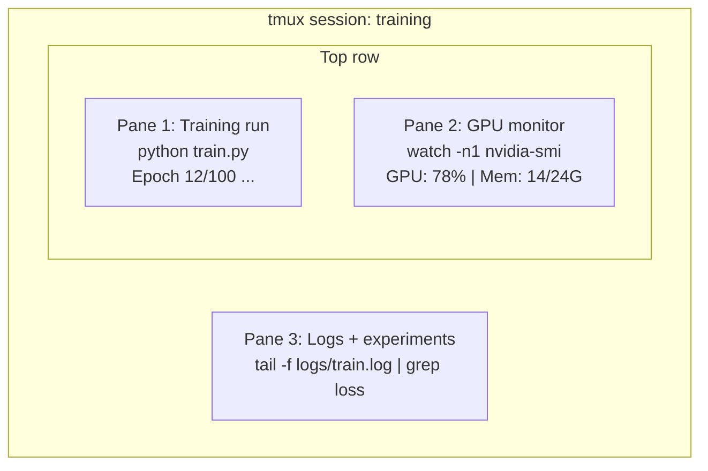

# Terminal & Shell

> 终端是 AI 工程师生活的地方。在这儿待舒服点。

**类型：** Learn
**语言：** --
**前置要求：** 阶段 0，第 1 课
**预计时间：** ~35 分钟

## 学习目标

- 用管道、重定向和 `grep` 在命令行里过滤和处理训练日志
- 创建带多个窗格的持久化 tmux 会话，同时跑训练和 GPU 监控
- 用 `htop`、`nvtop` 和 `nvidia-smi` 监控系统和 GPU 资源
- 用 SSH、`scp` 和 `rsync` 在本地和远程机器之间传文件

## 问题所在

你待在终端里的时间会比待在任何编辑器里都长。训练任务、GPU 监控、日志跟踪、远程 SSH 会话、环境管理。每个 AI 工作流都要碰 shell。你在这儿慢，你哪儿都慢。

这节课讲对 AI 工作要紧的终端技能。没有 Unix 历史。没有 Bash 脚本的深挖。只讲你需要的。

## 核心概念



三样东西同时跑。一个终端。你可以分离（detach）、回家、再 SSH 回来、重新接上（reattach）。训练一直在跑。

## 动手构建

### 第 1 步：了解你的 shell

看看你跑的是哪个 shell：

```bash
echo $SHELL
```

大多数系统用 `bash` 或 `zsh`。两个都行。本课程的命令在哪个里都能跑。

需要知道的要点：

```bash
# 四处移动
cd ~/projects/ai-engineering-from-scratch
pwd
ls -la

# 历史搜索（你会学到的最有用的快捷键）
# Ctrl+R 然后输入之前命令的一部分
# 再按 Ctrl+R 循环切换匹配项

# 清屏
clear   # 或 Ctrl+L

# 取消正在运行的命令
# Ctrl+C

# 挂起正在运行的命令（用 fg 恢复）
# Ctrl+Z
```

### 第 2 步：管道和重定向

管道把命令连在一起。这就是你处理日志、过滤输出、串联工具的方式。你会一直用它。

```bash
# 数一数 "loss" 在日志里出现了多少次
cat train.log | grep "loss" | wc -l

# 从训练输出里只抽出 loss 值
grep "loss:" train.log | awk '{print $NF}' > losses.txt

# 实时看一个日志文件的更新，并过滤出错误
tail -f train.log | grep --line-buffered "ERROR"

# 按最终准确率给实验排序
grep "final_accuracy" results/*.log | sort -t= -k2 -n -r

# 把 stdout 和 stderr 重定向到不同文件
python train.py > output.log 2> errors.log

# 把两者重定向到同一个文件
python train.py > train_full.log 2>&1
```

你需要的三个重定向：

| 符号 | 它干什么 |
|--------|-------------|
| `>` | 把 stdout 写入文件（覆盖） |
| `>>` | 把 stdout 追加到文件 |
| `2>` | 把 stderr 写入文件 |
| `2>&1` | 把 stderr 送到 stdout 所去的同一个地方 |
| `\|` | 把一个命令的 stdout 作为下一个命令的 stdin |

### 第 3 步：后台进程

训练任务要跑好几个小时。你不会想全程开着终端。

```bash
# 在后台运行（输出仍然打到终端）
python train.py &

# 在后台运行，不受挂断信号影响（关终端也不会杀掉它）
nohup python train.py > train.log 2>&1 &

# 查看后台在跑什么
jobs
ps aux | grep train.py

# 把一个后台任务拉到前台
fg %1

# 杀掉一个后台进程
kill %1
# 或者找到它的 PID 再杀
kill $(pgrep -f "train.py")
```

`&`、`nohup` 和 `screen`/`tmux` 的区别：

| 方法 | 终端关了还活着吗？ | 能重新接上吗？ |
|--------|-------------------------|---------------|
| `command &` | 否 | 否 |
| `nohup command &` | 是 | 否（看日志文件） |
| `screen` / `tmux` | 是 | 是 |

任何超过几分钟的东西，都用 tmux。

### 第 4 步：tmux

tmux 让你创建带多个窗格的持久化终端会话。这是管理训练任务最有用的单个工具。

```bash
# 安装
# macOS
brew install tmux
# Ubuntu
sudo apt install tmux

# 启动一个命名会话
tmux new -s training

# 水平拆分
# Ctrl+B 然后 "

# 垂直拆分
# Ctrl+B 然后 %

# 在窗格间移动
# Ctrl+B 然后方向键

# 分离（会话继续跑）
# Ctrl+B 然后 d

# 重新接上
tmux attach -t training

# 列出会话
tmux ls

# 杀掉一个会话
tmux kill-session -t training
```

一个典型的 AI 工作流会话：

```bash
tmux new -s train

# 窗格 1：开始训练
python train.py --epochs 100 --lr 1e-4

# Ctrl+B, " 拆分，然后跑 GPU 监控
watch -n1 nvidia-smi

# Ctrl+B, % 垂直拆分，跟踪日志
tail -f logs/experiment.log

# 现在用 Ctrl+B, d 分离
# SSH 出去，去喝杯咖啡，再回来
# tmux attach -t train
```

### 第 5 步：用 htop 和 nvtop 监控

```bash
# 系统进程（比 top 好）
htop

# GPU 进程（如果你有 NVIDIA GPU）
# 安装：sudo apt install nvtop（Ubuntu）或 brew install nvtop（macOS）
nvtop

# 没有 nvtop 时快速查 GPU
nvidia-smi

# 每秒刷新一次看 GPU 使用情况
watch -n1 nvidia-smi

# 看哪些进程在用 GPU
nvidia-smi --query-compute-apps=pid,name,used_memory --format=csv
```

你会用到的 `htop` 快捷键：
- `F6` 或 `>` 按列排序（按内存排序找内存泄漏）
- `F5` 切换树状视图（看子进程）
- `F9` 杀掉一个进程
- `/` 搜索进程名

### 第 6 步：用 SSH 连远程 GPU 机器

你租一块云 GPU 时（Lambda、RunPod、Vast.ai），通过 SSH 连接。

```bash
# 基本连接
ssh user@gpu-box-ip

# 用指定的密钥
ssh -i ~/.ssh/my_gpu_key user@gpu-box-ip

# 把文件拷到远程
scp model.pt user@gpu-box-ip:~/models/

# 把文件从远程拷下来
scp user@gpu-box-ip:~/results/metrics.json ./

# 同步整个目录（文件多时更快）
rsync -avz ./data/ user@gpu-box-ip:~/data/

# 端口转发（本地访问远程的 Jupyter/TensorBoard）
ssh -L 8888:localhost:8888 user@gpu-box-ip
# 现在在浏览器里打开 localhost:8888

# 用 SSH config 省事
# 加进 ~/.ssh/config：
# Host gpu
#     HostName 192.168.1.100
#     User ubuntu
#     IdentityFile ~/.ssh/gpu_key
#
# 然后就只需：
# ssh gpu
```

### 第 7 步：AI 工作好用的别名（alias）

把这些加进你的 `~/.bashrc` 或 `~/.zshrc`：

```bash
source phases/00-setup-and-tooling/10-terminal-and-shell/code/shell_aliases.sh
```

或者挑你想要的复制走。关键的别名：

```bash
# 一眼看 GPU 状态
alias gpu='nvidia-smi --query-gpu=index,name,utilization.gpu,memory.used,memory.total,temperature.gpu --format=csv,noheader'

# 杀掉所有 Python 训练进程
alias killtraining='pkill -f "python.*train"'

# 快速激活虚拟环境
alias ae='source .venv/bin/activate'

# 盯训练 loss
alias watchloss='tail -f logs/*.log | grep --line-buffered "loss"'
```

完整的一套见 `code/shell_aliases.sh`。

### 第 8 步：常见的 AI 终端套路

这些在实践中反复出现：

```bash
# 跑训练，记下一切，完成时通知
python train.py 2>&1 | tee train.log; echo "DONE" | mail -s "Training complete" you@email.com

# 并排对比两份实验日志
diff <(grep "accuracy" exp1.log) <(grep "accuracy" exp2.log)

# 找出最大的模型文件（清理磁盘空间）
find . -name "*.pt" -o -name "*.safetensors" | xargs du -h | sort -rh | head -20

# 从 Hugging Face 下载一个模型
wget https://huggingface.co/model/resolve/main/model.safetensors

# 解压一个数据集
tar xzf dataset.tar.gz -C ./data/

# 数所有 Python 文件的行数（看看你的项目多大）
find . -name "*.py" | xargs wc -l | tail -1

# 查磁盘空间（训练数据填满磁盘很快）
df -h
du -sh ./data/*

# 训练前检查环境变量
env | grep -i cuda
env | grep -i torch
```

## 上手使用

本课程里每个工具什么时候派上用场：

| 工具 | 你什么时候用它 |
|------|----------------|
| tmux | 每次训练任务（阶段 3 及以后） |
| `tail -f` + `grep` | 监控训练日志 |
| `nohup` / `&` | 快速的后台任务 |
| `htop` / `nvtop` | 调试训练变慢、OOM 错误 |
| SSH + `rsync` | 在云 GPU 上干活 |
| 管道 + 重定向 | 处理实验结果 |
| 别名 | 在重复命令上省时间 |

## 练习

1. 装上 tmux，创建一个带三个窗格的会话，一个里跑 `htop`，另一个跑 `watch -n1 date`，第三个跑一个 Python 脚本。分离再重新接上。
2. 把 `code/shell_aliases.sh` 里的别名加进你的 shell 配置，用 `source ~/.zshrc`（或 `~/.bashrc`）重新加载。
3. 用 `for i in $(seq 1 100); do echo "epoch $i loss: $(echo "scale=4; 1/$i" | bc)"; sleep 0.1; done > fake_train.log` 造一份假训练日志，然后用 `grep`、`tail` 和 `awk` 只抽出 loss 值。
4. 为一台你有权限的服务器配一条 SSH config 条目（或用 `localhost` 来练语法）。

## 关键术语

| 术语 | 大家口头怎么说 | 它实际指什么 |
|------|----------------|----------------------|
| Shell | "终端" | 解释你命令的程序（bash、zsh、fish） |
| tmux | "终端复用器" | 一个程序，让你在一个窗口里跑多个终端会话，并能分离/重新接上 |
| 管道（Pipe） | "那个竖杠" | `\|` 操作符，把一个命令的输出作为另一个命令的输入 |
| PID | "进程 ID" | 分配给每个运行中进程的唯一编号，用来监控或杀掉它 |
| nohup | "no hangup（不挂断）" | 让命令不受挂断信号影响地运行，所以关终端也不会杀掉它 |
| SSH | "连服务器" | Secure Shell，一种加密协议，用来在远程机器上跑命令 |
