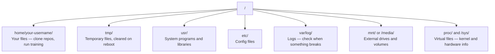

# Linux for AI

> 大多数 AI 跑在 Linux 上。你得懂到不会被卡住的程度。

**类型：** Learn
**语言：** --
**前置要求：** 阶段 0，第 1 课
**预计时间：** ~30 分钟

## 学习目标

- 在 Linux 文件系统里穿行，在命令行做核心的文件操作
- 用 `chmod` 和 `chown` 管理文件权限，解决 "Permission denied" 错误
- 用 `apt` 安装系统包，从零配好一台用于 AI 工作的 GPU 机器
- 认出 macOS 到 Linux 的差异，这些差异常坑在远程机器上干活的开发者

## 问题所在

你在 macOS 或 Windows 上开发。但你一旦 SSH 进一台云 GPU 机器、租一个 Lambda 实例、或开一台 EC2，你就落到了 Ubuntu 里。终端是你唯一的界面。没有 Finder，没有资源管理器，没有 GUI。如果你没法在命令行里穿行文件系统、装包、管进程，那你就会一边付着闲置的 GPU 钱，一边 google「Linux 里怎么解压文件」。

这是一份生存指南。它讲的恰好就是你在一台远程 Linux 机器上做 AI 工作所需要的。多一点都没有。

## 文件系统布局

Linux 把一切都组织在唯一的根 `/` 下面。没有 `C:\`，没有 `/Volumes`。你真正会碰到的目录：



你的主目录是 `~` 或 `/home/your-username`。你做的几乎一切都发生在这里。

## 核心命令

这是覆盖你在远程 GPU 机器上 95% 操作的 15 个命令。

### 四处移动

```bash
pwd                         # 我在哪？
ls                          # 这儿有什么？
ls -la                      # 这儿有什么，包括隐藏文件，带详情？
cd /path/to/dir             # 去那儿
cd ~                        # 回家
cd ..                       # 上一级
```

### 文件和目录

```bash
mkdir my-project            # 创建一个目录
mkdir -p a/b/c              # 一口气创建嵌套目录

cp file.txt backup.txt      # 复制一个文件
cp -r src/ src-backup/      # 复制一个目录（递归）

mv old.txt new.txt          # 重命名一个文件
mv file.txt /tmp/           # 移动一个文件

rm file.txt                 # 删一个文件（没有回收站，删了就没了）
rm -rf my-dir/              # 删一个目录和里面的一切
```

`rm -rf` 是永久的。没有撤销。回车前把路径再确认一遍。

### 读文件

```bash
cat file.txt                # 打印整个文件
head -20 file.txt           # 前 20 行
tail -20 file.txt           # 后 20 行
tail -f log.txt             # 实时跟踪一个日志文件（Ctrl+C 停止）
less file.txt               # 翻看一个文件（q 退出）
```

### 搜索

```bash
grep "error" training.log           # 找含 "error" 的行
grep -r "learning_rate" .           # 搜当前目录下的所有文件
grep -i "cuda" config.yaml          # 不区分大小写搜索

find . -name "*.py"                 # 找当前目录下所有 Python 文件
find . -name "*.ckpt" -size +1G     # 找大于 1GB 的 checkpoint 文件
```

## 权限

Linux 里每个文件都有一个所有者和一组权限位。当脚本跑不起来、或你写不进某个目录时，你就会碰上它。

```bash
ls -l train.py
# -rwxr-xr-- 1 user group 2048 Mar 19 10:00 train.py
#  ^^^             owner permissions: read, write, execute
#     ^^^          group permissions: read, execute
#        ^^        everyone else: read only
```

常见修法：

```bash
chmod +x train.sh           # 让一个脚本可执行
chmod 755 deploy.sh         # 所有者：全部；其他人：读+执行
chmod 644 config.yaml       # 所有者：读+写；其他人：只读

chown user:group file.txt   # 改文件归谁所有（需要 sudo）
```

当某处说 "Permission denied"，几乎总是权限问题。`chmod +x` 或 `sudo` 能修好大多数情况。

## 包管理（apt）

Ubuntu 用 `apt`。这是你安装系统级软件的方式。

```bash
sudo apt update             # 刷新包列表（永远先做这一步）
sudo apt install -y htop    # 安装一个包（-y 跳过确认）
sudo apt install -y build-essential  # C 编译器、make 等。很多 Python 包需要它
sudo apt install -y tmux    # 终端复用器（断连后保持会话存活）

apt list --installed        # 装了什么？
sudo apt remove htop        # 卸载
```

在一台全新 GPU 机器上你常装的包：

```bash
sudo apt update && sudo apt install -y \
    build-essential \
    git \
    curl \
    wget \
    tmux \
    htop \
    unzip \
    python3-venv
```

## 用户和 sudo

你通常以普通用户身份登录。有些操作需要 root（管理员）权限。

```bash
whoami                      # 我是哪个用户？
sudo command                # 以 root 身份跑单条命令
sudo su                     # 变成 root（exit 退回去，少用）
```

在云 GPU 实例上，你通常是唯一的用户，而且已经有 sudo 权限。别什么都用 root 跑。只在需要时用 sudo。

## 进程和 systemd

当你的训练卡住、或你要看什么在跑时：

```bash
htop                        # 交互式进程查看器（q 退出）
ps aux | grep python        # 找运行中的 Python 进程
kill 12345                  # 优雅地停掉 PID 为 12345 的进程
kill -9 12345               # 强杀（优雅方式不管用时用）
nvidia-smi                  # GPU 进程和显存使用情况
```

systemd 管理服务（后台守护进程）。你跑推理服务器时会用到它：

```bash
sudo systemctl start nginx          # 启动一个服务
sudo systemctl stop nginx           # 停掉它
sudo systemctl restart nginx        # 重启它
sudo systemctl status nginx         # 看它是否在跑
sudo systemctl enable nginx         # 开机自动启动
```

## 磁盘空间

GPU 机器常常磁盘空间有限。模型和数据集填得很快。

```bash
df -h                       # 所有挂载盘的磁盘使用情况
df -h /home                 # 专看 /home 的磁盘使用

du -sh *                    # 当前目录里每一项的大小
du -sh ~/.cache             # 你缓存的大小（pip、huggingface 模型都落在这里）
du -sh /data/checkpoints/   # 看你的 checkpoint 有多大

# 找出最占空间的家伙
du -h --max-depth=1 / 2>/dev/null | sort -hr | head -20
```

常见的省空间办法：

```bash
# 清 pip 缓存
pip cache purge

# 清 apt 缓存
sudo apt clean

# 删掉你不要的旧 checkpoint
rm -rf checkpoints/epoch_01/ checkpoints/epoch_02/
```

## 网络

你会在命令行里下模型、传文件、调 API。

```bash
# 下载文件
wget https://example.com/model.bin                   # 下载一个文件
curl -O https://example.com/data.tar.gz              # 用 curl 干同样的事
curl -s https://api.example.com/health | python3 -m json.tool  # 调一个 API，美化打印 JSON

# 在机器之间传文件
scp model.bin user@remote:/data/                     # 把文件拷到远程机器
scp user@remote:/data/results.csv .                  # 把文件从远程拷到本地
scp -r user@remote:/data/checkpoints/ ./local-dir/   # 拷一个目录

# 同步目录（大传输比 scp 快，失败后能续传）
rsync -avz --progress ./data/ user@remote:/data/
rsync -avz --progress user@remote:/results/ ./results/
```

任何大的东西都用 `rsync` 而不是 `scp`。它只传变了的字节，还能处理中断的连接。

## tmux：保持会话存活

你 SSH 进一台远程机器时，合上笔记本就会杀掉你的训练任务。tmux 防住这个。

```bash
tmux new -s train           # 启动一个名为 "train" 的新会话
# ... 开始你的训练，然后：
# Ctrl+B, 然后 D            # 分离（训练继续跑）

tmux ls                     # 列出会话
tmux attach -t train        # 重新接上会话

# tmux 内部：
# Ctrl+B, 然后 %            # 垂直拆分窗格
# Ctrl+B, 然后 "            # 水平拆分窗格
# Ctrl+B, 然后方向键        # 在窗格间切换
```

长训练任务永远在 tmux 里跑。永远。

## Windows 用户的 WSL2

如果你用 Windows，WSL2 不用双系统就给你一个真正的 Linux 环境。

```bash
# 在 PowerShell（管理员）里
wsl --install -d Ubuntu-24.04

# 重启后，从开始菜单打开 Ubuntu
sudo apt update && sudo apt upgrade -y
```

WSL2 跑的是真正的 Linux 内核。本节课的一切在它里面都能跑。在 WSL 里，你的 Windows 文件在 `/mnt/c/Users/YourName/`。

GPU 透传在 Windows 那侧装了 NVIDIA 驱动后就能用。装 Windows 版 NVIDIA 驱动（不是 Linux 版），CUDA 就会在 WSL2 里可用。

## 坑：macOS 到 Linux

从 macOS 过来会绊到你的东西：

| macOS | Linux | 说明 |
|-------|-------|-------|
| `brew install` | `sudo apt install` | 包名有时不同。`brew install htop` 对 `sudo apt install htop` 是一样的，但 `brew install readline` 对 `sudo apt install libreadline-dev` 就不是。 |
| `open file.txt` | `xdg-open file.txt` | 但远程机器上你没有 GUI。用 `cat` 或 `less`。 |
| `pbcopy` / `pbpaste` | 没有 | 通过 SSH 没法往剪贴板里管道收发。 |
| `~/.zshrc` | `~/.bashrc` | macOS 默认 zsh。大多数 Linux 服务器用 bash。 |
| `/opt/homebrew/` | `/usr/bin/`、`/usr/local/bin/` | 可执行文件放在不同地方。 |
| `sed -i '' 's/a/b/' file` | `sed -i 's/a/b/' file` | macOS 的 sed 在 `-i` 后要跟一个空字符串。Linux 不用。 |
| 大小写不敏感的文件系统 | 大小写敏感的文件系统 | 在 Linux 上 `Model.py` 和 `model.py` 是两个不同的文件。 |
| 行尾 `\n` | 行尾 `\n` | 一样。但 Windows 用 `\r\n`，会搞坏 bash 脚本。跑 `dos2unix` 修。 |

## 速查卡

```
Navigation:     pwd, ls, cd, find
Files:          cp, mv, rm, mkdir, cat, head, tail, less
Search:         grep, find
Permissions:    chmod, chown, sudo
Packages:       apt update, apt install
Processes:      htop, ps, kill, nvidia-smi
Services:       systemctl start/stop/restart/status
Disk:           df -h, du -sh
Network:        curl, wget, scp, rsync
Sessions:       tmux new/attach/detach
```

## 练习

1. SSH 进任意一台 Linux 机器（或打开 WSL2），切到你的主目录。建一个项目文件夹，用 `touch` 在里面建三个空文件，再用 `ls -la` 列出它们。
2. 用 apt 装上 `htop`，跑起来，找出哪个进程用了最多内存。
3. 启动一个 tmux 会话，在里面跑 `sleep 300`，分离，列出会话，再重新接上。
4. 用 `df -h` 查可用磁盘空间，再用 `du -sh ~/.cache/*` 找出缓存里什么在占空间。
5. 用 `scp` 把一个文件从本地传到远程，再用 `rsync` 做同样的传输，对比两者的体验。
