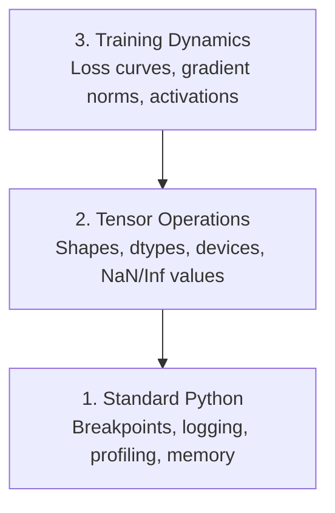

# Debugging and Profiling

> 最糟的 AI bug 不会崩。它默默地在垃圾数据上训练，然后给你一条漂亮的损失曲线。

**类型：** Build
**语言：** Python
**前置要求：** 第 1 课（开发环境），对 PyTorch 有基本了解
**预计时间：** ~60 分钟

## 学习目标

- 用带条件的 `breakpoint()` 和 `debug_print` 在训练途中检查张量的形状、dtype 和 NaN 值
- 用 `cProfile`、`line_profiler` 和 `tracemalloc` 给训练循环做性能分析，找出瓶颈
- 检测常见的 AI bug：形状不匹配、NaN 损失、数据泄漏、张量在错误的设备上
- 配好 TensorBoard，把损失曲线、权重直方图和梯度分布可视化

## 问题所在

AI 代码的出错方式跟普通代码不一样。一个 web 应用崩了会带着堆栈追踪。一个配错的训练循环会跑 8 个小时，烧掉 200 美元的 GPU 时间，最后产出一个对任何输入都预测均值的模型。代码从没报错。bug 是一个张量在错误的设备上、一个忘了的 `.detach()`，或者标签泄漏进了特征里。

你需要的是能在这些静默失败浪费你的时间和算力之前就抓住它们的调试工具。

## 核心概念

AI 调试在三个层级上运作：



大多数人直接跳到第 3 层（盯着 TensorBoard 看）。但 80% 的 AI bug 住在第 1 层和第 2 层。

## 动手构建

### 第 1 部分：print 调试（没错，它管用）

print 调试常被瞧不起。不该这样。对张量代码来说，一句有针对性的 print 胜过在调试器里一步步走，因为你需要一次看到形状、dtype 和值的范围。

```python
def debug_print(name, tensor):
    print(f"{name}: shape={tensor.shape}, dtype={tensor.dtype}, "
          f"device={tensor.device}, "
          f"min={tensor.min().item():.4f}, max={tensor.max().item():.4f}, "
          f"mean={tensor.mean().item():.4f}, "
          f"has_nan={tensor.isnan().any().item()}")
```

在每个可疑操作后调用它。找到 bug 后，把 print 删掉。简单。

### 第 2 部分：Python 调试器（pdb 和 breakpoint）

内置调试器在 AI 工作里被低估了。往你的训练循环里塞一个 `breakpoint()`，交互式地检查张量。

```python
def training_step(model, batch, criterion, optimizer):
    inputs, labels = batch
    outputs = model(inputs)
    loss = criterion(outputs, labels)

    if loss.item() > 100 or torch.isnan(loss):
        breakpoint()

    loss.backward()
    optimizer.step()
```

调试器把你带进去后，好用的命令：

- `p outputs.shape` 检查形状
- `p loss.item()` 看损失值
- `p torch.isnan(outputs).sum()` 数 NaN 的个数
- `p model.fc1.weight.grad` 检查梯度
- `c` 继续，`q` 退出

这是条件调试。只在某处看着不对劲时才停。对一个 10,000 步的训练任务来说，这很重要。

### 第 3 部分：Python 日志

当你的调试超出快速一查时，把 print 换成 logging。

```python
import logging

logging.basicConfig(
    level=logging.INFO,
    format="%(asctime)s [%(levelname)s] %(message)s",
    handlers=[
        logging.FileHandler("training.log"),
        logging.StreamHandler()
    ]
)
logger = logging.getLogger(__name__)

logger.info("Starting training: lr=%.4f, batch_size=%d", lr, batch_size)
logger.warning("Loss spike detected: %.4f at step %d", loss.item(), step)
logger.error("NaN loss at step %d, stopping", step)
```

日志给你时间戳、严重级别和文件输出。当训练任务在凌晨 3 点失败时，你要的是一个日志文件，而不是已经滚出屏幕的终端输出。

### 第 4 部分：给代码段计时

知道时间花在哪，是优化的第一步。

```python
import time

class Timer:
    def __init__(self, name=""):
        self.name = name

    def __enter__(self):
        self.start = time.perf_counter()
        return self

    def __exit__(self, *args):
        elapsed = time.perf_counter() - self.start
        print(f"[{self.name}] {elapsed:.4f}s")

with Timer("data loading"):
    batch = next(dataloader_iter)

with Timer("forward pass"):
    outputs = model(batch)

with Timer("backward pass"):
    loss.backward()
```

常见的发现：数据加载占了 60% 的训练时间。修法是给你的 DataLoader 设 `num_workers > 0`，而不是换一块更快的 GPU。

### 第 5 部分：cProfile 和 line_profiler

当你需要的不止是手动计时器时：

```bash
python -m cProfile -s cumtime train.py
```

这会按累计时间排序显示每一次函数调用。要逐行分析：

```bash
pip install line_profiler
```

```python
@profile
def train_step(model, data, target):
    output = model(data)
    loss = F.cross_entropy(output, target)
    loss.backward()
    return loss

# 用这个跑：kernprof -l -v train.py
```

### 第 6 部分：内存分析

#### 用 tracemalloc 看 CPU 内存

```python
import tracemalloc

tracemalloc.start()

# 你的代码放这儿
model = build_model()
data = load_dataset()

snapshot = tracemalloc.take_snapshot()
top_stats = snapshot.statistics("lineno")
for stat in top_stats[:10]:
    print(stat)
```

#### 用 memory_profiler 看 CPU 内存

```bash
pip install memory_profiler
```

```python
from memory_profiler import profile

@profile
def load_data():
    raw = read_csv("data.csv")       # 看内存在这儿跳
    processed = preprocess(raw)       # 还有这儿
    return processed
```

用 `python -m memory_profiler your_script.py` 跑，看逐行的内存使用。

#### 用 PyTorch 看 GPU 内存

```python
import torch

if torch.cuda.is_available():
    print(torch.cuda.memory_summary())

    print(f"Allocated: {torch.cuda.memory_allocated() / 1e9:.2f} GB")
    print(f"Cached: {torch.cuda.memory_reserved() / 1e9:.2f} GB")
```

当你撞上 OOM（Out of Memory，内存溢出）时：

1. 减小 batch size（永远是第一个要试的）
2. 用 `torch.cuda.empty_cache()` 释放缓存的内存
3. 对大的中间变量用 `del tensor` 接着 `torch.cuda.empty_cache()`
4. 用混合精度（`torch.cuda.amp`）把内存占用减半
5. 对非常深的模型用梯度检查点（gradient checkpointing）

### 第 7 部分：常见 AI bug 以及怎么抓它们

#### 形状不匹配

最频繁的 bug。一个张量是 `[batch, features]` 的形状，而模型期望的是 `[batch, channels, height, width]`。

```python
def check_shapes(model, sample_input):
    print(f"Input: {sample_input.shape}")
    hooks = []

    def make_hook(name):
        def hook(module, inp, out):
            in_shape = inp[0].shape if isinstance(inp, tuple) else inp.shape
            out_shape = out.shape if hasattr(out, "shape") else type(out)
            print(f"  {name}: {in_shape} -> {out_shape}")
        return hook

    for name, module in model.named_modules():
        hooks.append(module.register_forward_hook(make_hook(name)))

    with torch.no_grad():
        model(sample_input)

    for h in hooks:
        h.remove()
```

用一个样本 batch 跑一次。它会把你模型里每一步形状变换都列出来。

#### NaN 损失

NaN 损失意味着有东西炸了。常见原因：

- 学习率太高
- 自定义损失里除以了零
- 对零或负数取了对数
- RNN 里的梯度爆炸

```python
def detect_nan(model, loss, step):
    if torch.isnan(loss):
        print(f"NaN loss at step {step}")
        for name, param in model.named_parameters():
            if param.grad is not None:
                if torch.isnan(param.grad).any():
                    print(f"  NaN gradient in {name}")
                if torch.isinf(param.grad).any():
                    print(f"  Inf gradient in {name}")
        return True
    return False
```

#### 数据泄漏

你的模型在测试集上拿到 99% 准确率。听着很棒。它是个 bug。

```python
def check_data_leakage(train_set, test_set, id_column="id"):
    train_ids = set(train_set[id_column].tolist())
    test_ids = set(test_set[id_column].tolist())
    overlap = train_ids & test_ids
    if overlap:
        print(f"DATA LEAKAGE: {len(overlap)} samples in both train and test")
        return True
    return False
```

也要查时间上的泄漏：用未来的数据去预测过去。划分前先按时间戳排序。

#### 设备错误

张量在不同设备上（CPU vs GPU）会引发运行时错误。但有时一个张量会默默留在 CPU 上而其他一切都在 GPU 上，训练只是变慢而已。

```python
def check_devices(model, *tensors):
    model_device = next(model.parameters()).device
    print(f"Model device: {model_device}")
    for i, t in enumerate(tensors):
        if t.device != model_device:
            print(f"  WARNING: tensor {i} on {t.device}, model on {model_device}")
```

### 第 8 部分：TensorBoard 基础

TensorBoard 让你看到训练内部随时间发生了什么。

```bash
pip install tensorboard
```

```python
from torch.utils.tensorboard import SummaryWriter

writer = SummaryWriter("runs/experiment_1")

for step in range(num_steps):
    loss = train_step(model, batch)

    writer.add_scalar("loss/train", loss.item(), step)
    writer.add_scalar("lr", optimizer.param_groups[0]["lr"], step)

    if step % 100 == 0:
        for name, param in model.named_parameters():
            writer.add_histogram(f"weights/{name}", param, step)
            if param.grad is not None:
                writer.add_histogram(f"grads/{name}", param.grad, step)

writer.close()
```

启动它：

```bash
tensorboard --logdir=runs
```

该看什么：

- **损失不下降**：学习率太低，或者模型架构有问题
- **损失剧烈震荡**：学习率太高
- **损失变成 NaN**：数值不稳定（见上面的 NaN 一节）
- **训练损失下降、验证损失上升**：过拟合
- **权重直方图坍缩到零**：梯度消失
- **梯度直方图爆炸**：需要梯度裁剪

### 第 9 部分：VS Code 调试器

要做交互式调试，用一个 `launch.json` 配置 VS Code：

```json
{
    "version": "0.2.0",
    "configurations": [
        {
            "name": "Debug Training",
            "type": "debugpy",
            "request": "launch",
            "program": "${file}",
            "console": "integratedTerminal",
            "justMyCode": false
        }
    ]
}
```

点行号槽设断点。用变量面板检查张量属性。调试控制台让你在执行途中跑任意 Python 表达式。

调试数据预处理流水线时很有用，你想看到每一步变换。

## 上手使用

下面这套调试工作流能抓住大多数 AI bug：

1. **训练前**：用一个样本 batch 跑 `check_shapes`。验证输入和输出维度符合预期。
2. **头 10 步**：对损失、输出和梯度用 `debug_print`。确认没有 NaN，值都在合理范围内。
3. **训练中**：记录损失、学习率和梯度范数。用 TensorBoard 可视化。
4. **出问题时**：在失败点塞一个 `breakpoint()`。交互式地检查张量。
5. **看性能**：给数据加载、前向、反向各自计时。如果你接近 OOM 就分析内存。

## 交付

运行调试工具包脚本：

```bash
python phases/00-setup-and-tooling/12-debugging-and-profiling/code/debug_tools.py
```

`outputs/prompt-debug-ai-code.md` 里有一个帮你诊断 AI 专属 bug 的提示词。

## 练习

1. 跑 `debug_tools.py`，读一遍每一节的输出。改一下那个假模型引入一个 NaN（提示：在前向传播里除以零），看检测器把它抓出来。
2. 用 `cProfile` 给一个训练循环做分析，找出最慢的函数。
3. 用 `tracemalloc` 找出你数据加载流水线里哪一行分配了最多内存。
4. 为一个简单的训练任务配好 TensorBoard，判断模型是不是过拟合了。
5. 在一个训练循环里用 `breakpoint()`。练习从调试器提示符检查张量的形状、设备和梯度值。
