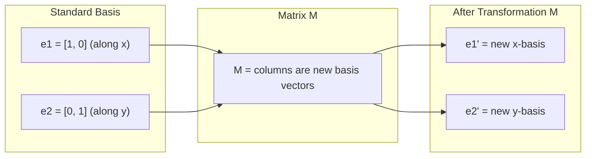
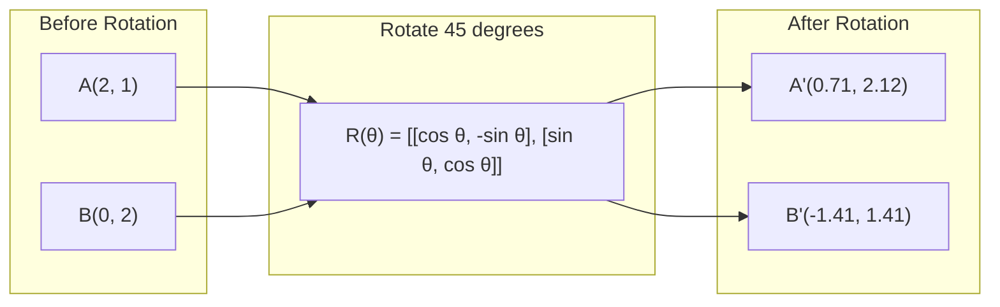
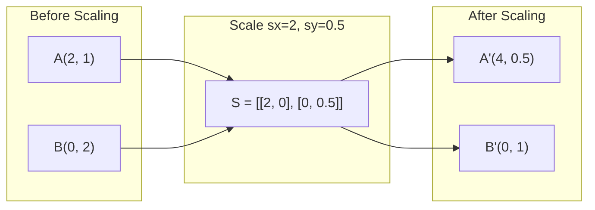
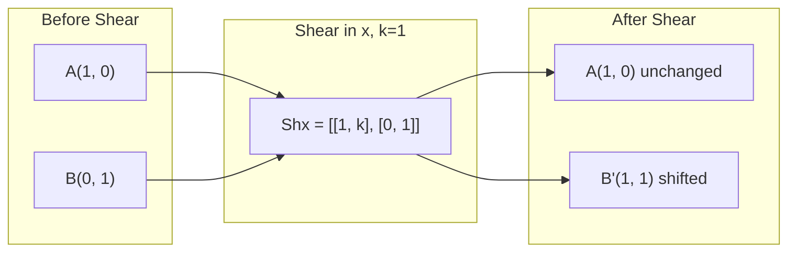
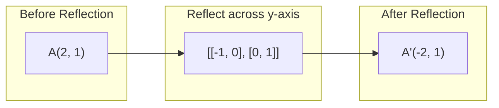
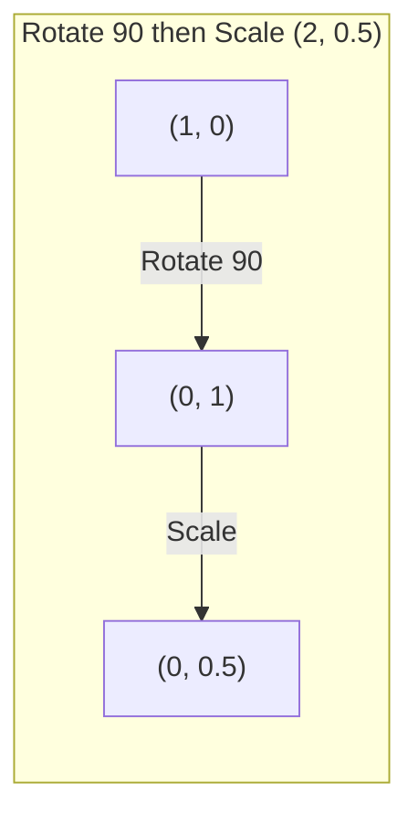
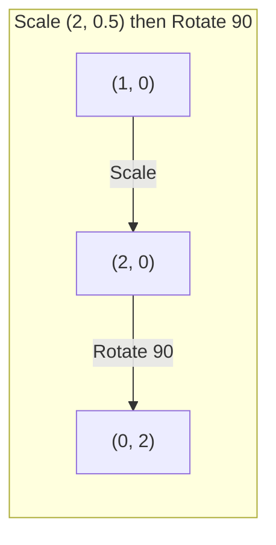

# 矩阵变换

> 矩阵是一台重塑空间的机器。搞清楚它对每一个点做了什么，你就理解了整个变换。

**类型：** Build
**语言：** Python、Julia
**前置要求：** 阶段 1，第 01-02 课（线性代数直觉，向量与矩阵运算）
**预计时间：** ~75 分钟

## 学习目标

- 构造旋转、缩放、剪切和反射矩阵，并把它们作用到二维和三维的点上
- 用矩阵乘法把多个变换组合起来，验证顺序会影响结果
- 从特征方程出发，计算 2x2 矩阵的特征值和特征向量
- 解释为什么特征值决定了 PCA 的方向、RNN 的稳定性和谱聚类的行为

## 问题所在

你读 PCA 的资料，看到"求协方差矩阵的特征向量"。你读模型稳定性的资料，看到"检查是否所有特征值的模都小于 1"。你读数据增强的资料，看到"施加一次随机旋转"。在你从几何上理解矩阵对空间做了什么之前，这些全是天书。

矩阵不只是数字网格。它们是操作空间的机器。旋转矩阵让点旋转。缩放矩阵把点拉伸。剪切矩阵把点倾斜。神经网络对数据施加的每一个变换，要么是这些操作之一，要么是它们的组合。本节课把这些操作变得具体可感。

## 核心概念

### 把变换看成矩阵

二维里的每一个线性变换都能写成一个 2x2 矩阵。这个矩阵恰好告诉你基向量 [1, 0] 和 [0, 1] 最终落到哪。其余一切随之确定。



### 旋转

二维里按角度 theta 的旋转保持距离和夹角不变。它让每个点沿圆弧移动。



在三维里，你绕一根轴旋转。每根轴都有自己的旋转矩阵：

```
Rz(theta) = | cos  -sin  0 |     Rotate around z-axis
            | sin   cos  0 |     (x-y plane spins, z stays)
            |  0     0   1 |

Rx(theta) = | 1   0     0    |   Rotate around x-axis
            | 0  cos  -sin   |   (y-z plane spins, x stays)
            | 0  sin   cos   |

Ry(theta) = |  cos  0  sin |     Rotate around y-axis
            |   0   1   0  |     (x-z plane spins, y stays)
            | -sin  0  cos |
```

### 缩放

缩放沿每根轴独立地拉伸或压缩。



### 剪切

剪切倾斜一根轴，同时让另一根保持不动。它把矩形变成平行四边形。



剪切矩阵：
- `Shx = [[1, k], [0, 1]]` 把 x 平移 k * y
- `Shy = [[1, 0], [k, 1]]` 把 y 平移 k * x

### 反射

反射让点关于某根轴或某条直线做镜像。



反射矩阵：
- 关于 y 轴反射：`[[-1, 0], [0, 1]]`
- 关于 x 轴反射：`[[1, 0], [0, -1]]`

### 组合：把变换串起来

先施加变换 A 再施加 B，等同于把它们的矩阵相乘：`result = B @ A @ point`。顺序很重要。先旋转后缩放和先缩放后旋转，结果不一样。



组合结果：`S @ R = [[0, -2], [0.5, 0]]`



组合结果：`R @ S = [[0, -0.5], [2, 0]]`

结果不同。矩阵乘法不满足交换律。

### 特征值与特征向量

绝大多数向量被矩阵作用后会改变方向。特征向量很特别：矩阵只缩放它们，从不旋转它们。那个缩放因子就是特征值。

```
A @ v = lambda * v

v is the eigenvector (direction that survives)
lambda is the eigenvalue (how much it stretches)

Example: A = | 2  1 |
             | 1  2 |

Eigenvector [1, 1] with eigenvalue 3:
  A @ [1,1] = [3, 3] = 3 * [1, 1]     (same direction, scaled by 3)

Eigenvector [1, -1] with eigenvalue 1:
  A @ [1,-1] = [1, -1] = 1 * [1, -1]  (same direction, unchanged)
```

这个矩阵沿 [1, 1] 方向把空间拉伸 3 倍，让 [1, -1] 保持不变。其余每个方向都是这两个方向的混合。

### 特征分解

如果一个矩阵有 n 个线性无关的特征向量，它就可以被分解：

```
A = V @ D @ V^(-1)

V = matrix whose columns are eigenvectors
D = diagonal matrix of eigenvalues
V^(-1) = inverse of V

This says: rotate into eigenvector coordinates, scale along each axis, rotate back.
```

### 特征值为什么重要

**PCA。** 协方差矩阵的特征向量就是主成分。特征值告诉你每个成分捕获了多少方差。按特征值排序，保留前 k 个，你就得到了降维。

**稳定性。** 在循环网络和动力系统里，模大于 1 的特征值会让输出爆炸。模小于 1 则让它们消失。这就是用一句话说清楚的梯度消失/爆炸问题。

**谱方法。** 图神经网络用邻接矩阵的特征值。谱聚类用拉普拉斯矩阵的特征值。特征向量揭示了图的结构。

### 行列式作为体积缩放因子

变换矩阵的行列式告诉你它把面积（二维）或体积（三维）缩放了多少。

```
det = 1:   area preserved (rotation)
det = 2:   area doubled
det = 0:   space crushed to lower dimension (singular)
det = -1:  area preserved but orientation flipped (reflection)

| det(Rotation) | = 1        (always)
| det(Scale sx, sy) | = sx * sy
| det(Shear) | = 1           (area preserved)
| det(Reflection) | = -1     (orientation flipped)
```

## 动手构建

### 第 1 步：从零写变换矩阵（Python）

```python
import math

def rotation_2d(theta):
    c, s = math.cos(theta), math.sin(theta)
    return [[c, -s], [s, c]]

def scaling_2d(sx, sy):
    return [[sx, 0], [0, sy]]

def shearing_2d(kx, ky):
    return [[1, kx], [ky, 1]]

def reflection_x():
    return [[1, 0], [0, -1]]

def reflection_y():
    return [[-1, 0], [0, 1]]

def mat_vec_mul(matrix, vector):
    return [
        sum(matrix[i][j] * vector[j] for j in range(len(vector)))
        for i in range(len(matrix))
    ]

def mat_mul(a, b):
    rows_a, cols_b = len(a), len(b[0])
    cols_a = len(a[0])
    return [
        [sum(a[i][k] * b[k][j] for k in range(cols_a)) for j in range(cols_b)]
        for i in range(rows_a)
    ]

point = [1.0, 0.0]
angle = math.pi / 4

rotated = mat_vec_mul(rotation_2d(angle), point)
print(f"Rotate (1,0) by 45 deg: ({rotated[0]:.4f}, {rotated[1]:.4f})")

scaled = mat_vec_mul(scaling_2d(2, 3), [1.0, 1.0])
print(f"Scale (1,1) by (2,3): ({scaled[0]:.1f}, {scaled[1]:.1f})")

sheared = mat_vec_mul(shearing_2d(1, 0), [1.0, 1.0])
print(f"Shear (1,1) kx=1: ({sheared[0]:.1f}, {sheared[1]:.1f})")

reflected = mat_vec_mul(reflection_y(), [2.0, 1.0])
print(f"Reflect (2,1) across y: ({reflected[0]:.1f}, {reflected[1]:.1f})")
```

### 第 2 步：变换的组合

```python
R = rotation_2d(math.pi / 2)
S = scaling_2d(2, 0.5)

rotate_then_scale = mat_mul(S, R)
scale_then_rotate = mat_mul(R, S)

point = [1.0, 0.0]
result1 = mat_vec_mul(rotate_then_scale, point)
result2 = mat_vec_mul(scale_then_rotate, point)

print(f"Rotate 90 then scale: ({result1[0]:.2f}, {result1[1]:.2f})")
print(f"Scale then rotate 90: ({result2[0]:.2f}, {result2[1]:.2f})")
print(f"Same? {result1 == result2}")
```

### 第 3 步：从零求特征值（2x2）

对于一个 2x2 矩阵 `[[a, b], [c, d]]`，特征值是特征方程的解：`lambda^2 - (a+d)*lambda + (ad - bc) = 0`。

```python
def eigenvalues_2x2(matrix):
    a, b = matrix[0]
    c, d = matrix[1]
    trace = a + d
    det = a * d - b * c
    discriminant = trace ** 2 - 4 * det
    if discriminant < 0:
        real = trace / 2
        imag = (-discriminant) ** 0.5 / 2
        return (complex(real, imag), complex(real, -imag))
    sqrt_disc = discriminant ** 0.5
    return ((trace + sqrt_disc) / 2, (trace - sqrt_disc) / 2)

def eigenvector_2x2(matrix, eigenvalue):
    a, b = matrix[0]
    c, d = matrix[1]
    if abs(b) > 1e-10:
        v = [b, eigenvalue - a]
    elif abs(c) > 1e-10:
        v = [eigenvalue - d, c]
    else:
        if abs(a - eigenvalue) < 1e-10:
            v = [1, 0]
        else:
            v = [0, 1]
    mag = (v[0] ** 2 + v[1] ** 2) ** 0.5
    return [v[0] / mag, v[1] / mag]

A = [[2, 1], [1, 2]]
vals = eigenvalues_2x2(A)
print(f"Matrix: {A}")
print(f"Eigenvalues: {vals[0]:.4f}, {vals[1]:.4f}")

for val in vals:
    vec = eigenvector_2x2(A, val)
    result = mat_vec_mul(A, vec)
    scaled = [val * vec[0], val * vec[1]]
    print(f"  lambda={val:.1f}, v={[round(x,4) for x in vec]}")
    print(f"    A@v = {[round(x,4) for x in result]}")
    print(f"    l*v = {[round(x,4) for x in scaled]}")
```

### 第 4 步：行列式作为体积缩放因子

```python
def det_2x2(matrix):
    return matrix[0][0] * matrix[1][1] - matrix[0][1] * matrix[1][0]

print(f"det(rotation 45) = {det_2x2(rotation_2d(math.pi/4)):.4f}")
print(f"det(scale 2,3)   = {det_2x2(scaling_2d(2, 3)):.1f}")
print(f"det(shear kx=1)  = {det_2x2(shearing_2d(1, 0)):.1f}")
print(f"det(reflect y)   = {det_2x2(reflection_y()):.1f}")

singular = [[1, 2], [2, 4]]
print(f"det(singular)     = {det_2x2(singular):.1f}")
print("Singular: columns are proportional, space collapses to a line.")
```

## 上手使用

NumPy 用优化过的例程把这些全包办了。

```python
import numpy as np

theta = np.pi / 4
R = np.array([[np.cos(theta), -np.sin(theta)],
              [np.sin(theta),  np.cos(theta)]])

point = np.array([1.0, 0.0])
print(f"Rotate (1,0) by 45 deg: {R @ point}")

S = np.diag([2.0, 3.0])
composed = S @ R
print(f"Scale(2,3) after Rotate(45): {composed @ point}")

A = np.array([[2, 1], [1, 2]], dtype=float)
eigenvalues, eigenvectors = np.linalg.eig(A)
print(f"\nEigenvalues: {eigenvalues}")
print(f"Eigenvectors (columns):\n{eigenvectors}")

for i in range(len(eigenvalues)):
    v = eigenvectors[:, i]
    lam = eigenvalues[i]
    print(f"  A @ v{i} = {A @ v}, lambda * v{i} = {lam * v}")

print(f"\ndet(R) = {np.linalg.det(R):.4f}")
print(f"det(S) = {np.linalg.det(S):.1f}")

B = np.array([[3, 1], [0, 2]], dtype=float)
vals, vecs = np.linalg.eig(B)
D = np.diag(vals)
V = vecs
reconstructed = V @ D @ np.linalg.inv(V)
print(f"\nEigendecomposition A = V @ D @ V^-1:")
print(f"Original:\n{B}")
print(f"Reconstructed:\n{reconstructed}")
```

### 用 NumPy 做三维旋转

```python
def rotation_3d_z(theta):
    c, s = np.cos(theta), np.sin(theta)
    return np.array([[c, -s, 0], [s, c, 0], [0, 0, 1]])

def rotation_3d_x(theta):
    c, s = np.cos(theta), np.sin(theta)
    return np.array([[1, 0, 0], [0, c, -s], [0, s, c]])

point_3d = np.array([1.0, 0.0, 0.0])
rotated_z = rotation_3d_z(np.pi / 2) @ point_3d
rotated_x = rotation_3d_x(np.pi / 2) @ point_3d

print(f"\n3D point: {point_3d}")
print(f"Rotate 90 around z: {np.round(rotated_z, 4)}")
print(f"Rotate 90 around x: {np.round(rotated_x, 4)}")
```

## 交付

本节课为 PCA（阶段 2）和神经网络权重分析打下几何基础。这里写的特征值/特征向量代码，和驱动生产 ML 系统里降维、谱聚类、稳定性分析的算法是同一套。

## 练习

1. 把旋转、缩放和剪切作用到一个单位正方形上（四角分别在 [0,0]、[1,0]、[1,1]、[0,1]）。分别打印每种变换后的角点。验证旋转保持了角点间的距离。

2. 用特征方程手算矩阵 [[4, 2], [1, 3]] 的特征值。然后用你从零写的函数和 NumPy 各验证一遍。

3. 构造一个由三个变换组成的复合变换（旋转 30 度、缩放 [1.5, 0.8]、剪切 kx=0.3），把它作用到排成一圈的 8 个点上。打印变换前后的坐标。计算复合矩阵的行列式，验证它等于各个行列式的乘积。

## 关键术语

| 术语 | 人们常说 | 它实际指什么 |
|------|----------------|----------------------|
| 旋转矩阵 | "让东西转" | 一个正交矩阵，让点沿圆弧移动的同时保持距离和夹角。行列式恒为 1。 |
| 缩放矩阵 | "把东西放大" | 一个对角矩阵，沿每根轴独立地拉伸或压缩。行列式是各缩放因子的乘积。 |
| 剪切矩阵 | "把东西斜过去" | 一个矩阵，把一个坐标按另一个坐标成比例地平移，把矩形变成平行四边形。行列式为 1。 |
| 反射 | "把东西做镜像" | 一个矩阵，让空间关于某根轴或某个平面翻转。行列式为 -1。 |
| 组合 | "做两件事" | 把变换矩阵相乘以串联多个操作。顺序很重要：B @ A 表示先施加 A，再施加 B。 |
| 特征向量 | "特殊方向" | 一个被矩阵只缩放、从不旋转的方向。是该变换的指纹。 |
| 特征值 | "拉伸了多少" | 矩阵缩放它的特征向量时所用的标量因子。可以为负（翻转）或为复数（旋转）。 |
| 特征分解 | "把矩阵拆开" | 把矩阵写成 V @ D @ V^(-1)，将它分离成基本的缩放方向和缩放幅度。 |
| 行列式 | "矩阵算出的一个数" | 变换把面积（二维）或体积（三维）缩放的倍数。为零意味着变换不可逆。 |
| 特征方程 | "特征值的来源" | det(A - lambda * I) = 0。其根为特征值的多项式。 |

## 延伸阅读

- [3Blue1Brown: Linear Transformations](https://www.3blue1brown.com/lessons/linear-transformations) -- 矩阵如何重塑空间的可视化直觉
- [3Blue1Brown: Eigenvectors and Eigenvalues](https://www.3blue1brown.com/lessons/eigenvalues) -- 对特征向量几何含义最好的可视化讲解
- [MIT 18.06 Lecture 21: Eigenvalues and Eigenvectors](https://ocw.mit.edu/courses/18-06-linear-algebra-spring-2010/) -- Gilbert Strang 的经典讲法
