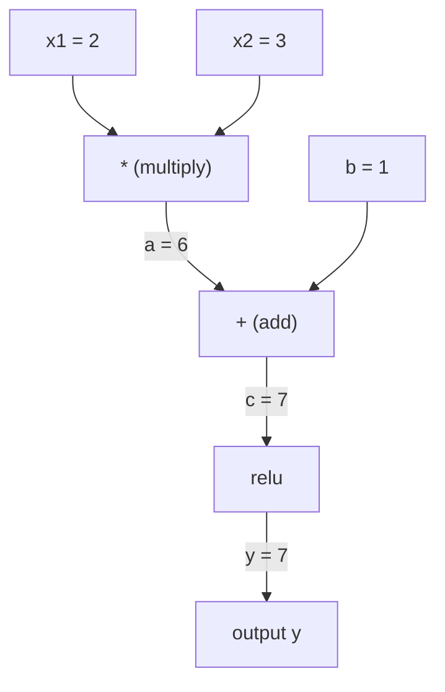
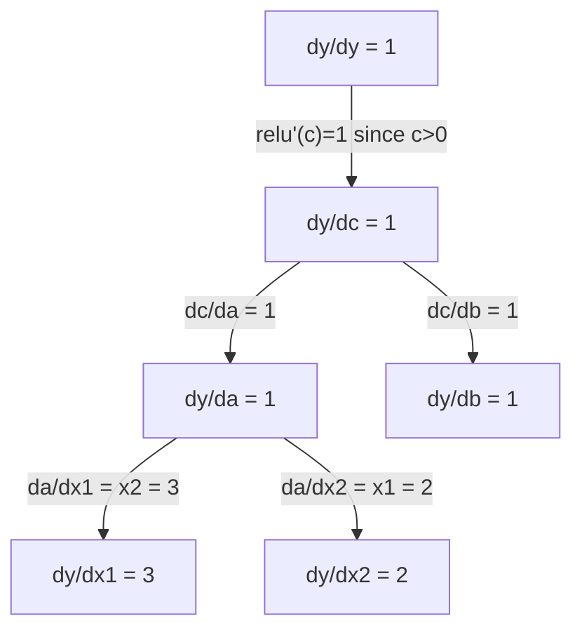

# 链式法则与自动微分

> 链式法则是每一个会学习的神经网络背后的引擎。

**类型：** Build
**语言：** Python
**前置要求：** 阶段 1，第 04 课（导数与梯度）
**预计时间：** ~90 分钟

## 学习目标

- 构建一个极简的 autograd 引擎（Value 类），记录运算并通过反向模式自动微分计算梯度
- 用拓扑排序实现计算图的前向和反向传播
- 只用从零写的 autograd 引擎，构建并在 XOR 上训练一个多层感知机
- 用梯度检查对照数值有限差分，验证自动微分的正确性

## 问题所在

你会算简单函数的导数了。但神经网络不是简单函数。它是几百个函数复合在一起：矩阵乘法、加偏置、应用激活、再矩阵乘法、softmax、交叉熵损失。输出是函数的函数的函数。

要训练网络，你需要损失对每一个权重的梯度。对上百万个参数手算是不可能的。用数值方法（有限差分）又太慢。

链式法则给你数学。自动微分给你算法。两者合起来，让你能在与一次前向传播成正比的时间里，算出任意函数复合的精确梯度。

PyTorch、TensorFlow 和 JAX 就是这么干的。你将从零构建一个迷你版。

## 核心概念

### 链式法则

如果 `y = f(g(x))`，那么 `y` 对 `x` 的导数是：

```
dy/dx = dy/dg * dg/dx = f'(g(x)) * g'(x)
```

把链条上的导数乘起来。每一环贡献它的局部导数。

例子：`y = sin(x^2)`

```
g(x) = x^2       g'(x) = 2x
f(g) = sin(g)     f'(g) = cos(g)

dy/dx = cos(x^2) * 2x
```

对于更深的复合，链条继续延伸：

```
y = f(g(h(x)))

dy/dx = f'(g(h(x))) * g'(h(x)) * h'(x)
```

神经网络里的每一层都是这条链上的一环。

### 计算图

计算图把链式法则可视化。每个运算都成为一个节点。数据沿图向前流动。梯度向后流动。

**前向传播（计算值）：**



**反向传播（计算梯度）：**



反向传播在每个节点应用链式法则，把梯度从输出传播到输入。

### 前向模式 vs 反向模式

在图里应用链式法则有两种方式。

**前向模式**从输入出发，把导数往前推。它计算 `dx/dx = 1`，然后逐个运算传播。当你的输入少、输出多时好用。

```
Forward mode: seed dx/dx = 1, propagate forward

  x = 2       (dx/dx = 1)
  a = x^2     (da/dx = 2x = 4)
  y = sin(a)  (dy/dx = cos(a) * da/dx = cos(4) * 4 = -2.615)
```

**反向模式**从输出出发，把梯度往回拉。它计算 `dy/dy = 1`，然后逆序逐个运算传播。当你的输入多、输出少时好用。

```
Reverse mode: seed dy/dy = 1, propagate backward

  y = sin(a)  (dy/dy = 1)
  a = x^2     (dy/da = cos(a) = cos(4) = -0.654)
  x = 2       (dy/dx = dy/da * da/dx = -0.654 * 4 = -2.615)
```

神经网络有上百万个输入（权重）和一个输出（损失）。反向模式在一次反向传播里就算出所有梯度。这就是反向传播用反向模式的原因。

| 模式 | 种子 | 方向 | 何时最好用 |
|------|------|-----------|-----------|
| 前向 | `dx_i/dx_i = 1` | 输入到输出 | 输入少、输出多 |
| 反向 | `dy/dy = 1` | 输出到输入 | 输入多、输出少（神经网络） |

### 用于前向模式的对偶数

前向模式可以用对偶数优雅地实现。对偶数的形式是 `a + b*epsilon`，其中 `epsilon^2 = 0`。

```
Dual number: (value, derivative)

(2, 1) means: value is 2, derivative w.r.t. x is 1

Arithmetic rules:
  (a, a') + (b, b') = (a+b, a'+b')
  (a, a') * (b, b') = (a*b, a'*b + a*b')
  sin(a, a')         = (sin(a), cos(a)*a')
```

给输入变量的导数种子设成 1。导数会自动穿过每个运算传播。

### 构建一个 autograd 引擎

一个 autograd 引擎需要三样东西：

1. **值的包装。** 把每个数字包进一个对象，存它的值和梯度。
2. **图的记录。** 每个运算记录它的输入和局部梯度函数。
3. **反向传播。** 对图做拓扑排序，然后逆序遍历，在每个节点应用链式法则。

这正是 PyTorch 的 `autograd` 做的事。`torch.Tensor` 类包装值，在 `requires_grad=True` 时记录运算，并在你调用 `.backward()` 时计算梯度。

### PyTorch Autograd 引擎盖下是怎么工作的

当你写 PyTorch 代码：

```python
x = torch.tensor(2.0, requires_grad=True)
y = x ** 2 + 3 * x + 1
y.backward()
print(x.grad)  # 7.0 = 2*x + 3 = 2*2 + 3
```

PyTorch 内部：

1. 为 `x` 创建一个 `requires_grad=True` 的 `Tensor` 节点
2. 每个运算（`**`、`*`、`+`）创建一个新节点并记录反向函数
3. `y.backward()` 触发在记录下的图上做反向模式自动微分
4. 每个节点的 `grad_fn` 计算局部梯度并传给父节点
5. 梯度通过相加（而非替换）累积到 `.grad` 属性里

这个图是动态的（define-by-run）。每次前向传播都会构建一个新图。这就是为什么 PyTorch 支持在模型里写控制流（if/else、循环）。

## 动手构建

### 第 1 步：Value 类

```python
class Value:
    def __init__(self, data, children=(), op=''):
        self.data = data
        self.grad = 0.0
        self._backward = lambda: None
        self._prev = set(children)
        self._op = op

    def __repr__(self):
        return f"Value(data={self.data:.4f}, grad={self.grad:.4f})"
```

每个 `Value` 存它的数值、梯度（初始为零）、一个反向函数，以及指向产生它的子节点的指针。

### 第 2 步：带梯度追踪的算术运算

```python
    def __add__(self, other):
        other = other if isinstance(other, Value) else Value(other)
        out = Value(self.data + other.data, (self, other), '+')
        def _backward():
            self.grad += out.grad
            other.grad += out.grad
        out._backward = _backward
        return out

    def __mul__(self, other):
        other = other if isinstance(other, Value) else Value(other)
        out = Value(self.data * other.data, (self, other), '*')
        def _backward():
            self.grad += other.data * out.grad
            other.grad += self.data * out.grad
        out._backward = _backward
        return out

    def relu(self):
        out = Value(max(0, self.data), (self,), 'relu')
        def _backward():
            self.grad += (1.0 if out.data > 0 else 0.0) * out.grad
        out._backward = _backward
        return out
```

每个运算创建一个闭包，它知道如何计算局部梯度、再乘上游梯度（`out.grad`）。`+=` 处理一个值被用在多个运算里的情况。

### 第 3 步：反向传播

```python
    def backward(self):
        topo = []
        visited = set()
        def build_topo(v):
            if v not in visited:
                visited.add(v)
                for child in v._prev:
                    build_topo(child)
                topo.append(v)
        build_topo(self)

        self.grad = 1.0
        for v in reversed(topo):
            v._backward()
```

拓扑排序保证每个节点的梯度在传播给它的子节点之前已经完整算好。种子梯度是 1.0（dy/dy = 1）。

### 第 4 步：为完整引擎补上更多运算

基础的 Value 类处理加法、乘法和 relu。真正的 autograd 引擎需要更多。下面是构建神经网络所需的运算：

```python
    def __neg__(self):
        return self * -1

    def __sub__(self, other):
        return self + (-other)

    def __radd__(self, other):
        return self + other

    def __rmul__(self, other):
        return self * other

    def __rsub__(self, other):
        return other + (-self)

    def __pow__(self, n):
        out = Value(self.data ** n, (self,), f'**{n}')
        def _backward():
            self.grad += n * (self.data ** (n - 1)) * out.grad
        out._backward = _backward
        return out

    def __truediv__(self, other):
        return self * (other ** -1) if isinstance(other, Value) else self * (Value(other) ** -1)

    def exp(self):
        import math
        e = math.exp(self.data)
        out = Value(e, (self,), 'exp')
        def _backward():
            self.grad += e * out.grad
        out._backward = _backward
        return out

    def log(self):
        import math
        out = Value(math.log(self.data), (self,), 'log')
        def _backward():
            self.grad += (1.0 / self.data) * out.grad
        out._backward = _backward
        return out

    def tanh(self):
        import math
        t = math.tanh(self.data)
        out = Value(t, (self,), 'tanh')
        def _backward():
            self.grad += (1 - t ** 2) * out.grad
        out._backward = _backward
        return out
```

**每个运算为什么重要：**

| 运算 | 反向规则 | 用于 |
|-----------|--------------|---------|
| `__sub__` | 复用 add + neg | 损失计算（pred - target） |
| `__pow__` | n * x^(n-1) | 多项式激活、MSE（error^2） |
| `__truediv__` | 复用 mul + pow(-1) | 归一化、学习率缩放 |
| `exp` | exp(x) * 上游 | Softmax、对数似然 |
| `log` | (1/x) * 上游 | 交叉熵损失、对数概率 |
| `tanh` | (1 - tanh^2) * 上游 | 经典激活函数 |

巧妙之处：`__sub__` 和 `__truediv__` 是用已有运算定义的。它们能免费拿到正确的梯度，因为链式法则会穿过底层的 add/mul/pow 运算自动组合。

### 第 5 步：从零写迷你 MLP

有了完整的 Value 类，你就能构建神经网络。不用 PyTorch。不用 NumPy。只用 Value 和链式法则。

```python
import random

class Neuron:
    def __init__(self, n_inputs):
        self.w = [Value(random.uniform(-1, 1)) for _ in range(n_inputs)]
        self.b = Value(0.0)

    def __call__(self, x):
        act = sum((wi * xi for wi, xi in zip(self.w, x)), self.b)
        return act.tanh()

    def parameters(self):
        return self.w + [self.b]

class Layer:
    def __init__(self, n_inputs, n_outputs):
        self.neurons = [Neuron(n_inputs) for _ in range(n_outputs)]

    def __call__(self, x):
        return [n(x) for n in self.neurons]

    def parameters(self):
        return [p for n in self.neurons for p in n.parameters()]

class MLP:
    def __init__(self, sizes):
        self.layers = [Layer(sizes[i], sizes[i+1]) for i in range(len(sizes)-1)]

    def __call__(self, x):
        for layer in self.layers:
            x = layer(x)
        return x[0] if len(x) == 1 else x

    def parameters(self):
        return [p for layer in self.layers for p in layer.parameters()]
```

一个 `Neuron` 计算 `tanh(w1*x1 + w2*x2 + ... + b)`。一个 `Layer` 是一组神经元。一个 `MLP` 把层叠起来。每个权重都是一个 `Value`，所以调用 `loss.backward()` 会把梯度传播到每一个参数。

**在 XOR 上训练：**

```python
random.seed(42)
model = MLP([2, 4, 1])  # 2 inputs, 4 hidden neurons, 1 output

xs = [[0, 0], [0, 1], [1, 0], [1, 1]]
ys = [-1, 1, 1, -1]  # XOR pattern (using -1/1 for tanh)

for step in range(100):
    preds = [model(x) for x in xs]
    loss = sum((p - y) ** 2 for p, y in zip(preds, ys))

    for p in model.parameters():
        p.grad = 0.0
    loss.backward()

    lr = 0.05
    for p in model.parameters():
        p.data -= lr * p.grad

    if step % 20 == 0:
        print(f"step {step:3d}  loss = {loss.data:.4f}")

print("\nPredictions after training:")
for x, y in zip(xs, ys):
    print(f"  input={x}  target={y:2d}  pred={model(x).data:6.3f}")
```

这就是 micrograd。一个用纯 Python 加自动微分写成的完整神经网络训练循环。每个商业深度学习框架做的都是同一件事，只是规模巨大。

### 第 6 步：梯度检查

你怎么知道你的自动微分是对的？拿它和数值导数对照。这就是梯度检查。

```python
def gradient_check(build_expr, x_val, h=1e-7):
    x = Value(x_val)
    y = build_expr(x)
    y.backward()
    autodiff_grad = x.grad

    y_plus = build_expr(Value(x_val + h)).data
    y_minus = build_expr(Value(x_val - h)).data
    numerical_grad = (y_plus - y_minus) / (2 * h)

    diff = abs(autodiff_grad - numerical_grad)
    return autodiff_grad, numerical_grad, diff
```

在一个复杂表达式上测试：

```python
def expr(x):
    return (x ** 3 + x * 2 + 1).tanh()

ad, num, diff = gradient_check(expr, 0.5)
print(f"Autodiff:  {ad:.8f}")
print(f"Numerical: {num:.8f}")
print(f"Difference: {diff:.2e}")
# Difference should be < 1e-5
```

实现新运算时，梯度检查必不可少。如果你的反向传播有 bug，数值检查能逮住它。每个严肃的深度学习实现都会在开发期间跑梯度检查。

**什么时候用梯度检查：**

| 情形 | 要做梯度检查吗？ |
|-----------|-------------------|
| 给你的 autograd 加一个新运算 | 要，每次都要 |
| 调试一个不收敛的训练循环 | 要，先检查梯度 |
| 生产训练 | 不要，太慢（每个参数要两次前向传播） |
| autograd 代码的单元测试 | 要，把它自动化 |

### 第 7 步：对照手算验证

```python
x1 = Value(2.0)
x2 = Value(3.0)
a = x1 * x2          # a = 6.0
b = a + Value(1.0)    # b = 7.0
y = b.relu()          # y = 7.0

y.backward()

print(f"y = {y.data}")          # 7.0
print(f"dy/dx1 = {x1.grad}")   # 3.0 (= x2)
print(f"dy/dx2 = {x2.grad}")   # 2.0 (= x1)
```

手算验证：`y = relu(x1*x2 + 1)`。由于 `x1*x2 + 1 = 7 > 0`，relu 是恒等。
`dy/dx1 = x2 = 3`。`dy/dx2 = x1 = 2`。引擎对得上。

## 上手使用

### 对照 PyTorch 验证

```python
import torch

x1 = torch.tensor(2.0, requires_grad=True)
x2 = torch.tensor(3.0, requires_grad=True)
a = x1 * x2
b = a + 1.0
y = torch.relu(b)
y.backward()

print(f"PyTorch dy/dx1 = {x1.grad.item()}")  # 3.0
print(f"PyTorch dy/dx2 = {x2.grad.item()}")  # 2.0
```

梯度一样。你的引擎和 PyTorch 算出同样的结果，因为数学是一样的：通过链式法则做反向模式自动微分。

### 一个更复杂的表达式

```python
a = Value(2.0)
b = Value(-3.0)
c = Value(10.0)
f = (a * b + c).relu()  # relu(2*(-3) + 10) = relu(4) = 4

f.backward()
print(f"df/da = {a.grad}")  # -3.0 (= b)
print(f"df/db = {b.grad}")  #  2.0 (= a)
print(f"df/dc = {c.grad}")  #  1.0
```

## 交付

本节课产出：
- `outputs/skill-autodiff.md` -- 一个用于构建和调试 autograd 系统的 skill
- `code/autodiff.py` -- 一个你可以扩展的极简 autograd 引擎

这里构建的 Value 类，是阶段 3 神经网络训练循环的基础。

## 练习

1. 给 Value 类加上 `__pow__`，这样你就能计算 `x ** n`。验证 `d/dx(x^3)` 在 `x=2` 处等于 `12.0`。

2. 把 `tanh` 加为激活函数。验证 `tanh'(0) = 1` 且 `tanh'(2) = 0.0707`（约）。

3. 为单个神经元构建计算图：`y = relu(w1*x1 + w2*x2 + b)`。算出全部五个梯度，并对照 PyTorch 验证。

4. 用对偶数实现前向模式自动微分。创建一个 `Dual` 类，验证它给出的导数和你的反向模式引擎一致。

## 关键术语

| 术语 | 人们常说 | 它实际指什么 |
|------|----------------|----------------------|
| 链式法则 | "把导数乘起来" | 复合函数的导数等于每个函数局部导数的乘积，且各导数在正确的点上求值 |
| 计算图 | "网络结构图" | 一个有向无环图，节点是运算，边携带值（前向）或梯度（反向） |
| 前向模式 | "把导数往前推" | 把导数从输入传播到输出的自动微分。每个输入变量跑一遍。 |
| 反向模式 | "反向传播" | 把梯度从输出传播到输入的自动微分。每个输出变量跑一遍。 |
| Autograd | "自动梯度" | 一个记录值上运算、构建图、并通过链式法则计算精确梯度的系统 |
| 对偶数 | "值加导数" | 形如 a + b*epsilon（epsilon^2 = 0）的数，在算术中携带导数信息 |
| 拓扑排序 | "依赖顺序" | 给图节点排序，使每个节点排在它所有依赖之后。正确的梯度传播必需。 |
| 梯度累积 | "相加，而非替换" | 当一个值喂进多个运算时，它的梯度是所有传入梯度贡献之和 |
| 动态图 | "运行时定义" | 每次前向传播都重建的计算图，允许在模型里写 Python 控制流（PyTorch 风格） |
| 梯度检查 | "数值验证" | 把自动微分梯度和数值有限差分梯度对照以验证正确性。调试必备。 |
| MLP | "多层感知机" | 一个有一个或多个隐藏层神经元的神经网络。每个神经元计算加权和加偏置，然后应用激活函数。 |
| 神经元 | "加权和 + 激活" | 基本单元：output = activation(w1*x1 + w2*x2 + ... + b)。权重和偏置是可学习参数。 |

## 延伸阅读

- [3Blue1Brown: Backpropagation calculus](https://www.youtube.com/watch?v=tIeHLnjs5U8) -- 神经网络中链式法则的可视化讲解
- [PyTorch Autograd mechanics](https://pytorch.org/docs/stable/notes/autograd.html) -- 真实系统是如何工作的
- [Baydin et al., Automatic Differentiation in Machine Learning: a Survey](https://arxiv.org/abs/1502.05767) -- 全面的参考
