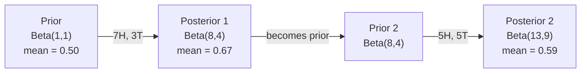

# 贝叶斯定理

> 概率讲的是你预期什么。贝叶斯定理讲的是你学到什么。

**类型：** Build
**语言：** Python
**前置要求：** 阶段 1，第 06 课（概率基础）
**预计时间：** ~75 分钟

## 学习目标

- 应用贝叶斯定理，从先验、似然和证据计算后验概率
- 从零构建一个朴素贝叶斯文本分类器，带 Laplace 平滑和对数空间计算
- 比较 MLE 和 MAP 估计，解释 MAP 如何对应 L2 正则化
- 用 Beta-Binomial 共轭先验为 A/B 测试实现序贯贝叶斯更新

## 问题所在

一项医学检测准确率 99%。你测出阳性。你真得这病的概率有多大？

大多数人会说 99%。真实答案取决于这病有多罕见。如果一万人里有一个人得，那阳性结果只让你有大约 1% 的概率真生病。其余 99% 的阳性结果都是来自健康人的假警报。

这不是脑筋急转弯。这就是贝叶斯定理。每个垃圾邮件过滤器、每个医学诊断、每个量化不确定性的机器学习模型，用的都是这套推理。你从一个信念出发。你看到证据。你更新。

如果你构建 ML 系统却不理解这一点，你就会误读模型输出、设错阈值、上线过度自信的预测。

## 核心概念

### 从联合概率到贝叶斯

你已经从第 06 课知道条件概率是：

```
P(A|B) = P(A and B) / P(B)
```

对称地：

```
P(B|A) = P(A and B) / P(A)
```

两个式子共享同一个分子：P(A and B)。令它们相等并整理：

```
P(A and B) = P(A|B) * P(B) = P(B|A) * P(A)

Therefore:

P(A|B) = P(B|A) * P(A) / P(B)
```

这就是贝叶斯定理。四个量，一个方程。

### 四个部分

| 部分 | 名称 | 含义 |
|------|------|---------------|
| P(A\|B) | 后验 | 看到证据 B 之后你对 A 更新过的信念 |
| P(B\|A) | 似然 | 如果 A 为真，证据 B 出现的可能性有多大 |
| P(A) | 先验 | 在看到任何证据之前你对 A 的信念 |
| P(B) | 证据 | 在所有可能性下看到 B 的总概率 |

证据项 P(B) 起归一化作用。你可以用全概率公式把它展开：

```
P(B) = P(B|A) * P(A) + P(B|not A) * P(not A)
```

### 医学检测例子

某疾病每一万人里有一个人得。检测准确率 99%（抓住 99% 的病人，1% 的时候给出假阳性）。

```
P(sick)          = 0.0001     (prior: disease is rare)
P(positive|sick) = 0.99       (likelihood: test catches it)
P(positive|healthy) = 0.01    (false positive rate)

P(positive) = P(positive|sick) * P(sick) + P(positive|healthy) * P(healthy)
            = 0.99 * 0.0001 + 0.01 * 0.9999
            = 0.000099 + 0.009999
            = 0.010098

P(sick|positive) = P(positive|sick) * P(sick) / P(positive)
                 = 0.99 * 0.0001 / 0.010098
                 = 0.0098
                 = 0.98%
```

不到 1%。先验占主导。当一种状况罕见时，即便准确的检测也会产生大量假阳性。这就是医生要开复检的原因。

### 垃圾邮件过滤器例子

你收到一封含"lottery"这个词的邮件。它是垃圾邮件吗？

```
P(spam)                = 0.3      (30% of email is spam)
P("lottery"|spam)      = 0.05     (5% of spam emails contain "lottery")
P("lottery"|not spam)  = 0.001    (0.1% of legitimate emails contain "lottery")

P("lottery") = 0.05 * 0.3 + 0.001 * 0.7
             = 0.015 + 0.0007
             = 0.0157

P(spam|"lottery") = 0.05 * 0.3 / 0.0157
                  = 0.955
                  = 95.5%
```

一个词就把概率从 30% 推到了 95.5%。真正的垃圾邮件过滤器会同时对几百个词应用贝叶斯。

### 朴素贝叶斯：独立性假设

朴素贝叶斯把这套推广到多个特征，办法是假设所有特征在给定类别下条件独立：

```
P(class | feature_1, feature_2, ..., feature_n)
  = P(class) * P(feature_1|class) * P(feature_2|class) * ... * P(feature_n|class)
    / P(feature_1, feature_2, ..., feature_n)
```

"朴素"指的就是这个独立性假设。在文本里，词的出现并不独立（"New"和"York"是相关的）。但这个假设在实践中出奇地好用，因为分类器只需要给类别排序，不需要产出校准好的概率。

由于分母对所有类别都一样，你可以跳过它，只比较分子：

```
score(class) = P(class) * product of P(feature_i | class)
```

挑分数最高的类别。

### 最大似然估计（MLE）

你怎么从训练数据里得到 P(feature|class)？数数。

```
P("free"|spam) = (number of spam emails containing "free") / (total spam emails)
```

这就是 MLE：选让观测数据最可能出现的参数值。你在最大化似然函数，对离散计数来说它就退化成相对频率。

问题：如果某个词在训练中从没出现在垃圾邮件里，MLE 就给它概率零。一个没见过的词就能把整个乘积归零。用 Laplace 平滑来修：

```
P(word|class) = (count(word, class) + 1) / (total_words_in_class + vocabulary_size)
```

给每个计数加 1，保证没有任何概率会是零。

### 最大后验（MAP）

MLE 问：什么参数能最大化 P(data|parameters)？

MAP 问：什么参数能最大化 P(parameters|data)？

由贝叶斯定理：

```
P(parameters|data) proportional to P(data|parameters) * P(parameters)
```

MAP 在参数本身之上加了一个先验。如果你相信参数应该偏小，就把它编码成一个惩罚大值的先验。这和 ML 里的 L2 正则化是一回事。岭回归里的"ridge"惩罚，字面上就是权重上的一个高斯先验。

| 估计 | 优化 | ML 对应物 |
|------------|-----------|---------------|
| MLE | P(data\|params) | 不带正则的训练 |
| MAP | P(data\|params) * P(params) | L2 / L1 正则化 |

### 贝叶斯 vs 频率派：实践上的区别

频率派把参数当作固定的未知量。他们问："如果我把这个实验重复很多次，会发生什么？"

贝叶斯派把参数当作分布。他们问："鉴于我观测到的，我对参数有什么信念？"

对构建 ML 系统来说，实践上的区别：

| 方面 | 频率派 | 贝叶斯派 |
|--------|-------------|----------|
| 输出 | 点估计 | 取值上的分布 |
| 不确定性 | 置信区间（关于流程） | 可信区间（关于参数） |
| 小数据 | 可能过拟合 | 先验起正则化作用 |
| 计算 | 通常更快 | 常需要采样（MCMC） |

大多数生产 ML 是频率派的（SGD、点估计）。当你需要校准好的不确定性（医疗决策、安全攸关系统）或数据稀缺时（少样本学习、冷启动），贝叶斯方法才大放异彩。

### 贝叶斯思维为什么对 ML 重要

这种联系比类比更深：

**先验就是正则化。** 权重上的高斯先验是 L2 正则化。Laplace 先验是 L1。每次你加一个正则项，你都在做一个关于你预期参数取什么值的贝叶斯陈述。

**后验就是不确定性。** 一个单独的预测概率没法告诉你模型对那个估计有多自信。贝叶斯方法给你一个分布："我认为 P(spam) 在 0.8 到 0.95 之间。"

**贝叶斯更新就是在线学习。** 今天的后验成为明天的先验。当你的模型看到新数据时，它增量地更新信念，而不是从头重训。

**模型比较是贝叶斯的。** 贝叶斯信息准则（BIC）、边际似然和贝叶斯因子，全都用贝叶斯推理在模型之间选择而不过拟合。

## 动手构建

### 第 1 步：贝叶斯定理函数

```python
def bayes(prior, likelihood, false_positive_rate):
    evidence = likelihood * prior + false_positive_rate * (1 - prior)
    posterior = likelihood * prior / evidence
    return posterior

result = bayes(prior=0.0001, likelihood=0.99, false_positive_rate=0.01)
print(f"P(sick|positive) = {result:.4f}")
```

### 第 2 步：朴素贝叶斯分类器

```python
import math
from collections import defaultdict

class NaiveBayes:
    def __init__(self, smoothing=1.0):
        self.smoothing = smoothing
        self.class_counts = defaultdict(int)
        self.word_counts = defaultdict(lambda: defaultdict(int))
        self.class_word_totals = defaultdict(int)
        self.vocab = set()

    def train(self, documents, labels):
        for doc, label in zip(documents, labels):
            self.class_counts[label] += 1
            words = doc.lower().split()
            for word in words:
                self.word_counts[label][word] += 1
                self.class_word_totals[label] += 1
                self.vocab.add(word)

    def predict(self, document):
        words = document.lower().split()
        total_docs = sum(self.class_counts.values())
        vocab_size = len(self.vocab)
        best_class = None
        best_score = float("-inf")
        for cls in self.class_counts:
            score = math.log(self.class_counts[cls] / total_docs)
            for word in words:
                count = self.word_counts[cls].get(word, 0)
                total = self.class_word_totals[cls]
                score += math.log((count + self.smoothing) / (total + self.smoothing * vocab_size))
            if score > best_score:
                best_score = score
                best_class = cls
        return best_class
```

对数概率防止下溢。把许多小概率乘起来会产生浮点数撑不住的极小数。对对数概率求和数值稳定，且数学上等价。

### 第 3 步：在垃圾邮件数据上训练

```python
train_docs = [
    "win free money now",
    "free lottery ticket winner",
    "claim your prize today free",
    "urgent offer free cash",
    "congratulations you won free",
    "meeting tomorrow at noon",
    "project update attached",
    "can we schedule a call",
    "quarterly report review",
    "lunch on thursday sounds good",
    "team standup notes attached",
    "please review the pull request",
]

train_labels = [
    "spam", "spam", "spam", "spam", "spam",
    "ham", "ham", "ham", "ham", "ham", "ham", "ham",
]

classifier = NaiveBayes()
classifier.train(train_docs, train_labels)

test_messages = [
    "free money waiting for you",
    "meeting rescheduled to friday",
    "you won a free prize",
    "please review the attached report",
]

for msg in test_messages:
    print(f"  '{msg}' -> {classifier.predict(msg)}")
```

### 第 4 步：检视学到的概率

```python
def show_top_words(classifier, cls, n=5):
    vocab_size = len(classifier.vocab)
    total = classifier.class_word_totals[cls]
    probs = {}
    for word in classifier.vocab:
        count = classifier.word_counts[cls].get(word, 0)
        probs[word] = (count + classifier.smoothing) / (total + classifier.smoothing * vocab_size)
    sorted_words = sorted(probs.items(), key=lambda x: x[1], reverse=True)
    for word, prob in sorted_words[:n]:
        print(f"    {word}: {prob:.4f}")

print("\nTop spam words:")
show_top_words(classifier, "spam")
print("\nTop ham words:")
show_top_words(classifier, "ham")
```

## 上手使用

scikit-learn 自带生产级别的朴素贝叶斯实现：

```python
from sklearn.feature_extraction.text import CountVectorizer
from sklearn.naive_bayes import MultinomialNB
from sklearn.metrics import classification_report

vectorizer = CountVectorizer()
X_train = vectorizer.fit_transform(train_docs)
clf = MultinomialNB()
clf.fit(X_train, train_labels)

X_test = vectorizer.transform(test_messages)
predictions = clf.predict(X_test)
for msg, pred in zip(test_messages, predictions):
    print(f"  '{msg}' -> {pred}")
```

同一套算法。CountVectorizer 处理分词和词表构建。MultinomialNB 在内部处理平滑和对数概率。你从零写的版本用 40 行做了同样的事。

## 交付

这里构建的 NaiveBayes 类展示了完整流水线：分词、用 Laplace 平滑做概率估计、对数空间预测。`code/bayes.py` 里的代码端到端运行，除了 Python 标准库不依赖任何东西。

### 共轭先验

当先验和后验属于同一族分布时，这个先验就叫"共轭"先验。这让贝叶斯更新在代数上很干净——你能拿到闭式后验，无需数值积分。

| 似然 | 共轭先验 | 后验 | 例子 |
|-----------|----------------|-----------|---------|
| Bernoulli | Beta(a, b) | Beta(a + successes, b + failures) | 估计硬币偏向 |
| 正态（已知方差） | Normal(mu_0, sigma_0) | Normal(weighted mean, smaller variance) | 传感器校准 |
| Poisson | Gamma(a, b) | Gamma(a + sum of counts, b + n) | 建模到达率 |
| Multinomial | Dirichlet(alpha) | Dirichlet(alpha + counts) | 主题建模、语言模型 |

它为什么重要：没有共轭先验，你需要蒙特卡洛采样或变分推断来近似后验。有了共轭先验，你只要更新两个数。

Beta 分布是实践中最常见的共轭先验。Beta(a, b) 表示你对一个概率参数的信念。均值是 a/(a+b)。a+b 越大，分布越集中（越自信）。

Beta 先验的特例：
- Beta(1, 1) = 均匀。你对这个参数没有任何看法。
- Beta(10, 10) = 在 0.5 处尖峰。你强烈相信参数靠近 0.5。
- Beta(1, 10) = 偏向 0。你相信参数偏小。

更新规则简单到不行：

```
Prior:     Beta(a, b)
Data:      s successes, f failures
Posterior: Beta(a + s, b + f)
```

没有积分。没有采样。只有加法。

### 序贯贝叶斯更新

贝叶斯推断天生是序贯的。今天的后验成为明天的先验。真实系统就是这样增量学习，无需重新处理全部历史数据。

具体例子：估计一枚硬币是否公平。

**第 1 天：还没有数据。**
从 Beta(1, 1) 开始——一个均匀先验。你没有看法。
- 先验均值：0.5
- 先验在 [0, 1] 上是平的

**第 2 天：观测到 7 正 3 反。**
后验 = Beta(1 + 7, 1 + 3) = Beta(8, 4)
- 后验均值：8/12 = 0.667
- 证据暗示这枚硬币偏向正面

**第 3 天：再观测到 5 正 5 反。**
把昨天的后验当作今天的先验。
后验 = Beta(8 + 5, 4 + 5) = Beta(13, 9)
- 后验均值：13/22 = 0.591
- 平衡的新数据把估计往回拉向 0.5



观测的顺序不影响结果。用全部 12 正 8 反一次性更新 Beta(1,1) 得到 Beta(13, 9)——同样的结果。序贯更新和批量更新在数学上等价。但序贯更新让你能在每一步做决策，而无需存储原始数据。

这是生产 ML 系统里在线学习的根基。bandit 的 Thompson 采样、增量推荐系统、流式异常检测器，全都用这个套路。

### 与 A/B 测试的联系

A/B 测试是伪装的贝叶斯推断。

设定：你在测试两种按钮颜色。变体 A（蓝）和变体 B（绿）。你想知道哪个点击更多。

贝叶斯 A/B 测试：

1. **先验。** 两个变体都从 Beta(1, 1) 开始。没有先入为主的偏好。
2. **数据。** 变体 A：1000 次浏览里 50 次点击。变体 B：1000 次浏览里 65 次点击。
3. **后验。**
   - A：Beta(1 + 50, 1 + 950) = Beta(51, 951)。均值 = 0.051
   - B：Beta(1 + 65, 1 + 935) = Beta(66, 936)。均值 = 0.066
4. **决策。** 计算 P(B > A)——B 的真实转化率高于 A 的概率。

解析地算 P(B > A) 很难。但蒙特卡洛让它变得轻而易举：

```
1. Draw 100,000 samples from Beta(51, 951)  -> samples_A
2. Draw 100,000 samples from Beta(66, 936)  -> samples_B
3. P(B > A) = fraction of samples where B > A
```

如果 P(B > A) > 0.95，你上线变体 B。如果在 0.05 和 0.95 之间，你继续收数据。如果 P(B > A) < 0.05，你上线变体 A。

相对频率派 A/B 测试的优势：
- 你得到一个直接的概率陈述："B 更好的概率是 97%"
- 没有 p 值的困惑。没有"未能拒绝原假设"这种含糊其辞。
- 你可以随时查看结果而不抬高假阳性率（没有"偷看问题"）
- 你可以纳入先验知识（例如，之前的测试表明转化率通常在 3-8%）

| 方面 | 频率派 A/B | 贝叶斯 A/B |
|--------|----------------|--------------|
| 输出 | p 值 | P(B > A) |
| 解读 | "如果 A=B，这数据有多意外？" | "B 比 A 好的可能性有多大？" |
| 提前停止 | 抬高假阳性 | 任何时点都安全（前提是先验选得好、模型设定正确） |
| 先验知识 | 不用 | 编码成 Beta 先验 |
| 决策规则 | p < 0.05 | P(B > A) > 阈值 |

## 练习

1. **多次检测。** 一个病人在两次独立检测里都测出阳性（两次都 99% 准确，患病率万分之一）。两次检测之后 P(sick) 是多少？把第一次检测的后验当作第二次的先验。

2. **平滑的影响。** 用 0.01、0.1、1.0 和 10.0 的平滑值跑垃圾邮件分类器。头部词的概率怎么变？当 smoothing=0、且某个词只出现在 ham 里时会发生什么？

3. **加特征。** 扩展 NaiveBayes 类，在词计数之外也用消息长度（短/长）作为特征。从训练数据估计 P(short|spam) 和 P(short|ham)，把它折进预测分数。

4. **手算 MAP。** 给定观测数据（10 次抛硬币中 7 次正面），用 Beta(2,2) 先验计算偏向的 MAP 估计。把它和 MLE 估计（7/10）对比。

## 关键术语

| 术语 | 人们常说 | 它实际指什么 |
|------|----------------|----------------------|
| 先验 | "我最初的猜测" | 观测证据之前的 P(hypothesis)。在 ML 里：正则化项。 |
| 似然 | "数据拟合得多好" | P(evidence\|hypothesis)。在某个特定假设下，观测数据出现的可能性。 |
| 后验 | "我更新过的信念" | P(hypothesis\|evidence)。先验乘以似然，再归一化。 |
| 证据 | "归一化常数" | 所有假设上的 P(data)。保证后验之和为 1。 |
| 朴素贝叶斯 | "那个简单的文本分类器" | 一个假设特征在给定类别下独立的分类器。尽管假设不成立，效果仍然不错。 |
| Laplace 平滑 | "加一平滑" | 给每个特征加一个小计数，防止没见过的数据带来零概率。 |
| MLE | "直接用频率" | 选最大化 P(data\|parameters) 的参数。没有先验。小数据时可能过拟合。 |
| MAP | "带先验的 MLE" | 选最大化 P(data\|parameters) * P(parameters) 的参数。等价于带正则的 MLE。 |
| 对数概率 | "在对数空间里工作" | 用 log(P) 代替 P，避免乘很多小数时浮点下溢。 |
| 假阳性 | "错误的警报" | 检测说阳性，但真实状态是阴性。基础比率谬误的根源。 |

## 延伸阅读

- [3Blue1Brown: Bayes' theorem](https://www.youtube.com/watch?v=HZGCoVF3YvM) - 用医学检测例子做的可视化讲解
- [Stanford CS229: Generative Learning Algorithms](https://cs229.stanford.edu/notes2022fall/cs229-notes2.pdf) - 朴素贝叶斯及其与判别模型的联系
- [Think Bayes](https://greenteapress.com/wp/think-bayes/) - 免费书，用 Python 代码讲贝叶斯统计
- [scikit-learn Naive Bayes](https://scikit-learn.org/stable/modules/naive_bayes.html) - 生产实现以及各变体何时使用
