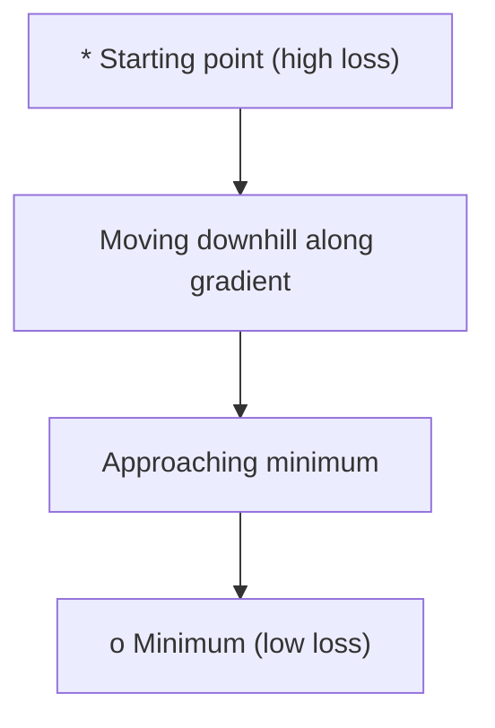
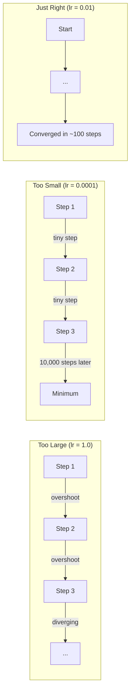
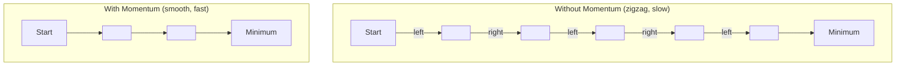
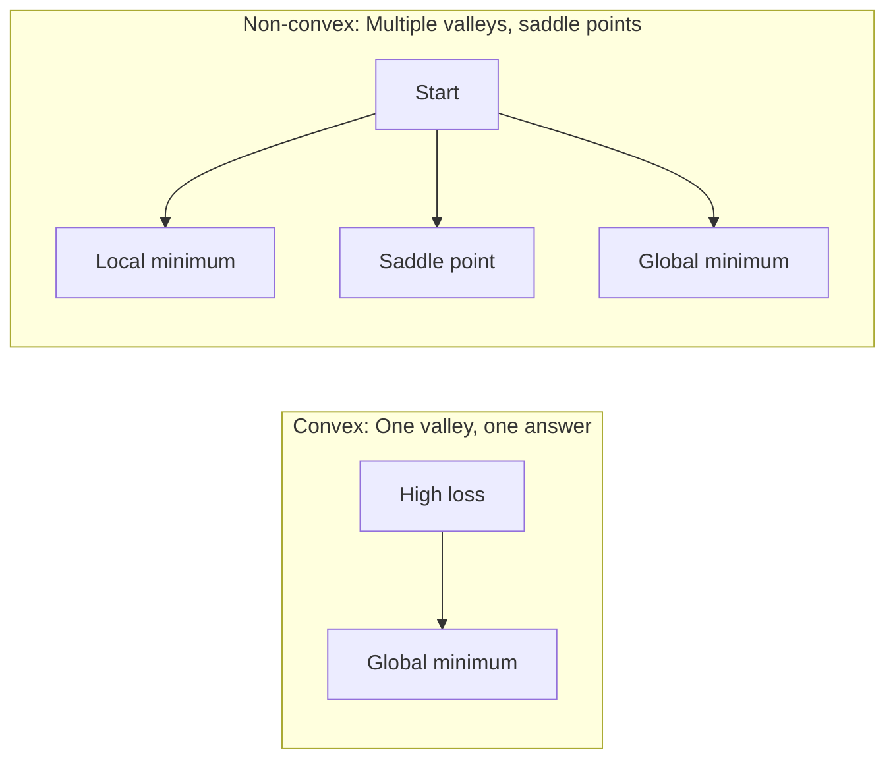
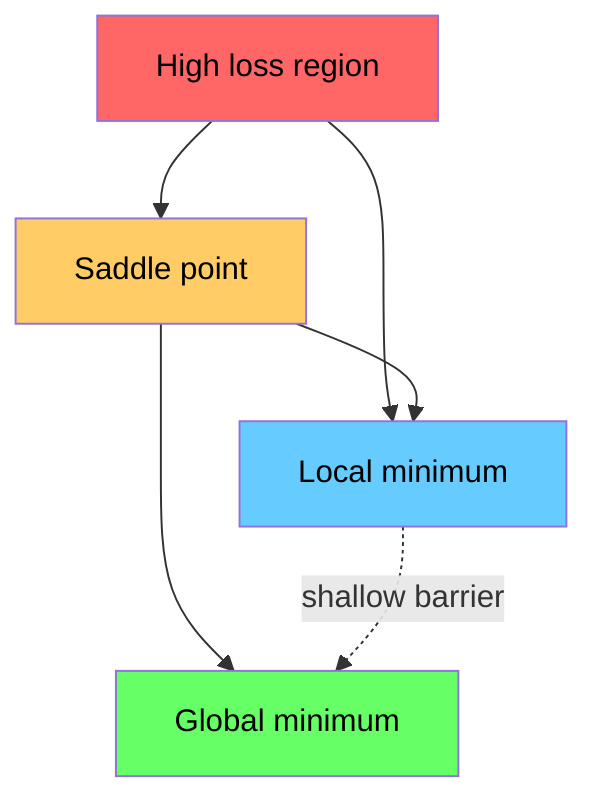

# 优化

> 训练一个神经网络，无非就是找到山谷的谷底。

**类型：** Build
**语言：** Python
**前置要求：** 阶段 1，第 04-05 课（导数，梯度）
**预计时间：** ~75 分钟

## 学习目标

- 从零实现原始梯度下降、带动量的 SGD 和 Adam
- 在 Rosenbrock 函数上比较各优化器的收敛，解释为什么 Adam 为每个权重自适应学习率
- 区分凸和非凸损失曲面，解释鞍点在高维中的作用
- 配置学习率调度（阶梯衰减、余弦退火、warmup）以保证训练稳定

## 问题所在

你有一个损失函数。它告诉你模型错得多离谱。你有梯度。它们告诉你哪个方向会让损失变得更糟。现在你需要一套往下坡走的策略。

朴素的办法很简单：往梯度的反方向走。把这一步乘上一个叫学习率的数。重复。这就是梯度下降，它管用。但"管用"是有附加条件的。学习率太大，你会整个越过山谷，在两壁之间来回弹。太小，你就要花上几千个不必要的步子才慢慢爬到答案。撞上鞍点，你哪怕还没找到最小值也会停下不动。

深度学习里的每个优化器，都是对同一个问题的回答：怎样更快、更可靠地到达谷底？

## 核心概念

### 优化是什么意思

优化就是找到让一个函数最小化（或最大化）的输入值。在机器学习里，这个函数是损失。输入是模型的权重。训练就是优化。

```
minimize L(w) where:
  L = loss function
  w = model weights (could be millions of parameters)
```

### 梯度下降（原始版）

最简单的优化器。计算损失对每个权重的梯度。把每个权重往它梯度的反方向移动。这一步乘上学习率。

```
w = w - lr * gradient
```

整个算法就这么点。一行。



### 学习率：最重要的超参数

学习率控制步长。它决定了收敛的一切。



没有公式能给出正确的学习率。你靠实验找它。常见的起点：Adam 用 0.001，带动量的 SGD 用 0.01。

### SGD vs 批量 vs 小批量

原始梯度下降在整个数据集上算完梯度才走一步。这叫批量梯度下降。它稳定但慢。

随机梯度下降（SGD）在单个随机样本上算梯度，立刻走一步。它有噪声但快。

小批量梯度下降折中。在一个小批量（32、64、128、256 个样本）上算梯度，然后走一步。这才是大家实际都在用的。

| 变体 | 批量大小 | 梯度质量 | 每步速度 | 噪声 |
|---------|-----------|-----------------|---------------|-------|
| 批量 GD | 整个数据集 | 精确 | 慢 | 无 |
| SGD | 1 个样本 | 噪声很大 | 快 | 高 |
| 小批量 | 32-256 | 好的估计 | 均衡 | 适中 |

SGD 和小批量里的噪声不是 bug。它有助于逃出浅的局部最小值和鞍点。

### 动量：滚下坡的小球

原始梯度下降只看当前梯度。如果梯度来回曲折（在狭窄山谷里很常见），进展就慢。动量把过去的梯度累积进一个速度项来修这个问题。

```
v = beta * v + gradient
w = w - lr * v
```

打个比方：一个滚下坡的球。它不会在每个凸起处停下重新启动。它在一致的方向上积累速度，并抑制摆动。



`beta`（通常 0.9）控制保留多少历史。beta 越高，动量越大，路径越平滑，但对方向变化的响应也越慢。

### Adam：自适应学习率

不同的权重需要不同的学习率。一个很少拿到大梯度的权重，应该在它终于拿到时走更大的步。一个一直拿到巨大梯度的权重，应该走更小的步。

Adam（Adaptive Moment Estimation）为每个权重追踪两样东西：

1. 一阶矩（m）：梯度的滑动平均（像动量）
2. 二阶矩（v）：梯度平方的滑动平均（梯度幅度）

```
m = beta1 * m + (1 - beta1) * gradient
v = beta2 * v + (1 - beta2) * gradient^2

m_hat = m / (1 - beta1^t)    bias correction
v_hat = v / (1 - beta2^t)    bias correction

w = w - lr * m_hat / (sqrt(v_hat) + epsilon)
```

除以 `sqrt(v_hat)` 是关键洞见。梯度大的权重被一个大数除（有效步小）。梯度小的权重被一个小数除（有效步大）。每个权重都拿到自己的自适应学习率。

默认超参数：`lr=0.001, beta1=0.9, beta2=0.999, epsilon=1e-8`。这些默认值对大多数问题都好用。

### 学习率调度

固定学习率是一种妥协。训练早期，你想要大步快速推进。训练后期，你想要小步在最小值附近微调。

常见调度：

| 调度 | 公式 | 适用场景 |
|----------|---------|----------|
| 阶梯衰减 | 每 N 个 epoch lr = lr * factor | 简单、手动控制 |
| 指数衰减 | lr = lr_0 * decay^t | 平滑下降 |
| 余弦退火 | lr = lr_min + 0.5 * (lr_max - lr_min) * (1 + cos(pi * t / T)) | transformer、现代训练 |
| Warmup + 衰减 | 线性爬升，然后衰减 | 大模型，防止早期不稳定 |

### 凸 vs 非凸

凸函数只有一个最小值。梯度下降总能找到它。像 `f(x) = x^2` 这样的二次函数是凸的。

神经网络损失函数是非凸的。它们有许多局部最小值、鞍点和平坦区域。



实践中，高维神经网络里的局部最小值很少是问题。大多数局部最小值的损失值都接近全局最小值。鞍点（在某些方向平坦、在另一些方向弯曲）才是真正的障碍。动量和小批量带来的噪声有助于逃出它们。

### 损失曲面可视化

损失是所有权重的函数。对于一个有 100 万个权重的模型，损失曲面活在 1,000,001 维空间里。我们可视化它的办法是：在权重空间里挑两个随机方向，沿这两个方向画损失，得到一个二维曲面。



尖锐的最小值泛化得差。平坦的最小值泛化得好。这是带动量的 SGD 在最终测试准确率上常常胜过 Adam 的原因之一：它的噪声防止落进尖锐的最小值。

## 动手构建

### 第 1 步：定义一个测试函数

Rosenbrock 函数是经典的优化基准。它的最小值在 (1, 1)，处在一条狭窄弯曲的山谷里——好找，却难跟。

```
f(x, y) = (1 - x)^2 + 100 * (y - x^2)^2
```

```python
def rosenbrock(params):
    x, y = params
    return (1 - x) ** 2 + 100 * (y - x ** 2) ** 2

def rosenbrock_gradient(params):
    x, y = params
    df_dx = -2 * (1 - x) + 200 * (y - x ** 2) * (-2 * x)
    df_dy = 200 * (y - x ** 2)
    return [df_dx, df_dy]
```

### 第 2 步：原始梯度下降

```python
class GradientDescent:
    def __init__(self, lr=0.001):
        self.lr = lr

    def step(self, params, grads):
        return [p - self.lr * g for p, g in zip(params, grads)]
```

### 第 3 步：带动量的 SGD

```python
class SGDMomentum:
    def __init__(self, lr=0.001, momentum=0.9):
        self.lr = lr
        self.momentum = momentum
        self.velocity = None

    def step(self, params, grads):
        if self.velocity is None:
            self.velocity = [0.0] * len(params)
        self.velocity = [
            self.momentum * v + g
            for v, g in zip(self.velocity, grads)
        ]
        return [p - self.lr * v for p, v in zip(params, self.velocity)]
```

### 第 4 步：Adam

```python
class Adam:
    def __init__(self, lr=0.001, beta1=0.9, beta2=0.999, epsilon=1e-8):
        self.lr = lr
        self.beta1 = beta1
        self.beta2 = beta2
        self.epsilon = epsilon
        self.m = None
        self.v = None
        self.t = 0

    def step(self, params, grads):
        if self.m is None:
            self.m = [0.0] * len(params)
            self.v = [0.0] * len(params)

        self.t += 1

        self.m = [
            self.beta1 * m + (1 - self.beta1) * g
            for m, g in zip(self.m, grads)
        ]
        self.v = [
            self.beta2 * v + (1 - self.beta2) * g ** 2
            for v, g in zip(self.v, grads)
        ]

        m_hat = [m / (1 - self.beta1 ** self.t) for m in self.m]
        v_hat = [v / (1 - self.beta2 ** self.t) for v in self.v]

        return [
            p - self.lr * mh / (vh ** 0.5 + self.epsilon)
            for p, mh, vh in zip(params, m_hat, v_hat)
        ]
```

### 第 5 步：运行并比较

```python
def optimize(optimizer, func, grad_func, start, steps=5000):
    params = list(start)
    history = [params[:]]
    for _ in range(steps):
        grads = grad_func(params)
        params = optimizer.step(params, grads)
        history.append(params[:])
    return history

start = [-1.0, 1.0]

gd_history = optimize(GradientDescent(lr=0.0005), rosenbrock, rosenbrock_gradient, start)
sgd_history = optimize(SGDMomentum(lr=0.0001, momentum=0.9), rosenbrock, rosenbrock_gradient, start)
adam_history = optimize(Adam(lr=0.01), rosenbrock, rosenbrock_gradient, start)

for name, history in [("GD", gd_history), ("SGD+M", sgd_history), ("Adam", adam_history)]:
    final = history[-1]
    loss = rosenbrock(final)
    print(f"{name:6s} -> x={final[0]:.6f}, y={final[1]:.6f}, loss={loss:.8f}")
```

预期输出：Adam 收敛最快。带动量的 SGD 走更平滑的路径。原始 GD 沿着狭窄山谷进展缓慢。

## 上手使用

实践中，用 PyTorch 或 JAX 的优化器。它们处理参数组、权重衰减、梯度裁剪和 GPU 加速。

```python
import torch

model = torch.nn.Linear(784, 10)

sgd = torch.optim.SGD(model.parameters(), lr=0.01, momentum=0.9)
adam = torch.optim.Adam(model.parameters(), lr=0.001)
adamw = torch.optim.AdamW(model.parameters(), lr=0.001, weight_decay=0.01)

scheduler = torch.optim.lr_scheduler.CosineAnnealingLR(adam, T_max=100)
```

经验法则：

- 从 Adam（lr=0.001）开始。它不用调参就能应付大多数问题。
- 当你需要最好的最终准确率、且有余力多调参时，换成带动量的 SGD（lr=0.01, momentum=0.9）。
- transformer 用 AdamW（带解耦权重衰减的 Adam）。
- 对于超过几个 epoch 的训练，总是用学习率调度。
- 如果训练不稳定，降低学习率。如果训练太慢，提高它。

## 交付

本节课产出一个用于选对优化器的提示词。参见 `outputs/prompt-optimizer-guide.md`。

这里构建的优化器类，会在阶段 3 我们从零训练神经网络时再次出现。

## 练习

1. **学习率扫描。** 用学习率 [0.0001, 0.0005, 0.001, 0.005, 0.01] 在 Rosenbrock 函数上跑原始梯度下降。画出或打印每个学习率跑 5000 步后的最终损失。找出仍能收敛的最大学习率。

2. **动量对比。** 用动量值 [0.0, 0.5, 0.9, 0.99] 在 Rosenbrock 函数上跑 SGD。追踪每一步的损失。哪个动量值收敛最快？哪个会越过头？

3. **逃离鞍点。** 定义函数 `f(x, y) = x^2 - y^2`（原点处是鞍点）。从 (0.01, 0.01) 出发。比较原始 GD、带动量的 SGD 和 Adam 的表现。哪个逃出了鞍点？

4. **实现学习率衰减。** 给 GradientDescent 类加一个指数衰减调度：`lr = lr_0 * 0.999^step`。在 Rosenbrock 函数上比较有衰减和无衰减时的收敛。

## 关键术语

| 术语 | 人们常说 | 它实际指什么 |
|------|----------------|----------------------|
| 梯度下降 | "往下坡走" | 通过减去按学习率缩放的梯度来更新权重。最基础的优化器。 |
| 学习率 | "步长" | 控制每次更新把权重移动多远的标量。太大导致发散。太小浪费算力。 |
| 动量 | "保持滚动" | 把过去的梯度累积进一个速度向量。抑制摆动，在一致方向上加速。 |
| SGD | "随机采样" | 随机梯度下降。在一个随机子集而非整个数据集上算梯度。实践中几乎总是指小批量 SGD。 |
| 小批量 | "一小块数据" | 用来估计梯度的训练数据小子集（32-256 个样本）。在速度和梯度准确度之间平衡。 |
| Adam | "默认优化器" | Adaptive Moment Estimation。追踪每个权重梯度及梯度平方的滑动平均，给每个权重自己的学习率。 |
| 偏差修正 | "修正冷启动" | Adam 的一阶和二阶矩初始化为零。偏差修正除以 (1 - beta^t) 来在早期步骤中补偿。 |
| 学习率调度 | "随时间改变 lr" | 在训练中调整学习率的函数。早期大步，后期小步。 |
| 凸函数 | "一个山谷" | 任何局部最小值都是全局最小值的函数。梯度下降总能找到它。神经网络损失不是凸的。 |
| 鞍点 | "平的但不是最小值" | 梯度为零、但在某些方向是最小值、另一些方向是最大值的点。在高维中常见。 |
| 损失曲面 | "地形" | 在权重空间上画出的损失函数。通过沿两个随机方向切片来可视化。 |
| 收敛 | "到位了" | 优化器到达了一个点，再走也不会明显减小损失。 |

## 延伸阅读

- [Sebastian Ruder: An overview of gradient descent optimization algorithms](https://ruder.io/optimizing-gradient-descent/) - 所有主要优化器的全面综述
- [Why Momentum Really Works (Distill)](https://distill.pub/2017/momentum/) - 动量动力学的交互式可视化
- [Adam: A Method for Stochastic Optimization (Kingma & Ba, 2014)](https://arxiv.org/abs/1412.6980) - Adam 原始论文，可读且简短
- [Visualizing the Loss Landscape of Neural Nets (Li et al., 2018)](https://arxiv.org/abs/1712.09913) - 展示尖锐 vs 平坦最小值的论文
