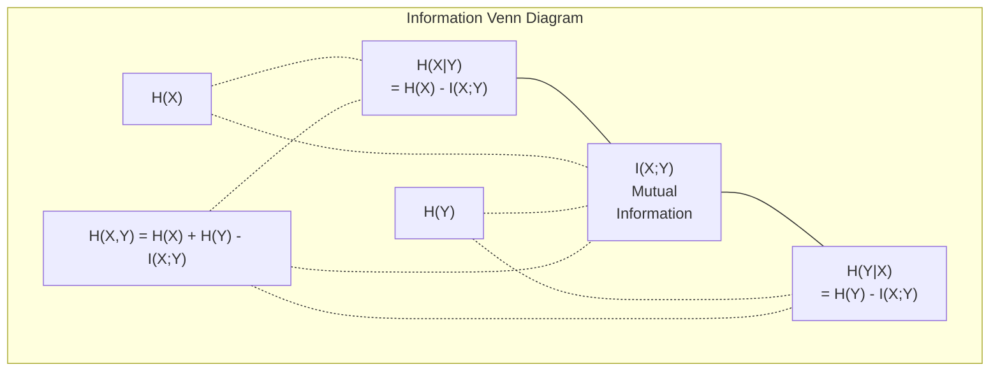

# 信息论

> 信息论度量惊讶。损失函数就建在它之上。

**类型：** Learn
**语言：** Python
**前置要求：** 阶段 1，第 06 课（概率）
**预计时间：** ~60 分钟

## 学习目标

- 从零计算熵、交叉熵和 KL 散度，并解释它们之间的关系
- 推导为什么最小化交叉熵损失等价于最大化对数似然
- 计算特征与目标之间的互信息，给特征重要性排序
- 把困惑度解释为语言模型从中挑选的有效词表大小

## 问题所在

你训练的每个分类模型里都会调 `CrossEntropyLoss()`。你在每篇语言模型论文里都见过"困惑度"。你在 VAE、蒸馏和 RLHF 里读到过 KL 散度。这些不是互不相干的概念。它们是同一个想法戴着不同的帽子。

信息论给你一套语言，用来推理不确定性、压缩和预测。Claude Shannon 在 1948 年发明它来解决通信问题。事实证明，训练神经网络就是一个通信问题：模型试图把正确的标签，通过一条由学到的权重构成的有噪声信道传输过去。

本节课从零搭出每个公式，让你看清它们从哪来、为什么有效。

## 核心概念

### 信息量（惊讶）

当不太可能的事发生时，它携带更多信息。硬币正面朝上？不惊讶。中彩票？非常惊讶。

一个概率为 p 的事件，其信息量是：

```
I(x) = -log(p(x))
```

用以 2 为底的对数给你比特（bit）。用自然对数给你奈特（nat）。同一个想法，不同单位。

```
Event              Probability    Surprise (bits)
Fair coin heads    0.5            1.0
Rolling a 6        0.167          2.58
1-in-1000 event    0.001          9.97
Certain event      1.0            0.0
```

确定事件携带零信息。你早就知道它会发生。

### 熵（平均惊讶）

熵是一个分布所有可能结果上惊讶的期望。

```
H(P) = -sum( p(x) * log(p(x)) )  for all x
```

对一个二值变量，公平硬币的熵最大：1 比特。偏向的硬币（99% 正面）熵很低：0.08 比特。你早知道会发生什么，所以每次抛掷几乎什么都没告诉你。

```
Fair coin:    H = -(0.5 * log2(0.5) + 0.5 * log2(0.5)) = 1.0 bit
Biased coin:  H = -(0.99 * log2(0.99) + 0.01 * log2(0.01)) = 0.08 bits
```

熵度量一个分布里不可约减的不确定性。你压缩不到它以下。

### 交叉熵（你每天都用的损失函数）

交叉熵度量：当你用分布 Q 去编码实际来自分布 P 的事件时，平均的惊讶。

```
H(P, Q) = -sum( p(x) * log(q(x)) )  for all x
```

P 是真实分布（标签）。Q 是你模型的预测。如果 Q 完美匹配 P，交叉熵就等于熵。任何不匹配都让它变大。

在分类里，P 是一个 one-hot 向量（真实类别概率为 1，其余全为 0）。这把交叉熵简化为：

```
H(P, Q) = -log(q(true_class))
```

这就是分类交叉熵损失的完整公式。最大化正确类别的预测概率。

### KL 散度（分布之间的距离）

KL 散度度量：用 Q 而非 P 会带来多少额外的惊讶。

```
D_KL(P || Q) = sum( p(x) * log(p(x) / q(x)) )  for all x
             = H(P, Q) - H(P)
```

交叉熵就是熵加 KL 散度。由于真实分布的熵在训练中是常数，最小化交叉熵和最小化 KL 散度是一回事。你在把模型的分布往真实分布推。

KL 散度不对称：D_KL(P || Q) != D_KL(Q || P)。它不是真正的距离度量。

### 互信息

互信息度量：知道一个变量能告诉你多少关于另一个变量的信息。

```
I(X; Y) = H(X) - H(X|Y)
        = H(X) + H(Y) - H(X, Y)
```

如果 X 和 Y 独立，互信息为零。知道一个对另一个毫无帮助。如果它们完全相关，互信息等于其中任一变量的熵。

在特征选择里，一个特征和目标之间互信息高意味着这个特征有用。互信息低意味着它是噪声。

### 条件熵

H(Y|X) 度量：在你观测到 X 之后，关于 Y 还剩多少不确定性。

```
H(Y|X) = H(X,Y) - H(X)
```

两个极端：
- 如果 X 完全决定 Y，那么 H(Y|X) = 0。知道 X 就消除了关于 Y 的全部不确定性。例子：X = 摄氏温度，Y = 华氏温度。
- 如果 X 对 Y 什么都没说，那么 H(Y|X) = H(Y)。知道 X 一点都没减少你的不确定性。例子：X = 抛硬币，Y = 明天的天气。

条件熵总是非负，且永不超过 H(Y)：

```
0 <= H(Y|X) <= H(Y)
```

在机器学习里，条件熵出现在决策树中。每次分裂，算法挑能最小化 H(Y|X) 的特征 X——也就是能消除关于标签 Y 最多不确定性的那个特征。

### 联合熵

H(X,Y) 是 X 和 Y 共同的联合分布的熵。

```
H(X,Y) = -sum sum p(x,y) * log(p(x,y))   for all x, y
```

关键性质：

```
H(X,Y) <= H(X) + H(Y)
```

当 X 和 Y 独立时取等号。如果它们共享信息，联合熵就小于各自熵之和。"缺失"的那部分熵恰好就是互信息。



这些关系：
- H(X,Y) = H(X) + H(Y|X) = H(Y) + H(X|Y)
- I(X;Y) = H(X) - H(X|Y) = H(Y) - H(Y|X)
- H(X,Y) = H(X) + H(Y) - I(X;Y)

### 互信息（深入）

互信息 I(X;Y) 量化：知道一个变量能减少多少关于另一个变量的不确定性。

```
I(X;Y) = H(X) - H(X|Y)
       = H(Y) - H(Y|X)
       = H(X) + H(Y) - H(X,Y)
       = sum sum p(x,y) * log(p(x,y) / (p(x) * p(y)))
```

性质：
- I(X;Y) >= 0 恒成立。你观测某事永远不会损失信息。
- I(X;Y) = 0 当且仅当 X 和 Y 独立。
- I(X;Y) = I(Y;X)。它对称，不像 KL 散度。
- I(X;X) = H(X)。一个变量把它的全部信息与自己共享。

**用于特征选择的互信息。** 在 ML 里，你想要对目标有信息量的特征。互信息给你一种有原则的方式来给特征排序：

1. 对每个特征 X_i，计算 I(X_i; Y)，其中 Y 是目标变量。
2. 按 MI 分数给特征排序。
3. 保留前 k 个特征。

它对特征和目标之间任何关系都有效——线性、非线性、单调或不单调。相关系数只能逮住线性关系。MI 什么都逮得住。

| 方法 | 检测 | 计算代价 | 处理类别型？ |
|--------|---------|-------------------|---------------------|
| Pearson 相关 | 线性关系 | O(n) | 否 |
| Spearman 相关 | 单调关系 | O(n log n) | 否 |
| 互信息 | 任何统计依赖 | 分箱后 O(n log n) | 是 |

### 标签平滑与交叉熵

标准分类用硬目标：[0, 0, 1, 0]。真实类别拿到概率 1，其余全是 0。标签平滑把它们换成软目标：

```
soft_target = (1 - epsilon) * hard_target + epsilon / num_classes
```

取 epsilon = 0.1、4 个类别：
- 硬目标：[0, 0, 1, 0]
- 软目标：[0.025, 0.025, 0.925, 0.025]

从信息论角度看，标签平滑提高了目标分布的熵。硬 one-hot 目标的熵是 0——没有不确定性。软目标有正的熵。

它为什么有帮助：
- 防止模型把 logits 推向极端值（在交叉熵下，要完美匹配 one-hot 目标需要无穷大的 logits）
- 起正则化作用：模型没法 100% 自信
- 改善校准：预测概率更好地反映真实的不确定性
- 缩小训练和推理行为之间的差距

带标签平滑的交叉熵损失变成：

```
L = (1 - epsilon) * CE(hard_target, prediction) + epsilon * H_uniform(prediction)
```

第二项惩罚远离均匀的预测——一种直接对自信度的正则化。

### 为什么交叉熵就是那个分类损失

三个视角，同一个结论。

**信息论视角。** 交叉熵度量：用你模型的分布而非真实分布，你浪费了多少比特。最小化它让你的模型成为现实最高效的编码器。

**最大似然视角。** 对于 N 个训练样本、真实类别为 y_i：

```
Likelihood     = product( q(y_i) )
Log-likelihood = sum( log(q(y_i)) )
Negative log-likelihood = -sum( log(q(y_i)) )
```

最后一行就是交叉熵损失。最小化交叉熵 = 在你模型下最大化训练数据的似然。

**梯度视角。** 交叉熵对 logits 的梯度就是简单的（预测值 - 真实值）。干净、稳定、算起来快。这就是它和 softmax 完美搭档的原因。

### 比特 vs 奈特

唯一的区别是对数的底。

```
log base 2   -> bits      (information theory tradition)
log base e   -> nats      (machine learning convention)
log base 10  -> hartleys  (rarely used)
```

1 奈特 = 1/ln(2) 比特 = 1.4427 比特。PyTorch 和 TensorFlow 默认用自然对数（奈特）。

### 困惑度

困惑度是交叉熵的指数。它告诉你模型在多少个等可能选项之间犹豫不决——也就是有效的选项数。

```
Perplexity = 2^H(P,Q)   (if using bits)
Perplexity = e^H(P,Q)   (if using nats)
```

一个困惑度为 50 的语言模型，平均而言糊涂得就像它要从 50 个可能的下一个 token 里均匀挑一个。越低越好。

GPT-2 在常见基准上达到约 30 的困惑度。现代模型在表示充分的领域里能做到个位数。

## 动手构建

### 第 1 步：信息量和熵

```python
import math

def information_content(p, base=2):
    if p <= 0 or p > 1:
        return float('inf') if p <= 0 else 0.0
    return -math.log(p) / math.log(base)

def entropy(probs, base=2):
    return sum(
        p * information_content(p, base)
        for p in probs if p > 0
    )

fair_coin = [0.5, 0.5]
biased_coin = [0.99, 0.01]
fair_die = [1/6] * 6

print(f"Fair coin entropy:   {entropy(fair_coin):.4f} bits")
print(f"Biased coin entropy: {entropy(biased_coin):.4f} bits")
print(f"Fair die entropy:    {entropy(fair_die):.4f} bits")
```

### 第 2 步：交叉熵和 KL 散度

```python
def cross_entropy(p, q, base=2):
    total = 0.0
    for pi, qi in zip(p, q):
        if pi > 0:
            if qi <= 0:
                return float('inf')
            total += pi * (-math.log(qi) / math.log(base))
    return total

def kl_divergence(p, q, base=2):
    return cross_entropy(p, q, base) - entropy(p, base)

true_dist = [0.7, 0.2, 0.1]
good_model = [0.6, 0.25, 0.15]
bad_model = [0.1, 0.1, 0.8]

print(f"Entropy of true dist:     {entropy(true_dist):.4f} bits")
print(f"CE (good model):          {cross_entropy(true_dist, good_model):.4f} bits")
print(f"CE (bad model):           {cross_entropy(true_dist, bad_model):.4f} bits")
print(f"KL divergence (good):     {kl_divergence(true_dist, good_model):.4f} bits")
print(f"KL divergence (bad):      {kl_divergence(true_dist, bad_model):.4f} bits")
```

### 第 3 步：交叉熵作为分类损失

```python
def softmax(logits):
    max_logit = max(logits)
    exps = [math.exp(z - max_logit) for z in logits]
    total = sum(exps)
    return [e / total for e in exps]

def cross_entropy_loss(true_class, logits):
    probs = softmax(logits)
    return -math.log(probs[true_class])

logits = [2.0, 1.0, 0.1]
true_class = 0

probs = softmax(logits)
loss = cross_entropy_loss(true_class, logits)

print(f"Logits:      {logits}")
print(f"Softmax:     {[f'{p:.4f}' for p in probs]}")
print(f"True class:  {true_class}")
print(f"Loss:        {loss:.4f} nats")
print(f"Perplexity:  {math.exp(loss):.2f}")
```

### 第 4 步：交叉熵等于负对数似然

```python
import random

random.seed(42)

n_samples = 1000
n_classes = 3
true_labels = [random.randint(0, n_classes - 1) for _ in range(n_samples)]
model_logits = [[random.gauss(0, 1) for _ in range(n_classes)] for _ in range(n_samples)]

ce_loss = sum(
    cross_entropy_loss(label, logits)
    for label, logits in zip(true_labels, model_logits)
) / n_samples

nll = -sum(
    math.log(softmax(logits)[label])
    for label, logits in zip(true_labels, model_logits)
) / n_samples

print(f"Cross-entropy loss:      {ce_loss:.6f}")
print(f"Negative log-likelihood: {nll:.6f}")
print(f"Difference:              {abs(ce_loss - nll):.2e}")
```

### 第 5 步：互信息

```python
def mutual_information(joint_probs, base=2):
    rows = len(joint_probs)
    cols = len(joint_probs[0])

    margin_x = [sum(joint_probs[i][j] for j in range(cols)) for i in range(rows)]
    margin_y = [sum(joint_probs[i][j] for i in range(rows)) for j in range(cols)]

    mi = 0.0
    for i in range(rows):
        for j in range(cols):
            pxy = joint_probs[i][j]
            if pxy > 0:
                mi += pxy * math.log(pxy / (margin_x[i] * margin_y[j])) / math.log(base)
    return mi

independent = [[0.25, 0.25], [0.25, 0.25]]
dependent = [[0.45, 0.05], [0.05, 0.45]]

print(f"MI (independent): {mutual_information(independent):.4f} bits")
print(f"MI (dependent):   {mutual_information(dependent):.4f} bits")
```

## 上手使用

同样的概念用 NumPy 实现，这是你实践中会用的方式：

```python
import numpy as np

def np_entropy(p):
    p = np.asarray(p, dtype=float)
    mask = p > 0
    result = np.zeros_like(p)
    result[mask] = p[mask] * np.log(p[mask])
    return -result.sum()

def np_cross_entropy(p, q):
    p, q = np.asarray(p, dtype=float), np.asarray(q, dtype=float)
    mask = p > 0
    return -(p[mask] * np.log(q[mask])).sum()

def np_kl_divergence(p, q):
    return np_cross_entropy(p, q) - np_entropy(p)

true = np.array([0.7, 0.2, 0.1])
pred = np.array([0.6, 0.25, 0.15])
print(f"Entropy:    {np_entropy(true):.4f} nats")
print(f"Cross-ent:  {np_cross_entropy(true, pred):.4f} nats")
print(f"KL div:     {np_kl_divergence(true, pred):.4f} nats")
```

你从零写出了 `torch.nn.CrossEntropyLoss()` 内部做的事。现在你知道训练时损失为什么会下降了：你模型的预测分布正在靠近真实分布，单位是被浪费信息的奈特数。

## 练习

1. 假设均匀分布（26 个字母），计算英文字母表的熵。然后用实际的字母频率估计它。哪个更高，为什么？

2. 一个模型对真实类别为 1 的样本输出 logits [5.0, 2.0, 0.5]。手算交叉熵损失，再用你的 `cross_entropy_loss` 函数验证。什么样的 logits 会给出零损失？

3. 证明 KL 散度不对称。挑两个分布 P 和 Q，计算 D_KL(P || Q) 和 D_KL(Q || P)。解释它们为什么不同。

4. 构建一个函数，为一串 token 预测计算困惑度。给定一组 (true_token_index, predicted_logits) 对，返回该序列的困惑度。

## 关键术语

| 术语 | 人们常说 | 它实际指什么 |
|------|----------------|----------------------|
| 信息量 | "惊讶" | 编码一个事件所需的比特（或奈特）数：-log(p) |
| 熵 | "随机性" | 一个分布所有结果上惊讶的平均。度量不可约减的不确定性。 |
| 交叉熵 | "损失函数" | 用模型分布 Q 去编码来自真实分布 P 的事件时的平均惊讶。 |
| KL 散度 | "分布之间的距离" | 用 Q 而非 P 浪费掉的额外比特。等于交叉熵减熵。不对称。 |
| 互信息 | "X 和 Y 有多相关" | 知道 Y 后关于 X 的不确定性减少量。为零意味着独立。 |
| Softmax | "把 logits 变成概率" | 取指数再归一化。把任意实值向量映射成合法的概率分布。 |
| 困惑度 | "模型有多糊涂" | 交叉熵的指数。模型每一步从中挑选的有效词表大小。 |
| 比特 | "Shannon 的单位" | 以 2 为底对数度量的信息。一个比特解决一次公平抛硬币。 |
| 奈特 | "ML 的单位" | 用自然对数度量的信息。PyTorch 和 TensorFlow 默认用它。 |
| 负对数似然 | "NLL 损失" | 对 one-hot 标签而言与交叉熵损失完全相同。最小化它就是最大化正确预测的概率。 |

## 延伸阅读

- [Shannon 1948: A Mathematical Theory of Communication](https://people.math.harvard.edu/~ctm/home/text/others/shannon/entropy/entropy.pdf) - 原始论文，至今仍可读
- [Visual Information Theory (Chris Olah)](https://colah.github.io/posts/2015-09-Visual-Information/) - 对熵和 KL 散度最好的可视化讲解
- [PyTorch CrossEntropyLoss docs](https://pytorch.org/docs/stable/generated/torch.nn.CrossEntropyLoss.html) - 框架如何实现你刚刚构建的东西
