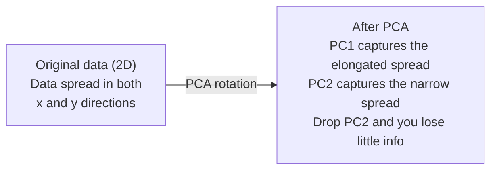

# 降维

> 高维数据是有结构的。你从对的角度去看，才能找到它。

**类型：** Build
**语言：** Python
**前置要求：** 阶段 1，第 01 课（线性代数直觉）、02 课（向量、矩阵与运算）、03 课（特征值与特征向量）、06 课（概率与分布）
**预计时间：** ~90 分钟

## 学习目标

- 从零实现 PCA：数据中心化、计算协方差矩阵、特征分解、投影
- 用解释方差比和肘部法则选择主成分的数量
- 比较 PCA、t-SNE 和 UMAP 在二维可视化 MNIST 数字上的表现，并解释各自的权衡
- 用带 RBF 核的核 PCA 分离标准 PCA 处理不了的非线性数据结构

## 问题所在

你有一个数据集，每个样本有 784 个特征。可能是手写数字的像素值。可能是基因表达水平。可能是用户行为信号。你没法可视化 784 个维度。你画不出来。你甚至想都想不过来。

但那 784 个特征里大多数是冗余的。真正的信息活在一个小得多的曲面上。一个手写"7"不需要 784 个独立的数来描述。它只需要几个：笔画的角度、横杠的长度、它倾斜了多少。其余都是噪声。

降维找的就是那个更小的曲面。它把你 784 维的数据压缩到 2 维、10 维或 50 维，同时保留要紧的结构。

## 核心概念

### 维数灾难

高维空间反直觉。随着维度增长，有三件事会崩。

**距离变得没有意义。** 在高维里，任意两个随机点之间的距离会收敛到同一个值。如果每个点到其他每个点的距离都差不多，最近邻搜索就不灵了。

```
Dimension    Avg distance ratio (max/min between random points)
2            ~5.0
10           ~1.8
100          ~1.2
1000         ~1.02
```

**体积集中在角落。** d 维的单位超立方体有 2^d 个角。在 100 维里，几乎所有体积都在角落里，离中心很远。数据点散到边缘，你的模型在内部就缺数据了。

**你需要指数级更多的数据。** 要在一个空间里维持同样的样本密度，从 2 维到 20 维意味着你需要多 10^18 倍的数据。你永远不够用。降维把数据密度拉回到一个还能干活的程度。

### PCA：找出要紧的方向

主成分分析（PCA）找出你数据变化最大的那些轴。它旋转你的坐标系，让第一根轴捕获最多方差，第二根捕获次多，以此类推。

算法：

```
1. Center the data        (subtract the mean from each feature)
2. Compute covariance     (how features move together)
3. Eigendecomposition     (find the principal directions)
4. Sort by eigenvalue     (biggest variance first)
5. Project               (keep top k eigenvectors, drop the rest)
```

为什么要特征分解？协方差矩阵是对称且半正定的。它的特征向量是特征空间里互相正交的方向。特征值告诉你每个方向捕获了多少方差。特征值最大的那个特征向量，指向方差最大的方向。



- **PCA 之前：** 数据云沿对角方向铺开，横跨 x 和 y 两根轴
- **PCA 之后：** 坐标系被旋转，PC1 对齐方差最大的方向（拉长的铺展），PC2 对齐方差最小的方向（狭窄的铺展）
- **降维：** 丢掉 PC2 就是把数据投影到 PC1 上，损失的信息很少

### 解释方差比

每个主成分捕获总方差的一部分。解释方差比告诉你是多少。

```
Component    Eigenvalue    Explained ratio    Cumulative
PC1          4.73          0.473              0.473
PC2          2.51          0.251              0.724
PC3          1.12          0.112              0.836
PC4          0.89          0.089              0.925
...
```

当累计解释方差到达 0.95 时，你就知道那么多成分捕获了 95% 的信息。之后的基本都是噪声。

### 选择成分的数量

三种策略：

1. **阈值。** 保留足够多的成分以解释 90-95% 的方差。
2. **肘部法则。** 画出每个成分的解释方差。找那个陡降的拐点。
3. **下游表现。** 把 PCA 当预处理。扫不同的 k，测量你模型的准确率。最好的 k 在准确率趋于平稳的地方。

### t-SNE：保留邻域

t 分布随机邻域嵌入（t-SNE）是为可视化设计的。它把高维数据映射到二维（或三维），同时保留哪些点彼此靠近。

直觉：在原始空间里，基于点对之间的距离计算一个概率分布。靠近的点拿到高概率。远的点拿到低概率。然后找一个二维排布，让同样的概率分布成立。在 784 维里是邻居的点，在二维里仍是邻居。

t-SNE 的关键性质：
- 非线性。它能展开 PCA 做不到的复杂流形。
- 随机。不同次运行产生不同的布局。
- perplexity 参数控制考虑多少个邻居（典型范围：5-50）。
- 输出里簇与簇之间的距离没有意义。只有簇本身有意义。
- 在大数据集上慢。默认 O(n^2)。

### UMAP：更快、全局结构更好

均匀流形近似与投影（UMAP）和 t-SNE 工作方式类似，但有两个优势：
- 更快。它用近似最近邻图，而不是计算所有成对距离。
- 全局结构更好。输出里簇的相对位置往往比 t-SNE 更有意义。

UMAP 在高维空间里构建一个加权图（"模糊拓扑表示"），然后找一个尽可能保留这个图的低维布局。

关键参数：
- `n_neighbors`：多少个邻居定义局部结构（类似 perplexity）。值越高保留越多全局结构。
- `min_dist`：输出里点挤得多紧。值越低产生越密的簇。

### 何时用哪个

| 方法 | 适用场景 | 保留 | 速度 |
|--------|----------|-----------|-------|
| PCA | 训练前的预处理 | 全局方差 | 快（精确），能处理上百万样本 |
| PCA | 快速探索性可视化 | 线性结构 | 快 |
| t-SNE | 出版质量的二维图 | 局部邻域 | 慢（< 1 万样本最理想） |
| UMAP | 大规模二维可视化 | 局部 + 部分全局结构 | 中等（能处理上百万） |
| PCA | 给模型做特征缩减 | 按方差排序的特征 | 快 |
| t-SNE / UMAP | 理解簇结构 | 簇的分离 | 中等到慢 |

经验法则：预处理和数据压缩用 PCA。需要在二维里可视化结构时用 t-SNE 或 UMAP。

### 核 PCA

标准 PCA 找的是线性子空间。它旋转你的坐标系再丢掉一些轴。但如果数据落在一个非线性流形上呢？二维里的一个圆没法用任何直线分开。标准 PCA 帮不上忙。

核 PCA 在由一个核函数诱导出的高维特征空间里做 PCA，却不显式计算那个空间里的坐标。这就是核技巧——和 SVM 背后是同一个想法。

算法：
1. 计算核矩阵 K，其中 K_ij = k(x_i, x_j)
2. 在特征空间里中心化核矩阵
3. 对中心化后的核矩阵做特征分解
4. 顶部的特征向量（按 1/sqrt(eigenvalue) 缩放）就是投影

常见核函数：

| 核 | 公式 | 适合 |
|--------|---------|----------|
| RBF（高斯） | exp(-gamma * \|\|x - y\|\|^2) | 大多数非线性数据、光滑流形 |
| 多项式 | (x . y + c)^d | 多项式关系 |
| Sigmoid | tanh(alpha * x . y + c) | 类神经网络的映射 |

核 PCA 还是标准 PCA：

| 标准 | 标准 PCA | 核 PCA |
|-----------|-------------|------------|
| 数据结构 | 线性子空间 | 非线性流形 |
| 速度 | O(min(n^2 d, d^2 n)) | O(n^2 d + n^3) |
| 可解释性 | 成分是特征的线性组合 | 成分缺乏直接的特征解释 |
| 可扩展性 | 能处理上百万样本 | 核矩阵是 n x n，受内存限制 |
| 重构 | 直接逆变换 | 需要原像近似 |

经典例子：二维里的同心圆。两环点，一个套在另一个里面。标准 PCA 把两环都投影到同一条直线上——对分类毫无用处。带 RBF 核的核 PCA 把内圈和外圈映射到不同区域，使它们线性可分。

### 重构误差

你的降维有多好？你把 784 维压缩到了 50 维。丢了什么？

度量重构误差：
1. 把数据投影到 k 维：X_reduced = X @ W_k
2. 重构：X_hat = X_reduced @ W_k^T
3. 计算 MSE：mean((X - X_hat)^2)

对 PCA 来说，重构误差和解释方差有一个干净的关系：

```
Reconstruction error = sum of eigenvalues NOT included
Total variance = sum of ALL eigenvalues
Fraction lost = (sum of dropped eigenvalues) / (sum of all eigenvalues)
```

每个成分的解释方差比是：

```
explained_ratio_k = eigenvalue_k / sum(all eigenvalues)
```

把累计解释方差对成分数量画出来，就得到那条"肘部"曲线。正确的成分数量在这里：
- 曲线变平的地方（收益递减）
- 累计方差越过你的阈值（通常 0.90 或 0.95）
- 下游任务表现趋于平稳

重构误差不止用来选 k。你可以用它做异常检测：重构误差高的样本是不符合学到的子空间的离群点。这是生产系统里基于 PCA 的异常检测的基础。

## 动手构建

### 第 1 步：从零写 PCA

```python
import numpy as np

class PCA:
    def __init__(self, n_components):
        self.n_components = n_components
        self.components = None
        self.mean = None
        self.eigenvalues = None
        self.explained_variance_ratio_ = None

    def fit(self, X):
        self.mean = np.mean(X, axis=0)
        X_centered = X - self.mean

        cov_matrix = np.cov(X_centered, rowvar=False)

        eigenvalues, eigenvectors = np.linalg.eigh(cov_matrix)

        sorted_idx = np.argsort(eigenvalues)[::-1]
        eigenvalues = eigenvalues[sorted_idx]
        eigenvectors = eigenvectors[:, sorted_idx]

        self.components = eigenvectors[:, :self.n_components].T
        self.eigenvalues = eigenvalues[:self.n_components]
        total_var = np.sum(eigenvalues)
        self.explained_variance_ratio_ = self.eigenvalues / total_var

        return self

    def transform(self, X):
        X_centered = X - self.mean
        return X_centered @ self.components.T

    def fit_transform(self, X):
        self.fit(X)
        return self.transform(X)
```

### 第 2 步：在合成数据上测试

```python
np.random.seed(42)
n_samples = 500

t = np.random.uniform(0, 2 * np.pi, n_samples)
x1 = 3 * np.cos(t) + np.random.normal(0, 0.2, n_samples)
x2 = 3 * np.sin(t) + np.random.normal(0, 0.2, n_samples)
x3 = 0.5 * x1 + 0.3 * x2 + np.random.normal(0, 0.1, n_samples)

X_synthetic = np.column_stack([x1, x2, x3])

pca = PCA(n_components=2)
X_reduced = pca.fit_transform(X_synthetic)

print(f"Original shape: {X_synthetic.shape}")
print(f"Reduced shape:  {X_reduced.shape}")
print(f"Explained variance ratios: {pca.explained_variance_ratio_}")
print(f"Total variance captured: {sum(pca.explained_variance_ratio_):.4f}")
```

### 第 3 步：二维里的 MNIST 数字

```python
from sklearn.datasets import fetch_openml

mnist = fetch_openml("mnist_784", version=1, as_frame=False, parser="auto")
X_mnist = mnist.data[:5000].astype(float)
y_mnist = mnist.target[:5000].astype(int)

pca_mnist = PCA(n_components=50)
X_pca50 = pca_mnist.fit_transform(X_mnist)
print(f"50 components capture {sum(pca_mnist.explained_variance_ratio_):.2%} of variance")

pca_2d = PCA(n_components=2)
X_pca2d = pca_2d.fit_transform(X_mnist)
print(f"2 components capture {sum(pca_2d.explained_variance_ratio_):.2%} of variance")
```

### 第 4 步：和 sklearn 对比

```python
from sklearn.decomposition import PCA as SklearnPCA
from sklearn.manifold import TSNE

sklearn_pca = SklearnPCA(n_components=2)
X_sklearn_pca = sklearn_pca.fit_transform(X_mnist)

print(f"\nOur PCA explained variance:     {pca_2d.explained_variance_ratio_}")
print(f"Sklearn PCA explained variance: {sklearn_pca.explained_variance_ratio_}")

diff = np.abs(np.abs(X_pca2d) - np.abs(X_sklearn_pca))
print(f"Max absolute difference: {diff.max():.10f}")

tsne = TSNE(n_components=2, perplexity=30, random_state=42)
X_tsne = tsne.fit_transform(X_mnist)
print(f"\nt-SNE output shape: {X_tsne.shape}")
```

### 第 5 步：UMAP 对比

```python
try:
    from umap import UMAP

    reducer = UMAP(n_components=2, n_neighbors=15, min_dist=0.1, random_state=42)
    X_umap = reducer.fit_transform(X_mnist)
    print(f"UMAP output shape: {X_umap.shape}")
except ImportError:
    print("Install umap-learn: pip install umap-learn")
```

## 上手使用

把 PCA 当分类器前的预处理：

```python
from sklearn.decomposition import PCA as SklearnPCA
from sklearn.linear_model import LogisticRegression
from sklearn.model_selection import train_test_split
from sklearn.metrics import accuracy_score

X_train, X_test, y_train, y_test = train_test_split(
    X_mnist, y_mnist, test_size=0.2, random_state=42
)

results = {}
for k in [10, 30, 50, 100, 200]:
    pca_k = SklearnPCA(n_components=k)
    X_tr = pca_k.fit_transform(X_train)
    X_te = pca_k.transform(X_test)

    clf = LogisticRegression(max_iter=1000, random_state=42)
    clf.fit(X_tr, y_train)
    acc = accuracy_score(y_test, clf.predict(X_te))
    var_captured = sum(pca_k.explained_variance_ratio_)
    results[k] = (acc, var_captured)
    print(f"k={k:>3d}  accuracy={acc:.4f}  variance={var_captured:.4f}")
```

表现在远不到 784 维时就趋于平稳了。那个平稳点就是你的工作点。

## 交付

本节课产出：
- `outputs/skill-dimensionality-reduction.md` - 一个为给定任务选对降维技术的 skill

## 练习

1. 修改 PCA 类以支持 `inverse_transform`。从 10、50 和 200 个成分重构 MNIST 数字。分别打印重构误差（与原图的均方差）。

2. 在同一个 MNIST 子集上用 perplexity 值 5、30 和 100 跑 t-SNE。描述输出怎么变。为什么 perplexity 会影响簇的紧密度？

3. 取一个有 50 个特征、但只有 5 个有信息量的数据集（用 `sklearn.datasets.make_classification` 生成一个）。应用 PCA，检查解释方差曲线是否正确地识别出这数据实际上是 5 维的。

## 关键术语

| 术语 | 人们常说 | 它实际指什么 |
|------|----------------|----------------------|
| 维数灾难 | "特征太多" | 随着维度增长，距离、体积和数据密度全都表现得反直觉。模型需要指数级更多的数据来弥补。 |
| PCA | "降维" | 旋转坐标系让各轴对齐方差最大的方向，然后丢掉低方差的轴。 |
| 主成分 | "一个重要方向" | 协方差矩阵的一个特征向量。特征空间里数据变化最大的方向。 |
| 解释方差比 | "这个成分有多少信息" | 一个主成分捕获的总方差占比。把前 k 个比例加起来就知道 k 个成分保留了多少。 |
| 协方差矩阵 | "特征怎么相关" | 一个对称矩阵，第 (i,j) 项度量特征 i 和特征 j 如何一起变化。对角元是各自的方差。 |
| t-SNE | "那个簇图" | 一种非线性方法，通过保留成对邻域概率把高维数据映射到二维。适合可视化，不适合预处理。 |
| UMAP | "更快的 t-SNE" | 一种基于拓扑数据分析的非线性方法。同时保留局部和部分全局结构。比 t-SNE 更能扩展。 |
| Perplexity | "t-SNE 的一个旋钮" | 控制每个点考虑的有效邻居数。低 perplexity 聚焦非常局部的结构。高 perplexity 捕获更宽的模式。 |
| 流形 | "数据所在的曲面" | 嵌在更高维空间里的一个低维曲面。在三维里揉皱的一张纸是二维流形。 |

## 延伸阅读

- [A Tutorial on Principal Component Analysis](https://arxiv.org/abs/1404.1100)（Shlens）- 从头清晰推导 PCA
- [How to Use t-SNE Effectively](https://distill.pub/2016/misread-tsne/)（Wattenberg 等）- t-SNE 陷阱和参数选择的交互式指南
- [UMAP documentation](https://umap-learn.readthedocs.io/) - 来自 UMAP 作者的理论和实践指导
