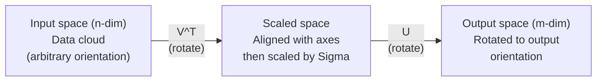
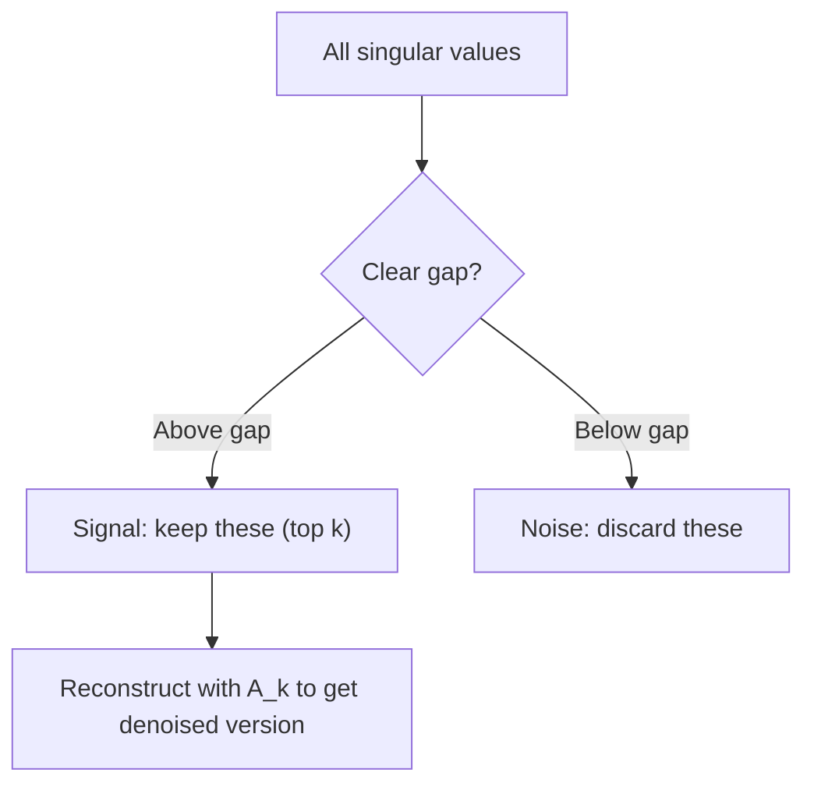

# 奇异值分解

> SVD 是线性代数里的瑞士军刀。每个矩阵都有一个。每个数据科学家都需要一个。

**类型：** Build
**语言：** Python、Julia
**前置要求：** 阶段 1，第 01 课（线性代数直觉）、02 课（向量与矩阵运算）、03 课（矩阵变换）
**预计时间：** ~120 分钟

## 学习目标

- 用幂迭代实现 SVD，并解释 U、Sigma、V^T 的几何含义
- 用截断 SVD 做图像压缩，测量压缩比与重构误差的关系
- 用 SVD 计算 Moore-Penrose 伪逆，求解超定的最小二乘系统
- 把 SVD 和 PCA、推荐系统（潜在因子）、NLP 里的潜在语义分析联系起来

## 问题所在

你有一个 1000x2000 的矩阵。可能是用户-电影评分。可能是文档-词频表。可能是一张图像的像素值。你需要压缩它、给它去噪、找出它里面隐藏的结构，或者用它解一个最小二乘系统。特征分解只对方阵有效。即便如此，它还要求矩阵有一整套线性无关的特征向量。

SVD 对任何矩阵都有效。任意形状。任意秩。没有条件。它把矩阵分解成三个因子，揭示矩阵对空间所做之事的几何。它是整个线性代数里最通用、最有用的分解。

## 核心概念

### SVD 在几何上做什么

每个矩阵，不管什么形状，都按顺序执行三个操作：旋转、缩放、旋转。SVD 把这个分解显式地写出来。

```
A = U * Sigma * V^T

      m x n     m x m    m x n    n x n
     (any)    (rotate)  (scale)  (rotate)
```

给定任意矩阵 A，SVD 把它分解为：
- V^T 在输入空间（n 维）里旋转向量
- Sigma 沿每根轴缩放（拉伸或压缩）
- U 把结果旋转进输出空间（m 维）



这么想。你递给 SVD 一个矩阵。它告诉你："这个矩阵拿一个输入构成的球，先用 V^T 把它旋转，再用 Sigma 把它拉成一个椭球，最后用 U 把这椭球旋转。"奇异值就是椭球各轴的长度。

### 完整分解

对于形状为 m x n 的矩阵 A：

```
A = U * Sigma * V^T

where:
  U     is m x m, orthogonal (U^T U = I)
  Sigma is m x n, diagonal (singular values on the diagonal)
  V     is n x n, orthogonal (V^T V = I)

The singular values sigma_1 >= sigma_2 >= ... >= sigma_r > 0
where r = rank(A)
```

U 的列叫左奇异向量。V 的列叫右奇异向量。Sigma 的对角元叫奇异值。它们总是非负的，按惯例从大到小排序。

### 左奇异向量、奇异值、右奇异向量

SVD 的每个部分都有独特的几何含义。

**右奇异向量（V 的列）：** 它们构成输入空间（R^n）的一组标准正交基。它们是输入空间里被矩阵映射到输出空间正交方向的那些方向。把它们看作定义域的天然坐标系。

**奇异值（Sigma 的对角元）：** 这些是缩放因子。第 i 个奇异值告诉你矩阵沿第 i 个右奇异向量把向量拉伸了多少。奇异值为零意味着矩阵把那个方向彻底压扁了。

**左奇异向量（U 的列）：** 它们构成输出空间（R^m）的一组标准正交基。第 i 个左奇异向量是第 i 个右奇异向量（经缩放后）落到的那个输出空间方向。

它们之间的关系：

```
A * v_i = sigma_i * u_i

The matrix A takes the i-th right singular vector v_i,
scales it by sigma_i, and maps it to the i-th left singular vector u_i.
```

这给了你任意矩阵所做之事的逐坐标画面。

### 外积形式

SVD 可以写成秩 1 矩阵之和：

```
A = sigma_1 * u_1 * v_1^T + sigma_2 * u_2 * v_2^T + ... + sigma_r * u_r * v_r^T

Each term sigma_i * u_i * v_i^T is a rank-1 matrix (an outer product).
The full matrix is the sum of r such matrices, where r is the rank.
```

这个形式是低秩近似的基础。每一项加一层结构。第一项捕获最重要的那个单一模式。第二项捕获次重要的。以此类推。截断这个和，就给你任意给定秩下最好的近似。

```
Rank-1 approx:    A_1 = sigma_1 * u_1 * v_1^T
                  (captures the dominant pattern)

Rank-2 approx:    A_2 = sigma_1 * u_1 * v_1^T + sigma_2 * u_2 * v_2^T
                  (captures the two most important patterns)

Rank-k approx:    A_k = sum of top k terms
                  (optimal by the Eckart-Young theorem)
```

### 与特征分解的关系

SVD 和特征分解联系很深。A 的奇异值和奇异向量，直接来自 A^T A 和 A A^T 的特征值和特征向量。

```
A^T A = V * Sigma^T * U^T * U * Sigma * V^T
      = V * Sigma^T * Sigma * V^T
      = V * D * V^T

where D = Sigma^T * Sigma is a diagonal matrix with sigma_i^2 on the diagonal.

So:
- The right singular vectors (V) are eigenvectors of A^T A
- The singular values squared (sigma_i^2) are eigenvalues of A^T A

Similarly:
A A^T = U * Sigma * V^T * V * Sigma^T * U^T
      = U * Sigma * Sigma^T * U^T

So:
- The left singular vectors (U) are eigenvectors of A A^T
- The eigenvalues of A A^T are also sigma_i^2
```

这个联系告诉你三件事：
1. 奇异值总是实的、非负的（它们是一个半正定矩阵特征值的平方根）。
2. 你可以通过 A^T A 的特征分解来算 SVD，但这会把条件数平方，损失数值精度。专门的 SVD 算法避开了这一点。
3. 当 A 是方阵且对称半正定时，SVD 和特征分解是同一回事。

### 截断 SVD：低秩近似

Eckart-Young-Mirsky 定理指出，A 的最佳秩 k 近似（在 Frobenius 范数和谱范数下都是）由只保留前 k 个奇异值及其对应向量得到：

```
A_k = U_k * Sigma_k * V_k^T

where:
  U_k     is m x k  (first k columns of U)
  Sigma_k is k x k  (top-left k x k block of Sigma)
  V_k     is n x k  (first k columns of V)

Approximation error = sigma_{k+1}  (in spectral norm)
                    = sqrt(sigma_{k+1}^2 + ... + sigma_r^2)  (in Frobenius norm)
```

这不只是"一个好"近似。它被证明是秩 k 下可能的最佳近似。没有别的秩 k 矩阵能比它更接近 A。

| 成分 | 相对大小 | 秩 3 近似里保留吗？ |
|-----------|-------------------|------------------------|
| sigma_1 | 最大 | 是 |
| sigma_2 | 大 | 是 |
| sigma_3 | 中偏大 | 是 |
| sigma_4 | 中 | 否（误差） |
| sigma_5 | 中偏小 | 否（误差） |
| sigma_6 | 小 | 否（误差） |
| sigma_7 | 很小 | 否（误差） |
| sigma_8 | 极小 | 否（误差） |

保留前 3 个：A_3 捕获三个最大的奇异值。误差 = 剩下的值（sigma_4 到 sigma_8）。

如果奇异值衰减得快，小的 k 就捕获了矩阵的大部分。如果衰减得慢，矩阵就没有低秩结构。

### 用 SVD 做图像压缩

一张灰度图是像素强度构成的矩阵。一张 800x600 的图有 480,000 个值。SVD 让你用远少得多的值来近似它。

```
Original image: 800 x 600 = 480,000 values

SVD with rank k:
  U_k:      800 x k values
  Sigma_k:  k values
  V_k:      600 x k values
  Total:    k * (800 + 600 + 1) = k * 1401 values

  k=10:   14,010 values   (2.9% of original)
  k=50:   70,050 values  (14.6% of original)
  k=100: 140,100 values  (29.2% of original)

  The compression ratio improves as k gets smaller,
  but visual quality degrades.
```

关键洞见：自然图像的奇异值衰减很快。头几个奇异值捕获大体结构（形状、渐变）。后面的捕获细节和噪声。在秩 50 处截断，往往能产生一张看起来和原图几乎一样的图，却少用 85% 的存储。

### 用于推荐系统的 SVD

Netflix Prize 让它出了名。你有一个用户-电影评分矩阵，里面大多数项是缺失的。

```
             Movie1  Movie2  Movie3  Movie4  Movie5
  User1      [  5      ?       3       ?       1  ]
  User2      [  ?      4       ?       2       ?  ]
  User3      [  3      ?       5       ?       ?  ]
  User4      [  ?      ?       ?       4       3  ]

  ? = unknown rating
```

想法：这个评分矩阵是低秩的。用户的口味并非完全独立。有少数几个潜在因子（动作 vs 剧情、老片 vs 新片、烧脑 vs 直爽）解释了大多数偏好。

对（填充后的）评分矩阵做 SVD，把它分解为：
- U：潜在因子空间里的用户画像
- Sigma：每个潜在因子的重要性
- V^T：潜在因子空间里的电影画像

一个用户对某部电影的预测评分，是其用户画像和该电影画像的点积（按奇异值加权）。低秩近似把缺失项填上。

实践中，你会用 Simon Funk 的增量 SVD 或 ALS（交替最小二乘）这类直接处理缺失数据的变体。但核心想法一样：通过 SVD 做潜在因子分解。

### NLP 中的 SVD：潜在语义分析

潜在语义分析（LSA），也叫潜在语义索引（LSI），把 SVD 应用到词-文档矩阵上。

```
             Doc1   Doc2   Doc3   Doc4
  "cat"      [  3      0      1      0  ]
  "dog"      [  2      0      0      1  ]
  "fish"     [  0      4      1      0  ]
  "pet"      [  1      1      1      1  ]
  "ocean"    [  0      3      0      0  ]

After SVD with rank k=2:

  Each document becomes a point in 2D "concept space."
  Each term becomes a point in the same 2D space.
  Documents about similar topics cluster together.
  Terms with similar meanings cluster together.

  "cat" and "dog" end up near each other (land pets).
  "fish" and "ocean" end up near each other (water concepts).
  Doc1 and Doc3 cluster if they share similar topics.
```

LSA 是最早成功从原始文本中捕获语义相似度的方法之一。它有效是因为同义词往往出现在相似的文档里，于是 SVD 把它们归进同一批潜在维度。现代词嵌入（Word2Vec、GloVe）可以看作这个想法的后代。

### 用于降噪的 SVD

有噪声的数据里，信号集中在头部的奇异值上，噪声则散布在所有奇异值上。截断就把这条噪声基线砍掉。

**干净信号的奇异值：**

| 成分 | 大小 | 类型 |
|-----------|-----------|------|
| sigma_1 | 很大 | 信号 |
| sigma_2 | 大 | 信号 |
| sigma_3 | 中 | 信号 |
| sigma_4 | 接近零 | 可忽略 |
| sigma_5 | 接近零 | 可忽略 |

**有噪声信号的奇异值（噪声加到所有项上）：**

| 成分 | 大小 | 类型 |
|-----------|-----------|------|
| sigma_1 | 很大 | 信号 |
| sigma_2 | 大 | 信号 |
| sigma_3 | 中 | 信号 |
| sigma_4 | 小 | 噪声 |
| sigma_5 | 小 | 噪声 |
| sigma_6 | 小 | 噪声 |
| sigma_7 | 小 | 噪声 |



这用在信号处理、科学测量和数据清洗里。任何时候你有一个被加性噪声污染的矩阵，截断 SVD 都是把信号从噪声里分出来的一种有原则的办法。

### 用 SVD 求伪逆

Moore-Penrose 伪逆 A+ 把矩阵求逆推广到非方阵和奇异矩阵。SVD 让算它变得轻而易举。

```
If A = U * Sigma * V^T, then:

A+ = V * Sigma+ * U^T

where Sigma+ is formed by:
  1. Transpose Sigma (swap rows and columns)
  2. Replace each non-zero diagonal entry sigma_i with 1/sigma_i
  3. Leave zeros as zeros

For A (m x n):      A+ is (n x m)
For Sigma (m x n):  Sigma+ is (n x m)
```

伪逆解最小二乘问题。如果 Ax = b 没有精确解（超定系统），那么 x = A+ b 就是最小二乘解（最小化 ||Ax - b||）。

```
Overdetermined system (more equations than unknowns):

  [1  1]         [3]
  [2  1] x   =   [5]       No exact solution exists.
  [3  1]         [6]

  x_ls = A+ b = V * Sigma+ * U^T * b

  This gives the x that minimizes the sum of squared residuals.
  Same result as the normal equations (A^T A)^(-1) A^T b,
  but numerically more stable.
```

### 数值稳定性优势

计算 A^T A 的特征分解会把奇异值平方（A^T A 的特征值是 sigma_i^2）。这会把条件数平方，放大数值误差。

```
Example:
  A has singular values [1000, 1, 0.001]
  Condition number of A: 1000 / 0.001 = 10^6

  A^T A has eigenvalues [10^6, 1, 10^{-6}]
  Condition number of A^T A: 10^6 / 10^{-6} = 10^{12}

  Computing SVD directly: works with condition number 10^6
  Computing via A^T A:     works with condition number 10^{12}
                           (6 extra digits of precision lost)
```

现代 SVD 算法（Golub-Kahan 双对角化）直接在 A 上工作，从不构造 A^T A。这就是为什么你应该总是优先用 `np.linalg.svd(A)` 而不是 `np.linalg.eig(A.T @ A)`。

### 与 PCA 的联系

PCA 就是对中心化数据做 SVD。这不是类比。它字面上就是同一个计算。

```
Given data matrix X (n_samples x n_features), centered (mean subtracted):

Covariance matrix: C = (1/(n-1)) * X^T X

PCA finds eigenvectors of C. But:

  X = U * Sigma * V^T    (SVD of X)

  X^T X = V * Sigma^2 * V^T

  C = (1/(n-1)) * V * Sigma^2 * V^T

So the principal components are exactly the right singular vectors V.
The explained variance for each component is sigma_i^2 / (n-1).

In sklearn, PCA is implemented using SVD, not eigendecomposition.
It is faster and more numerically stable.
```

这意味着你在第 10 课学的关于降维的一切，引擎盖下都是 SVD。PCA 是 SVD 在机器学习里最常见的应用。

## 动手构建

### 第 1 步：用幂迭代从零写 SVD

想法：要找最大的奇异值及其向量，对 A^T A（或 A A^T）做幂迭代。然后把矩阵收缩（deflate），再对下一个奇异值重复。

```python
import numpy as np

def power_iteration(M, num_iters=100):
    n = M.shape[1]
    v = np.random.randn(n)
    v = v / np.linalg.norm(v)

    for _ in range(num_iters):
        Mv = M @ v
        v = Mv / np.linalg.norm(Mv)

    eigenvalue = v @ M @ v
    return eigenvalue, v

def svd_from_scratch(A, k=None):
    m, n = A.shape
    if k is None:
        k = min(m, n)

    sigmas = []
    us = []
    vs = []

    A_residual = A.copy().astype(float)

    for _ in range(k):
        AtA = A_residual.T @ A_residual
        eigenvalue, v = power_iteration(AtA, num_iters=200)

        if eigenvalue < 1e-10:
            break

        sigma = np.sqrt(eigenvalue)
        u = A_residual @ v / sigma

        sigmas.append(sigma)
        us.append(u)
        vs.append(v)

        A_residual = A_residual - sigma * np.outer(u, v)

    U = np.column_stack(us) if us else np.empty((m, 0))
    S = np.array(sigmas)
    V = np.column_stack(vs) if vs else np.empty((n, 0))

    return U, S, V
```

### 第 2 步：测试并与 NumPy 对比

```python
np.random.seed(42)
A = np.random.randn(5, 4)

U_ours, S_ours, V_ours = svd_from_scratch(A)
U_np, S_np, Vt_np = np.linalg.svd(A, full_matrices=False)

print("Our singular values:", np.round(S_ours, 4))
print("NumPy singular values:", np.round(S_np, 4))

A_reconstructed = U_ours @ np.diag(S_ours) @ V_ours.T
print(f"Reconstruction error: {np.linalg.norm(A - A_reconstructed):.8f}")
```

### 第 3 步：图像压缩演示

```python
def compress_image_svd(image_matrix, k):
    U, S, Vt = np.linalg.svd(image_matrix, full_matrices=False)
    compressed = U[:, :k] @ np.diag(S[:k]) @ Vt[:k, :]
    return compressed

image = np.random.seed(42)
rows, cols = 200, 300
image = np.random.randn(rows, cols)

for k in [1, 5, 10, 20, 50]:
    compressed = compress_image_svd(image, k)
    error = np.linalg.norm(image - compressed) / np.linalg.norm(image)
    original_size = rows * cols
    compressed_size = k * (rows + cols + 1)
    ratio = compressed_size / original_size
    print(f"k={k:>3d}  error={error:.4f}  storage={ratio:.1%}")
```

### 第 4 步：降噪

```python
np.random.seed(42)
clean = np.outer(np.sin(np.linspace(0, 4*np.pi, 100)),
                 np.cos(np.linspace(0, 2*np.pi, 80)))
noise = 0.3 * np.random.randn(100, 80)
noisy = clean + noise

U, S, Vt = np.linalg.svd(noisy, full_matrices=False)
denoised = U[:, :5] @ np.diag(S[:5]) @ Vt[:5, :]

print(f"Noisy error:    {np.linalg.norm(noisy - clean):.4f}")
print(f"Denoised error: {np.linalg.norm(denoised - clean):.4f}")
print(f"Improvement:    {(1 - np.linalg.norm(denoised - clean) / np.linalg.norm(noisy - clean)):.1%}")
```

### 第 5 步：伪逆

```python
A = np.array([[1, 1], [2, 1], [3, 1]], dtype=float)
b = np.array([3, 5, 6], dtype=float)

U, S, Vt = np.linalg.svd(A, full_matrices=False)
S_inv = np.diag(1.0 / S)
A_pinv = Vt.T @ S_inv @ U.T

x_svd = A_pinv @ b
x_lstsq = np.linalg.lstsq(A, b, rcond=None)[0]
x_pinv = np.linalg.pinv(A) @ b

print(f"SVD pseudoinverse solution:  {x_svd}")
print(f"np.linalg.lstsq solution:   {x_lstsq}")
print(f"np.linalg.pinv solution:    {x_pinv}")
```

## 上手使用

完整可运行的演示在 `code/svd.py` 里。运行它，看 SVD 应用于图像压缩、推荐系统、潜在语义分析和降噪。

```bash
python svd.py
```

`code/svd.jl` 里的 Julia 版本用 Julia 原生的 `svd()` 函数和 `LinearAlgebra` 包演示同样的概念。

```bash
julia svd.jl
```

## 交付

本节课产出：
- `outputs/skill-svd.md` - 一个帮你判断在真实项目里何时、如何应用 SVD 的 skill

## 练习

1. 不用幂迭代，从零实现完整的 SVD。改为：计算 A^T A 的特征分解得到 V 和奇异值，然后计算 U = A V Sigma^{-1}。把数值精度和你的幂迭代版本以及 NumPy 对比。

2. 加载一张真实的灰度图（或把一张图转成灰度）。在秩 1、5、10、25、50、100 处压缩它。对每个秩，计算压缩比和相对误差。找出图像在视觉上变得可接受的那个秩。

3. 构建一个迷你推荐系统。创建一个 10x8 的用户-电影评分矩阵，带一些已知项。用行均值填充缺失项。计算 SVD，重构一个秩 3 近似。用重构后的矩阵预测缺失的评分。验证预测是合理的。

4. 创建一个 100x50 的文档-词矩阵，带 3 个合成主题。每个主题有 5 个关联词。加噪声。应用 SVD，验证前 3 个奇异值远大于其余。把文档投影到 3 维潜在空间，检查同一主题的文档是否聚到一起。

5. 生成一个干净的低秩矩阵（秩 3，尺寸 50x40），加上不同水平的高斯噪声（sigma = 0.1、0.5、1.0、2.0）。对每个噪声水平，通过把 k 从 1 扫到 40、测量对干净矩阵的重构误差，找出最优的截断秩。画出最优 k 如何随噪声水平变化。

## 关键术语

| 术语 | 人们常说 | 它实际指什么 |
|------|----------------|----------------------|
| SVD | "分解任何矩阵" | 把 A 分解成 U Sigma V^T，其中 U 和 V 正交，Sigma 是对角且元素非负。对任意形状的任意矩阵都有效。 |
| 奇异值 | "这个成分有多重要" | Sigma 的第 i 个对角元。度量矩阵沿第 i 个主方向拉伸了多少。总是非负，从大到小排序。 |
| 左奇异向量 | "输出方向" | U 的一列。第 i 个右奇异向量（经 sigma_i 缩放后）映射到的输出空间方向。 |
| 右奇异向量 | "输入方向" | V 的一列。矩阵把它（经 sigma_i 缩放后）映射到第 i 个左奇异向量的输入空间方向。 |
| 截断 SVD | "低秩近似" | 只保留前 k 个奇异值及其向量。产出对原矩阵被证明最佳的秩 k 近似（Eckart-Young 定理）。 |
| 秩 | "真实维数" | 非零奇异值的个数。告诉你矩阵实际用了多少个独立方向。 |
| 伪逆 | "广义逆" | V Sigma+ U^T。对非零奇异值取逆，零保持为零。为非方阵或奇异矩阵解最小二乘问题。 |
| 条件数 | "对误差有多敏感" | sigma_max / sigma_min。条件数大意味着小的输入变化引起大的输出变化。SVD 直接揭示它。 |
| 潜在因子 | "隐藏变量" | SVD 发现的低秩空间里的一个维度。在推荐里，一个潜在因子可能对应类型偏好。在 NLP 里，它可能对应一个主题。 |
| Frobenius 范数 | "矩阵总大小" | 各元素平方和的平方根。等于各奇异值平方和的平方根。用来度量近似误差。 |
| Eckart-Young 定理 | "SVD 给出最佳压缩" | 对任意目标秩 k，截断 SVD 在所有可能的秩 k 矩阵中最小化近似误差。 |
| 幂迭代 | "找最大的特征向量" | 反复用矩阵乘一个随机向量再归一化。收敛到特征值最大的特征向量。许多 SVD 算法的基石。 |

## 延伸阅读

- [Gilbert Strang: Linear Algebra and Its Applications, Chapter 7](https://math.mit.edu/~gs/linearalgebra/) - 对 SVD 及其应用的透彻讲解
- [3Blue1Brown: But what is the SVD?](https://www.youtube.com/watch?v=vSczTbgc8Rc) - SVD 的几何直觉
- [We Recommend a Singular Value Decomposition](https://www.ams.org/publicoutreach/feature-column/fcarc-svd) - 美国数学会的通俗概览
- [Netflix Prize and Matrix Factorization](https://sifter.org/~simon/journal/20061211.html) - Simon Funk 关于用 SVD 做推荐的原始博文
- [Latent Semantic Analysis](https://en.wikipedia.org/wiki/Latent_semantic_analysis) - SVD 最初的 NLP 应用
- [Numerical Linear Algebra by Trefethen and Bau](https://people.maths.ox.ac.uk/trefethen/text.html) - 理解 SVD 算法及其数值性质的黄金标准
