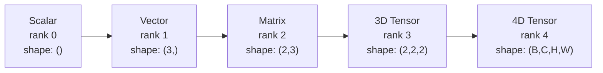
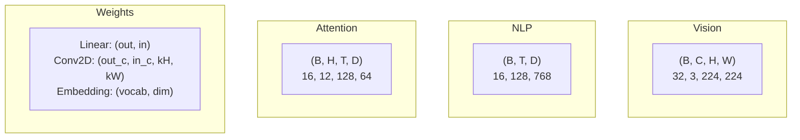
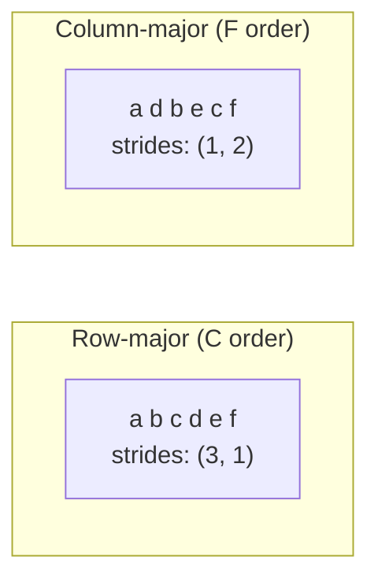
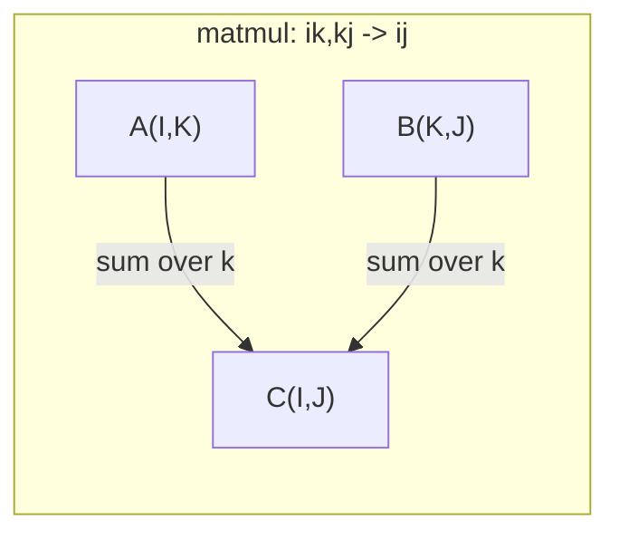

# 张量运算

> 张量是数据和深度学习之间的通用语言。每张图、每个句子、每个梯度都从中流过。

**类型：** Build
**语言：** Python
**前置要求：** 阶段 1，第 01 课（线性代数直觉）、02 课（向量、矩阵与运算）
**预计时间：** ~90 分钟

## 学习目标

- 从零实现一个张量类，带形状、步长、reshape、转置和逐元素运算
- 应用广播规则，在不复制数据的情况下对不同形状的张量做运算
- 为点积、矩阵乘法、外积和批量运算写 einsum 表达式
- 追踪多头注意力每一步的精确张量形状

## 问题所在

你构建一个 transformer。前向传播看起来很干净。你一运行就得到：`RuntimeError: mat1 and mat2 shapes cannot be multiplied (32x768 and 512x768)`。你盯着那些形状看。你试着转置一下。现在它说 `Expected 4D input (got 3D input)`。你加了一个 unsqueeze。别处又崩了。

形状错误是深度学习代码里最常见的 bug。它们在概念上不难——每个运算都有一份形状契约——但它们扩散得很快。一个 transformer 把几十个 reshape、转置和广播链在一起。错一个轴，错误就连锁放大。更糟的是，有些形状错误根本不抛异常。它们沿错误的维度广播、或沿错误的轴求和，悄无声息地产出垃圾。

矩阵处理两组事物之间的成对关系。真实数据塞不进两个维度。一批 32 张 224x224 的 RGB 图是一个四维张量：`(32, 3, 224, 224)`。12 头的自注意力也是四维：`(batch, heads, seq_len, head_dim)`。你需要一个能推广到任意维数的数据结构，且其上的运算能跨所有维度干净地组合。那个结构就是张量。掌握它的运算，形状错误就变得轻而易举可调。

## 核心概念

### 张量是什么

张量是一个数据类型统一的多维数字数组。维数叫**秩**（或**阶**）。每个维度是一根**轴**。**形状**是列出每根轴长度的元组。



总元素数 = 所有尺寸的乘积。形状 `(2, 3, 4)` 装 `2 * 3 * 4 = 24` 个元素。

### 深度学习里的张量形状

不同的数据类型按惯例对应特定的张量形状。



PyTorch 用 NCHW（通道在前）。TensorFlow 默认 NHWC（通道在后）。布局不匹配会导致悄无声息的变慢或报错。

### 内存布局是怎么回事

内存里的二维数组是一段一维字节序列。**步长**告诉你沿每根轴前进一步要跳过多少个元素。



转置不移动数据。它交换步长，让张量变得**非连续**——一行的元素在内存里不再相邻。

### 广播规则

广播让你在不复制数据的情况下对不同形状的张量做运算。从右往左对齐形状。两个维度相等或其中一个为 1 时兼容。维数少的在左侧补 1。

```
Tensor A:     (8, 1, 6, 1)
Tensor B:        (7, 1, 5)
Padded B:     (1, 7, 1, 5)
Result:       (8, 7, 6, 5)
```

### Einsum：通用的张量运算

爱因斯坦求和给每根轴标一个字母。出现在输入但不在输出里的轴被求和。两边都有的轴被保留。



关键模式：`i,i->`（点积）、`i,j->ij`（外积）、`ii->`（迹）、`ij->ji`（转置）、`bij,bjk->bik`（批量矩阵乘法）、`bhtd,bhsd->bhts`（注意力分数）。

## 动手构建

代码在 `code/tensors.py` 里。每一步都引用那里的实现。

### 第 1 步：张量存储和步长

张量存一个扁平的数字列表加上形状元数据。步长告诉索引逻辑怎么把多维索引映射到扁平位置。

```python
class Tensor:
    def __init__(self, data, shape=None):
        if isinstance(data, (list, tuple)):
            self._data, self._shape = self._flatten_nested(data)
        elif isinstance(data, np.ndarray):
            self._data = data.flatten().tolist()
            self._shape = tuple(data.shape)
        else:
            self._data = [data]
            self._shape = ()

        if shape is not None:
            total = reduce(lambda a, b: a * b, shape, 1)
            if total != len(self._data):
                raise ValueError(
                    f"Cannot reshape {len(self._data)} elements into shape {shape}"
                )
            self._shape = tuple(shape)

        self._strides = self._compute_strides(self._shape)

    @staticmethod
    def _compute_strides(shape):
        if len(shape) == 0:
            return ()
        strides = [1] * len(shape)
        for i in range(len(shape) - 2, -1, -1):
            strides[i] = strides[i + 1] * shape[i + 1]
        return tuple(strides)
```

对形状 `(3, 4)`，步长是 `(4, 1)`——跳过 4 个元素前进一行，跳过 1 个元素前进一列。

### 第 2 步：reshape、squeeze、unsqueeze

reshape 改变形状而不改变元素顺序。总元素数必须保持不变。某一维用 `-1` 让它自动推断尺寸。

```python
t = Tensor(list(range(12)), shape=(2, 6))
r = t.reshape((3, 4))
r = t.reshape((-1, 3))
```

squeeze 移除尺寸为 1 的轴。unsqueeze 插入一个。unsqueeze 对广播至关重要——一个偏置向量 `(D,)` 加到一批 `(B, T, D)` 上时，需要 unsqueeze 到 `(1, 1, D)`。

```python
t = Tensor(list(range(6)), shape=(1, 3, 1, 2))
s = t.squeeze()
v = Tensor([1, 2, 3])
u = v.unsqueeze(0)
```

### 第 3 步：转置和 permute

转置交换两根轴。permute 重排所有轴。这就是你在 NCHW 和 NHWC 之间转换的方式。

```python
mat = Tensor(list(range(6)), shape=(2, 3))
tr = mat.transpose(0, 1)

t4d = Tensor(list(range(24)), shape=(1, 2, 3, 4))
perm = t4d.permute((0, 2, 3, 1))
```

转置或 permute 之后，张量在内存里是非连续的。在 PyTorch 里，`view` 在非连续张量上会失败——用 `reshape`，或先调 `.contiguous()`。

### 第 4 步：逐元素运算和归约

逐元素运算（加、乘、减）对每个元素独立施加并保持形状。归约（sum、mean、max）压扁一根或多根轴。

```python
a = Tensor([[1, 2], [3, 4]])
b = Tensor([[10, 20], [30, 40]])
c = a + b
d = a * 2
s = a.sum(axis=0)
```

CNN 里的全局平均池化：`(B, C, H, W).mean(axis=[2, 3])` 产出 `(B, C)`。NLP 里的序列均值池化：`(B, T, D).mean(axis=1)` 产出 `(B, D)`。

### 第 5 步：用 NumPy 做广播

`tensors.py` 里的 `demo_broadcasting_numpy()` 函数展示了核心模式。

```python
activations = np.random.randn(4, 3)
bias = np.array([0.1, 0.2, 0.3])
result = activations + bias

images = np.random.randn(2, 3, 4, 4)
scale = np.array([0.5, 1.0, 1.5]).reshape(1, 3, 1, 1)
result = images * scale

a = np.array([1, 2, 3]).reshape(-1, 1)
b = np.array([10, 20, 30, 40]).reshape(1, -1)
outer = a * b
```

用广播算成对距离：把 `(M, 2)` reshape 成 `(M, 1, 2)`、把 `(N, 2)` reshape 成 `(1, N, 2)`，相减，平方，沿最后一根轴求和，开平方根。结果：`(M, N)`。

### 第 6 步：Einsum 运算

`demo_einsum()` 和 `demo_einsum_gallery()` 函数走一遍每个常见模式。

```python
a = np.array([1.0, 2.0, 3.0])
b = np.array([4.0, 5.0, 6.0])
dot = np.einsum("i,i->", a, b)

A = np.array([[1, 2], [3, 4], [5, 6]], dtype=float)
B = np.array([[7, 8, 9], [10, 11, 12]], dtype=float)
matmul = np.einsum("ik,kj->ij", A, B)

batch_A = np.random.randn(4, 3, 5)
batch_B = np.random.randn(4, 5, 2)
batch_mm = np.einsum("bij,bjk->bik", batch_A, batch_B)
```

一次收缩的计算代价是所有索引尺寸（保留的和被求和的）的乘积。对 `bij,bjk->bik`，取 B=32、I=128、J=64、K=128：`32 * 128 * 64 * 128 = 33,554,432` 次乘加。

### 第 7 步：用 einsum 实现注意力机制

`demo_attention_einsum()` 函数端到端地实现多头注意力。

```python
B, H, T, D = 2, 4, 8, 16
E = H * D

X = np.random.randn(B, T, E)
W_q = np.random.randn(E, E) * 0.02

Q = np.einsum("bte,ek->btk", X, W_q)
Q = Q.reshape(B, T, H, D).transpose(0, 2, 1, 3)

scores = np.einsum("bhtd,bhsd->bhts", Q, K) / np.sqrt(D)
weights = softmax(scores, axis=-1)
attn_output = np.einsum("bhts,bhsd->bhtd", weights, V)

concat = attn_output.transpose(0, 2, 1, 3).reshape(B, T, E)
output = np.einsum("bte,ek->btk", concat, W_o)
```

每一步都是张量运算：投影（用 einsum 做矩阵乘法）、拆头（reshape + 转置）、注意力分数（用 einsum 做批量矩阵乘法）、加权和（用 einsum 做批量矩阵乘法）、合头（转置 + reshape）、输出投影（用 einsum 做矩阵乘法）。

## 上手使用

### 从零写的版本 vs NumPy

| 运算 | 从零写（Tensor 类） | NumPy |
|---|---|---|
| 创建 | `Tensor([[1,2],[3,4]])` | `np.array([[1,2],[3,4]])` |
| Reshape | `t.reshape((3,4))` | `a.reshape(3,4)` |
| 转置 | `t.transpose(0,1)` | `a.T` 或 `a.transpose(0,1)` |
| Squeeze | `t.squeeze(0)` | `np.squeeze(a, 0)` |
| 求和 | `t.sum(axis=0)` | `a.sum(axis=0)` |
| Einsum | 无 | `np.einsum("ij,jk->ik", a, b)` |

### 从零写的版本 vs PyTorch

```python
import torch

t = torch.tensor([[1, 2, 3], [4, 5, 6]], dtype=torch.float32)
t.shape
t.stride()
t.is_contiguous()

t.reshape(3, 2)
t.unsqueeze(0)
t.transpose(0, 1)
t.transpose(0, 1).contiguous()

torch.einsum("ik,kj->ij", A, B)
```

PyTorch 加上了 autograd、GPU 支持和优化的 BLAS 内核。形状语义完全一致。如果你理解了从零写的版本，PyTorch 的形状错误就读得懂了。

### 把每个神经网络层看成张量运算

| 运算 | 张量形式 | Einsum |
|---|---|---|
| 线性层 | `Y = X @ W.T + b` | `"bd,od->bo"` + 偏置 |
| 注意力 QKV | `Q = X @ W_q` | `"btd,dh->bth"` |
| 注意力分数 | `Q @ K.T / sqrt(d)` | `"bhtd,bhsd->bhts"` |
| 注意力输出 | `softmax(scores) @ V` | `"bhts,bhsd->bhtd"` |
| 批归一化 | `(X - mu) / sigma * gamma` | 逐元素 + 广播 |
| Softmax | `exp(x) / sum(exp(x))` | 逐元素 + 归约 |

## 交付

本节课产出两个可复用的提示词：

1. **`outputs/prompt-tensor-shapes.md`** —— 一个用于调试张量形状不匹配的系统化提示词。包含每个常见运算（matmul、广播、cat、Linear、Conv2d、BatchNorm、softmax）的决策表和一张修复查找表。

2. **`outputs/prompt-tensor-debugger.md`** —— 一个逐步调试的提示词，当形状错误卡住你时，你把它粘进任何 AI 助手。把错误信息和你的张量形状喂给它，拿回精确的修复方案。

## 练习

1. **简单 —— Reshape 往返。** 取一个形状为 `(2, 3, 4)` 的张量。把它 reshape 成 `(6, 4)`，再到 `(24,)`，再回到 `(2, 3, 4)`。通过打印扁平数据验证每一步元素顺序都被保留。

2. **中等 —— 实现广播。** 给 `Tensor` 类扩展一个 `broadcast_to(shape)` 方法，把尺寸为 1 的维度扩展到匹配目标形状。然后修改 `_elementwise_op`，让它在运算前自动广播。用形状 `(3, 1)` 和 `(1, 4)` 产出 `(3, 4)` 来测试。

3. **困难 —— 从零写 einsum。** 实现一个基础的 `einsum(subscripts, *tensors)` 函数，至少处理：点积（`i,i->`）、矩阵乘法（`ij,jk->ik`）、外积（`i,j->ij`）和转置（`ij->ji`）。解析下标字符串，识别被收缩的索引，遍历所有索引组合。把你的结果和 `np.einsum` 对比。

4. **困难 —— 注意力形状追踪器。** 写一个函数，接收 `batch_size`、`seq_len`、`embed_dim` 和 `num_heads` 作为输入，打印多头注意力每一步的精确形状：输入、Q/K/V 投影、拆头、注意力分数、softmax 权重、加权和、合头、输出投影。对照 `demo_attention_einsum()` 的输出验证。

## 关键术语

| 术语 | 人们常说 | 它实际指什么 |
|---|---|---|
| 张量 | "维度更多的矩阵" | 一个类型统一、形状步长和运算都有定义的多维数组 |
| 秩 | "维度的数量" | 轴的数量。矩阵秩为 2，不等于它作为矩阵的秩 |
| 形状 | "张量的尺寸" | 列出每根轴长度的元组。`(2, 3)` 表示 2 行 3 列 |
| 步长 | "内存怎么布局" | 沿每根轴前进一个位置要跳过的元素数 |
| 广播 | "形状不同时它自己就成了" | 一套严格规则：从右对齐，维度必须相等或其中一个为 1 |
| 连续 | "张量是正常的" | 元素在内存里按逻辑布局顺序存储，无空隙无重排 |
| Einsum | "写 matmul 的花哨方式" | 一种通用记法，一行表达任意张量收缩、外积、迹或转置 |
| View | "和 reshape 一样" | 共享同一内存缓冲区、但形状/步长元数据不同的张量。在非连续数据上会失败 |
| 收缩 | "对一个索引求和" | 张量之间共享的索引被相乘并求和、产出更低秩结果的通用运算 |
| NCHW / NHWC | "PyTorch vs TensorFlow 格式" | 图像张量的内存布局惯例。NCHW 把通道放在空间维之前，NHWC 放在之后 |

## 延伸阅读

- [NumPy Broadcasting](https://numpy.org/doc/stable/user/basics.broadcasting.html) —— 带可视化示例的标准规则
- [PyTorch Tensor Views](https://pytorch.org/docs/stable/tensor_view.html) —— view 何时有效、何时会复制
- [einops](https://github.com/arogozhnikov/einops) —— 让张量重排可读又安全的库
- [The Illustrated Transformer](https://jalammar.github.io/illustrated-transformer/) —— 可视化流经注意力的张量形状
- [Einstein Summation in NumPy](https://numpy.org/doc/stable/reference/generated/numpy.einsum.html) —— 完整的 einsum 文档带示例
