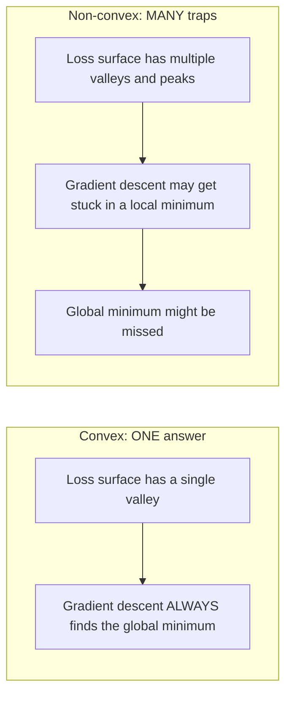
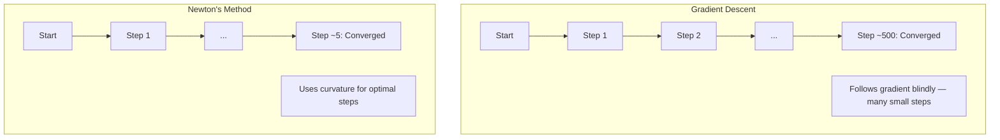
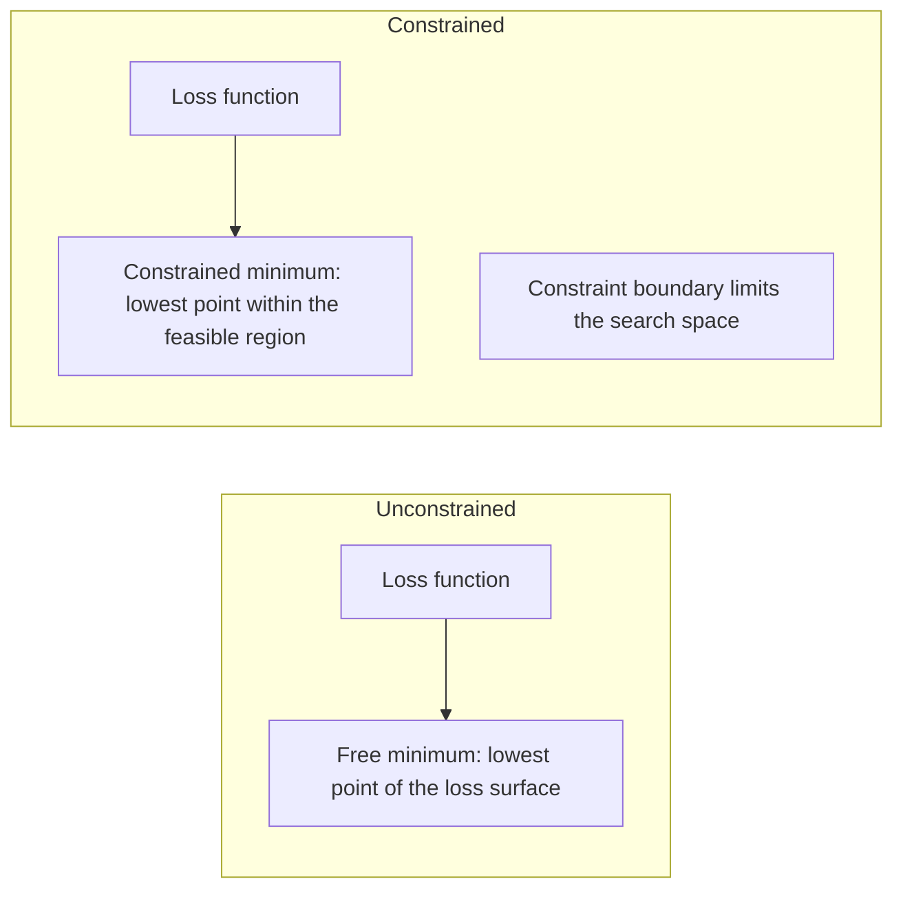
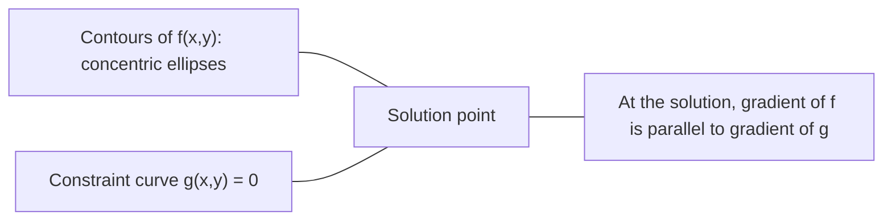

# 凸优化

> 凸问题只有一个山谷。神经网络有上百万个。知道这个区别很重要。

**类型：** Build
**语言：** Python
**前置要求：** 阶段 1，第 04 课（机器学习中的微积分）、08 课（优化）
**预计时间：** ~90 分钟

## 学习目标

- 用定义、二阶导数和 Hessian 准则检验一个函数是否凸
- 实现牛顿法，把它的二次收敛和梯度下降对比
- 用拉格朗日乘子解约束优化问题，并解读 KKT 条件
- 解释为什么神经网络损失曲面非凸，SGD 却仍能找到好的解

## 问题所在

第 08 课教了你梯度下降、动量和 Adam。那些优化器在任何曲面上往下坡走。但它们不带任何保证。非凸曲面上的梯度下降可能落进一个糟糕的局部最小值、卡在鞍点上，或者永远来回振荡。你还是用了它，因为神经网络是非凸的、没有别的选择。

但 ML 里许多问题是凸的。线性回归、逻辑回归、SVM、LASSO、岭回归。对这些，存在更强的东西：带数学保证的优化。一个凸问题恰好只有一个山谷。任何往下坡走的算法都会到达全局最小值。不需要重启。不需要学习率调度。不需要祈祷。

理解凸性做三件事。第一，它告诉你问题什么时候简单（凸）、什么时候难（非凸）。第二，它给你针对凸问题更快的工具，比如牛顿法。第三，它解释了贯穿 ML 的概念：作为约束的正则化、SVM 里的对偶，以及为什么深度学习违反了凸性给你的每一个好性质却仍然有效。

## 核心概念

### 凸集

一个集合 S 是凸的，如果对 S 中任意两点，它们之间的线段也完全落在 S 里。

| 凸集 | 非凸 |
|---|---|
| **矩形**：内部任意两点都能用一条始终在内部的线段连起来 | **星形/月牙形**：两个内部点之间的连线可能穿到集合外面 |
| **三角形**：所有内部点都有同样的性质 | **甜甜圈/环形**：那个洞意味着某些线段会离开集合 |
| 任意两点之间的线段都留在集合内 | 某些点对之间的线段会离开集合 |

形式化检验：对 S 中任意点 x、y 和任意 t 属于 [0, 1]，点 tx + (1-t)y 也在 S 里。

凸集的例子：
- 一条线、一个平面、整个 R^n
- 一个球（圆、球面、超球面）
- 一个半空间：{x : a^T x <= b}
- 任意多个凸集的交集

非凸集的例子：
- 一个甜甜圈（环形）
- 两个不相交圆的并
- 任何有"凹陷"或"洞"的集合

### 凸函数

一个函数 f 是凸的，如果它的定义域是凸集，且对它定义域里任意两点 x、y 和任意 t 属于 [0, 1]：

```
f(tx + (1-t)y) <= t*f(x) + (1-t)*f(y)
```

几何上：图像上任意两点之间的线段位于图像之上或之上。

| 性质 | 凸函数 | 非凸函数 |
|---|---|---|
| **线段检验** | 图像上任意两点之间的连线位于曲线**之上或之上** | 图像上某些点之间的连线会**沉到**曲线之下 |
| **形状** | 单个向上弯曲的碗/谷 | 多个曲率混合的峰和谷 |
| **局部最小值** | 每个局部最小值都是全局最小值 | 可能存在多个高度不同的局部最小值 |

常见凸函数：
- f(x) = x^2（抛物线）
- f(x) = |x|（绝对值）
- f(x) = e^x（指数）
- f(x) = max(0, x)（ReLU，尽管是分段线性）
- f(x) = -log(x)（x > 0 时，负对数）
- 任何线性函数 f(x) = a^T x + b（既凸又凹）

### 检验凸性

三个实用检验，从最简单到最严格。

**检验 1：二阶导数检验（一维）。** 如果对所有 x 有 f''(x) >= 0，那么 f 是凸的。

- f(x) = x^2：f''(x) = 2 >= 0。凸。
- f(x) = x^3：f''(x) = 6x。x < 0 时为负。非凸。
- f(x) = e^x：f''(x) = e^x > 0。凸。

**检验 2：Hessian 检验（多元）。** 如果对所有 x，Hessian 矩阵 H(x) 半正定，那么 f 是凸的。Hessian 是二阶偏导数构成的矩阵。

**检验 3：定义检验。** 直接检查不等式 f(tx + (1-t)y) <= t*f(x) + (1-t)*f(y)。对导数难算的函数有用。

### 凸性为什么重要

凸优化的核心定理：

**对凸函数，每个局部最小值都是全局最小值。**

这意味着梯度下降不会被困住。任何往下坡的路都通向同一个答案。算法保证收敛到最优解。



后果：
- 不需要随机重启
- 不需要复杂的学习率调度
- 收敛证明成为可能（速率取决于函数性质）
- 解是唯一的（差一个平坦区域）

### ML 里的凸 vs 非凸

| 问题 | 凸吗？ | 为什么 |
|---------|---------|-----|
| 线性回归（MSE） | 是 | 损失关于权重是二次的 |
| 逻辑回归 | 是 | 对数损失关于权重是凸的 |
| SVM（hinge 损失） | 是 | 线性函数的最大值 |
| LASSO（L1 回归） | 是 | 凸函数之和是凸的 |
| 岭回归（L2） | 是 | 二次 + 二次 = 凸 |
| 神经网络（任意损失） | 否 | 非线性激活造出非凸曲面 |
| k-means 聚类 | 否 | 离散的分配步骤 |
| 矩阵分解 | 否 | 未知量的乘积 |

带凸损失的线性模型是凸的。一旦你加上带非线性激活的隐藏层，凸性就崩了。

### Hessian 矩阵

函数 f: R^n -> R 的 Hessian H 是二阶偏导数构成的 n x n 矩阵。

```
H[i][j] = d^2 f / (dx_i dx_j)
```

对 f(x, y) = x^2 + 3xy + y^2：

```
df/dx = 2x + 3y       d^2f/dx^2 = 2      d^2f/dxdy = 3
df/dy = 3x + 2y       d^2f/dydx = 3      d^2f/dy^2 = 2

H = [ 2  3 ]
    [ 3  2 ]
```

Hessian 告诉你曲率：
- 特征值全为正：函数在每个方向上向上弯曲（在该点凸）
- 特征值全为负：在每个方向上向下弯曲（凹，一个局部最大值）
- 符号混合：鞍点（在某些方向向上弯、另一些向下弯）
- 零特征值：在那个方向平坦（退化）

为了凸，Hessian 必须处处半正定（所有特征值 >= 0），不只是在某一点。

### 牛顿法

梯度下降用一阶信息（梯度）。牛顿法用二阶信息（Hessian）。它在当前点拟合一个二次近似，并直接跳到那个二次函数的最小值。

```
Update rule:
  x_new = x - H^(-1) * gradient

Compare to gradient descent:
  x_new = x - lr * gradient
```

牛顿法用 Hessian 的逆代替标量学习率。这会基于局部曲率自动调整步长和方向。



优点：
- 在最小值附近二次收敛（误差每步平方）
- 没有学习率要调
- 尺度不变（不管你怎么参数化问题都有效）

缺点：
- 计算 Hessian 花 O(n^2) 内存、求逆花 O(n^3)
- 对一个百万权重的神经网络，那是 10^12 个元素和 10^18 次操作
- 对深度学习不实用

### 约束优化

无约束优化：在所有 x 上最小化 f(x)。
约束优化：在约束下最小化 f(x)。

真实问题有约束。你想最小化成本但预算有限。你想最小化误差但模型复杂度有界。



### 拉格朗日乘子

拉格朗日乘子法把一个约束问题转换成无约束的。

问题：在 g(x) = 0 的约束下最小化 f(x)。

解法：引入一个新变量（拉格朗日乘子 lambda），求解无约束问题：

```
L(x, lambda) = f(x) + lambda * g(x)
```

在解处，L 的梯度为零：

```
dL/dx = df/dx + lambda * dg/dx = 0
dL/dlambda = g(x) = 0
```

几何直觉：在约束最小值处，f 的梯度必须与约束 g 的梯度平行。如果它们不平行，你就能沿约束曲面移动并进一步减小 f。



例子：在 x + y = 1 的约束下最小化 f(x,y) = x^2 + y^2。

```
L = x^2 + y^2 + lambda(x + y - 1)

dL/dx = 2x + lambda = 0  =>  x = -lambda/2
dL/dy = 2y + lambda = 0  =>  y = -lambda/2
dL/dlambda = x + y - 1 = 0

From first two: x = y
Substituting: 2x = 1, so x = y = 0.5, lambda = -1
```

直线 x + y = 1 上离原点最近的点是 (0.5, 0.5)。

### KKT 条件

Karush-Kuhn-Tucker 条件把拉格朗日乘子推广到不等式约束。

问题：在 g_i(x) <= 0（i = 1, ..., m）的约束下最小化 f(x)。

KKT 条件（最优性的必要条件）：

```
1. Stationarity:    df/dx + sum(lambda_i * dg_i/dx) = 0
2. Primal feasibility:  g_i(x) <= 0  for all i
3. Dual feasibility:    lambda_i >= 0  for all i
4. Complementary slackness:  lambda_i * g_i(x) = 0  for all i
```

互补松弛是关键洞见：要么约束是活跃的（g_i = 0，解落在边界上），要么乘子为零（约束无关紧要）。一个不影响解的约束有 lambda = 0。

KKT 条件是 SVM 的核心。支持向量就是约束活跃（lambda > 0）的数据点。所有其他数据点 lambda = 0，不影响决策边界。

### 正则化作为约束优化

L1 和 L2 正则化不是随意的技巧。它们是伪装的约束优化问题。

**L2 正则化（Ridge）：**

```
minimize  Loss(w)  subject to  ||w||^2 <= t

Equivalent unconstrained form:
minimize  Loss(w) + lambda * ||w||^2
```

约束 ||w||^2 <= t 定义一个球（二维里的圆、三维里的球面）。解是损失等高线首次触到这个球之处。

**L1 正则化（LASSO）：**

```
minimize  Loss(w)  subject to  ||w||_1 <= t

Equivalent unconstrained form:
minimize  Loss(w) + lambda * ||w||_1
```

约束 ||w||_1 <= t 定义一个菱形（二维里旋转的正方形）。

| 性质 | L2 约束（圆） | L1 约束（菱形） |
|---|---|---|
| **约束形状** | 圆（高维里的球面） | 菱形（二维里旋转的正方形） |
| **损失等高线触碰之处** | 光滑边界——圆上任意一点 | 角落——与某根轴对齐 |
| **解的行为** | 权重小但非零 | 某些权重恰好为零（稀疏） |
| **结果** | 权重收缩 | 特征选择 |

这解释了为什么 L1 产生稀疏模型（特征选择）而 L2 只收缩权重。菱形有与轴对齐的角落。损失等高线更可能触到一个角落，把一个或多个权重恰好设为零。

### 对偶

每个约束优化问题（原始问题）都有一个伴随问题（对偶问题）。对凸问题，原始和对偶有相同的最优值。这是强对偶。

拉格朗日对偶函数：

```
Primal: minimize f(x) subject to g(x) <= 0
Lagrangian: L(x, lambda) = f(x) + lambda * g(x)
Dual function: d(lambda) = min_x L(x, lambda)
Dual problem: maximize d(lambda) subject to lambda >= 0
```

对偶为什么重要：
- 对偶问题有时比原始问题更易解
- SVM 在它的对偶形式里求解，那里问题依赖于数据点之间的点积（让核技巧成为可能）
- 对偶为原始最优提供一个下界，用于检查解的质量

具体到 SVM：

```
Primal: find w, b that maximize the margin 2/||w|| subject to
        y_i(w^T x_i + b) >= 1 for all i

Dual:   maximize sum(alpha_i) - 0.5 * sum_ij(alpha_i * alpha_j * y_i * y_j * x_i^T x_j)
        subject to alpha_i >= 0 and sum(alpha_i * y_i) = 0

The dual only involves dot products x_i^T x_j.
Replace x_i^T x_j with K(x_i, x_j) to get the kernel trick.
```

### 为什么深度学习非凸却仍然有效

神经网络损失函数极度非凸。按每个经典度量，优化它们都应该失败。然而随机梯度下降可靠地找到好的解。几个因素解释了这一点。

**大多数局部最小值已经够好。** 在高维空间里，随机临界点（梯度为零之处）压倒性地是鞍点，不是局部最小值。存在的少数局部最小值往往损失值接近全局最小值。当参数空间有上百万维时，被困进一个糟糕的局部最小值极不可能。

**鞍点而非局部最小值才是真正的障碍。** 在一个有 n 个参数的函数里，鞍点有正负曲率方向的混合。对高维里一个随机临界点，所有 n 个特征值都为正（局部最小值）的概率大致是 2^(-n)。几乎所有临界点都是鞍点。SGD 的噪声有助于逃出它们。

**过参数化让曲面变平滑。** 参数比训练样本多的网络有更平滑、更连通的损失曲面。更宽的网络有更少的坏局部最小值。这反直觉，但经验上一致。

**损失曲面结构：**

| 性质 | 低维空间 | 高维空间 |
|---|---|---|
| **曲面** | 许多孤立的峰和谷 | 平滑连通的山谷 |
| **最小值** | 许多孤立的局部最小值 | 很少坏的局部最小值；大多近乎最优 |
| **导航** | 难找全局最小值 | 许多路径通向好的解 |
| **临界点** | 局部最小值和鞍点的混合 | 压倒性地是鞍点，不是局部最小值 |

**随机噪声起隐式正则化作用。** 小批量 SGD 加入的噪声防止落进尖锐的最小值。尖锐的最小值过拟合；平坦的最小值泛化。噪声把优化偏向损失曲面的平坦区域。

### 实践中的二阶方法

纯牛顿法对大模型不实用。几种近似让二阶信息变得可用。

**L-BFGS（有限内存 BFGS）：** 用最近 m 次梯度差近似 Hessian 的逆。需要 O(mn) 内存而非 O(n^2)。对约 10,000 个参数以内的问题工作良好。用于经典 ML（逻辑回归、CRF），不用于深度学习。

**自然梯度：** 用 Fisher 信息矩阵（对数似然的期望 Hessian）代替标准 Hessian。这考虑了概率分布的几何。K-FAC（Kronecker 因子近似曲率）把 Fisher 矩阵近似为 Kronecker 积，使它对神经网络实用。

**无 Hessian 优化：** 用共轭梯度解 Hx = g 而从不构造 H。只需要 Hessian-向量积，它可以通过自动微分在 O(n) 时间里算出。

**对角近似：** Adam 的二阶矩是 Hessian 对角线的对角近似。AdaHessian 通过 Hutchinson 估计器用实际的 Hessian 对角元来扩展它。

| 方法 | 内存 | 每步代价 | 何时用 |
|--------|--------|--------------|-------------|
| 梯度下降 | O(n) | O(n) | 基线，大模型 |
| 牛顿法 | O(n^2) | O(n^3) | 小凸问题 |
| L-BFGS | O(mn) | O(mn) | 中等凸问题 |
| Adam | O(n) | O(n) | 深度学习默认 |
| K-FAC | O(n) | 每层 O(n) | 研究、大批量训练 |

## 动手构建

### 第 1 步：凸性检查器

构建一个函数，通过采样点并检查定义来经验性地检验凸性。

```python
import random
import math

def check_convexity(f, dim, bounds=(-5, 5), samples=1000):
    violations = 0
    for _ in range(samples):
        x = [random.uniform(*bounds) for _ in range(dim)]
        y = [random.uniform(*bounds) for _ in range(dim)]
        t = random.uniform(0, 1)
        mid = [t * xi + (1 - t) * yi for xi, yi in zip(x, y)]
        lhs = f(mid)
        rhs = t * f(x) + (1 - t) * f(y)
        if lhs > rhs + 1e-10:
            violations += 1
    return violations == 0, violations
```

### 第 2 步：二维的牛顿法

用显式 Hessian 实现牛顿法。把收敛速度和梯度下降对比。

```python
def newtons_method(f, grad_f, hessian_f, x0, steps=50, tol=1e-12):
    x = list(x0)
    history = [x[:]]
    for _ in range(steps):
        g = grad_f(x)
        H = hessian_f(x)
        det = H[0][0] * H[1][1] - H[0][1] * H[1][0]
        if abs(det) < 1e-15:
            break
        H_inv = [
            [H[1][1] / det, -H[0][1] / det],
            [-H[1][0] / det, H[0][0] / det],
        ]
        dx = [
            H_inv[0][0] * g[0] + H_inv[0][1] * g[1],
            H_inv[1][0] * g[0] + H_inv[1][1] * g[1],
        ]
        x = [x[0] - dx[0], x[1] - dx[1]]
        history.append(x[:])
        if sum(gi ** 2 for gi in g) < tol:
            break
    return history
```

### 第 3 步：拉格朗日乘子求解器

通过在拉格朗日函数上做梯度下降来解约束优化。

```python
def lagrange_solve(f_grad, g_val, g_grad, x0, lr=0.01,
                   lr_lambda=0.01, steps=5000):
    x = list(x0)
    lam = 0.0
    history = []
    for _ in range(steps):
        fg = f_grad(x)
        gv = g_val(x)
        gg = g_grad(x)
        x = [
            xi - lr * (fgi + lam * ggi)
            for xi, fgi, ggi in zip(x, fg, gg)
        ]
        lam = lam + lr_lambda * gv
        history.append((x[:], lam, gv))
    return history
```

### 第 4 步：比较一阶 vs 二阶

在同一个二次函数上跑梯度下降和牛顿法。数收敛要多少步。

```python
def quadratic(x):
    return 5 * x[0] ** 2 + x[1] ** 2

def quadratic_grad(x):
    return [10 * x[0], 2 * x[1]]

def quadratic_hessian(x):
    return [[10, 0], [0, 2]]
```

牛顿法将在 1 步内收敛（它对二次函数是精确的）。梯度下降将花上几百步，因为 Hessian 的特征值相差 5 倍，造出一条拉长的山谷。

## 上手使用

凸性分析在选择 ML 模型和求解器时直接派上用场。

对凸问题（逻辑回归、SVM、LASSO）：
- 用专门的求解器（liblinear、CVXPY、用 method='L-BFGS-B' 的 scipy.optimize.minimize）
- 预期一个唯一的全局解
- 二阶方法实用且快

对非凸问题（神经网络）：
- 用一阶方法（SGD、Adam）
- 接受解依赖初始化和随机性
- 用过参数化、噪声和学习率调度作为隐式正则化
- 别浪费时间搜索全局最小值。一个好的局部最小值就够了。

```python
from scipy.optimize import minimize

result = minimize(
    fun=lambda w: sum((y - X @ w) ** 2) + 0.1 * sum(w ** 2),
    x0=np.zeros(d),
    method='L-BFGS-B',
    jac=lambda w: -2 * X.T @ (y - X @ w) + 0.2 * w,
)
```

对 SVM，对偶形式让你能用核技巧：

```python
from sklearn.svm import SVC

svm = SVC(kernel='rbf', C=1.0)
svm.fit(X_train, y_train)
print(f"Support vectors: {svm.n_support_}")
```

## 练习

1. **凸性画廊。** 用检查器检验这些函数的凸性：f(x) = x^4、f(x) = sin(x)、f(x,y) = x^2 + y^2、f(x,y) = x*y、f(x) = max(x, 0)。解释为什么每个结果都说得通。

2. **牛顿 vs 梯度下降竞速。** 从起点 (10, 10) 在 f(x,y) = 50*x^2 + y^2 上跑两个方法。每个要多少步才到损失 < 1e-10？当条件数（Hessian 最大与最小特征值之比）增大时，梯度下降会怎样？

3. **拉格朗日乘子几何。** 在 x + 2y = 4 的约束下最小化 f(x,y) = (x-3)^2 + (y-3)^2。通过检查解处 f 的梯度是否与 g 的梯度平行来验证解。

4. **正则化约束。** 实现 L1 约束的优化：在 |x| + |y| <= 1 的约束下最小化 (x-3)^2 + (y-2)^2。展示解有一个坐标等于零（菱形约束带来的稀疏性）。

5. **Hessian 特征值分析。** 计算 Rosenbrock 函数在 (1,1) 和 (-1,1) 处的 Hessian。计算两点的特征值。特征值告诉你最小值处与远离它处的曲率有什么不同？

## 关键术语

| 术语 | 它的意思 |
|------|---------------|
| 凸集 | 集合中任意两点之间的线段都留在集合内的集合 |
| 凸函数 | 图像上任意两点之间的连线位于图像之上或之上的函数。等价地，Hessian 处处半正定 |
| 局部最小值 | 比所有邻近点都低的点。对凸函数，每个局部最小值都是全局最小值 |
| 全局最小值 | 函数在整个定义域上的最低点 |
| Hessian 矩阵 | 所有二阶偏导数构成的矩阵。编码曲率信息 |
| 半正定 | 特征值全非负的矩阵。"二阶导数 >= 0"的多维类比 |
| 条件数 | Hessian 最大与最小特征值之比。条件数高意味着拉长的山谷和缓慢的梯度下降 |
| 牛顿法 | 用 Hessian 的逆确定步进方向和大小的二阶优化器。在最小值附近二次收敛 |
| 拉格朗日乘子 | 为把约束优化问题转换成无约束的而引入的变量 |
| KKT 条件 | 带不等式约束的最优性必要条件。推广拉格朗日乘子 |
| 互补松弛 | 在解处，要么约束活跃，要么它的乘子为零。绝不两者都非零 |
| 对偶 | 每个约束问题都有一个伴随对偶问题。对凸问题，两者有相同的最优值 |
| 强对偶 | 原始和对偶最优值相等。对满足 Slater 条件的凸问题成立 |
| L-BFGS | 存最近 m 次梯度差而非完整 Hessian 的近似二阶方法 |
| 鞍点 | 梯度为零、但在某些方向是最小值、另一些方向是最大值的点 |
| 过参数化 | 用比训练样本多的参数。让损失曲面变平滑、减少坏的局部最小值 |

## 延伸阅读

- [Boyd & Vandenberghe: Convex Optimization](https://web.stanford.edu/~boyd/cvxbook/) - 标准教材，网上免费提供
- [Bottou, Curtis, Nocedal: Optimization Methods for Large-Scale Machine Learning (2018)](https://arxiv.org/abs/1606.04838) - 衔接凸优化理论和深度学习实践
- [Choromanska et al.: The Loss Surfaces of Multilayer Networks (2015)](https://arxiv.org/abs/1412.0233) - 为什么非凸神经网络曲面没有看上去那么糟
- [Nocedal & Wright: Numerical Optimization](https://link.springer.com/book/10.1007/978-0-387-40065-5) - 牛顿法、L-BFGS 和约束优化的全面参考
