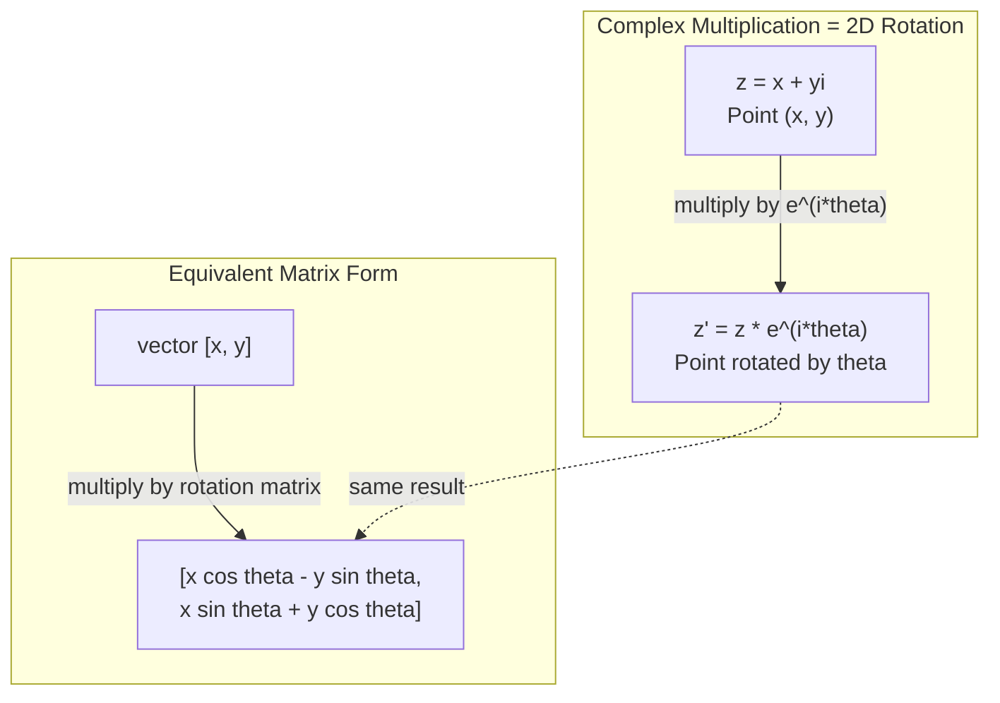
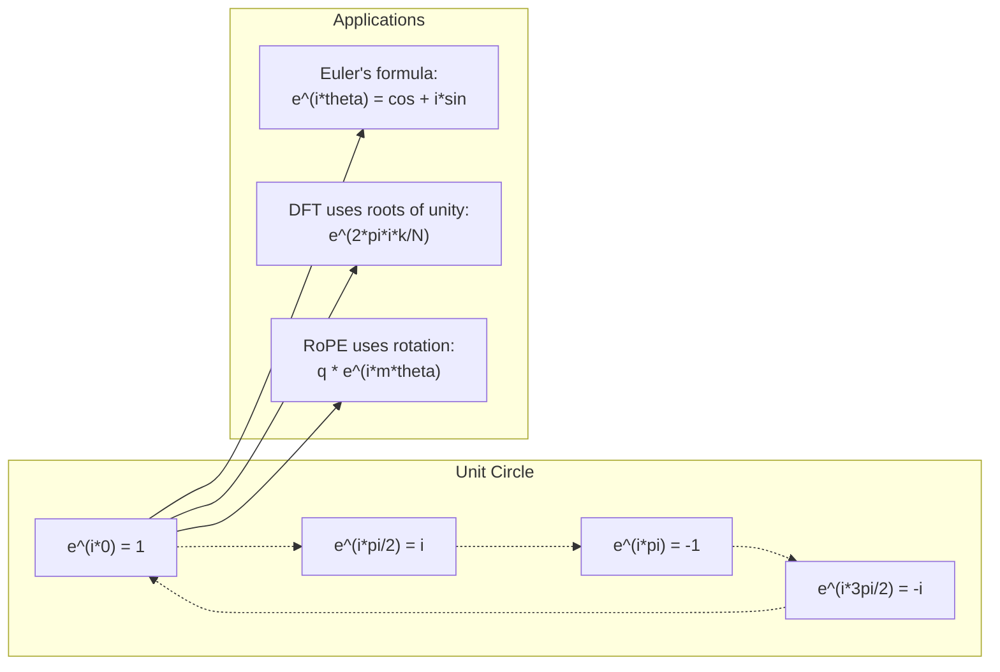

# 写给 AI 的复数

> -1 的平方根并不虚幻。它是旋转、频率以及半个信号处理领域的钥匙。

**类型：** Learn
**语言：** Python
**前置要求：** 阶段 1，第 01-04 课（线性代数、微积分）
**预计时间：** ~60 分钟

## 学习目标

- 用直角坐标和极坐标两种形式做复数算术（加、乘、除、共轭）
- 应用欧拉公式在复指数和三角函数之间转换
- 用单位根实现离散傅里叶变换
- 解释复旋转如何支撑 transformer 里的 RoPE 和正弦位置编码

## 问题所在

你翻开一篇关于傅里叶变换的论文，到处是 `i`。你看 transformer 的位置编码，看到不同频率上的 `sin` 和 `cos`——复指数的实部和虚部。你读量子计算，发现一切都用复向量空间表达。

复数看起来很抽象。一个建立在 -1 平方根上的数系感觉像数学把戏。但它不是把戏。它是旋转和振荡的天然语言。每当有东西旋转、振动或摆动时，复数都是对的工具。

不理解复数，你就理解不了离散傅里叶变换。理解不了 FFT。理解不了 RoPE（旋转位置编码）在现代语言模型里怎么工作。理解不了为什么原始 Transformer 论文里的正弦位置编码用它用的那些频率。

本节课从零构建复数算术，把它和几何联系起来，并准确告诉你复数在机器学习里出现在哪。

## 核心概念

### 什么是复数？

一个复数有两部分：实部和虚部。

```
z = a + bi

where:
  a is the real part
  b is the imaginary part
  i is the imaginary unit, defined by i^2 = -1
```

就这样。你把数轴扩展成一个平面。实数在一根轴上。虚数在另一根轴上。每个复数都是这个平面里的一个点。

### 复数算术

**加法。** 实部相加，虚部相加。

```
(a + bi) + (c + di) = (a + c) + (b + d)i

Example: (3 + 2i) + (1 + 4i) = 4 + 6i
```

**乘法。** 用分配律，并记住 i^2 = -1。

```
(a + bi)(c + di) = ac + adi + bci + bdi^2
                 = ac + adi + bci - bd
                 = (ac - bd) + (ad + bc)i

Example: (3 + 2i)(1 + 4i) = 3 + 12i + 2i + 8i^2
                            = 3 + 14i - 8
                            = -5 + 14i
```

**共轭。** 把虚部的符号翻转。

```
conjugate of (a + bi) = a - bi
```

一个复数与它的共轭之积总是实数：

```
(a + bi)(a - bi) = a^2 + b^2
```

**除法。** 把分子和分母都乘以分母的共轭。

```
(a + bi) / (c + di) = (a + bi)(c - di) / (c^2 + d^2)
```

这消除了分母里的虚部，给你一个干净的复数。

### 复平面

复平面把每个复数映射到一个二维点。水平轴是实轴，竖直轴是虚轴。

```
z = 3 + 2i  corresponds to the point (3, 2)
z = -1 + 0i corresponds to the point (-1, 0) on the real axis
z = 0 + 4i  corresponds to the point (0, 4) on the imaginary axis
```

一个复数同时是一个点和一个从原点出发的向量。正是这种双重解释让复数在几何里有用。

### 极坐标形式

平面里的任何点都能用它离原点的距离和它与正实轴的夹角来描述。

```
z = r * (cos(theta) + i*sin(theta))

where:
  r = |z| = sqrt(a^2 + b^2)     (magnitude, or modulus)
  theta = atan2(b, a)             (phase, or argument)
```

直角坐标形式（a + bi）适合加法。极坐标形式（r, theta）适合乘法。

**极坐标形式里的乘法。** 模相乘，角相加。

```
z1 = r1 * e^(i*theta1)
z2 = r2 * e^(i*theta2)

z1 * z2 = (r1 * r2) * e^(i*(theta1 + theta2))
```

这就是复数对旋转完美契合的原因。乘以一个模为 1 的复数是一次纯旋转。

### 欧拉公式

复指数和三角学之间的桥梁：

```
e^(i*theta) = cos(theta) + i*sin(theta)
```

这是本节课最重要的公式。当 theta = pi 时：

```
e^(i*pi) = cos(pi) + i*sin(pi) = -1 + 0i = -1

Therefore: e^(i*pi) + 1 = 0
```

五个基本常数（e、i、pi、1、0）在一个方程里相连。

### 欧拉公式为什么对 ML 重要

欧拉公式说 `e^(i*theta)` 随 theta 变化描出单位圆。在 theta = 0 时，你在 (1, 0)。在 theta = pi/2 时，你在 (0, 1)。在 theta = pi 时，你在 (-1, 0)。在 theta = 3*pi/2 时，你在 (0, -1)。整整一圈是 theta = 2*pi。

这意味着复指数就是旋转。而旋转在信号处理和 ML 里无处不在。

### 与二维旋转的联系

把复数 (x + yi) 乘以 e^(i*theta)，就让点 (x, y) 绕原点旋转角度 theta。

```
Rotation via complex multiplication:
  (x + yi) * (cos(theta) + i*sin(theta))
  = (x*cos(theta) - y*sin(theta)) + (x*sin(theta) + y*cos(theta))i

Rotation via matrix multiplication:
  [cos(theta)  -sin(theta)] [x]   [x*cos(theta) - y*sin(theta)]
  [sin(theta)   cos(theta)] [y] = [x*sin(theta) + y*cos(theta)]
```

它们产生完全相同的结果。复数乘法就是二维旋转。旋转矩阵不过是用矩阵记法写出来的复数乘法。



### 相量和旋转信号

复指数 e^(i*omega*t) 是一个以角频率 omega 绕单位圆旋转的点。随着 t 增大，这个点描出圆。

这个旋转点的实部是 cos(omega*t)。虚部是 sin(omega*t)。一个正弦信号是一个旋转复数的影子。

```
e^(i*omega*t) = cos(omega*t) + i*sin(omega*t)

Real part:      cos(omega*t)    -- a cosine wave
Imaginary part: sin(omega*t)    -- a sine wave
```

这就是相量表示。与其追踪一条扭来扭去的正弦波，你追踪一个平滑旋转的箭头。相移变成角度偏移。幅度变化变成模的变化。信号相加变成向量相加。

### 单位根

N 个 N 次单位根是单位圆上 N 个等距分布的点：

```
w_k = e^(2*pi*i*k/N)    for k = 0, 1, 2, ..., N-1
```

对 N = 4，这些根是：1、i、-1、-i（四个方位点）。
对 N = 8，你得到四个方位点加上四条对角线。

单位根是离散傅里叶变换的基础。DFT 把一个信号分解成处于这 N 个等距频率上的分量。

### 与 DFT 的联系

信号 x[0], x[1], ..., x[N-1] 的离散傅里叶变换是：

```
X[k] = sum_{n=0}^{N-1} x[n] * e^(-2*pi*i*k*n/N)
```

每个 X[k] 度量信号与第 k 个单位根——一个频率为 k 的复正弦——的相关程度。DFT 把一个信号拆成 N 个旋转相量，告诉你每一个的幅度和相位。

### 为什么 i 并不虚幻

"虚"这个词是历史的意外。笛卡尔用它带着轻蔑。但 i 并不比负数更虚幻——当年人们最初也拒绝负数。负数回答"3 减去多少得 5？"虚数单位回答"什么平方得到 -1？"

更有用地说：i 是一个 90 度旋转算子。把一个实数乘以 i 一次，你就旋转 90 度到虚轴上。再乘一次 i（i^2），你又旋转 90 度——现在你指向负实方向了。这就是 i^2 = -1 的原因。它不神秘。它是两个四分之一圈拼成的半圈。

这就是复数在工程里无处不在的原因。任何旋转的东西——电磁波、量子态、信号振荡、位置编码——都自然地由复数描述。

### 复指数 vs 三角函数

在欧拉公式之前，工程师把信号写成 A*cos(omega*t + phi)——幅度 A、频率 omega、相位 phi。这管用，但让算术很痛苦。把两个相位不同的余弦相加需要三角恒等式。

用复指数，同一个信号是 A*e^(i*(omega*t + phi))。把两个信号相加就是把两个复数相加。相乘（调制）就是模相乘、角相加。相移变成角度相加。频移变成乘以相量。

整个信号处理领域都改用复指数记法，因为数学更干净。"真实信号"始终只是复表示的实部。虚部被带着作为记账，让所有代数自然地成立。

### 与 transformer 的联系

**正弦位置编码**（原始 Transformer 论文）：

```
PE(pos, 2i) = sin(pos / 10000^(2i/d))
PE(pos, 2i+1) = cos(pos / 10000^(2i/d))
```

这些 sin 和 cos 对是不同频率上复指数的实部和虚部。每个频率为编码位置提供不同的"分辨率"。低频变化慢（粗位置）。高频变化快（细位置）。它们一起给每个位置一个独特的频率指纹。

**RoPE（旋转位置编码）** 更进一步。它显式地把 query 和 key 向量乘以复旋转矩阵。两个 token 之间的相对位置变成一个旋转角。注意力用这些旋转后的向量计算，让模型通过复数乘法对相对位置敏感。

| 运算 | 代数形式 | 几何含义 |
|-----------|---------------|-------------------|
| 加法 | (a+c) + (b+d)i | 平面里的向量加法 |
| 乘法 | (ac-bd) + (ad+bc)i | 旋转并缩放 |
| 共轭 | a - bi | 关于实轴反射 |
| 模 | sqrt(a^2 + b^2) | 离原点的距离 |
| 相位 | atan2(b, a) | 与正实轴的夹角 |
| 除法 | 乘以共轭 | 反向旋转并重新缩放 |
| 幂 | r^n * e^(i*n*theta) | 旋转 n 次，按 r^n 缩放 |



## 动手构建

### 第 1 步：Complex 类

构建一个 Complex 数类，支持算术、模、相位，以及直角坐标和极坐标之间的转换。

```python
import math

class Complex:
    def __init__(self, real, imag=0.0):
        self.real = real
        self.imag = imag

    def __add__(self, other):
        return Complex(self.real + other.real, self.imag + other.imag)

    def __mul__(self, other):
        r = self.real * other.real - self.imag * other.imag
        i = self.real * other.imag + self.imag * other.real
        return Complex(r, i)

    def __truediv__(self, other):
        denom = other.real ** 2 + other.imag ** 2
        r = (self.real * other.real + self.imag * other.imag) / denom
        i = (self.imag * other.real - self.real * other.imag) / denom
        return Complex(r, i)

    def magnitude(self):
        return math.sqrt(self.real ** 2 + self.imag ** 2)

    def phase(self):
        return math.atan2(self.imag, self.real)

    def conjugate(self):
        return Complex(self.real, -self.imag)
```

### 第 2 步：极坐标转换和欧拉公式

```python
def to_polar(z):
    return z.magnitude(), z.phase()

def from_polar(r, theta):
    return Complex(r * math.cos(theta), r * math.sin(theta))

def euler(theta):
    return Complex(math.cos(theta), math.sin(theta))
```

验证：`euler(theta).magnitude()` 应该总是 1.0。`euler(0)` 应该给出 (1, 0)。`euler(pi)` 应该给出 (-1, 0)。

### 第 3 步：旋转

把点 (x, y) 旋转角度 theta 就是一次复数乘法：

```python
point = Complex(3, 4)
rotated = point * euler(math.pi / 4)
```

模保持不变。只有角度改变。

### 第 4 步：用复数算术做 DFT

```python
def dft(signal):
    N = len(signal)
    result = []
    for k in range(N):
        total = Complex(0, 0)
        for n in range(N):
            angle = -2 * math.pi * k * n / N
            total = total + Complex(signal[n], 0) * euler(angle)
        result.append(total)
    return result
```

这是 O(N^2) 的 DFT。每个输出 X[k] 是信号样本乘以单位根之和。

### 第 5 步：逆 DFT

逆 DFT 从频谱重构原始信号。相对正向 DFT 唯一的改动：翻转指数里的符号、并除以 N。

```python
def idft(spectrum):
    N = len(spectrum)
    result = []
    for n in range(N):
        total = Complex(0, 0)
        for k in range(N):
            angle = 2 * math.pi * k * n / N
            total = total + spectrum[k] * euler(angle)
        result.append(Complex(total.real / N, total.imag / N))
    return result
```

这给你完美重构。先做 DFT 再做 IDFT，你就得回原始信号，精确到机器精度。没有信息丢失。

### 第 6 步：单位根

```python
def roots_of_unity(N):
    return [euler(2 * math.pi * k / N) for k in range(N)]
```

验证两个性质：
- 每个根的模恰好为 1。
- 全部 N 个根之和为零（它们因对称而相消）。

正是这些性质让 DFT 可逆。单位根为频率域构成一组正交基。

## 上手使用

Python 有内置的复数支持。字面量 `j` 表示虚数单位。

```python
z = 3 + 2j
w = 1 + 4j

print(z + w)
print(z * w)
print(abs(z))

import cmath
print(cmath.phase(z))
print(cmath.exp(1j * cmath.pi))
```

对数组，numpy 原生处理复数：

```python
import numpy as np

z = np.array([1+2j, 3+4j, 5+6j])
print(np.abs(z))
print(np.angle(z))
print(np.conj(z))
print(np.real(z))
print(np.imag(z))

signal = np.sin(2 * np.pi * 5 * np.linspace(0, 1, 128))
spectrum = np.fft.fft(signal)
freqs = np.fft.fftfreq(128, d=1/128)
```

## 交付

运行 `code/complex_numbers.py` 来生成 `outputs/skill-complex-arithmetic.md`。

## 练习

1. **手算复数算术。** 计算 (2 + 3i) * (4 - i)，用代码验证。然后计算 (5 + 2i) / (1 - 3i)。把两个结果画在复平面上，检查乘法是否旋转并缩放了第一个数。

2. **旋转序列。** 从点 (1, 0) 出发。乘以 e^(i*pi/6) 十二次。验证 12 次乘法后你回到 (1, 0)。打印每一步的坐标，确认它们描出一个正十二边形。

3. **已知信号的 DFT。** 创建一个信号，它是 sin(2*pi*3*t) 和 0.5*sin(2*pi*7*t) 之和，在 32 个点上采样。跑你的 DFT。验证幅度谱在频率 3 和 7 处有峰，且 7 处的峰高是 3 处峰高的一半。

4. **单位根可视化。** 计算 8 次单位根。验证它们之和为零。验证把任一根乘以本原根 e^(2*pi*i/8) 给出下一个根。

5. **旋转矩阵等价性。** 对 10 个随机角度和 10 个随机点，验证复数乘法和用 2x2 旋转矩阵做矩阵-向量乘法给出相同结果。打印最大的数值差异。

## 关键术语

| 术语 | 它的意思 |
|------|---------------|
| 复数 | 一个数 a + bi，其中 a 是实部、b 是虚部、i^2 = -1 |
| 虚数单位 | 数 i，定义为 i^2 = -1。在哲学意义上并不虚幻——它是一个旋转算子 |
| 复平面 | x 轴为实、y 轴为虚的二维平面。也叫阿尔冈平面 |
| 模 | 离原点的距离：sqrt(a^2 + b^2)。记作 \|z\| |
| 相位（辐角） | 与正实轴的夹角：atan2(b, a)。记作 arg(z) |
| 共轭 | 关于实轴的镜像：a + bi 的共轭是 a - bi |
| 极坐标形式 | 把 z 表达为 r * e^(i*theta) 而非 a + bi。让乘法变简单 |
| 欧拉公式 | e^(i*theta) = cos(theta) + i*sin(theta)。把指数和三角学联系起来 |
| 相量 | 一个旋转复数 e^(i*omega*t)，表示一个正弦信号 |
| 单位根 | N 个复数 e^(2*pi*i*k/N)（k = 0 到 N-1）。单位圆上 N 个等距点 |
| DFT | 离散傅里叶变换。用单位根把信号分解成复正弦分量 |
| RoPE | 旋转位置编码。用复数乘法在 transformer 注意力里编码相对位置 |

## 延伸阅读

- [Visual Introduction to Euler's Formula](https://betterexplained.com/articles/intuitive-understanding-of-eulers-formula/) - 不靠繁重记号就建立几何直觉
- [Su et al.: RoFormer (2021)](https://arxiv.org/abs/2104.09864) - 用复旋转引入旋转位置编码的论文
- [Vaswani et al.: Attention Is All You Need (2017)](https://arxiv.org/abs/1706.03762) - 带正弦位置编码的原始 Transformer 论文
- [3Blue1Brown: Euler's formula with introductory group theory](https://www.youtube.com/watch?v=mvmuCPvRoWQ) - 为什么 e^(i*pi) = -1 的可视化讲解
- [Needham: Visual Complex Analysis](https://global.oup.com/academic/product/visual-complex-analysis-9780198534464) - 对复数最好的可视化讲法，充满几何洞见
- [Strang: Introduction to Linear Algebra, Ch. 10](https://math.mit.edu/~gs/linearalgebra/) - 线性代数和特征值语境下的复数
