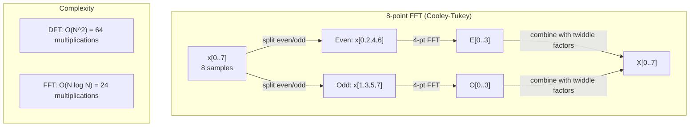
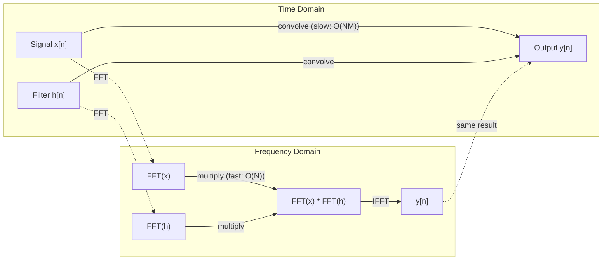

# 傅里叶变换

> 每个信号都是正弦波之和。傅里叶变换告诉你是哪些。

**类型：** Build
**语言：** Python
**前置要求：** 阶段 1，第 01-04 课、19 课（复数）
**预计时间：** ~90 分钟

## 学习目标

- 从零实现 DFT，并对照 O(N log N) 的 Cooley-Tukey FFT 验证它
- 解读频率系数：从信号中提取幅度、相位和功率谱
- 应用卷积定理，用 FFT 乘法来做卷积
- 把傅里叶频率分解和 transformer 位置编码、CNN 卷积层联系起来

## 问题所在

一段录音是随时间变化的一串气压测量值。一只股票价格是随天数变化的一串值。一张图像是随空间变化的一格像素强度。所有这些都是时域（或空间域）里的数据。你看到值随某个索引变化。

但许多模式在时域里是不可见的。这段音频是纯音还是和弦？这只股价有没有周度周期？这张图有没有重复的纹理？这些问题关乎频率内容，而时域把它藏起来了。

傅里叶变换把数据从时域转到频域。它拿一个信号，把它分解成不同频率的正弦波。每个正弦波有一个幅度（它有多强）和一个相位（它从哪开始）。傅里叶变换两个都告诉你。

这对 ML 重要，因为频域思维无处不在。卷积神经网络做卷积，而卷积是频域里的乘法。Transformer 的位置编码用频率分解来表示位置。音频模型（语音识别、音乐生成）在声谱图——声音的频率表示——上工作。时间序列模型寻找周期模式。理解傅里叶变换给你与所有这些打交道的词汇。

## 核心概念

### DFT 的定义

给定 N 个样本 x[0], x[1], ..., x[N-1]，离散傅里叶变换产出 N 个频率系数 X[0], X[1], ..., X[N-1]：

```
X[k] = sum_{n=0}^{N-1} x[n] * e^(-2*pi*i*k*n/N)

for k = 0, 1, ..., N-1
```

每个 X[k] 是一个复数。它的模 |X[k]| 告诉你频率 k 的幅度。它的相位 angle(X[k]) 告诉你那个频率的相位偏移。

关键洞见：`e^(-2*pi*i*k*n/N)` 是一个频率为 k 的旋转相量。DFT 计算信号与 N 个等距频率每一个之间的相关。如果信号在频率 k 处含有能量，相关就大。如果没有，它就接近零。

### 每个系数的含义

**X[0]：直流分量。** 这是所有样本之和——正比于均值。它表示信号的恒定（零频率）偏移。

```
X[0] = sum_{n=0}^{N-1} x[n] * e^0 = sum of all samples
```

**1 <= k <= N/2 的 X[k]：正频率。** X[k] 表示频率为每 N 个样本 k 个周期。k 越高意味着频率越高（振荡越快）。

**X[N/2]：奈奎斯特频率。** 你用 N 个样本能表示的最高频率。超过它，你就得到混叠——高频伪装成低频。

**N/2 < k < N 的 X[k]：负频率。** 对实值信号，X[N-k] = conj(X[k])。负频率是正频率的镜像。这就是为什么有用的信息在前 N/2 + 1 个系数里。

### 逆 DFT

逆 DFT 从频率系数重构原始信号：

```
x[n] = (1/N) * sum_{k=0}^{N-1} X[k] * e^(2*pi*i*k*n/N)

for n = 0, 1, ..., N-1
```

相对正向 DFT 唯一的区别：指数里的符号是正的（不是负的），并且有一个 1/N 的归一化因子。

逆 DFT 是完美重构。没有信息丢失。你可以从时域到频域再回来，毫无误差。DFT 是一次基变换——它用不同的坐标系重新表达同样的信息。

### FFT：让它变快

上面定义的 DFT 是 O(N^2)：对 N 个输出系数中的每一个，你都要在 N 个输入样本上求和。对 N = 100 万，那是 10^12 次操作。

快速傅里叶变换（FFT）用 O(N log N) 算出同样的结果。对 N = 100 万，那大约是两千万次操作，而不是一万亿。这就是让频率分析变实用的东西。

Cooley-Tukey 算法（最常见的 FFT）靠分治工作：

1. 把信号分成偶数索引和奇数索引的样本。
2. 递归地计算每一半的 DFT。
3. 用"旋转因子"e^(-2*pi*i*k/N) 把两个半尺寸 DFT 合起来。

```
X[k] = E[k] + e^(-2*pi*i*k/N) * O[k]          for k = 0, ..., N/2 - 1
X[k + N/2] = E[k] - e^(-2*pi*i*k/N) * O[k]    for k = 0, ..., N/2 - 1

where E = DFT of even-indexed samples
      O = DFT of odd-indexed samples
```

这种对称意味着每一层递归做 O(N) 工作，而有 log2(N) 层。总计：O(N log N)。



FFT 要求信号长度是 2 的幂。实践中，信号被补零到下一个 2 的幂。

### 谱分析

**功率谱**是 |X[k]|^2——每个频率系数的模的平方。它显示每个频率上有多少能量。

**相位谱**是 angle(X[k])——每个频率的相位偏移。对大多数分析任务，你关心功率谱、忽略相位。

```
Power at frequency k:  P[k] = |X[k]|^2 = X[k].real^2 + X[k].imag^2
Phase at frequency k:  phi[k] = atan2(X[k].imag, X[k].real)
```

### 频率分辨率

DFT 的频率分辨率取决于样本数 N 和采样率 fs。

```
Frequency of bin k:      f_k = k * fs / N
Frequency resolution:    delta_f = fs / N
Maximum frequency:       f_max = fs / 2  (Nyquist)
```

要分辨两个靠得很近的频率，你需要更多样本。要捕获高频，你需要更高的采样率。

### 卷积定理

这是信号处理里最重要的结果之一，也和 CNN 直接相关。

**时域里的卷积等于频域里的逐点乘法。**

```
x * h = IFFT(FFT(x) . FFT(h))

where * is convolution and . is element-wise multiplication
```

它为什么重要：

- 两个长度 N 和 M 的信号的直接卷积花 O(N*M) 次操作。
- 基于 FFT 的卷积花 O(N log N)：变换两者、相乘、变换回来。
- 对大核，FFT 卷积快得多。
- 这正是大感受野卷积层里发生的事。

注意：DFT 计算的是循环卷积（信号会绕回来）。对线性卷积（不绕回），在计算前把两个信号都补零到长度 N + M - 1。



### 加窗

DFT 假设信号是周期的——它把这 N 个样本当作一个无限重复信号的一个周期。如果信号的起点和终点值不同，这就在边界处造出一个不连续，表现为虚假的高频内容。这叫频谱泄漏。

加窗通过在计算 DFT 前把信号两端都收窄到零来减少泄漏。

常见窗：

| 窗 | 形状 | 主瓣宽度 | 旁瓣电平 | 适用场景 |
|--------|-------|----------------|-----------------|----------|
| 矩形 | 平（不加窗） | 最窄 | 最高（-13 dB） | 信号在 N 个样本里恰好周期时 |
| Hann | 升余弦 | 适中 | 低（-31 dB） | 通用谱分析 |
| Hamming | 改进余弦 | 适中 | 更低（-42 dB） | 音频处理、语音分析 |
| Blackman | 三重余弦 | 宽 | 很低（-58 dB） | 旁瓣抑制关键时 |

```
Hann window:    w[n] = 0.5 * (1 - cos(2*pi*n / (N-1)))
Hamming window: w[n] = 0.54 - 0.46 * cos(2*pi*n / (N-1))
```

在 DFT 前把窗和信号逐元素相乘来应用它：`X = DFT(x * w)`。

### DFT 性质

| 性质 | 时域 | 频域 |
|----------|-------------|-----------------|
| 线性 | a*x + b*y | a*X + b*Y |
| 时移 | x[n - k] | X[f] * e^(-2*pi*i*f*k/N) |
| 频移 | x[n] * e^(2*pi*i*f0*n/N) | X[f - f0] |
| 卷积 | x * h | X * H（逐点） |
| 乘法 | x * h（逐点） | X * H（循环卷积，按 1/N 缩放） |
| Parseval 定理 | sum \|x[n]\|^2 | (1/N) * sum \|X[k]\|^2 |
| 共轭对称（实输入） | x[n] 实 | X[k] = conj(X[N-k]) |

Parseval 定理说总能量在两个域里相同。能量在变换中守恒。

### 与位置编码的联系

原始 Transformer 用正弦位置编码：

```
PE(pos, 2i)   = sin(pos / 10000^(2i/d_model))
PE(pos, 2i+1) = cos(pos / 10000^(2i/d_model))
```

每对维度 (2i, 2i+1) 在不同频率上振荡。频率从高（维度 0,1）到低（最后那些维度）几何间距分布。这给每个位置一个跨所有频带的独特模式——类似傅里叶系数如何唯一标识一个信号。

它提供的关键性质：

- **唯一性：** 没有两个位置有相同的编码。
- **有界取值：** sin 和 cos 始终在 [-1, 1] 里。
- **相对位置：** 位置 p+k 的编码可以表达为位置 p 处编码的线性函数。模型可以学会关注相对位置。

### 与 CNN 的联系

卷积层把一个学到的滤波器（核）作用到输入上，办法是把它在信号或图像上滑动。在数学上，这就是卷积运算。

由卷积定理，这等价于：
1. 对输入做 FFT
2. 对核做 FFT
3. 在频域里相乘
4. 对结果做 IFFT

标准 CNN 实现用直接卷积（对小的 3x3 核更快）。但对大核或全局卷积，基于 FFT 的方法明显更快。有些架构（如 FNet）完全用 FFT 替换注意力，以 O(N log N) 而非 O(N^2) 的复杂度达到有竞争力的准确率。

### 声谱图和短时傅里叶变换

单次 FFT 给你整个信号的频率内容，但对那些频率何时出现一无所知。一个啁啾（频率随时间增加的信号）和一个和弦（所有频率同时出现）可以有相同的幅度谱。

短时傅里叶变换（STFT）通过在信号的重叠窗上计算 FFT 来解决这个问题。结果是一张声谱图：一个二维表示，一根轴是时间、另一根是频率。每点的强度显示那个时刻、那个频率上的能量。

```
STFT procedure:
1. Choose a window size (e.g., 1024 samples)
2. Choose a hop size (e.g., 256 samples -- 75% overlap)
3. For each window position:
   a. Extract the windowed segment
   b. Apply a Hann/Hamming window
   c. Compute FFT
   d. Store the magnitude spectrum as one column of the spectrogram
```

声谱图是音频 ML 模型的标准输入表示。语音识别模型（Whisper、DeepSpeech）在梅尔声谱图上工作——把频率映射到梅尔标度的声谱图，这更贴合人类的音高感知。

### 混叠

如果信号含有高于 fs/2（奈奎斯特频率）的频率，以速率 fs 采样会造出混叠副本。一个 90 Hz 信号以 100 Hz 采样看起来和一个 10 Hz 信号一模一样。光从样本无法区分它们。

```
Example:
  True signal: 90 Hz sine wave
  Sampling rate: 100 Hz
  Apparent frequency: 100 - 90 = 10 Hz

  The samples from the 90 Hz signal at 100 Hz sampling rate
  are identical to the samples from a 10 Hz signal.
  No amount of math can recover the original 90 Hz.
```

这就是为什么模数转换器包含抗混叠滤波器，在采样前移除高于奈奎斯特的频率。在 ML 里，混叠出现在不做适当低通滤波就对特征图下采样时——有些架构用抗混叠的池化层来应对。

### 补零不增加分辨率

一个常见误解：在 FFT 前给信号补零会改善频率分辨率。它不会。补零在已有的频率 bin 之间插值，给你一个看起来更平滑的谱。但它无法揭示原始样本里不存在的频率细节。

真正的频率分辨率只取决于观测时间 T = N / fs。要分辨相隔 delta_f 的两个频率，你至少需要 T = 1 / delta_f 秒的数据。再多补零也改变不了这个根本极限。

## 动手构建

### 第 1 步：从零写 DFT

O(N^2) 的 DFT 直接从定义来。

```python
import math

class Complex:
    ...

def dft(x):
    N = len(x)
    result = []
    for k in range(N):
        total = Complex(0, 0)
        for n in range(N):
            angle = -2 * math.pi * k * n / N
            w = Complex(math.cos(angle), math.sin(angle))
            xn = x[n] if isinstance(x[n], Complex) else Complex(x[n])
            total = total + xn * w
        result.append(total)
    return result
```

### 第 2 步：逆 DFT

同样的结构，正指数，除以 N。

```python
def idft(X):
    N = len(X)
    result = []
    for n in range(N):
        total = Complex(0, 0)
        for k in range(N):
            angle = 2 * math.pi * k * n / N
            w = Complex(math.cos(angle), math.sin(angle))
            total = total + X[k] * w
        result.append(Complex(total.real / N, total.imag / N))
    return result
```

### 第 3 步：FFT（Cooley-Tukey）

递归 FFT 要求长度是 2 的幂。分成偶和奇，递归，用旋转因子合起来。

```python
def fft(x):
    N = len(x)
    if N <= 1:
        return [x[0] if isinstance(x[0], Complex) else Complex(x[0])]
    if N % 2 != 0:
        return dft(x)

    even = fft([x[i] for i in range(0, N, 2)])
    odd = fft([x[i] for i in range(1, N, 2)])

    result = [Complex(0)] * N
    for k in range(N // 2):
        angle = -2 * math.pi * k / N
        twiddle = Complex(math.cos(angle), math.sin(angle))
        t = twiddle * odd[k]
        result[k] = even[k] + t
        result[k + N // 2] = even[k] - t
    return result
```

### 第 4 步：谱分析辅助函数

```python
def power_spectrum(X):
    return [xk.real ** 2 + xk.imag ** 2 for xk in X]

def convolve_fft(x, h):
    N = len(x) + len(h) - 1
    padded_N = 1
    while padded_N < N:
        padded_N *= 2

    x_padded = x + [0.0] * (padded_N - len(x))
    h_padded = h + [0.0] * (padded_N - len(h))

    X = fft(x_padded)
    H = fft(h_padded)

    Y = [xk * hk for xk, hk in zip(X, H)]

    y = idft(Y)
    return [y[n].real for n in range(N)]
```

## 上手使用

实际工作中，用 numpy 的 FFT，它由高度优化的 C 库支撑。

```python
import numpy as np

signal = np.sin(2 * np.pi * 5 * np.arange(256) / 256)
spectrum = np.fft.fft(signal)
freqs = np.fft.fftfreq(256, d=1/256)

power = np.abs(spectrum) ** 2

positive_freqs = freqs[:len(freqs)//2]
positive_power = power[:len(power)//2]
```

加窗和更高级的谱分析：

```python
from scipy.signal import windows, stft

window = windows.hann(256)
windowed = signal * window
spectrum = np.fft.fft(windowed)
```

卷积：

```python
from scipy.signal import fftconvolve

result = fftconvolve(signal, kernel, mode='full')
```

声谱图：

```python
from scipy.signal import stft

frequencies, times, Zxx = stft(signal, fs=sample_rate, nperseg=256)
spectrogram = np.abs(Zxx) ** 2
```

声谱图矩阵的形状是 (n_frequencies, n_time_frames)。每一列是一个时间窗的功率谱。这就是音频 ML 模型作为输入消费的东西。

## 交付

运行 `code/fourier.py` 来生成 `outputs/prompt-spectral-analyzer.md`。

## 练习

1. **纯音识别。** 创建一个单正弦波信号，频率未知（1 到 50 Hz 之间），以 128 Hz 采样 1 秒。用你的 DFT 识别频率。验证答案吻合。现在加入标准差 0.5 的高斯噪声重复一遍。噪声如何影响谱？

2. **FFT vs DFT 验证。** 生成一个长度 64 的随机信号。同时计算 DFT（O(N^2)）和 FFT。验证所有系数吻合到 1e-10 以内。在长度 256、512、1024 和 2048 的信号上给两个函数计时。画出 DFT 时间与 FFT 时间之比。

3. **用例子证明卷积定理。** 创建信号 x = [1, 2, 3, 4, 0, 0, 0, 0] 和滤波器 h = [1, 1, 1, 0, 0, 0, 0, 0]。直接（嵌套循环）计算它们的循环卷积。然后通过 FFT（变换、相乘、逆变换）计算它。验证结果吻合。现在适当补零做线性卷积。

4. **加窗效应。** 创建一个信号，它是 10 Hz 和 12 Hz（很近）两个正弦波之和。以 128 Hz 采样 1 秒。计算不加窗、Hann 窗和 Hamming 窗的功率谱。哪个窗最容易区分这两个峰？为什么？

5. **位置编码分析。** 为 d_model = 128、max_pos = 512 生成正弦位置编码。对每对位置 (p1, p2)，计算它们编码的点积。证明点积只取决于 |p1 - p2|，不取决于绝对位置。随着距离增加，点积会怎样？

## 关键术语

| 术语 | 它的意思 |
|------|---------------|
| DFT（离散傅里叶变换） | 把 N 个时域样本转成 N 个频域系数。每个系数是与该频率复正弦的相关 |
| FFT（快速傅里叶变换） | 计算 DFT 的 O(N log N) 算法。Cooley-Tukey 算法递归地拆分偶/奇索引 |
| 逆 DFT | 从频率系数重构时域信号。和 DFT 同公式，翻转指数符号并按 1/N 缩放 |
| 频率 bin | DFT 输出里每个索引 k 表示频率 k*fs/N Hz。"bin"是离散的频率槽 |
| 直流分量 | X[0]，零频率系数。正比于信号均值 |
| 奈奎斯特频率 | fs/2，采样率 fs 下可表示的最高频率。高于它的频率会混叠 |
| 功率谱 | \|X[k]\|^2，每个频率系数模的平方。显示能量在各频率上的分布 |
| 相位谱 | angle(X[k])，每个频率分量的相位偏移。分析中常被忽略 |
| 频谱泄漏 | 把非周期信号当周期对待造成的虚假频率内容。靠加窗减少 |
| 窗函数 | 在 DFT 前应用的收窄函数（Hann、Hamming、Blackman），用来减少频谱泄漏 |
| 旋转因子 | 复指数 e^(-2*pi*i*k/N)，用在 FFT 蝶形计算里合并子 DFT |
| 卷积定理 | 时域卷积等于频域逐点乘法。信号处理和 CNN 的基础 |
| 循环卷积 | 信号会绕回来的卷积。这是 DFT 天然计算的东西 |
| 线性卷积 | 不绕回的标准卷积。通过在 DFT 前补零实现 |
| Parseval 定理 | 总能量在傅里叶变换中守恒。sum \|x[n]\|^2 = (1/N) sum \|X[k]\|^2 |
| 混叠 | 因采样率不足，高于奈奎斯特的频率表现为更低频率 |

## 延伸阅读

- [Cooley & Tukey: An Algorithm for the Machine Calculation of Complex Fourier Series (1965)](https://www.ams.org/journals/mcom/1965-19-090/S0025-5718-1965-0178586-1/) - 改变了计算的 FFT 原始论文
- [3Blue1Brown: But what is the Fourier Transform?](https://www.youtube.com/watch?v=spUNpyF58BY) - 对傅里叶变换最好的可视化引入
- [Lee-Thorp et al.: FNet: Mixing Tokens with Fourier Transforms (2021)](https://arxiv.org/abs/2105.03824) - 在 transformer 里用 FFT 替换自注意力
- [Smith: The Scientist and Engineer's Guide to Digital Signal Processing](http://www.dspguide.com/) - 深入讲 FFT、加窗和谱分析的免费在线教材
- [Vaswani et al.: Attention Is All You Need (2017)](https://arxiv.org/abs/1706.03762) - 从傅里叶频率分解推导出的正弦位置编码
- [Radford et al.: Whisper (2022)](https://arxiv.org/abs/2212.04356) - 用梅尔声谱图作为输入表示的语音识别
