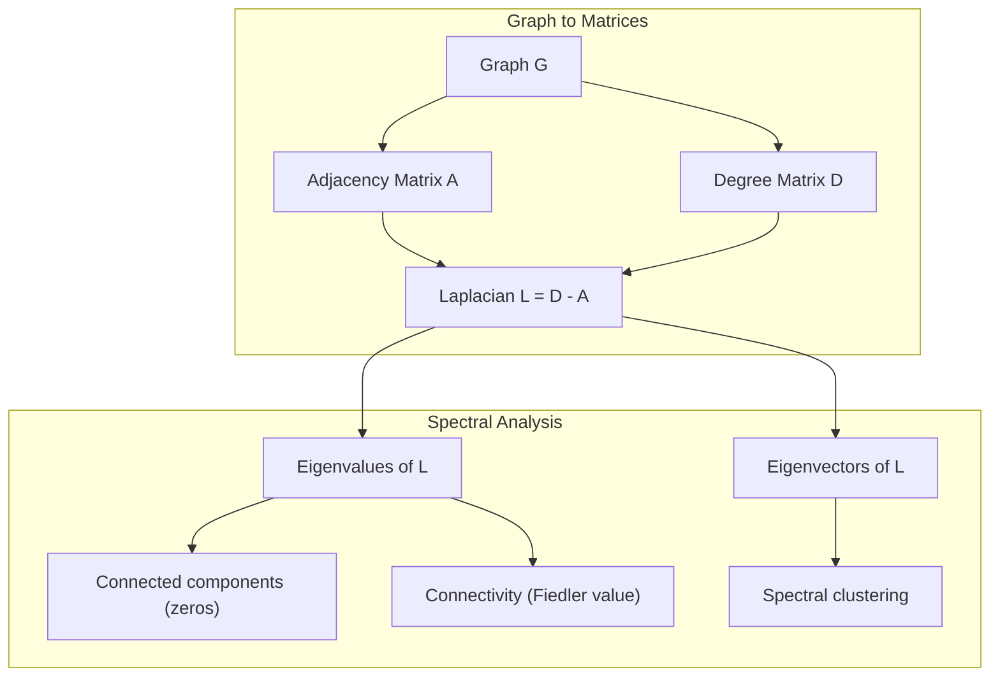
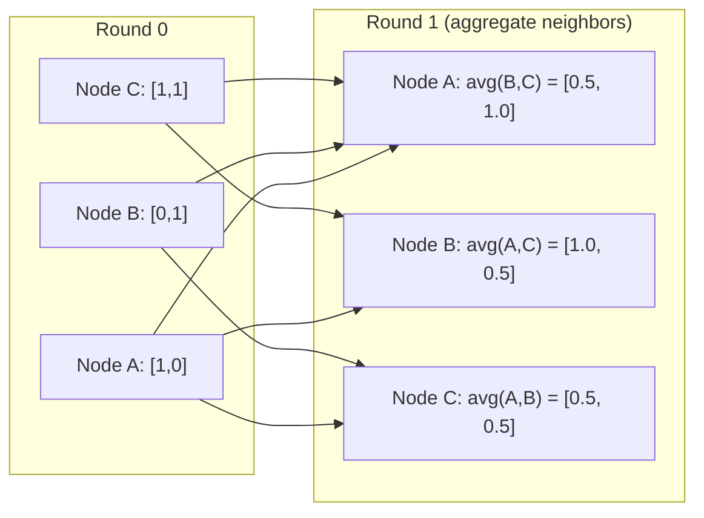

# 写给机器学习的图论

> 图是关系的数据结构。如果你的数据有连接，你就需要图论。

**类型：** Build
**语言：** Python
**前置要求：** 阶段 1，第 01-03 课（线性代数、矩阵）
**预计时间：** ~90 分钟

## 学习目标

- 构建一个带邻接矩阵/邻接表表示的图类，并实现 BFS 和 DFS 遍历
- 计算图的拉普拉斯矩阵，用它的特征值检测连通分量并对节点聚类
- 把一轮 GNN 风格的消息传递实现为归一化邻接矩阵乘法
- 用 Fiedler 向量做谱聚类来划分一个图

## 问题所在

社交网络、分子、知识库、引文网络、路线图——全是图。传统 ML 把数据当成平坦的表。每一行独立。每个特征是一列。但当连接的结构要紧时，表就失效了。

想想社交网络。你想预测一个用户会买什么产品。他的购买历史要紧。但他朋友的购买历史更要紧。那些连接携带信号。

或者想想一个分子。你想预测它会不会结合到某个蛋白质上。原子要紧，但真正要紧的是原子之间如何成键。结构就是数据。

图神经网络（GNN）是深度学习里增长最快的领域。它们驱动药物发现、社交推荐、欺诈检测和知识图谱推理。每个 GNN 都建立在同一个基础上：基础图论。

你需要四样东西：
1. 一种把图表示成矩阵的方式（这样你才能把它们相乘）
2. 探索图结构的遍历算法
3. 拉普拉斯矩阵——谱图论里最重要的单一矩阵
4. 消息传递——让 GNN 运转的操作

## 核心概念

### 图：节点和边

一个图 G = (V, E) 由顶点（节点）V 和边 E 组成。每条边连接两个节点。

**有向 vs 无向。** 在无向图里，边 (u, v) 意味着 u 连到 v 且 v 连到 u。在有向图里，边 (u, v) 意味着 u 指向 v，但不一定反过来。

**带权 vs 无权。** 在无权图里，边要么存在、要么不存在。在带权图里，每条边有一个数值权重——距离、代价、强度。

| 图类型 | 例子 |
|-----------|---------|
| 无向、无权 | Facebook 好友网络 |
| 有向、无权 | Twitter 关注网络 |
| 无向、带权 | 路线图（距离） |
| 有向、带权 | 网页链接（PageRank 分数） |

### 邻接矩阵

邻接矩阵 A 是核心表示。对于一个 n 节点的图：

```
A[i][j] = 1    if there is an edge from node i to node j
A[i][j] = 0    otherwise
```

对无向图，A 是对称的：A[i][j] = A[j][i]。对带权图，A[i][j] = 边 (i, j) 的权重。

**例子——一个三角形：**

```
Nodes: 0, 1, 2
Edges: (0,1), (1,2), (0,2)

A = [[0, 1, 1],
     [1, 0, 1],
     [1, 1, 0]]
```

邻接矩阵是每个 GNN 的输入。对 A 的矩阵操作对应图上的操作。

### 度

一个节点的度是连到它的边数。对有向图，你有入度（进来的边）和出度（出去的边）。

度矩阵 D 是对角的：

```
D[i][i] = degree of node i
D[i][j] = 0    for i != j
```

对三角形例子：D = diag(2, 2, 2)，因为每个节点都连到另外两个。

度告诉你节点的重要性。度高 = 枢纽节点。网络的度分布揭示它的结构。社交网络遵循幂律（少数枢纽，许多叶节点）。随机图的度服从泊松分布。

### BFS 和 DFS

两个基本的图遍历算法。两个都需要。

**广度优先搜索（BFS）：** 先探索所有邻居，再探索邻居的邻居。用队列（FIFO）。

```
BFS from node 0:
  Visit 0
  Queue: [1, 2]        (neighbors of 0)
  Visit 1
  Queue: [2, 3]        (add neighbors of 1)
  Visit 2
  Queue: [3]           (neighbors of 2 already visited)
  Visit 3
  Queue: []            (done)
```

BFS 在无权图里找最短路径。从起点到任何节点的距离等于该节点首次被发现时的 BFS 层级。这就是 BFS 用于社交网络里跳数距离的原因。

**深度优先搜索（DFS）：** 在回溯前尽可能往深走。用栈（LIFO）或递归。

```
DFS from node 0:
  Visit 0
  Stack: [1, 2]        (neighbors of 0)
  Visit 2               (pop from stack)
  Stack: [1, 3]         (add neighbors of 2)
  Visit 3               (pop from stack)
  Stack: [1]
  Visit 1               (pop from stack)
  Stack: []             (done)
```

DFS 对以下有用：
- 找连通分量（从未访问的节点跑 DFS）
- 环检测（DFS 树里的回边）
- 拓扑排序（DFS 完成顺序的逆序）

| 算法 | 数据结构 | 找什么 | 适用场景 |
|-----------|---------------|-------|----------|
| BFS | 队列 | 最短路径 | 社交网络距离、知识图谱遍历 |
| DFS | 栈 | 分量、环 | 连通性、拓扑排序 |

### 图的拉普拉斯矩阵

L = D - A。谱图论里最重要的矩阵。

对三角形：

```
D = [[2, 0, 0],    A = [[0, 1, 1],    L = [[2, -1, -1],
     [0, 2, 0],         [1, 0, 1],         [-1, 2, -1],
     [0, 0, 2]]         [1, 1, 0]]         [-1, -1,  2]]
```

拉普拉斯矩阵有非凡的性质：

1. **L 是半正定的。** 所有特征值 >= 0。

2. **零特征值的个数等于连通分量的个数。** 连通图恰好有一个零特征值。有 3 个不连通分量的图有三个零特征值。

3. **最小的非零特征值（Fiedler 值）度量连通性。** Fiedler 值大意味着图连接良好。Fiedler 值小意味着图有薄弱点——一个瓶颈。

4. **Fiedler 值的特征向量（Fiedler 向量）揭示最佳划分。** 值为正的节点归一组，值为负的节点归另一组。这就是谱聚类。



### 谱性质

邻接矩阵和拉普拉斯矩阵的特征值不靠任何遍历就揭示结构性质。

**谱聚类**这样工作：
1. 计算拉普拉斯矩阵 L
2. 找 L 的 k 个最小特征向量（跳过第一个，对连通图它是全 1）
3. 用那些特征向量作为每个节点的新坐标
4. 在那些坐标上跑 k-means

为什么有效？L 的特征向量编码了图上"最平滑"的函数。连接良好的节点得到相似的特征向量值。被瓶颈隔开的节点得到不同的值。特征向量自然地分开簇。

**与随机游走的联系。** 归一化拉普拉斯矩阵关联到图上的随机游走。随机游走的平稳分布正比于节点度。混合时间（游走收敛多快）取决于谱隙。

### 消息传递

图神经网络的核心操作。每个节点从它的邻居收集消息、聚合它们、更新自己的状态。

```
h_v^(k+1) = UPDATE(h_v^(k), AGGREGATE({h_u^(k) : u in neighbors(v)}))
```

在最简单的形式里，AGGREGATE = 均值，UPDATE = 线性变换 + 激活：

```
h_v^(k+1) = sigma(W * mean({h_u^(k) : u in neighbors(v)}))
```

这是伪装的矩阵乘法。如果 H 是所有节点特征的矩阵、A 是邻接矩阵：

```
H^(k+1) = sigma(A_norm * H^(k) * W)
```

其中 A_norm 是归一化邻接矩阵（每行之和为 1）。

一轮消息传递让每个节点"看到"它的直接邻居。两轮让它看到邻居的邻居。K 轮给每个节点来自它 K 跳邻域的信息。



### 概念与 ML 应用

| 概念 | ML 应用 |
|---------|---------------|
| 邻接矩阵 | GNN 输入表示 |
| 图拉普拉斯 | 谱聚类、社区检测 |
| BFS/DFS | 知识图谱遍历、寻路 |
| 度分布 | 节点重要性、特征工程 |
| 消息传递 | GNN 层（GCN、GAT、GraphSAGE） |
| L 的特征值 | 社区检测、图划分 |
| 谱聚类 | 无监督节点分组 |
| PageRank | 节点重要性、网页搜索 |

## 动手构建

### 第 1 步：从零写图类

```python
class Graph:
    def __init__(self, n_nodes, directed=False):
        self.n = n_nodes
        self.directed = directed
        self.adj = {i: {} for i in range(n_nodes)}

    def add_edge(self, u, v, weight=1.0):
        self.adj[u][v] = weight
        if not self.directed:
            self.adj[v][u] = weight

    def neighbors(self, node):
        return list(self.adj[node].keys())

    def degree(self, node):
        return len(self.adj[node])

    def adjacency_matrix(self):
        import numpy as np
        A = np.zeros((self.n, self.n))
        for u in range(self.n):
            for v, w in self.adj[u].items():
                A[u][v] = w
        return A

    def degree_matrix(self):
        import numpy as np
        D = np.zeros((self.n, self.n))
        for i in range(self.n):
            D[i][i] = self.degree(i)
        return D

    def laplacian(self):
        return self.degree_matrix() - self.adjacency_matrix()
```

邻接表（`self.adj`）高效地存邻居。邻接矩阵的转换用 numpy，因为所有谱操作都需要它。

### 第 2 步：BFS 和 DFS

```python
from collections import deque

def bfs(graph, start):
    visited = set()
    order = []
    distances = {}
    queue = deque([(start, 0)])
    visited.add(start)
    while queue:
        node, dist = queue.popleft()
        order.append(node)
        distances[node] = dist
        for neighbor in graph.neighbors(node):
            if neighbor not in visited:
                visited.add(neighbor)
                queue.append((neighbor, dist + 1))
    return order, distances


def dfs(graph, start):
    visited = set()
    order = []
    stack = [start]
    while stack:
        node = stack.pop()
        if node in visited:
            continue
        visited.add(node)
        order.append(node)
        for neighbor in reversed(graph.neighbors(node)):
            if neighbor not in visited:
                stack.append(neighbor)
    return order
```

BFS 用 deque（双端队列）做 O(1) 的 popleft。DFS 用列表当栈。两者都恰好访问每个节点一次——O(V + E) 时间。

### 第 3 步：连通分量和拉普拉斯特征值

```python
def connected_components(graph):
    visited = set()
    components = []
    for node in range(graph.n):
        if node not in visited:
            order, _ = bfs(graph, node)
            visited.update(order)
            components.append(order)
    return components


def laplacian_eigenvalues(graph):
    import numpy as np
    L = graph.laplacian()
    eigenvalues = np.linalg.eigvalsh(L)
    return eigenvalues
```

`eigvalsh` 是给对称矩阵用的——无向图的拉普拉斯矩阵总是对称的。它按升序返回特征值。数零的个数来找连通分量数。

### 第 4 步：谱聚类

```python
def spectral_clustering(graph, k=2):
    import numpy as np
    L = graph.laplacian()
    eigenvalues, eigenvectors = np.linalg.eigh(L)
    features = eigenvectors[:, 1:k+1]

    labels = np.zeros(graph.n, dtype=int)
    for i in range(graph.n):
        if features[i, 0] >= 0:
            labels[i] = 0
        else:
            labels[i] = 1
    return labels
```

对 k=2，Fiedler 向量的符号把图分成两簇。对 k>2，你会在前 k 个特征向量（排除平凡的全 1 特征向量）上跑 k-means。

### 第 5 步：消息传递

```python
def message_passing(graph, features, weight_matrix):
    import numpy as np
    A = graph.adjacency_matrix()
    row_sums = A.sum(axis=1, keepdims=True)
    row_sums[row_sums == 0] = 1
    A_norm = A / row_sums
    aggregated = A_norm @ features
    output = aggregated @ weight_matrix
    return output
```

这是一轮 GNN 消息传递。每个节点的新特征是它邻居特征的加权平均，再经权重矩阵变换。叠多轮就能把信息传得更远。

## 上手使用

用 networkx 和 numpy，同样的操作都是一行：

```python
import networkx as nx
import numpy as np

G = nx.karate_club_graph()

A = nx.adjacency_matrix(G).toarray()
L = nx.laplacian_matrix(G).toarray()

eigenvalues = np.linalg.eigvalsh(L.astype(float))
print(f"Smallest eigenvalues: {eigenvalues[:5]}")
print(f"Connected components: {nx.number_connected_components(G)}")

communities = nx.community.greedy_modularity_communities(G)
print(f"Communities found: {len(communities)}")

pr = nx.pagerank(G)
top_nodes = sorted(pr.items(), key=lambda x: x[1], reverse=True)[:5]
print(f"Top 5 PageRank nodes: {top_nodes}")
```

networkx 用优化过的 C 后端处理任意大小的图。生产里用它。用你从零写的实现来理解它在做什么。

### numpy 谱分析

```python
import numpy as np

A = np.array([
    [0, 1, 1, 0, 0],
    [1, 0, 1, 0, 0],
    [1, 1, 0, 1, 0],
    [0, 0, 1, 0, 1],
    [0, 0, 0, 1, 0]
])

D = np.diag(A.sum(axis=1))
L = D - A

eigenvalues, eigenvectors = np.linalg.eigh(L)
print(f"Eigenvalues: {np.round(eigenvalues, 4)}")
print(f"Fiedler value: {eigenvalues[1]:.4f}")
print(f"Fiedler vector: {np.round(eigenvectors[:, 1], 4)}")

fiedler = eigenvectors[:, 1]
group_a = np.where(fiedler >= 0)[0]
group_b = np.where(fiedler < 0)[0]
print(f"Cluster A: {group_a}")
print(f"Cluster B: {group_b}")
```

Fiedler 向量挑了大梁。一簇里是正项，另一簇里是负项。不需要迭代优化——只要一次特征分解。

## 交付

本节课产出：
- `outputs/skill-graph-analysis.md` -- 一份分析图结构数据的 skill 参考

## 关联

| 概念 | 它出现在哪 |
|---------|------------------|
| 邻接矩阵 | GCN、GAT、GraphSAGE 输入 |
| 拉普拉斯 | 谱聚类、ChebNet 滤波器 |
| BFS | 知识图谱遍历、最短路径查询 |
| 消息传递 | 每个 GNN 层、神经消息传递 |
| 谱隙 | 图连通性、随机游走的混合时间 |
| 度分布 | 幂律网络、节点特征工程 |
| 连通分量 | 预处理、处理不连通图 |
| PageRank | 节点重要性排序、注意力初始化 |

GNN 值得特别一提。GCN（Kipf & Welling, 2017）里的图卷积操作用带自环的邻接矩阵 A_hat = A + I：

```text
H^(l+1) = sigma(D_hat^(-1/2) * A_hat * D_hat^(-1/2) * H^(l) * W^(l))
```

其中 A_hat = A + I（邻接加自环），D_hat 是 A_hat 的度矩阵。自环保证每个节点在聚合时也包含它自己的特征。这正是带对称归一化的消息传递。D_hat^(-1/2) * A_hat * D_hat^(-1/2) 是归一化邻接矩阵。拉普拉斯之所以出现，是因为这个归一化关联到 L_sym = I - D^(-1/2) * A * D^(-1/2)。理解拉普拉斯就是理解 GCN 为何有效。

## 练习

1. **从零实现 PageRank。** 从均匀分数开始。每一步：对所有指向 v 的 u，score(v) = (1-d)/n + d * sum(score(u)/out_degree(u))。用 d=0.85。跑到收敛（变化 < 1e-6）。在一个小网页图上测试。

2. **用谱聚类找社区。** 创建一个有两个清晰分离簇的图（例如，两个团由一条边连起来）。跑谱聚类，验证它找到正确的划分。随着你加更多跨簇的边会怎样？

3. **实现 Dijkstra 算法**，求带权图里的最短路径。在权重均匀的同一个图上把结果和 BFS 对比。

4. **构建一个两层消息传递网络。** 用不同的权重矩阵应用两次消息传递。证明两轮之后，每个节点有来自它两跳邻域的信息。

5. **分析一个真实世界的图。** 用空手道俱乐部图（34 节点，78 边）。计算度分布、拉普拉斯特征值和谱聚类。把谱聚类结果和已知的真实划分对比。

## 关键术语

| 术语 | 人们常说 | 它实际指什么 |
|------|----------------|----------------------|
| 图 | "节点和边" | 编码成对关系的数学结构 G=(V,E) |
| 邻接矩阵 | "连接表" | 一个 n x n 矩阵，节点 i 和 j 相连时 A[i][j] = 1 |
| 度 | "一个节点有多连通" | 触及一个节点的边数 |
| 拉普拉斯 | "D 减 A" | L = D - A，其特征值揭示图结构的矩阵 |
| Fiedler 值 | "代数连通度" | L 最小的非零特征值，度量图连接得多好 |
| BFS | "逐层搜索" | 在往深走之前访问所有邻居的遍历，找最短路径 |
| DFS | "先往深走" | 沿一条路径走到底再回溯的遍历 |
| 消息传递 | "节点和邻居说话" | 每个节点从邻居聚合信息，GNN 的核心 |
| 谱聚类 | "靠特征向量聚类" | 用图拉普拉斯的特征向量划分一个图 |
| 连通分量 | "一个独立的片" | 一个极大子图，里面每个节点都能到达其他每个节点 |

## 延伸阅读

- **Kipf & Welling (2017)** -- "Semi-Supervised Classification with Graph Convolutional Networks."。开启现代 GNN 的论文。表明谱图卷积简化为消息传递。
- **Spielman (2012)** -- "Spectral Graph Theory" 讲义。对拉普拉斯、谱隙和图划分的权威引入。
- **Hamilton (2020)** -- "Graph Representation Learning."。从基础到应用覆盖 GNN 的书。
- **Bronstein et al. (2021)** -- "Geometric Deep Learning: Grids, Groups, Graphs, Geodesics, and Gauges."。统一框架的论文。
- **Veličković et al. (2018)** -- "Graph Attention Networks."。用注意力机制扩展消息传递。
