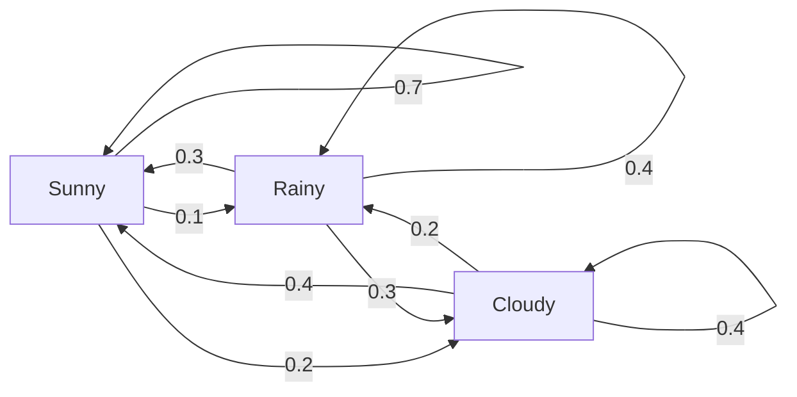
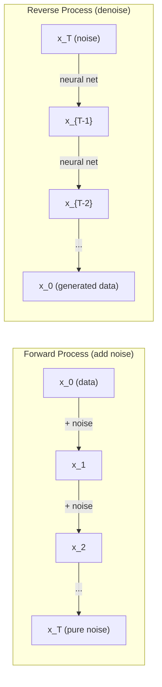

# 随机过程

> 有结构的随机。随机游走、马尔可夫链和扩散模型背后的数学。

**类型：** Learn
**语言：** Python
**前置要求：** 阶段 1，第 06-07 课（概率，贝叶斯）
**预计时间：** ~75 分钟

## 学习目标

- 模拟一维和二维随机游走，验证位移的 sqrt(n) 缩放
- 构建一个马尔可夫链模拟器，通过特征分解计算它的平稳分布
- 实现 Metropolis-Hastings MCMC 和 Langevin 动力学，从目标分布采样
- 把前向扩散过程和布朗运动联系起来，解释反向过程如何生成数据

## 问题所在

许多 AI 系统涉及随时间演化的随机性。不是静态的随机性——而是有结构的、序贯的随机性，每一步都依赖之前的东西。

语言模型一次生成一个 token。每个 token 依赖前面的上下文。模型输出一个概率分布、从中采样、然后继续。那就是一个随机过程。

扩散模型一步步给图像加噪声，直到它变成纯雪花点。然后它逆转这个过程，一步步去噪，直到一张新图浮现。前向过程是一条马尔可夫链。反向过程是一条倒着跑的、学到的马尔可夫链。

强化学习智能体在环境里采取行动。每个行动以某个概率导向一个新状态。智能体在一个随机的世界里遵循一个随机的策略。整件事是一个马尔可夫决策过程。

MCMC 采样——贝叶斯推断的支柱——构造一条马尔可夫链，它的平稳分布就是你想采样的后验。

所有这些都建立在四个基础思想上：
1. 随机游走——最简单的随机过程
2. 马尔可夫链——带转移矩阵的有结构随机性
3. Langevin 动力学——带噪声的梯度下降
4. Metropolis-Hastings——从任意分布采样

## 核心概念

### 随机游走

从位置 0 出发。每一步，掷一枚公平硬币。正面：往右移（+1）。反面：往左移（-1）。

n 步之后，你的位置是 n 个随机 +/-1 值之和。期望位置是 0（这个游走无偏）。但离原点的期望距离随 sqrt(n) 增长。

这反直觉。游走是公平的——没有往任何方向漂移。但随时间推移，它离起点越走越远。n 步后的标准差是 sqrt(n)。

```
Step 0:  Position = 0
Step 1:  Position = +1 or -1
Step 2:  Position = +2, 0, or -2
...
Step 100: Expected distance from origin ~ 10 (sqrt(100))
Step 10000: Expected distance from origin ~ 100 (sqrt(10000))
```

**在二维里**，游走以相等概率往上、下、左、右移动。同样的 sqrt(n) 缩放适用于离原点的距离。路径描出一个类分形的图案。

**为什么是 sqrt(n)？** 每一步以相等概率是 +1 或 -1。n 步后，位置 S_n = X_1 + X_2 + ... + X_n，每个 X_i 是 +/-1。每步的方差是 1，且各步独立，所以 Var(S_n) = n。标准差 = sqrt(n)。由中心极限定理，S_n / sqrt(n) 收敛到标准正态分布。

这个 sqrt(n) 缩放在 ML 里无处不在。SGD 噪声按 1/sqrt(batch_size) 缩放。嵌入维度按 sqrt(d) 缩放。平方根是独立随机相加的标志。

**与布朗运动的联系。** 取一个步长为 1/sqrt(n)、每单位时间 n 步的随机游走。当 n 趋于无穷时，游走收敛到布朗运动 B(t)——一个连续时间过程，B(t) 服从均值 0、方差 t 的正态分布。

布朗运动是扩散的数学基础。它建模流体中粒子的随机抖动、股价的波动，以及——关键地——扩散模型里的噪声过程。

**赌徒破产。** 一个从位置 k 出发的随机游走者，在 0 和 N 处有吸收壁。在到达 0 之前到达 N 的概率是多少？对公平游走：P(到达 N) = k/N。这出奇地简单优雅。它连接到鞅理论——公平随机游走是一个鞅（期望的未来值 = 当前值）。

### 马尔可夫链

马尔可夫链是一个按固定概率在状态之间转移的系统。关键性质：下一个状态只依赖当前状态，不依赖历史。

```
P(X_{t+1} = j | X_t = i, X_{t-1} = ...) = P(X_{t+1} = j | X_t = i)
```

这就是马尔可夫性质。它意味着你能用一个转移矩阵 P 描述整个动力学：

```
P[i][j] = probability of going from state i to state j
```

P 的每一行之和为 1（你总得去某个地方）。

**例子——天气：**

```
States: Sunny (0), Rainy (1), Cloudy (2)

P = [[0.7, 0.1, 0.2],    (if sunny: 70% sunny, 10% rainy, 20% cloudy)
     [0.3, 0.4, 0.3],    (if rainy: 30% sunny, 40% rainy, 30% cloudy)
     [0.4, 0.2, 0.4]]    (if cloudy: 40% sunny, 20% rainy, 40% cloudy)
```

从任意状态出发。经过许多次转移后，状态的分布收敛到平稳分布 pi，其中 pi * P = pi。这是 P 的特征值为 1 的左特征向量。

对天气链，平稳分布可能是 [0.53, 0.18, 0.29]——长期来看，不管起始状态如何，53% 的时间是晴天。



**计算平稳分布。** 有两种办法：

1. **幂法**：把任意初始分布反复乘以 P。迭代够多次后，它收敛。
2. **特征值法**：找 P 的特征值为 1 的左特征向量。这是 P^T 的特征值为 1 的特征向量。

两种办法都要求链满足收敛条件。

**收敛条件。** 一条马尔可夫链收敛到唯一的平稳分布，如果它是：
- **不可约的**：每个状态都能从其他每个状态到达
- **非周期的**：链不以固定周期循环

你在 ML 里碰到的大多数链都满足这两个条件。

**吸收态。** 一个状态是吸收态，如果你一旦进入就再也离不开（P[i][i] = 1）。吸收马尔可夫链建模有终止态的过程——一局结束的游戏、流失的客户、撞上文本结束 token 的 token 序列。

**混合时间。** 多少步之后链才"接近"平稳分布？形式上，是离平稳的总变差距离降到某个阈值以下所需的步数。混合快 = 需要的步数少。P 的谱隙（1 减去第二大特征值）控制混合时间。谱隙越大 = 混合越快。

### 与语言模型的联系

语言模型里的 token 生成近似是一个马尔可夫过程。给定当前上下文，模型输出下一个 token 上的分布。温度控制锐度：

```
P(token_i) = exp(logit_i / temperature) / sum(exp(logit_j / temperature))
```

- 温度 = 1.0：标准分布
- 温度 < 1.0：更锐（更确定）
- 温度 > 1.0：更平（更随机）
- 温度 -> 0：argmax（贪心）

Top-k 采样截断到概率最高的 k 个 token。Top-p（核）采样截断到累积概率超过 p 的最小 token 集合。两者都修改马尔可夫转移概率。

### 布朗运动

随机游走的连续时间极限。位置 B(t) 有三个性质：
1. B(0) = 0
2. B(t) - B(s) 服从均值 0、方差 t - s 的正态分布（t > s 时）
3. 不重叠区间上的增量互相独立

布朗运动连续但处处不可微——它在每个尺度上都抖动。路径在平面里有分形维数 2。

在离散模拟里，你这样近似布朗运动：

```
B(t + dt) = B(t) + sqrt(dt) * z,    where z ~ N(0, 1)
```

sqrt(dt) 的缩放很重要。它来自应用到随机游走上的中心极限定理。

### Langevin 动力学

梯度下降找一个函数的最小值。Langevin 动力学找正比于 exp(-U(x)/T) 的概率分布，其中 U 是能量函数、T 是温度。

```
x_{t+1} = x_t - dt * gradient(U(x_t)) + sqrt(2 * T * dt) * z_t
```

两种力作用在粒子上：
1. **梯度力**（-dt * gradient(U)）：往低能量推（像梯度下降）
2. **随机力**（sqrt(2*T*dt) * z）：往随机方向推（探索）

在温度 T = 0 时，这是纯梯度下降。在高温时，它几乎是随机游走。在合适的温度下，粒子探索能量曲面，并在低能量区域停留更多时间。

**与扩散模型的联系。** 扩散模型的前向过程是：

```
x_t = sqrt(alpha_t) * x_{t-1} + sqrt(1 - alpha_t) * noise
```

这是一条马尔可夫链，逐渐把数据和噪声混合。够多步之后，x_T 是纯高斯噪声。

反向过程——从噪声回到数据——也是一条马尔可夫链，但它的转移概率由一个神经网络学到。网络学会预测每一步加入的噪声，然后减掉它。



### MCMC：马尔可夫链蒙特卡洛

有时你需要从一个分布 p(x) 采样——你能（在相差一个常数的意义上）求它的值，却没法直接从它采样。贝叶斯后验是经典例子——你知道似然乘先验，但归一化常数不可解。

**Metropolis-Hastings** 构造一条马尔可夫链，它的平稳分布是 p(x)：

1. 从某个位置 x 出发
2. 从一个提议分布 Q(x'|x) 提议一个新位置 x'
3. 计算接受比：a = p(x') * Q(x|x') / (p(x) * Q(x'|x))
4. 以概率 min(1, a) 接受 x'。否则停在 x。
5. 重复。

如果 Q 是对称的（例如 Q(x'|x) = Q(x|x') = N(x, sigma^2)），这个比值简化为 a = p(x') / p(x)。你只需要概率之比——归一化常数相消了。

在温和条件下，链保证收敛到 p(x)。但如果提议太小（随机游走）或太大（高拒绝率），收敛可能很慢。调提议是 MCMC 的艺术。

**它为什么有效。** 接受比保证细致平衡：处于 x 并移动到 x' 的概率等于处于 x' 并移动到 x 的概率。细致平衡意味着 p(x) 是链的平稳分布。所以够多步之后，样本就来自 p(x)。

**实践考虑：**
- **Burn-in**：丢弃前 N 个样本。链需要时间从起点到达平稳分布。
- **稀释**：每 k 个样本保留一个以减少自相关。
- **多条链**：从不同起点跑几条链。如果它们收敛到同一个分布，你就有了收敛的证据。
- **接受率**：对 d 维里的高斯提议，最优接受率约为 23%（Roberts & Rosenthal, 2001）。太高意味着链几乎不动。太低意味着它拒绝一切。

### AI 中的随机过程

| 过程 | AI 应用 |
|---------|---------------|
| 随机游走 | RL 里的探索、Node2Vec 嵌入 |
| 马尔可夫链 | 文本生成、MCMC 采样 |
| 布朗运动 | 扩散模型（前向过程） |
| Langevin 动力学 | 基于分数的生成模型、SGLD |
| 马尔可夫决策过程 | 强化学习 |
| Metropolis-Hastings | 贝叶斯推断、后验采样 |

## 动手构建

### 第 1 步：随机游走模拟器

```python
import numpy as np

def random_walk_1d(n_steps, seed=None):
    rng = np.random.RandomState(seed)
    steps = rng.choice([-1, 1], size=n_steps)
    positions = np.concatenate([[0], np.cumsum(steps)])
    return positions


def random_walk_2d(n_steps, seed=None):
    rng = np.random.RandomState(seed)
    directions = rng.choice(4, size=n_steps)
    dx = np.zeros(n_steps)
    dy = np.zeros(n_steps)
    dx[directions == 0] = 1   # right
    dx[directions == 1] = -1  # left
    dy[directions == 2] = 1   # up
    dy[directions == 3] = -1  # down
    x = np.concatenate([[0], np.cumsum(dx)])
    y = np.concatenate([[0], np.cumsum(dy)])
    return x, y
```

一维游走存累积和。每一步是 +1 或 -1。n 步后，位置是和。方差随 n 线性增长，所以标准差随 sqrt(n) 增长。

### 第 2 步：马尔可夫链

```python
class MarkovChain:
    def __init__(self, transition_matrix, state_names=None):
        self.P = np.array(transition_matrix, dtype=float)
        self.n_states = len(self.P)
        self.state_names = state_names or [str(i) for i in range(self.n_states)]

    def step(self, current_state, rng=None):
        if rng is None:
            rng = np.random.RandomState()
        probs = self.P[current_state]
        return rng.choice(self.n_states, p=probs)

    def simulate(self, start_state, n_steps, seed=None):
        rng = np.random.RandomState(seed)
        states = [start_state]
        current = start_state
        for _ in range(n_steps):
            current = self.step(current, rng)
            states.append(current)
        return states

    def stationary_distribution(self):
        eigenvalues, eigenvectors = np.linalg.eig(self.P.T)
        idx = np.argmin(np.abs(eigenvalues - 1.0))
        stationary = np.real(eigenvectors[:, idx])
        stationary = stationary / stationary.sum()
        return np.abs(stationary)
```

平稳分布是 P 的特征值为 1 的左特征向量。我们通过计算 P^T 的特征向量来找它（转置把左特征向量变成右特征向量）。

### 第 3 步：Langevin 动力学

```python
def langevin_dynamics(grad_U, x0, dt, temperature, n_steps, seed=None):
    rng = np.random.RandomState(seed)
    x = np.array(x0, dtype=float)
    trajectory = [x.copy()]
    for _ in range(n_steps):
        noise = rng.randn(*x.shape)
        x = x - dt * grad_U(x) + np.sqrt(2 * temperature * dt) * noise
        trajectory.append(x.copy())
    return np.array(trajectory)
```

梯度把 x 往低能量推。噪声防止它卡住。在平衡时，样本的分布正比于 exp(-U(x)/temperature)。

### 第 4 步：Metropolis-Hastings

```python
def metropolis_hastings(target_log_prob, proposal_std, x0, n_samples, seed=None):
    rng = np.random.RandomState(seed)
    x = np.array(x0, dtype=float)
    samples = [x.copy()]
    accepted = 0
    for _ in range(n_samples - 1):
        x_proposed = x + rng.randn(*x.shape) * proposal_std
        log_ratio = target_log_prob(x_proposed) - target_log_prob(x)
        if np.log(rng.rand()) < log_ratio:
            x = x_proposed
            accepted += 1
        samples.append(x.copy())
    acceptance_rate = accepted / (n_samples - 1)
    return np.array(samples), acceptance_rate
```

算法提议一个新点，检查它是否有更高的概率（或以正比于比值的概率接受），然后重复。为了好的混合，接受率应该在 23-50% 左右。

## 上手使用

实践中，你用现成的库来跑这些算法。但理解机制对调试和调参很重要。

```python
import numpy as np

rng = np.random.RandomState(42)
walk = np.cumsum(rng.choice([-1, 1], size=10000))
print(f"Final position: {walk[-1]}")
print(f"Expected distance: {np.sqrt(10000):.1f}")
print(f"Actual distance: {abs(walk[-1])}")
```

### 用 numpy 处理转移矩阵

```python
import numpy as np

P = np.array([[0.7, 0.1, 0.2],
              [0.3, 0.4, 0.3],
              [0.4, 0.2, 0.4]])

distribution = np.array([1.0, 0.0, 0.0])
for _ in range(100):
    distribution = distribution @ P

print(f"Stationary distribution: {np.round(distribution, 4)}")
```

把初始分布反复乘以 P。够多次迭代后，不管你从哪开始，它都收敛到平稳分布。这是寻找主导左特征向量的幂法。

### 与真实框架的联系

- **PyTorch 扩散：** Hugging Face `diffusers` 里的 `DDPMScheduler` 实现了前向和反向马尔可夫链
- **NumPyro / PyMC：** 用 MCMC（NUTS 采样器，它在 Metropolis-Hastings 上做了改进）做贝叶斯推断
- **Gymnasium（RL）：** 环境的 step 函数定义了一个马尔可夫决策过程

### 验证马尔可夫链收敛

```python
import numpy as np

P = np.array([[0.9, 0.1], [0.3, 0.7]])

eigenvalues = np.linalg.eigvals(P)
spectral_gap = 1 - sorted(np.abs(eigenvalues))[-2]
print(f"Eigenvalues: {eigenvalues}")
print(f"Spectral gap: {spectral_gap:.4f}")
print(f"Approximate mixing time: {1/spectral_gap:.1f} steps")
```

谱隙告诉你链多快忘掉它的初始状态。谱隙 0.2 意味着大约 5 步混合。谱隙 0.01 意味着大约 100 步。跑长模拟前总要检查这个——混合慢的链浪费算力。

## 交付

本节课产出：
- `outputs/prompt-stochastic-process-advisor.md` -- 一个帮你判断哪个随机过程框架适用于给定问题的提示词

## 关联

| 概念 | 它出现在哪 |
|---------|------------------|
| 随机游走 | Node2Vec 图嵌入、RL 里的探索 |
| 马尔可夫链 | LLM 里的 token 生成、MCMC 采样 |
| 布朗运动 | DDPM 里的前向扩散过程、基于 SDE 的模型 |
| Langevin 动力学 | 基于分数的生成模型、随机梯度 Langevin 动力学（SGLD） |
| 平稳分布 | MCMC 收敛目标、PageRank |
| Metropolis-Hastings | 贝叶斯后验采样、模拟退火 |
| 温度 | LLM 采样、RL 里的玻尔兹曼探索、模拟退火 |
| 混合时间 | MCMC 的收敛速度、谱隙分析 |
| 吸收态 | 序列结束 token、RL 里的终止态 |
| 细致平衡 | MCMC 采样器的正确性保证 |

扩散模型值得特别关注。DDPM（Ho et al., 2020）定义一条前向马尔可夫链：

```
q(x_t | x_{t-1}) = N(x_t; sqrt(1-beta_t) * x_{t-1}, beta_t * I)
```

其中 beta_t 是噪声调度。T 步之后，x_T 近似 N(0, I)。反向过程由一个预测噪声的神经网络参数化：

```
p_theta(x_{t-1} | x_t) = N(x_{t-1}; mu_theta(x_t, t), sigma_t^2 * I)
```

生成的每一步都是一条学到的马尔可夫链里的一步。理解马尔可夫链就是理解扩散模型如何以及为何生成数据。

SGLD（随机梯度 Langevin 动力学）把小批量梯度下降和 Langevin 噪声结合起来。你不算完整梯度，而是用一个随机估计、再加上校准好的噪声。随着学习率衰减，SGLD 从优化过渡到采样——你免费得到近似的贝叶斯后验样本。这是从神经网络获取不确定性估计最简单的办法之一。

贯穿所有这些联系的关键洞见：随机过程不只是理论工具。它们是现代 AI 系统内部的计算机制。当你调一个 LLM 的温度时，你在调一条马尔可夫链。当你训练一个扩散模型时，你在学着逆转一个类布朗运动的过程。当你跑贝叶斯推断时，你在构造一条收敛到后验的链。

## 练习

1. **模拟 1000 次 10000 步的随机游走。** 画出最终位置的分布。验证它近似是均值 0、标准差 sqrt(10000) = 100 的高斯分布。

2. **用马尔可夫链构建一个文本生成器。** 在一个小语料上训练：对每个词，数它到下一个词的转移。构建转移矩阵。通过从链采样生成新句子。

3. **用 Metropolis-Hastings 实现模拟退火。** 从高温（几乎全接受）开始，逐渐降温（只接受改进）。用它找一个有许多局部最小值的函数的最小值。

4. **比较不同温度下的 Langevin 动力学。** 从双井势 U(x) = (x^2 - 1)^2 采样。低温时，样本聚在一个井里。高温时，它们散布在两个井里。找出链在两井间混合的临界温度。

5. **实现前向扩散过程。** 从一个一维信号（例如一条正弦波）开始。用线性噪声调度在 100 步里逐步加噪声。展示信号如何退化成纯噪声。然后实现一个简单的去噪器来逆转这个过程（哪怕是一个只减掉估计噪声的朴素版本）。

## 关键术语

| 术语 | 人们常说 | 它实际指什么 |
|------|----------------|----------------------|
| 随机游走 | "掷硬币式移动" | 一个每步位置按随机增量变化的过程 |
| 马尔可夫性质 | "无记忆" | 未来只依赖当前状态，不依赖历史 |
| 转移矩阵 | "概率表" | P[i][j] = 从状态 i 移动到状态 j 的概率 |
| 平稳分布 | "长期平均" | 满足 pi*P = pi 的分布 pi——链的平衡态 |
| 布朗运动 | "随机抖动" | 随机游走的连续时间极限，B(t) ~ N(0, t) |
| Langevin 动力学 | "带噪声的梯度下降" | 结合确定性梯度和随机扰动的更新规则 |
| MCMC | "朝目标走" | 构造一条平稳分布是你想要的那个的马尔可夫链 |
| Metropolis-Hastings | "提议再接受/拒绝" | 用接受比保证收敛的 MCMC 算法 |
| 温度 | "随机性旋钮" | 控制探索和利用之间权衡的参数 |
| 扩散过程 | "噪声进，噪声出" | 前向：逐步加噪声。反向：逐步去噪。生成数据。 |

## 延伸阅读

- **Ho, Jain, Abbeel (2020)** -- "Denoising Diffusion Probabilistic Models."。开启扩散模型革命的 DDPM 论文。清晰推导前向和反向马尔可夫链。
- **Song & Ermon (2019)** -- "Generative Modeling by Estimating Gradients of the Data Distribution."。用 Langevin 动力学采样的基于分数的方法。
- **Roberts & Rosenthal (2004)** -- "General state space Markov chains and MCMC algorithms."。MCMC 何时以及为何有效背后的理论。
- **Norris (1997)** -- "Markov Chains."。标准教材。涵盖收敛、平稳分布和首达时间。
- **Welling & Teh (2011)** -- "Bayesian Learning via Stochastic Gradient Langevin Dynamics."。把 SGD 和 Langevin 动力学结合做可扩展的贝叶斯推断。
