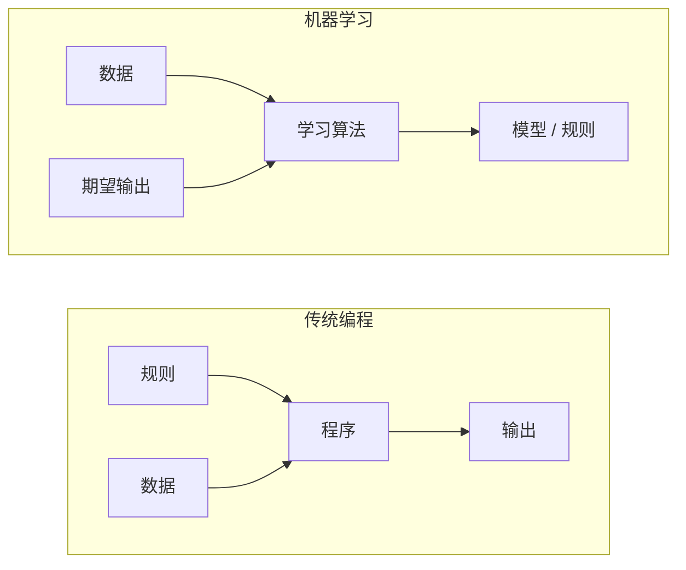
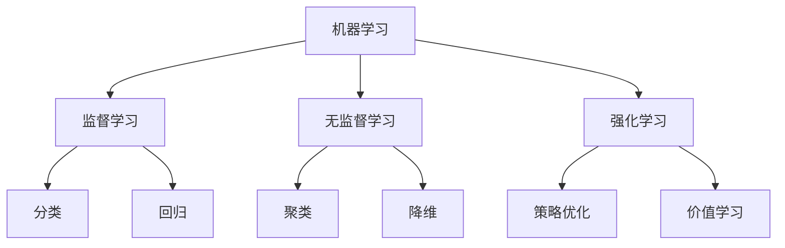
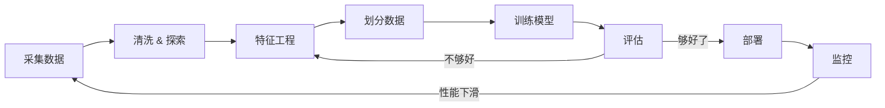
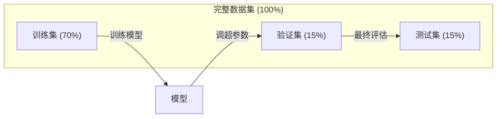
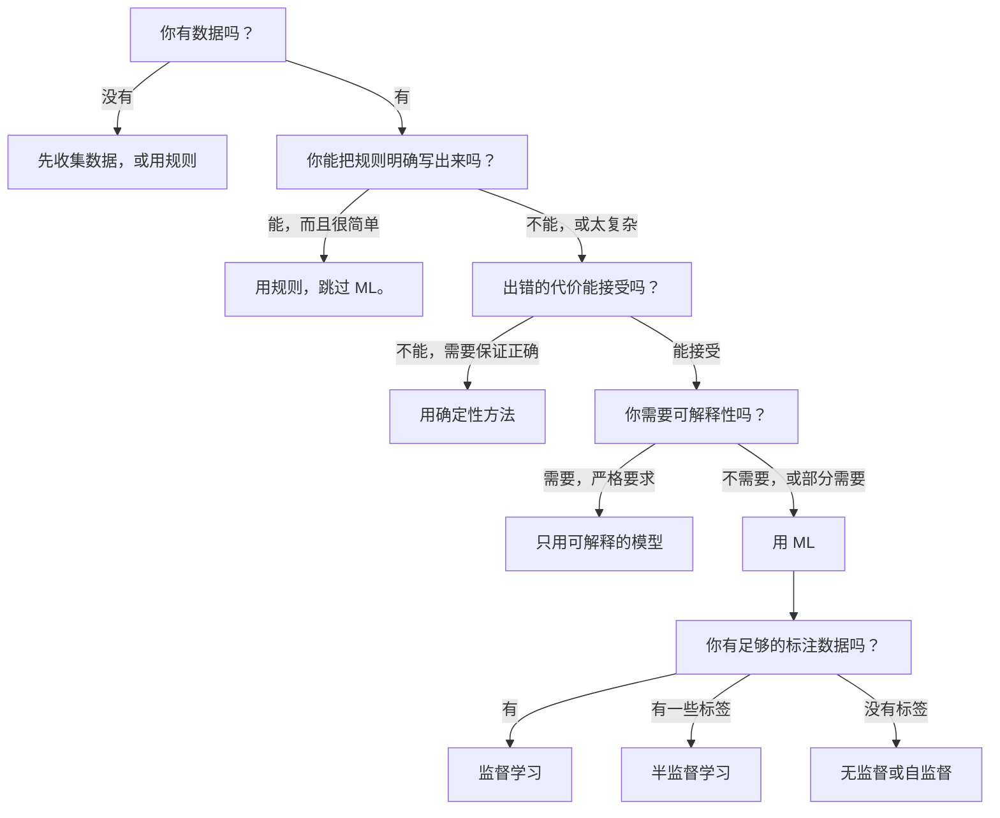

# 什么是机器学习

> 机器学习是教会计算机从数据里找规律，而不是靠手写规则。

**类型：** Learn
**语言：** Python
**前置要求：** 阶段 1（数学基础）
**预计时间：** ~45 分钟

## 学习目标

- 说清监督学习、无监督学习和强化学习的区别，并判断某个问题属于哪一类
- 从零实现一个最近质心分类器，并和随机基线对比评估
- 区分分类任务和回归任务，为各自挑选合适的损失函数
- 判断一个业务问题到底适合用 ML，还是用确定性规则解决更好

## 问题所在

你想做一个垃圾邮件过滤器。传统做法是：坐下来写几百条规则。"邮件里出现 'FREE MONEY' 就标垃圾。超过 3 个感叹号就标垃圾。"你花几周写规则。然后垃圾邮件发送者换了说法，你的规则失效。你再写更多规则。这个循环永远停不下来。

机器学习把这件事反过来。你不写规则，而是给计算机几千封标好的邮件（"垃圾"或"非垃圾"），让它自己琢磨出规则。计算机找出的规律是你压根想不到的。当垃圾邮件发送者改变套路时，你用新数据重新训练，而不是改代码。

从"编写规则"到"从数据学习"的这一转变，正是机器学习的核心。每一个推荐引擎、语音助手、自动驾驶汽车和语言模型，都是这么工作的。

## 核心概念

### 从数据学习，而非从规则

传统编程和机器学习解决问题的方向正好相反。



传统编程：你写规则，程序把规则应用到数据上产生输出。

机器学习：你提供数据和期望输出，算法去发现规则。

训练得到的"模型"本身就是规则，只不过编码成了数字（权重、参数）。它从见过的样本中归纳出规律，对从没见过的数据做预测。

### 机器学习的三大类型



**监督学习**：你有输入-输出对，模型学习把输入映射到输出。
- "这是 10000 张标了猫或狗的照片，学会分辨它们。"
- "这是房屋特征和价格，学会预测价格。"

**无监督学习**：你只有输入，没有标签，模型自己找结构。
- "这是 10000 条客户购买记录，找出天然的分组。"
- "这是 1000 维的数据点，在保留结构的同时降到 2 维。"

**强化学习**：一个 agent 在环境里采取行动，获得奖励或惩罚。它学习一套策略（policy），让总奖励最大化。
- "玩这个游戏。赢 +1，输 -1。自己琢磨策略。"
- "控制这只机械臂。抓起物体 +1，每浪费一秒 -0.01。"

你在实践中构建的大部分东西用的是监督学习。无监督学习常用于预处理和探索。强化学习驱动着游戏 AI、机器人，以及语言模型的 RLHF。

### 三大类之外

上面这三类划分得很干净，但现实中的 ML 常常把界限搞模糊。

**半监督学习**用一小批有标签数据加一大批无标签数据。你可能有 100 张标好的医学影像和 100000 张没标的。常见技术包括：

- **标签传播：** 建一张图把相似的数据点连起来。标签从有标签的节点沿着图扩散到无标签的邻居。
- **伪标签：** 先在有标签数据上训一个模型，用它给无标签数据预测标签，再用全部数据重新训练。模型自举出自己的训练集。
- **一致性正则化：** 对于一个输入和它的轻微扰动版本，模型应该给出相同的预测。这一招连标签都不需要。

**自监督学习**从数据自身造出监督信号，完全不需要人工标注。模型从数据的结构里给自己造出一个预测任务。

- **掩码语言建模（BERT）：** 遮住句子里 15% 的词，训练模型预测被遮住的词。"标签"来自原始文本。
- **对比学习（SimCLR）：** 拿一张图，做出两个增强版本。训练模型识别它们来自同一张图，同时把它们和其他图的增强版本区分开。
- **下一个 token 预测（GPT）：** 给定前面所有词，预测下一个词。每篇文本都变成一个训练样本。

这些并不是和三大类并列的独立类别，而是把监督和无监督思路结合起来的策略。自监督学习严格说是监督学习（模型在预测某个东西），但标签是自动生成的，不是人标的。

### 分类 vs 回归

这是监督学习的两大主要任务。

| 维度 | 分类 | 回归 |
|--------|---------------|------------|
| 输出 | 离散类别 | 连续数值 |
| 例子 | "这封邮件是垃圾吗？" | "房价会是多少？" |
| 输出空间 | {猫, 狗, 鸟} | 任意实数 |
| 损失函数 | 交叉熵、准确率 | 均方误差、MAE |
| 决策 | 类别之间的边界 | 一条拟合数据的曲线 |

分类回答"哪一类？"回归回答"多少？"

有些问题两种框法都行。预测股票涨还是跌是分类，预测具体价格是回归。

### ML 工作流

不管用什么算法，每个机器学习项目都走同一套流程。



**采集数据**：收集原始数据。数据多几乎总是更好，但质量比数量更重要。

**清洗 & 探索**：处理缺失值、去重、可视化分布、发现异常。这一步常常吃掉整个项目 60-80% 的时间。

**特征工程**：把原始数据变成模型能用的特征。把日期变成星期几，把数值列归一化，把类别变量编码。好特征比花哨算法更重要。

**划分数据**：分成训练集、验证集和测试集。模型在训练数据上训练，你在验证数据上调超参数，最后在测试数据上报告最终性能。

**训练模型**：把训练数据喂给算法。算法调整内部参数，让损失函数最小。

**评估**：在验证/测试数据上衡量性能。如果性能不达标，就回头换特征、换算法或换超参数。

**部署**：把模型放到生产环境，对新数据做预测。

**监控**：长期跟踪性能。数据分布会变（数据漂移），模型会退化。性能下滑时就重新训练。

### 训练集、验证集和测试集

这是新手最容易搞错的概念。你必须在模型训练时从没见过的数据上评估它，否则你衡量的是死记硬背，而不是学习。



| 划分 | 用途 | 何时使用 | 典型占比 |
|-------|---------|-----------|-------------|
| 训练集 | 模型从这部分数据学习 | 训练期间 | 60-80% |
| 验证集 | 调超参数、比较模型 | 每次训练后 | 10-20% |
| 测试集 | 最终的无偏性能估计 | 仅在最后用一次 | 10-20% |

测试集是神圣的，你只看它一次。如果你不停地根据测试性能去调模型，那等于在测试集上训练，你报告的数字就毫无意义。

对于小数据集，用 k 折交叉验证：把数据分成 k 份，在 k-1 份上训练，在剩下那份上验证，轮换，再把结果平均。

### 过拟合 vs 欠拟合


**欠拟合**：模型太简单，抓不住数据里的规律。比如用一条直线去拟合弯曲的关系。训练误差高，测试误差也高。

**过拟合**：模型太复杂，把训练数据连同噪声一起背了下来。比如一条扭来扭去的曲线穿过每一个训练点，却在新数据上崩盘。训练误差低，测试误差高。

**拟合恰当**：模型抓住了真实规律，又没把噪声背下来。训练误差和测试误差都相当低。

过拟合的信号：
- 训练准确率远高于验证准确率
- 模型在训练数据上表现很好，在新数据上很差
- 加更多训练数据能提升性能（说明模型之前是在背，不是在学）

过拟合的解法：
- 拿更多训练数据
- 降低模型复杂度（更少参数、更简单的架构）
- 正则化（给大权重加惩罚）
- Dropout（训练时随机把神经元置零）
- 提前停止（验证误差开始上升时就停训）

欠拟合的解法：
- 用更复杂的模型
- 加更多特征
- 减少正则化
- 训练更久

### 偏差-方差权衡

这是过拟合和欠拟合背后的数学框架。

**偏差**：模型假设错误带来的误差。当真实关系是非线性时，线性模型就有高偏差。高偏差导致欠拟合。

**方差**：模型对训练数据小幅波动过于敏感带来的误差。高方差的模型在不同数据子集上训练时，给出的预测差异很大。高方差导致过拟合。

| 模型复杂度 | 偏差 | 方差 | 结果 |
|-----------------|------|----------|--------|
| 太低（用线性模型拟合弯曲数据） | 高 | 低 | 欠拟合 |
| 恰到好处 | 中 | 中 | 泛化良好 |
| 太高（用 20 次多项式拟合 10 个点） | 低 | 高 | 过拟合 |

总误差 = 偏差^2 + 方差 + 不可约噪声

不可约噪声你没法减少（它是数据本身的随机性）。你要找的是让 偏差^2 + 方差 最小的那个甜点位。

### 没有免费午餐定理

没有哪个算法对所有问题都最好。在某一类问题上表现好的算法，在另一类上会表现差。这就是为什么数据科学家会试多个算法再对比结果。

实践中，选择取决于：
- 你有多少数据
- 有多少特征
- 关系是线性还是非线性
- 你是否需要可解释性
- 你能负担多少算力

### 什么时候不该用机器学习

ML 很强大，但并不总是对的工具。在动手用模型之前，先问问你是不是真的需要它。

**不该用 ML 的情形：**

- **规则简单且定义明确。** 报税计算、排序算法、单位换算。如果逻辑几个 if 语句就能写完，上模型只是徒增复杂度、毫无收益。
- **你没有数据，或数据极少。** ML 需要样本来学习。只有 10 个数据点，你训不出任何有意义的东西。先去收集数据。
- **出错代价是灾难性的，而你需要保证正确。** 医疗剂量计算、核反应堆控制、密码学验证。ML 模型是概率性的，它有时会错。如果"有时会错"不可接受，就用确定性方法。
- **查表或启发式就能解决问题。** 如果一个简单阈值或表格能覆盖 99% 的情况，上 ML 只会增加维护成本，却没有实质改进。
- **你无法解释决策，而又必须可解释。** 受监管的行业（信贷、保险、刑事司法）有时要求每个决策都能完全解释。有些 ML 模型是可解释的（线性回归、小决策树），大多数不是。
- **问题变化得比你能重新训练的速度还快。** 如果规则每天都在变，而重新训练要一周，那模型永远是过时的。

用这张决策流程图：



## 动手构建

`code/ml_intro.py` 里的代码从零实现了一个最近质心分类器，这是最简单的 ML 算法。它演示了核心思想：从数据学习，再对新数据预测。

### 第 1 步：从零实现最近质心分类器

最近质心分类器计算训练数据里每个类的中心（均值）。预测时，它把每个新点分给中心离它最近的那个类。

```python
class NearestCentroid:
    def fit(self, X, y):
        self.classes = np.unique(y)
        self.centroids = np.array([
            X[y == c].mean(axis=0) for c in self.classes
        ])

    def predict(self, X):
        distances = np.array([
            np.sqrt(((X - c) ** 2).sum(axis=1))
            for c in self.centroids
        ])
        return self.classes[distances.argmin(axis=0)]
```

整个算法就这么多。fit 算两个均值，predict 算距离。没有梯度下降，没有迭代，没有超参数。

### 第 2 步：在合成数据上训练

我们生成一个二维分类数据集，两个类略有重叠。质心分类器在两个类中心之间画出一条线性决策边界。

```python
rng = np.random.RandomState(42)
X_class0 = rng.randn(100, 2) + np.array([1.0, 1.0])
X_class1 = rng.randn(100, 2) + np.array([-1.0, -1.0])
X = np.vstack([X_class0, X_class1])
y = np.array([0] * 100 + [1] * 100)
```

### 第 3 步：和基线对比

每个 ML 模型都应该和一个平凡的基线对比。这里的基线随机预测一个类。如果你的 ML 模型连随机猜都赢不了，那肯定有问题。

```python
baseline_preds = rng.choice([0, 1], size=len(y_test))
baseline_acc = np.mean(baseline_preds == y_test)
```

在这个干净的数据集上，质心分类器应该能拿到 90%+ 的准确率。随机基线大约 50%。

### 为什么这很重要

最近质心分类器简单到不能再简单。它没有超参数、没有迭代、没有梯度下降。但它抓住了 ML 的根本模式：

1. 从训练数据**学习**一个表示（质心）
2. 用这个表示对新数据**预测**（最近距离）
3. 和基线**评估**对比（随机猜）

从逻辑回归到 transformer，每个 ML 算法都遵循这同样的三步模式。表示会越来越复杂，但工作流不变。

### 第 4 步：质心分类器做不到什么

最近质心分类器假设每个类是一团。它画的是线性决策边界。它在以下情况会失败：

- 类有多个簇（比如数字 "1" 可以有好几种写法）
- 决策边界是非线性的（比如一个类绕着另一个类）
- 特征尺度差异很大（距离会被尺度最大的那个特征主导）

这些局限正是你将要学的每个其他算法的动机。K 近邻能处理多个簇。决策树能处理非线性边界。特征缩放解决尺度问题。每一节课都建立在前一节的局限之上。

## 上手使用

sklearn 提供了 `NearestCentroid` 和合成数据生成器：

```python
from sklearn.neighbors import NearestCentroid
from sklearn.datasets import make_classification
from sklearn.model_selection import train_test_split

X, y = make_classification(
    n_samples=500, n_features=2, n_redundant=0,
    n_clusters_per_class=1, random_state=42
)
X_train, X_test, y_train, y_test = train_test_split(X, y, test_size=0.3)

clf = NearestCentroid()
clf.fit(X_train, y_train)
print(f"Accuracy: {clf.score(X_test, y_test):.3f}")
```

## 交付

本节课产出 `outputs/prompt-ml-problem-framer.md` —— 一个把模糊业务问题变成具体 ML 任务的提示词。给它一段问题描述（"我们想降低流失率"或"预测下季度需求"），它会识别学习类型、定义预测目标、列出候选特征、挑选成功指标、确立基线，并标出数据泄漏或类别不平衡这类坑。在任何 ML 项目开头用它，能避免你造错东西。

## 关键术语

| 术语 | 大家怎么说 | 它实际是什么 |
|------|----------------|----------------------|
| 模型 | "那个 AI" | 一个带可学习参数的数学函数，把输入映射到输出 |
| 训练 | "教 AI" | 运行优化算法调整模型参数，让预测匹配已知输出 |
| 特征 | "一个输入列" | 数据的一个可测量属性，模型用它来做预测 |
| 标签 | "答案" | 训练样本的已知输出，用来算误差信号 |
| 超参数 | "你拧的一个设置" | 训练前设定、控制学习过程的参数（学习率、层数） |
| 损失函数 | "模型错得多离谱" | 衡量预测和真实输出之间差距的函数，训练就是去最小化它 |
| 过拟合 | "它把测试题背下来了" | 模型学到的是训练数据特有的噪声而非通用规律，所以在新数据上失败 |
| 欠拟合 | "它啥也没学到" | 模型太简单，抓不住数据里真正的规律 |
| 泛化 | "它在新数据上也好使" | 模型在没训练过的数据上做出准确预测的能力 |
| 交叉验证 | "在不同块上测试" | 反复把数据切成训练/测试折并平均结果，得到更稳健的性能估计 |
| 正则化 | "让权重保持小" | 给损失函数加一个惩罚项，抑制过于复杂的模型 |
| 数据漂移 | "世界变了" | 进来的数据的统计分布随时间偏移，导致模型性能退化 |

## 练习

1. 拿任意一个数据集（比如 Iris、Titanic），按 70/15/15 切成训练/验证/测试。解释为什么不能在测试集上调超参数。
2. 列出三个现实问题。对每一个，判断它是分类、回归还是聚类，以及它是监督还是无监督。
3. 一个模型在训练数据上拿到 99% 准确率，但在测试数据上只有 60%。诊断问题，并列出三件你会尝试去修它的事。

## 延伸阅读

- [An Introduction to Statistical Learning](https://www.statlearning.com/) - 免费教材，涵盖所有经典 ML 方法并配有实战示例
- [Google's Machine Learning Crash Course](https://developers.google.com/machine-learning/crash-course) - 简洁的可视化 ML 概念入门
- [Scikit-learn User Guide](https://scikit-learn.org/stable/user_guide.html) - 用 Python 实现 ML 的实用参考
