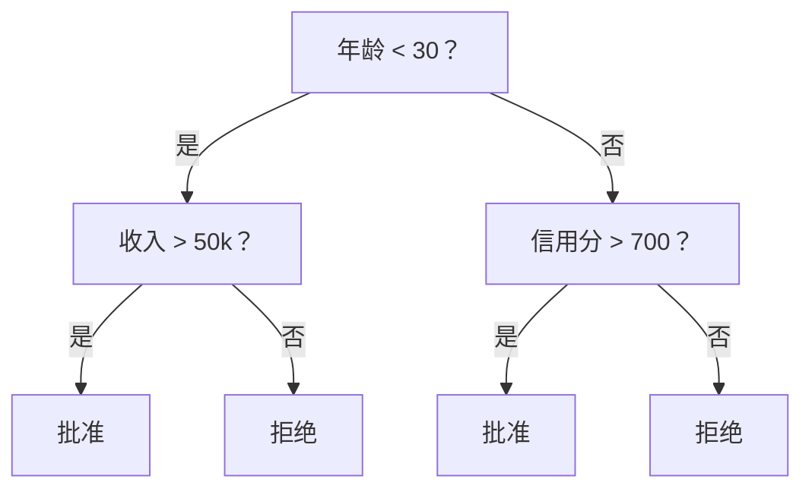
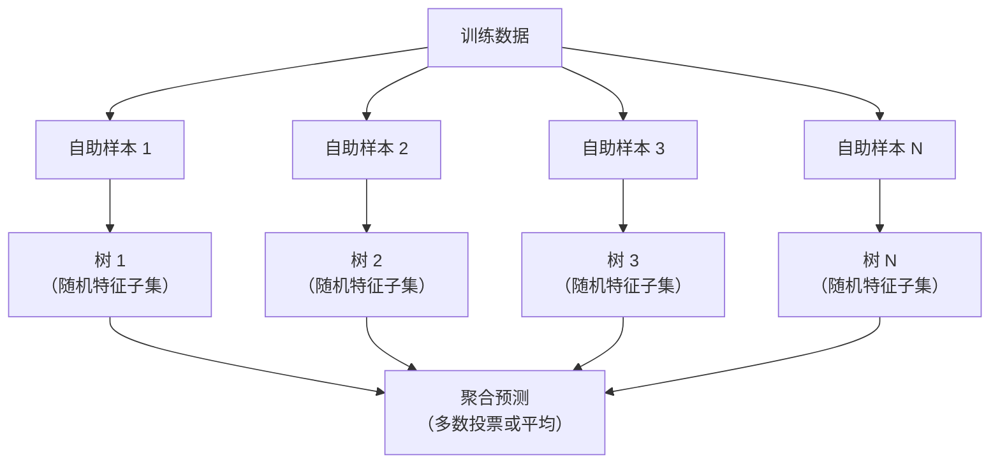

# 决策树与随机森林

> 决策树不过是一张流程图。但一片由它们组成的森林，是 ML 里最强大的工具之一。

**类型：** Build
**语言：** Python
**前置要求：** 阶段 1（第 09 课信息论、第 06 课概率）
**预计时间：** ~90 分钟

## 学习目标

- 实现 Gini 不纯度、熵和信息增益的计算，来找出决策树的最优分裂
- 从零构建一个带预剪枝控制（最大深度、最小样本数）的决策树分类器
- 用自助采样和特征随机化构造一个随机森林，并解释它为什么能降低方差
- 对比 MDI 特征重要性和置换重要性，识别 MDI 何时会有偏

## 问题所在

你有一批表格数据。行是样本，列是特征，还有一个你想预测的目标列。你可以拿神经网络往上招呼。但对表格数据，基于树的模型（决策树、随机森林、梯度提升树）一贯比深度学习更强。结构化数据的 Kaggle 比赛被 XGBoost 和 LightGBM 统治，而不是 transformer。

为什么？树能处理混合的特征类型（数值和类别），不用预处理。它能处理非线性关系，不用做特征工程。它可解释：你能看着这棵树，准确看出某个预测是怎么来的。而随机森林对许多树取平均，在中等规模数据集上极其抗过拟合。

本节课用递归分裂从零构建决策树，再在它之上搭一个随机森林。你会实现分裂准则背后的数学（Gini 不纯度、熵、信息增益），并理解为什么一群弱学习器能变成一个强学习器。

## 核心概念

### 决策树做什么

决策树通过问一连串是/否问题，把特征空间切成一块块矩形区域。



每个内部节点拿一个特征和一个阈值做比较。每个叶子节点做出一个预测。要给一个新数据点分类，你从根节点出发，顺着分支走，直到到达一个叶子。

树是自顶向下构建的：在每个节点，挑选最能把数据分开的特征和阈值。"最能"由一个分裂准则定义。

### 分裂准则：衡量不纯度

在每个节点，我们有一组样本。我们想这样分裂它们：让得到的子节点尽可能"纯"，也就是每个子节点里大部分都是同一个类。

**Gini 不纯度**衡量的是：如果按照该节点的类别分布给一个随机样本打标签，它被错分的概率。

```
Gini(S) = 1 - sum(p_k^2)

其中 p_k 是集合 S 中类别 k 的占比。
```

对于纯节点（全是一个类），Gini = 0。对于 50/50 的二分裂，Gini = 0.5。越低越好。

```
例子：6 只猫，4 只狗

Gini = 1 - (0.6^2 + 0.4^2) = 1 - (0.36 + 0.16) = 0.48
```

**熵**衡量节点里的信息量（混乱度）。已在阶段 1 第 09 课讲过。

```
Entropy(S) = -sum(p_k * log2(p_k))
```

对于纯节点，熵 = 0。对于 50/50 的二分裂，熵 = 1.0。越低越好。

```
例子：6 只猫，4 只狗

Entropy = -(0.6 * log2(0.6) + 0.4 * log2(0.4))
        = -(0.6 * -0.737 + 0.4 * -1.322)
        = 0.442 + 0.529
        = 0.971 bits
```

**信息增益**是分裂后不纯度（熵或 Gini）的减少量。

```
IG(S, feature, threshold) = Impurity(S) - weighted_avg(Impurity(S_left), Impurity(S_right))

其中权重是各子节点的样本占比。
```

每个节点上的贪心算法：试遍每个特征和每个可能的阈值。挑出让信息增益最大的那对（特征，阈值）。

### 分裂是怎么进行的

对于当前节点上有 n 个特征、m 个样本的数据集：

1. 对每个特征 j（j = 1 到 n）：
   - 按特征 j 给样本排序
   - 把每对相邻不同值的中点当阈值试一遍
   - 为每个阈值计算信息增益
2. 选出信息增益最高的特征和阈值
3. 把数据分成左（feature <= threshold）和右（feature > threshold）
4. 在每个子节点上递归

这种贪心做法不保证得到全局最优的树。找到最优树是 NP 难的。但贪心分裂在实践中很好用。

### 停止条件

没有停止条件，树会一直长到每个叶子都纯（每叶一个样本）。这会完美背下训练数据，泛化能力却糟透了。

**预剪枝**在树长满之前就停下：
- 最大深度：树到达设定深度就停止分裂
- 每叶最小样本数：节点样本少于 k 个就停
- 最小信息增益：最佳分裂带来的不纯度改善低于阈值就停
- 最大叶子节点数：限制叶子总数

**后剪枝**先长出完整的树，再往回修：
- 代价复杂度剪枝（scikit-learn 用的）：加一个和叶子数成正比的惩罚。加大惩罚就得到更小的树
- 减错剪枝：如果去掉某棵子树验证误差不上升，就去掉它

预剪枝更简单更快。后剪枝常常产出更好的树，因为它不会过早停掉那些可能引出有用后续分裂的分裂。

### 用决策树做回归

做回归时，叶子的预测是该叶子里目标值的均值。分裂准则也变了：

**方差减少**取代信息增益：

```
VR(S, feature, threshold) = Var(S) - weighted_avg(Var(S_left), Var(S_right))
```

挑选最能减少方差的分裂。树把输入空间切成一块块区域，在每块区域里预测一个常数（均值）。

### 随机森林：集成的力量

单棵决策树是高方差的。数据里的小变化能产生完全不同的树。随机森林通过对许多树取平均来解决这个问题。



两个随机性来源让这些树变得多样：

**Bagging（自助聚合）：** 每棵树在一个自助样本上训练，也就是从训练数据里有放回随机采样得到的样本。每个自助样本里大约出现原始样本的 63%（其余是袋外样本，可以用来验证）。

**特征随机化：** 在每次分裂时，只考虑一个随机的特征子集。分类的默认值是 sqrt(n_features)，回归是 n_features/3。这能防止所有树都在同一个主导特征上分裂。

关键洞察：对许多去相关的树取平均，能降低方差而不增加偏差。单棵树可能平庸，但集成是强的。

### 特征重要性

随机森林天然提供特征重要性分数。最常见的方法：

**平均不纯度减少（MDI）：** 对每个特征，把它在所有树、所有用到它的节点上带来的总不纯度减少加起来。在更靠前的分裂上带来更大不纯度减少的特征更重要。

```
importance(feature_j) = sum over all nodes where feature_j is used:
    (n_samples_at_node / n_total_samples) * impurity_decrease
```

这个方法快（训练时顺带算出），但偏向高基数特征和有很多可能分裂点的特征。

**置换重要性**是另一种办法：打乱某个特征的取值，看模型准确率掉了多少。更可靠，但更慢。

### 树什么时候赢过神经网络

在表格数据上，树和森林碾压神经网络。原因有几条：

| 因素 | 树 | 神经网络 |
|--------|-------|----------------|
| 混合类型（数值 + 类别） | 原生支持 | 需要编码 |
| 小数据集（< 1 万行） | 表现好 | 过拟合 |
| 特征交互 | 靠分裂发现 | 需要设计架构 |
| 可解释性 | 完全透明 | 黑盒 |
| 训练时间 | 几分钟 | 几小时 |
| 对超参数的敏感度 | 低 | 高 |

当数据有空间或序列结构（图像、文本、音频）时，神经网络才赢。对于平铺的特征表格，树是默认选择。

## 动手构建

### 第 1 步：Gini 不纯度和熵

从零构建两个分裂准则，并验证它们对"哪些分裂好"的判断一致。

```python
import math

def gini_impurity(labels):
    n = len(labels)
    if n == 0:
        return 0.0
    counts = {}
    for label in labels:
        counts[label] = counts.get(label, 0) + 1
    return 1.0 - sum((c / n) ** 2 for c in counts.values())

def entropy(labels):
    n = len(labels)
    if n == 0:
        return 0.0
    counts = {}
    for label in labels:
        counts[label] = counts.get(label, 0) + 1
    return -sum(
        (c / n) * math.log2(c / n) for c in counts.values() if c > 0
    )
```

### 第 2 步：找出最佳分裂

试遍每个特征和每个阈值。返回信息增益最高的那一个。

```python
def information_gain(parent_labels, left_labels, right_labels, criterion="gini"):
    measure = gini_impurity if criterion == "gini" else entropy
    n = len(parent_labels)
    n_left = len(left_labels)
    n_right = len(right_labels)
    if n_left == 0 or n_right == 0:
        return 0.0
    parent_impurity = measure(parent_labels)
    child_impurity = (
        (n_left / n) * measure(left_labels) +
        (n_right / n) * measure(right_labels)
    )
    return parent_impurity - child_impurity
```

### 第 3 步：构建 DecisionTree 类

递归分裂、预测和特征重要性跟踪。

```python
class DecisionTree:
    def __init__(self, max_depth=None, min_samples_split=2,
                 min_samples_leaf=1, criterion="gini",
                 max_features=None):
        self.max_depth = max_depth
        self.min_samples_split = min_samples_split
        self.min_samples_leaf = min_samples_leaf
        self.criterion = criterion
        self.max_features = max_features
        self.tree = None
        self.feature_importances_ = None

    def fit(self, X, y):
        self.n_features = len(X[0])
        self.feature_importances_ = [0.0] * self.n_features
        self.n_samples = len(X)
        self.tree = self._build(X, y, depth=0)
        total = sum(self.feature_importances_)
        if total > 0:
            self.feature_importances_ = [
                fi / total for fi in self.feature_importances_
            ]

    def predict(self, X):
        return [self._predict_one(x, self.tree) for x in X]
```

### 第 4 步：构建 RandomForest 类

自助采样、特征随机化和多数投票。

```python
class RandomForest:
    def __init__(self, n_trees=100, max_depth=None,
                 min_samples_split=2, max_features="sqrt",
                 criterion="gini"):
        self.n_trees = n_trees
        self.max_depth = max_depth
        self.min_samples_split = min_samples_split
        self.max_features = max_features
        self.criterion = criterion
        self.trees = []

    def fit(self, X, y):
        n = len(X)
        for _ in range(self.n_trees):
            indices = [random.randint(0, n - 1) for _ in range(n)]
            X_boot = [X[i] for i in indices]
            y_boot = [y[i] for i in indices]
            tree = DecisionTree(
                max_depth=self.max_depth,
                min_samples_split=self.min_samples_split,
                max_features=self.max_features,
                criterion=self.criterion,
            )
            tree.fit(X_boot, y_boot)
            self.trees.append(tree)

    def predict(self, X):
        all_preds = [tree.predict(X) for tree in self.trees]
        predictions = []
        for i in range(len(X)):
            votes = {}
            for preds in all_preds:
                v = preds[i]
                votes[v] = votes.get(v, 0) + 1
            predictions.append(max(votes, key=votes.get))
        return predictions
```

完整实现连同所有辅助方法见 `code/trees.py`。

## 上手使用

用 scikit-learn，训练一个随机森林只要三行：

```python
from sklearn.ensemble import RandomForestClassifier
from sklearn.datasets import load_iris
from sklearn.model_selection import train_test_split

X, y = load_iris(return_X_y=True)
X_train, X_test, y_train, y_test = train_test_split(X, y, random_state=42)

rf = RandomForestClassifier(n_estimators=100, random_state=42)
rf.fit(X_train, y_train)
print(f"Accuracy: {rf.score(X_test, y_test):.4f}")
print(f"Feature importances: {rf.feature_importances_}")
```

实践中，梯度提升树（XGBoost、LightGBM、CatBoost）往往比随机森林更强，因为它们顺序地建树，每棵树纠正前面树的错误。但随机森林更不容易配错，几乎不需要调超参数。

## 交付

本节课产出 `outputs/prompt-tree-interpreter.md` —— 一个为业务相关方解读决策树分裂的提示词。喂给它一棵训练好的树的结构（深度、特征、分裂阈值、准确率），它会把模型翻译成大白话规则、给特征重要性排序、标出过拟合或泄漏，并推荐下一步。任何时候你需要向不读代码的人解释一个树模型，都用它。

## 练习

1. 在一个有 3 个类的二维数据集上训练单棵决策树。手动追踪分裂，画出矩形决策边界。对比 max_depth=2 和 max_depth=10 时的边界。

2. 为回归树实现方差减少分裂。为 200 个点生成 y = sin(x) + 噪声，拟合你的回归树。把树的分段常数预测和真实曲线画在一起对比。

3. 构建 1、5、10、50 和 200 棵树的随机森林。把训练准确率和测试准确率随树数量的变化画出来。观察到测试准确率会到平台期但不会下降（森林抗过拟合）。

4. 在 5 个不同数据集上对比用 Gini 不纯度和熵作为分裂准则。测量准确率和树深度。大多数情况下它们产出几乎相同的结果。解释为什么。

5. 实现置换重要性。在一个特征是随机噪声但基数很高的数据集上，把它和 MDI 重要性对比。MDI 会把噪声特征排得很高，置换重要性不会。

## 关键术语

| 术语 | 大家怎么说 | 它实际是什么 |
|------|----------------|----------------------|
| 决策树 | "做预测的流程图" | 通过学习一连串 if/else 分裂，把特征空间切成矩形区域的模型 |
| Gini 不纯度 | "节点有多混" | 在节点上错分一个随机样本的概率。0 = 纯，二分类时 0.5 = 最大不纯 |
| 熵 | "节点里的混乱度" | 节点上的信息量。0 = 纯，二分类时 1.0 = 最大不确定。来自信息论 |
| 信息增益 | "一个分裂有多好" | 分裂后不纯度的减少。选择分裂的贪心准则 |
| 预剪枝 | "提前停掉树" | 通过设最大深度、最小样本数或最小增益阈值提前停止树的生长 |
| 后剪枝 | "事后修剪树" | 先长满整棵树，再去掉那些无助于验证性能的子树 |
| Bagging | "在随机子集上训练" | 自助聚合。每个模型在一个不同的有放回随机样本上训练 |
| 随机森林 | "一堆树" | 决策树的集成，每棵树在一个自助样本上训练，且每次分裂用随机特征子集 |
| 特征重要性（MDI） | "哪些特征重要" | 每个特征贡献的总不纯度减少，跨所有树和节点求和 |
| 置换重要性 | "打乱看看" | 一个特征的取值被随机打乱时准确率的下降。对噪声特征比 MDI 更可靠 |
| 方差减少 | "信息增益的回归版" | 信息增益在回归树里的对应物。挑选最能减少目标方差的分裂 |
| 自助样本 | "可重复的随机采样" | 从原始数据集有放回抽取的随机样本。大小相同，但有重复 |

## 延伸阅读

- [Breiman: Random Forests (2001)](https://link.springer.com/article/10.1023/A:1010933404324) - 随机森林的原始论文
- [Grinsztajn et al.: Why do tree-based models still outperform deep learning on tabular data? (2022)](https://arxiv.org/abs/2207.08815) - 在表格任务上对树和神经网络的严谨对比
- [scikit-learn Decision Trees documentation](https://scikit-learn.org/stable/modules/tree.html) - 带可视化工具的实用指南
- [XGBoost: A Scalable Tree Boosting System (Chen & Guestrin, 2016)](https://arxiv.org/abs/1603.02754) - 统治 Kaggle 的梯度提升论文
