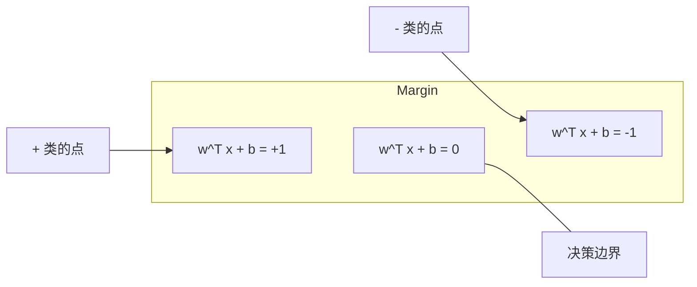
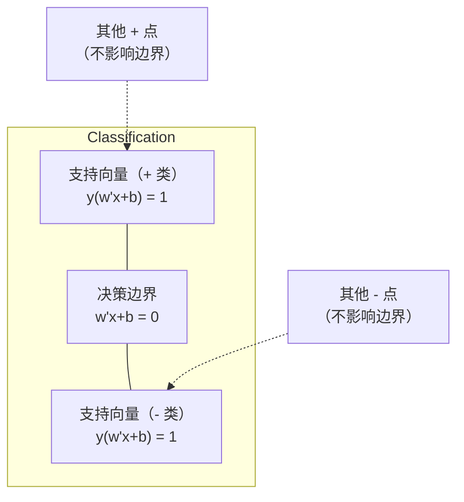
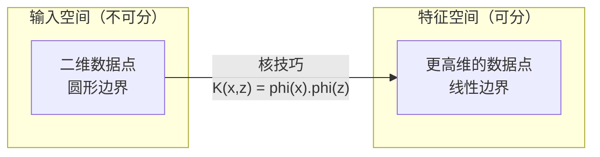

# 支持向量机

> 在两个类之间找出最宽的那条街。这就是全部思想。

**类型：** Build
**语言：** Python
**前置要求：** 阶段 1（第 08 课优化、第 14 课范数与距离、第 18 课凸优化）
**预计时间：** ~90 分钟

## 学习目标

- 用 hinge loss 在原始形式上做梯度下降，从零实现一个线性 SVM
- 解释最大间隔原则，并从训练好的模型里识别支持向量
- 对比线性、多项式和 RBF 核，解释核技巧如何避免显式的高维映射
- 评估 C 参数在间隔宽度和分类错误之间所控制的权衡

## 问题所在

你有两类数据点，需要画一条线（或超平面）把它们分开。可行的线有无穷多条。你该挑哪一条？

挑间隔最大的那条。间隔是决策边界到两侧最近数据点的距离。间隔越宽，分类器越自信，对未见数据的泛化也越好。

这个直觉引出了支持向量机，ML 里数学最优雅的算法之一。在深度学习之前，SVM 是占主导地位的分类方法，至今仍是小数据集、高维数据，以及那些你需要一个有理论保证、原理清晰、被研究透彻的模型的问题上的最佳选择。

SVM 直接对接阶段 1：优化是凸的（第 18 课），间隔用范数衡量（第 14 课），而核技巧利用点积来处理非线性边界，全程不在高维空间里做任何计算。

## 核心概念

### 最大间隔分类器

给定线性可分的数据，标签 y_i 属于 {-1, +1}，特征向量为 x_i，我们想要一个超平面 w^T x + b = 0 把两类分开。

点 x_i 到超平面的距离是：

```
distance = |w^T x_i + b| / ||w||
```

对于正确分类的点：y_i * (w^T x_i + b) > 0。间隔是超平面到任一侧最近点距离的两倍。



优化问题：

```
maximize    2 / ||w||     (间隔宽度)
subject to  y_i * (w^T x_i + b) >= 1  for all i
```

等价地（最小化 ||w||^2 更好优化）：

```
minimize    (1/2) ||w||^2
subject to  y_i * (w^T x_i + b) >= 1  for all i
```

这是一个凸二次规划，有唯一的全局解。恰好落在间隔边界上（即 y_i * (w^T x_i + b) = 1）的数据点就是支持向量。它们是唯一决定决策边界的点。移动或删掉任何一个非支持向量的点，边界都不变。

### 支持向量：关键的少数



大多数训练点都无关紧要，只有支持向量重要。这就是为什么 SVM 在预测时省内存：你只需存支持向量，不用存整个训练集。

支持向量的数量也给出了泛化误差的一个界。支持向量相对数据集规模越少，泛化越好。

### 软间隔：用 C 参数处理噪声

真实数据很少是完美可分的。有些点可能落在边界错误的一侧，或者落在间隔内部。软间隔形式通过引入松弛变量来允许违规。

```
minimize    (1/2) ||w||^2 + C * sum(xi_i)
subject to  y_i * (w^T x_i + b) >= 1 - xi_i
            xi_i >= 0  for all i
```

松弛变量 xi_i 衡量点 i 违反间隔的程度。C 控制权衡：

| C 取值 | 行为 |
|---------|----------|
| C 大 | 重罚违规。窄间隔，更少误分类。过拟合 |
| C 小 | 允许更多违规。宽间隔，更多误分类。欠拟合 |

C 是正则化强度的倒数。C 大 = 正则化弱。C 小 = 正则化强。

### Hinge loss：SVM 的损失函数

软间隔 SVM 可以重写成一个无约束优化：

```
minimize    (1/2) ||w||^2 + C * sum(max(0, 1 - y_i * (w^T x_i + b)))
```

项 max(0, 1 - y_i * f(x_i)) 就是 hinge loss。当点被正确分类且在间隔之外时它为零。当点落在间隔内或被误分类时它是线性的。

```
单个点的 hinge loss：

loss
  |
  | \
  |  \
  |   \
  |    \
  |     \_______________
  |
  +-----|-----|-------->  y * f(x)
       0     1

y*f(x) >= 1 时（正确分类、间隔之外）损失为零。
y*f(x) < 1 时线性惩罚。
```

和 logistic loss（逻辑回归）对比：

```
Hinge:     max(0, 1 - y*f(x))          在间隔处硬截断
Logistic:  log(1 + exp(-y*f(x)))        平滑，永不恰好为零
```

hinge loss 产生稀疏解（只有支持向量有非零贡献）。logistic loss 用到所有数据点。这让 SVM 在预测时更省内存。

### 用梯度下降训练线性 SVM

你可以在 hinge loss 加 L2 正则化上做梯度下降来训练线性 SVM，不用去解带约束的 QP：

```
L(w, b) = (lambda/2) * ||w||^2 + (1/n) * sum(max(0, 1 - y_i * (w^T x_i + b)))

关于 w 的梯度：
  若 y_i * (w^T x_i + b) >= 1:  dL/dw = lambda * w
  若 y_i * (w^T x_i + b) < 1:   dL/dw = lambda * w - y_i * x_i

关于 b 的梯度：
  若 y_i * (w^T x_i + b) >= 1:  dL/db = 0
  若 y_i * (w^T x_i + b) < 1:   dL/db = -y_i
```

这叫原始形式（primal formulation）。每个 epoch 的复杂度是 O(n * d)，n 是样本数，d 是特征数。对于大规模、稀疏、高维的数据（文本分类），这很快。

### 对偶形式与核技巧

SVM 问题的拉格朗日对偶（来自阶段 1 第 18 课，KKT 条件）是：

```
maximize    sum(alpha_i) - (1/2) * sum_ij(alpha_i * alpha_j * y_i * y_j * (x_i . x_j))
subject to  0 <= alpha_i <= C
            sum(alpha_i * y_i) = 0
```

对偶只涉及数据点之间的点积 x_i . x_j。这是关键洞察。把每个点积换成一个核函数 K(x_i, x_j)，SVM 就能学到非线性边界，而全程不用显式计算那个变换。

```
Linear kernel:      K(x, z) = x . z
Polynomial kernel:  K(x, z) = (x . z + c)^d
RBF (Gaussian):     K(x, z) = exp(-gamma * ||x - z||^2)
```

RBF 核把数据映射到一个无限维空间。在输入空间里靠得近的点，核值接近 1；离得远的点，核值接近 0。它能学到任意平滑的决策边界。



核技巧在高维空间里计算点积，却从不真的进入那个空间。对于 D 维空间里 d 次的多项式核，显式特征空间有 O(D^d) 维。但 K(x, z) 在 O(D) 时间内就能算出来。

### 用于回归的 SVM（SVR）

支持向量回归在数据周围拟合一根宽度为 epsilon 的管子。管子内的点损失为零。管子外的点被线性惩罚。

```
minimize    (1/2) ||w||^2 + C * sum(xi_i + xi_i*)
subject to  y_i - (w^T x_i + b) <= epsilon + xi_i
            (w^T x_i + b) - y_i <= epsilon + xi_i*
            xi_i, xi_i* >= 0
```

epsilon 参数控制管子宽度。管子越宽 = 支持向量越少 = 拟合越平滑。管子越窄 = 支持向量越多 = 拟合越紧。

### SVM 为什么输给了深度学习（以及它何时仍然赢）

从 1990 年代末到 2010 年代初，SVM 统治着 ML。深度学习超越它有几个原因：

| 因素 | SVM | 深度学习 |
|--------|------|---------------|
| 特征工程 | 需要 | 自己学特征 |
| 可扩展性 | 核方法是 O(n^2) 到 O(n^3) | 用 SGD 时每 epoch O(n) |
| 图像/文本/音频 | 需要手工特征 | 从原始数据学 |
| 大数据集（>10 万） | 慢 | 扩展性好 |
| GPU 加速 | 收益有限 | 大幅加速 |

SVM 在这些场景仍然赢：
- 小数据集（几百到几千个样本）
- 高维稀疏数据（带 TF-IDF 特征的文本）
- 你需要数学保证时（间隔界）
- 训练时间必须极短时（线性 SVM 非常快）
- 有清晰间隔结构的二分类
- 异常检测（单类 SVM）

## 动手构建

### 第 1 步：hinge loss 和梯度

基础。为一个批次计算 hinge loss 及其梯度。

```python
def hinge_loss(X, y, w, b):
    n = len(X)
    total_loss = 0.0
    for i in range(n):
        margin = y[i] * (dot(w, X[i]) + b)
        total_loss += max(0.0, 1.0 - margin)
    return total_loss / n
```

### 第 2 步：用梯度下降实现线性 SVM

通过最小化正则化 hinge loss 来训练。不需要 QP 求解器。

```python
class LinearSVM:
    def __init__(self, lr=0.001, lambda_param=0.01, n_epochs=1000):
        self.lr = lr
        self.lambda_param = lambda_param
        self.n_epochs = n_epochs
        self.w = None
        self.b = 0.0

    def fit(self, X, y):
        n_features = len(X[0])
        self.w = [0.0] * n_features
        self.b = 0.0

        for epoch in range(self.n_epochs):
            for i in range(len(X)):
                margin = y[i] * (dot(self.w, X[i]) + self.b)
                if margin >= 1:
                    self.w = [wj - self.lr * self.lambda_param * wj
                              for wj in self.w]
                else:
                    self.w = [wj - self.lr * (self.lambda_param * wj - y[i] * X[i][j])
                              for j, wj in enumerate(self.w)]
                    self.b -= self.lr * (-y[i])

    def predict(self, X):
        return [1 if dot(self.w, x) + self.b >= 0 else -1 for x in X]
```

### 第 3 步：核函数

实现线性核、多项式核和 RBF 核。

```python
def linear_kernel(x, z):
    return dot(x, z)

def polynomial_kernel(x, z, degree=3, c=1.0):
    return (dot(x, z) + c) ** degree

def rbf_kernel(x, z, gamma=0.5):
    diff = [xi - zi for xi, zi in zip(x, z)]
    return math.exp(-gamma * dot(diff, diff))
```

### 第 4 步：间隔和支持向量识别

训练后，识别哪些点是支持向量，并计算间隔宽度。

```python
def find_support_vectors(X, y, w, b, tol=1e-3):
    support_vectors = []
    for i in range(len(X)):
        margin = y[i] * (dot(w, X[i]) + b)
        if abs(margin - 1.0) < tol:
            support_vectors.append(i)
    return support_vectors
```

完整实现连同所有演示见 `code/svm.py`。

## 上手使用

用 scikit-learn：

```python
from sklearn.svm import SVC, LinearSVC, SVR
from sklearn.preprocessing import StandardScaler
from sklearn.pipeline import Pipeline

clf = Pipeline([
    ("scaler", StandardScaler()),
    ("svm", SVC(kernel="rbf", C=1.0, gamma="scale")),
])
clf.fit(X_train, y_train)
print(f"Accuracy: {clf.score(X_test, y_test):.4f}")
print(f"Support vectors: {clf['svm'].n_support_}")
```

重要：训练 SVM 之前一定要缩放特征。SVM 对特征量级敏感，因为间隔依赖 ||w||，未缩放的特征会扭曲几何关系。

对于大数据集，用 `LinearSVC`（原始形式，每 epoch O(n)）而不是 `SVC`（对偶形式，O(n^2) 到 O(n^3)）：

```python
from sklearn.svm import LinearSVC

clf = Pipeline([
    ("scaler", StandardScaler()),
    ("svm", LinearSVC(C=1.0, max_iter=10000)),
])
```

## 练习

1. 生成一个二维线性可分数据集。训练你的 LinearSVM，识别支持向量。验证支持向量正是离决策边界最近的那些点。

2. 在一个有噪声的数据集上让 C 从 0.001 变到 1000。为每个 C 值画出决策边界。观察从宽间隔（欠拟合）到窄间隔（过拟合）的转变。

3. 造一个类边界是圆形（非线性）的数据集。说明线性 SVM 会失败。计算 RBF 核矩阵，说明在核诱导的特征空间里两类变得可分。

4. 在同一数据集上对比 hinge loss 和 logistic loss。训练一个线性 SVM 和一个逻辑回归。数一数有多少训练点对各自模型的决策边界有贡献（支持向量 vs 全部点）。

5. 实现 SVR（epsilon 不敏感损失）。把它拟合到 y = sin(x) + 噪声。画出预测周围的 epsilon 管子，并高亮支持向量（管子外的点）。

## 关键术语

| 术语 | 它实际是什么 |
|------|----------------------|
| 支持向量 | 离决策边界最近的训练点。唯一决定超平面的点 |
| 间隔 | 决策边界到最近支持向量的距离。SVM 要把它最大化 |
| Hinge loss | max(0, 1 - y*f(x))。正确分类且在间隔外时为零，否则线性惩罚 |
| C 参数 | 间隔宽度和分类错误之间的权衡。C 大 = 窄间隔，C 小 = 宽间隔 |
| 软间隔 | 通过松弛变量允许间隔违规的 SVM 形式。能处理不可分数据 |
| 核技巧 | 在高维特征空间里计算点积，而不显式映射到那个空间 |
| 线性核 | K(x, z) = x . z。等价于标准点积。用于线性可分数据 |
| RBF 核 | K(x, z) = exp(-gamma * \|\|x-z\|\|^2)。映射到无限维。学任意平滑边界 |
| 多项式核 | K(x, z) = (x . z + c)^d。映射到多项式组合的特征空间 |
| 对偶形式 | SVM 问题的重新表述，只依赖数据点之间的点积。让核成为可能 |
| SVR | 支持向量回归。在数据周围拟合一个 epsilon 管子。管子内的点损失为零 |
| 松弛变量 | xi_i：衡量一个点违反间隔的程度。对间隔外正确分类的点为零 |
| 最大间隔 | 选择那个使到各类最近点距离最大化的超平面的原则 |

## 延伸阅读

- [Vapnik: The Nature of Statistical Learning Theory (1995)](https://link.springer.com/book/10.1007/978-1-4757-3264-1) - SVM 和统计学习的奠基著作
- [Cortes & Vapnik: Support-vector networks (1995)](https://link.springer.com/article/10.1007/BF00994018) - 原始的 SVM 论文
- [Platt: Sequential Minimal Optimization (1998)](https://www.microsoft.com/en-us/research/publication/sequential-minimal-optimization-a-fast-algorithm-for-training-support-vector-machines/) - 让 SVM 训练变得实用的 SMO 算法
- [scikit-learn SVM documentation](https://scikit-learn.org/stable/modules/svm.html) - 带实现细节的实用指南
- [LIBSVM: A Library for Support Vector Machines](https://www.csie.ntu.edu.tw/~cjlin/libsvm/) - 大多数 SVM 实现背后的 C++ 库
