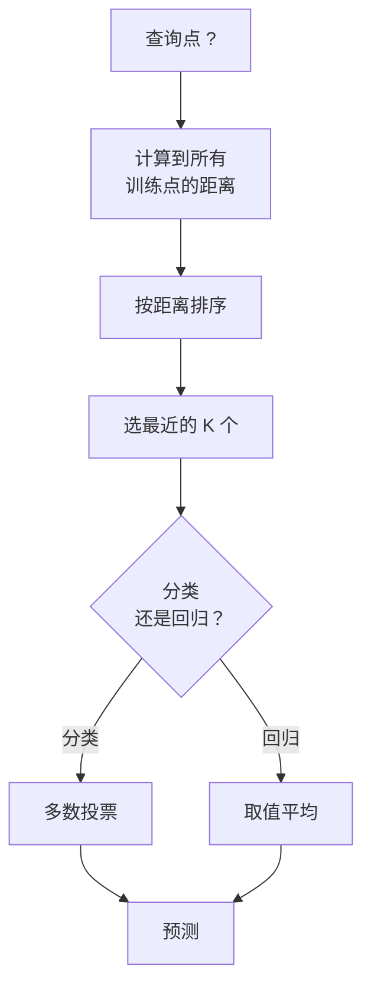
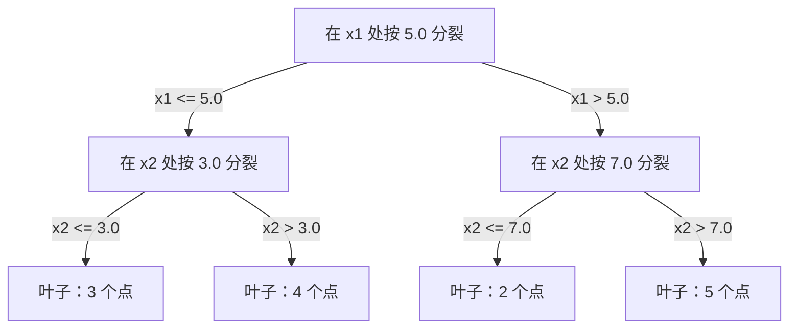

# K 近邻与距离

> 把所有东西都存下来。靠看邻居来预测。最简单却真能用的算法。

**类型：** Build
**语言：** Python
**前置要求：** 阶段 1（第 14 课范数与距离）
**预计时间：** ~90 分钟

## 学习目标

- 从零实现 KNN 分类和回归，K 可配置，并支持距离加权投票
- 对比 L1、L2、余弦和 Minkowski 距离度量，为给定数据类型选出合适的那个
- 解释维度灾难，并演示 KNN 为什么在高维空间里退化
- 构建一棵 KD 树做高效最近邻搜索，分析它何时优于暴力搜索

## 问题所在

你有一个数据集。来了一个新数据点。你需要给它分类或预测它的值。你不去从数据里学参数（像线性回归或 SVM 那样），而是直接找出离新点最近的 K 个训练点，让它们投票。

这就是 K 近邻。没有训练阶段。没有要学的参数。没有要最小化的损失函数。你把整个训练集存下来，在预测时计算距离。

听起来简单得不可能管用。但 KNN 在很多问题上出人意料地有竞争力，尤其是中小规模数据集，而且深入理解它能揭示一些根本概念：距离度量的选择（对接阶段 1 第 14 课）、维度灾难，以及惰性学习和勤快学习的区别。

KNN 在现代 AI 里也无处不在，只是换了名字。向量数据库在 embedding 上做 KNN 搜索。检索增强生成（RAG）找出最近的 K 个文档块。推荐系统找出相似的用户或物品。算法是同一个，不同的是规模和数据结构。

## 核心概念

### KNN 怎么工作

给定一个有标签点的数据集和一个新的查询点：

1. 计算查询点到数据集中每个点的距离
2. 按距离排序
3. 取最近的 K 个点
4. 分类：在这 K 个邻居里做多数投票
5. 回归：取这 K 个邻居值的平均（或加权平均）



整个算法就这么多。不用拟合。不用梯度下降。没有 epoch。

### 选择 K

K 是唯一的超参数。它控制偏差-方差权衡：

| K | 行为 |
|---|----------|
| K = 1 | 决策边界贴着每个点。训练误差为零。高方差。过拟合 |
| 小 K（3-5） | 对局部结构敏感。能抓住复杂边界 |
| 大 K | 边界更平滑。对噪声更稳健。可能欠拟合 |
| K = N | 给每个点都预测多数类。最大偏差 |

对于有 N 个点的数据集，常见的起点是 K = sqrt(N)。二分类用奇数 K 以避免平票。


### 距离度量

距离函数定义了"近"是什么意思。不同的度量产生不同的邻居、不同的预测。

**L2（欧几里得）**是默认值。直线距离。

```
d(a, b) = sqrt(sum((a_i - b_i)^2))
```

对特征尺度敏感。在 KNN 里用 L2 之前总是先标准化特征。

**L1（曼哈顿）**对绝对差求和。比 L2 更抗离群点，因为它不对差值平方。

```
d(a, b) = sum(|a_i - b_i|)
```

**余弦距离**衡量向量之间的夹角，忽略大小。对文本和 embedding 数据至关重要。

```
d(a, b) = 1 - (a . b) / (||a|| * ||b||)
```

**Minkowski** 用参数 p 把 L1 和 L2 推广。

```
d(a, b) = (sum(|a_i - b_i|^p))^(1/p)

p=1: 曼哈顿
p=2: 欧几里得
p->inf: 切比雪夫（最大绝对差）
```

用哪个度量取决于数据：

| 数据类型 | 最佳度量 | 原因 |
|-----------|------------|-----|
| 数值特征，尺度相近 | L2（欧几里得） | 默认，适用于空间数据 |
| 数值特征，有离群点 | L1（曼哈顿） | 稳健，不放大大差值 |
| 文本 embedding | 余弦 | 大小是噪声，方向才是含义 |
| 高维稀疏 | 余弦或 L1 | L2 受维度灾难之苦 |
| 混合类型 | 自定义距离 | 按特征类型组合度量 |

### 加权 KNN

标准 KNN 给所有 K 个邻居相同的权重。但距离 0.1 的邻居应该比距离 5.0 的更重要。

**距离加权 KNN** 给每个邻居按距离的倒数加权：

```
weight_i = 1 / (distance_i + epsilon)

分类：加权投票
回归：加权平均 = sum(w_i * y_i) / sum(w_i)
```

epsilon 防止查询点恰好和某个训练点重合时除以零。

加权 KNN 对 K 的选择不那么敏感，因为不管怎样远处的邻居贡献都很小。

### 维度灾难

KNN 在高维下性能退化。这不是含糊的担忧，而是数学事实。

**问题 1：距离趋同。** 随着维度增加，最大距离与最小距离的比值趋近 1。所有点离查询点都变得一样"远"。

```
在 d 维里，对于均匀分布的随机点：

d=2:    max_dist / min_dist = 差异很大
d=100:  max_dist / min_dist ~ 1.01
d=1000: max_dist / min_dist ~ 1.001

当所有距离都几乎相等时，"最近"就毫无意义了。
```

**问题 2：体积爆炸。** 要在数据的固定比例内捕获 K 个邻居，你得把搜索半径扩大到覆盖特征空间一大块。高维下的"邻域"几乎囊括了整个空间。

**问题 3：角落主导。** 在 d 维单位超立方体里，大部分体积集中在角落附近，而不是中心。随着 d 增大，内切于立方体的球体所含的体积比例趋于消失。

实际后果：KNN 在大约 20-50 个特征以内表现良好。再往上，你需要先做降维（PCA、UMAP、t-SNE）再用 KNN，或者用那些利用数据内在低维性的树状搜索结构。

### KD 树：快速最近邻搜索

暴力 KNN 计算查询点到每个训练点的距离。每次查询是 O(n * d)。对于大数据集，这太慢了。

KD 树沿特征轴递归地划分空间。在每一层，它沿某一个维度按中位数分裂。



要找最近邻，先遍历树到包含查询点的叶子，然后回溯，只在邻近分区可能含有更近的点时才去检查它们。

平均查询时间：低维下 O(log n)。但 KD 树在高维（d > 20）下退化到 O(n)，因为回溯能排除的分支越来越少。

### Ball 树：中等维度下更好

Ball 树把数据划分成嵌套的超球面，而不是轴对齐的盒子。每个节点定义一个球（中心 + 半径），包含该子树里的所有点。

相比 KD 树的优势：
- 在中等维度（最高约 50）下表现更好
- 能处理非轴对齐的结构
- 更紧的包围体意味着搜索时能剪掉更多分支

KD 树和 ball 树都是精确算法。对于真正大规模的搜索（数百万点、数百维），改用近似最近邻方法（HNSW、IVF、乘积量化）。这些在阶段 1 第 14 课讲过。

### 惰性学习 vs 勤快学习

KNN 是惰性学习器：训练时啥也不干，所有活儿都在预测时干。大多数其他算法（线性回归、SVM、神经网络）是勤快学习器：训练时做大量计算来建一个紧凑的模型，预测就很快。

| 维度 | 惰性（KNN） | 勤快（SVM、神经网络） |
|--------|------------|------------------------|
| 训练时间 | O(1) 只存数据 | O(n * epochs) |
| 预测时间 | 每次查询 O(n * d) | O(d) 或 O(参数) |
| 预测时内存 | 存整个训练集 | 只存模型参数 |
| 适应新数据 | 瞬间加点 | 重新训练模型 |
| 决策边界 | 隐式，临时算出 | 显式，训练后固定 |

惰性学习在这些情况下理想：
- 数据集频繁变化（加/删点而不重训）
- 你只需对极少量查询做预测
- 你想要零训练时间
- 数据集小到暴力搜索就很快

### 用于回归的 KNN

KNN 回归不做多数投票，而是对 K 个邻居的目标值取平均。

```
prediction = (1/K) * sum(y_i for i in K nearest neighbors)

或带距离加权：
prediction = sum(w_i * y_i) / sum(w_i)
其中 w_i = 1 / distance_i
```

KNN 回归产生分段常数（加权时分段平滑）的预测。它无法外推到训练数据范围之外。如果训练目标全在 0 到 100 之间，KNN 永远不会预测出 200。

## 动手构建

### 第 1 步：距离函数

实现 L1、L2、余弦和 Minkowski 距离。这些直接对接阶段 1 第 14 课。

```python
import math

def l2_distance(a, b):
    return math.sqrt(sum((ai - bi) ** 2 for ai, bi in zip(a, b)))

def l1_distance(a, b):
    return sum(abs(ai - bi) for ai, bi in zip(a, b))

def cosine_distance(a, b):
    dot_val = sum(ai * bi for ai, bi in zip(a, b))
    norm_a = math.sqrt(sum(ai ** 2 for ai in a))
    norm_b = math.sqrt(sum(bi ** 2 for bi in b))
    if norm_a == 0 or norm_b == 0:
        return 1.0
    return 1.0 - dot_val / (norm_a * norm_b)

def minkowski_distance(a, b, p=2):
    if p == float('inf'):
        return max(abs(ai - bi) for ai, bi in zip(a, b))
    return sum(abs(ai - bi) ** p for ai, bi in zip(a, b)) ** (1 / p)
```

### 第 2 步：KNN 分类器和回归器

构建完整的 KNN，K、距离度量可配置，并可选距离加权。

```python
class KNN:
    def __init__(self, k=5, distance_fn=l2_distance, weighted=False,
                 task="classification"):
        self.k = k
        self.distance_fn = distance_fn
        self.weighted = weighted
        self.task = task
        self.X_train = None
        self.y_train = None

    def fit(self, X, y):
        self.X_train = X
        self.y_train = y

    def predict(self, X):
        return [self._predict_one(x) for x in X]
```

### 第 3 步：用于高效搜索的 KD 树

从零构建一棵 KD 树，沿每个维度按中位数递归分裂。

```python
class KDTree:
    def __init__(self, X, indices=None, depth=0):
        # 递归划分数据
        self.axis = depth % len(X[0])
        # 沿当前轴按中位数分裂
        ...

    def query(self, point, k=1):
        # 遍历到叶子，然后回溯
        ...
```

完整实现连同所有辅助方法和演示见 `code/knn.py`。

### 第 4 步：特征缩放

KNN 需要特征缩放，因为距离对特征量级敏感。一个取值 0 到 1000 的特征会盖过一个取值 0 到 1 的特征。

```python
def standardize(X):
    n = len(X)
    d = len(X[0])
    means = [sum(X[i][j] for i in range(n)) / n for j in range(d)]
    stds = [
        max(1e-10, (sum((X[i][j] - means[j]) ** 2 for i in range(n)) / n) ** 0.5)
        for j in range(d)
    ]
    return [[((X[i][j] - means[j]) / stds[j]) for j in range(d)] for i in range(n)], means, stds
```

## 上手使用

用 scikit-learn：

```python
from sklearn.neighbors import KNeighborsClassifier
from sklearn.preprocessing import StandardScaler
from sklearn.pipeline import Pipeline

clf = Pipeline([
    ("scaler", StandardScaler()),
    ("knn", KNeighborsClassifier(n_neighbors=5, metric="euclidean")),
])
clf.fit(X_train, y_train)
print(f"Accuracy: {clf.score(X_test, y_test):.4f}")
```

当数据集足够大、维度足够低时，scikit-learn 会自动用 KD 树或 ball 树。对于高维数据，它退回到暴力搜索。你可以用 `algorithm` 参数控制这一点。

对于大规模最近邻搜索（数百万向量），用 FAISS、Annoy 或一个向量数据库：

```python
import faiss

index = faiss.IndexFlatL2(dimension)
index.add(embeddings)
distances, indices = index.search(query_vectors, k=5)
```

## 练习

1. 在一个有 3 个类的二维数据集上实现 KNN 分类。为 K=1、K=5、K=15 和 K=N 画出决策边界。观察从过拟合到欠拟合的转变。

2. 在 2、5、10、50、100 和 500 维各生成 1000 个随机点。对每个维度，计算最大成对距离与最小成对距离的比值。把比值随维度的变化画出来，可视化维度灾难。

3. 在一个文本分类问题上（用 TF-IDF 向量）对比 KNN 用 L1、L2 和余弦距离。哪个度量准确率最高？为什么文本上余弦往往胜出？

4. 实现一棵 KD 树，对 2D、10D、50D 下 1k、10k、100k 点的数据集测量查询时间，和暴力搜索对比。到哪个维度时 KD 树不再比暴力快？

5. 为 y = sin(x) + 噪声 构建一个加权 KNN 回归器。在 K=3、10、30 时和不加权的 KNN 对比。说明加权产生更平滑的预测，对大 K 尤其明显。

## 关键术语

| 术语 | 它实际是什么 |
|------|----------------------|
| K 近邻 | 非参数算法，通过找出离查询点最近的 K 个训练点来预测 |
| 惰性学习 | 训练时不做计算。所有活儿都在预测时发生。KNN 是典型例子 |
| 勤快学习 | 训练时做大量计算来建一个紧凑模型。大多数 ML 算法是勤快的 |
| 维度灾难 | 高维下距离趋同、邻域膨胀到覆盖大部分空间，使 KNN 失效 |
| KD 树 | 沿特征轴递归划分空间的二叉树。低维下查询 O(log n) |
| Ball 树 | 嵌套超球面的树。在中等维度（最高约 50）下比 KD 树表现更好 |
| 加权 KNN | 邻居按距离的倒数加权。更近的邻居对预测影响更大 |
| 特征缩放 | 把特征归一化到可比范围。KNN 这类基于距离的方法必须做 |
| 多数投票 | 通过数 K 个邻居里哪个类最常见来分类 |
| 暴力搜索 | 计算到每个训练点的距离。每次查询 O(n*d)。精确但对大 n 慢 |
| 近似最近邻 | 一类算法（HNSW、LSH、IVF），比精确搜索快得多地找到近似最近的点 |
| Voronoi 图 | 空间的划分，每块区域里的所有点离某个训练点都比离其他点近。K=1 的 KNN 产生 Voronoi 边界 |

## 延伸阅读

- [Cover & Hart: Nearest Neighbor Pattern Classification (1967)](https://ieeexplore.ieee.org/document/1053964) - KNN 的奠基论文，证明其错误率至多是贝叶斯最优的两倍
- [Friedman, Bentley, Finkel: An Algorithm for Finding Best Matches in Logarithmic Expected Time (1977)](https://dl.acm.org/doi/10.1145/355744.355745) - 原始的 KD 树论文
- [Beyer et al.: When Is "Nearest Neighbor" Meaningful? (1999)](https://link.springer.com/chapter/10.1007/3-540-49257-7_15) - 对最近邻维度灾难的形式化分析
- [scikit-learn Nearest Neighbors documentation](https://scikit-learn.org/stable/modules/neighbors.html) - 带算法选择的实用指南
- [FAISS: A Library for Efficient Similarity Search](https://github.com/facebookresearch/faiss) - Meta 的十亿级近似最近邻搜索库
