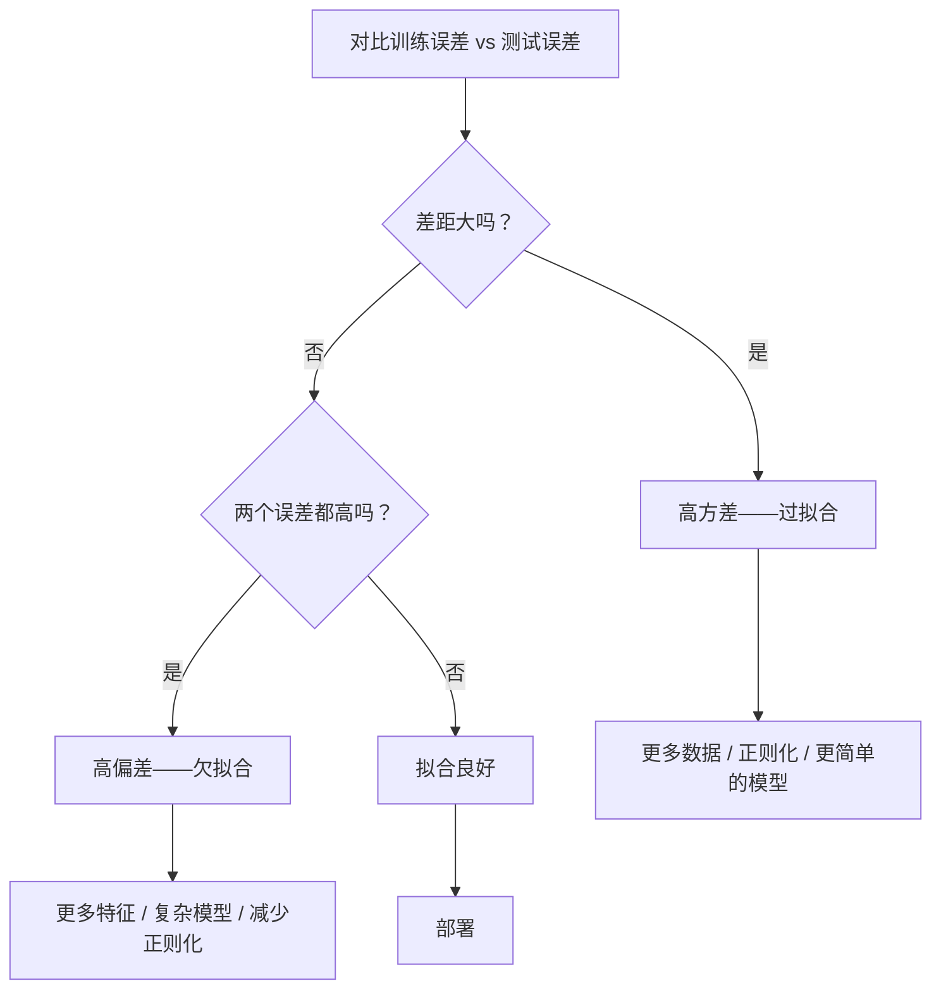
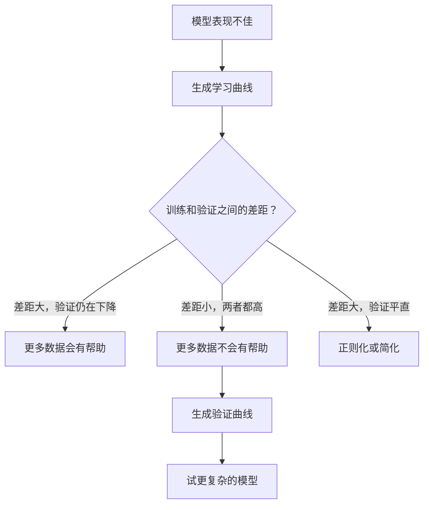

# 偏差-方差权衡

> 模型的每一份误差都来自三个来源之一：偏差、方差或噪声。你只能控制前两个。

**类型：** Learn
**语言：** Python
**前置要求：** 阶段 2 第 01-09 课（ML 基础、回归、分类、评估）
**预计时间：** ~75 分钟

## 学习目标

- 推导期望预测误差的偏差-方差分解，并说明不可约噪声的作用
- 用训练误差和测试误差的模式诊断模型是高偏差还是高方差
- 解释正则化技术（L1、L2、dropout、提前停止）如何用偏差换方差
- 实现实验，可视化随复杂度递增的模型上的偏差-方差权衡

## 问题所在

你训练了一个模型。它在测试数据上有一些误差。这误差从哪来？

如果你的模型太简单（在弯曲的数据集上用线性回归），它会一贯地错过真实规律。这是偏差。如果你的模型太复杂（在 15 个数据点上用 20 次多项式），它会完美拟合训练数据，却在新数据上给出天差地别的预测。这是方差。

对一个固定的模型容量，你无法同时让两者都最小。把偏差压下去，方差就上来。把方差压下去，偏差就上来。理解这个权衡是机器学习里最有用的单项诊断技能。它告诉你该让模型更复杂还是更简单、该拿更多数据还是做更好的特征、该多正则化还是少正则化。

## 核心概念

### 偏差：系统性误差

偏差衡量你模型的平均预测离真实值有多远。如果你在从同一分布抽出的许多不同训练集上训练同一个模型，再把预测平均起来，偏差就是这个平均和真值之间的差距。

高偏差意味着模型太僵硬，抓不住真实规律。用一条直线拟合一条抛物线，无论你给多少数据，它都会错过那条曲线。这是欠拟合。

```
高偏差（欠拟合）：
  模型总是预测出大致相同的错误结果。
  训练误差：高
  测试误差：高
  两者之间的差距：小
```

### 方差：对训练数据的敏感度

方差衡量你在不同数据子集上训练时预测变化有多大。如果训练集的小变化导致模型大变化，方差就高。

高方差意味着模型在拟合训练数据里的噪声，而不是底层信号。一个 20 次多项式会穿过每个训练点，却在它们之间剧烈震荡。这是过拟合。

```
高方差（过拟合）：
  模型完美拟合训练数据，却在新数据上失败。
  训练误差：低
  测试误差：高
  两者之间的差距：大
```

### 分解

对任意点 x，平方损失下的期望预测误差恰好分解为：

```
Expected Error = Bias^2 + Variance + Irreducible Noise

其中：
  Bias^2   = (E[f_hat(x)] - f(x))^2
  Variance = E[(f_hat(x) - E[f_hat(x)])^2]
  Noise    = E[(y - f(x))^2]             (sigma^2)
```

- `f(x)` 是真实函数
- `f_hat(x)` 是你模型的预测
- `E[...]` 是对不同训练集的期望
- `y` 是观测到的标签（真实函数加噪声）

噪声项是不可约的。在有噪声的数据上，没有模型能做得比 sigma^2 更好。你的任务是在 偏差^2 和方差之间找到正确的平衡。

### 模型复杂度 vs 误差


经典的 U 形曲线：

| 复杂度 | 偏差 | 方差 | 总误差 |
|-----------|------|----------|-------------|
| 太低 | 高 | 低 | 高（欠拟合） |
| 恰到好处 | 中 | 中 | 最低 |
| 太高 | 低 | 高 | 高（过拟合） |

### 正则化作为偏差-方差的调控

正则化故意增加偏差来减少方差。它约束模型，让它没法去追噪声。

- **L2（Ridge）：** 把所有权重朝零收缩。保留所有特征但削弱它们的影响。
- **L1（Lasso）：** 把一些权重逼到恰好为零。做特征选择。
- **Dropout：** 训练时随机禁用神经元。强制形成冗余表示。
- **提前停止：** 在模型完全拟合训练数据之前停止训练。

正则化强度（lambda、dropout 率、epoch 数）直接控制你坐在偏差-方差曲线的哪个位置。正则化越强，偏差越大、方差越小。

### 双下降：现代视角

经典理论说：过了甜点位，复杂度越高总是越糟。但 2019 年以来的研究揭示了一些出人意料的东西。如果你把模型容量一路推过插值阈值（模型参数足以完美拟合训练数据的那一点），测试误差还能再次下降。


这个"双下降"现象解释了为什么参数量远超训练样本的超大规模神经网络仍然泛化得好。经典的偏差-方差权衡没错，但对现代场景来说不完整。

关于双下降的关键观察：
- 它出现在线性模型、决策树和神经网络里
- 在插值区，更多数据反而可能有害（样本维度的双下降）
- 更多训练 epoch 也能引发它（epoch 维度的双下降）
- 正则化能平滑掉那个峰值，但消不掉它

为什么会这样？在插值阈值处，模型容量刚好够拟合所有训练点。它被逼进一个非常特定、穿过每个点的解，数据里的小扰动会导致拟合的大变化。这就是方差达到峰值的地方。过了阈值，模型有许多个能完美拟合数据的可能解。学习算法（比如带隐式正则化的梯度下降）倾向于从中挑最简单的那个。这种朝向简单解的隐式偏好，正是超参数化模型能泛化的原因。

| 场景 | 参数 vs 样本 | 行为 |
|--------|----------------------|----------|
| 欠参数化 | p << n | 经典权衡适用 |
| 插值阈值 | p ~ n | 方差达峰，测试误差飙升 |
| 超参数化 | p >> n | 隐式正则化起作用，测试误差下降 |

实用结论：如果你在用神经网络或大型树集成，不要停在插值阈值上。要么远在它之下（配显式正则化），要么远在它之上。最糟的位置就是正好卡在阈值上。

### 诊断你的模型



| 症状 | 诊断 | 解法 |
|---------|-----------|-----|
| 训练误差高，测试误差高 | 偏差 | 更多特征、复杂模型、减少正则化 |
| 训练误差低，测试误差高 | 方差 | 更多数据、正则化、更简单的模型、dropout |
| 训练误差低，测试误差低 | 拟合良好 | 交付 |
| 训练误差下降，测试误差上升 | 正在过拟合 | 提前停止 |

### 实用策略

**当偏差是问题时：**
- 加多项式或交互特征
- 用更灵活的模型（树集成代替线性）
- 减少正则化强度
- 训练更久（如果还没收敛）

**当方差是问题时：**
- 拿更多训练数据
- 用 bagging（随机森林）
- 加强正则化（更高的 lambda、更多 dropout）
- 特征选择（去掉噪声特征）
- 用交叉验证及早发现它

### 集成方法与方差减少

集成方法是对抗方差最实用的工具。

**Bagging（自助聚合）** 在训练数据的不同自助样本上训练多个模型，再把它们的预测平均。每个单独模型方差高，但平均后方差低得多。随机森林就是把 bagging 用在决策树上。

它为什么数学上管用：如果你把 N 个独立预测平均，每个方差为 sigma^2，那平均的方差是 sigma^2 / N。这些模型并非真正独立（它们都看到相似的数据），所以减少量小于 1/N，但仍然可观。

**Boosting** 通过顺序地建模型来减少偏差，每个新模型聚焦于到目前为止集成的错误。梯度提升和 AdaBoost 是主要例子。Boosting 如果加太多模型会过拟合，所以你需要提前停止或正则化。

| 方法 | 主要效果 | 偏差变化 | 方差变化 |
|--------|---------------|-------------|-----------------|
| Bagging | 减少方差 | 不变 | 下降 |
| Boosting | 减少偏差 | 下降 | 可能上升 |
| Stacking | 两者都减 | 取决于元学习器 | 取决于基模型 |
| Dropout | 隐式 bagging | 略增 | 下降 |

**实用规则：** 如果你的基模型方差高（深树、高次多项式），用 bagging。如果你的基模型偏差高（浅桩、简单线性模型），用 boosting。

### 学习曲线

学习曲线把训练误差和验证误差作为训练集大小的函数画出来。它们是你手上最实用的诊断工具。和单次训练/测试对比不同，学习曲线展示模型的轨迹，告诉你更多数据会不会有帮助。


怎么读它们：

| 场景 | 训练误差 | 验证误差 | 差距 | 它意味着什么 | 该做什么 |
|----------|---------------|-----------------|-----|---------------|------------|
| 高偏差 | 高 | 高 | 小 | 模型抓不住规律 | 更多特征、复杂模型、减少正则化 |
| 高方差 | 低 | 高 | 大 | 模型在背训练数据 | 更多数据、正则化、更简单的模型 |
| 拟合良好 | 中 | 中 | 小 | 模型泛化良好 | 交付 |
| 高方差，在改善 | 低 | 随数据增多而下降 | 在缩小 | 数据能修复的方差问题 | 收集更多数据 |
| 高偏差，平直 | 高 | 高且平 | 小且平 | 更多数据**不会**有帮助 | 换模型架构 |

关键洞察：如果两条曲线都到了平台、差距小但两个误差都高，那更多数据没用，你需要更好的模型。如果差距大且仍在缩小，那更多数据会有帮助。

### 如何生成学习曲线

有两种思路：

**思路 1：变训练集大小，固定模型。** 模型和超参数保持不变。在越来越大的训练数据子集上训练。在每个大小上测量训练误差和验证误差。这是标准学习曲线。

**思路 2：变模型复杂度，固定数据。** 数据保持不变。扫一个复杂度参数（多项式次数、树深度、层数）。在每个复杂度上测量训练误差和验证误差。这是验证曲线，直接展示偏差-方差权衡。

两种思路互补。第一个告诉你更多数据会不会有帮助。第二个告诉你换个模型会不会有帮助。在决定下一步之前两个都跑。



## 动手构建

`code/bias_variance.py` 里的代码运行完整的偏差-方差分解实验。下面是逐步的做法。

### 第 1 步：从已知函数生成合成数据

我们用 `f(x) = sin(1.5x) + 0.5x` 加高斯噪声。知道真实函数让我们能算出精确的偏差和方差。

```python
def true_function(x):
    return np.sin(1.5 * x) + 0.5 * x

def generate_data(n_samples=30, noise_std=0.5, x_range=(-3, 3), seed=None):
    rng = np.random.RandomState(seed)
    x = rng.uniform(x_range[0], x_range[1], n_samples)
    y = true_function(x) + rng.normal(0, noise_std, n_samples)
    return x, y
```

### 第 2 步：自助采样与多项式拟合

对每个多项式次数，我们抽许多自助训练集，拟合多项式，并记录在固定测试网格上的预测。这给了我们每个测试点上的预测分布。

```python
def fit_polynomial(x_train, y_train, degree, lam=0.0):
    X = np.column_stack([x_train ** d for d in range(degree + 1)])
    if lam > 0:
        penalty = lam * np.eye(X.shape[1])
        penalty[0, 0] = 0
        w = np.linalg.solve(X.T @ X + penalty, X.T @ y_train)
    else:
        w = np.linalg.lstsq(X, y_train, rcond=None)[0]
    return w
```

我们在 200 个不同的自助样本上拟合。每个自助样本都从同一底层分布抽出，但包含不同的点。

### 第 3 步：计算 偏差^2、方差分解

有了每个测试点上的 200 组预测，我们就能直接按定义计算分解：

```python
mean_pred = predictions.mean(axis=0)
bias_sq = np.mean((mean_pred - y_true) ** 2)
variance = np.mean(predictions.var(axis=0))
total_error = np.mean(np.mean((predictions - y_true) ** 2, axis=1))
```

- `mean_pred` 是从自助样本估计的 E[f_hat(x)]
- `bias_sq` 是平均预测和真值之间的平方差距
- `variance` 是预测在各自助样本间的平均散度
- `total_error` 应该约等于 偏差^2 + 方差 + 噪声

### 第 4 步：学习曲线

学习曲线扫训练集大小，同时固定模型复杂度。它们展示你的模型是受数据限制还是受容量限制。

```python
def demo_learning_curves():
    sizes = [10, 15, 20, 30, 50, 75, 100, 150, 200, 300]
    degree = 5

    for n in sizes:
        train_errors = []
        test_errors = []
        for seed in range(50):
            x_train, y_train = generate_data(n_samples=n, seed=seed * 100)
            w = fit_polynomial(x_train, y_train, degree)
            train_pred = predict_polynomial(x_train, w)
            train_mse = np.mean((train_pred - y_train) ** 2)
            test_pred = predict_polynomial(x_test, w)
            test_mse = np.mean((test_pred - y_test) ** 2)
            train_errors.append(train_mse)
            test_errors.append(test_mse)
        # 对多次运行取平均得到一个学习曲线点
```

对于高方差模型（小数据上的 5 次），你会看到：
- 训练误差开始时低，随着数据增多让记忆变难而上升
- 测试误差开始时高，随着模型获得更多信号而下降
- 差距随数据增多而缩小

对于高偏差模型（1 次），两个误差很快收敛到同一个高值，更多数据没用。

### 第 5 步：正则化扫描

代码还包含 `demo_regularization_sweep()`，它固定一个高次多项式（15 次），把 Ridge 正则化强度从 0.001 扫到 100。这从另一个角度展示偏差-方差权衡：我们不变模型复杂度，而是变约束强度。

```python
def demo_regularization_sweep():
    alphas = [0.001, 0.005, 0.01, 0.05, 0.1, 0.5, 1.0, 5.0, 10.0, 50.0, 100.0]
    for alpha in alphas:
        results = bias_variance_decomposition([15], lam=alpha)
        r = results[15]
        print(f"alpha={alpha:.3f}  bias={r['bias_sq']:.4f}  var={r['variance']:.4f}")
```

alpha 低时，15 次多项式几乎不受约束。方差占主导，因为模型在每个自助样本里追噪声。alpha 高时，惩罚强到模型实际上变成一个近乎常数的函数。偏差占主导。最优 alpha 落在这两个极端之间。

这和变多项式次数得到的 U 曲线一样，只不过是由一个连续旋钮而不是离散旋钮控制的。实践中，正则化是控制权衡的首选方式，因为它允许细粒度控制而不用改特征集。

## 上手使用

sklearn 提供 `learning_curve` 和 `validation_curve` 来自动化这些诊断，不用自己写自助循环。

### 验证曲线：扫模型复杂度

```python
from sklearn.model_selection import validation_curve
from sklearn.pipeline import make_pipeline
from sklearn.preprocessing import PolynomialFeatures
from sklearn.linear_model import Ridge

degrees = list(range(1, 16))
train_scores_all = []
val_scores_all = []

for d in degrees:
    pipe = make_pipeline(PolynomialFeatures(d), Ridge(alpha=0.01))
    train_scores, val_scores = validation_curve(
        pipe, X, y, param_name="polynomialfeatures__degree",
        param_range=[d], cv=5, scoring="neg_mean_squared_error"
    )
    train_scores_all.append(-train_scores.mean())
    val_scores_all.append(-val_scores.mean())
```

这直接给你偏差-方差权衡曲线。验证分数相对训练分数最差的地方，方差占主导。两者都差的地方，偏差占主导。

### 学习曲线：扫训练集大小

```python
from sklearn.model_selection import learning_curve

pipe = make_pipeline(PolynomialFeatures(5), Ridge(alpha=0.01))
train_sizes, train_scores, val_scores = learning_curve(
    pipe, X, y, train_sizes=np.linspace(0.1, 1.0, 10),
    cv=5, scoring="neg_mean_squared_error"
)
train_mse = -train_scores.mean(axis=1)
val_mse = -val_scores.mean(axis=1)
```

把 `train_mse` 和 `val_mse` 对 `train_sizes` 画出来。曲线形状告诉你关于模型的一切。

### 带正则化扫描的交叉验证

```python
from sklearn.model_selection import cross_val_score

alphas = [0.001, 0.01, 0.1, 1.0, 10.0, 100.0]
for alpha in alphas:
    pipe = make_pipeline(PolynomialFeatures(10), Ridge(alpha=alpha))
    scores = cross_val_score(pipe, X, y, cv=5, scoring="neg_mean_squared_error")
    print(f"alpha={alpha:>7.3f}  MSE={-scores.mean():.4f} +/- {scores.std():.4f}")
```

这对固定模型复杂度扫正则化强度。你会看到同样的偏差-方差权衡：alpha 低意味着高方差，alpha 高意味着高偏差。

### 把它们串起来：一套完整的诊断工作流

实践中，你按顺序跑这些诊断：

1. 训练你的模型。计算训练和测试误差。
2. 如果两者都高：你有偏差问题。跳到第 4 步。
3. 如果训练低但测试高：你有方差问题。生成学习曲线，看更多数据会不会有帮助。如果不会，就正则化。
4. 生成验证曲线，扫你的主要复杂度参数。找到甜点位。
5. 在甜点位，生成学习曲线。如果差距仍然大，你需要更多数据或正则化。
6. 用 `cross_val_score` 试不同 alpha 值的 Ridge/Lasso。挑交叉验证误差最低的那个 alpha。

对大多数表格数据集，这要花 10-15 分钟算力，能省下几小时的瞎猜。

## 交付

本节课产出：`outputs/prompt-model-diagnostics.md`

## 练习

1. 用 `noise_std=0`（无噪声）跑分解。不可约误差项怎么样了？最优复杂度变了吗？

2. 把训练集大小从 30 增加到 300。这对方差分量有什么影响？最优多项式次数移动了吗？

3. 给实验加上 L2 正则化（Ridge 回归）。对一个固定的高次多项式（15 次），把 lambda 从 0 扫到 100。把 偏差^2 和方差作为 lambda 的函数画出来。

4. 把真实函数从多项式改成 `sin(x)`。偏差-方差分解怎么变？还有清晰的最优次数吗？

5. 实现一个简单的自助聚合（bagging）封装：在自助样本上训练 10 个模型并平均预测。说明这能减少方差而不怎么增加偏差。

## 关键术语

| 术语 | 大家怎么说 | 它实际是什么 |
|------|----------------|----------------------|
| 偏差 | "模型太简单" | 来自错误假设的系统性误差。平均模型预测和真值之间的差距。 |
| 方差 | "模型在过拟合" | 来自对训练数据敏感的误差。预测在不同训练集间变化多大。 |
| 不可约误差 | "数据里的噪声" | 来自真实数据生成过程随机性的误差。没有模型能消除它。 |
| 欠拟合 | "学得不够" | 模型有高偏差。它连训练数据上的真实规律都抓不住。 |
| 过拟合 | "把数据背下来" | 模型有高方差。它拟合了训练数据里不可泛化的噪声。 |
| 正则化 | "约束模型" | 加一个惩罚来降低模型复杂度，用偏差换更低的方差。 |
| 双下降 | "更多参数反而有帮助" | 当模型容量远超插值阈值时，测试误差再次下降。 |
| 模型复杂度 | "模型有多灵活" | 模型拟合任意规律的容量。由架构、特征或正则化控制。 |

## 延伸阅读

- [Hastie, Tibshirani, Friedman: Elements of Statistical Learning, Ch. 7](https://hastie.su.domains/ElemStatLearn/) -- 偏差-方差分解的权威论述
- [Belkin et al., Reconciling modern machine learning practice and the bias-variance trade-off (2019)](https://arxiv.org/abs/1812.11118) -- 双下降的论文
- [Nakkiran et al., Deep Double Descent (2019)](https://arxiv.org/abs/1912.02292) -- epoch 维度和样本维度的双下降
- [Scott Fortmann-Roe: Understanding the Bias-Variance Tradeoff](http://scott.fortmann-roe.com/docs/BiasVariance.html) -- 清晰的可视化讲解
