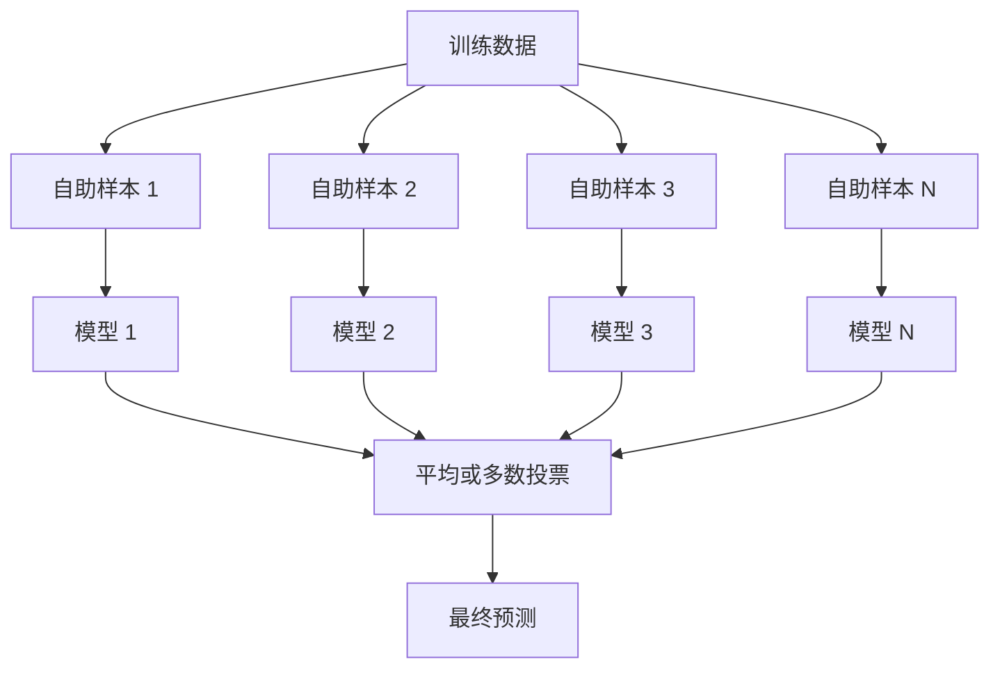
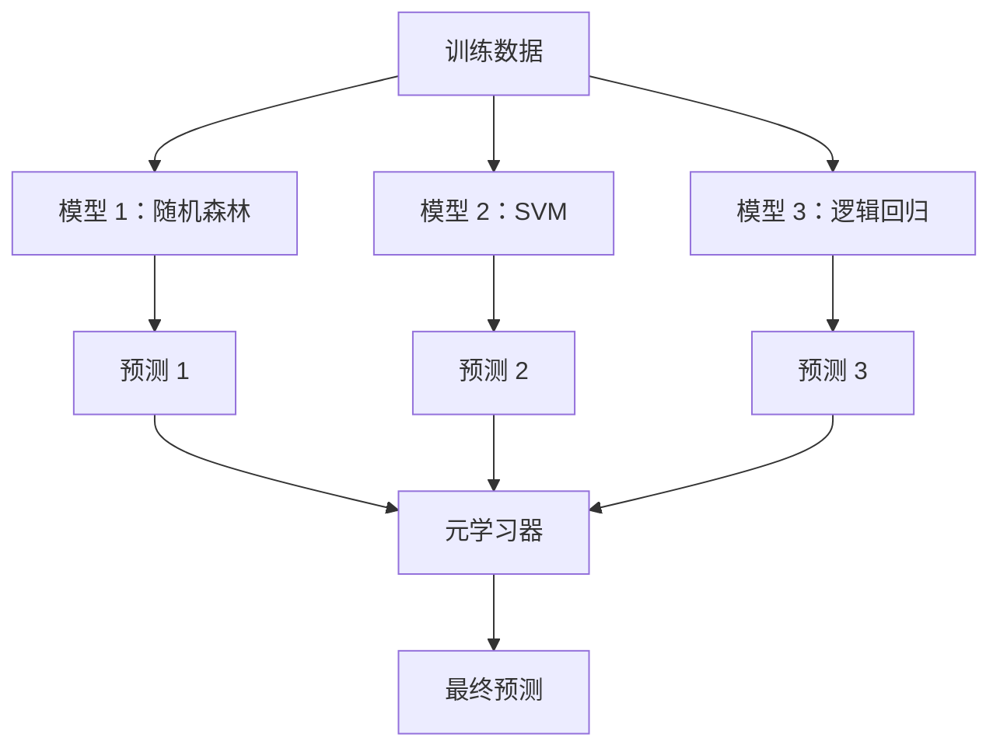

# 集成方法

> 一群弱学习器，正确地组合起来，就成了强学习器。这不是比喻，这是一条定理。

**类型：** Build
**语言：** Python
**前置要求：** 阶段 2 第 10 课（偏差-方差权衡）
**预计时间：** ~120 分钟

## 学习目标

- 从零实现 AdaBoost 和梯度提升，并解释 boosting 如何顺序地减少偏差
- 构建一个 bagging 集成，演示对去相关的模型取平均如何减少方差而不增加偏差
- 从各方法针对哪个误差分量的角度，对比 bagging、boosting 和 stacking
- 评估集成多样性，解释为什么多数投票准确率随独立弱学习器增多而提升

## 问题所在

单棵决策树训练快、易解读，但它过拟合。单个线性模型在复杂边界上欠拟合。你可以花几天去打磨完美的模型架构。或者你可以把一堆不完美的模型组合起来，得到比其中任何一个单独都更好的东西。

集成方法干的正是这件事。它们是在表格数据上赢 Kaggle 比赛最可靠的技术，驱动着大多数生产 ML 系统，并把偏差-方差权衡演示得淋漓尽致。Bagging 减少方差。Boosting 减少偏差。Stacking 学习在哪些输入上该信任哪些模型。

## 核心概念

### 集成为什么管用

假设你有 N 个独立分类器，每个准确率 p > 0.5。多数投票的准确率是：

```
P(majority correct) = sum over k > N/2 of C(N,k) * p^k * (1-p)^(N-k)
```

对 21 个各 60% 准确率的分类器，多数投票准确率约 74%。用 101 个，升到 84%。当模型犯不同的错误时，错误就相互抵消了。

关键要求是**多样性**。如果所有模型犯同样的错，把它们组合起来毫无帮助。集成之所以管用，是因为它们通过以下方式产生多样的模型：

- 不同的训练子集（bagging）
- 不同的特征子集（随机森林）
- 顺序的错误纠正（boosting）
- 不同的模型族（stacking）

### Bagging（自助聚合）

Bagging 通过让每个模型在训练数据的不同自助样本上训练来制造多样性。



自助样本是从原始数据有放回抽取的，大小和原始相同。每个自助样本里大约出现 63.2% 的不重复样本。剩下的 36.8%（袋外样本）提供了一个免费的验证集。

Bagging 减少方差而不怎么增加偏差。每棵树都对它的自助样本过拟合，但每棵树过拟合的方式不同，所以平均把噪声抵消掉了。

**随机森林**是 bagging 加一个额外花招：在每次分裂时，只考虑一个随机的特征子集。这迫使树之间更加多样。候选特征数典型取 `sqrt(n_features)`（分类）和 `n_features / 3`（回归）。

### Boosting（顺序纠错）

Boosting 顺序地训练模型。每个新模型聚焦于之前模型搞错的样本。


Boosting 减少偏差。每个新模型纠正到目前为止集成的系统性错误。最终预测是所有模型的加权和，更好的模型获得更高的权重。

代价是：boosting 如果跑太多轮会过拟合，因为它一直去拟合更难的样本，其中有些可能是噪声。

### AdaBoost

AdaBoost（自适应提升）是第一个实用的 boosting 算法。它能配任何基学习器，通常是决策树桩（深度为 1 的树）。

算法：

```
1. 初始化样本权重：所有 i 的 w_i = 1/N

2. 对 t = 1 到 T：
   a. 在加权数据上训练弱学习器 h_t
   b. 计算加权误差：
      err_t = sum(w_i * I(h_t(x_i) != y_i)) / sum(w_i)
   c. 计算模型权重：
      alpha_t = 0.5 * ln((1 - err_t) / err_t)
   d. 更新样本权重：
      w_i = w_i * exp(-alpha_t * y_i * h_t(x_i))
   e. 归一化权重使其和为 1

3. 最终预测：H(x) = sign(sum(alpha_t * h_t(x)))
```

误差更低的模型获得更高的 alpha。被错分的样本获得更高的权重，好让下一个模型聚焦于它们。

### 梯度提升

梯度提升把 boosting 推广到任意损失函数。它不重新加权样本，而是让每个新模型去拟合当前集成的残差（损失的负梯度）。

```
1. 初始化：F_0(x) = argmin_c sum(L(y_i, c))

2. 对 t = 1 到 T：
   a. 计算伪残差：
      r_i = -dL(y_i, F_{t-1}(x_i)) / dF_{t-1}(x_i)
   b. 拟合一棵树 h_t 到残差 r_i
   c. 找到最优步长：
      gamma_t = argmin_gamma sum(L(y_i, F_{t-1}(x_i) + gamma * h_t(x_i)))
   d. 更新：
      F_t(x) = F_{t-1}(x) + learning_rate * gamma_t * h_t(x)

3. 最终预测：F_T(x)
```

对于平方误差损失，伪残差就是实际残差：`r_i = y_i - F_{t-1}(x_i)`。每棵树字面意义上就是在拟合前一个集成的错误。

学习率（shrinkage）控制每棵树贡献多少。学习率越小需要的树越多，但泛化更好。典型值：0.01 到 0.3。

### XGBoost：它为什么统治表格数据

XGBoost（极致梯度提升）是带工程优化的梯度提升，让它又快、又准、又抗过拟合：

- **正则化目标：** 对叶子权重的 L1 和 L2 惩罚，防止单棵树过于自信
- **二阶近似：** 同时用损失的一阶和二阶导数，给出更好的分裂决策
- **稀疏感知分裂：** 原生处理缺失值，在每次分裂时为缺失数据学习最佳方向
- **列子采样：** 像随机森林一样，在每次分裂时采样特征以增加多样性
- **加权分位数草图：** 在分布式数据上高效地为连续特征找分裂点
- **缓存感知的块结构：** 内存布局针对 CPU 缓存行优化

对表格数据，XGBoost（及其后继 LightGBM）一贯胜过神经网络。这一点短期内不会变。如果你的数据能装进一张有行有列的表，就从梯度提升开始。

### Stacking（元学习）

Stacking 把多个基模型的预测当作元学习器的特征。



元学习器学习对哪些输入该信任哪个基模型。如果随机森林在某些区域更好、SVM 在另一些区域更好，元学习器会学会相应地路由。

为了避免数据泄漏，基模型的预测必须通过在训练集上的交叉验证来生成。你绝不能在同一份数据上既训练基模型又生成元特征。

### 投票

最简单的集成。直接把预测组合起来。

- **硬投票：** 对类别标签做多数投票。
- **软投票：** 平均预测概率，挑平均概率最高的类。通常更好，因为它用到了置信度信息。

## 动手构建

### 第 1 步：决策树桩（基学习器）

`code/ensembles.py` 里的代码从零实现了一切。我们从决策树桩开始：一棵只有单次分裂的树。

```python
class DecisionStump:
    def __init__(self):
        self.feature_idx = None
        self.threshold = None
        self.polarity = 1
        self.alpha = None

    def fit(self, X, y, weights):
        n_samples, n_features = X.shape
        best_error = float("inf")

        for f in range(n_features):
            thresholds = np.unique(X[:, f])
            for thresh in thresholds:
                for polarity in [1, -1]:
                    pred = np.ones(n_samples)
                    pred[polarity * X[:, f] < polarity * thresh] = -1
                    error = np.sum(weights[pred != y])
                    if error < best_error:
                        best_error = error
                        self.feature_idx = f
                        self.threshold = thresh
                        self.polarity = polarity

    def predict(self, X):
        n = X.shape[0]
        pred = np.ones(n)
        idx = self.polarity * X[:, self.feature_idx] < self.polarity * self.threshold
        pred[idx] = -1
        return pred
```

### 第 2 步：从零实现 AdaBoost

```python
class AdaBoostScratch:
    def __init__(self, n_estimators=50):
        self.n_estimators = n_estimators
        self.stumps = []
        self.alphas = []

    def fit(self, X, y):
        n = X.shape[0]
        weights = np.full(n, 1 / n)

        for _ in range(self.n_estimators):
            stump = DecisionStump()
            stump.fit(X, y, weights)
            pred = stump.predict(X)

            err = np.sum(weights[pred != y])
            err = np.clip(err, 1e-10, 1 - 1e-10)

            alpha = 0.5 * np.log((1 - err) / err)
            weights *= np.exp(-alpha * y * pred)
            weights /= weights.sum()

            stump.alpha = alpha
            self.stumps.append(stump)
            self.alphas.append(alpha)

    def predict(self, X):
        total = sum(a * s.predict(X) for a, s in zip(self.alphas, self.stumps))
        return np.sign(total)
```

### 第 3 步：从零实现梯度提升

```python
class GradientBoostingScratch:
    def __init__(self, n_estimators=100, learning_rate=0.1, max_depth=3):
        self.n_estimators = n_estimators
        self.lr = learning_rate
        self.max_depth = max_depth
        self.trees = []
        self.initial_pred = None

    def fit(self, X, y):
        self.initial_pred = np.mean(y)
        current_pred = np.full(len(y), self.initial_pred)

        for _ in range(self.n_estimators):
            residuals = y - current_pred
            tree = SimpleRegressionTree(max_depth=self.max_depth)
            tree.fit(X, residuals)
            update = tree.predict(X)
            current_pred += self.lr * update
            self.trees.append(tree)

    def predict(self, X):
        pred = np.full(X.shape[0], self.initial_pred)
        for tree in self.trees:
            pred += self.lr * tree.predict(X)
        return pred
```

### 第 4 步：和 sklearn 对比

代码验证我们的从零实现产出的准确率和 sklearn 的 `AdaBoostClassifier`、`GradientBoostingClassifier` 相近，并把所有方法并排对比。

## 上手使用

### 何时用哪个方法

| 方法 | 减少 | 最适合 | 注意 |
|--------|---------|----------|---------------|
| Bagging / 随机森林 | 方差 | 有噪声的数据、特征多 | 对偏差没帮助 |
| AdaBoost | 偏差 | 干净的数据、简单基学习器 | 对离群点和噪声敏感 |
| 梯度提升 | 偏差 | 表格数据、比赛 | 训练慢，不调参易过拟合 |
| XGBoost / LightGBM | 两者 | 生产表格 ML | 超参数多 |
| Stacking | 两者 | 抠最后 1-2% 准确率 | 复杂，有过拟合元学习器的风险 |
| 投票 | 方差 | 快速组合多样模型 | 只有模型多样时才有用 |

### 表格数据的生产技术栈

对大多数表格预测问题，按这个顺序尝试：

1. **LightGBM 或 XGBoost** 用默认参数
2. 调 n_estimators、learning_rate、max_depth、min_child_weight
3. 如果你需要最后那 0.5%，用 3-5 个多样模型搭一个 stacking 集成
4. 全程用交叉验证

表格数据上的神经网络几乎总是比梯度提升差，尽管研究一直在尝试。TabNet、NODE 这类架构偶尔能追平，但很少打败一个调好的 XGBoost。

## 交付

本节课产出 `outputs/prompt-ensemble-selector.md` —— 一个帮你为给定数据集挑选合适集成方法的提示词。描述你的数据（规模、特征类型、噪声水平、类别平衡）和你要解决的问题。提示词会走一遍决策清单、推荐一个方法、建议起始超参数，并警告该方法的常见错误。还产出 `outputs/skill-ensemble-builder.md`，含完整的选择指南。

## 练习

1. 修改 AdaBoost 实现，跟踪每轮后的训练准确率。把准确率对估计器数量画出来。它什么时候收敛？

2. 通过给回归树加随机特征子采样，从零实现一个随机森林。用 `max_features=sqrt(n_features)` 训练 100 棵树并平均预测。和单棵树对比方差减少程度。

3. 在梯度提升实现里加上提前停止：跟踪每轮后的验证损失，连续 10 轮没改善就停。它实际需要多少棵树？

4. 用三个基模型（逻辑回归、决策树、k 近邻）和一个逻辑回归元学习器搭一个 stacking 集成。用 5 折交叉验证生成元特征。和每个基模型单独对比。

5. 在同一数据集上用默认参数跑 XGBoost。把它的准确率和你的从零梯度提升对比。给两者计时。速度差多大？

## 关键术语

| 术语 | 大家怎么说 | 它实际是什么 |
|------|----------------|----------------------|
| Bagging | "在随机子集上训练" | 自助聚合：在自助样本上训练模型，平均预测以减少方差 |
| Boosting | "聚焦难样本" | 顺序训练模型，每个纠正到目前为止集成的错误，以减少偏差 |
| AdaBoost | "给数据重新加权" | 通过样本权重更新做 boosting；被错分的点在下一个学习器里权重更高 |
| 梯度提升 | "拟合残差" | 通过让每个新模型拟合损失函数的负梯度来做 boosting |
| XGBoost | "Kaggle 大杀器" | 带正则化、二阶优化和系统级提速技巧的梯度提升 |
| Stacking | "模型叠模型" | 把基模型的预测当作元学习器的输入特征 |
| 随机森林 | "许多随机化的树" | 用决策树做 bagging，并在每次分裂时加随机特征子采样以增加多样性 |
| 集成多样性 | "犯不同的错" | 模型的错误必须互不相关，集成才能比单个更好 |
| 袋外误差 | "免费验证" | 没被某次自助抽中的样本（约 36.8%）当验证集用，不需要留出集 |

## 延伸阅读

- [Schapire & Freund: Boosting: Foundations and Algorithms](https://mitpress.mit.edu/9780262526036/) -- AdaBoost 创造者写的书
- [Friedman: Greedy Function Approximation: A Gradient Boosting Machine (2001)](https://statweb.stanford.edu/~jhf/ftp/trebst.pdf) -- 原始的梯度提升论文
- [Chen & Guestrin: XGBoost (2016)](https://arxiv.org/abs/1603.02754) -- XGBoost 论文
- [Wolpert: Stacked Generalization (1992)](https://www.sciencedirect.com/science/article/abs/pii/S0893608005800231) -- 原始的 stacking 论文
- [scikit-learn Ensemble Methods](https://scikit-learn.org/stable/modules/ensemble.html) -- 实用参考
