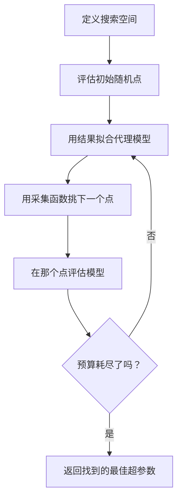
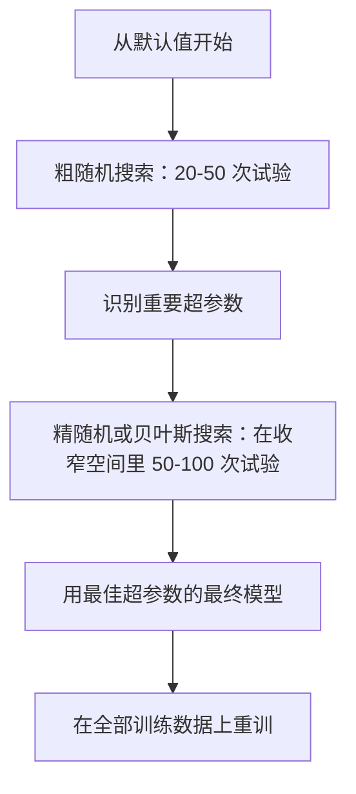
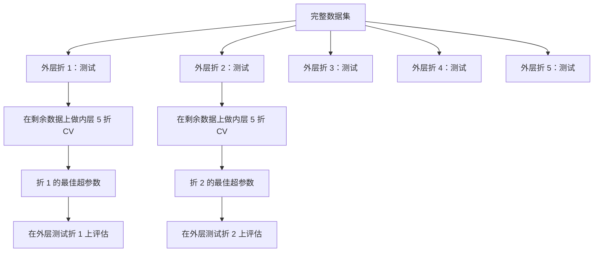

# 超参数调优

> 超参数是训练开始前你拧的那些旋钮。拧得好不好，是平庸模型和出色模型之间的差别。

**类型：** Build
**语言：** Python
**前置要求：** 阶段 2 第 11 课（集成方法）
**预计时间：** ~90 分钟

## 学习目标

- 从零实现网格搜索、随机搜索和贝叶斯优化，对比它们的样本效率
- 解释为什么当大多数超参数有效维度低时，随机搜索胜过网格搜索
- 用代理模型和采集函数构建一个贝叶斯优化循环来引导搜索
- 设计一套通过恰当交叉验证避免过拟合验证集的超参数调优策略

## 问题所在

你的梯度提升模型有学习率、树的数量、最大深度、每叶最小样本数、子采样比例和列采样比例。这是六个超参数。如果每个有 5 个合理取值，网格就有 5^6 = 15625 种组合。每个训练要 10 秒。全试一遍就是 43 小时算力。

网格搜索是最显而易见的做法，也是规模一大时最差的做法。随机搜索用更少算力做得更好。贝叶斯优化通过从过去的评估中学习，做得更好。知道该用哪种策略、哪些超参数真正重要，能省下好几天浪费掉的 GPU 时间。

## 核心概念

### 参数 vs 超参数

参数在训练中学到（权重、偏置、分裂阈值）。超参数在训练开始前设定，控制学习如何进行。

| 超参数 | 它控制什么 | 典型范围 |
|---------------|-----------------|---------------|
| 学习率 | 每次更新的步长 | 0.001 到 1.0 |
| 树/epoch 的数量 | 训练多久 | 10 到 10,000 |
| 最大深度 | 模型复杂度 | 1 到 30 |
| 正则化（lambda） | 防过拟合 | 0.0001 到 100 |
| 批大小 | 梯度估计噪声 | 16 到 512 |
| Dropout 率 | 被丢弃的神经元比例 | 0.0 到 0.5 |

### 网格搜索

网格搜索评估指定取值的每一种组合。它穷尽且易懂，但随超参数数量指数级扩张。

```
2 个超参数的网格：

  learning_rate: [0.01, 0.1, 1.0]
  max_depth:     [3, 5, 7]

  评估次数：3 x 3 = 9 种组合

  (0.01, 3)  (0.01, 5)  (0.01, 7)
  (0.1,  3)  (0.1,  5)  (0.1,  7)
  (1.0,  3)  (1.0,  5)  (1.0,  7)
```

网格搜索有个根本缺陷：如果一个超参数重要、另一个不重要，那大部分评估都浪费了。9 次评估里你只得到重要参数的 3 个不同取值。

### 随机搜索

随机搜索从分布里采样超参数，而不是从网格里取。同样 9 次评估的预算，你能得到每个超参数的 9 个不同取值。


随机为什么打败网格（Bergstra & Bengio, 2012）：

- 大多数超参数有效维度低。对给定问题，6 个超参数里通常只有 1-2 个重要。
- 网格搜索把评估浪费在不重要的维度上。
- 同样预算下，随机搜索把重要维度覆盖得更密。
- 60 次随机试验，你有 95% 的机会找到一个落在最优值 5% 以内的点（如果搜索空间里存在的话）。

### 贝叶斯优化

随机搜索忽略结果。它不会学到高学习率导致发散、或者深度 3 一贯胜过深度 10。贝叶斯优化用过去的评估来决定下一步往哪搜。



两个关键组件：

**代理模型：** 一个评估成本低的模型（通常是高斯过程），用来近似那个昂贵的目标函数。它在搜索空间任意点都给出一个预测加一个不确定性估计。

**采集函数：** 通过平衡利用（在已知好点附近搜）和探索（在不确定性高的地方搜）来决定下一个评估点。常见选择：

- **期望改进（EI）：** 在这个点上，我们预期相对当前最优能改进多少？
- **置信上界（UCB）：** 预测值加上不确定性的若干倍。UCB 越高意味着要么有前景、要么没被探索过。
- **改进概率（PI）：** 这个点打败当前最优的概率有多大？

贝叶斯优化通常用比随机搜索少 2-5 倍的评估次数就能找到更好的超参数。拟合代理模型的开销和训练真实模型相比可以忽略。

### 提前停止

不是每次训练都得跑完。如果一个配置在 10 个 epoch 后明显很糟，就停掉它去试下一个。这是超参数搜索语境下的提前停止。

策略：
- **基于耐心：** 验证损失连续 N 个 epoch 没改善就停
- **中位数剪枝：** 如果某个试验在同一步的中间结果比已完成试验的中位数还差就停
- **Hyperband：** 给许多配置分配小预算，然后逐步给最好的那些加大预算

Hyperband 尤其有效。它给 81 个配置各 1 个 epoch 起步，留下前三分之一、给它们 3 个 epoch，再留前三分之一，如此循环。这比给所有配置都跑满预算快 10-50 倍找到好配置。

### 学习率调度器

学习率几乎总是最重要的超参数。与其固定它，调度器在训练过程中调整它。

| 调度器 | 公式 | 何时用 |
|-----------|---------|-------------|
| 阶梯衰减 | 每 N 个 epoch 乘以 0.1 | 经典 CNN 训练 |
| 余弦退火 | lr * 0.5 * (1 + cos(pi * t / T)) | 现代默认 |
| Warmup + 衰减 | 先线性上升再余弦衰减 | Transformer |
| One-cycle | 在一个周期内先升后降 | 快速收敛 |
| 到平台期降 | 指标停滞时按比例降 | 安全默认 |

### 超参数重要性

并非所有超参数同等重要。对随机森林（Probst et al., 2019）和梯度提升的研究揭示了一致的模式：

**高重要性：**
- 学习率（永远先调）
- 估计器/epoch 数（用提前停止代替调它）
- 正则化强度

**中重要性：**
- 最大深度/层数
- 每叶最小样本数/权重衰减
- 子采样比例

**低重要性：**
- 最大特征数（随机森林的）
- 具体激活函数的选择
- 批大小（在合理范围内）

先调重要的，其余留默认值。

### 实用策略



具体工作流：

1. **从库默认值开始。** 它们是经验丰富的从业者挑的，往往已经走完了 80% 的路。
2. **粗随机搜索。** 宽范围，20-50 次试验。用提前停止快速杀掉差的运行。
3. **分析结果。** 哪些超参数和性能相关？收窄搜索空间。
4. **精搜索。** 在收窄空间里做贝叶斯优化或聚焦随机搜索。50-100 次试验。
5. **在全部训练数据上重训**，用找到的最佳超参数。

### 交叉验证集成

在单一验证划分上调超参数是有风险的。最佳超参数可能过拟合到那个特定的验证折。嵌套交叉验证用两层循环解决这个问题：

- **外层**（评估）：把数据分成 train+val 和 test。报告无偏性能。
- **内层**（调优）：把 train+val 分成 train 和 val。找最佳超参数。



每个外层折独立地找它自己的最佳超参数。外层分数是泛化性能的无偏估计。

用 sklearn：

```python
from sklearn.model_selection import cross_val_score, GridSearchCV
from sklearn.ensemble import GradientBoostingRegressor

inner_cv = GridSearchCV(
    GradientBoostingRegressor(),
    param_grid={
        "learning_rate": [0.01, 0.05, 0.1],
        "max_depth": [2, 3, 5],
        "n_estimators": [50, 100, 200],
    },
    cv=5,
    scoring="neg_mean_squared_error",
)

outer_scores = cross_val_score(
    inner_cv, X, y, cv=5, scoring="neg_mean_squared_error"
)

print(f"Nested CV MSE: {-outer_scores.mean():.4f} +/- {outer_scores.std():.4f}")
```

这很贵（5 个外层折 x 5 个内层折 x 27 个网格点 = 675 次模型拟合），但它给你一个可信的性能估计。在论文里报告最终结果时、或者决策风险很高时用它。

### 实用贴士

**从学习率开始。** 对基于梯度的方法，它永远是最重要的超参数。一个糟糕的学习率让其他一切都无关紧要。把其他超参数固定在默认值，先扫学习率。

**学习率和正则化用对数均匀分布。** 0.001 和 0.01 之间的差别，和 0.1 与 1.0 之间的差别一样重要。线性搜索会把预算浪费在大值端。

**用提前停止代替调 n_estimators。** 对 boosting 和神经网络，把 n_estimators 或 epoch 设高，让提前停止决定何时停。这从搜索里移除了一个超参数。

**预算分配。** 把调优预算的 60% 花在最重要的前 2 个超参数上。剩下 40% 花在其他所有上。前 2 个占了大部分性能变化。

**尺度很重要。** 永远别在对数尺度上搜批大小（16、32、64 就行）。永远在对数尺度上搜学习率。让搜索分布匹配超参数影响模型的方式。

| 模型类型 | 顶级超参数 | 推荐搜索 | 预算 |
|-----------|--------------------|--------------------|--------|
| 随机森林 | n_estimators、max_depth、min_samples_leaf | 随机搜索，50 次试验 | 低（训练快） |
| 梯度提升 | learning_rate、n_estimators、max_depth | 贝叶斯，100 次试验 + 提前停止 | 中 |
| 神经网络 | learning_rate、weight_decay、batch_size | 贝叶斯或随机，100+ 次试验 | 高（训练慢） |
| SVM | C、gamma（RBF 核） | 对数尺度网格，25-50 次试验 | 低（2 个参数） |
| Lasso/Ridge | alpha | 对数尺度一维搜索，20 次试验 | 极低 |
| XGBoost | learning_rate、max_depth、subsample、colsample | 贝叶斯，100-200 次试验 + 提前停止 | 中 |

**拿不准时：** 随机搜索，试验次数取超参数数量的 2 倍（比如 6 个超参数 = 至少 12+ 次试验）。你会惊讶于 50 次试验的随机搜索有多频繁地打败精心设计的网格搜索。

## 动手构建

### 第 1 步：从零实现网格搜索

`code/tuning.py` 里的代码从零实现了网格搜索、随机搜索和一个简单的贝叶斯优化器。

```python
def grid_search(model_fn, param_grid, X_train, y_train, X_val, y_val):
    keys = list(param_grid.keys())
    values = list(param_grid.values())
    best_score = -float("inf")
    best_params = None
    n_evals = 0

    for combo in itertools.product(*values):
        params = dict(zip(keys, combo))
        model = model_fn(**params)
        model.fit(X_train, y_train)
        score = evaluate(model, X_val, y_val)
        n_evals += 1

        if score > best_score:
            best_score = score
            best_params = params

    return best_params, best_score, n_evals
```

### 第 2 步：从零实现随机搜索

```python
def random_search(model_fn, param_distributions, X_train, y_train,
                  X_val, y_val, n_iter=50, seed=42):
    rng = np.random.RandomState(seed)
    best_score = -float("inf")
    best_params = None

    for _ in range(n_iter):
        params = {k: sample(v, rng) for k, v in param_distributions.items()}
        model = model_fn(**params)
        model.fit(X_train, y_train)
        score = evaluate(model, X_val, y_val)

        if score > best_score:
            best_score = score
            best_params = params

    return best_params, best_score, n_iter
```

### 第 3 步：贝叶斯优化（简化版）

核心思想：用观测到的（超参数，分数）对拟合一个高斯过程，再用采集函数决定下一步往哪看。

```python
class SimpleBayesianOptimizer:
    def __init__(self, search_space, n_initial=5):
        self.search_space = search_space
        self.n_initial = n_initial
        self.X_observed = []
        self.y_observed = []

    def _kernel(self, x1, x2, length_scale=1.0):
        dists = np.sum((x1[:, None, :] - x2[None, :, :]) ** 2, axis=2)
        return np.exp(-0.5 * dists / length_scale ** 2)

    def _fit_gp(self, X_new):
        X_obs = np.array(self.X_observed)
        y_obs = np.array(self.y_observed)
        y_mean = y_obs.mean()
        y_centered = y_obs - y_mean

        K = self._kernel(X_obs, X_obs) + 1e-4 * np.eye(len(X_obs))
        K_star = self._kernel(X_new, X_obs)

        L = np.linalg.cholesky(K)
        alpha = np.linalg.solve(L.T, np.linalg.solve(L, y_centered))
        mu = K_star @ alpha + y_mean

        v = np.linalg.solve(L, K_star.T)
        var = 1.0 - np.sum(v ** 2, axis=0)
        var = np.maximum(var, 1e-6)

        return mu, var

    def _expected_improvement(self, mu, var, best_y):
        sigma = np.sqrt(var)
        z = (mu - best_y) / (sigma + 1e-10)
        ei = sigma * (z * norm_cdf(z) + norm_pdf(z))
        return ei

    def suggest(self):
        if len(self.X_observed) < self.n_initial:
            return sample_random(self.search_space)

        candidates = [sample_random(self.search_space) for _ in range(500)]
        X_cand = np.array([to_vector(c) for c in candidates])
        mu, var = self._fit_gp(X_cand)
        ei = self._expected_improvement(mu, var, max(self.y_observed))
        return candidates[np.argmax(ei)]

    def observe(self, params, score):
        self.X_observed.append(to_vector(params))
        self.y_observed.append(score)
```

GP 代理在每个候选点给出两样东西：一个预测分数（mu）和一个不确定性（var）。期望改进平衡这两者：它偏好模型预测高分**或者**不确定性高的点。早期大多数点不确定性高，所以优化器去探索。后期它聚焦于最有前景的区域。

### 第 4 步：对比所有方法

在同一个合成目标上跑这三种方法并对比。这个对比用了一个简化封装，直接用一个目标函数调用每个优化器（不训练模型），所以 API 和上面基于模型的实现不同：

```python
def synthetic_objective(params):
    lr = params["learning_rate"]
    depth = params["max_depth"]
    return -(np.log10(lr) + 2) ** 2 - (depth - 4) ** 2 + 10

param_grid = {
    "learning_rate": [0.001, 0.01, 0.1, 1.0],
    "max_depth": [2, 3, 4, 5, 6, 7, 8],
}

grid_best = None
grid_score = -float("inf")
grid_history = []
for combo in itertools.product(*param_grid.values()):
    params = dict(zip(param_grid.keys(), combo))
    score = synthetic_objective(params)
    grid_history.append((params, score))
    if score > grid_score:
        grid_score = score
        grid_best = params

param_dist = {
    "learning_rate": ("log_float", 0.001, 1.0),
    "max_depth": ("int", 2, 8),
}

rand_best = None
rand_score = -float("inf")
rand_history = []
rng = np.random.RandomState(42)
for _ in range(28):
    params = {k: sample(v, rng) for k, v in param_dist.items()}
    score = synthetic_objective(params)
    rand_history.append((params, score))
    if score > rand_score:
        rand_score = score
        rand_best = params

optimizer = SimpleBayesianOptimizer(param_dist, n_initial=5)
bayes_history = []
for _ in range(28):
    params = optimizer.suggest()
    score = synthetic_objective(params)
    optimizer.observe(params, score)
    bayes_history.append((params, score))
bayes_score = max(s for _, s in bayes_history)

print(f"{'Method':<20} {'Best Score':>12} {'Evaluations':>12}")
print("-" * 50)
print(f"{'Grid Search':<20} {grid_score:>12.4f} {len(grid_history):>12}")
print(f"{'Random Search':<20} {rand_score:>12.4f} {len(rand_history):>12}")
print(f"{'Bayesian Opt':<20} {bayes_score:>12.4f} {len(bayes_history):>12}")
```

同样预算下，贝叶斯优化通常最快找到最佳分数，因为它不在明显糟糕的区域浪费评估。随机搜索覆盖的范围比网格搜索更广。只有当你超参数极少、有能力穷尽时，网格搜索才赢。

## 上手使用

### Optuna 实战

Optuna 是认真做超参数调优时推荐的库。它开箱支持剪枝、分布式搜索和可视化。

```python
import optuna

def objective(trial):
    lr = trial.suggest_float("learning_rate", 1e-4, 1e-1, log=True)
    n_est = trial.suggest_int("n_estimators", 50, 500)
    max_depth = trial.suggest_int("max_depth", 2, 10)

    model = GradientBoostingRegressor(
        learning_rate=lr,
        n_estimators=n_est,
        max_depth=max_depth,
    )
    model.fit(X_train, y_train)
    return mean_squared_error(y_val, model.predict(X_val))

study = optuna.create_study(direction="minimize")
study.optimize(objective, n_trials=100)

print(f"Best params: {study.best_params}")
print(f"Best MSE: {study.best_value:.4f}")
```

Optuna 关键特性：
- `suggest_float(..., log=True)` 用于最好在对数尺度上搜的参数（学习率、正则化）
- `suggest_int` 用于整数参数
- `suggest_categorical` 用于离散选择
- 内置 MedianPruner 用于提前停止差的试验
- `study.trials_dataframe()` 用于分析

### 带剪枝的 Optuna

剪枝及早停掉没前景的试验，省下大量算力。模式如下：

```python
import optuna
from sklearn.model_selection import cross_val_score

def objective(trial):
    params = {
        "learning_rate": trial.suggest_float("lr", 1e-4, 0.5, log=True),
        "max_depth": trial.suggest_int("max_depth", 2, 10),
        "n_estimators": trial.suggest_int("n_estimators", 50, 500),
        "subsample": trial.suggest_float("subsample", 0.5, 1.0),
    }

    model = GradientBoostingRegressor(**params)
    scores = cross_val_score(model, X_train, y_train, cv=3,
                             scoring="neg_mean_squared_error")
    mean_score = -scores.mean()

    trial.report(mean_score, step=0)
    if trial.should_prune():
        raise optuna.TrialPruned()

    return mean_score

pruner = optuna.pruners.MedianPruner(n_startup_trials=10, n_warmup_steps=5)
study = optuna.create_study(direction="minimize", pruner=pruner)
study.optimize(objective, n_trials=200)
```

`MedianPruner` 在某个试验的中间值比所有已完成试验在同一步的中位数还差时停掉它。剪枝需要调用 `trial.report()` 报告中间指标、调用 `trial.should_prune()` 检查是否该停。`n_startup_trials=10` 确保在剪枝生效前至少 10 个试验完整跑完。这通常省下 40-60% 的总算力。

### sklearn 内置的调优器

做快速实验时，sklearn 提供 `GridSearchCV`、`RandomizedSearchCV` 和 `HalvingRandomSearchCV`：

```python
from sklearn.model_selection import RandomizedSearchCV
from scipy.stats import loguniform, randint

param_dist = {
    "learning_rate": loguniform(1e-4, 0.5),
    "max_depth": randint(2, 10),
    "n_estimators": randint(50, 500),
}

search = RandomizedSearchCV(
    GradientBoostingRegressor(),
    param_dist,
    n_iter=100,
    cv=5,
    scoring="neg_mean_squared_error",
    random_state=42,
    n_jobs=-1,
)
search.fit(X_train, y_train)
print(f"Best params: {search.best_params_}")
print(f"Best CV MSE: {-search.best_score_:.4f}")
```

学习率和正则化用 scipy 的 `loguniform`。整数超参数用 `randint`。`n_jobs=-1` 标志在所有 CPU 核上并行。

### 超参数调优的常见错误

**预处理导致的数据泄漏。** 如果你在交叉验证之前就在整个数据集上拟合缩放器，验证折的信息就泄漏进了训练。永远把预处理放进 `Pipeline`，让它只在训练折上拟合。

**过拟合验证集。** 跑成千上万次试验实际上等于在验证集上训练。用嵌套交叉验证做最终性能估计，或者留一个调优期间从不碰的独立测试集。

**搜索范围太窄。** 如果你的最佳值落在搜索空间的边界上，说明你搜得不够宽。最优值可能在你的范围之外。永远检查最佳参数是不是在边缘。

**忽略交互效应。** 学习率和估计器数量在 boosting 里强烈交互。低学习率需要更多估计器。独立调它们比一起调结果更差。

**迭代式模型不用提前停止。** 对梯度提升和神经网络，把 n_estimators 或 epoch 设高，用提前停止。这严格优于把迭代次数当超参数来调。

## 练习

1. 用同样的总预算（比如 50 次评估）跑网格搜索和随机搜索。对比找到的最佳分数。用不同随机种子跑 10 次实验。随机搜索多频繁地赢？

2. 从零实现 Hyperband。从 81 个配置开始，每个训练 1 个 epoch。每轮留前 1/3 并把它们的预算翻三倍。把总算力（所有配置所有 epoch 之和）和给 81 个配置都跑满预算对比。

3. 给第 11 课的梯度提升实现加一个学习率调度器（余弦退火）。和固定学习率相比有帮助吗？

4. 用 Optuna 在一个真实数据集上（比如 sklearn 的乳腺癌数据集）调一个 RandomForestClassifier。用 `optuna.visualization.plot_param_importances(study)` 看哪些超参数最重要。和本课的重要性排序吻合吗？

5. 实现一个简单的采集函数（期望改进），演示探索 vs 利用。画出代理模型的均值和不确定性，并展示 EI 选择下一步在哪评估。

## 关键术语

| 术语 | 大家怎么说 | 它实际是什么 |
|------|----------------|----------------------|
| 超参数 | "你选的一个设置" | 训练前设定、控制学习过程、不从数据学的值 |
| 网格搜索 | "把每种组合都试一遍" | 在指定参数网格上穷尽搜索。指数级成本。 |
| 随机搜索 | "就随机采样" | 从分布里采样超参数。比网格搜索更好地覆盖重要维度。 |
| 贝叶斯优化 | "聪明的搜索" | 用目标的代理模型决定下一步往哪评估，平衡探索和利用 |
| 代理模型 | "一个便宜的近似" | 一个模型（通常是高斯过程），从观测评估近似那个昂贵的目标函数 |
| 采集函数 | "下一步往哪看" | 通过平衡期望改进和不确定性给候选点打分。EI 和 UCB 是常见选择。 |
| 提前停止 | "别浪费时间" | 验证性能停止改善时提前终止训练 |
| Hyperband | "配置的淘汰赛对阵" | 自适应资源分配：给许多配置小预算起步，留下最好的并加大它们的预算 |
| 学习率调度器 | "训练中改 lr" | 一个在训练过程中调整学习率以求更好收敛的函数 |

## 延伸阅读

- [Bergstra & Bengio: Random Search for Hyper-Parameter Optimization (2012)](https://jmlr.org/papers/v13/bergstra12a.html) -- 证明随机打败网格的论文
- [Snoek et al., Practical Bayesian Optimization of Machine Learning Algorithms (2012)](https://arxiv.org/abs/1206.2944) -- ML 的贝叶斯优化
- [Li et al., Hyperband: A Novel Bandit-Based Approach (2018)](https://jmlr.org/papers/v18/16-558.html) -- Hyperband 论文
- [Optuna: A Next-generation Hyperparameter Optimization Framework](https://arxiv.org/abs/1907.10902) -- Optuna 论文
- [Probst et al., Tunability: Importance of Hyperparameters (2019)](https://jmlr.org/papers/v20/18-444.html) -- 哪些超参数重要
