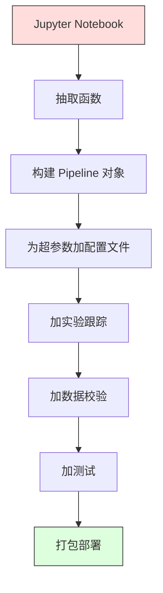

# ML 流水线

> 模型不是产品，流水线才是。流水线是从原始数据到上线预测的全部环节，而且每一步都必须可复现。

**类型：** Build
**语言：** Python
**前置要求：** 阶段 2 第 12 课（超参数调优）
**预计时间：** ~120 分钟

## 学习目标

- 从零构建一条 ML 流水线，把填充、缩放、编码和模型训练串成一个可复现的对象
- 识别数据泄漏场景，解释流水线如何通过只在训练数据上拟合转换器来防止它
- 构造一个 ColumnTransformer，对数值特征和类别特征施加不同的预处理
- 实现流水线序列化，并演示同一个拟合好的流水线在训练和生产里产出完全相同的结果

## 问题所在

你有一个 notebook，它加载数据、用中位数填缺失值、缩放特征、训练模型、打印准确率。它能跑。你把它上线了。

一个月后，有人重新训练这个模型，得到了不同的结果。中位数是在包含测试数据的整个数据集上算的（数据泄漏）。缩放参数没保存，所以推理时用了不同的统计量。特征工程代码在训练和服务之间被复制粘贴，两份副本逐渐分叉。一个类别列在生产里出现了编码器从没见过的新值。

这些都不是假想。它们是 ML 系统在生产里翻车最常见的原因。流水线把每一个转换步骤打包进一个单一、有序、可复现的对象，从而把它们全解决了。

## 核心概念

### 流水线是什么

流水线是一连串有序的数据转换，后面接一个模型。每一步把上一步的输出当输入。整条流水线在训练数据上拟合一次。推理时，同一条拟合好的流水线转换新数据并产出预测。


流水线保证：
- 转换只在训练数据上拟合（不泄漏）
- 推理时施加相同的转换
- 整个对象可以序列化、作为一个产物部署
- 交叉验证对每一折应用流水线，防止微妙的泄漏

### 数据泄漏：沉默的杀手

数据泄漏发生在测试集或未来数据的信息污染了训练时。流水线防止最常见的几种形式。

**有泄漏（错误）：**
```python
X = df.drop("target", axis=1)
y = df["target"]

scaler = StandardScaler()
X_scaled = scaler.fit_transform(X)

X_train, X_test = X_scaled[:800], X_scaled[800:]
y_train, y_test = y[:800], y[800:]
```

缩放器看到了测试数据。均值和标准差包含了测试样本。这会虚高准确率估计。

**正确：**
```python
X_train, X_test = X[:800], X[800:]

scaler = StandardScaler()
X_train_scaled = scaler.fit_transform(X_train)
X_test_scaled = scaler.transform(X_test)
```

有了流水线，你根本不用操心这件事。流水线自动处理它。

### sklearn Pipeline

sklearn 的 `Pipeline` 把转换器和一个估计器串起来。它暴露 `.fit()`、`.predict()` 和 `.score()`，按顺序应用所有步骤。

```python
from sklearn.pipeline import Pipeline
from sklearn.preprocessing import StandardScaler
from sklearn.linear_model import LogisticRegression

pipe = Pipeline([
    ("scaler", StandardScaler()),
    ("model", LogisticRegression()),
])

pipe.fit(X_train, y_train)
predictions = pipe.predict(X_test)
```

当你调用 `pipe.fit(X_train, y_train)`：
1. 缩放器对 X_train 调 `fit_transform`
2. 模型对缩放后的 X_train 调 `fit`

当你调用 `pipe.predict(X_test)`：
1. 缩放器对 X_test 调 `transform`（不是 fit_transform）
2. 模型对缩放后的 X_test 调 `predict`

缩放器在拟合时从不看测试数据。这就是关键所在。

### ColumnTransformer：不同列用不同流水线

真实数据集有数值列和类别列，它们需要不同的预处理。`ColumnTransformer` 处理这个。

```python
from sklearn.compose import ColumnTransformer
from sklearn.preprocessing import StandardScaler, OneHotEncoder
from sklearn.impute import SimpleImputer

numeric_pipe = Pipeline([
    ("impute", SimpleImputer(strategy="median")),
    ("scale", StandardScaler()),
])

categorical_pipe = Pipeline([
    ("impute", SimpleImputer(strategy="most_frequent")),
    ("encode", OneHotEncoder(handle_unknown="ignore")),
])

preprocessor = ColumnTransformer([
    ("num", numeric_pipe, ["age", "income", "score"]),
    ("cat", categorical_pipe, ["city", "gender", "plan"]),
])

full_pipeline = Pipeline([
    ("preprocess", preprocessor),
    ("model", GradientBoostingClassifier()),
])
```

OneHotEncoder 里的 `handle_unknown="ignore"` 对生产至关重要。当出现一个新类别（模型从没见过的城市）时，它产出一个零向量而不是崩溃。

### 实验跟踪

流水线让训练可复现，但你还需要跟踪各次实验里发生了什么：用了哪些超参数、哪个数据集版本、指标是多少、跑的是哪份代码。

**MLflow** 是最常见的开源方案：

```python
import mlflow

with mlflow.start_run():
    mlflow.log_param("max_depth", 5)
    mlflow.log_param("n_estimators", 100)
    mlflow.log_param("learning_rate", 0.1)

    pipe.fit(X_train, y_train)
    accuracy = pipe.score(X_test, y_test)

    mlflow.log_metric("accuracy", accuracy)
    mlflow.sklearn.log_model(pipe, "model")
```

每次运行都连同参数、指标、产物和完整模型被记录下来。你可以对比运行、复现任意实验、部署任意模型版本。

**Weights & Biases（wandb）** 提供同样的功能，外加一个托管的仪表盘：

```python
import wandb

wandb.init(project="my-pipeline")
wandb.config.update({"max_depth": 5, "n_estimators": 100})

pipe.fit(X_train, y_train)
accuracy = pipe.score(X_test, y_test)

wandb.log({"accuracy": accuracy})
```

### 模型版本管理

跟踪完实验，你需要管理模型版本。哪个模型在生产里？哪个在预发？哪个是上周的？

MLflow 的 Model Registry 提供：
- **版本跟踪：** 每个保存的模型获得一个版本号
- **阶段转换：** "Staging"、"Production"、"Archived"
- **审批流程：** 模型必须显式提升到生产
- **回滚：** 瞬间切回上一个版本

### 用 DVC 做数据版本管理

代码用 git 做版本管理。数据也应该做版本管理，但 git 处理不了大文件。DVC（Data Version Control）解决这个问题。

```
dvc init
dvc add data/training.csv
git add data/training.csv.dvc data/.gitignore
git commit -m "Track training data"
dvc push
```

DVC 把实际数据存在远程存储（S3、GCS、Azure），在 git 里保留一个记录哈希的小 `.dvc` 文件。当你 checkout 一个 git commit 时，`dvc checkout` 恢复当时用的那份确切数据。

这意味着每个 git commit 都同时钉住了代码和数据。完全可复现。

### 可复现的实验

一个可复现的实验需要四样东西：

1. **固定随机种子：** 给 numpy、random 和框架（torch、sklearn）设种子
2. **钉住依赖：** requirements.txt 或 poetry.lock，带精确版本
3. **版本化的数据：** DVC 或类似工具
4. **配置文件：** 所有超参数放配置里，不硬编码

```python
import numpy as np
import random

def set_seed(seed=42):
    random.seed(seed)
    np.random.seed(seed)
    try:
        import torch
        torch.manual_seed(seed)
        torch.cuda.manual_seed_all(seed)
        torch.backends.cudnn.deterministic = True
    except ImportError:
        pass
```

### 从 notebook 到生产流水线



典型推进路径：

1. **notebook 探索：** 快速实验、可视化、特征想法
2. **抽取函数：** 把预处理、特征工程、评估搬进模块
3. **构建 Pipeline：** 把转换串成一个 sklearn Pipeline 或自定义类
4. **配置管理：** 把所有超参数搬进 YAML/JSON 配置
5. **实验跟踪：** 加 MLflow 或 wandb 日志
6. **数据校验：** 训练前检查 schema、分布和缺失值模式
7. **测试：** 转换器的单元测试、整条流水线的集成测试
8. **部署：** 序列化流水线，包进一个 API（FastAPI、Flask），容器化

### 常见的流水线错误

| 错误 | 为什么糟糕 | 解法 |
|---------|-------------|-----|
| 划分前在全部数据上拟合 | 数据泄漏 | 用 Pipeline 配 cross_val_score |
| 特征工程在流水线之外 | 训练和服务的转换不同 | 把所有转换放进 Pipeline |
| 不处理未知类别 | 生产遇到新值就崩 | OneHotEncoder(handle_unknown="ignore") |
| 硬编码列名 | schema 一变就坏 | 用配置里的列名列表 |
| 没有数据校验 | 坏数据上悄无声息地预测错 | 预测前加 schema 检查 |
| 训练/服务偏差 | 模型在生产里看到不同的特征 | 训练和服务共用一个 Pipeline 对象 |

## 动手构建

`code/pipeline.py` 里的代码从零构建一条完整的 ML 流水线：

### 第 1 步：自定义转换器

```python
class CustomTransformer:
    def __init__(self):
        self.means = None
        self.stds = None

    def fit(self, X):
        self.means = np.mean(X, axis=0)
        self.stds = np.std(X, axis=0)
        self.stds[self.stds == 0] = 1.0
        return self

    def transform(self, X):
        return (X - self.means) / self.stds

    def fit_transform(self, X):
        return self.fit(X).transform(X)
```

### 第 2 步：从零实现流水线

```python
class PipelineFromScratch:
    def __init__(self, steps):
        self.steps = steps

    def fit(self, X, y=None):
        X_current = X.copy()
        for name, step in self.steps[:-1]:
            X_current = step.fit_transform(X_current)
        name, model = self.steps[-1]
        model.fit(X_current, y)
        return self

    def predict(self, X):
        X_current = X.copy()
        for name, step in self.steps[:-1]:
            X_current = step.transform(X_current)
        name, model = self.steps[-1]
        return model.predict(X_current)
```

### 第 3 步：用流水线做交叉验证

代码演示用流水线做交叉验证如何防止数据泄漏：缩放器在每一折的训练数据上单独拟合。

### 第 4 步：用 sklearn 搭完整生产流水线

一条完整流水线，带 `ColumnTransformer`、多条预处理路径和一个模型，用恰当的交叉验证和实验日志训练。

## 交付

本节课产出：
- `outputs/prompt-ml-pipeline.md` -- 一个构建和调试 ML 流水线的 skill
- `code/pipeline.py` -- 从零到 sklearn 的完整流水线

## 练习

1. 构建一条处理 3 个数值列和 2 个类别列数据集的流水线。用 `ColumnTransformer` 对数值列做中位数填充 + 缩放，对类别列做众数填充 + one-hot 编码。用 5 折交叉验证训练。

2. 故意引入数据泄漏：划分前在整个数据集上拟合缩放器。对比交叉验证分数（有泄漏）和流水线交叉验证分数（干净）。差多大？

3. 用 `joblib.dump` 序列化你的流水线。在另一个脚本里加载它并跑预测。验证预测完全一致。

4. 给流水线加一个自定义转换器，为两个最重要的数值列创建多项式特征（2 次）。它应该放在流水线的什么位置？

5. 为流水线配上 MLflow 跟踪。用不同超参数跑 5 个实验。用 MLflow UI（`mlflow ui`）对比运行并挑出最佳模型。

## 关键术语

| 术语 | 大家怎么说 | 它实际是什么 |
|------|----------------|----------------------|
| 流水线 | "转换链 + 模型" | 一连串拟合好的转换器加一个模型，作为一个整体应用以防泄漏 |
| 数据泄漏 | "测试信息泄进训练" | 用训练集之外的信息来建模，虚高性能估计 |
| ColumnTransformer | "每列不同的预处理" | 对不同列子集应用不同流水线，再合并结果 |
| 实验跟踪 | "记录你的运行" | 为每次训练运行记录参数、指标、产物和代码版本 |
| MLflow | "跟踪并部署模型" | 用于实验跟踪、模型注册和部署的开源平台 |
| DVC | "数据版的 git" | 大数据文件的版本控制系统，哈希存 git、数据存远程存储 |
| 模型注册表 | "模型版本目录" | 一个用阶段标签（staging、production、archived）跟踪模型版本的系统 |
| 训练/服务偏差 | "在 notebook 里是好的" | 训练和推理时数据处理方式的差异，导致悄无声息的错误 |
| 可复现性 | "同样的代码，同样的结果" | 从同样的代码、数据和配置得到完全相同结果的能力 |

## 延伸阅读

- [scikit-learn Pipeline docs](https://scikit-learn.org/stable/modules/compose.html) -- 官方流水线参考
- [MLflow documentation](https://mlflow.org/docs/latest/index.html) -- 实验跟踪和模型注册
- [DVC documentation](https://dvc.org/doc) -- 数据版本管理
- [Sculley et al., Hidden Technical Debt in Machine Learning Systems (2015)](https://papers.nips.cc/paper/2015/hash/86df7dcfd896fcaf2674f757a2463eba-Abstract.html) -- 关于 ML 系统复杂度的开创性论文
- [Google ML Best Practices: Rules of ML](https://developers.google.com/machine-learning/guides/rules-of-ml) -- 实用的生产 ML 建议
