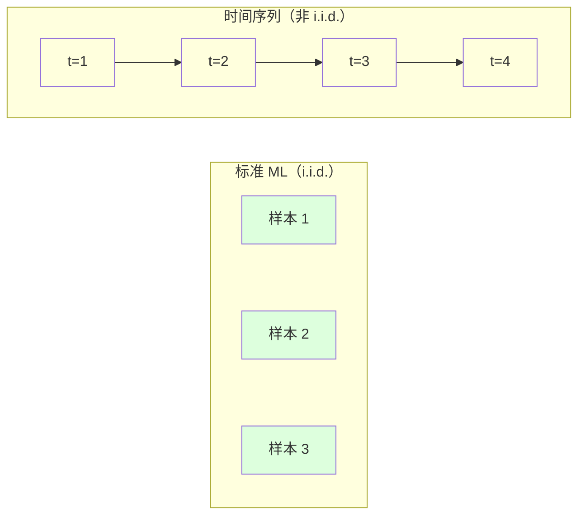
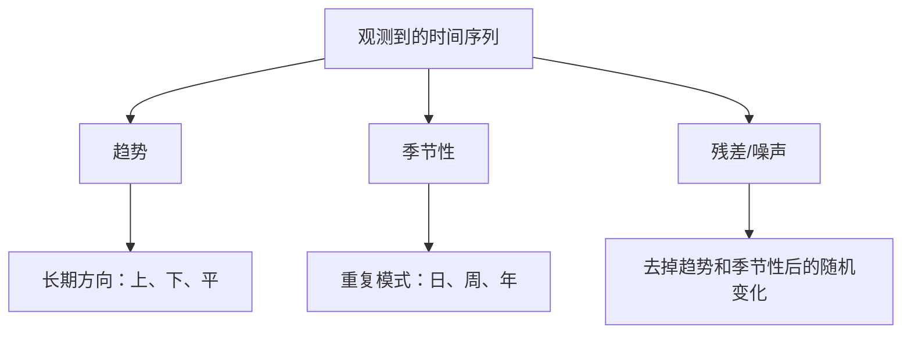
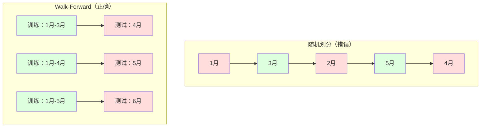

# 时间序列基础

> 过去的表现确实能预测未来的结果 —— 前提是你先检查了平稳性。

**类型：** Build
**语言：** Python
**前置要求：** 阶段 2 第 01-09 课
**预计时间：** ~90 分钟

## 学习目标

- 把一个时间序列分解成趋势、季节性和残差分量，并检验平稳性
- 实现滞后特征和滚动统计量，把时间序列转成监督学习问题
- 构建一个 walk-forward 验证框架，防止未来数据泄漏进训练
- 解释为什么随机训练/测试划分对时间序列无效，并演示它和恰当的时序划分之间的性能差距

## 问题所在

你有按时间排序的数据。每日销售额、每小时温度、每分钟 CPU 使用率、每周股价。你想预测下一个值、下一周、下一季度。

你伸手去拿标准 ML 工具箱：随机训练/测试划分、交叉验证、特征矩阵进、预测出。每一步都错了。

时间序列打破了标准 ML 依赖的假设。样本不独立 —— 今天的温度依赖昨天的。随机划分把未来信息泄漏进过去。在回测里表现亮眼的特征在生产里失败，因为它们依赖的模式随时间漂移。

一个用随机交叉验证拿到 95% 准确率的模型，用恰当的基于时间的评估可能只有 55%。这个差距不是技术细节，它是一个纸面上能用的模型和一个生产里能用的模型之间的差别。

本节课讲基础：什么让时间数据与众不同、如何诚实地评估模型、以及如何把时间序列变成标准 ML 模型能吃的特征。

## 核心概念

### 什么让时间序列与众不同

标准 ML 假设 i.i.d. —— 独立同分布。每个样本都从同一分布抽出，且独立于其他样本。时间序列两条都违反：

- **不独立。** 今天的股价依赖昨天的。本周销售额和上周相关。
- **不同分布。** 分布随时间偏移。12 月的销售额和 3 月的看起来不一样。

这些违反不是小事。它们改变你怎么造特征、怎么评估模型、哪些算法管用。



在标准 ML 里，样本可以互换。打乱它们什么都不改变。在时间序列里，顺序就是一切。打乱会摧毁信号。

### 时间序列的分量

每个时间序列都是这些的组合：



- **趋势**：长期方向。营收每年增长 10%。全球气温上升。
- **季节性**：固定间隔上重复的模式。零售销售在 12 月飙升。空调使用在 7 月达峰。
- **残差**：去掉趋势和季节性后剩下的一切。如果残差看起来像白噪声，那分解就抓住了信号。

### 平稳性

如果一个时间序列的统计性质（均值、方差、自相关）不随时间变化，它就是平稳的。大多数预测方法假设平稳性。

**为什么重要：** 非平稳序列的均值会漂移。一个在 1 月数据上训练的模型，学到的均值和 2 月将呈现的不同。它会系统性地出错。

**怎么检查：** 在窗口上计算滚动均值和滚动标准差。如果它们漂移，序列就是非平稳的。

**怎么修：** 差分。不建模原始值，而是建模相邻值之间的变化：

```
diff[t] = value[t] - value[t-1]
```

如果一轮差分没让序列平稳，就再做一轮（二阶差分）。大多数现实序列最多需要两轮。

**例子：**

原始序列：[100, 102, 106, 112, 120]
一阶差分：[2, 4, 6, 8]（仍在上升趋势）
二阶差分：[2, 2, 2]（常数 —— 平稳）

原始序列有二次趋势。一阶差分把它变成线性趋势。二阶差分把它压平。实践中你很少需要超过两轮。

**正式检验：** Augmented Dickey-Fuller（ADF）检验是平稳性的标准统计检验。零假设是"序列非平稳"。p 值低于 0.05 意味着你可以拒绝零假设、断定平稳。我们不从零实现 ADF（它需要渐近分布表），但我们代码里的滚动统计量方法给出一个实用的视觉检查。

### 自相关

自相关衡量时刻 t 的值和时刻 t-k（过去 k 步）的值相关多少。自相关函数（ACF）为每个滞后 k 画出这个相关性。

**ACF 告诉你：**
- 序列记得多久之前。如果 ACF 在滞后 5 之后掉到零，那 5 步以前的值就无关了。
- 是否存在季节性。如果 ACF 在滞后 12（月度数据）处出现尖峰，就有年度季节性。
- 该造多少滞后特征。用到 ACF 变得可忽略的那个滞后。

**PACF（偏自相关函数）** 去掉间接相关。如果今天和 3 天前相关只是因为两者都和昨天相关，那滞后 3 的 PACF 会是零，而滞后 3 的 ACF 不是。

### 滞后特征：把时间序列变成监督学习

标准 ML 模型需要一个特征矩阵 X 和一个目标 y。时间序列给你的是单独一列值。桥梁就是滞后特征。

拿序列 [10, 12, 14, 13, 15]，造 lag-1 和 lag-2 特征：

| lag_2 | lag_1 | target |
|-------|-------|--------|
| 10    | 12    | 14     |
| 12    | 14    | 13     |
| 14    | 13    | 15     |

现在你有了一个标准回归问题。任何 ML 模型（线性回归、随机森林、梯度提升）都能从滞后值预测目标。

你还能造的额外特征：
- **滚动统计量：** 最近 k 个值的均值、标准差、最小值、最大值
- **日历特征：** 星期几、月份、is_holiday、is_weekend
- **差分值：** 相对前一步的变化
- **扩展统计量：** 累积均值、累积和
- **比值特征：** 当前值 / 滚动均值（离近期均值多远）
- **交互特征：** lag_1 * day_of_week（星期对动量的影响）

**用多少滞后？** 用自相关函数。如果 ACF 到滞后 10 都显著，就至少用 10 个滞后。如果有周度季节性，就包含滞后 7（可能还有 14）。滞后越多给模型越多历史，但也越多特征要拟合，增加过拟合风险。

**目标对齐陷阱。** 造滞后特征时，目标必须是时刻 t 的值，所有特征都必须用时刻 t-1 或更早的值。如果你不小心把时刻 t 的值当成了特征，你就有了一个完美的预测器 —— 也是一个完全无用的模型。这是时间序列特征工程里最常见的 bug。

### Walk-Forward 验证

这是本课最重要的概念。标准 k 折交叉验证随机把样本分给训练和测试。对时间序列，这会泄漏未来信息。



Walk-forward 验证：
1. 在时刻 t 之前的数据上训练
2. 预测时刻 t+1（多步则 t+1 到 t+k）
3. 把窗口往前滑
4. 重复

每个测试折只包含排在所有训练数据之后的数据。没有未来泄漏。这给你一个模型部署后表现如何的诚实估计。

**扩展窗口**用全部历史数据训练（窗口增长）。**滑动窗口**用固定大小的训练窗口（窗口滑动）。当你认为旧数据仍然相关时用扩展。当世界在变、旧数据有害时用滑动。

### ARIMA 直觉

ARIMA 是经典时间序列模型。它有三个分量：

- **AR（自回归）：** 从过去的值预测。AR(p) 用最近 p 个值。
- **I（积分）：** 差分以达到平稳。I(d) 做 d 轮差分。
- **MA（移动平均）：** 从过去的预测误差预测。MA(q) 用最近 q 个误差。

ARIMA(p, d, q) 把三者结合。你根据 ACF/PACF 分析或自动搜索（auto-ARIMA）来选 p、d、q。

我们不从零实现 ARIMA —— 它需要超出本课范围的数值优化。关键洞察是理解每个分量做什么，这样你能解读 ARIMA 结果、知道何时用它。

### 何时用什么

| 方法 | 最适合 | 处理季节性 | 处理外部特征 |
|----------|---------|-------------------|------------------------|
| 滞后特征 + ML | 有许多外部特征的表格 | 配日历特征可以 | 可以 |
| ARIMA | 单变量序列、短期 | SARIMA 变体 | 不行（ARIMAX 有限支持） |
| 指数平滑 | 简单趋势 + 季节性 | 可以（Holt-Winters） | 不行 |
| Prophet | 业务预测、节假日 | 可以（傅里叶项） | 有限 |
| 神经网络（LSTM、Transformer） | 长序列、多序列 | 自己学 | 可以 |

对大多数实际问题，滞后特征 + 梯度提升是最强的起点。它天然处理外部特征、不要求平稳、易于调试。

### 预测时长与策略

单步预测预测往后一个时间步。多步预测预测多个时间步。有三种策略：

**递归（迭代）：** 预测往后一步，把预测当作下一步的输入。简单但误差累积 —— 每个预测都用上一个预测，所以错误层层叠加。

**直接：** 为每个时长训练一个单独的模型。模型 1 预测 t+1，模型 5 预测 t+5。没有误差累积，但每个模型训练样本更少，且它们不共享信息。

**多输出：** 训练一个同时输出所有时长的模型。跨时长共享信息，但需要支持多输出的模型（或自定义损失函数）。

对大多数实际问题，短时长（1-5 步）从递归开始，长时长用直接。

### 时间序列的常见错误

| 错误 | 为什么会发生 | 怎么修 |
|---------|---------------|-----------|
| 随机训练/测试划分 | 标准 ML 的习惯 | 用 walk-forward 或时序划分 |
| 使用未来特征 | 时刻 t 的特征被错误地包含进来 | 审计每个特征的时间对齐 |
| 过拟合季节性 | 模型背下日历模式 | 在测试集里留出一个完整季节周期 |
| 忽略尺度变化 | 营收翻倍但模式不变 | 建模百分比变化而非绝对值 |
| 滞后特征太多 | "历史越多越好" | 用 ACF 决定相关的滞后 |
| 不差分 | "模型会自己搞定" | 树模型能处理趋势；线性模型需要平稳 |

## 动手构建

`code/time_series.py` 里的代码从零实现核心构件。

### 滞后特征生成器

```python
def make_lag_features(series, n_lags):
    n = len(series)
    X = np.full((n, n_lags), np.nan)
    for lag in range(1, n_lags + 1):
        X[lag:, lag - 1] = series[:-lag]
    valid = ~np.isnan(X).any(axis=1)
    return X[valid], series[valid]
```

这把一维序列转成一个特征矩阵，其中每行把最近 `n_lags` 个值当特征、把当前值当目标。

### Walk-Forward 交叉验证

```python
def walk_forward_split(n_samples, n_splits=5, min_train=50):
    assert min_train < n_samples, "min_train must be less than n_samples"
    step = max(1, (n_samples - min_train) // n_splits)
    for i in range(n_splits):
        train_end = min_train + i * step
        test_end = min(train_end + step, n_samples)
        if train_end >= n_samples:
            break
        yield slice(0, train_end), slice(train_end, test_end)
```

每次划分都确保训练数据严格排在测试数据之前。训练窗口随每一折扩展。

### 简单自回归模型

纯 AR 模型就是在滞后特征上做线性回归：

```python
class SimpleAR:
    def __init__(self, n_lags=5):
        self.n_lags = n_lags
        self.weights = None
        self.bias = None

    def fit(self, series):
        X, y = make_lag_features(series, self.n_lags)
        # 用正规方程求解
        X_b = np.column_stack([np.ones(len(X)), X])
        theta = np.linalg.lstsq(X_b, y, rcond=None)[0]
        self.bias = theta[0]
        self.weights = theta[1:]
        return self
```

这在概念上和第 02 课的线性回归一模一样，只不过应用到同一变量的时间滞后版本上。

### 平稳性检查

代码计算滚动统计量来从视觉和数值上评估平稳性：

```python
def check_stationarity(series, window=50):
    rolling_mean = np.array([
        series[max(0, i - window):i].mean()
        for i in range(1, len(series) + 1)
    ])
    rolling_std = np.array([
        series[max(0, i - window):i].std()
        for i in range(1, len(series) + 1)
    ])
    return rolling_mean, rolling_std
```

如果滚动均值漂移或滚动标准差变化，序列就是非平稳的。做差分再检查。

代码还通过对比序列的前半段和后半段来检查平稳性。如果两段均值相差超过半个标准差，或方差比超过 2 倍，序列就被标为非平稳。

### 自相关

```python
def autocorrelation(series, max_lag=20):
    n = len(series)
    mean = series.mean()
    var = series.var()
    acf = np.zeros(max_lag + 1)
    for k in range(max_lag + 1):
        cov = np.mean((series[:n-k] - mean) * (series[k:] - mean))
        acf[k] = cov / var if var > 0 else 0
    return acf
```

## 上手使用

用 sklearn，你直接把滞后特征喂给任意回归器：

```python
from sklearn.linear_model import Ridge
from sklearn.ensemble import GradientBoostingRegressor

X, y = make_lag_features(series, n_lags=10)

for train_idx, test_idx in walk_forward_split(len(X)):
    model = Ridge(alpha=1.0)
    model.fit(X[train_idx], y[train_idx])
    predictions = model.predict(X[test_idx])
```

ARIMA 用 statsmodels：

```python
from statsmodels.tsa.arima.model import ARIMA

model = ARIMA(train_series, order=(5, 1, 2))
fitted = model.fit()
forecast = fitted.forecast(steps=30)
```

`time_series.py` 里的代码演示这两种方法，并用 walk-forward 验证对比它们。

### sklearn TimeSeriesSplit

sklearn 提供 `TimeSeriesSplit`，它实现了 walk-forward 验证：

```python
from sklearn.model_selection import TimeSeriesSplit

tscv = TimeSeriesSplit(n_splits=5)
for train_index, test_index in tscv.split(X):
    X_train, X_test = X[train_index], X[test_index]
    y_train, y_test = y[train_index], y[test_index]
    model.fit(X_train, y_train)
    score = model.score(X_test, y_test)
```

这和我们从零实现的 `walk_forward_split` 等价，但集成进了 sklearn 的交叉验证框架。你可以配 `cross_val_score` 用：

```python
from sklearn.model_selection import cross_val_score

scores = cross_val_score(model, X, y, cv=TimeSeriesSplit(n_splits=5))
print(f"Mean score: {scores.mean():.4f} +/- {scores.std():.4f}")
```

### 评估指标

时间序列预测用回归指标，但带时间感知的上下文：

- **MAE（平均绝对误差）：** |y_true - y_pred| 的平均。在原始单位里易解读。"平均而言，预测偏差 3.2 度。"
- **RMSE（均方根误差）：** 均方误差的平方根。对大误差的惩罚比 MAE 重。当大误差比许多小误差更糟时用。
- **MAPE（平均绝对百分比误差）：** |error / true_value| * 100 的平均。与尺度无关，便于跨不同序列对比。但真实值为零时无定义。
- **朴素基线对比：** 永远和简单基线对比。季节朴素基线预测一个周期前的值（昨天、上周）。如果你的模型连朴素基线都赢不了，那肯定有问题。

### 滚动特征

代码演示给滞后特征加上滚动统计量（7 天和 14 天窗口的均值、标准差、最小值、最大值）。这些给模型提供了滞后特征单独捕捉不到的近期趋势和波动信息。

举例来说，如果滚动均值在上升，提示一个上升趋势。如果滚动标准差在增加，提示波动在增长。这些是树模型能学到、而线性模型学不到的那种模式。

## 交付

本节课产出：
- `outputs/prompt-time-series-advisor.md` -- 一个框定时间序列问题的提示词
- `code/time_series.py` -- 滞后特征、walk-forward 验证、AR 模型、平稳性检查

### 你必须打败的基线

构建任何模型之前，先确立基线：

1. **上一个值（持久性）。** 预测明天和今天一样。对许多序列，这意外地难以打败。
2. **季节朴素。** 预测今天和上周（或去年）同一天一样。如果你的模型连这都赢不了，它除了季节性没学到任何有用模式。
3. **移动平均。** 预测最近 k 个值的平均。平滑噪声但抓不住突变。

如果你花哨的 ML 模型输给了季节朴素基线，那你有 bug。最常见的是：特征里有未来泄漏、评估方法错了，或者序列真的是随机且不可预测的。

### 实用贴士

1. **从画图开始。** 任何建模之前，画出原始序列。找趋势、季节性、离群点、结构性断裂（行为突变）。30 秒的视觉检查往往比一小时的自动分析告诉你更多。

2. **先差分，后建模。** 如果序列有明显趋势，造滞后特征前先差分它。树模型能处理趋势，但线性模型不能，而差分从不会有害。

3. **至少留出一个完整季节周期。** 如果你有周度季节性，测试集需要至少一个完整的周。如果是月度，至少一个完整的月。否则你没法评估模型有没有抓住季节模式。

4. **在生产里监控。** 时间序列模型随世界变化而退化。在滚动基础上跟踪预测误差。误差开始增加时，用近期数据重训模型。

5. **当心机制变化（regime change）。** 在疫情前数据上训练的模型预测不了疫情后的行为。把已知机制变化的指示器当特征，或用一个忘记旧数据的滑动窗口。

6. **对偏斜序列做对数变换。** 营收、价格和计数常常右偏。取对数稳定方差、把乘性模式变成加性，这是线性模型能处理的。在对数空间预测，再取指数回到原始单位。

## 练习

1. **平稳性实验。** 生成一个有线性趋势的序列。用滚动统计量检查平稳性。做一阶差分。再检查。一个二次趋势需要几轮差分？

2. **滞后选择。** 对一个季节序列（周期=7）计算 ACF。哪些滞后自相关最高？只用那些滞后（而非连续滞后）造滞后特征。和用滞后 1 到 7 相比准确率提升了吗？

3. **Walk-forward vs 随机划分。** 在滞后特征上训练一个 Ridge 回归。用随机 80/20 划分和 walk-forward 验证分别评估。随机划分把性能高估了多少？

4. **特征工程。** 给滞后特征加上滚动均值（窗口=7）、滚动标准差（窗口=7）和星期几特征。用 walk-forward 验证对比加和不加这些额外特征的准确率。

5. **多步预测。** 修改 AR 模型，让它预测往后 5 步而不是 1 步。对比两种策略：(a) 预测一步，把预测当下一步的输入（递归），(b) 为每个时长训练单独的模型（直接）。哪个更准？

## 关键术语

| 术语 | 大家怎么说 | 它实际是什么 |
|------|----------------|----------------------|
| 平稳性 | "统计量不随时间变" | 一个均值、方差和自相关结构随时间恒定的序列 |
| 差分 | "相邻值相减" | 计算 y[t] - y[t-1] 以去掉趋势、达到平稳 |
| 自相关（ACF） | "序列和自己相关多少" | 时间序列和它的滞后副本之间的相关性，作为滞后的函数 |
| 偏自相关（PACF） | "只算直接相关" | 去掉所有更短滞后的影响后，滞后 k 处的自相关 |
| 滞后特征 | "把过去的值当输入" | 用 y[t-1]、y[t-2]、...、y[t-k] 当特征来预测 y[t] |
| Walk-forward 验证 | "尊重时间的交叉验证" | 训练数据在时间上总是排在测试数据之前的评估 |
| ARIMA | "经典时间序列模型" | 自回归积分移动平均：结合过去的值（AR）、差分（I）和过去的误差（MA） |
| 季节性 | "重复的日历模式" | 时间序列里和日历周期（日、周、年）挂钩的规律可预测的循环 |
| 趋势 | "长期方向" | 序列水平随时间持续的上升或下降 |
| 扩展窗口 | "用全部历史" | 训练集随每一折增长的 walk-forward 验证 |
| 滑动窗口 | "固定大小的历史" | 训练集是一个往前滑的固定长度窗口的 walk-forward 验证 |

## 延伸阅读

- [Hyndman and Athanasopoulos, Forecasting: Principles and Practice (3rd ed.)](https://otexts.com/fpp3/) -- 时间序列预测最好的免费教材
- [scikit-learn Time Series Split](https://scikit-learn.org/stable/modules/generated/sklearn.model_selection.TimeSeriesSplit.html) -- sklearn 的 walk-forward 划分器
- [statsmodels ARIMA docs](https://www.statsmodels.org/stable/generated/statsmodels.tsa.arima.model.ARIMA.html) -- 带诊断的 ARIMA 实现
- [Makridakis et al., The M5 Competition (2022)](https://www.sciencedirect.com/science/article/pii/S0169207021001874) -- 展示 ML 方法 vs 统计方法的大规模预测比赛
