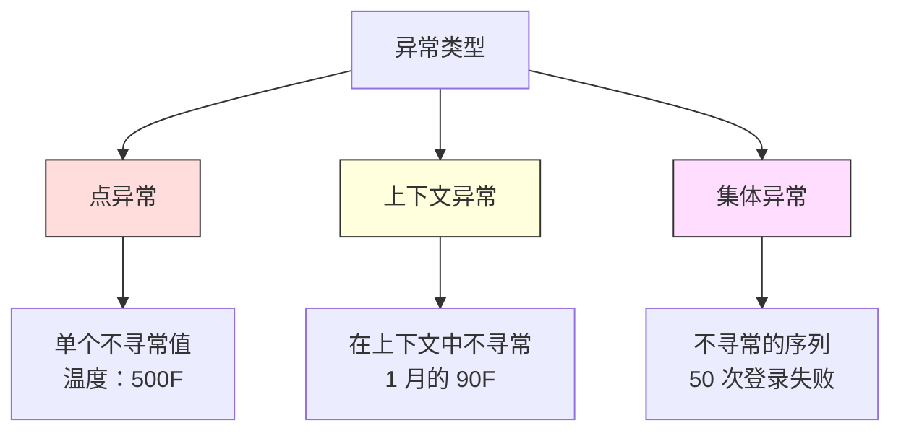
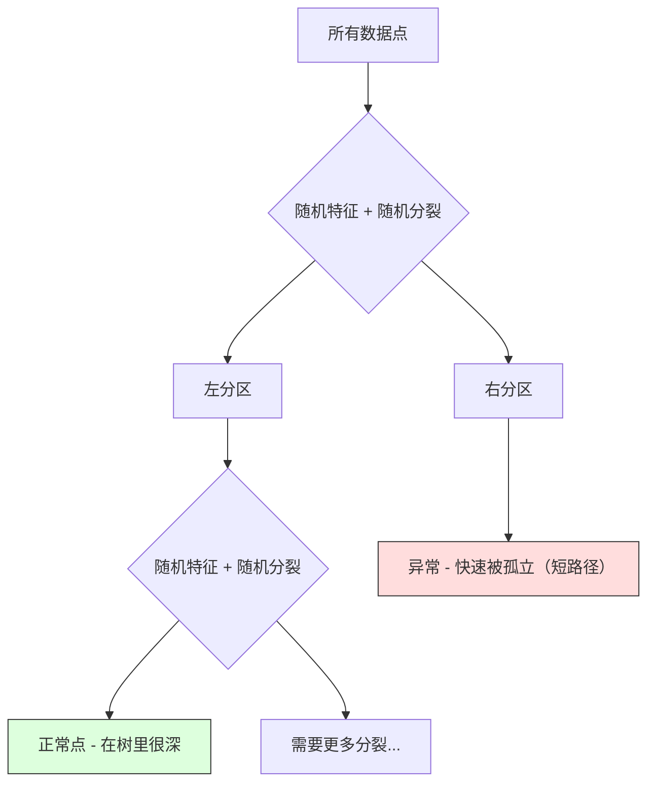
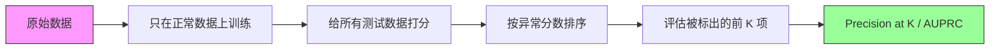

# 异常检测

> 正常很容易定义。异常就是任何不合群的东西。

**类型：** Build
**语言：** Python
**前置要求：** 阶段 2 第 01-09 课
**预计时间：** ~75 分钟

## 学习目标

- 从零实现 Z-score、IQR 和孤立森林异常检测方法
- 区分点异常、上下文异常和集体异常，为各自选对检测方法
- 解释为什么异常检测被框定为建模正常数据，而不是给异常分类
- 对比无监督异常检测和监督分类，评估新型异常覆盖率和精确率之间的权衡

## 问题所在

一张信用卡下午 2 点在纽约刷，2 点 05 分又在东京刷。一个工厂传感器读出 150 度，而正常范围是 80-120。一台服务器每秒发 50000 个请求，而日均是 200。

这些都是异常。找到它们很重要。欺诈造成数十亿损失。设备故障造成停机。网络入侵造成数据泄露。

难点在于：你很少有异常的标注样本。欺诈只占交易的 0.1%。设备故障一年发生几次。你训不了标准分类器，因为"异常"类里几乎没东西可学。就算你有一些标签，你见过的异常也不是你将遇到的全部类型。明天的欺诈手法和今天的长得不一样。

异常检测把问题翻转过来。不去学什么是异常，而是学什么是正常。任何偏离正常的东西都可疑。这不需要标签、适应新型异常、并能扩展到海量数据集。

## 核心概念

### 异常的类型

并非所有异常都一样：

- **点异常。** 单个数据点本身就不寻常，与上下文无关。读出 500 度的温度。一个平时只花 50 美元的账户出现一笔 50000 美元的交易。
- **上下文异常。** 给定上下文后才不寻常的数据点。90 度的温度在夏天正常、在冬天异常。同样的值，不同的上下文。
- **集体异常。** 作为一组才不寻常的一连串数据点，尽管单个点可能正常。五次登录失败正常。连续五十次是暴力破解攻击。

大多数方法检测点异常。上下文异常需要时间或位置特征。集体异常需要序列感知的方法。



### 无监督的框定

在标准分类里，你有两个类的标签。在异常检测里，你通常处于三种情况之一：

1. **完全无监督。** 完全没标签。你在所有数据上拟合检测器，寄希望于异常稀少到不会污染"正常"模型。
2. **半监督。** 你有一个只含正常数据的干净数据集。你在这个干净集上拟合，给其他一切打分。这是可能时最强的设置。
3. **弱监督。** 你有少量标注的异常。用它们来评估，不用来训练。无监督训练，再在标注子集上测量精确率/召回率。

关键洞察：异常检测和分类根本不同。你建模的是正常数据的分布，而不是两个类之间的决策边界。

### 监督 vs 无监督：权衡

如果你确实有标注的异常，你该用它们来训练（监督分类）还是只用来评估（无监督检测）？

**监督（当分类处理）：**
- 抓住你之前见过的确切异常类型
- 对已知异常类型精确率更高
- 完全错过新型异常类型
- 出现新异常类型时需要重训
- 需要足够多的异常样本（往往太少）

**无监督（建模正常、标出偏离）：**
- 抓住任何偏离正常的东西，包括新型
- 不需要标注的异常
- 假正例率更高（不是所有不寻常的都坏）
- 对分布偏移更稳健

实践中，最好的系统两者结合：无监督检测做宽覆盖、监督模型管已知高优先级异常类型、人工审核处理含糊的情况。

### Z-Score 方法

最简单的办法。计算每个特征的均值和标准差。标出任何离均值超过 k 个标准差的点。

```text
z_score = (x - mean) / std
anomaly if |z_score| > threshold
```

默认阈值是 3.0（对高斯分布，99.7% 的正常数据落在 3 个标准差内）。

**优势：** 简单。快。可解释（"这个值离正常 4.5 个标准差"）。

**弱点：** 假设数据正态分布。对训练数据里的离群点敏感（离群点拉偏均值、抬高标准差，让它们更难被检测到）。在多峰分布上失败。

**何时好用：** 数据大致钟形的单特征监控。服务器响应时间、制造公差、基线稳定的传感器读数。

**何时失败：** 多簇数据（两个基线温度不同的办公地点）、偏斜数据（交易额里 1000 美元罕见但不异常）、训练集里有离群点的数据。

### IQR 方法

比 Z-score 更稳健。用四分位距代替均值和标准差。

```
Q1 = 25th percentile
Q3 = 75th percentile
IQR = Q3 - Q1
lower_bound = Q1 - factor * IQR
upper_bound = Q3 + factor * IQR
anomaly if x < lower_bound or x > upper_bound
```

默认因子是 1.5。

**优势：** 对离群点稳健（分位数不受极端值影响）。在偏斜分布上工作。无正态假设。

**弱点：** 仅单变量（对每个特征独立应用）。检测不到只有把特征放在一起看才不寻常的异常（一个点在每个特征上单独看都正常，但在联合空间里异常）。

**实用说明：** IQR 里的 1.5 因子对应箱线图里的须。须之外的点是潜在离群点。用 3.0 代替 1.5 让检测器更保守（更少标记、更少假正例）。正确的因子取决于你对误报的容忍度。

### 孤立森林

关键洞察：异常又少又不同。在数据的随机划分里，异常更容易被孤立 —— 把它们从其余部分分开需要的随机分裂更少。



**它怎么工作：**
1. 建许多随机树（一片孤立森林）
2. 在每个节点，挑一个随机特征和一个在该特征 min 和 max 之间的随机分裂值
3. 一直分裂直到每个点都被孤立（独占一个叶子）
4. 异常在所有树上的平均路径长度更短

**它为什么管用：** 正常点住在稠密区域。要把一个点从邻居中孤立出来需要许多次随机分裂。异常住在稀疏区域。一两次随机分裂就够把它们孤立。

异常分数基于所有树上的平均路径长度，用随机二叉搜索树的期望路径长度归一化：

```
score(x) = 2^(-average_path_length(x) / c(n))
```

其中 `c(n)` 是 n 个样本的期望路径长度。分数接近 1 意味着异常。接近 0.5 意味着正常。接近 0 意味着非常正常（深藏在稠密簇里）。

**优势：** 无分布假设。在高维下工作。扩展性好（关于样本量是亚线性的，因为每棵树用一个子样本）。处理混合特征类型。

**弱点：** 对稠密区域里的异常吃力（掩蔽效应）。许多特征无关时随机分裂效果较差。

**关键超参数：**
- `n_estimators`：树的数量。100 通常够。更多树给更稳定的分数但计算更慢。
- `max_samples`：每棵树的样本数。原论文默认 256。更小的值让单棵树不那么准但增加多样性。子采样正是孤立森林快的原因 —— 每棵树只看数据的一小部分。
- `contamination`：异常的预期比例。只用来设阈值，不影响分数本身。

### 局部离群因子（LOF）

LOF 把一个点周围的局部密度和它邻居周围的密度对比。一个处于稀疏区域、被稠密区域包围的点是异常的。

**它怎么工作：**
1. 对每个点，找它的 k 个最近邻
2. 计算局部可达密度（邻域有多稠密）
3. 把每个点的密度和它邻居的密度对比
4. 如果一个点的密度比它的邻居低得多，它就是离群点

**LOF 分数：**
- LOF 接近 1.0 意味着和邻居密度相似（正常）
- LOF 大于 1.0 意味着比邻居密度低（可能异常）
- LOF 远大于 1.0（比如 2.0+）意味着显著更低的密度（很可能是异常）

"局部"这部分至关重要。设想一个有两个簇的数据集：一个 1000 点的稠密簇和一个 50 点的稀疏簇。稀疏簇边缘的一个点全局上不算不寻常 —— 它有 50 个邻居。但如果它的紧邻邻居比它稠密，它就是局部不寻常的。LOF 捕捉到全局方法错过的这个微妙之处。

**优势：** 检测局部异常（在邻域里不寻常的点，哪怕全局上不算不寻常）。在密度不同的簇上工作。

**弱点：** 在大数据集上慢（朴素实现是 O(n^2)）。对 k 的选择敏感。在很高维下工作不好（维度灾难影响距离计算）。

### 对比

| 方法 | 假设 | 速度 | 处理高维 | 检测局部异常 |
|--------|------------|-------|-------------------|------------------------|
| Z-score | 正态分布 | 非常快 | 可以（逐特征） | 不行 |
| IQR | 无（逐特征） | 非常快 | 可以（逐特征） | 不行 |
| 孤立森林 | 无 | 快 | 可以 | 部分 |
| LOF | 距离有意义 | 慢 | 较差 | 可以 |

### 评估的挑战

评估异常检测器比评估分类器更难：

- **极端类别不平衡。** 0.1% 异常时，对一切都预测"正常"能拿 99.9% 准确率。准确率没用。
- **AUROC 会误导。** 重度不平衡下，即使模型在实际阈值上漏掉大部分异常，AUROC 也能看起来很好。
- **更好的指标：** Precision@k（被标出的前 k 项里有多少是真异常）、AUPRC（精确率-召回率曲线下面积）、固定假正例率下的召回率。



### 异常检测流水线

实践中，异常检测走这个工作流：

1. **收集基线数据。** 理想情况下，一段你知道没有（或极少）异常的时期。
2. **特征工程。** 原始特征加派生特征（滚动统计量、时间特征、比值）。
3. **训练检测器。** 在基线数据上拟合。模型学习"正常"长什么样。
4. **给新数据打分。** 每个新观测获得一个异常分数。
5. **阈值选择。** 选分数截断点。这是个业务决策：阈值越高意味着误报越少但漏掉的异常越多。
6. **告警并调查。** 被标出的点交给人工审核或自动响应。
7. **收集反馈。** 记录被标出的项是真异常还是误报。用这些数据来评估检测器、随时间调整阈值。

这条流水线永远不会"完工"。数据分布漂移、新异常类型出现、阈值需要调整。把异常检测当作一个活的系统，而不是一次性模型。

## 动手构建

`code/anomaly_detection.py` 里的代码从零实现 Z-score、IQR 和孤立森林。

### Z-Score 检测器

```python
def zscore_detect(X, threshold=3.0):
    mean = X.mean(axis=0)
    std = X.std(axis=0)
    std[std == 0] = 1.0
    z = np.abs((X - mean) / std)
    return z.max(axis=1) > threshold
```

简单且向量化。任何特征超过阈值就标记一个点。

### IQR 检测器

```python
def iqr_detect(X, factor=1.5):
    q1 = np.percentile(X, 25, axis=0)
    q3 = np.percentile(X, 75, axis=0)
    iqr = q3 - q1
    iqr[iqr == 0] = 1.0
    lower = q1 - factor * iqr
    upper = q3 + factor * iqr
    outside = (X < lower) | (X > upper)
    return outside.any(axis=1)
```

### 从零实现孤立森林

从零实现构建随机划分特征空间的孤立树：

```python
class IsolationTree:
    def __init__(self, max_depth):
        self.max_depth = max_depth

    def fit(self, X, depth=0):
        n, p = X.shape
        if depth >= self.max_depth or n <= 1:
            self.is_leaf = True
            self.size = n
            return self
        self.is_leaf = False
        self.feature = np.random.randint(p)
        x_min = X[:, self.feature].min()
        x_max = X[:, self.feature].max()
        if x_min == x_max:
            self.is_leaf = True
            self.size = n
            return self
        self.threshold = np.random.uniform(x_min, x_max)
        left_mask = X[:, self.feature] < self.threshold
        self.left = IsolationTree(self.max_depth).fit(X[left_mask], depth + 1)
        self.right = IsolationTree(self.max_depth).fit(X[~left_mask], depth + 1)
        return self
```

孤立一个点的路径长度决定它的异常分数。路径越短越异常。

`IsolationForest` 类把多棵树包起来：

```python
class IsolationForest:
    def __init__(self, n_estimators=100, max_samples=256, seed=42):
        self.n_estimators = n_estimators
        self.max_samples = max_samples

    def fit(self, X):
        sample_size = min(self.max_samples, X.shape[0])
        max_depth = int(np.ceil(np.log2(sample_size)))
        for _ in range(self.n_estimators):
            idx = rng.choice(X.shape[0], size=sample_size, replace=False)
            tree = IsolationTree(max_depth=max_depth)
            tree.fit(X[idx])
            self.trees.append(tree)

    def anomaly_score(self, X):
        avg_path = 所有树上的平均路径长度
        scores = 2.0 ** (-avg_path / c(max_samples))
        return scores
```

归一化因子 `c(n)` 是有 n 个元素的二叉搜索树里一次失败查找的期望路径长度。它等于 `2 * H(n-1) - 2*(n-1)/n`，其中 `H` 是调和数。这个归一化确保分数在不同大小的数据集间可比。

### 演示场景

代码生成多个测试场景：

1. **单簇带离群点。** 一个二维高斯簇，注入了远离中心的异常。所有方法在这里都该工作。
2. **多峰数据。** 三个大小和密度不同的簇。簇之间的点是异常。Z-score 吃力，因为逐特征的范围很宽。
3. **高维数据。** 50 个特征，但异常只在其中 5 个上不同。测试方法能否在特征子集里找到异常。

每个演示用精确率、召回率、F1 和 Precision@k 对比所有方法。

## 上手使用

用 sklearn（用库实现，不是从零）：

```python
from sklearn.ensemble import IsolationForest
from sklearn.neighbors import LocalOutlierFactor

iso = IsolationForest(n_estimators=100, contamination=0.05, random_state=42)
iso.fit(X_train)
predictions = iso.predict(X_test)

lof = LocalOutlierFactor(n_neighbors=20, contamination=0.05, novelty=True)
lof.fit(X_train)
predictions = lof.predict(X_test)
```

注意 `contamination` 设定异常的预期比例。把它设对很关键 —— 太低漏掉异常，太高造成误报。

`anomaly_detection.py` 里的代码在同一数据上把从零实现和 sklearn 对比。

### sklearn 的 contamination 参数

sklearn 里的 `contamination` 参数决定把连续异常分数转成二元预测的阈值。它不改变底层分数。

```python
iso_5 = IsolationForest(contamination=0.05)
iso_10 = IsolationForest(contamination=0.10)
```

两者产出相同的异常分数。但 `iso_5` 标出前 5%，`iso_10` 标出前 10%。如果你不知道真实异常率（你通常不知道），把 contamination 设成 "auto"，直接用原始分数。根据假正例和假负例之间的代价权衡设你自己的阈值。

### 单类 SVM

另一个值得知道的无监督异常检测器。单类 SVM 在高维特征空间里（用核技巧）围着正常数据拟合一个边界。

```python
from sklearn.svm import OneClassSVM

oc_svm = OneClassSVM(kernel="rbf", gamma="auto", nu=0.05)
oc_svm.fit(X_train)
predictions = oc_svm.predict(X_test)
```

`nu` 参数近似异常的比例。单类 SVM 在中小数据集上好用，但扩展不到很大的数据（核矩阵呈二次增长）。

### 自编码器方法（预告）

自编码器是学习压缩并重建数据的神经网络。在正常数据上训练。测试时，异常有高重建误差，因为网络只学会了重建正常模式。

这在阶段 3（深度学习）讲，但原理一样：建模什么是正常、标出什么偏离。

### 集成异常检测

正如集成方法改进分类（第 11 课），组合多个异常检测器能改进检测。最简单的办法：

1. 跑多个检测器（Z-score、IQR、孤立森林、LOF）
2. 把每个检测器的分数归一化到 [0, 1]
3. 把归一化后的分数平均
4. 标出平均分数超过阈值的点

这能减少假正例，因为不同方法有不同的失败模式。被四种方法都标出的点几乎肯定异常。只被一种标出的点可能是那个方法的怪癖。

更精巧的集成按每个检测器估计的可靠性给它加权（如果有已知异常的验证集，就在上面测量）。

### 生产考量

1. **阈值漂移。** 随着数据分布偏移，固定阈值会过时。监控异常分数的分布并定期调整。
2. **告警疲劳。** 误报太多操作员就不再关注了。从高阈值起步（更少、更可靠的告警），随着信任建立再调低。
3. **集成方法。** 在生产里组合多个检测器。只在多个方法一致认为异常时才标记一个点。这显著减少假正例。
4. **特征工程。** 原始特征很少够用。加滚动统计量、比值、距上次事件的时间，以及领域特定特征。一个好特征集比检测器的选择更重要。
5. **反馈回路。** 当操作员调查被标出的项并确认或排除它们时，把这反馈进系统。随时间积累标注数据来评估和改进检测器。

## 交付

本节课产出：
- `outputs/skill-anomaly-detector.md` -- 一个选择正确检测器的决策 skill
- `code/anomaly_detection.py` -- 从零实现的 Z-score、IQR 和孤立森林，附 sklearn 对比

### 选择阈值

异常分数是连续的。你需要一个阈值来做二元决策。这是业务决策，不是技术决策。

考虑两个场景：
- **欺诈检测。** 漏掉欺诈代价高（拒付、客户信任）。误报花一个人工分析师 5 分钟调查。把阈值设低以抓更多欺诈，接受更多误报。
- **设备维护。** 一次误报意味着不必要的停机，代价 50000 美元。一次漏掉的故障意味着 500000 美元的修理。设阈值来平衡这些代价。

两种情况下，最优阈值都取决于假正例和假负例之间的代价比。在不同阈值上画精确率和召回率，叠上代价函数，挑代价最小的点。

### 扩展到生产

生产里的实时异常检测：

1. **批量训练，在线打分。** 定期（每天、每周）在近期正常数据上训练模型。每个新观测到达时给它打分。
2. **特征计算必须匹配。** 如果你用 30 天的滚动统计量训练，你就需要 30 天的历史来给新观测算特征。缓存所需的历史。
3. **分数分布监控。** 长期跟踪异常分数的分布。如果中位数分数向上漂移，要么数据在变、要么模型过时了。
4. **可解释性。** 标出异常时，说清为什么。Z-score："特征 X 高于正常 4.2 个标准差。"孤立森林："这个点平均 3.1 次分裂就被孤立（正常点要 8.5 次）。"

## 练习

1. **阈值调优。** 用从 1.0 到 5.0、步长 0.5 的阈值跑 Z-score 检测器。在每个阈值上画精确率和召回率。你的数据的甜点位在哪？

2. **多变量异常。** 造二维数据，让每个特征单独看都正常，但组合起来异常（比如远离主簇对角线的点）。说明逐特征的 Z-score 错过这些，而孤立森林抓住它们。

3. **从零实现 LOF。** 用 k 近邻实现局部离群因子。在同一数据上和 sklearn 的 LocalOutlierFactor 对比。用 k=10 和 k=50 —— k 的选择如何影响结果？

4. **流式异常检测。** 修改 Z-score 检测器使其在流式设置里工作：新点到达时更新运行均值和方差（Welford 在线算法）。在同一数据上和批量 Z-score 对比。

5. **真实世界评估。** 拿一个有已知异常的数据集（比如 Kaggle 的信用卡欺诈）。用 precision@100、precision@500 和 AUPRC 评估所有四种方法。哪种方法最好？为什么？

## 关键术语

| 术语 | 大家怎么说 | 它实际是什么 |
|------|----------------|----------------------|
| 异常 | "离群点、不寻常的点" | 显著偏离正常数据预期模式的数据点 |
| 点异常 | "单个奇怪的值" | 一个本身就不寻常、与上下文无关的观测 |
| 上下文异常 | "正常的值，错误的上下文" | 给定上下文（时间、位置等）才不寻常、在另一上下文可能正常的观测 |
| 孤立森林 | "用随机分裂找离群点" | 一片随机树的集成，用比正常点更少的分裂孤立异常 |
| 局部离群因子 | "把密度和邻居对比" | 标出局部密度远低于邻居密度的点的方法 |
| Z-score | "离均值几个标准差" | (x - mean) / std，以标准差为单位衡量一个点离中心多远 |
| IQR | "四分位距" | Q3 - Q1，衡量中间 50% 数据的散度，用于稳健的离群点检测 |
| Contamination | "异常的预期比例" | 一个告诉检测器该把多大比例的数据标为异常的超参数 |
| Precision@k | "前 k 个标记里有多少是真的" | 只在 k 个最可疑点上算的精确率，对不平衡异常检测有用 |
| AUPRC | "精确率-召回率曲线下面积" | 一个跨所有阈值汇总精确率-召回率表现的指标，对不平衡数据比 AUROC 更好 |

## 延伸阅读

- [Liu et al., Isolation Forest (2008)](https://cs.nju.edu.cn/zhouzh/zhouzh.files/publication/icdm08b.pdf) -- 原始的孤立森林论文
- [Breunig et al., LOF: Identifying Density-Based Local Outliers (2000)](https://dl.acm.org/doi/10.1145/342009.335388) -- 原始的 LOF 论文
- [scikit-learn Outlier Detection docs](https://scikit-learn.org/stable/modules/outlier_detection.html) -- 所有 sklearn 异常检测器概览
- [Chandola et al., Anomaly Detection: A Survey (2009)](https://dl.acm.org/doi/10.1145/1541880.1541882) -- 异常检测方法的综合综述
- [Goldstein and Uchida, A Comparative Evaluation of Unsupervised Anomaly Detection Algorithms (2016)](https://journals.plos.org/plosone/article?id=10.1371/journal.pone.0152173) -- 在真实数据集上对 10 种方法的实证对比
