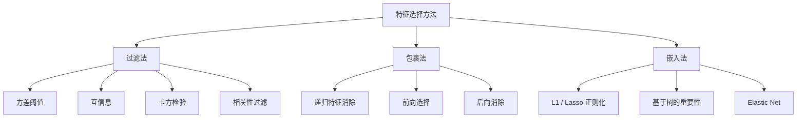
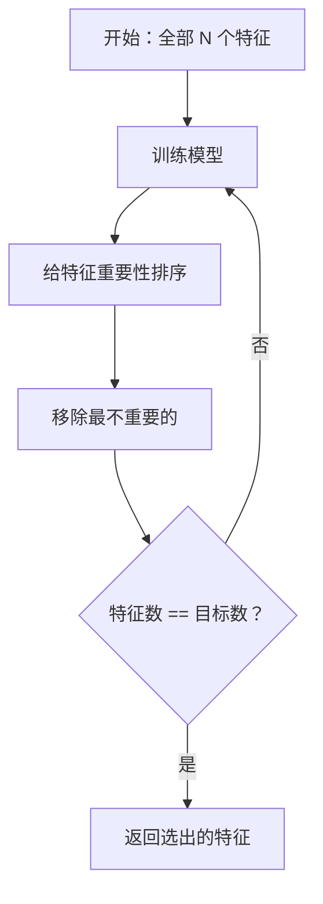
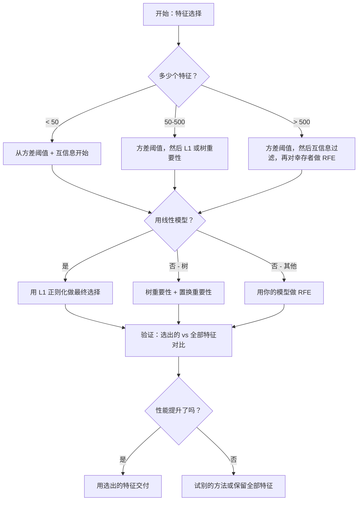

# 特征选择

> 特征多不等于好。特征对才好。

**类型：** Build
**语言：** Python
**前置要求：** 阶段 2 第 01-09 课、第 08 课（特征工程）
**预计时间：** ~75 分钟

## 学习目标

- 从零实现过滤法（方差阈值、互信息、卡方）和包裹法（RFE、前向选择）
- 解释为什么互信息能捕捉相关性错过的非线性特征-目标关系
- 对比 L1 正则化（嵌入式选择）和 RFE（包裹式选择），评估它们的计算权衡
- 构建一条组合多种方法的特征选择流水线，在留出数据上演示泛化的提升

## 问题所在

你有 500 个特征。你的模型训练慢、不停过拟合，没人能解释它学到了什么。你加更多特征指望提升性能。结果更糟了。

这就是维度灾难在起作用。随着特征数增长，特征空间的体积爆炸。数据点变稀疏。点之间的距离趋同。模型需要指数级更多的数据才能找到真实规律。噪声特征淹没了信号特征。过拟合成了默认状态。

特征选择是解药。剥掉噪声。去掉冗余。留下那些真正携带目标信息的特征。结果是：训练更快、泛化更好、模型你真的能解释。

目标不是用上所有可用信息，而是用对的信息。

## 核心概念

### 特征选择的三大类

每种特征选择方法都归入三类之一：



**过滤法**用一个统计度量独立地给每个特征打分。它不用模型。快，但错过特征交互。

**包裹法**训练一个模型来评估特征子集。它用模型性能当分数。结果更好，但贵，因为要反复重训模型。

**嵌入法**把特征选择作为模型训练的一部分。L1 正则化把权重逼到零。决策树在最有用的特征上分裂。选择发生在拟合期间，不是单独一步。

### 方差阈值

最简单的过滤。如果一个特征在样本间几乎不变，它几乎不携带信息。

考虑一个在 1000 个样本里有 999 个都是 0.0 的特征。它的方差接近零。没有模型能用它来区分类别。去掉它。

```
variance(x) = mean((x - mean(x))^2)
```

设一个阈值（比如 0.01）。丢掉每个方差低于它的特征。这能去掉常数或近常数特征，完全不看目标变量。

何时用：作为其他方法之前的预处理步骤。它以近乎零的成本抓住明显没用的特征。

局限：一个特征可以方差高却仍然是纯噪声。方差阈值是必要的，但不充分。

### 互信息

互信息衡量知道特征 X 的取值能多大程度减少对目标 Y 的不确定性。

```
I(X; Y) = sum_x sum_y p(x, y) * log(p(x, y) / (p(x) * p(y)))
```

如果 X 和 Y 独立，p(x, y) = p(x) * p(y)，所以对数项为零、I(X; Y) = 0。X 告诉你关于 Y 的越多，互信息越高。

相对相关性的关键优势：互信息能捕捉非线性关系。一个特征可能和目标相关性为零，却有高互信息，因为关系是二次的或周期的。

对连续特征，先离散化成桶（基于直方图的估计）。桶数影响估计 —— 桶太少丢失信息，太多增加噪声。常见选择：sqrt(n) 个桶或 Sturges 规则（1 + log2(n)）。


### 递归特征消除（RFE）

RFE 是包裹法。它用模型自己的特征重要性来迭代地剪枝：

1. 用所有特征训练模型
2. 按重要性给特征排序（线性模型用系数，树用不纯度减少）
3. 移除最不重要的特征
4. 重复直到剩下想要的特征数



RFE 考虑特征交互，因为模型把所有剩余特征放在一起看。移除一个特征会改变其他特征的重要性。这让它比过滤法更彻底。

代价：你要训练模型 N - target 次。500 个特征、目标 10 个，就是 490 次训练运行。对昂贵的模型，这很慢。你可以每步移除多个特征来加速（比如每轮去掉最末的 10%）。

### L1（Lasso）正则化

L1 正则化把权重的绝对值加进损失函数：

```
loss = prediction_error + alpha * sum(|w_i|)
```

alpha 参数控制特征被剪掉的激进程度。alpha 越高，越多权重变成恰好为零。

为什么是恰好为零？L1 惩罚在权重空间里造出一个菱形约束区域。最优解倾向于落在这个菱形的角上，那里一个或多个权重为零。L2 正则化（ridge）造出一个圆形约束，权重缩小但很少正好碰到零。

这是嵌入式特征选择：模型在训练期间学会忽略哪些特征。权重为零的特征实际上被移除了。

优势：单次训练运行、处理相关特征（挑一个、把其他置零）、内置在大多数线性模型实现里。

局限：只对线性模型起作用。无法捕捉非线性特征重要性。

### 基于树的特征重要性

决策树及其集成（随机森林、梯度提升）天然给特征排序。每次分裂都减少不纯度（分类的 Gini 或熵、回归的方差）。带来更大不纯度减少的特征更重要。

对于有 T 棵树的随机森林：

```
importance(feature_j) = (1/T) * sum over all trees of
    sum over all nodes splitting on feature_j of
        (n_samples * impurity_decrease)
```

这给每个特征一个归一化的重要性分数。它自动处理非线性关系和特征交互。

注意：基于树的重要性偏向有很多不同取值的特征（高基数）。一个随机 ID 列会显得重要，因为它完美地分开每个样本。用置换重要性做个理智检查。

### 置换重要性

一个与模型无关的方法：

1. 训练模型，记录在验证数据上的基线性能
2. 对每个特征：随机打乱它的取值，测量性能的下降
3. 下降越大，特征越重要

如果打乱一个特征不伤害性能，模型就不依赖它。如果性能崩溃，那个特征至关重要。

置换重要性避免了基于树的重要性的基数偏差。但它慢：每个特征一次完整评估，为稳定还要重复多次。

### 对比表

| 方法 | 类型 | 速度 | 非线性 | 特征交互 |
|--------|------|-------|-----------|---------------------|
| 方差阈值 | 过滤 | 非常快 | 不 | 不 |
| 互信息 | 过滤 | 快 | 是 | 不 |
| 相关性过滤 | 过滤 | 快 | 不 | 不 |
| RFE | 包裹 | 慢 | 取决于模型 | 是 |
| L1 / Lasso | 嵌入 | 快 | 不（线性） | 不 |
| 树重要性 | 嵌入 | 中 | 是 | 是 |
| 置换重要性 | 与模型无关 | 慢 | 是 | 是 |

### 决策流程图



## 动手构建

### 第 1 步：生成有已知特征结构的合成数据

```python
import numpy as np


def make_feature_selection_data(n_samples=500, seed=42):
    rng = np.random.RandomState(seed)

    x1 = rng.randn(n_samples)
    x2 = rng.randn(n_samples)
    x3 = rng.randn(n_samples)
    x4 = x1 + 0.1 * rng.randn(n_samples)
    x5 = x2 + 0.1 * rng.randn(n_samples)

    informative = np.column_stack([x1, x2, x3, x4, x5])

    correlated = np.column_stack([
        x1 * 0.9 + 0.1 * rng.randn(n_samples),
        x2 * 0.8 + 0.2 * rng.randn(n_samples),
        x3 * 0.7 + 0.3 * rng.randn(n_samples),
        x1 * 0.5 + x2 * 0.5 + 0.1 * rng.randn(n_samples),
        x2 * 0.6 + x3 * 0.4 + 0.1 * rng.randn(n_samples),
    ])

    noise = rng.randn(n_samples, 10) * 0.5

    X = np.hstack([informative, correlated, noise])
    y = (2 * x1 - 1.5 * x2 + x3 + 0.5 * rng.randn(n_samples) > 0).astype(int)

    feature_names = (
        [f"info_{i}" for i in range(5)]
        + [f"corr_{i}" for i in range(5)]
        + [f"noise_{i}" for i in range(10)]
    )

    return X, y, feature_names
```

我们知道真实情况：特征 0-4 有信息量（其中 3 和 4 是 0 和 1 的相关副本），特征 5-9 和有信息量的特征相关，特征 10-19 是纯噪声。一个好的选择方法应该把 0-4 排最高、10-19 排最低。

### 第 2 步：方差阈值

```python
def variance_threshold(X, threshold=0.01):
    variances = np.var(X, axis=0)
    mask = variances > threshold
    return mask, variances
```

### 第 3 步：互信息（离散）

```python
def discretize(x, n_bins=10):
    min_val, max_val = x.min(), x.max()
    if max_val == min_val:
        return np.zeros_like(x, dtype=int)
    bin_edges = np.linspace(min_val, max_val, n_bins + 1)
    binned = np.digitize(x, bin_edges[1:-1])
    return binned


def mutual_information(X, y, n_bins=10):
    n_samples, n_features = X.shape
    mi_scores = np.zeros(n_features)

    y_vals, y_counts = np.unique(y, return_counts=True)
    p_y = y_counts / n_samples

    for f in range(n_features):
        x_binned = discretize(X[:, f], n_bins)
        x_vals, x_counts = np.unique(x_binned, return_counts=True)
        p_x = dict(zip(x_vals, x_counts / n_samples))

        mi = 0.0
        for xv in x_vals:
            for yi, yv in enumerate(y_vals):
                joint_mask = (x_binned == xv) & (y == yv)
                p_xy = np.sum(joint_mask) / n_samples
                if p_xy > 0:
                    mi += p_xy * np.log(p_xy / (p_x[xv] * p_y[yi]))
        mi_scores[f] = mi

    return mi_scores
```

### 第 4 步：递归特征消除

```python
def simple_logistic_importance(X, y, lr=0.1, epochs=100):
    n_samples, n_features = X.shape
    w = np.zeros(n_features)
    b = 0.0

    for _ in range(epochs):
        z = X @ w + b
        pred = 1.0 / (1.0 + np.exp(-np.clip(z, -500, 500)))
        error = pred - y
        w -= lr * (X.T @ error) / n_samples
        b -= lr * np.mean(error)

    return w, b


def rfe(X, y, n_features_to_select=5, lr=0.1, epochs=100):
    n_total = X.shape[1]
    remaining = list(range(n_total))
    rankings = np.ones(n_total, dtype=int)
    rank = n_total

    while len(remaining) > n_features_to_select:
        X_subset = X[:, remaining]
        w, _ = simple_logistic_importance(X_subset, y, lr, epochs)
        importances = np.abs(w)

        least_idx = np.argmin(importances)
        original_idx = remaining[least_idx]
        rankings[original_idx] = rank
        rank -= 1
        remaining.pop(least_idx)

    for idx in remaining:
        rankings[idx] = 1

    selected_mask = rankings == 1
    return selected_mask, rankings
```

### 第 5 步：L1 特征选择

```python
def soft_threshold(w, alpha):
    return np.sign(w) * np.maximum(np.abs(w) - alpha, 0)


def l1_feature_selection(X, y, alpha=0.1, lr=0.01, epochs=500):
    n_samples, n_features = X.shape
    w = np.zeros(n_features)
    b = 0.0

    for _ in range(epochs):
        z = X @ w + b
        pred = 1.0 / (1.0 + np.exp(-np.clip(z, -500, 500)))
        error = pred - y

        gradient_w = (X.T @ error) / n_samples
        gradient_b = np.mean(error)

        w -= lr * gradient_w
        w = soft_threshold(w, lr * alpha)
        b -= lr * gradient_b

    selected_mask = np.abs(w) > 1e-6
    return selected_mask, w
```

### 第 6 步：基于树的重要性（简单决策树）

```python
def gini_impurity(y):
    if len(y) == 0:
        return 0.0
    classes, counts = np.unique(y, return_counts=True)
    probs = counts / len(y)
    return 1.0 - np.sum(probs ** 2)


def best_split(X, y, feature_idx):
    values = np.unique(X[:, feature_idx])
    if len(values) <= 1:
        return None, -1.0

    best_threshold = None
    best_gain = -1.0
    parent_gini = gini_impurity(y)
    n = len(y)

    for i in range(len(values) - 1):
        threshold = (values[i] + values[i + 1]) / 2.0
        left_mask = X[:, feature_idx] <= threshold
        right_mask = ~left_mask

        n_left = np.sum(left_mask)
        n_right = np.sum(right_mask)

        if n_left == 0 or n_right == 0:
            continue

        gain = parent_gini - (n_left / n) * gini_impurity(y[left_mask]) - (n_right / n) * gini_impurity(y[right_mask])

        if gain > best_gain:
            best_gain = gain
            best_threshold = threshold

    return best_threshold, best_gain


def tree_importance(X, y, n_trees=50, max_depth=5, seed=42):
    rng = np.random.RandomState(seed)
    n_samples, n_features = X.shape
    importances = np.zeros(n_features)

    for _ in range(n_trees):
        sample_idx = rng.choice(n_samples, size=n_samples, replace=True)
        feature_subset = rng.choice(n_features, size=max(1, int(np.sqrt(n_features))), replace=False)

        X_boot = X[sample_idx]
        y_boot = y[sample_idx]

        tree_imp = _build_tree_importance(X_boot, y_boot, feature_subset, max_depth)
        importances += tree_imp

    total = importances.sum()
    if total > 0:
        importances /= total

    return importances


def _build_tree_importance(X, y, feature_subset, max_depth, depth=0):
    n_features = X.shape[1]
    importances = np.zeros(n_features)

    if depth >= max_depth or len(np.unique(y)) <= 1 or len(y) < 4:
        return importances

    best_feature = None
    best_threshold = None
    best_gain = -1.0

    for f in feature_subset:
        threshold, gain = best_split(X, y, f)
        if gain > best_gain:
            best_gain = gain
            best_feature = f
            best_threshold = threshold

    if best_feature is None or best_gain <= 0:
        return importances

    importances[best_feature] += best_gain * len(y)

    left_mask = X[:, best_feature] <= best_threshold
    right_mask = ~left_mask

    importances += _build_tree_importance(X[left_mask], y[left_mask], feature_subset, max_depth, depth + 1)
    importances += _build_tree_importance(X[right_mask], y[right_mask], feature_subset, max_depth, depth + 1)

    return importances
```

### 第 7 步：跑所有方法并对比

代码文件在同一个合成数据集上跑完全部五种方法，并打印一张对比表，展示每种方法选了哪些特征。

## 上手使用

用 scikit-learn，特征选择内置在流水线里：

```python
from sklearn.feature_selection import (
    VarianceThreshold,
    mutual_info_classif,
    RFE,
    SelectFromModel,
)
from sklearn.linear_model import Lasso, LogisticRegression
from sklearn.ensemble import RandomForestClassifier

vt = VarianceThreshold(threshold=0.01)
X_filtered = vt.fit_transform(X)

mi_scores = mutual_info_classif(X, y)
top_k = np.argsort(mi_scores)[-10:]

rfe_selector = RFE(LogisticRegression(), n_features_to_select=10)
rfe_selector.fit(X, y)
X_rfe = rfe_selector.transform(X)

lasso_selector = SelectFromModel(Lasso(alpha=0.01))
lasso_selector.fit(X, y)
X_lasso = lasso_selector.transform(X)

rf = RandomForestClassifier(n_estimators=100)
rf.fit(X, y)
importances = rf.feature_importances_
```

从零实现让你看清每种方法内部到底发生了什么。方差阈值就是算 `var(X, axis=0)` 再套个掩码。互信息是在列联表里数联合和边缘频率。RFE 是一个训练、排序、剪枝的循环。L1 是带软阈值步骤的梯度下降。树重要性把跨分裂的不纯度减少累加起来。没魔法 —— 就是统计和循环。

sklearn 版本加了稳健性（比如 mutual_info_classif 用 k-NN 密度估计而不是分桶）、速度（C 实现）和流水线集成。

## 交付

本节课产出：
- `outputs/skill-feature-selector.md` -- 一棵选择正确特征选择方法的快速参考决策树

## 练习

1. **前向选择**：实现 RFE 的反面。从零个特征开始。每步加入最能提升模型性能的那个特征。加特征不再有帮助时停止。把选出的特征和 RFE 结果对比。哪个更快？哪个结果更好？

2. **稳定性选择**：跑 L1 特征选择 50 次，每次在数据的随机 80% 子样本上、用略有不同的 alpha 值。数每个特征被选中多少次。在超过 80% 的运行里被选中的特征是"稳定的"。把稳定特征和单次 L1 选择对比。哪个更可靠？

3. **多重共线性检测**：计算所有特征的相关矩阵。实现一个函数，给定相关阈值（比如 0.9），从每对高度相关的特征里移除一个（保留和目标互信息更高的那个）。在合成数据集上测试，验证它移除了冗余的相关特征。

4. **特征选择流水线**：把方差阈值、互信息过滤和 RFE 串成一条流水线。先去掉近零方差特征，再按互信息保留前 50%，再对幸存者跑 RFE。把这条流水线和单独对全部特征跑 RFE 对比。流水线更快吗？一样准吗？

5. **从零实现置换重要性**：实现置换重要性。对每个特征，打乱它的取值 10 次，测量 F1 分数的平均下降。把排序和基于树的重要性对比。找到它们不一致的情形并解释为什么（提示：相关特征）。

## 关键术语

| 术语 | 大家怎么说 | 它实际是什么 |
|------|----------------|----------------------|
| 过滤法 | "独立给特征打分" | 一种用统计度量给特征排序、不训练模型、孤立地评估每个特征的特征选择方法 |
| 包裹法 | "用模型来挑特征" | 一种通过训练模型、用其性能作选择标准来评估特征子集的特征选择方法 |
| 嵌入法 | "模型在训练时选特征" | 作为模型拟合一部分发生的特征选择，比如 L1 正则化把权重逼到零 |
| 互信息 | "一个变量能告诉你另一个变量多少" | 衡量已知 X 后对 Y 不确定性减少程度的度量，能捕捉线性和非线性依赖 |
| 递归特征消除 | "训练、排序、剪枝、重复" | 一种迭代的包裹法，训练模型、移除最不重要的特征、重复直到达到目标数量 |
| L1 / Lasso 正则化 | "干掉特征的惩罚" | 把权重绝对值之和加进损失函数，把不重要特征的权重逼到恰好为零 |
| 方差阈值 | "去掉常数特征" | 丢掉样本间方差低于指定阈值的特征，过滤掉不携带信息的特征 |
| 特征重要性 | "哪些特征最重要" | 表示每个特征对模型预测贡献多大的分数，由分裂增益（树）或系数大小（线性）算出 |
| 置换重要性 | "打乱并测量损害" | 通过随机打乱每个特征的取值、测量由此导致的模型性能下降来评估特征重要性 |
| 维度灾难 | "特征太多，数据不够" | 加特征会让特征空间体积指数级增大、使数据稀疏、距离失去意义的现象 |

## 延伸阅读

- [An Introduction to Variable and Feature Selection (Guyon & Elisseeff, 2003)](https://jmlr.org/papers/v3/guyon03a.html) -- 特征选择方法的奠基性综述，至今被广泛引用
- [scikit-learn Feature Selection Guide](https://scikit-learn.org/stable/modules/feature_selection.html) -- 过滤、包裹和嵌入方法的实用参考，附代码示例
- [Stability Selection (Meinshausen & Buhlmann, 2010)](https://arxiv.org/abs/0809.2932) -- 把子采样和特征选择结合，得到稳健可复现的结果
- [Beware Default Random Forest Importances (Strobl et al., 2007)](https://bmcbioinformatics.biomedcentral.com/articles/10.1186/1471-2105-8-25) -- 演示基于树重要性的基数偏差，并提出条件重要性作为替代
