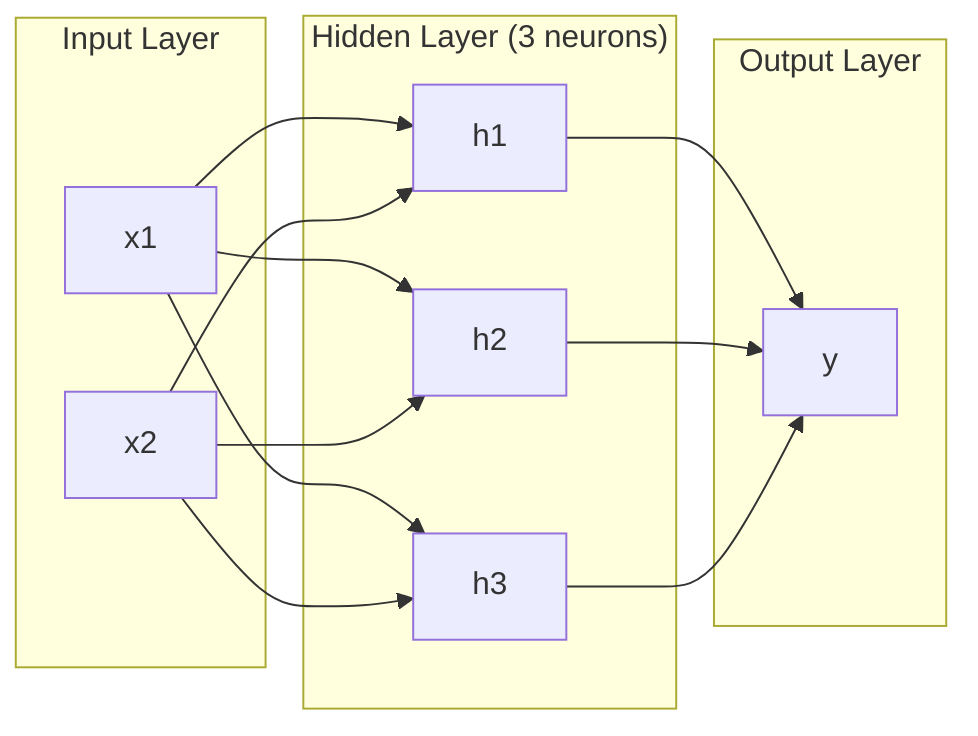
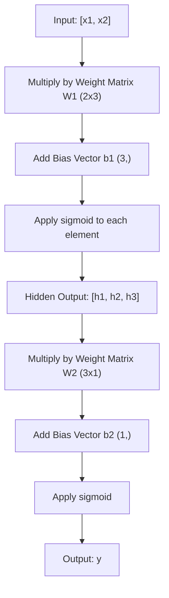
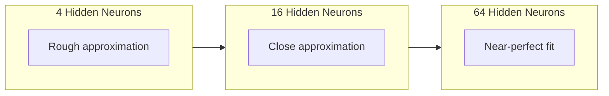

# 多层网络与前向传播

> 一个神经元画一条线。把它们叠起来，你就能画出任何东西。

**类型：** Build
**语言：** Python
**前置要求：** 阶段 01（数学基础）、第 03.01 课（感知机）
**预计时间：** ~90 分钟

## 学习目标

- 从零构建一个多层网络，用 Layer 和 Network 类完成一次完整的前向传播
- 追踪矩阵维度在网络每一层的变化，并识别形状不匹配的问题
- 解释为什么堆叠非线性激活能让网络学到弯曲的决策边界
- 用一个 2-2-1 架构、手工调好的 sigmoid 权重来解决 XOR 问题

## 问题所在

单个神经元是个画线的。仅此而已。一条穿过你数据的直线。AI 里的每个真实问题——图像识别、语言理解、下围棋——都需要曲线。把神经元叠成多层，就是你得到曲线的办法。

1969 年，Minsky 和 Papert 证明了这个限制是致命的：单层网络学不会 XOR。不是"很难学会"——是数学上根本学不会。XOR 的真值表把 [0,1] 和 [1,0] 放在一边，把 [0,0] 和 [1,1] 放在另一边。没有任何一条直线能把它们分开。

这让神经网络研究的资助停了十多年。事后看，解法很明显：别再用一层。把神经元叠成多层。让第一层把输入空间切成新特征，再让第二层把这些特征组合成单条直线做不出的决策。

那个堆叠就是多层网络。它是今天每一个上线的深度学习模型的根基。前向传播——数据从输入流过隐藏层到达输出——是你在其他一切起作用之前，必须先搭出来的第一样东西。

## 核心概念

### 层：输入层、隐藏层、输出层

一个多层网络有三种类型的层：

**输入层** —— 其实算不上一层。它只是存放你的原始数据。两个特征就是两个输入节点。这里不发生任何计算。

**隐藏层** —— 真正干活的地方。每个神经元接收上一层的全部输出，施加权重和一个偏置，再把结果送过激活函数。叫"隐藏"，是因为你在训练数据里永远不会直接看到这些值。

**输出层** —— 最终答案。二分类用一个带 sigmoid 的神经元。多分类则每个类一个神经元。



这是一个 2-3-1 网络。两个输入、三个隐藏神经元、一个输出。每条连接都带一个权重。每个神经元（输入层除外）都带一个偏置。

每一层都产出一个数字向量，叫隐藏状态。对文本来说，隐藏状态会增加维度——把一个词编码成 768 个数字来捕捉语义。对图像来说，它降低维度——把数百万像素压成一个可处理的表示。隐藏状态就是学习真正发生的地方。

### 神经元与激活

每个神经元做三件事：

1. 把每个输入乘上对应的权重
2. 把所有乘积加起来，再加一个偏置
3. 把这个和送过一个激活函数

目前激活函数用 sigmoid：

```
sigmoid(z) = 1 / (1 + e^(-z))
```

sigmoid 把任意数字压进 (0, 1) 区间。很大的正输入推向 1，很大的负输入推向 0，零映射到 0.5。正是这条平滑的曲线让学习成为可能——不像感知机那个硬邦邦的阶跃，sigmoid 处处有梯度。

### 前向传播：数据如何流动

前向传播把输入数据推过网络，一层接一层，直到抵达输出。前向传播过程中不发生学习。它纯粹是计算：乘、加、激活，重复。



在每一层，三个操作依次发生：

```
z = W * input + b       (linear transformation)
a = sigmoid(z)           (activation)
```

一层的输出成为下一层的输入。这就是整个前向传播。

### 矩阵维度

追踪维度是深度学习里最重要的单项调试技能。这是那个 2-3-1 网络：

| 步骤 | 操作 | 维度 | 结果形状 |
|------|-----------|------------|-------------|
| 输入 | x | -- | (2,) |
| 隐藏层线性变换 | W1 * x + b1 | W1: (3, 2), b1: (3,) | (3,) |
| 隐藏层激活 | sigmoid(z1) | -- | (3,) |
| 输出层线性变换 | W2 * h + b2 | W2: (1, 3), b2: (1,) | (1,) |
| 输出层激活 | sigmoid(z2) | -- | (1,) |

规则是：第 k 层的权重矩阵 W 的形状为 (neurons_in_layer_k, neurons_in_layer_k_minus_1)。行数对应当前层，列数对应上一层。如果形状对不上，你就有 bug 了。

### 通用逼近定理

1989 年，George Cybenko 证明了一件了不起的事：一个只有单个隐藏层、神经元足够多的神经网络，能以任意精度逼近任何连续函数。

这不意味着单个隐藏层永远最好。它意味着这种架构在理论上有这个能力。实践中，更深的网络（更多层、每层更少神经元）能用比浅而宽的网络少得多的总参数量学到同样的函数。这就是深度学习起作用的原因。

直觉是：隐藏层里每个神经元学一个"凸包"或者说一个特征。足够多的凸包放在对的位置，就能逼近任何平滑曲线。神经元越多，凸包越多，逼近越好。



### 可组合性

神经网络是可组合的。你可以把它们叠起来、串起来、并行跑。一个 Whisper 模型用一个编码器网络处理音频，再用一个独立的解码器网络生成文本。现代 LLM 是仅解码器（decoder-only）的。BERT 是仅编码器（encoder-only）的。T5 是编码器-解码器的。架构的选择决定了模型能做什么。

## 动手构建

纯 Python，不用 numpy。每个矩阵运算都从零手写。

### 第 1 步：Sigmoid 激活

```python
import math

def sigmoid(x):
    x = max(-500.0, min(500.0, x))
    return 1.0 / (1.0 + math.exp(-x))
```

把值钳到 [-500, 500] 是为了防止溢出。`math.exp(500)` 很大但有限，`math.exp(1000)` 就是无穷大了。

### 第 2 步：Layer 类

整个深度学习里最重要的操作就是矩阵乘法。每一层、每个注意力头、每次前向传播——从头到尾都是矩阵乘。一个线性层接收一个输入向量，乘上一个权重矩阵，再加一个偏置向量：y = Wx + b。这一个方程就占了神经网络里 90% 的算力。

一个层持有一个权重矩阵和一个偏置向量。它的 forward 方法接收一个输入向量，返回激活后的输出。

```python
class Layer:
    def __init__(self, n_inputs, n_neurons, weights=None, biases=None):
        if weights is not None:
            self.weights = weights
        else:
            import random
            self.weights = [
                [random.uniform(-1, 1) for _ in range(n_inputs)]
                for _ in range(n_neurons)
            ]
        if biases is not None:
            self.biases = biases
        else:
            self.biases = [0.0] * n_neurons

    def forward(self, inputs):
        self.last_input = inputs
        self.last_output = []
        for neuron_idx in range(len(self.weights)):
            z = sum(
                w * x for w, x in zip(self.weights[neuron_idx], inputs)
            )
            z += self.biases[neuron_idx]
            self.last_output.append(sigmoid(z))
        return self.last_output
```

权重矩阵的形状是 (n_neurons, n_inputs)。每一行是一个神经元对所有输入的权重。forward 方法遍历各神经元，算出加权和加偏置，施加 sigmoid，再把结果收集起来。

### 第 3 步：Network 类

一个网络就是一个层的列表。前向传播把它们串起来：第 k 层的输出喂给第 k+1 层。

```python
class Network:
    def __init__(self, layers):
        self.layers = layers

    def forward(self, inputs):
        current = inputs
        for layer in self.layers:
            current = layer.forward(current)
        return current
```

这就是整个前向传播。四行逻辑。数据进来，流过每一层，从另一头出去。

### 第 4 步：手工调权重解决 XOR

在第 01 课里，我们靠组合 OR、NAND、AND 感知机解决了 XOR。现在用我们的 Layer 和 Network 类做同样的事。2-2-1 架构：两个输入、两个隐藏神经元、一个输出。

```python
hidden = Layer(
    n_inputs=2,
    n_neurons=2,
    weights=[[20.0, 20.0], [-20.0, -20.0]],
    biases=[-10.0, 30.0],
)

output = Layer(
    n_inputs=2,
    n_neurons=1,
    weights=[[20.0, 20.0]],
    biases=[-30.0],
)

xor_net = Network([hidden, output])

xor_data = [
    ([0, 0], 0),
    ([0, 1], 1),
    ([1, 0], 1),
    ([1, 1], 0),
]

for inputs, expected in xor_data:
    result = xor_net.forward(inputs)
    predicted = 1 if result[0] >= 0.5 else 0
    print(f"  {inputs} -> {result[0]:.6f} (rounded: {predicted}, expected: {expected})")
```

很大的权重（20、-20）让 sigmoid 表现得像阶跃函数。第一个隐藏神经元近似 OR，第二个近似 NAND，输出神经元把它们组合成 AND，整体就是 XOR。

### 第 5 步：圆形分类

一个更难的问题：把二维点分类为在原点为心、半径 0.5 的圆内还是圆外。这需要一条弯曲的决策边界——单个感知机做不到。

```python
import random
import math

random.seed(42)

data = []
for _ in range(200):
    x = random.uniform(-1, 1)
    y = random.uniform(-1, 1)
    label = 1 if (x * x + y * y) < 0.25 else 0
    data.append(([x, y], label))

circle_net = Network([
    Layer(n_inputs=2, n_neurons=8),
    Layer(n_inputs=8, n_neurons=1),
])
```

权重随机时，网络分类得不会好。但前向传播照样能跑。这正是重点——前向传播只是计算。学出正确的权重靠的是反向传播，那是第 03 课的内容。

```python
correct = 0
for inputs, expected in data:
    result = circle_net.forward(inputs)
    predicted = 1 if result[0] >= 0.5 else 0
    if predicted == expected:
        correct += 1

print(f"Accuracy with random weights: {correct}/{len(data)} ({100*correct/len(data):.1f}%)")
```

随机权重给出的准确率很差——往往比直接猜多数类还糟。训练之后（第 03 课），同样这个带 8 个隐藏神经元的架构会画出一条弯曲的边界，把圆内和圆外分开。

## 上手使用

PyTorch 用四行就做完了上面的一切：

```python
import torch
import torch.nn as nn

model = nn.Sequential(
    nn.Linear(2, 8),
    nn.Sigmoid(),
    nn.Linear(8, 1),
    nn.Sigmoid(),
)

x = torch.tensor([[0.0, 0.0], [0.0, 1.0], [1.0, 0.0], [1.0, 1.0]])
output = model(x)
print(output)
```

`nn.Linear(2, 8)` 就是你的 Layer 类：形状 (8, 2) 的权重矩阵、形状 (8,) 的偏置向量。`nn.Sigmoid()` 就是你那个逐元素施加的 sigmoid 函数。`nn.Sequential` 就是你的 Network 类：按顺序把层串起来。

区别在于速度和规模。PyTorch 跑在 GPU 上，能处理上百万样本的批次，还能为反向传播自动计算梯度。但前向传播的逻辑和你刚从零搭出来的那套完全一样。

## 交付

本课产出一个可复用的提示词，用于设计网络架构：

- `outputs/prompt-network-architect.md`

当你需要为某个问题决定用几层、每层几个神经元、用哪些激活函数时就用它。

## 练习

1. 构建一个 2-4-2-1 网络（两个隐藏层），用随机权重在 XOR 数据上跑一次前向传播。打印出中间隐藏层的输出，看看表示在每一层是怎么变换的。

2. 把圆形分类器里的隐藏层大小从 8 改成 2，再改成 32。每次都用随机权重跑前向传播。隐藏神经元的数量会改变输出的范围或分布吗？为什么？

3. 在 Network 类上实现一个 `count_parameters` 方法，返回可训练权重和偏置的总数。在一个 784-256-128-10 网络（经典的 MNIST 架构）上测试它。它有多少参数？

4. 给一个 3-4-4-2 网络搭一次前向传播。喂给它 RGB 颜色值（归一化到 0-1），观察那两个输出。这就是一个简单的二分类颜色分类器的架构。

5. 把 sigmoid 换成一个"泄漏阶跃"函数：z < 0 时返回 0.01 * z，否则返回 1.0。用第 4 步里手工调好的同一套权重，在 XOR 上跑前向传播。它还能用吗？为什么平滑的 sigmoid 比硬截断更受青睐？

## 关键术语

| 术语 | 大家怎么说 | 实际是什么 |
|------|----------------|----------------------|
| 前向传播（Forward pass） | "跑模型" | 把输入推过每一层——乘权重、加偏置、激活——产出一个输出 |
| 隐藏层（Hidden layer） | "中间那部分" | 输入和输出之间的任何层，其值不会在数据里被直接观测到 |
| 多层网络（Multi-layer network） | "一个深度神经网络" | 神经元一层层顺序叠起来，每层的输出喂给下一层的输入 |
| 激活函数（Activation function） | "那个非线性" | 在线性变换之后施加的函数，给决策边界引入曲线 |
| Sigmoid | "S 形曲线" | sigma(z) = 1/(1+e^(-z))，把任意实数压到 (0,1)，处处平滑可导 |
| 权重矩阵（Weight matrix） | "参数" | 一个形状为 (当前层神经元数, 上一层神经元数) 的矩阵 W，装着可学习的连接强度 |
| 偏置向量（Bias vector） | "偏移量" | 在矩阵乘之后加上的一个向量，让神经元在所有输入都为零时也能激活 |
| 通用逼近（Universal approximation） | "神经网络啥都能学" | 单个隐藏层只要神经元够多就能逼近任何连续函数——但"够多"可能意味着上十亿个 |
| 线性变换（Linear transformation） | "矩阵乘那一步" | z = W * x + b，激活之前的计算，把输入映射到一个新空间 |
| 决策边界（Decision boundary） | "分类器切换的地方" | 输入空间里的那个面，网络输出在这里越过分类阈值 |

## 延伸阅读

- Michael Nielsen，《Neural Networks and Deep Learning》第 1-2 章（http://neuralnetworksanddeeplearning.com/）—— 对前向传播和网络结构讲得最清楚的免费资料，带交互可视化
- Cybenko，《Approximation by Superpositions of a Sigmoidal Function》（1989）—— 通用逼近定理的原始论文，意外地好读
- 3Blue1Brown，《But what is a neural network?》（https://www.youtube.com/watch?v=aircAruvnKk）—— 20 分钟可视化讲解层、权重、前向传播，帮你建立正确的心智模型
- Goodfellow、Bengio、Courville，《Deep Learning》第 6 章（https://www.deeplearningbook.org/）—— 多层网络的标准参考书，免费在线
