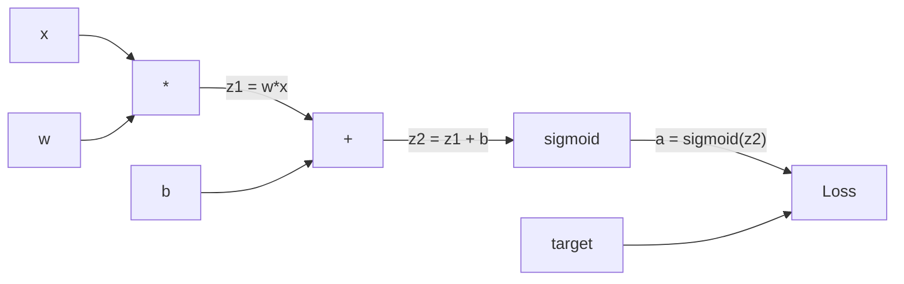
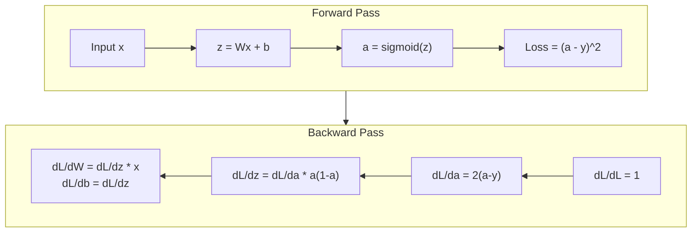
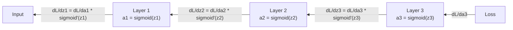

# 从零实现反向传播

> 反向传播是让学习成为可能的算法。没有它，神经网络只是一台昂贵的随机数生成器。

**类型：** Build
**语言：** Python
**前置要求：** 第 03.02 课（多层网络）
**预计时间：** ~120 分钟

## 学习目标

- 实现一个基于 Value 的自动微分（autograd）引擎，构建计算图并通过拓扑排序计算梯度
- 用链式法则推导加法、乘法、sigmoid 的反向传播过程
- 仅用你从零写的反向传播引擎，在 XOR 和圆形分类上训练一个多层网络
- 识别深层 sigmoid 网络里的梯度消失问题，并解释为什么梯度会指数级缩小

## 问题所在

你的网络有一个隐藏层，768 个输入、3072 个输出。那是 2,359,296 个权重。它做了一个错误的预测。是哪些权重导致了这个错误？逐个测试每个权重意味着 230 万次前向传播。反向传播在一次反向传播里就算出了全部 230 万个梯度。这不是一个优化，这是"能训练"和"不可能"之间的区别。

朴素的做法是：拿一个权重，把它微微挪一点，再跑一次前向传播，测量损失是涨了还是跌了。这就给了你那个权重的梯度。现在对网络里每个权重都这么做。再乘上几千个训练步、几百万个数据点。你得用地质年代的时间才能训练出任何有用的东西。

反向传播解决了这个问题。一次前向传播、一次反向传播，所有梯度都算出来了。诀窍是微积分里的链式法则，系统性地应用到一张计算图上。这就是让深度学习变得切实可行的算法。没有它，我们还卡在玩具问题上。

## 核心概念

### 链式法则，应用到网络上

你在阶段 01 第 05 课见过链式法则。快速回顾：如果 y = f(g(x))，那么 dy/dx = f'(g(x)) * g'(x)。你沿着这条链把导数乘起来。

在神经网络里，这条"链"就是从输入到损失的那一串操作。每一层施加权重、加偏置、过激活。损失函数把最终输出和目标做比较。反向传播沿着这条链反向追溯，算出每个操作对误差贡献了多少。

### 计算图

每次前向传播都构建一张图。每个节点是一个操作（乘、加、sigmoid）。每条边正向携带一个值，反向携带一个梯度。



前向传播：值从左流向右。x 和 w 产出 z1 = w*x。加上 b 得到 z2。sigmoid 给出激活值 a。用损失函数把 a 和目标 y 做比较。

反向传播：梯度从右流向左。从 dL/da（损失随激活值如何变化）开始。乘上 da/dz2（sigmoid 导数），得到 dL/dz2。拆成 dL/db（等于 dL/dz2，因为 z2 = z1 + b）和 dL/dz1。然后 dL/dw = dL/dz1 * x，dL/dx = dL/dz1 * w。

反向传播过程中，图里每个节点只有一项工作：拿上游传来的梯度，乘上自己的局部导数，再往下传。

### 前向 vs 反向



前向传播会存下每一个中间值：z、a、每层的输入。反向传播需要这些存下来的值来计算梯度。这就是反向传播核心处的内存-计算权衡。你用内存（存激活值）换速度（一次传播而不是几百万次）。

### 梯度在网络中的流动

对一个 3 层网络，梯度沿着每一层串起来：



在每一层，梯度都会被乘上 sigmoid 导数。sigmoid 导数是 a * (1 - a)，最大值是 0.25（当 a = 0.5 时）。深入三层，梯度最多被乘上 0.25^3 = 0.0156。深入十层：0.25^10 = 0.000001。

### 梯度消失

这就是梯度消失问题。sigmoid 把输出压在 0 和 1 之间。它的导数永远小于 0.25。叠够多 sigmoid 层，梯度就缩到几乎为零。靠前的层几乎学不到东西，因为它们收到的梯度接近零。

```
sigmoid(z):     Output range [0, 1]
sigmoid'(z):    Max value 0.25 (at z = 0)

After 5 layers:   gradient * 0.25^5 = 0.001x original
After 10 layers:  gradient * 0.25^10 = 0.000001x original
```

这就是为什么深层 sigmoid 网络几乎不可能训练。解法——ReLU 及其变体——是第 04 课的主题。眼下只要理解：反向传播本身工作得完美无缺。问题出在它要穿过的东西上。

### 推导一个 2 层网络的梯度

具体算一个网络：输入 x，隐藏层带 sigmoid，输出层带 sigmoid，用 MSE 损失。

前向传播：
```
z1 = W1 * x + b1
a1 = sigmoid(z1)
z2 = W2 * a1 + b2
a2 = sigmoid(z2)
L = (a2 - y)^2
```

反向传播（逐步应用链式法则）：
```
dL/da2 = 2(a2 - y)
da2/dz2 = a2 * (1 - a2)
dL/dz2 = dL/da2 * da2/dz2 = 2(a2 - y) * a2 * (1 - a2)

dL/dW2 = dL/dz2 * a1
dL/db2 = dL/dz2

dL/da1 = dL/dz2 * W2
da1/dz1 = a1 * (1 - a1)
dL/dz1 = dL/da1 * da1/dz1

dL/dW1 = dL/dz1 * x
dL/db1 = dL/dz1
```

每个梯度都是从损失反向追溯回来的一连串局部导数的乘积。反向传播就这么点东西。

## 动手构建

### 第 1 步：Value 节点

我们计算里的每个数字都变成一个 Value。它存下自己的数据、梯度，以及它是怎么被造出来的（这样它就知道反向时怎么算梯度）。

```python
class Value:
    def __init__(self, data, children=(), op=''):
        self.data = data
        self.grad = 0.0
        self._backward = lambda: None
        self._children = set(children)
        self._op = op

    def __repr__(self):
        return f"Value(data={self.data:.4f}, grad={self.grad:.4f})"
```

还没有梯度（0.0）。还没有反向函数（空操作）。`_children` 记录是哪些 Value 产出了这一个，方便我们之后对图做拓扑排序。

### 第 2 步：带反向函数的操作

每个操作创建一个新 Value，并定义梯度怎么反向流过它。

```python
def __add__(self, other):
    other = other if isinstance(other, Value) else Value(other)
    out = Value(self.data + other.data, (self, other), '+')

    def _backward():
        self.grad += out.grad
        other.grad += out.grad

    out._backward = _backward
    return out

def __mul__(self, other):
    other = other if isinstance(other, Value) else Value(other)
    out = Value(self.data * other.data, (self, other), '*')

    def _backward():
        self.grad += other.data * out.grad
        other.grad += self.data * out.grad

    out._backward = _backward
    return out
```

对加法：d(a+b)/da = 1，d(a+b)/db = 1。所以两个输入都直接拿到输出的梯度。

对乘法：d(a*b)/da = b，d(a*b)/db = a。每个输入拿到对方的值乘上输出梯度。

那个 `+=` 至关重要。一个 Value 可能被用在多个操作里。它的梯度是来自所有路径的梯度之和。

### 第 3 步：Sigmoid 与损失

```python
import math

def sigmoid(self):
    x = self.data
    x = max(-500, min(500, x))
    s = 1.0 / (1.0 + math.exp(-x))
    out = Value(s, (self,), 'sigmoid')

    def _backward():
        self.grad += (s * (1 - s)) * out.grad

    out._backward = _backward
    return out
```

sigmoid 导数：sigmoid(x) * (1 - sigmoid(x))。我们在前向传播里已经算出 sigmoid(x) = s 了。复用它，不用多干活。

```python
def mse_loss(predicted, target):
    diff = predicted + Value(-target)
    return diff * diff
```

单个输出的 MSE：(predicted - target)^2。我们把减法表达成加上一个取负的 Value。

### 第 4 步：反向传播

拓扑排序保证我们按正确顺序处理节点——一个节点的梯度被完全累加之后，才会向它的下游传播。

```python
def backward(self):
    topo = []
    visited = set()

    def build_topo(v):
        if v not in visited:
            visited.add(v)
            for child in v._children:
                build_topo(child)
            topo.append(v)

    build_topo(self)
    self.grad = 1.0
    for v in reversed(topo):
        v._backward()
```

从损失开始（梯度 = 1.0，因为 dL/dL = 1）。沿着排好序的图反向走。每个节点的 `_backward` 把梯度推给它的子节点。

### 第 5 步：Layer 与 Network

```python
import random

class Neuron:
    def __init__(self, n_inputs):
        scale = (2.0 / n_inputs) ** 0.5
        self.weights = [Value(random.uniform(-scale, scale)) for _ in range(n_inputs)]
        self.bias = Value(0.0)

    def __call__(self, x):
        act = sum((wi * xi for wi, xi in zip(self.weights, x)), self.bias)
        return act.sigmoid()

    def parameters(self):
        return self.weights + [self.bias]


class Layer:
    def __init__(self, n_inputs, n_outputs):
        self.neurons = [Neuron(n_inputs) for _ in range(n_outputs)]

    def __call__(self, x):
        out = [n(x) for n in self.neurons]
        return out[0] if len(out) == 1 else out

    def parameters(self):
        params = []
        for n in self.neurons:
            params.extend(n.parameters())
        return params


class Network:
    def __init__(self, sizes):
        self.layers = []
        for i in range(len(sizes) - 1):
            self.layers.append(Layer(sizes[i], sizes[i + 1]))

    def __call__(self, x):
        for layer in self.layers:
            x = layer(x)
            if not isinstance(x, list):
                x = [x]
        return x[0] if len(x) == 1 else x

    def parameters(self):
        params = []
        for layer in self.layers:
            params.extend(layer.parameters())
        return params

    def zero_grad(self):
        for p in self.parameters():
            p.grad = 0.0
```

一个 Neuron 接收输入，算出加权和加偏置，再施加 sigmoid。权重初始化按 sqrt(2/n_inputs) 缩放，防止 sigmoid 在更深的网络里饱和。一个 Layer 是一组 Neuron。一个 Network 是一组 Layer。`parameters()` 方法把所有可学习的 Value 收集起来，方便我们更新它们。

### 第 6 步：在 XOR 上训练

```python
random.seed(42)
net = Network([2, 4, 1])

xor_data = [
    ([0.0, 0.0], 0.0),
    ([0.0, 1.0], 1.0),
    ([1.0, 0.0], 1.0),
    ([1.0, 1.0], 0.0),
]

learning_rate = 1.0

for epoch in range(1000):
    total_loss = Value(0.0)
    for inputs, target in xor_data:
        x = [Value(i) for i in inputs]
        pred = net(x)
        loss = mse_loss(pred, target)
        total_loss = total_loss + loss

    net.zero_grad()
    total_loss.backward()

    for p in net.parameters():
        p.data -= learning_rate * p.grad

    if epoch % 100 == 0:
        print(f"Epoch {epoch:4d} | Loss: {total_loss.data:.6f}")

print("\nXOR Results:")
for inputs, target in xor_data:
    x = [Value(i) for i in inputs]
    pred = net(x)
    print(f"  {inputs} -> {pred.data:.4f} (expected {target})")
```

看着损失往下掉。从随机预测到正确的 XOR 输出，全程由反向传播算梯度、把权重往对的方向推着完成。

### 第 7 步：圆形分类

在第 02 课里，你手工调权重做圆形分类。现在让网络自己学出来。

```python
random.seed(7)

def generate_circle_data(n=100):
    data = []
    for _ in range(n):
        x1 = random.uniform(-1.5, 1.5)
        x2 = random.uniform(-1.5, 1.5)
        label = 1.0 if x1 * x1 + x2 * x2 < 1.0 else 0.0
        data.append(([x1, x2], label))
    return data

circle_data = generate_circle_data(80)

circle_net = Network([2, 8, 1])
learning_rate = 0.5

for epoch in range(2000):
    random.shuffle(circle_data)
    total_loss_val = 0.0
    for inputs, target in circle_data:
        x = [Value(i) for i in inputs]
        pred = circle_net(x)
        loss = mse_loss(pred, target)
        circle_net.zero_grad()
        loss.backward()
        for p in circle_net.parameters():
            p.data -= learning_rate * p.grad
        total_loss_val += loss.data

    if epoch % 200 == 0:
        correct = 0
        for inputs, target in circle_data:
            x = [Value(i) for i in inputs]
            pred = circle_net(x)
            predicted_class = 1.0 if pred.data > 0.5 else 0.0
            if predicted_class == target:
                correct += 1
        accuracy = correct / len(circle_data) * 100
        print(f"Epoch {epoch:4d} | Loss: {total_loss_val:.4f} | Accuracy: {accuracy:.1f}%")
```

这里我们用在线 SGD——每处理一个样本就更新一次权重，而不是攒满整个批次再更新。这样能更快打破对称性，避免在完整损失曲面上让 sigmoid 饱和。每个 epoch 都打乱数据，防止网络死记顺序。

不用手工调。网络自己发现了那条圆形的决策边界。这就是反向传播的威力：你定义架构、损失函数和数据，算法自己把权重搞定。

## 上手使用

PyTorch 用几行就做完了上面的一切。核心思想完全一样——autograd 在前向传播时构建一张计算图，再反向追溯它来计算梯度。

```python
import torch
import torch.nn as nn

model = nn.Sequential(
    nn.Linear(2, 4),
    nn.Sigmoid(),
    nn.Linear(4, 1),
    nn.Sigmoid(),
)
optimizer = torch.optim.SGD(model.parameters(), lr=1.0)
criterion = nn.MSELoss()

X = torch.tensor([[0,0],[0,1],[1,0],[1,1]], dtype=torch.float32)
y = torch.tensor([[0],[1],[1],[0]], dtype=torch.float32)

for epoch in range(1000):
    pred = model(X)
    loss = criterion(pred, y)
    optimizer.zero_grad()
    loss.backward()
    optimizer.step()

print("PyTorch XOR Results:")
with torch.no_grad():
    for i in range(4):
        pred = model(X[i])
        print(f"  {X[i].tolist()} -> {pred.item():.4f} (expected {y[i].item()})")
```

`loss.backward()` 就是你的 `total_loss.backward()`。`optimizer.step()` 就是你手写的 `p.data -= lr * p.grad`。`optimizer.zero_grad()` 就是你的 `net.zero_grad()`。同一个算法，工业级的实现。PyTorch 负责 GPU 加速、混合精度、梯度检查点（gradient checkpointing），还有上百种层类型。但反向传播还是那同一个链式法则，应用到那同一张计算图上。

训练会跑前向传播，再跑反向传播，然后更新权重。推理只跑前向传播。没有梯度，没有更新。这个区别很重要，因为生产环境里发生的就是推理。当你调用 Claude 或 GPT 这样的 API 时，你跑的就是推理——你的 prompt 正向流过网络，token 从另一头出来。没有权重改变。理解反向传播之所以重要，是因为它塑造了那个网络里的每一个权重。

## 交付

本课产出：
- `outputs/prompt-gradient-debugger.md` —— 一个可复用的提示词，用于诊断任何神经网络里的梯度问题（消失、爆炸、NaN）

## 练习

1. 给 Value 类加一个 `__sub__` 方法（a - b = a + (-1 * b)）。然后实现一个 `__neg__` 方法。对像 (a - b)^2 这样的简单表达式，把结果和手算对比，验证梯度是否正确。

2. 给 Value 加一个 `relu` 方法（输出 max(0, x)，导数在 x > 0 时为 1，否则为 0）。把隐藏层里的 sigmoid 换成 relu，再在 XOR 上训练。对比收敛速度。你应该看到训练更快——这预告了第 04 课。

3. 在 Value 上实现一个支持整数次幂的 `__pow__` 方法。用它把 `mse_loss` 换成一个规范的 `(predicted - target) ** 2` 表达式。验证梯度和原实现一致。

4. 给训练循环加上梯度裁剪：调用 `backward()` 之后，把所有梯度裁到 [-1, 1]。训练一个更深的网络（4 层以上、用 sigmoid），对比裁剪前后的损失曲线。这是你对抗梯度爆炸的第一道防线。

5. 做一个可视化：在 XOR 上训练完后，打印网络里每个参数的梯度。找出哪一层的梯度最小。这演示了你在核心概念部分读到的梯度消失问题。

## 关键术语

| 术语 | 大家怎么说 | 实际是什么 |
|------|----------------|----------------------|
| 反向传播（Backpropagation） | "网络在学习" | 一个算法，通过在计算图上反向应用链式法则，为每个权重算出 dL/dw |
| 计算图（Computational graph） | "网络结构" | 一张有向无环图，节点是操作，边正向携带值、反向携带梯度 |
| 链式法则（Chain rule） | "把导数乘起来" | 若 y = f(g(x))，则 dy/dx = f'(g(x)) * g'(x)——反向传播的数学根基 |
| 梯度（Gradient） | "最陡上升的方向" | 损失对某个参数的偏导数——告诉你怎么改这个参数才能减小损失 |
| 梯度消失（Vanishing gradient） | "深层网络学不动" | 梯度在穿过 sigmoid 这类饱和激活的层时指数级缩小 |
| 前向传播（Forward pass） | "跑网络" | 依次施加每层操作、存下中间值，从输入算出输出 |
| 反向传播（Backward pass） | "算梯度" | 反向遍历计算图，用链式法则在每个节点累加梯度 |
| 学习率（Learning rate） | "学得多快" | 一个标量，控制更新权重时的步长：w_new = w_old - lr * gradient |
| 拓扑排序（Topological sort） | "正确的顺序" | 图节点的一种排序，每个节点都排在它依赖的所有节点之后——保证梯度在传播前已被完全累加 |
| 自动微分（Autograd） | "自动求导" | 一个系统，在前向计算时构建计算图并自动计算梯度——也就是 PyTorch 引擎在做的事 |

## 延伸阅读

- Rumelhart、Hinton & Williams，《Learning representations by back-propagating errors》（1986）—— 让反向传播走进主流、解锁多层网络训练的那篇论文
- 3Blue1Brown，《Neural Networks》系列（https://www.youtube.com/playlist?list=PLZHQObOWTQDNU6R1_67000Dx_ZCJB-3pi）—— 对反向传播和梯度在网络中流动讲得最直观的可视化讲解
