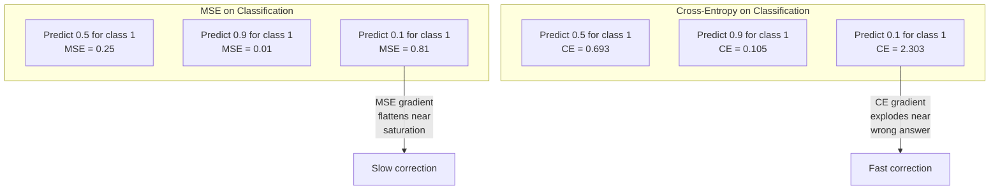
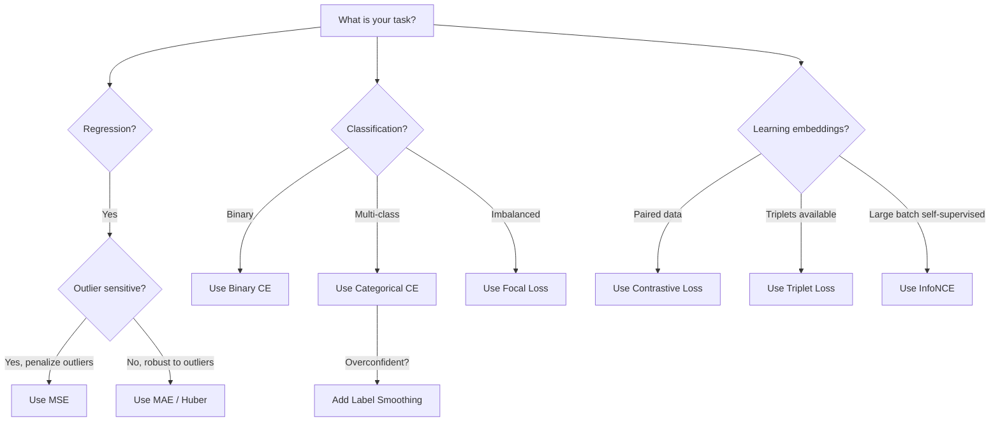
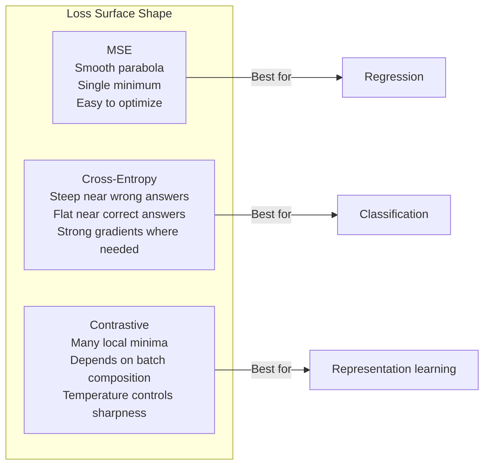

# 损失函数

> 你的网络做了一个预测。真实答案不是这样。它错得有多离谱？那个数字就是损失。选错损失函数，你的模型会朝着完全错误的目标去优化。

**类型：** Build
**语言：** Python
**前置要求：** 第 03.04 课（激活函数）
**预计时间：** ~75 分钟

## 学习目标

- 从零实现 MSE、二元交叉熵、分类交叉熵、对比损失（InfoNCE）及其梯度
- 通过演示"对所有输入都预测 0.5"这种失败模式，解释为什么 MSE 在分类上行不通
- 把标签平滑（label smoothing）应用到交叉熵上，并说明它如何防止过度自信的预测
- 为回归、二分类、多分类和嵌入学习任务选对损失函数

## 问题所在

一个在分类问题上最小化 MSE 的模型，会自信地对所有东西都预测 0.5。它在最小化损失。它也毫无用处。

损失函数是你的模型唯一真正在优化的东西。不是准确率，不是 F1 分数，不是你汇报给老板的那个指标。优化器拿损失函数的梯度，调整权重让那个数字变小。如果损失函数没捕捉到你在意的东西，模型会找到数学上最省力的方式去满足它，而那个方式几乎从来不是你想要的。

举个具体例子。你有个二分类任务。两个类，五五开。你用 MSE 作损失。模型对每一个输入都预测 0.5。平均 MSE 是 0.25，这是不真正学任何东西时可能达到的最小值。模型零判别能力，但它技术上确实最小化了你的损失函数。换成交叉熵，同一个模型就被迫把预测推向 0 或 1，因为 -log(0.5) = 0.693 是个糟糕的损失，而 -log(0.99) = 0.01 奖励自信且正确的预测。损失函数的选择，就是"一个会学习的模型"和"一个钻指标空子的模型"之间的区别。

还会更糟。在自监督学习里，你连标签都没有。对比损失完全定义了学习信号：什么算相似、什么算不同、模型该多用力把它们推开。对比损失搞错了，你的嵌入就塌缩成一个点——每个输入都映射到同一个向量。技术上零损失。完全没用。

## 核心概念

### 均方误差（MSE）

回归的默认选择。算出预测和目标之差的平方，对所有样本取平均。

```
MSE = (1/n) * sum((y_pred - y_true)^2)
```

平方为什么重要：它以二次方惩罚大误差。误差为 2 的代价是误差为 1 的 4 倍。误差为 10 是 100 倍。这让 MSE 对离群点敏感——单个错得离谱的预测就主导了整个损失。

真实数字：如果你的模型预测房价，大多数房子差 1 万美元，但有一栋豪宅差 20 万美元，MSE 会拼命去修那一栋豪宅，可能反而拖累其他 99 栋房子的表现。

MSE 对预测的梯度是：

```
dMSE/dy_pred = (2/n) * (y_pred - y_true)
```

关于误差是线性的。误差越大，梯度越大。这对回归是个优点（大误差需要大修正），对分类却是个 bug（你想以指数方式而不是线性方式惩罚自信的错误答案）。

### 交叉熵损失

分类用的损失函数。根植于信息论——它衡量预测概率分布和真实分布之间的散度。

**二元交叉熵（BCE）：**

```
BCE = -(y * log(p) + (1 - y) * log(1 - p))
```

其中 y 是真实标签（0 或 1），p 是预测概率。

-log(p) 为什么有效：当真实标签是 1、你预测 p = 0.99 时，损失是 -log(0.99) = 0.01。当你预测 p = 0.01 时，损失是 -log(0.01) = 4.6。那 460 倍的差距就是交叉熵有效的原因。它残酷地惩罚自信的错误预测，却几乎不惩罚自信的正确预测。

梯度讲的是同一个故事：

```
dBCE/dp = -(y/p) + (1-y)/(1-p)
```

当 y = 1 且 p 接近零时，梯度是 -1/p，趋向负无穷。模型得到一个巨大的信号去修正它的错误。当 p 接近 1 时，梯度极小。已经对了，没什么可修的。

**分类交叉熵（Categorical Cross-Entropy）：**

用于带 one-hot 编码目标的多分类。

```
CCE = -sum(y_i * log(p_i))
```

只有真实类对损失有贡献（因为其他所有 y_i 都是零）。如果有 10 个类，正确类拿到概率 0.1（随机猜），损失是 -log(0.1) = 2.3。如果正确类拿到概率 0.9，损失是 -log(0.9) = 0.105。模型学会把概率质量集中到正确答案上。

### 为什么 MSE 在分类上行不通



当预测接近 0 或 1 时，MSE 梯度会变平（因为 sigmoid 饱和）。交叉熵梯度补偿了这一点——-log 抵消了 sigmoid 那些平掉的区域，恰好在最需要的地方给出强梯度。

### 标签平滑

标准的 one-hot 标签说"这 100% 是第 3 类，其他全都 0%"。这是个很强的断言。标签平滑把它软化：

```
smooth_label = (1 - alpha) * one_hot + alpha / num_classes
```

alpha = 0.1、10 个类时：目标从 [0, 0, 1, 0, ...] 变成 [0.01, 0.01, 0.91, 0.01, ...]。模型瞄准 0.91 而不是 1.0。

为什么有效：一个想通过 softmax 精确输出 1.0 的模型，需要把 logit 推到无穷大。这会导致过度自信、损害泛化、让模型对分布漂移变得脆弱。标签平滑把目标封顶在 0.9（alpha=0.1 时），让 logit 保持在一个合理范围内。GPT 和大多数现代模型都用标签平滑或等价手法。

### 对比损失

没有标签。没有类别。只有一对对输入，和一个问题：这俩相似还是不同？

**SimCLR 式对比损失（NT-Xent / InfoNCE）：**

拿一张图。给它造两个增强视图（裁剪、旋转、颜色抖动）。这俩是"正样本对"——它们应该有相似的嵌入。这一批里其他每张图都构成"负样本对"——它们应该有不同的嵌入。

```
L = -log(exp(sim(z_i, z_j) / tau) / sum(exp(sim(z_i, z_k) / tau)))
```

其中 sim() 是余弦相似度，z_i 和 z_j 是正样本对，求和遍历所有负样本，tau（温度）控制分布有多尖锐。温度越低 = 负样本越硬 = 分离越激进。

真实数字：批大小 256 意味着每个正样本对有 255 个负样本。温度 tau = 0.07（SimCLR 默认）。这个损失看起来像在相似度上做 softmax——它要让正样本对的相似度在全部 256 个选项里最高。

**三元组损失（Triplet Loss）：**

接收三个输入：锚点（anchor）、正样本（同类）、负样本（异类）。

```
L = max(0, d(anchor, positive) - d(anchor, negative) + margin)
```

间隔（margin，通常 0.2-1.0）强制正样本和负样本距离之间有一个最小差距。如果负样本已经离得够远，损失就是零——没有梯度，没有更新。这让训练高效，但需要小心地挖三元组（挑选那些离锚点很近的硬负样本）。

### Focal Loss

用于不平衡数据集。标准交叉熵对所有分对的样本一视同仁。Focal loss 给简单样本降权：

```
FL = -alpha * (1 - p_t)^gamma * log(p_t)
```

其中 p_t 是真实类的预测概率，gamma 控制聚焦程度。gamma = 0 时这就是标准交叉熵。gamma = 2（默认）时：

- 简单样本（p_t = 0.9）：权重 = (0.1)^2 = 0.01。基本被忽略。
- 困难样本（p_t = 0.1）：权重 = (0.9)^2 = 0.81。完整的梯度信号。

Focal loss 由 Lin 等人为目标检测引入，那里 99% 的候选区域是背景（简单负样本）。没有 focal loss，模型会被简单背景样本淹没，永远学不会检测物体。有了它，模型把容量集中到那些真正重要的、困难且模糊的情形上。

### 损失函数决策树



### 损失曲面



## 动手构建

### 第 1 步：MSE 及其梯度

```python
def mse(predictions, targets):
    n = len(predictions)
    total = 0.0
    for p, t in zip(predictions, targets):
        total += (p - t) ** 2
    return total / n

def mse_gradient(predictions, targets):
    n = len(predictions)
    grads = []
    for p, t in zip(predictions, targets):
        grads.append(2.0 * (p - t) / n)
    return grads
```

### 第 2 步：二元交叉熵

log(0) 问题是真实存在的。如果模型对一个正样本精确预测 0，log(0) = 负无穷。裁剪（clipping）能防止这一点。

```python
import math

def binary_cross_entropy(predictions, targets, eps=1e-15):
    n = len(predictions)
    total = 0.0
    for p, t in zip(predictions, targets):
        p_clipped = max(eps, min(1 - eps, p))
        total += -(t * math.log(p_clipped) + (1 - t) * math.log(1 - p_clipped))
    return total / n

def bce_gradient(predictions, targets, eps=1e-15):
    grads = []
    for p, t in zip(predictions, targets):
        p_clipped = max(eps, min(1 - eps, p))
        grads.append(-(t / p_clipped) + (1 - t) / (1 - p_clipped))
    return grads
```

### 第 3 步：带 Softmax 的分类交叉熵

Softmax 把原始 logit 转成概率。然后我们对 one-hot 目标计算交叉熵。

```python
def softmax(logits):
    max_val = max(logits)
    exps = [math.exp(x - max_val) for x in logits]
    total = sum(exps)
    return [e / total for e in exps]

def categorical_cross_entropy(logits, target_index, eps=1e-15):
    probs = softmax(logits)
    p = max(eps, probs[target_index])
    return -math.log(p)

def cce_gradient(logits, target_index):
    probs = softmax(logits)
    grads = list(probs)
    grads[target_index] -= 1.0
    return grads
```

softmax + 交叉熵的梯度漂亮地简化了：对真实类就是（预测概率 - 1），对其他所有类就是（预测概率）。这个优雅的简化不是巧合——这正是 softmax 和交叉熵被配对使用的原因。

### 第 4 步：标签平滑

```python
def label_smoothed_cce(logits, target_index, num_classes, alpha=0.1, eps=1e-15):
    probs = softmax(logits)
    loss = 0.0
    for i in range(num_classes):
        if i == target_index:
            smooth_target = 1.0 - alpha + alpha / num_classes
        else:
            smooth_target = alpha / num_classes
        p = max(eps, probs[i])
        loss += -smooth_target * math.log(p)
    return loss
```

### 第 5 步：对比损失（简化版 InfoNCE）

```python
def cosine_similarity(a, b):
    dot = sum(x * y for x, y in zip(a, b))
    norm_a = math.sqrt(sum(x * x for x in a))
    norm_b = math.sqrt(sum(x * x for x in b))
    if norm_a < 1e-10 or norm_b < 1e-10:
        return 0.0
    return dot / (norm_a * norm_b)

def contrastive_loss(anchor, positive, negatives, temperature=0.07):
    sim_pos = cosine_similarity(anchor, positive) / temperature
    sim_negs = [cosine_similarity(anchor, neg) / temperature for neg in negatives]

    max_sim = max(sim_pos, max(sim_negs)) if sim_negs else sim_pos
    exp_pos = math.exp(sim_pos - max_sim)
    exp_negs = [math.exp(s - max_sim) for s in sim_negs]
    total_exp = exp_pos + sum(exp_negs)

    return -math.log(max(1e-15, exp_pos / total_exp))
```

### 第 6 步：MSE vs 交叉熵在分类上的对比

用两种损失函数训练第 04 课里的同一个网络（圆形数据集）。看着交叉熵收敛得更快。

```python
import random

def sigmoid(x):
    x = max(-500, min(500, x))
    return 1.0 / (1.0 + math.exp(-x))

def make_circle_data(n=200, seed=42):
    random.seed(seed)
    data = []
    for _ in range(n):
        x = random.uniform(-2, 2)
        y = random.uniform(-2, 2)
        label = 1.0 if x * x + y * y < 1.5 else 0.0
        data.append(([x, y], label))
    return data


class LossComparisonNetwork:
    def __init__(self, loss_type="bce", hidden_size=8, lr=0.1):
        random.seed(0)
        self.loss_type = loss_type
        self.lr = lr
        self.hidden_size = hidden_size

        self.w1 = [[random.gauss(0, 0.5) for _ in range(2)] for _ in range(hidden_size)]
        self.b1 = [0.0] * hidden_size
        self.w2 = [random.gauss(0, 0.5) for _ in range(hidden_size)]
        self.b2 = 0.0

    def forward(self, x):
        self.x = x
        self.z1 = []
        self.h = []
        for i in range(self.hidden_size):
            z = self.w1[i][0] * x[0] + self.w1[i][1] * x[1] + self.b1[i]
            self.z1.append(z)
            self.h.append(max(0.0, z))

        self.z2 = sum(self.w2[i] * self.h[i] for i in range(self.hidden_size)) + self.b2
        self.out = sigmoid(self.z2)
        return self.out

    def backward(self, target):
        if self.loss_type == "mse":
            d_loss = 2.0 * (self.out - target)
        else:
            eps = 1e-15
            p = max(eps, min(1 - eps, self.out))
            d_loss = -(target / p) + (1 - target) / (1 - p)

        d_sigmoid = self.out * (1 - self.out)
        d_out = d_loss * d_sigmoid

        for i in range(self.hidden_size):
            d_relu = 1.0 if self.z1[i] > 0 else 0.0
            d_h = d_out * self.w2[i] * d_relu
            self.w2[i] -= self.lr * d_out * self.h[i]
            for j in range(2):
                self.w1[i][j] -= self.lr * d_h * self.x[j]
            self.b1[i] -= self.lr * d_h
        self.b2 -= self.lr * d_out

    def compute_loss(self, pred, target):
        if self.loss_type == "mse":
            return (pred - target) ** 2
        else:
            eps = 1e-15
            p = max(eps, min(1 - eps, pred))
            return -(target * math.log(p) + (1 - target) * math.log(1 - p))

    def train(self, data, epochs=200):
        losses = []
        for epoch in range(epochs):
            total_loss = 0.0
            correct = 0
            for x, y in data:
                pred = self.forward(x)
                self.backward(y)
                total_loss += self.compute_loss(pred, y)
                if (pred >= 0.5) == (y >= 0.5):
                    correct += 1
            avg_loss = total_loss / len(data)
            accuracy = correct / len(data) * 100
            losses.append((avg_loss, accuracy))
            if epoch % 50 == 0 or epoch == epochs - 1:
                print(f"    Epoch {epoch:3d}: loss={avg_loss:.4f}, accuracy={accuracy:.1f}%")
        return losses
```

## 上手使用

PyTorch 提供了所有标准损失函数，数值稳定性也内置好了：

```python
import torch
import torch.nn as nn
import torch.nn.functional as F

predictions = torch.tensor([0.9, 0.1, 0.7], requires_grad=True)
targets = torch.tensor([1.0, 0.0, 1.0])

mse_loss = F.mse_loss(predictions, targets)
bce_loss = F.binary_cross_entropy(predictions, targets)

logits = torch.randn(4, 10)
labels = torch.tensor([3, 7, 1, 9])
ce_loss = F.cross_entropy(logits, labels)
ce_smooth = F.cross_entropy(logits, labels, label_smoothing=0.1)
```

用 `F.cross_entropy`（而不是 `F.nll_loss` 加手动 softmax）。它把 log-softmax 和负对数似然合成了一个数值稳定的操作。分开施加 softmax 再取 log 就没那么稳——你会在大指数相减时损失精度。

对比学习方面，大多数团队用自定义实现，或者 `lightly`、`pytorch-metric-learning` 这类库。核心循环永远一样：算两两相似度、对正样本和负样本做 softmax、反向传播。

## 交付

本课产出：
- `outputs/prompt-loss-function-selector.md` —— 一个可复用的提示词，用于选对损失函数
- `outputs/prompt-loss-debugger.md` —— 一个诊断提示词，用在你的损失曲线看起来不对劲时

## 练习

1. 实现 Huber 损失（平滑 L1 损失），它对小误差是 MSE、对大误差是 MAE。训练一个预测 y = sin(x) 的回归网络，当 5% 的训练目标被加了随机噪声（离群点）时，对比 MSE 和 Huber。比较最终的测试误差。

2. 给二分类训练循环加上 focal loss。造一个不平衡数据集（90% 类别 0，10% 类别 1）。训练 200 个 epoch 后，对比标准 BCE 和 focal loss（gamma=2）在少数类召回率上的表现。

3. 实现带半硬负样本挖掘（semi-hard negative mining）的三元组损失。为 5 个类生成二维嵌入数据。对每个锚点，找到那个仍比正样本远的最硬负样本（半硬）。和随机选三元组对比收敛情况。

4. 跑 MSE vs 交叉熵的对比，但在训练时追踪每一层的梯度幅度。把每个 epoch 的平均梯度范数画出来。验证当模型最不确定时（靠前的 epoch），交叉熵产生更大的梯度。

5. 实现 KL 散度损失，并验证当真实分布是 one-hot 时，最小化 KL(true || predicted) 给出和交叉熵一样的梯度。然后试试软目标（像知识蒸馏那样），让"真实"分布来自一个教师模型的 softmax 输出。

## 关键术语

| 术语 | 大家怎么说 | 实际是什么 |
|------|----------------|----------------------|
| 损失函数（Loss function） | "模型错得多离谱" | 一个把预测和目标映射到标量的可导函数，优化器去最小化它 |
| MSE | "平均平方误差" | 预测和目标之差的平方的均值；以二次方惩罚大误差 |
| 交叉熵（Cross-entropy） | "分类损失" | 用 -log(p) 衡量预测概率分布和真实分布之间的散度 |
| 二元交叉熵（Binary cross-entropy） | "BCE" | 两个类的交叉熵：-(y*log(p) + (1-y)*log(1-p)) |
| 标签平滑（Label smoothing） | "把目标软化" | 用软值（如 0.1/0.9）替换硬的 0/1 目标，防止过度自信、改善泛化 |
| 对比损失（Contrastive loss） | "拉近、推远" | 一种损失，通过让相似对在嵌入空间里靠近、不相似对远离来学表示 |
| InfoNCE | "CLIP/SimCLR 的损失" | 在相似度分数上做归一化、温度缩放的交叉熵；把对比学习当成分类 |
| Focal loss | "不平衡数据的解法" | 用 (1-p_t)^gamma 加权的交叉熵，给简单样本降权、聚焦到困难样本 |
| 三元组损失（Triplet loss） | "锚点-正样本-负样本" | 在嵌入空间里把锚点拉得比负样本更靠近正样本，至少差一个间隔 |
| 温度（Temperature） | "锐度旋钮" | 施加在 logit/相似度上的标量除数，控制结果分布有多尖；越低越尖 |

## 延伸阅读

- Lin 等人，《Focal Loss for Dense Object Detection》（2017）—— 为目标检测里处理极端类别不平衡引入了 focal loss（RetinaNet）
- Chen 等人，《A Simple Framework for Contrastive Learning of Visual Representations》（SimCLR，2020）—— 用 NT-Xent 损失定义了现代对比学习流程
- Szegedy 等人，《Rethinking the Inception Architecture》（2016）—— 把标签平滑作为一种正则化手法引入，如今是大多数大模型的标配
- Hinton 等人，《Distilling the Knowledge in a Neural Network》（2015）—— 用软目标和 KL 散度做知识蒸馏，是模型压缩的奠基工作
