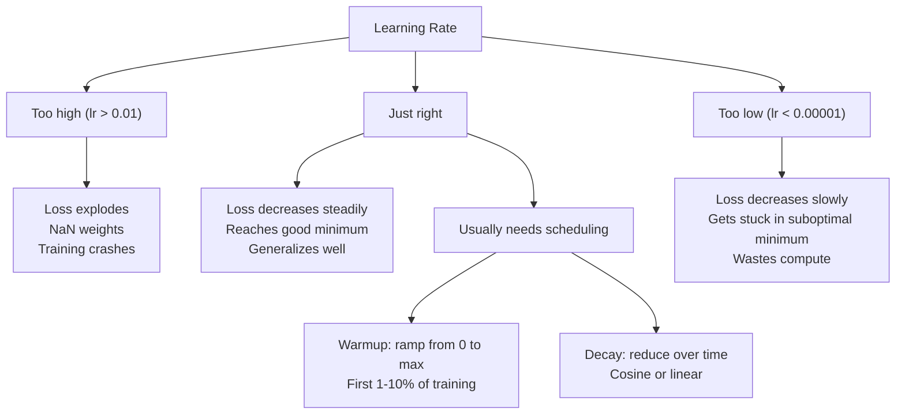
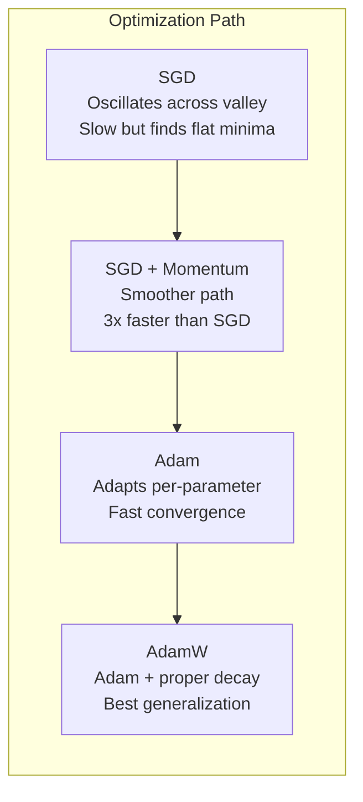
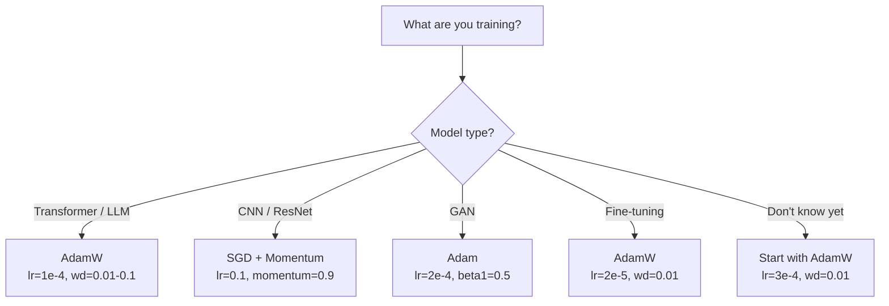

# 优化器

> 梯度下降告诉你该往哪个方向走。它对走多远、走多快只字不提。SGD 是一个指南针。Adam 是带路况数据的 GPS。

**类型：** Build
**语言：** Python
**前置要求：** 第 03.05 课（损失函数）
**预计时间：** ~75 分钟

## 学习目标

- 用 Python 从零实现 SGD、带动量的 SGD、Adam 和 AdamW 优化器
- 解释 Adam 的偏差修正如何补偿训练初期那些初始化为零的矩估计
- 演示为什么在同一个任务上，AdamW 比带 L2 正则化的 Adam 泛化得更好
- 为 transformer、CNN、GAN 和微调选对优化器和默认超参数

## 问题所在

你算出了梯度。你知道第 4721 号权重应该减小 0.003 来降低损失。但 0.003 是什么单位？以什么缩放？还有，第 1 步和第 1000 步应该走同样的幅度吗？

普通梯度下降在每一步对每个参数都施加同样的学习率：w = w - lr * gradient。这造成三个问题，让训练神经网络在实践中很痛苦。

第一，振荡。损失曲面很少是个平滑的碗。它更像一条又长又窄的山谷。梯度指向横穿山谷的方向（陡的方向），而不是沿着山谷的方向（缓的方向）。梯度下降在那个窄维度上来回弹跳，却只在有用的那个方向上挪一点点。你见过这个：损失先快速下降然后停滞，不是因为模型收敛了，而是因为它在振荡。

第二，对所有参数用一个学习率是错的。有些权重需要大更新（它们还在早期、欠拟合的阶段）。另一些需要极小的更新（它们已经接近最优值）。一个对前者有效的学习率会毁掉后者，反之亦然。

第三，鞍点。在高维里，损失曲面有大片梯度接近零的平坦区域。普通 SGD 以梯度的速度爬过这些区域，而那速度实际上为零。模型看起来卡住了。它没卡住——它在一个平坦区域里，另一边有可用的下坡。但 SGD 没有机制推过去。

Adam 一并解决了这三个问题。它对每个参数维护两个滑动平均——梯度均值（动量，处理振荡）和梯度平方的均值（自适应速率，处理不同尺度）。再加上对前几步的偏差修正，它给了你一个用默认超参数就能搞定 80% 问题的优化器。本课从零把它搭出来，让你确切理解它在另外 20% 上何时、为何失败。

## 核心概念

### 随机梯度下降（SGD）

最简单的优化器。在一个 mini-batch 上算梯度，往反方向走一步。

```
w = w - lr * gradient
```

"随机"指的是你用数据的一个随机子集（mini-batch）来估计梯度，而不是整个数据集。这种噪声其实有用——它帮你逃离尖锐的局部极小值。但噪声也导致振荡。

学习率是唯一的旋钮。太高：损失发散。太低：训练慢到天荒地老。最优值取决于架构、数据、批大小和当前训练阶段。对现代网络上的普通 SGD，典型值在 0.01 到 0.1 之间。但即便在一次训练里，理想的学习率也在变。

### 动量

球滚下坡的类比被用滥了，但确实准确。你不再只按梯度走一步，而是维护一个累积了过去梯度的速度。

```
m_t = beta * m_{t-1} + gradient
w = w - lr * m_t
```

Beta（通常 0.9）控制保留多少历史。beta = 0.9 时，动量大致是最近 10 个梯度的平均（1 / (1 - 0.9) = 10）。

它为什么能修复振荡：指向同一方向的梯度会累积。来回翻转方向的梯度会抵消。在那条窄山谷里，"横穿"分量每步都翻号，被抑制掉了；"沿着"分量保持一致，被放大了。结果就是在有用方向上平滑加速。

真实数字：单用 SGD 在一个病态损失曲面上可能要 10000 步。带动量的 SGD（beta=0.9）在同一个问题上通常 3000-5000 步。这个加速不是边际改善。

### RMSProp

第一个真正管用的逐参数自适应学习率方法。Hinton 在一次 Coursera 讲座里提出（从未正式发表）。

```
s_t = beta * s_{t-1} + (1 - beta) * gradient^2
w = w - lr * gradient / (sqrt(s_t) + epsilon)
```

s_t 追踪梯度平方的滑动平均。梯度一直很大的参数会被一个大数除（更小的有效学习率）。梯度很小的参数会被一个小数除（更大的有效学习率）。

这解决了"对所有参数用一个学习率"的问题。一个已经在拿大更新的权重多半接近它的目标了——给它慢下来。一个一直在拿极小更新的权重可能训练不足——给它加速。

Epsilon（通常 1e-8）防止某个参数还没更新过时除以零。

### Adam：动量 + RMSProp

Adam 把两个想法合起来。它对每个参数维护两个指数滑动平均：

```
m_t = beta1 * m_{t-1} + (1 - beta1) * gradient        (first moment: mean)
v_t = beta2 * v_{t-1} + (1 - beta2) * gradient^2       (second moment: variance)
```

**偏差修正**是大多数讲解会跳过的关键细节。在第 1 步，m_1 = (1 - beta1) * gradient。beta1 = 0.9 时，那是 0.1 * gradient——小了十倍。滑动平均还没热起来。偏差修正补偿了这一点：

```
m_hat = m_t / (1 - beta1^t)
v_hat = v_t / (1 - beta2^t)
```

第 1 步、beta1 = 0.9 时：m_hat = m_1 / (1 - 0.9) = m_1 / 0.1 = 实际梯度。第 100 步时：(1 - 0.9^100) 约等于 1.0，所以修正消失了。偏差修正对前 ~10 步重要，~50 步之后就无关紧要了。

更新：

```
w = w - lr * m_hat / (sqrt(v_hat) + epsilon)
```

Adam 默认值：lr = 0.001，beta1 = 0.9，beta2 = 0.999，epsilon = 1e-8。这些默认值适用于 80% 的问题。它们不灵时，先改 lr。然后是 beta2。几乎永远别改 beta1 或 epsilon。

### AdamW：正确做权重衰减

L2 正则化往损失里加 lambda * w^2。在普通 SGD 里，这等价于权重衰减（每步从权重里减 lambda * w）。在 Adam 里，这个等价关系断了。

Loshchilov & Hutter 的洞见是：当你往损失里加 L2、然后 Adam 处理梯度时，自适应学习率把正则化项也缩放了。梯度方差大的参数得到的正则化更少，方差小的得到的更多。这不是你想要的——你想要的是不管梯度统计如何、都施加均匀的正则化。

AdamW 通过在 Adam 更新之后直接对权重施加权重衰减来修复这一点：

```
w = w - lr * m_hat / (sqrt(v_hat) + epsilon) - lr * lambda * w
```

权重衰减项（lr * lambda * w）不被 Adam 的自适应因子缩放。每个参数都得到同样比例的收缩。

这看起来像个小细节。它不是。在几乎每个任务上，AdamW 都比 Adam + L2 正则化收敛到更好的解。它是 PyTorch 里训练 transformer、扩散模型和大多数现代架构的默认优化器。BERT、GPT、LLaMA、Stable Diffusion——全是用 AdamW 训出来的。

### 学习率：最重要的超参数



如果你只调一个超参数，调学习率。学习率改变 10 倍，比你要做的任何架构决策都更重要。常见默认值：

- SGD：lr = 0.01 到 0.1
- Adam/AdamW：lr = 1e-4 到 3e-4
- 微调预训练模型：lr = 1e-5 到 5e-5
- 学习率热身（warmup）：在前 1-10% 的步数里线性爬升

### 优化器对比



### 每个优化器何时胜出



## 动手构建

### 第 1 步：普通 SGD

```python
class SGD:
    def __init__(self, lr=0.01):
        self.lr = lr

    def step(self, params, grads):
        for i in range(len(params)):
            params[i] -= self.lr * grads[i]
```

### 第 2 步：带动量的 SGD

```python
class SGDMomentum:
    def __init__(self, lr=0.01, beta=0.9):
        self.lr = lr
        self.beta = beta
        self.velocities = None

    def step(self, params, grads):
        if self.velocities is None:
            self.velocities = [0.0] * len(params)
        for i in range(len(params)):
            self.velocities[i] = self.beta * self.velocities[i] + grads[i]
            params[i] -= self.lr * self.velocities[i]
```

### 第 3 步：Adam

```python
import math

class Adam:
    def __init__(self, lr=0.001, beta1=0.9, beta2=0.999, epsilon=1e-8):
        self.lr = lr
        self.beta1 = beta1
        self.beta2 = beta2
        self.epsilon = epsilon
        self.m = None
        self.v = None
        self.t = 0

    def step(self, params, grads):
        if self.m is None:
            self.m = [0.0] * len(params)
            self.v = [0.0] * len(params)

        self.t += 1

        for i in range(len(params)):
            self.m[i] = self.beta1 * self.m[i] + (1 - self.beta1) * grads[i]
            self.v[i] = self.beta2 * self.v[i] + (1 - self.beta2) * grads[i] ** 2

            m_hat = self.m[i] / (1 - self.beta1 ** self.t)
            v_hat = self.v[i] / (1 - self.beta2 ** self.t)

            params[i] -= self.lr * m_hat / (math.sqrt(v_hat) + self.epsilon)
```

### 第 4 步：AdamW

```python
class AdamW:
    def __init__(self, lr=0.001, beta1=0.9, beta2=0.999, epsilon=1e-8, weight_decay=0.01):
        self.lr = lr
        self.beta1 = beta1
        self.beta2 = beta2
        self.epsilon = epsilon
        self.weight_decay = weight_decay
        self.m = None
        self.v = None
        self.t = 0

    def step(self, params, grads):
        if self.m is None:
            self.m = [0.0] * len(params)
            self.v = [0.0] * len(params)

        self.t += 1

        for i in range(len(params)):
            self.m[i] = self.beta1 * self.m[i] + (1 - self.beta1) * grads[i]
            self.v[i] = self.beta2 * self.v[i] + (1 - self.beta2) * grads[i] ** 2

            m_hat = self.m[i] / (1 - self.beta1 ** self.t)
            v_hat = self.v[i] / (1 - self.beta2 ** self.t)

            params[i] -= self.lr * m_hat / (math.sqrt(v_hat) + self.epsilon)
            params[i] -= self.lr * self.weight_decay * params[i]
```

### 第 5 步：训练对比

用全部四个优化器，在第 05 课的圆形数据集上训练同一个两层网络。对比收敛情况。

```python
import random

def sigmoid(x):
    x = max(-500, min(500, x))
    return 1.0 / (1.0 + math.exp(-x))

def make_circle_data(n=200, seed=42):
    random.seed(seed)
    data = []
    for _ in range(n):
        x = random.uniform(-2, 2)
        y = random.uniform(-2, 2)
        label = 1.0 if x * x + y * y < 1.5 else 0.0
        data.append(([x, y], label))
    return data


class OptimizerTestNetwork:
    def __init__(self, optimizer, hidden_size=8):
        random.seed(0)
        self.hidden_size = hidden_size
        self.optimizer = optimizer

        self.w1 = [[random.gauss(0, 0.5) for _ in range(2)] for _ in range(hidden_size)]
        self.b1 = [0.0] * hidden_size
        self.w2 = [random.gauss(0, 0.5) for _ in range(hidden_size)]
        self.b2 = 0.0

    def get_params(self):
        params = []
        for row in self.w1:
            params.extend(row)
        params.extend(self.b1)
        params.extend(self.w2)
        params.append(self.b2)
        return params

    def set_params(self, params):
        idx = 0
        for i in range(self.hidden_size):
            for j in range(2):
                self.w1[i][j] = params[idx]
                idx += 1
        for i in range(self.hidden_size):
            self.b1[i] = params[idx]
            idx += 1
        for i in range(self.hidden_size):
            self.w2[i] = params[idx]
            idx += 1
        self.b2 = params[idx]

    def forward(self, x):
        self.x = x
        self.z1 = []
        self.h = []
        for i in range(self.hidden_size):
            z = self.w1[i][0] * x[0] + self.w1[i][1] * x[1] + self.b1[i]
            self.z1.append(z)
            self.h.append(max(0.0, z))

        self.z2 = sum(self.w2[i] * self.h[i] for i in range(self.hidden_size)) + self.b2
        self.out = sigmoid(self.z2)
        return self.out

    def compute_grads(self, target):
        eps = 1e-15
        p = max(eps, min(1 - eps, self.out))
        d_loss = -(target / p) + (1 - target) / (1 - p)
        d_sigmoid = self.out * (1 - self.out)
        d_out = d_loss * d_sigmoid

        grads = [0.0] * (self.hidden_size * 2 + self.hidden_size + self.hidden_size + 1)
        idx = 0
        for i in range(self.hidden_size):
            d_relu = 1.0 if self.z1[i] > 0 else 0.0
            d_h = d_out * self.w2[i] * d_relu
            grads[idx] = d_h * self.x[0]
            grads[idx + 1] = d_h * self.x[1]
            idx += 2

        for i in range(self.hidden_size):
            d_relu = 1.0 if self.z1[i] > 0 else 0.0
            grads[idx] = d_out * self.w2[i] * d_relu
            idx += 1

        for i in range(self.hidden_size):
            grads[idx] = d_out * self.h[i]
            idx += 1

        grads[idx] = d_out
        return grads

    def train(self, data, epochs=300):
        losses = []
        for epoch in range(epochs):
            total_loss = 0.0
            correct = 0
            for x, y in data:
                pred = self.forward(x)
                grads = self.compute_grads(y)
                params = self.get_params()
                self.optimizer.step(params, grads)
                self.set_params(params)

                eps = 1e-15
                p = max(eps, min(1 - eps, pred))
                total_loss += -(y * math.log(p) + (1 - y) * math.log(1 - p))
                if (pred >= 0.5) == (y >= 0.5):
                    correct += 1
            avg_loss = total_loss / len(data)
            accuracy = correct / len(data) * 100
            losses.append((avg_loss, accuracy))
            if epoch % 75 == 0 or epoch == epochs - 1:
                print(f"    Epoch {epoch:3d}: loss={avg_loss:.4f}, accuracy={accuracy:.1f}%")
        return losses
```

## 上手使用

PyTorch 的优化器负责处理参数组、梯度裁剪和学习率调度：

```python
import torch
import torch.optim as optim

model = torch.nn.Sequential(
    torch.nn.Linear(784, 256),
    torch.nn.ReLU(),
    torch.nn.Linear(256, 10),
)

optimizer = optim.AdamW(model.parameters(), lr=3e-4, weight_decay=0.01)

scheduler = optim.lr_scheduler.CosineAnnealingLR(optimizer, T_max=100)

for epoch in range(100):
    optimizer.zero_grad()
    output = model(torch.randn(32, 784))
    loss = torch.nn.functional.cross_entropy(output, torch.randint(0, 10, (32,)))
    loss.backward()
    torch.nn.utils.clip_grad_norm_(model.parameters(), max_norm=1.0)
    optimizer.step()
    scheduler.step()
```

套路永远是：zero_grad、forward、loss、backward、（clip）、step、（schedule）。把这个顺序记牢。搞错它（比如在 optimizer.step() 之前调 scheduler.step()）是一个常见的微妙 bug 来源。

对 CNN，很多从业者仍然偏爱 SGD + 动量（lr=0.1，momentum=0.9，weight_decay=1e-4）配一个 step 或余弦调度。SGD 找到更平坦的极小值，往往泛化得更好。对 transformer 和 LLM，AdamW 配 warmup + 余弦衰减是通用默认选项。没有量化过的理由就别跟共识对着干。

## 交付

本课产出：
- `outputs/prompt-optimizer-selector.md` —— 一个决策提示词，为任何架构选对优化器和学习率

## 练习

1. 实现 Nesterov 动量，在"前瞻"位置（w - lr * beta * v）而不是当前位置算梯度。在圆形数据集上和标准动量对比收敛情况。

2. 实现一个学习率热身调度：在前 10% 的训练步里从 0 线性爬到 max_lr，然后余弦衰减到 0。用 Adam + warmup 对比 Adam 不带 warmup 训练。测量在圆形数据集上达到 90% 准确率分别要多少 epoch。

3. 在 Adam 训练时追踪每个参数的有效学习率。有效率是 lr * m_hat / (sqrt(v_hat) + eps)。画出第 10、50、200 步后有效率的分布。所有参数都在以同样的速度更新吗？

4. 实现梯度裁剪（按全局范数裁剪）。把最大梯度范数设为 1.0。用一个高学习率（Adam 的 lr=0.01）分别在裁剪和不裁剪下训练。在 10 个随机种子上数有多少次运行发散（损失变成 NaN）。

5. 在一个权重很大的网络上对比 Adam 和 AdamW。把所有权重初始化为 [-5, 5] 里的随机值（比正常大得多）。用 weight_decay=0.1 训练 200 个 epoch。把两个优化器训练过程中权重的 L2 范数画出来。AdamW 应该表现出更快的权重收缩。

## 关键术语

| 术语 | 大家怎么说 | 实际是什么 |
|------|----------------|----------------------|
| 学习率（Learning rate） | "步长" | 施加在梯度更新上的标量乘数；训练里影响最大的单个超参数 |
| SGD | "基础梯度下降" | 随机梯度下降：在一个 mini-batch 上算梯度，用 w 减去 lr * gradient 来更新权重 |
| 动量（Momentum） | "滚球类比" | 过去梯度的指数滑动平均；抑制振荡、加速一致的方向 |
| RMSProp | "自适应学习率" | 把每个参数的梯度除以它近期梯度的滑动 RMS；拉平各参数的学习率 |
| Adam | "默认优化器" | 把动量（一阶矩）和 RMSProp（二阶矩）结合，并对初始几步做偏差修正 |
| AdamW | "正确版的 Adam" | 带解耦权重衰减的 Adam；直接对权重施加正则化，而不是通过梯度 |
| 偏差修正（Bias correction） | "给滑动平均热身" | 除以 (1 - beta^t)，补偿 Adam 矩估计的零初始化 |
| 权重衰减（Weight decay） | "收缩权重" | 每步从权重值里减去一小部分；一个惩罚大权重的正则化手段 |
| 学习率调度（Learning rate schedule） | "随时间改 lr" | 一个在训练中调整学习率的函数；warmup + 余弦衰减是现代默认选项 |
| 梯度裁剪（Gradient clipping） | "给梯度范数封顶" | 当梯度向量范数超过阈值时把它缩小；防止梯度爆炸式的更新 |

## 延伸阅读

- Kingma & Ba，《Adam: A Method for Stochastic Optimization》（2014）—— Adam 原始论文，带收敛分析和偏差修正推导
- Loshchilov & Hutter，《Decoupled Weight Decay Regularization》（2017）—— 证明 L2 正则化和权重衰减在 Adam 里不等价，并提出 AdamW
- Smith，《Cyclical Learning Rates for Training Neural Networks》（2017）—— 引入 LR 范围测试和循环调度，省去调一个固定学习率的麻烦
- Ruder，《An Overview of Gradient Descent Optimization Algorithms》（2016）—— 对所有优化器变体最好的单篇综述，对比和直觉都很清晰
