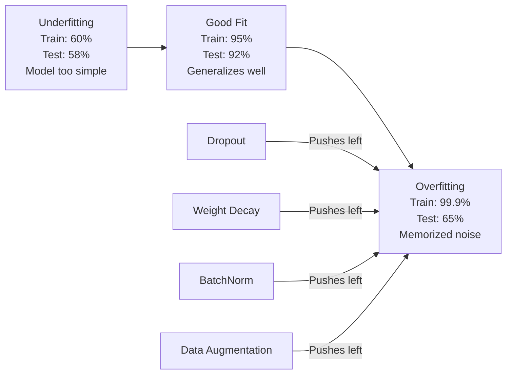
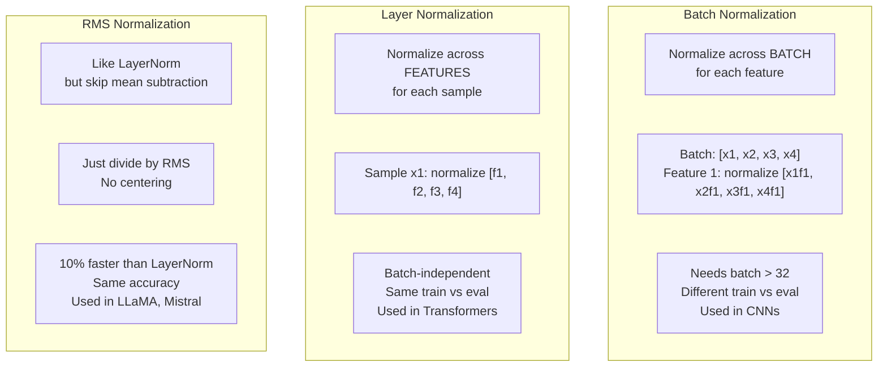
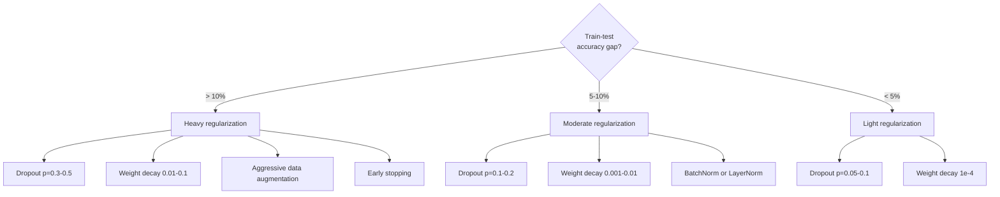

# 正则化

> 你的模型在训练数据上拿 99%，在测试数据上只有 60%。它在背书而不是学习。正则化就是你对复杂度征收的税，逼出泛化能力。

**类型：** Build
**语言：** Python
**前置要求：** 第 03.06 课（优化器）
**预计时间：** ~75 分钟

## 学习目标

- 从零实现带反向缩放的 dropout、L2 权重衰减、批归一化、层归一化和 RMSNorm
- 通过正则化实验测量训练-测试准确率差距，并诊断过拟合
- 解释为什么 transformer 用 LayerNorm 而不是 BatchNorm，以及为什么现代 LLM 偏爱 RMSNorm
- 根据过拟合的严重程度，施加正确组合的正则化手段

## 问题所在

一个参数足够多的神经网络能记住任何数据集。这不是假设——Zhang 等人（2017）通过在 ImageNet 上用随机标签训练标准网络证明了它。这些网络在完全随机的标签分配上达到了接近零的训练损失。它们记住了一百万对没有规律可学的随机输入-输出对。训练损失完美。测试准确率为零。

这就是过拟合问题，而且模型越大它越严重。GPT-3 有 1750 亿参数。训练集大约 5000 亿 token。有这么多参数，模型就有足够容量逐字记住训练数据里相当大的片段。没有正则化，它就只会照搬训练样本，而不是学可泛化的规律。

训练表现和测试表现之间的差距就是过拟合差距。本课里的每种技术都从不同角度攻击这个差距。Dropout 逼网络不依赖任何单个神经元。权重衰减防止任何单个权重长得太大。批归一化平滑损失曲面，让优化器找到更平坦、更可泛化的极小值。层归一化做同样的事，但在批归一化失效的地方（小批量、变长序列）能用。RMSNorm 通过去掉均值计算把它做快了 10%。每种技术都很简单。合在一起，它们就是"会背书的模型"和"会泛化的模型"之间的区别。

## 核心概念

### 过拟合谱系

每个模型都落在一个谱系上的某处，从欠拟合（太简单，捕捉不到规律）到过拟合（太复杂，把噪声也捕捉进来）。最佳点在两者之间，而正则化把模型从过拟合那一侧往中间推。



### Dropout

最简单的正则化技术，却有着最优雅的解释。训练时，以概率 p 随机把每个神经元的输出置零。

```
output = activation(z) * mask    where mask[i] ~ Bernoulli(1 - p)
```

p = 0.5 时，每次前向传播都有一半神经元被置零。网络必须学出冗余的表示，因为它没法预测哪些神经元会可用。这防止了协同适应（co-adaptation）——神经元学会依赖某些特定的其他神经元在场。

集成解释：一个有 N 个神经元、带 dropout 的网络创造了 2^N 个可能的子网络（每种神经元开/关的组合）。带 dropout 训练近似于同时训练全部 2^N 个子网络，每个在不同的 mini-batch 上。测试时，你用上所有神经元（不 dropout），并把输出按 (1 - p) 缩放，以匹配训练时的期望值。这等价于对 2^N 个子网络的预测取平均——单个模型里的一个巨型集成。

实践中，缩放是在训练时而不是测试时施加（反向 dropout，inverted dropout）：

```
During training:  output = activation(z) * mask / (1 - p)
During testing:   output = activation(z)   (no change needed)
```

这样更干净，因为测试代码根本不用知道 dropout 的存在。

默认比率：transformer 用 p = 0.1，MLP 用 p = 0.5，CNN 用 p = 0.2-0.3。dropout 越高 = 正则化越强 = 欠拟合风险越大。

### 权重衰减（L2 正则化）

把所有权重的平方幅度加进损失里：

```
total_loss = task_loss + (lambda / 2) * sum(w_i^2)
```

正则化项的梯度是 lambda * w。这意味着每一步每个权重都按一个与自身幅度成比例的比例朝零收缩。大权重受罚更重。模型被推向那些没有单个权重独大的解。

为什么这有助于泛化：过拟合的模型往往有放大训练数据中噪声的大权重。权重衰减让权重保持小，从而限制模型的有效容量，逼它依赖稳健、可泛化的特征，而不是记住的怪癖。

lambda 超参数控制强度。典型值：

- transformer 上的 AdamW 用 0.01
- CNN 上的 SGD 用 1e-4
- 严重过拟合的模型用 0.1

如第 06 课所述：权重衰减和 L2 正则化在 SGD 里等价，但在 Adam 里不等价。用 Adam 训练时永远用 AdamW（解耦权重衰减）。

### 批归一化

在送给下一层之前，把每层的输出跨 mini-batch 归一化。

对某一层一个 mini-batch 的激活：

```
mu = (1/B) * sum(x_i)           (batch mean)
sigma^2 = (1/B) * sum((x_i - mu)^2)   (batch variance)
x_hat = (x_i - mu) / sqrt(sigma^2 + eps)   (normalize)
y = gamma * x_hat + beta        (scale and shift)
```

Gamma 和 beta 是可学习参数，如果撤销归一化更优，它们能让网络撤销归一化。没有它们，你就是在强迫每层的输出零均值单位方差，而这未必是网络想要的。

**训练 vs 推理的区别：** 训练时，mu 和 sigma 来自当前 mini-batch。推理时，你用训练中累积的滑动平均（动量 = 0.1 的指数滑动平均，即 90% 旧 + 10% 新）。

BatchNorm 为什么有效至今仍有争议。原始论文声称它减少了"内部协变量偏移"（internal covariate shift，即随着前面的层更新，层输入的分布在变）。Santurkar 等人（2018）证明这个解释是错的。真正的原因：BatchNorm 让损失曲面更平滑。梯度更有预测性，Lipschitz 常数更小，优化器能安全地走更大的步子。这就是为什么 BatchNorm 让你能用更高的学习率、收敛得更快。

BatchNorm 有个根本性的局限：它依赖批统计量。批大小为 1 时，均值和方差毫无意义。批量小（< 32）时，统计量很嘈杂，会拖累表现。这对目标检测（显存限制了批大小）和语言建模（序列长度各异）这类任务很要命。

### 层归一化

跨特征归一化，而不是跨批。对单个样本：

```
mu = (1/D) * sum(x_j)           (feature mean)
sigma^2 = (1/D) * sum((x_j - mu)^2)   (feature variance)
x_hat = (x_j - mu) / sqrt(sigma^2 + eps)
y = gamma * x_hat + beta
```

D 是特征维度。每个样本独立归一化——不依赖批大小。这就是为什么 transformer 用 LayerNorm 而不是 BatchNorm。序列长度各异，批大小往往很小（生成时甚至为 1），而且训练和推理时的计算完全一致。

transformer 里的 LayerNorm 施加在每个自注意力块和每个前馈块之后（Post-LN），或者之前（Pre-LN，训练更稳定）。

### RMSNorm

去掉均值减法的 LayerNorm。由 Zhang & Sennrich（2019）提出。

```
rms = sqrt((1/D) * sum(x_j^2))
y = gamma * x / rms
```

就这样。没有均值计算，没有 beta 参数。观察发现：LayerNorm 里的重新居中（减均值）对模型表现贡献极小，却要花算力。去掉它能在开销少约 10% 的情况下得到同样的准确率。

LLaMA、LLaMA 2、LLaMA 3、Mistral 以及大多数现代 LLM 都用 RMSNorm 而不是 LayerNorm。在数十亿参数、数万亿 token 的规模下，那 10% 的节省很可观。

### 归一化对比



### 把数据增强当作正则化

不是改模型，而是改数据。在保留标签的前提下变换训练输入：

- 图像：随机裁剪、翻转、旋转、颜色抖动、抠洞（cutout）
- 文本：同义词替换、回译、随机删除
- 音频：时间拉伸、音高变换、加噪

效果和正则化一样：它增大了训练集的有效规模，让模型更难记住特定样本。一个每张图只见过一次原始形态的模型能记住它。一个见过每张图 50 个增强版本的模型则被迫去学不变的结构。

### 早停

最简单的正则化手段：当验证损失开始上升时停止训练。那个时刻模型还没过拟合。实践中，你每个 epoch 追踪验证损失、保存最好的模型，并在一个"耐心"窗口（通常 5-20 个 epoch）内继续训练。如果验证损失在耐心窗口内没改善，就停下来、加载保存的最佳模型。

### 什么时候用什么



## 动手构建

### 第 1 步：Dropout（训练模式和评估模式）

```python
import random
import math


class Dropout:
    def __init__(self, p=0.5):
        self.p = p
        self.training = True
        self.mask = None

    def forward(self, x):
        if not self.training:
            return list(x)
        self.mask = []
        output = []
        for val in x:
            if random.random() < self.p:
                self.mask.append(0)
                output.append(0.0)
            else:
                self.mask.append(1)
                output.append(val / (1 - self.p))
        return output

    def backward(self, grad_output):
        grads = []
        for g, m in zip(grad_output, self.mask):
            if m == 0:
                grads.append(0.0)
            else:
                grads.append(g / (1 - self.p))
        return grads
```

### 第 2 步：L2 权重衰减

```python
def l2_regularization(weights, lambda_reg):
    penalty = 0.0
    for w in weights:
        penalty += w * w
    return lambda_reg * 0.5 * penalty

def l2_gradient(weights, lambda_reg):
    return [lambda_reg * w for w in weights]
```

### 第 3 步：批归一化

```python
class BatchNorm:
    def __init__(self, num_features, momentum=0.1, eps=1e-5):
        self.gamma = [1.0] * num_features
        self.beta = [0.0] * num_features
        self.eps = eps
        self.momentum = momentum
        self.running_mean = [0.0] * num_features
        self.running_var = [1.0] * num_features
        self.training = True
        self.num_features = num_features

    def forward(self, batch):
        batch_size = len(batch)
        if self.training:
            mean = [0.0] * self.num_features
            for sample in batch:
                for j in range(self.num_features):
                    mean[j] += sample[j]
            mean = [m / batch_size for m in mean]

            var = [0.0] * self.num_features
            for sample in batch:
                for j in range(self.num_features):
                    var[j] += (sample[j] - mean[j]) ** 2
            var = [v / batch_size for v in var]

            for j in range(self.num_features):
                self.running_mean[j] = (1 - self.momentum) * self.running_mean[j] + self.momentum * mean[j]
                self.running_var[j] = (1 - self.momentum) * self.running_var[j] + self.momentum * var[j]
        else:
            mean = list(self.running_mean)
            var = list(self.running_var)

        self.x_hat = []
        output = []
        for sample in batch:
            normalized = []
            out_sample = []
            for j in range(self.num_features):
                x_h = (sample[j] - mean[j]) / math.sqrt(var[j] + self.eps)
                normalized.append(x_h)
                out_sample.append(self.gamma[j] * x_h + self.beta[j])
            self.x_hat.append(normalized)
            output.append(out_sample)
        return output
```

### 第 4 步：层归一化

```python
class LayerNorm:
    def __init__(self, num_features, eps=1e-5):
        self.gamma = [1.0] * num_features
        self.beta = [0.0] * num_features
        self.eps = eps
        self.num_features = num_features

    def forward(self, x):
        mean = sum(x) / len(x)
        var = sum((xi - mean) ** 2 for xi in x) / len(x)

        self.x_hat = []
        output = []
        for j in range(self.num_features):
            x_h = (x[j] - mean) / math.sqrt(var + self.eps)
            self.x_hat.append(x_h)
            output.append(self.gamma[j] * x_h + self.beta[j])
        return output
```

### 第 5 步：RMSNorm

```python
class RMSNorm:
    def __init__(self, num_features, eps=1e-6):
        self.gamma = [1.0] * num_features
        self.eps = eps
        self.num_features = num_features

    def forward(self, x):
        rms = math.sqrt(sum(xi * xi for xi in x) / len(x) + self.eps)
        output = []
        for j in range(self.num_features):
            output.append(self.gamma[j] * x[j] / rms)
        return output
```

### 第 6 步：带正则化和不带正则化的训练对比

```python
def sigmoid(x):
    x = max(-500, min(500, x))
    return 1.0 / (1.0 + math.exp(-x))


def make_circle_data(n=200, seed=42):
    random.seed(seed)
    data = []
    for _ in range(n):
        x = random.uniform(-2, 2)
        y = random.uniform(-2, 2)
        label = 1.0 if x * x + y * y < 1.5 else 0.0
        data.append(([x, y], label))
    return data


class RegularizedNetwork:
    def __init__(self, hidden_size=16, lr=0.05, dropout_p=0.0, weight_decay=0.0):
        random.seed(0)
        self.hidden_size = hidden_size
        self.lr = lr
        self.dropout_p = dropout_p
        self.weight_decay = weight_decay
        self.dropout = Dropout(p=dropout_p) if dropout_p > 0 else None

        self.w1 = [[random.gauss(0, 0.5) for _ in range(2)] for _ in range(hidden_size)]
        self.b1 = [0.0] * hidden_size
        self.w2 = [random.gauss(0, 0.5) for _ in range(hidden_size)]
        self.b2 = 0.0

    def forward(self, x, training=True):
        self.x = x
        self.z1 = []
        self.h = []
        for i in range(self.hidden_size):
            z = self.w1[i][0] * x[0] + self.w1[i][1] * x[1] + self.b1[i]
            self.z1.append(z)
            self.h.append(max(0.0, z))

        if self.dropout and training:
            self.dropout.training = True
            self.h = self.dropout.forward(self.h)
        elif self.dropout:
            self.dropout.training = False
            self.h = self.dropout.forward(self.h)

        self.z2 = sum(self.w2[i] * self.h[i] for i in range(self.hidden_size)) + self.b2
        self.out = sigmoid(self.z2)
        return self.out

    def backward(self, target):
        eps = 1e-15
        p = max(eps, min(1 - eps, self.out))
        d_loss = -(target / p) + (1 - target) / (1 - p)
        d_sigmoid = self.out * (1 - self.out)
        d_out = d_loss * d_sigmoid

        for i in range(self.hidden_size):
            d_relu = 1.0 if self.z1[i] > 0 else 0.0
            d_h = d_out * self.w2[i] * d_relu
            self.w2[i] -= self.lr * (d_out * self.h[i] + self.weight_decay * self.w2[i])
            for j in range(2):
                self.w1[i][j] -= self.lr * (d_h * self.x[j] + self.weight_decay * self.w1[i][j])
            self.b1[i] -= self.lr * d_h
        self.b2 -= self.lr * d_out

    def evaluate(self, data):
        correct = 0
        total_loss = 0.0
        for x, y in data:
            pred = self.forward(x, training=False)
            eps = 1e-15
            p = max(eps, min(1 - eps, pred))
            total_loss += -(y * math.log(p) + (1 - y) * math.log(1 - p))
            if (pred >= 0.5) == (y >= 0.5):
                correct += 1
        return total_loss / len(data), correct / len(data) * 100

    def train_model(self, train_data, test_data, epochs=300):
        history = []
        for epoch in range(epochs):
            total_loss = 0.0
            correct = 0
            for x, y in train_data:
                pred = self.forward(x, training=True)
                self.backward(y)
                eps = 1e-15
                p = max(eps, min(1 - eps, pred))
                total_loss += -(y * math.log(p) + (1 - y) * math.log(1 - p))
                if (pred >= 0.5) == (y >= 0.5):
                    correct += 1
            train_loss = total_loss / len(train_data)
            train_acc = correct / len(train_data) * 100
            test_loss, test_acc = self.evaluate(test_data)
            history.append((train_loss, train_acc, test_loss, test_acc))
            if epoch % 75 == 0 or epoch == epochs - 1:
                gap = train_acc - test_acc
                print(f"    Epoch {epoch:3d}: train_acc={train_acc:.1f}%, test_acc={test_acc:.1f}%, gap={gap:.1f}%")
        return history
```

## 上手使用

PyTorch 把所有归一化和正则化都提供成了模块：

```python
import torch
import torch.nn as nn

model = nn.Sequential(
    nn.Linear(784, 256),
    nn.BatchNorm1d(256),
    nn.ReLU(),
    nn.Dropout(0.3),
    nn.Linear(256, 128),
    nn.BatchNorm1d(128),
    nn.ReLU(),
    nn.Dropout(0.3),
    nn.Linear(128, 10),
)

model.train()
out_train = model(torch.randn(32, 784))

model.eval()
out_test = model(torch.randn(1, 784))
```

`model.train()` / `model.eval()` 这个切换至关重要。它开关 dropout，并告诉 BatchNorm 用批统计量还是滑动统计量。推理前忘了 `model.eval()` 是深度学习里最常见的 bug 之一。你的测试准确率会随机波动，因为 dropout 还开着、BatchNorm 还在用 mini-batch 统计量。

对 transformer，套路不一样：

```python
class TransformerBlock(nn.Module):
    def __init__(self, d_model=512, nhead=8, dropout=0.1):
        super().__init__()
        self.attention = nn.MultiheadAttention(d_model, nhead, dropout=dropout)
        self.norm1 = nn.LayerNorm(d_model)
        self.ff = nn.Sequential(
            nn.Linear(d_model, d_model * 4),
            nn.GELU(),
            nn.Linear(d_model * 4, d_model),
            nn.Dropout(dropout),
        )
        self.norm2 = nn.LayerNorm(d_model)
        self.dropout = nn.Dropout(dropout)

    def forward(self, x):
        attended, _ = self.attention(x, x, x)
        x = self.norm1(x + self.dropout(attended))
        x = self.norm2(x + self.ff(x))
        return x
```

LayerNorm，不是 BatchNorm。Dropout p=0.1，不是 p=0.5。这些是 transformer 的默认值。

## 交付

本课产出：
- `outputs/prompt-regularization-advisor.md` —— 一个提示词，诊断过拟合并推荐正确的正则化策略

## 练习

1. 为二维数据实现空间 dropout：不丢弃单个神经元，而是丢弃整个特征通道。把若干连续特征当成通道、整组丢弃来模拟它。在 hidden_size=32 的圆形数据集上，和标准 dropout 对比训练-测试差距。

2. 把第 05 课的标签平滑和本课的 dropout 结合起来。用四种配置训练：都不用、只用 dropout、只用标签平滑、两个都用。测量每种的最终训练-测试准确率差距。哪种组合差距最小？

3. 在你的圆形数据集网络里，在隐藏层和激活之间加一个 BatchNorm 层。在学习率 0.01、0.05、0.1 下分别用和不用 BatchNorm 训练。在普通网络发散的更高学习率下，BatchNorm 应该能稳定训练。

4. 实现早停：每个 epoch 追踪测试损失、保存最佳权重，如果测试损失 20 个 epoch 没改善就停。把正则化网络跑 1000 个 epoch。报告哪个 epoch 测试准确率最高，以及你省下了多少 epoch 的计算。

5. 在一个 4 层网络（不只 2 层）上对比 LayerNorm 和 RMSNorm。用同样的权重初始化两者。训练 200 个 epoch，对比最终准确率、训练速度（每个 epoch 用时）和第一层的梯度幅度。验证 RMSNorm 在同样准确率下更快。

## 关键术语

| 术语 | 大家怎么说 | 实际是什么 |
|------|----------------|----------------------|
| 过拟合（Overfitting） | "模型把数据背下来了" | 模型的训练表现显著超过测试表现，表明它学的是噪声而非信号 |
| 正则化（Regularization） | "防止过拟合" | 任何约束模型复杂度以改善泛化的技术：dropout、权重衰减、归一化、数据增强 |
| Dropout | "随机删神经元" | 训练时以概率 p 把随机神经元置零，逼出冗余表示；等价于训练一个集成 |
| 权重衰减（Weight decay） | "L2 惩罚" | 每步减去 lambda * w 把所有权重朝零收缩；通过权重幅度惩罚复杂度 |
| 批归一化（Batch normalization） | "按批归一化" | 跨批维度归一化层输出，训练时用批统计量、推理时用滑动平均 |
| 层归一化（Layer normalization） | "按样本归一化" | 在每个样本内跨特征归一化；不依赖批，用在批大小多变的 transformer 里 |
| RMSNorm | "去掉均值的 LayerNorm" | 均方根归一化；从 LayerNorm 去掉减均值，准确率相同、提速 10% |
| 早停（Early stopping） | "在过拟合前停" | 验证损失停止改善时中止训练；最简单的正则化手段，常与其他配合使用 |
| 数据增强（Data augmentation） | "以少变多" | 变换训练输入（翻转、裁剪、加噪）来增大有效数据集规模、逼出不变性学习 |
| 泛化差距（Generalization gap） | "训练-测试落差" | 训练表现和测试表现之差；正则化的目标就是最小化这个差距 |

## 延伸阅读

- Srivastava 等人，《Dropout: A Simple Way to Prevent Neural Networks from Overfitting》（2014）—— dropout 原始论文，带集成解释和大量实验
- Ioffe & Szegedy，《Batch Normalization: Accelerating Deep Network Training by Reducing Internal Covariate Shift》（2015）—— 引入 BatchNorm 及其训练流程，深度学习被引用最多的论文之一
- Zhang & Sennrich，《Root Mean Square Layer Normalization》（2019）—— 证明 RMSNorm 在更少计算下匹敌 LayerNorm 的准确率；被 LLaMA 和 Mistral 采用
- Zhang 等人，《Understanding Deep Learning Requires Rethinking Generalization》（2017）—— 里程碑式论文，表明神经网络能记住随机标签，挑战了对泛化的传统看法
