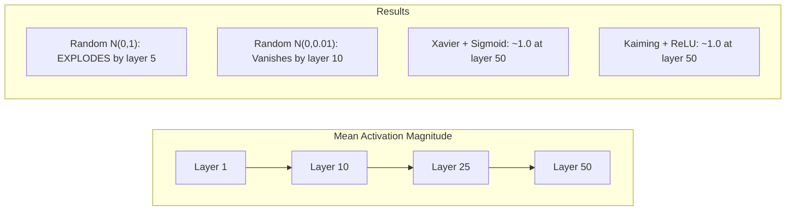
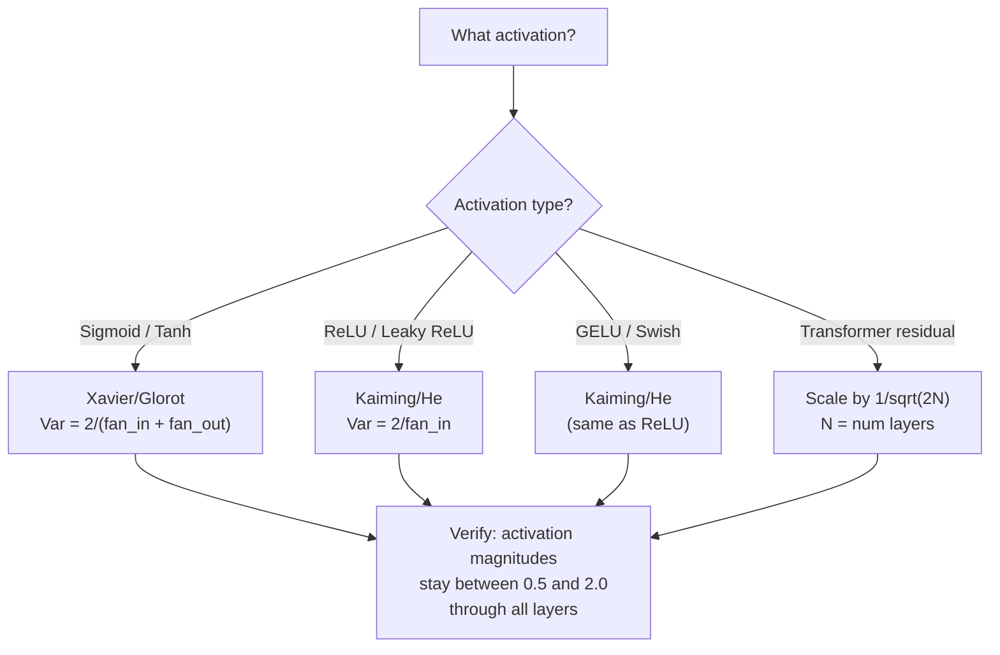

# 权重初始化与训练稳定性

> 初始化错了，训练根本启动不起来。初始化对了，50 层训练起来和 3 层一样顺。

**类型：** Build
**语言：** Python
**前置要求：** 第 03.04 课（激活函数）、第 03.07 课（正则化）
**预计时间：** ~90 分钟

## 学习目标

- 实现零、随机、Xavier/Glorot、Kaiming/He 初始化策略，并测量它们对信号穿过 50 层后激活幅度的影响
- 推导为什么 Xavier 初始化用 Var(w) = 2/(fan_in + fan_out)、Kaiming 用 Var(w) = 2/fan_in
- 演示零初始化的对称性问题，并解释为什么光有随机尺度还不够
- 把正确的初始化策略和激活函数对上：sigmoid/tanh 用 Xavier，ReLU/GELU 用 Kaiming

## 问题所在

把所有权重初始化为零。什么都学不会。每个神经元算同一个函数、收到同一个梯度、更新得一模一样。一万个 epoch 之后，你那 512 个神经元的隐藏层仍然是同一个神经元的 512 份拷贝。你为 512 个参数付了钱，拿到的是 1 个。

把它们初始化得太大。激活值在网络里爆炸。到第 10 层，值飙到 1e15。到第 20 层，溢出成无穷。梯度沿着同一条轨迹反向重演。

把它们从标准正态分布里随机初始化。3 层管用。50 层时，信号要么塌缩成零、要么引爆成无穷，取决于那个随机尺度是稍微小了点还是稍微大了点。"能用"和"坏掉"之间的边界薄如刀刃。

权重初始化是深度学习里最被低估的决策。架构能发论文。优化器有博客文章。初始化只得到一个脚注。但搞错它，其他一切都白搭——你的网络在训练开始之前就死了。

## 核心概念

### 对称性问题

一层里每个神经元结构都一样：输入乘权重、加偏置、过激活。如果所有权重从同一个值起步（零是极端情形），每个神经元算出同样的输出。反向传播时，每个神经元收到同样的梯度。更新时，每个神经元变化同样的量。

你卡住了。网络有几百个参数，但它们全都齐步走。这叫对称性，而随机初始化是打破它的暴力办法。每个神经元在权重空间里从不同的点起步，于是各学各的特征。

但"随机"还不够。随机性的*尺度*决定了网络能不能训练。

### 方差在层间的传播

考虑一个有 fan_in 个输入的层：

```
z = w1*x1 + w2*x2 + ... + w_n*x_n
```

如果每个权重 wi 取自一个方差为 Var(w) 的分布、每个输入 xi 方差为 Var(x)，那么输出方差是：

```
Var(z) = fan_in * Var(w) * Var(x)
```

如果 Var(w) = 1、fan_in = 512，输出方差就是输入方差的 512 倍。10 层之后：512^10 = 1.2e27。你的信号爆炸了。

如果 Var(w) = 0.001，输出方差每层缩小 0.001 * 512 = 0.512 倍。10 层之后：0.512^10 = 0.00013。你的信号消失了。

目标是：选一个 Var(w) 使得 Var(z) = Var(x)。信号幅度跨层保持不变。

### Xavier/Glorot 初始化

Glorot 和 Bengio（2010）为 sigmoid 和 tanh 激活推出了解。要在前向和反向传播里都保持方差不变：

```
Var(w) = 2 / (fan_in + fan_out)
```

实践中，权重取自：

```
w ~ Uniform(-limit, limit)  where limit = sqrt(6 / (fan_in + fan_out))
```

或者：

```
w ~ Normal(0, sqrt(2 / (fan_in + fan_out)))
```

它有效是因为 sigmoid 和 tanh 在零附近近似线性，而初始化得当的激活值就活在那里。方差能稳定地穿过几十层。

### Kaiming/He 初始化

ReLU 杀掉一半输出（所有负值变成零）。有效的 fan_in 减半，因为平均一半的输入被置零了。Xavier 初始化没把这个算进去——它低估了所需的方差。

He 等人（2015）调整了公式：

```
Var(w) = 2 / fan_in
```

权重取自：

```
w ~ Normal(0, sqrt(2 / fan_in))
```

那个因子 2 补偿了 ReLU 把一半激活置零这件事。没有它，信号每层缩小约 0.5 倍。50 层时：0.5^50 = 8.8e-16。Kaiming 初始化防止了这一点。

### Transformer 初始化

GPT-2 引入了一种不同的套路。残差连接把每个子层的输出加回到它的输入上：

```
x = x + sublayer(x)
```

每次相加都增大方差。有 N 个残差层时，方差按正比于 N 增长。GPT-2 把残差层的权重按 1/sqrt(2N) 缩放，N 是层数。这让累积的信号幅度保持稳定。

Llama 3（4050 亿参数，126 层）用了类似的方案。没有这个缩放，残差流会在 126 层注意力和前馈块里无界增长。

```mermaid
flowchart TD
    subgraph "Zero Init"
        Z1["Layer 1<br/>All weights = 0"] --> Z2["Layer 2<br/>All neurons identical"]
        Z2 --> Z3["Layer 3<br/>Still identical"]
        Z3 --> ZR["Result: 1 effective neuron<br/>regardless of width"]
    end

    subgraph "Xavier Init"
        X1["Layer 1<br/>Var = 2/(fan_in+fan_out)"] --> X2["Layer 2<br/>Signal stable"]
        X2 --> X3["Layer 50<br/>Signal stable"]
        X3 --> XR["Result: Trains with<br/>sigmoid/tanh"]
    end

    subgraph "Kaiming Init"
        K1["Layer 1<br/>Var = 2/fan_in"] --> K2["Layer 2<br/>Signal stable"]
        K2 --> K3["Layer 50<br/>Signal stable"]
        K3 --> KR["Result: Trains with<br/>ReLU/GELU"]
    end
```



### 激活幅度穿过 50 层



### 选对初始化



## 动手构建

### 第 1 步：初始化策略

初始化权重矩阵的四种方式。每个返回一个列表的列表（一个二维矩阵），有 fan_in 列、fan_out 行。

```python
import math
import random


def zero_init(fan_in, fan_out):
    return [[0.0 for _ in range(fan_in)] for _ in range(fan_out)]


def random_init(fan_in, fan_out, scale=1.0):
    return [[random.gauss(0, scale) for _ in range(fan_in)] for _ in range(fan_out)]


def xavier_init(fan_in, fan_out):
    std = math.sqrt(2.0 / (fan_in + fan_out))
    return [[random.gauss(0, std) for _ in range(fan_in)] for _ in range(fan_out)]


def kaiming_init(fan_in, fan_out):
    std = math.sqrt(2.0 / fan_in)
    return [[random.gauss(0, std) for _ in range(fan_in)] for _ in range(fan_out)]
```

### 第 2 步：激活函数

我们需要 sigmoid、tanh 和 ReLU，好用各自配套的激活去测试每种初始化策略。

```python
def sigmoid(x):
    x = max(-500, min(500, x))
    return 1.0 / (1.0 + math.exp(-x))


def tanh_act(x):
    return math.tanh(x)


def relu(x):
    return max(0.0, x)
```

### 第 3 步：前向穿过 50 层

让随机数据穿过一个深层网络，测量每一层的平均激活幅度。

```python
def forward_deep(init_fn, activation_fn, n_layers=50, width=64, n_samples=100):
    random.seed(42)
    layer_magnitudes = []

    inputs = [[random.gauss(0, 1) for _ in range(width)] for _ in range(n_samples)]

    for layer_idx in range(n_layers):
        weights = init_fn(width, width)
        biases = [0.0] * width

        new_inputs = []
        for sample in inputs:
            output = []
            for neuron_idx in range(width):
                z = sum(weights[neuron_idx][j] * sample[j] for j in range(width)) + biases[neuron_idx]
                output.append(activation_fn(z))
            new_inputs.append(output)
        inputs = new_inputs

        magnitudes = []
        for sample in inputs:
            magnitudes.append(sum(abs(v) for v in sample) / width)
        mean_mag = sum(magnitudes) / len(magnitudes)
        layer_magnitudes.append(mean_mag)

    return layer_magnitudes
```

### 第 4 步：实验

跑所有组合：零初始化、随机 N(0,1)、随机 N(0,0.01)、Xavier 配 sigmoid、Xavier 配 tanh、Kaiming 配 ReLU。打印关键层的幅度。

```python
def run_experiment():
    configs = [
        ("Zero init + Sigmoid", lambda fi, fo: zero_init(fi, fo), sigmoid),
        ("Random N(0,1) + ReLU", lambda fi, fo: random_init(fi, fo, 1.0), relu),
        ("Random N(0,0.01) + ReLU", lambda fi, fo: random_init(fi, fo, 0.01), relu),
        ("Xavier + Sigmoid", xavier_init, sigmoid),
        ("Xavier + Tanh", xavier_init, tanh_act),
        ("Kaiming + ReLU", kaiming_init, relu),
    ]

    print(f"{'Strategy':<30} {'L1':>10} {'L5':>10} {'L10':>10} {'L25':>10} {'L50':>10}")
    print("-" * 80)

    for name, init_fn, act_fn in configs:
        mags = forward_deep(init_fn, act_fn)
        row = f"{name:<30}"
        for idx in [0, 4, 9, 24, 49]:
            val = mags[idx]
            if val > 1e6:
                row += f" {'EXPLODED':>10}"
            elif val < 1e-6:
                row += f" {'VANISHED':>10}"
            else:
                row += f" {val:>10.4f}"
        print(row)
```

### 第 5 步：对称性演示

展示零初始化产出一模一样的神经元。

```python
def symmetry_demo():
    random.seed(42)
    weights = zero_init(2, 4)
    biases = [0.0] * 4

    inputs = [0.5, -0.3]
    outputs = []
    for neuron_idx in range(4):
        z = sum(weights[neuron_idx][j] * inputs[j] for j in range(2)) + biases[neuron_idx]
        outputs.append(sigmoid(z))

    print("\nSymmetry Demo (4 neurons, zero init):")
    for i, out in enumerate(outputs):
        print(f"  Neuron {i}: output = {out:.6f}")
    all_same = all(abs(outputs[i] - outputs[0]) < 1e-10 for i in range(len(outputs)))
    print(f"  All identical: {all_same}")
    print(f"  Effective parameters: 1 (not {len(weights) * len(weights[0])})")
```

### 第 6 步：逐层幅度报告

打印一张激活幅度穿过 50 层的可视化条形图。

```python
def magnitude_report(name, magnitudes):
    print(f"\n{name}:")
    for i, mag in enumerate(magnitudes):
        if i % 5 == 0 or i == len(magnitudes) - 1:
            if mag > 1e6:
                bar = "X" * 50 + " EXPLODED"
            elif mag < 1e-6:
                bar = "." + " VANISHED"
            else:
                bar_len = min(50, max(1, int(mag * 10)))
                bar = "#" * bar_len
            print(f"  Layer {i+1:3d}: {bar} ({mag:.6f})")
```

## 上手使用

PyTorch 把这些都提供成了内置函数：

```python
import torch
import torch.nn as nn

layer = nn.Linear(512, 256)

nn.init.xavier_uniform_(layer.weight)
nn.init.xavier_normal_(layer.weight)

nn.init.kaiming_uniform_(layer.weight, nonlinearity='relu')
nn.init.kaiming_normal_(layer.weight, nonlinearity='relu')

nn.init.zeros_(layer.bias)
```

当你调 `nn.Linear(512, 256)` 时，PyTorch 默认用 Kaiming 均匀初始化。这就是为什么大多数简单网络"就这么能跑"——PyTorch 已经替你做了对的选择。但当你搭自定义架构、或者深过 20 层时，你就需要理解发生了什么，并可能要覆盖默认值。

对 transformer，HuggingFace 的模型通常在它们的 `_init_weights` 方法里处理初始化。GPT-2 的实现把残差投影按 1/sqrt(N) 缩放。如果你从零搭一个 transformer，得自己把这个加上。

## 交付

本课产出：
- `outputs/prompt-init-strategy.md` —— 一个提示词，诊断权重初始化问题并推荐正确的策略

## 练习

1. 加上 LeCun 初始化（Var = 1/fan_in，为 SELU 激活设计）。用 LeCun 初始化 + tanh 跑 50 层实验，和 Xavier + tanh 对比。

2. 实现 GPT-2 的残差缩放：把每层的输出在加回残差流之前乘上 1/sqrt(2*N)。带缩放和不带缩放各跑 50 层，测量残差幅度增长得多快。

3. 写一个"初始化健康检查"函数，接收一个网络的层维度和激活类型，然后推荐正确的初始化，如果当前初始化会出问题就警告。

4. 用 fan_in = 16 对比 fan_in = 1024 跑实验。Xavier 和 Kaiming 会适应 fan_in，但随机初始化不会。展示"能用"和"坏掉"之间的差距如何随着层变大而拉宽。

5. 实现正交初始化（生成一个随机矩阵，算它的 SVD，用正交矩阵 U）。在 50 层的 ReLU 网络上和 Kaiming 对比。

## 关键术语

| 术语 | 大家怎么说 | 实际是什么 |
|------|----------------|----------------------|
| 权重初始化（Weight initialization） | "随机设起始权重" | 选择初始权重值的策略，决定一个网络究竟能不能训练 |
| 打破对称（Symmetry breaking） | "让神经元不一样" | 用随机初始化确保神经元学到不同的特征，而不是算同一个函数 |
| fan-in | "一个神经元的输入数" | 进入的连接数，决定输入方差在加权和里怎么累积 |
| fan-out | "一个神经元的输出数" | 输出的连接数，与反向传播时维持梯度方差有关 |
| Xavier/Glorot 初始化 | "sigmoid 的初始化" | Var(w) = 2/(fan_in + fan_out)，设计来让方差穿过 sigmoid 和 tanh 激活保持不变 |
| Kaiming/He 初始化 | "ReLU 的初始化" | Var(w) = 2/fan_in，把 ReLU 把一半激活置零这件事算了进去 |
| 方差传播（Variance propagation） | "信号穿过层时怎么涨怎么缩" | 对激活方差如何随权重尺度逐层变化的数学分析 |
| 残差缩放（Residual scaling） | "GPT-2 的初始化技巧" | 把残差连接权重按 1/sqrt(2N) 缩放，防止方差穿过 N 个 transformer 层时增长 |
| 死亡网络（Dead network） | "什么都训练不动" | 糟糕的初始化导致所有梯度为零或所有激活饱和的网络 |
| 激活爆炸（Exploding activations） | "值跑到无穷" | 权重方差太高，导致激活幅度穿过层时指数级增长 |

## 延伸阅读

- Glorot & Bengio，《Understanding the difficulty of training deep feedforward neural networks》（2010）—— Xavier 初始化原始论文，带方差分析
- He 等人，《Delving Deep into Rectifiers》（2015）—— 为 ReLU 网络引入 Kaiming 初始化
- Radford 等人，《Language Models are Unsupervised Multitask Learners》（2019）—— GPT-2 论文，带残差缩放初始化
- Mishkin & Matas，《All You Need is a Good Init》（2016）—— 逐层单位方差初始化，对解析公式的一种经验性替代方案
