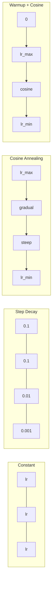
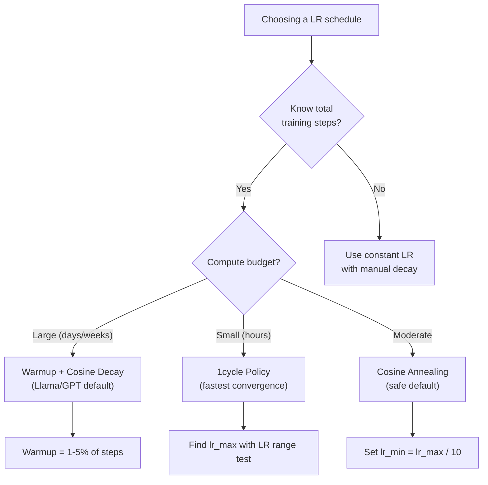
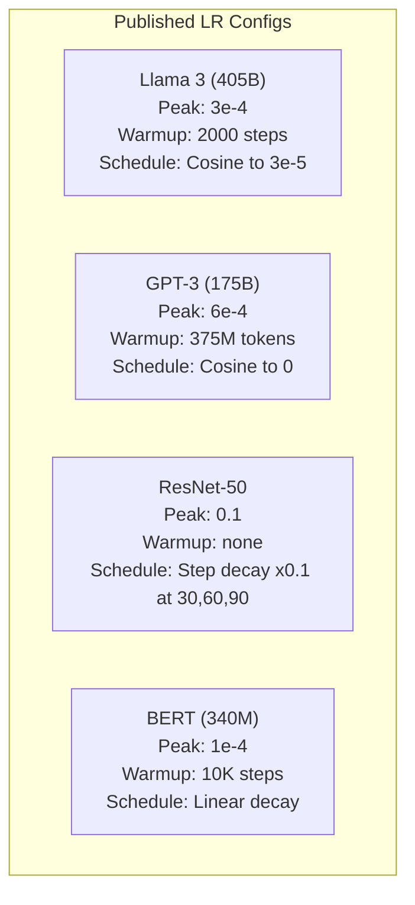

# 学习率调度与热身

> 学习率是最重要的单个超参数。不是架构。不是数据集大小。不是激活函数。是学习率。如果你别的都不调，就调它。

**类型：** Build
**语言：** Python
**前置要求：** 第 03.06 课（优化器）、第 03.08 课（权重初始化）
**预计时间：** ~90 分钟

## 学习目标

- 从零实现常量、阶梯衰减、余弦退火、warmup + 余弦、1cycle 这五种学习率调度
- 演示学习率选择的三种失败模式：发散（太高）、停滞（太低）、振荡（不衰减）
- 解释为什么基于 Adam 的优化器需要 warmup，以及它如何稳定训练初期
- 在同一个任务上对比全部五种调度的收敛速度，并为给定的训练预算选对一个

## 问题所在

把学习率设成 0.1。训练发散——损失 3 步内跳到无穷。设成 0.0001。训练龟速——100 个 epoch 后，模型几乎还没离开随机起点。设成 0.01。训练前 50 个 epoch 还行，然后损失在一个它永远够不着的极小值附近振荡，因为步子太大了。

最优学习率不是个常量。它在训练中变化。早期，你想用大步子快速覆盖地形。训练后期，你想用极小的步子稳进一个尖锐的极小值。一个 90% 准确率的模型和一个 95% 准确率的模型之间的区别，往往就只是调度。

过去三年里发表的每一个重要模型都用了学习率调度。Llama 3 用峰值 lr=3e-4、2000 步 warmup、余弦衰减到 3e-5。GPT-3 用 lr=6e-4、在 3.75 亿 token 上 warmup。这些不是随便选的。它们是花了数百万美元做大量超参数扫描的结果。

你需要理解调度，因为默认值对你的问题不会管用。当你微调一个预训练模型时，对的调度和从零训练时不一样。当你增大批大小时，warmup 周期需要变。当训练在第 10000 步崩了时，你得知道这是调度问题还是别的什么。

## 核心概念

### 常量学习率

最简单的办法。挑个数字，每一步都用它。

```
lr(t) = lr_0
```

很少最优。它要么对训练末期太高（在极小值附近振荡），要么对训练初期太低（在小步子上浪费算力）。对小模型和调试还行。对任何训练超过一小时的东西都是个糟糕的选择。

### 阶梯衰减

ResNet 时代的老派做法。在固定的 epoch 处把学习率砍一个倍数（通常 10 倍）。

```
lr(t) = lr_0 * gamma^(floor(epoch / step_size))
```

其中 gamma = 0.1、step_size = 30 意味着：lr 每 30 个 epoch 降 10 倍。ResNet-50 用的就是这个——lr=0.1，在第 30、60、90 个 epoch 各降 10 倍。

问题是：最优的衰减点取决于数据集和架构。换个问题，你就得重新调什么时候降。这些转变是突兀的——速率突然变化时，损失可能会尖峰。

### 余弦退火

从最大学习率到最小学习率的平滑衰减，沿着一条余弦曲线：

```
lr(t) = lr_min + 0.5 * (lr_max - lr_min) * (1 + cos(pi * t / T))
```

其中 t 是当前步、T 是总步数。

t=0 时，余弦项是 1，所以 lr = lr_max。t=T 时，余弦项是 -1，所以 lr = lr_min。衰减先温和、中间加速、接近末尾又变温和。

这是大多数现代训练的默认选项。除了 lr_max 和 lr_min 没有别的超参数要调。余弦的形状契合一个经验观察：大部分学习发生在训练中段——你想在那段关键时期保持合理的步长。

### Warmup：为什么从小起步

Adam 和其他自适应优化器维护着梯度均值和方差的滑动估计。在第 0 步，这些估计被初始化为零。最初几次梯度更新基于的是垃圾统计量。如果你的学习率在这段期间很大，模型就会走出巨大、方向很差的步子。

Warmup 修复了这个。从一个极小的学习率起步（常常是 lr_max / warmup_steps 甚至零），在前 N 步里线性爬升到 lr_max。等你到达完整学习率时，Adam 的统计量已经稳定了。

```
lr(t) = lr_max * (t / warmup_steps)     for t < warmup_steps
```

典型 warmup：总训练步数的 1-5%。Llama 3 训练了约 1.8 万亿 token，warmup 了 2000 步。GPT-3 在 3.75 亿 token 上 warmup。

### 线性 Warmup + 余弦衰减

现代默认选项。先线性爬升，然后余弦衰减：

```
if t < warmup_steps:
    lr(t) = lr_max * (t / warmup_steps)
else:
    progress = (t - warmup_steps) / (total_steps - warmup_steps)
    lr(t) = lr_min + 0.5 * (lr_max - lr_min) * (1 + cos(pi * progress))
```

这就是 Llama、GPT、PaLM 和大多数现代 transformer 用的。warmup 防止早期不稳定。余弦衰减让模型稳进一个好的极小值。

### 1cycle 策略

Leslie Smith 的发现（2018）：在训练前半段把学习率从一个低值爬到一个高值，然后在后半段降回去。反直觉——你为什么要在中途*提高*学习率？

理论是：高学习率通过给优化轨迹加噪声而起到正则化作用。模型在爬升阶段探索了更多损失曲面，找到更好的盆地。降低阶段再在找到的最佳盆地里精修。

```
Phase 1 (0 to T/2):    lr ramps from lr_max/25 to lr_max
Phase 2 (T/2 to T):    lr ramps from lr_max to lr_max/10000
```

在固定算力预算下，1cycle 常常比余弦退火训练得更快。代价是：你必须事先知道总步数。

### 各调度的形状



### 决策流程图



### 来自已发布模型的真实数字



## 动手构建

### 第 1 步：调度函数

每个函数接收当前步、返回那一步的学习率。

```python
import math


def constant_schedule(step, lr=0.01, **kwargs):
    return lr


def step_decay_schedule(step, lr=0.1, step_size=100, gamma=0.1, **kwargs):
    return lr * (gamma ** (step // step_size))


def cosine_schedule(step, lr=0.01, total_steps=1000, lr_min=1e-5, **kwargs):
    if step >= total_steps:
        return lr_min
    return lr_min + 0.5 * (lr - lr_min) * (1 + math.cos(math.pi * step / total_steps))


def warmup_cosine_schedule(step, lr=0.01, total_steps=1000, warmup_steps=100, lr_min=1e-5, **kwargs):
    if total_steps <= warmup_steps:
        return lr * (step / max(warmup_steps, 1))
    if step < warmup_steps:
        return lr * step / warmup_steps
    progress = (step - warmup_steps) / (total_steps - warmup_steps)
    return lr_min + 0.5 * (lr - lr_min) * (1 + math.cos(math.pi * progress))


def one_cycle_schedule(step, lr=0.01, total_steps=1000, **kwargs):
    mid = max(total_steps // 2, 1)
    if step < mid:
        return (lr / 25) + (lr - lr / 25) * step / mid
    else:
        progress = (step - mid) / max(total_steps - mid, 1)
        return lr * (1 - progress) + (lr / 10000) * progress
```

### 第 2 步：可视化所有调度

打印一张基于文本的图，展示每种调度在训练中如何演变。

```python
def visualize_schedule(name, schedule_fn, total_steps=500, **kwargs):
    steps = list(range(0, total_steps, total_steps // 20))
    if total_steps - 1 not in steps:
        steps.append(total_steps - 1)

    lrs = [schedule_fn(s, total_steps=total_steps, **kwargs) for s in steps]
    max_lr = max(lrs) if max(lrs) > 0 else 1.0

    print(f"\n{name}:")
    for s, lr_val in zip(steps, lrs):
        bar_len = int(lr_val / max_lr * 40)
        bar = "#" * bar_len
        print(f"  Step {s:4d}: lr={lr_val:.6f} {bar}")
```

### 第 3 步：训练网络

一个圆形数据集上的简单两层网络，和前几课一样，但现在我们换调度。

```python
import random


def sigmoid(x):
    x = max(-500, min(500, x))
    return 1.0 / (1.0 + math.exp(-x))


def relu(x):
    return max(0.0, x)


def relu_deriv(x):
    return 1.0 if x > 0 else 0.0


def make_circle_data(n=200, seed=42):
    random.seed(seed)
    data = []
    for _ in range(n):
        x = random.uniform(-2, 2)
        y = random.uniform(-2, 2)
        label = 1.0 if x * x + y * y < 1.5 else 0.0
        data.append(([x, y], label))
    return data


def train_with_schedule(schedule_fn, schedule_name, data, epochs=300, base_lr=0.05, **kwargs):
    random.seed(0)
    hidden_size = 8
    total_steps = epochs * len(data)

    std = math.sqrt(2.0 / 2)
    w1 = [[random.gauss(0, std) for _ in range(2)] for _ in range(hidden_size)]
    b1 = [0.0] * hidden_size
    w2 = [random.gauss(0, std) for _ in range(hidden_size)]
    b2 = 0.0

    step = 0
    epoch_losses = []

    for epoch in range(epochs):
        total_loss = 0
        correct = 0

        for x, target in data:
            lr = schedule_fn(step, lr=base_lr, total_steps=total_steps, **kwargs)

            z1 = []
            h = []
            for i in range(hidden_size):
                z = w1[i][0] * x[0] + w1[i][1] * x[1] + b1[i]
                z1.append(z)
                h.append(relu(z))

            z2 = sum(w2[i] * h[i] for i in range(hidden_size)) + b2
            out = sigmoid(z2)

            error = out - target
            d_out = error * out * (1 - out)

            for i in range(hidden_size):
                d_h = d_out * w2[i] * relu_deriv(z1[i])
                w2[i] -= lr * d_out * h[i]
                for j in range(2):
                    w1[i][j] -= lr * d_h * x[j]
                b1[i] -= lr * d_h
            b2 -= lr * d_out

            total_loss += (out - target) ** 2
            if (out >= 0.5) == (target >= 0.5):
                correct += 1
            step += 1

        avg_loss = total_loss / len(data)
        accuracy = correct / len(data) * 100
        epoch_losses.append(avg_loss)

    return epoch_losses
```

### 第 4 步：对比所有调度

用每种调度训练同一个网络，对比最终损失和收敛行为。

```python
def compare_schedules(data):
    configs = [
        ("Constant", constant_schedule, {}),
        ("Step Decay", step_decay_schedule, {"step_size": 15000, "gamma": 0.1}),
        ("Cosine", cosine_schedule, {"lr_min": 1e-5}),
        ("Warmup+Cosine", warmup_cosine_schedule, {"warmup_steps": 3000, "lr_min": 1e-5}),
        ("1cycle", one_cycle_schedule, {}),
    ]

    print(f"\n{'Schedule':<20} {'Start Loss':>12} {'Mid Loss':>12} {'End Loss':>12} {'Best Loss':>12}")
    print("-" * 70)

    for name, schedule_fn, extra_kwargs in configs:
        losses = train_with_schedule(schedule_fn, name, data, epochs=300, base_lr=0.05, **extra_kwargs)
        mid_idx = len(losses) // 2
        best = min(losses)
        print(f"{name:<20} {losses[0]:>12.6f} {losses[mid_idx]:>12.6f} {losses[-1]:>12.6f} {best:>12.6f}")
```

### 第 5 步：LR 太高 vs 太低

演示三种失败模式：太高（发散）、太低（龟速）、刚刚好。

```python
def lr_sensitivity(data):
    learning_rates = [1.0, 0.1, 0.01, 0.001, 0.0001]

    print("\nLR Sensitivity (constant schedule, 100 epochs):")
    print(f"  {'LR':>10} {'Start Loss':>12} {'End Loss':>12} {'Status':>15}")
    print("  " + "-" * 52)

    for lr in learning_rates:
        losses = train_with_schedule(constant_schedule, f"lr={lr}", data, epochs=100, base_lr=lr)
        start = losses[0]
        end = losses[-1]

        if end > start or math.isnan(end) or end > 1.0:
            status = "DIVERGED"
        elif end > start * 0.9:
            status = "BARELY MOVED"
        elif end < 0.15:
            status = "CONVERGED"
        else:
            status = "LEARNING"

        end_str = f"{end:.6f}" if not math.isnan(end) else "NaN"
        print(f"  {lr:>10.4f} {start:>12.6f} {end_str:>12} {status:>15}")
```

## 上手使用

PyTorch 在 `torch.optim.lr_scheduler` 里提供了各种调度器：

```python
import torch
import torch.optim as optim
from torch.optim.lr_scheduler import CosineAnnealingLR, OneCycleLR, StepLR

model = nn.Sequential(nn.Linear(10, 64), nn.ReLU(), nn.Linear(64, 1))
optimizer = optim.Adam(model.parameters(), lr=3e-4)

scheduler = CosineAnnealingLR(optimizer, T_max=1000, eta_min=1e-5)

for step in range(1000):
    loss = train_step(model, optimizer)
    scheduler.step()
```

对 warmup + 余弦，用一个 lambda 调度器，或者 HuggingFace 的 `get_cosine_schedule_with_warmup`：

```python
from transformers import get_cosine_schedule_with_warmup

scheduler = get_cosine_schedule_with_warmup(
    optimizer,
    num_warmup_steps=2000,
    num_training_steps=100000,
)
```

这个 HuggingFace 函数是大多数 Llama 和 GPT 微调脚本用的。拿不准就用 warmup + 余弦，warmup 取总步数的 3-5%。它几乎对什么都管用。

## 交付

本课产出：
- `outputs/prompt-lr-schedule-advisor.md` —— 一个提示词，为你的训练配置推荐对的学习率调度和超参数

## 练习

1. 实现指数衰减：lr(t) = lr_0 * gamma^t，gamma = 0.999。在圆形数据集上和余弦退火对比。

2. 实现学习率范围测试（Leslie Smith）：训练几百步，同时把 LR 从 1e-7 指数级增到 1。画损失对 LR 的图。最优的 max LR 就在损失开始上升之前。

3. 用 warmup + 余弦训练，但改 warmup 长度：总步数的 0%、1%、5%、10%、20%。找出训练最稳定的那个最佳点。

4. 实现带热重启的余弦退火（SGDR）：每 T 步把学习率重置到 lr_max 再衰减一次。在更长的训练里和标准余弦对比。

5. 做一个"调度外科医生"，监控训练损失，在损失稳定时自动从 warmup 切到余弦，并在损失停滞太久时降 lr。

## 关键术语

| 术语 | 大家怎么说 | 实际是什么 |
|------|----------------|----------------------|
| 学习率（Learning rate） | "模型学得多快" | 乘在梯度上、决定参数更新幅度的标量 |
| 调度（Schedule） | "随时间改 LR" | 一个把训练步映射到学习率的函数，设计来优化收敛 |
| Warmup | "从小 LR 起步" | 在前 N 步里把 LR 从接近零线性爬到目标值，稳定优化器统计量 |
| 余弦退火（Cosine annealing） | "平滑的 LR 衰减" | 训练中沿着余弦曲线把 LR 从 lr_max 降到 lr_min |
| 阶梯衰减（Step decay） | "在里程碑处降 LR" | 在固定的 epoch 间隔把 LR 乘上一个倍数（通常 0.1） |
| 1cycle 策略 | "先上后下" | Leslie Smith 的方法，在单个周期里把 LR 先爬升后下降以更快收敛 |
| LR 范围测试 | "找最佳学习率" | 短暂训练同时增大 LR，找出损失开始发散的那个值 |
| 带热重启的余弦（Cosine with warm restarts） | "重置再重复" | 周期性地把 LR 重置到 lr_max 再衰减一次（SGDR） |
| Eta min | "LR 的下限" | 调度衰减到的最小学习率 |
| 峰值学习率（Peak learning rate） | "最大 LR" | 训练中达到的最高 LR，通常在 warmup 之后 |

## 延伸阅读

- Loshchilov & Hutter，《SGDR: Stochastic Gradient Descent with Warm Restarts》（2017）—— 引入余弦退火和热重启
- Smith，《Super-Convergence: Very Fast Training of Neural Networks Using Large Learning Rates》（2018）—— 1cycle 策略论文
- Touvron 等人，《Llama 2: Open Foundation and Fine-Tuned Chat Models》（2023）—— 记录了大规模使用的 warmup + 余弦调度
- Goyal 等人，《Accurate, Large Minibatch SGD: Training ImageNet in 1 Hour》（2017）—— 大批量训练的线性缩放规则和 warmup
