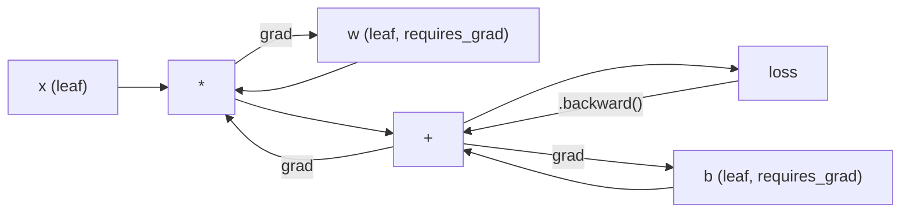
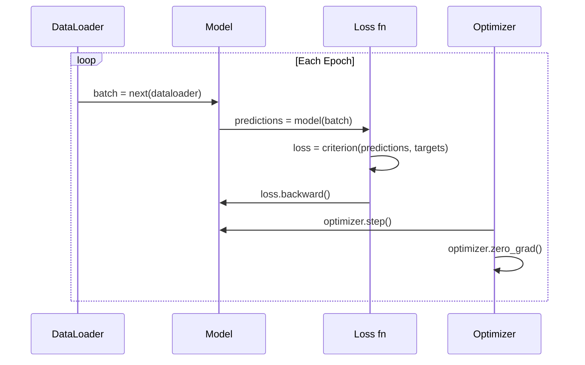

# PyTorch 入门

> 你从活塞和曲轴开始造了一台引擎。现在来学那台大家真正在开的。

**类型：** Build
**语言：** Python
**前置要求：** 第 03.10 课（搭一个你自己的迷你框架）
**预计时间：** ~75 分钟

## 学习目标

- 用 PyTorch 的 nn.Module、nn.Sequential 和 autograd 构建并训练神经网络
- 使用 PyTorch 张量、GPU 加速和标准训练循环（zero_grad、forward、loss、backward、step）
- 把你从零写的迷你框架组件转换成它们的 PyTorch 等价物
- 在同一个任务上对比你的纯 Python 框架和 PyTorch，剖析两者的训练速度

## 问题所在

你有一个能用的迷你框架。线性层、ReLU、dropout、批归一化、Adam、一个 DataLoader、一个训练循环。它用纯 Python 在一个圆形分类问题上训练一个 4 层网络。

它在同一个问题上也比 PyTorch 慢 500 倍。

你的迷你框架用嵌套 Python 循环一次处理一个样本。PyTorch 把同样的操作分派给跑在 GPU 上的、优化过的 C++/CUDA 内核。在单张 NVIDIA A100 上，PyTorch 在 ImageNet（128 万张图）上训练一个 ResNet-50（2560 万参数）约需 6 小时。你的框架做同样的任务大约要 3000 小时——前提是它没先把内存耗光。

速度不是唯一的差距。你的框架没有 GPU 支持。没有自动微分——你给每个模块都手写了 backward()。没有序列化。没有分布式训练。没有混合精度。没有 print 语句之外的办法调试梯度流。

PyTorch 把这些差距一个个填上了。而且它做到这点的同时，还保留了你已经建立起来的那套完全一样的心智模型：Module、forward()、parameters()、backward()、optimizer.step()。概念一一对应。语法几乎一样。区别在于 PyTorch 把十年的系统工程包在了你从零设计出来的同一个接口背后。

## 核心概念

### PyTorch 为什么赢了

2015 年，TensorFlow 要求你在跑任何东西之前先定义一张静态计算图。你搭好图、编译它，再把数据喂进去。调试意味着盯着图的可视化看。改架构意味着从头重建图。

PyTorch 2017 年带着一套不同的哲学问世：即时执行（eager execution）。你写 Python，它立刻就跑。`y = model(x)` 真的是现在就算出 y，而不是"往一张图里加一个稍后才会算 y 的节点"。这意味着标准的 Python 调试工具能用。print() 能用。pdb 能用。前向传播里的 if/else 能用。

到 2020 年，市场已经做出选择。PyTorch 在机器学习研究论文里的占比从 7%（2017）涨到了 75% 以上（2022）。Meta、Google DeepMind、OpenAI、Anthropic、Hugging Face 都把 PyTorch 当主力框架。TensorFlow 2.x 作为回应也采纳了即时执行——这是对 PyTorch 设计正确性的默认。

教训是：开发者体验会复利。一个慢 10% 但调试快 50% 的框架，每次都赢。

### 张量

张量是一个多维数组，有三个关键属性：shape、dtype 和 device。

```python
import torch

x = torch.zeros(3, 4)           # shape: (3, 4), dtype: float32, device: cpu
x = torch.randn(2, 3, 224, 224) # batch of 2 RGB images, 224x224
x = torch.tensor([1, 2, 3])     # from a Python list
```

**Shape** 是维度。标量是 shape ()，向量是 (n,)，矩阵是 (m, n)，一批图像是 (batch, channels, height, width)。

**Dtype** 控制精度和内存。

| dtype | 位数 | 范围 | 用途 |
|-------|------|-------|----------|
| float32 | 32 | 约 7 位十进制 | 默认训练 |
| float16 | 16 | 约 3.3 位十进制 | 混合精度 |
| bfloat16 | 16 | 范围和 float32 一样，精度更低 | LLM 训练 |
| int8 | 8 | -128 到 127 | 量化推理 |

**Device** 决定计算在哪发生。

```python
device = torch.device("cuda" if torch.cuda.is_available() else "cpu")
x = torch.randn(3, 4, device=device)
x = x.to("cuda")
x = x.cpu()
```

每个操作都要求所有张量在同一个 device 上。这是初学者撞上的头号 PyTorch 错误：`RuntimeError: Expected all tensors to be on the same device`。在计算前把所有东西移到同一个 device 上就能修。

**Reshape** 是常数时间的——它改的是元数据，不是数据本身。

```python
x = torch.randn(2, 3, 4)
x.view(2, 12)      # reshape to (2, 12) -- must be contiguous
x.reshape(6, 4)    # reshape to (6, 4) -- works always
x.permute(2, 0, 1) # reorder dimensions
x.unsqueeze(0)     # add dimension: (1, 2, 3, 4)
x.squeeze()        # remove size-1 dimensions
```

### Autograd

你的迷你框架要求你给每个模块实现 backward()。PyTorch 不用。它把每个张量上的操作记录进一张有向无环图（计算图），然后反向遍历那张图，自动算出梯度。



和你框架的关键区别：PyTorch 用基于"磁带"（tape）的自动微分。每个操作在前向传播时往一卷"磁带"上追加。调用 `.backward()` 就把磁带倒着重放一遍。

```python
x = torch.randn(3, requires_grad=True)
y = x ** 2 + 3 * x
z = y.sum()
z.backward()
print(x.grad)  # dz/dx = 2x + 3
```

autograd 的三条规则：

1. 只有 `requires_grad=True` 的叶子张量才累积梯度
2. 梯度默认会累积——每次反向传播前调 `optimizer.zero_grad()`
3. `torch.no_grad()` 关掉梯度追踪（评估时用）

### nn.Module

`nn.Module` 是 PyTorch 里每个神经网络组件的基类。你在第 10 课已经造过这个抽象。PyTorch 的版本多了自动参数注册、递归模块发现、设备管理和 state dict 序列化。

```python
import torch.nn as nn

class MLP(nn.Module):
    def __init__(self, input_dim, hidden_dim, output_dim):
        super().__init__()
        self.layer1 = nn.Linear(input_dim, hidden_dim)
        self.relu = nn.ReLU()
        self.layer2 = nn.Linear(hidden_dim, output_dim)

    def forward(self, x):
        x = self.layer1(x)
        x = self.relu(x)
        x = self.layer2(x)
        return x
```

当你在 `__init__` 里把一个 `nn.Module` 或 `nn.Parameter` 赋成属性时，PyTorch 会自动注册它。`model.parameters()` 递归收集每个注册过的参数。这就是为什么你再也不用像在迷你框架里那样手工收集权重。

关键积木：

| 模块 | 作用 | 参数量 |
|--------|-------------|------------|
| nn.Linear(in, out) | Wx + b | in*out + out |
| nn.Conv2d(in_ch, out_ch, k) | 二维卷积 | in_ch*out_ch*k*k + out_ch |
| nn.BatchNorm1d(features) | 归一化激活 | 2 * features |
| nn.Dropout(p) | 随机置零 | 0 |
| nn.ReLU() | max(0, x) | 0 |
| nn.GELU() | 高斯误差线性 | 0 |
| nn.Embedding(vocab, dim) | 查找表 | vocab * dim |
| nn.LayerNorm(dim) | 按样本归一化 | 2 * dim |

### 损失函数与优化器

PyTorch 自带你造过的一切的生产级版本。

**损失函数**（来自 `torch.nn`）：

| 损失 | 任务 | 输入 |
|------|------|-------|
| nn.MSELoss() | 回归 | 任意形状 |
| nn.CrossEntropyLoss() | 多分类 | Logits（不是 softmax） |
| nn.BCEWithLogitsLoss() | 二分类 | Logits（不是 sigmoid） |
| nn.L1Loss() | 回归（稳健） | 任意形状 |
| nn.CTCLoss() | 序列对齐 | 对数概率 |

注意：`CrossEntropyLoss` 内部把 `LogSoftmax` + `NLLLoss` 合在了一起。传原始 logits，不要传 softmax 输出。这是个常见错误，会悄无声息地产出错误的梯度。

**优化器**（来自 `torch.optim`）：

| 优化器 | 何时用 | 典型 LR |
|-----------|-------------|-----------|
| SGD(params, lr, momentum) | CNN、调好的流水线 | 0.01--0.1 |
| Adam(params, lr) | 默认起点 | 1e-3 |
| AdamW(params, lr, weight_decay) | transformer、微调 | 1e-4--1e-3 |
| LBFGS(params) | 小规模、二阶 | 1.0 |

### 训练循环

每个 PyTorch 训练循环都遵循同样的 5 步套路。你从第 10 课已经知道了。



标准套路：

```python
for epoch in range(num_epochs):
    model.train()
    for inputs, targets in train_loader:
        inputs, targets = inputs.to(device), targets.to(device)
        optimizer.zero_grad()
        outputs = model(inputs)
        loss = criterion(outputs, targets)
        loss.backward()
        optimizer.step()
```

批循环里的五行。训练出了 GPT-4、Stable Diffusion 和 LLaMA 的五行。架构会变，数据会变，这五行不变。

### Dataset 与 DataLoader

PyTorch 的 `Dataset` 是个抽象类，有两个方法：`__len__` 和 `__getitem__`。`DataLoader` 在它外面包上分批、打乱和多进程数据加载。

```python
from torch.utils.data import Dataset, DataLoader

class MNISTDataset(Dataset):
    def __init__(self, images, labels):
        self.images = images
        self.labels = labels

    def __len__(self):
        return len(self.labels)

    def __getitem__(self, idx):
        return self.images[idx], self.labels[idx]

loader = DataLoader(dataset, batch_size=64, shuffle=True, num_workers=4)
```

`num_workers=4` 派出 4 个进程并行加载数据，与此同时 GPU 在当前批次上训练。在受磁盘约束的工作负载（大图像、音频）上，单这一项就能把训练速度翻倍。

### GPU 训练

把一个模型移到 GPU：

```python
device = torch.device("cuda" if torch.cuda.is_available() else "cpu")
model = model.to(device)
```

这会递归地把每个参数和缓冲区移到 GPU 上。然后训练时移动每个批次：

```python
inputs, targets = inputs.to(device), targets.to(device)
```

**混合精度**在现代 GPU（A100、H100、RTX 4090）上把内存占用减半、吞吐翻倍，做法是用 float16 跑前向/反向，同时把主权重保留为 float32：

```python
from torch.amp import autocast, GradScaler

scaler = GradScaler()
for inputs, targets in loader:
    with autocast(device_type="cuda"):
        outputs = model(inputs)
        loss = criterion(outputs, targets)
    scaler.scale(loss).backward()
    scaler.step(optimizer)
    scaler.update()
    optimizer.zero_grad()
```

### 对比：迷你框架 vs PyTorch vs JAX

| 特性 | 迷你框架（L10） | PyTorch | JAX |
|---------|---------------------|---------|-----|
| 自动微分 | 手写 backward() | 基于磁带的 autograd | 函数式变换 |
| 执行 | 即时（Python 循环） | 即时（C++ 内核） | 追踪 + JIT 编译 |
| GPU 支持 | 无 | 有（CUDA、ROCm、MPS） | 有（CUDA、TPU） |
| 速度（MNIST MLP） | 约 300 秒/epoch | 约 0.5 秒/epoch | 约 0.3 秒/epoch |
| 模块系统 | 自定义 Module 类 | nn.Module | 无状态函数（Flax/Equinox） |
| 调试 | print() | print()、pdb、breakpoint() | 更难（JIT 追踪让 print 失效） |
| 生态 | 无 | Hugging Face、Lightning、timm | Flax、Optax、Orbax |
| 学习曲线 | 你亲手造的 | 中等 | 陡（函数式范式） |
| 生产使用 | 玩具问题 | Meta、OpenAI、Anthropic、HF | Google DeepMind、Midjourney |

## 动手构建

一个只用 PyTorch 原语在 MNIST 上训练的 3 层 MLP。没有高层封装。不用 `torchvision.datasets`。我们自己下载并解析原始数据。

### 第 1 步：从原始文件加载 MNIST

MNIST 以 4 个 gzip 文件发布：训练图像（60,000 x 28 x 28）、训练标签、测试图像（10,000 x 28 x 28）、测试标签。我们下载它们并解析二进制格式。

```python
import torch
import torch.nn as nn
import struct
import gzip
import urllib.request
import os

def download_mnist(path="./mnist_data"):
    base_url = "https://storage.googleapis.com/cvdf-datasets/mnist/"
    files = [
        "train-images-idx3-ubyte.gz",
        "train-labels-idx1-ubyte.gz",
        "t10k-images-idx3-ubyte.gz",
        "t10k-labels-idx1-ubyte.gz",
    ]
    os.makedirs(path, exist_ok=True)
    for f in files:
        filepath = os.path.join(path, f)
        if not os.path.exists(filepath):
            urllib.request.urlretrieve(base_url + f, filepath)

def load_images(filepath):
    with gzip.open(filepath, "rb") as f:
        magic, num, rows, cols = struct.unpack(">IIII", f.read(16))
        data = f.read()
        images = torch.frombuffer(bytearray(data), dtype=torch.uint8)
        images = images.reshape(num, rows * cols).float() / 255.0
    return images

def load_labels(filepath):
    with gzip.open(filepath, "rb") as f:
        magic, num = struct.unpack(">II", f.read(8))
        data = f.read()
        labels = torch.frombuffer(bytearray(data), dtype=torch.uint8).long()
    return labels
```

### 第 2 步：定义模型

一个 3 层 MLP：784 -> 256 -> 128 -> 10。ReLU 激活。dropout 做正则化。不用批归一化，保持简单。

```python
class MNISTModel(nn.Module):
    def __init__(self):
        super().__init__()
        self.net = nn.Sequential(
            nn.Linear(784, 256),
            nn.ReLU(),
            nn.Dropout(0.2),
            nn.Linear(256, 128),
            nn.ReLU(),
            nn.Dropout(0.2),
            nn.Linear(128, 10),
        )

    def forward(self, x):
        return self.net(x)
```

输出层产出 10 个原始 logit（每个数字一个）。不做 softmax——`CrossEntropyLoss` 内部会处理。

参数量：784*256 + 256 + 256*128 + 128 + 128*10 + 10 = 235,146。以现代标准看微不足道。GPT-2 small 有 1.24 亿。这个几秒就训完。

### 第 3 步：训练循环

标准的 forward-loss-backward-step 套路。

```python
def train_one_epoch(model, loader, criterion, optimizer, device):
    model.train()
    total_loss = 0
    correct = 0
    total = 0
    for images, labels in loader:
        images, labels = images.to(device), labels.to(device)
        optimizer.zero_grad()
        outputs = model(images)
        loss = criterion(outputs, labels)
        loss.backward()
        optimizer.step()
        total_loss += loss.item() * images.size(0)
        _, predicted = outputs.max(1)
        correct += predicted.eq(labels).sum().item()
        total += labels.size(0)
    return total_loss / total, correct / total


def evaluate(model, loader, criterion, device):
    model.eval()
    total_loss = 0
    correct = 0
    total = 0
    with torch.no_grad():
        for images, labels in loader:
            images, labels = images.to(device), labels.to(device)
            outputs = model(images)
            loss = criterion(outputs, labels)
            total_loss += loss.item() * images.size(0)
            _, predicted = outputs.max(1)
            correct += predicted.eq(labels).sum().item()
            total += labels.size(0)
    return total_loss / total, correct / total
```

注意评估时的 `torch.no_grad()`。它关掉 autograd，减少内存占用、加快推理。没有它，PyTorch 会构建一张你根本用不到的计算图。

### 第 4 步：把一切接起来

```python
def main():
    device = torch.device("cuda" if torch.cuda.is_available() else "cpu")

    download_mnist()
    train_images = load_images("./mnist_data/train-images-idx3-ubyte.gz")
    train_labels = load_labels("./mnist_data/train-labels-idx1-ubyte.gz")
    test_images = load_images("./mnist_data/t10k-images-idx3-ubyte.gz")
    test_labels = load_labels("./mnist_data/t10k-labels-idx1-ubyte.gz")

    train_dataset = torch.utils.data.TensorDataset(train_images, train_labels)
    test_dataset = torch.utils.data.TensorDataset(test_images, test_labels)
    train_loader = torch.utils.data.DataLoader(
        train_dataset, batch_size=64, shuffle=True
    )
    test_loader = torch.utils.data.DataLoader(
        test_dataset, batch_size=256, shuffle=False
    )

    model = MNISTModel().to(device)
    criterion = nn.CrossEntropyLoss()
    optimizer = torch.optim.Adam(model.parameters(), lr=1e-3)

    num_params = sum(p.numel() for p in model.parameters())
    print(f"Device: {device}")
    print(f"Parameters: {num_params:,}")
    print(f"Train samples: {len(train_dataset):,}")
    print(f"Test samples: {len(test_dataset):,}")
    print()

    for epoch in range(10):
        train_loss, train_acc = train_one_epoch(
            model, train_loader, criterion, optimizer, device
        )
        test_loss, test_acc = evaluate(
            model, test_loader, criterion, device
        )
        print(
            f"Epoch {epoch+1:2d} | "
            f"Train Loss: {train_loss:.4f} | Train Acc: {train_acc:.4f} | "
            f"Test Loss: {test_loss:.4f} | Test Acc: {test_acc:.4f}"
        )

    torch.save(model.state_dict(), "mnist_mlp.pt")
    print(f"\nModel saved to mnist_mlp.pt")
    print(f"Final test accuracy: {test_acc:.4f}")
```

10 个 epoch 后的预期输出：约 97.8% 测试准确率。CPU 上训练时间：约 30 秒。GPU 上：约 5 秒。用同样架构在你的迷你框架上：约 45 分钟。

## 上手使用

### 快速对比：迷你框架 vs PyTorch

| 迷你框架（第 10 课） | PyTorch |
|---------------------------|---------|
| `model = Sequential(Linear(784, 256), ReLU(), ...)` | `model = nn.Sequential(nn.Linear(784, 256), nn.ReLU(), ...)` |
| `pred = model.forward(x)` | `pred = model(x)` |
| `optimizer.zero_grad()` | `optimizer.zero_grad()` |
| `grad = criterion.backward()` 然后 `model.backward(grad)` | `loss.backward()` |
| `optimizer.step()` | `optimizer.step()` |
| 没有 GPU | `model.to("cuda")` |
| 给每个模块手写 backward | autograd 全部包办 |

接口几乎一样。区别在于引擎盖下的一切。

### 保存和加载模型

```python
torch.save(model.state_dict(), "model.pt")

model = MNISTModel()
model.load_state_dict(torch.load("model.pt", weights_only=True))
model.eval()
```

永远保存 `state_dict()`（参数字典），而不是模型对象。保存模型对象用的是 pickle，你重构代码时它就崩。state dict 是可移植的。

### 学习率调度

```python
scheduler = torch.optim.lr_scheduler.CosineAnnealingLR(
    optimizer, T_max=10
)
for epoch in range(10):
    train_one_epoch(model, train_loader, criterion, optimizer, device)
    scheduler.step()
```

PyTorch 自带 15 个以上的调度器：StepLR、ExponentialLR、CosineAnnealingLR、OneCycleLR、ReduceLROnPlateau。全都接入同一个优化器接口。

## 交付

本课产出两个产物：

- `outputs/prompt-pytorch-debugger.md` —— 一个诊断常见 PyTorch 训练故障的提示词
- `outputs/skill-pytorch-patterns.md` —— 一个 PyTorch 训练套路的 skill 参考

## 练习

1. **加批归一化。** 在每个线性层之后（激活之前）插入 `nn.BatchNorm1d`。和只用 dropout 的版本对比测试准确率和训练速度。批归一化应该用更少的 epoch 就达到 98% 以上。

2. **实现一个学习率查找器。** 用指数级增大的学习率（从 1e-7 到 1.0）训练一个 epoch。画损失对 LR 的图。最优 LR 就在损失开始爬升之前。用它给 MNIST 模型挑一个更好的 LR。

3. **移植到 GPU 并用混合精度。** 给训练循环加上 `torch.amp.autocast` 和 `GradScaler`。在 GPU 上测量用和不用混合精度的吞吐（样本/秒）。在 A100 上，预期约 2 倍提速。

4. **构建一个自定义 Dataset。** 下载 Fashion-MNIST（格式和 MNIST 一样，但是衣物条目）。实现一个带 `__getitem__` 和 `__len__` 的 `FashionMNISTDataset(Dataset)` 类。训练同样的 MLP 并对比准确率。Fashion-MNIST 更难——预期约 88% 对约 98%。

5. **把 Adam 换成 SGD + 动量。** 用 `SGD(params, lr=0.01, momentum=0.9)` 训练。对比收敛曲线。然后加一个 `CosineAnnealingLR` 调度器，看 SGD 能不能在第 10 个 epoch 追上 Adam。

## 关键术语

| 术语 | 大家怎么说 | 实际是什么 |
|------|----------------|----------------------|
| 张量（Tensor） | "一个多维数组" | 一个有类型、知设备的数组，每个操作里都内建了自动微分支持 |
| Autograd | "自动反向传播" | 一个基于磁带的系统，前向传播时记录操作、再倒着重放来算出精确梯度 |
| nn.Module | "一个层" | 任何可微计算块的基类——注册参数、支持嵌套、处理训练/评估模式 |
| state_dict | "模型权重" | 一个把参数名映射到张量的 OrderedDict——已训练模型的可移植、可序列化表示 |
| .backward() | "算梯度" | 反向遍历计算图，为每个 requires_grad=True 的叶子张量计算并累积梯度 |
| .to(device) | "移到 GPU" | 递归地把所有参数和缓冲区转移到指定设备（CPU、CUDA、MPS） |
| DataLoader | "数据流水线" | 一个迭代器，从 Dataset 分批、打乱、可选地并行加载数据 |
| 混合精度（Mixed precision） | "用 float16" | 用 float16 跑前向/反向以求速度，同时保留 float32 主权重以保数值稳定 |
| 即时执行（Eager execution） | "现在就跑" | 操作在调用时立即执行，不推迟到后续编译步骤——区分 PyTorch 和 TF 1.x 的核心设计选择 |
| zero_grad | "重置梯度" | 在下一次反向传播前把所有参数梯度置零，因为 PyTorch 默认累积梯度 |

## 延伸阅读

- Paszke 等人，《PyTorch: An Imperative Style, High-Performance Deep Learning Library》（2019）—— 解释 PyTorch 设计取舍的原始论文
- PyTorch 教程：《Learning PyTorch with Examples》（https://pytorch.org/tutorials/beginner/pytorch_with_examples.html）—— 从张量到 nn.Module 的官方路径
- PyTorch 性能调优指南（https://pytorch.org/tutorials/recipes/recipes/tuning_guide.html）—— 混合精度、DataLoader workers、固定内存（pinned memory）等生产级优化
- Horace He，《Making Deep Learning Go Brrrr》（https://horace.io/brrr_intro.html）—— GPU 训练为什么快，附 PyTorch 专属的优化策略
