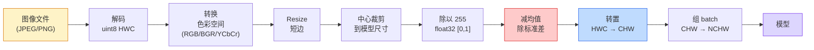
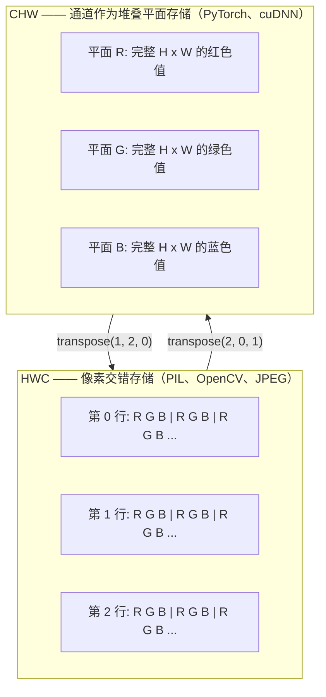

# 图像基础 —— 像素、通道、色彩空间

> 一张图像就是一组光照采样的张量。你将来用到的每一个视觉模型，都从这一个事实出发。

**类型：** Build
**语言：** Python
**前置要求：** 阶段 1 第 12 课（张量运算）、阶段 3 第 11 课（PyTorch 入门）
**预计时间：** ~45 分钟

## 学习目标

- 说清楚连续场景是怎么被离散成像素的，以及为什么采样/量化的决策给下游每个模型定下了天花板
- 把图像当作 NumPy 数组来读取、切片、检查，并能在 HWC 和 CHW 布局之间自如切换
- 在 RGB、灰度、HSV、YCbCr 之间互相转换，并讲清楚每种色彩空间存在的理由
- 严格按 torchvision 的预期做像素级预处理（归一化、标准化、resize、通道前置）

## 问题所在

你读的每一篇论文、下载的每一份预训练权重、调用的每一个视觉 API，都假设输入有特定的编码方式。把 `uint8` 图像喂给一个想要 `float32` 的模型，它照样能跑——然后悄无声息地吐出垃圾。把 BGR 喂给一个在 RGB 上训练的网络，准确率直接掉十个点。给一个想要通道前置（channels-first）的模型喂了通道后置（channels-last）的输入，第一个卷积层会把高度当成特征通道来处理。这些都不会报错，只会毁掉你的指标，然后你花一周去抓一个其实藏在文件加载方式里的 bug。

卷积本身并不复杂，只要你清楚它到底在什么东西上滑动。难点在于：对相机、JPEG 解码器、PIL、OpenCV、torchvision 和 CUDA kernel 来说，"一张图像"的含义各不相同。每套技术栈都有自己的轴序、字节范围和通道约定。理不清这些的视觉工程师，交付的就是一条条坏掉的流水线。

这一课打牢地基，好让本阶段后面的内容能建在上面。学完你会明白：什么是像素，为什么每个像素是三个数而不是一个，"用 ImageNet 统计量做归一化"到底干了什么，以及怎么在本阶段后续每一课都会假设的那两三种布局之间来回切换。

## 核心概念

### 完整预处理流水线一览

每个生产级视觉系统都是同一串可逆变换。任何一步弄错，模型看到的输入就和它训练时见过的不一样了。



那两个红色和蓝色的方块，正是 80% 的无声故障藏身之处：漏掉标准化、布局搞错。

### 像素是一次采样，不是一个方块

相机传感器统计落在一格格微型探测器上的光子。每个探测器在几分之一秒内对光做积分，输出一个与击中它的光子数成正比的电压。然后传感器把这个电压离散成一个整数。一个探测器就成了一个像素。

```
连续场景                          传感器网格                      数字图像
（无限细节）                       （H x W 个探测器）              （H x W 个整数）

    ~~~~~                        +--+--+--+--+--+                 210 198 180 155 120
   ~   ~   ~                     |  |  |  |  |  |                 205 195 178 152 118
  ~ light ~      ---->           +--+--+--+--+--+     ---->       200 190 175 150 115
   ~~~~~                         |  |  |  |  |  |                 195 185 170 148 112
                                 +--+--+--+--+--+                 188 180 165 145 108
```

这一步有两个选择，它们给下游一切定下了天花板：

- **空间采样**决定每一度场景用多少个探测器。太少，边缘会出现锯齿（混叠 aliasing）。太多，存储和算力直接爆炸。
- **强度量化**决定电压被分得多细。8 位给出 256 个等级，是显示的标准。10、12、16 位给出更平滑的渐变，对医学影像、HDR 和原始传感器流水线很关键。

像素不是一个有面积的彩色方块。它是一次单独的测量。当你 resize 或旋转时，你是在对这张测量网格重新采样。

### 为什么是三个通道

一个探测器统计整个可见光谱内的光子——那就是灰度。要得到颜色，传感器在网格上覆盖一层红、绿、蓝滤镜组成的马赛克。去马赛克之后，每个空间位置都有三个整数：附近被红色滤镜、绿色滤镜、蓝色滤镜过滤的探测器各自的响应。这三个整数就是一个像素的 RGB 三元组。

```
内存里的一个像素：

    (R, G, B) = (210, 140, 30)   <- 偏红的橙色

一张 H x W 的 RGB 图像：

    shape (H, W, 3)     存储为      H 行，每行 W 个像素，每个像素 3 个值
                                    uint8 时每个值在 [0, 255]
```

三不是什么魔法数。深度相机加一个 Z 通道。卫星加红外和紫外波段。医学扫描常常是单通道（X 光、CT）或很多通道（高光谱）。通道数是最后一个轴；卷积层学着在它上面做混合。

### 两种布局约定：HWC 和 CHW

同一个张量，两种排列顺序。每个库都挑一种。

```
HWC (height, width, channels)           CHW (channels, height, width)

   W ->                                    H ->
  +-----+-----+-----+                     +-----+-----+
H |R G B|R G B|R G B|                   C |R R R R R R|
| +-----+-----+-----+                   | +-----+-----+
v |R G B|R G B|R G B|                   v |G G G G G G|
  +-----+-----+-----+                     +-----+-----+
                                          |B B B B B B|
                                          +-----+-----+

   PIL、OpenCV、matplotlib，             PyTorch、大多数深度学习
   几乎磁盘上的每个图像文件              框架、cuDNN kernel
```

CHW 存在是因为卷积核在 H 和 W 上滑动。把通道轴放在最前面，意味着每个核每次看到的是一个通道连续的 2D 平面，向量化起来很干净。磁盘格式保留 HWC，是因为这和扫描线从传感器出来的顺序一致。

那行你会敲上一千遍的转换：

```
img_chw = img_hwc.transpose(2, 0, 1)      # NumPy
img_chw = img_hwc.permute(2, 0, 1)        # PyTorch tensor
```

内存布局可视化：



### 字节范围与 dtype

三种约定占主导：

| 约定 | dtype | 范围 | 你在哪儿见到它 |
|------------|-------|-------|------------------|
| 原始 | `uint8` | [0, 255] | 磁盘上的文件、PIL、OpenCV 输出 |
| 归一化 | `float32` | [0.0, 1.0] | 做完 `img.astype('float32') / 255` 之后 |
| 标准化 | `float32` | 大致 [-2, +2] | 减均值并除以标准差之后 |

卷积网络是在标准化的输入上训练的。ImageNet 统计量 `mean=[0.485, 0.456, 0.406]`、`std=[0.229, 0.224, 0.225]` 是在整个 ImageNet 训练集上、对 [0, 1] 归一化后的像素，按三个通道算出的算术平均和标准差。把原始 `uint8` 喂给一个期望标准化浮点输入的模型，是应用视觉里最常见的单一无声故障。

### 色彩空间，以及它们存在的理由

RGB 是采集格式，但对模型来说它不总是最有用的表示。

```
 RGB               HSV                       YCbCr / YUV

 R 红              H 色相（角度 0-360）       Y 亮度（明度）
 G 绿              S 饱和度（0-1）            Cb 蓝-黄色度
 B 蓝              V 明度（0-1）              Cr 红-绿色度

 线性，对应         把颜色和明度分开。         把明度和颜色分开。JPEG
 传感器输出         适合基于颜色的阈值、       和大多数视频编解码器对色度
                   UI 滑块、简单滤镜          通道压得更狠，因为人眼对
                                             色度细节的敏感度低于对 Y。
```

大多数现代 CNN 你喂的是 RGB。你会在这些场景遇到其他空间：

- **HSV** —— 经典 CV 代码、基于颜色的分割、白平衡。
- **YCbCr** —— 读 JPEG 内部结构、视频流水线、只在 Y 上操作的超分辨率模型。
- **灰度** —— OCR、文档模型，以及任何颜色是干扰变量而非信号的场景。

从 RGB 转灰度是加权和，不是平均，因为人眼对绿色比对红色或蓝色更敏感：

```
Y = 0.299 R + 0.587 G + 0.114 B       (ITU-R BT.601，经典权重)
```

### 宽高比、resize 和插值

每个模型都有固定的输入尺寸（大多数 ImageNet 分类器是 224x224，现代检测器是 384x384 或 512x512）。你的图像很少正好对得上。三种要紧的 resize 选择：

- **resize 短边，再中心裁剪** —— 标准的 ImageNet 配方。保留宽高比，丢掉边缘一条像素。
- **resize 加 padding** —— 保留宽高比和每一个像素，加上黑边。检测和 OCR 的标准做法。
- **直接 resize 到目标尺寸** —— 把图像拉伸。便宜，扭曲几何形状，对很多分类任务够用。

插值方法决定了当新网格和旧网格对不齐时，中间像素怎么算：

```
最近邻              最快，块状，掩码/标签的唯一选择
双线性              快，平滑，大多数图像 resize 的默认值
双三次              较慢，放大时更锐利
Lanczos             最慢，质量最好，用于最终显示
```

经验法则：训练用双线性，给人看的素材用双三次或 lanczos，任何含整数类别 ID 的东西用最近邻。

## 动手构建

### 第 1 步：加载一张图像并检查它的 shape

用 Pillow 加载任意 JPEG 或 PNG，转成 NumPy，打印你拿到的东西。想要一个确定性、能离线运行的例子，就合成一张。

```python
import numpy as np
from PIL import Image

def synthetic_rgb(h=128, w=192, seed=0):
    rng = np.random.default_rng(seed)
    yy, xx = np.meshgrid(np.linspace(0, 1, h), np.linspace(0, 1, w), indexing="ij")
    r = (np.sin(xx * 6) * 0.5 + 0.5) * 255
    g = yy * 255
    b = (1 - yy) * xx * 255
    rgb = np.stack([r, g, b], axis=-1) + rng.normal(0, 6, (h, w, 3))
    return np.clip(rgb, 0, 255).astype(np.uint8)

arr = synthetic_rgb()
# 或者从磁盘加载：
# arr = np.asarray(Image.open("your_image.jpg").convert("RGB"))

print(f"type:   {type(arr).__name__}")
print(f"dtype:  {arr.dtype}")
print(f"shape:  {arr.shape}     # (H, W, C)")
print(f"min:    {arr.min()}")
print(f"max:    {arr.max()}")
print(f"pixel at (0, 0): {arr[0, 0]}")
```

预期输出：`shape: (H, W, 3)`、`dtype: uint8`、范围 `[0, 255]`。这就是规范的磁盘表示，不管字节来自相机、JPEG 解码器还是合成生成器。

### 第 2 步：拆分通道并重排布局

把 R、G、B 分别取出来，再从 HWC 转成 PyTorch 用的 CHW。

```python
R = arr[:, :, 0]
G = arr[:, :, 1]
B = arr[:, :, 2]
print(f"R shape: {R.shape}, mean: {R.mean():.1f}")
print(f"G shape: {G.shape}, mean: {G.mean():.1f}")
print(f"B shape: {B.shape}, mean: {B.mean():.1f}")

arr_chw = arr.transpose(2, 0, 1)
print(f"\nHWC shape: {arr.shape}")
print(f"CHW shape: {arr_chw.shape}")
```

三个灰度平面，每个通道一个。CHW 只是重排了轴；当内存布局允许时，严格说不需要复制数据。

### 第 3 步：灰度和 HSV 转换

加权和灰度，再来一个手写的 RGB 转 HSV。

```python
def rgb_to_grayscale(rgb):
    weights = np.array([0.299, 0.587, 0.114], dtype=np.float32)
    return (rgb.astype(np.float32) @ weights).astype(np.uint8)

def rgb_to_hsv(rgb):
    rgb_f = rgb.astype(np.float32) / 255.0
    r, g, b = rgb_f[..., 0], rgb_f[..., 1], rgb_f[..., 2]
    cmax = np.max(rgb_f, axis=-1)
    cmin = np.min(rgb_f, axis=-1)
    delta = cmax - cmin

    h = np.zeros_like(cmax)
    mask = delta > 0
    rmax = mask & (cmax == r)
    gmax = mask & (cmax == g)
    bmax = mask & (cmax == b)
    h[rmax] = ((g[rmax] - b[rmax]) / delta[rmax]) % 6
    h[gmax] = ((b[gmax] - r[gmax]) / delta[gmax]) + 2
    h[bmax] = ((r[bmax] - g[bmax]) / delta[bmax]) + 4
    h = h * 60.0

    s = np.where(cmax > 0, delta / cmax, 0)
    v = cmax
    return np.stack([h, s, v], axis=-1)

gray = rgb_to_grayscale(arr)
hsv = rgb_to_hsv(arr)
print(f"gray shape: {gray.shape}, range: [{gray.min()}, {gray.max()}]")
print(f"hsv   shape: {hsv.shape}")
print(f"hue range: [{hsv[..., 0].min():.1f}, {hsv[..., 0].max():.1f}] degrees")
print(f"sat range: [{hsv[..., 1].min():.2f}, {hsv[..., 1].max():.2f}]")
print(f"val range: [{hsv[..., 2].min():.2f}, {hsv[..., 2].max():.2f}]")
```

色相以度为单位输出，饱和度和明度在 [0, 1]。这与 OpenCV 的 `hsv_full` 约定一致。

### 第 4 步：归一化、标准化，再反过来还原

从原始字节走到一个预训练 ImageNet 模型期望的那个精确张量，再走回来。

```python
mean = np.array([0.485, 0.456, 0.406], dtype=np.float32)
std = np.array([0.229, 0.224, 0.225], dtype=np.float32)

def preprocess_imagenet(rgb_uint8):
    x = rgb_uint8.astype(np.float32) / 255.0
    x = (x - mean) / std
    x = x.transpose(2, 0, 1)
    return x

def deprocess_imagenet(chw_float32):
    x = chw_float32.transpose(1, 2, 0)
    x = x * std + mean
    x = np.clip(x * 255.0, 0, 255).astype(np.uint8)
    return x

x = preprocess_imagenet(arr)
print(f"preprocessed shape: {x.shape}     # (C, H, W)")
print(f"preprocessed dtype: {x.dtype}")
print(f"preprocessed mean per channel:  {x.mean(axis=(1, 2)).round(3)}")
print(f"preprocessed std  per channel:  {x.std(axis=(1, 2)).round(3)}")

roundtrip = deprocess_imagenet(x)
max_diff = np.abs(roundtrip.astype(int) - arr.astype(int)).max()
print(f"roundtrip max pixel diff: {max_diff}    # 应该是 0 或 1")
```

每个通道的均值应该接近零，标准差接近一。这对 preprocess/deprocess 函数，正是每次 torchvision `transforms.Normalize` 调用在底层做的事。

### 第 5 步：用三种插值方法 resize

在放大上对比最近邻、双线性、双三次，让差异看得见。

```python
target = (arr.shape[0] * 3, arr.shape[1] * 3)

nearest = np.asarray(Image.fromarray(arr).resize(target[::-1], Image.NEAREST))
bilinear = np.asarray(Image.fromarray(arr).resize(target[::-1], Image.BILINEAR))
bicubic = np.asarray(Image.fromarray(arr).resize(target[::-1], Image.BICUBIC))

def local_roughness(x):
    gy = np.diff(x.astype(float), axis=0)
    gx = np.diff(x.astype(float), axis=1)
    return float(np.abs(gy).mean() + np.abs(gx).mean())

for name, out in [("nearest", nearest), ("bilinear", bilinear), ("bicubic", bicubic)]:
    print(f"{name:>8}  shape={out.shape}  roughness={local_roughness(out):6.2f}")
```

最近邻在粗糙度上得分最高，因为它保留了硬边缘。双线性最平滑。双三次居中，在不引入阶梯状伪影的前提下保住了感知上的锐度。

## 上手使用

`torchvision.transforms` 把上面这一切打包成一条可组合的流水线。下面的代码精确复现了 `preprocess_imagenet` 做的事，外加 resize 和裁剪。

```python
import torch
from torchvision import transforms
from PIL import Image

img = Image.fromarray(synthetic_rgb(256, 256))

pipeline = transforms.Compose([
    transforms.Resize(256),
    transforms.CenterCrop(224),
    transforms.ToTensor(),
    transforms.Normalize(mean=[0.485, 0.456, 0.406], std=[0.229, 0.224, 0.225]),
])

x = pipeline(img)
print(f"tensor type:  {type(x).__name__}")
print(f"tensor dtype: {x.dtype}")
print(f"tensor shape: {tuple(x.shape)}      # (C, H, W)")
print(f"per-channel mean: {x.mean(dim=(1, 2)).tolist()}")
print(f"per-channel std:  {x.std(dim=(1, 2)).tolist()}")

batch = x.unsqueeze(0)
print(f"\nbatched shape: {tuple(batch.shape)}   # (N, C, H, W) —— 可以喂给模型了")
```

四步，严格按这个顺序：`Resize(256)` 把短边缩放到 256；`CenterCrop(224)` 从中间取一块 224x224 的 patch；`ToTensor()` 除以 255 并把 HWC 换成 CHW；`Normalize` 减去 ImageNet 均值再除以标准差。把这个顺序颠倒过来，会悄无声息地改变最终到达模型的东西。

## 交付

这一课产出：

- `outputs/prompt-vision-preprocessing-audit.md` —— 一个 prompt，能把任何模型卡或数据集卡变成一份清单，列出团队必须遵守的精确预处理不变量。
- `outputs/skill-image-tensor-inspector.md` —— 一个 skill，给它任何图像形状的张量或数组，它报告 dtype、布局、范围，以及它看起来是原始的、归一化的还是标准化的。

## 练习

1. **（简单）** 用 OpenCV（`cv2.imread`）和 Pillow 各加载一张 JPEG。打印两者的 shape 和 `(0, 0)` 处的像素。解释通道顺序的差异，然后写一行转换，让 OpenCV 数组和 Pillow 的完全一致。
2. **（中等）** 写 `standardize(img, mean, std)` 及其逆函数，让它们对任意 uint8 图像合起来能通过 `roundtrip_max_diff <= 1` 的测试。你的函数必须用同一种调用方式，既能处理 HWC 的单张图像，也能处理 NCHW 的一个 batch。
3. **（困难）** 拿一个 3 通道、经过 ImageNet 标准化的张量，让它通过一个 1x1 卷积，这个卷积学着把 RGB 加权混合成单个灰度通道。把权重初始化为 `[0.299, 0.587, 0.114]`，冻结它们，验证输出在浮点误差范围内和你手写的 `rgb_to_grayscale` 吻合。还有哪些经典的色彩空间变换可以写成 1x1 卷积？

## 关键术语

| 术语 | 大家嘴上怎么说 | 它实际是什么 |
|------|----------------|----------------------|
| 像素 | "一个彩色方块" | 在某个网格位置上对光强度的一次采样——彩色三个数，灰度一个数 |
| 通道 | "颜色" | 堆叠成图像张量的若干并行空间网格之一；HWC 里是最后一个轴，CHW 里是第一个轴 |
| HWC / CHW | "形状" | 图像张量的轴序；磁盘和 PIL 用 HWC，PyTorch 和 cuDNN 用 CHW |
| 归一化 | "缩放图像" | 除以 255 让像素落在 [0, 1]——必要但不充分 |
| 标准化 | "零中心化" | 按通道减均值除标准差，让输入分布匹配模型训练时见过的 |
| 灰度转换 | "把通道平均" | 用系数 0.299/0.587/0.114 做加权和，匹配人眼的亮度感知 |
| 插值 | "resize 怎么挑像素" | 当新网格和旧网格对不齐时决定输出值的规则——标签用最近邻，训练用双线性，显示用双三次 |
| 宽高比 | "宽除以高" | 区分"resize 加 padding"和"resize 加拉伸"的那个比例 |

## 延伸阅读

- [Charles Poynton — A Guided Tour of Color Space](https://poynton.ca/PDFs/Guided_tour.pdf) —— 关于为什么有这么多色彩空间、每种何时要紧，技术上讲得最清楚的一篇
- [PyTorch Vision Transforms Docs](https://pytorch.org/vision/stable/transforms.html) —— 你在生产中真正会去组合的完整变换流水线
- [How JPEG Works (Colt McAnlis)](https://www.youtube.com/watch?v=F1kYBnY6mwg) —— 对色度子采样、DCT，以及 JPEG 为何编码 YCbCr 而非 RGB 的一次犀利的可视化讲解
- [ImageNet Preprocessing Conventions (torchvision models)](https://pytorch.org/vision/stable/models.html) —— `mean=[0.485, 0.456, 0.406]` 的权威出处，以及为什么模型库里每个模型都期望它
