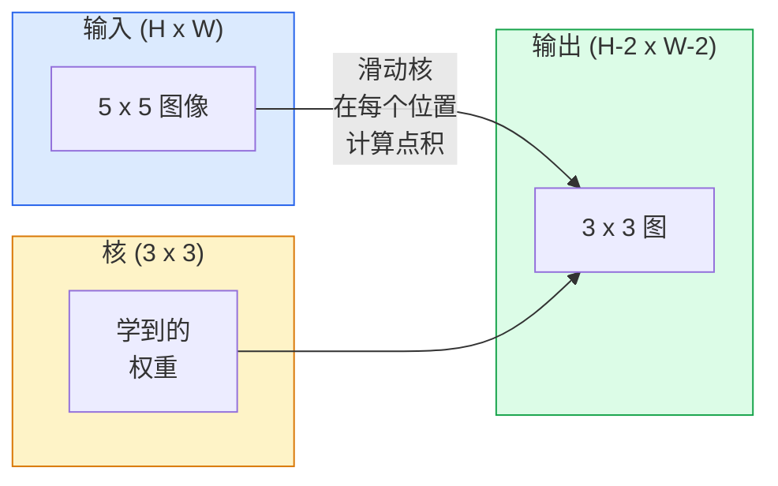
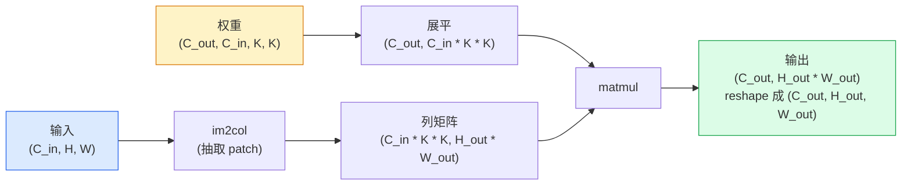

# 从零实现卷积

> 卷积就是一个小小的全连接层，你把它在图像上滑动，每个位置都共享同一套权重。

**类型：** Build
**语言：** Python
**前置要求：** 阶段 3（深度学习核心）、阶段 4 第 01 课（图像基础）
**预计时间：** ~75 分钟

## 学习目标

- 只用 NumPy 从零实现 2D 卷积，包括嵌套循环版本和向量化的 `im2col` 版本
- 对任意输入尺寸、核大小、padding、stride 的组合，算出输出空间尺寸，并讲清 `(H - K + 2P) / S + 1` 这个公式的来由
- 手工设计核（边缘、模糊、锐化、Sobel），解释每个核为什么会产生那样的激活模式
- 把卷积堆成一个特征提取器，把堆叠的深度和感受野的大小联系起来

## 问题所在

对一张 224x224 的 RGB 图像，一个全连接层每个神经元需要 224 * 224 * 3 = 150,528 个输入权重。光是一个 1,000 个单元的隐藏层就已经是 1.5 亿参数——而你还什么有用的东西都没学到。更糟的是，那个层根本不知道左上角的狗和右下角的狗是同一个模式。它把每个像素位置都当成独立的，这对图像来说恰恰是错的：把一只猫平移三个像素，不应该逼着网络重新学习这个概念。

图像模型需要的两个性质是**平移等变性**（输入移动时输出跟着移动）和**参数共享**（同一个特征检测器到处跑）。全连接层一个都给不了你。卷积把两个都白送给你。

卷积不是为深度学习发明的。同样这个运算，撑起了 JPEG 压缩、Photoshop 里的高斯模糊、工业视觉里的边缘检测，以及历史上发布过的每一个音频滤波器。CNN 之所以从 2012 到 2020 称霸 ImageNet，是因为对于"相邻值彼此相关、同一模式可能出现在任何地方"的数据，卷积是正确的先验。

## 核心概念

### 一个核，滑动起来

2D 卷积拿一个叫做核（kernel，或称 filter）的小权重矩阵，在输入上滑动，每个位置计算逐元素乘积之和。这个和就是一个输出像素。



在 5x5 输入上做 3x3 卷积的一个具体例子（无 padding，stride 1）：

```
输入 X (5 x 5)：               核 W (3 x 3)：

  1  2  0  1  2                   1  0 -1
  0  1  3  1  0                   2  0 -2
  2  1  0  2  1                   1  0 -1
  1  0  2  1  3
  2  1  1  0  1

核在每个有效的 3 x 3 窗口上滑动。输出 Y 是 3 x 3：

 Y[0,0] = sum( W * X[0:3, 0:3] )
 Y[0,1] = sum( W * X[0:3, 1:4] )
 Y[0,2] = sum( W * X[0:3, 2:5] )
 Y[1,0] = sum( W * X[1:4, 0:3] )
 ... 以此类推
```

那一个公式——**共享权重、局部性、滑动窗口**——就是全部思想。其余都是记账。

### 输出尺寸公式

给定输入空间尺寸 `H`、核大小 `K`、padding `P`、stride `S`：

```
H_out = floor( (H - K + 2P) / S ) + 1
```

记住它。每设计一个架构，你都要算上几十遍。

| 场景 | H | K | P | S | H_out |
|----------|---|---|---|---|-------|
| Valid 卷积，无 padding | 32 | 3 | 0 | 1 | 30 |
| Same 卷积（保持尺寸） | 32 | 3 | 1 | 1 | 32 |
| 下采样 2 倍 | 32 | 3 | 1 | 2 | 16 |
| 2x2 池化 | 32 | 2 | 0 | 2 | 16 |
| 大感受野 | 32 | 7 | 3 | 2 | 16 |

"Same padding"意思是选一个 P，使得当 S == 1 时 H_out == H。对奇数 K，那就是 P = (K - 1) / 2。这就是 3x3 核称霸的原因——它是仍然有中心的最小奇数核。

### Padding

不加 padding，每次卷积都会让特征图缩水。堆 20 个，你的 224x224 图像就变成 184x184，这在边界上浪费算力，还让需要形状匹配的残差连接变复杂。

```
对 5 x 5 输入做零填充 (P = 1)：

  0  0  0  0  0  0  0
  0  1  2  0  1  2  0
  0  0  1  3  1  0  0
  0  2  1  0  2  1  0       现在核可以中心对准像素 (0, 0)，
  0  1  0  2  1  3  0       仍然有三行三列的值可以相乘。
  0  2  1  1  0  1  0
  0  0  0  0  0  0  0
```

实践中你会遇到的模式：`zero`（最常见）、`reflect`（镜像边缘，在生成模型里避免硬边界）、`replicate`（复制边缘）、`circular`（环绕，用于环面问题）。

### Stride

stride 是滑动的步长。`stride=1` 是默认。`stride=2` 把空间维度减半，是在 CNN 内部不另设池化层就做下采样的经典办法——每个现代架构（ResNet、ConvNeXt、MobileNet）都在某处用带 stride 的卷积代替了 max-pool。

```
在 5 x 5 输入上 stride 1，3 x 3 核：

  起点: (0,0) (0,1) (0,2)        -> 输出第 0 行
        (1,0) (1,1) (1,2)        -> 输出第 1 行
        (2,0) (2,1) (2,2)        -> 输出第 2 行

  输出: 3 x 3

同一输入上 stride 2：

  起点: (0,0) (0,2)              -> 输出第 0 行
        (2,0) (2,2)              -> 输出第 1 行

  输出: 2 x 2
```

### 多个输入通道

真实图像有三个通道。RGB 输入上的 3x3 卷积，实际是一个 3x3x3 的体：每个输入通道一个 3x3 切片。每个空间位置上，你在全部三个切片上相乘求和，再加一个 bias。

```
输入:   (C_in,  H,  W)        3 x 5 x 5
核:     (C_in,  K,  K)        3 x 3 x 3 (一个核)
输出:   (1,     H', W')       2D 图

要产生 C_out 个输出通道的层，你堆叠 C_out 个核：

权重:   (C_out, C_in, K, K)   例如 64 x 3 x 3 x 3
输出:   (C_out, H', W')       64 x 3 x 3

参数量: C_out * C_in * K * K + C_out   (+ C_out 是 bias)
```

最后那行就是你规划模型时要算的。3 通道输入上的 64 通道 3x3 卷积，有 `64 * 3 * 3 * 3 + 64 = 1,792` 个参数。很便宜。

### im2col 技巧

嵌套循环容易读但慢。GPU 想要大矩阵乘法。技巧是：把输入的每个感受野窗口展平成一个大矩阵的一列，把核展平成一行，整个卷积就变成一次 matmul。



每个生产级卷积实现都是这个加上缓存分块技巧的某种变体（直接卷积、Winograd、大核用 FFT 卷积）。理解了 im2col，你就理解了核心。

### 感受野

一个 3x3 卷积看 9 个输入像素。堆两个 3x3 卷积，第二层的一个神经元看 5x5 个输入像素。三个 3x3 卷积给出 7x7。一般地：

```
L 个堆叠的 K x K 卷积（stride 1）之后的 RF = 1 + L * (K - 1)

带 stride 时：   RF 沿每一层随 stride 成倍增长。
```

"一路 3x3 到底"（VGG、ResNet、ConvNeXt）能成立的全部原因是：两个 3x3 卷积看到的输入面积和一个 5x5 卷积相同，但参数更少，而且中间多了一个非线性。

## 动手构建

### 第 1 步：给数组做 padding

从最小的原语开始：一个在 H x W 数组周围补零的函数。

```python
import numpy as np

def pad2d(x, p):
    if p == 0:
        return x
    h, w = x.shape[-2:]
    out = np.zeros(x.shape[:-2] + (h + 2 * p, w + 2 * p), dtype=x.dtype)
    out[..., p:p + h, p:p + w] = x
    return out

x = np.arange(9).reshape(3, 3)
print(x)
print()
print(pad2d(x, 1))
```

尾部轴的技巧 `x.shape[:-2]` 意味着同一个函数无需改动就能作用于 `(H, W)`、`(C, H, W)` 或 `(N, C, H, W)`。

### 第 2 步：用嵌套循环做 2D 卷积

参考实现——慢，但毫不含糊。这就是 `torch.nn.functional.conv2d` 在原理上做的事。

```python
def conv2d_naive(x, w, b=None, stride=1, padding=0):
    c_in, h, w_in = x.shape
    c_out, c_in_w, kh, kw = w.shape
    assert c_in == c_in_w

    x_pad = pad2d(x, padding)
    h_out = (h + 2 * padding - kh) // stride + 1
    w_out = (w_in + 2 * padding - kw) // stride + 1

    out = np.zeros((c_out, h_out, w_out), dtype=np.float32)
    for oc in range(c_out):
        for i in range(h_out):
            for j in range(w_out):
                hs = i * stride
                ws = j * stride
                patch = x_pad[:, hs:hs + kh, ws:ws + kw]
                out[oc, i, j] = np.sum(patch * w[oc])
        if b is not None:
            out[oc] += b[oc]
    return out
```

四层嵌套循环（输出通道、行、列，加上对 C_in、kh、kw 的隐式求和）。这就是你拿来校验每个更快实现的真值。

### 第 3 步：用手工设计的核验证

构造一个竖直 Sobel 核，作用到一张合成的阶跃图像上，看竖直边缘亮起来。

```python
def synthetic_step_image():
    img = np.zeros((1, 16, 16), dtype=np.float32)
    img[:, :, 8:] = 1.0
    return img

sobel_x = np.array([
    [[-1, 0, 1],
     [-2, 0, 2],
     [-1, 0, 1]]
], dtype=np.float32)[None]

x = synthetic_step_image()
y = conv2d_naive(x, sobel_x, padding=1)
print(y[0].round(1))
```

第 7 列（从左到右亮度上升）应出现较大的正值，其余处处为零。那一行打印就是你检验数学是否正确的合理性检查。

### 第 4 步：im2col

把输入里每个核大小的窗口转成矩阵的一列。对 `C_in=3, K=3`，每列是 27 个数。

```python
def im2col(x, kh, kw, stride=1, padding=0):
    c_in, h, w = x.shape
    x_pad = pad2d(x, padding)
    h_out = (h + 2 * padding - kh) // stride + 1
    w_out = (w + 2 * padding - kw) // stride + 1

    cols = np.zeros((c_in * kh * kw, h_out * w_out), dtype=x.dtype)
    col = 0
    for i in range(h_out):
        for j in range(w_out):
            hs = i * stride
            ws = j * stride
            patch = x_pad[:, hs:hs + kh, ws:ws + kw]
            cols[:, col] = patch.reshape(-1)
            col += 1
    return cols, h_out, w_out
```

它还是个 Python 循环，但现在重活会落到一次向量化的 matmul 上。

### 第 5 步：用 im2col + matmul 做快速卷积

用一次矩阵乘法取代四层循环。

```python
def conv2d_im2col(x, w, b=None, stride=1, padding=0):
    c_out, c_in, kh, kw = w.shape
    cols, h_out, w_out = im2col(x, kh, kw, stride, padding)
    w_flat = w.reshape(c_out, -1)
    out = w_flat @ cols
    if b is not None:
        out += b[:, None]
    return out.reshape(c_out, h_out, w_out)
```

正确性检查：跑两个实现并对比。

```python
rng = np.random.default_rng(0)
x = rng.normal(0, 1, (3, 16, 16)).astype(np.float32)
w = rng.normal(0, 1, (8, 3, 3, 3)).astype(np.float32)
b = rng.normal(0, 1, (8,)).astype(np.float32)

y_naive = conv2d_naive(x, w, b, padding=1)
y_im2col = conv2d_im2col(x, w, b, padding=1)

print(f"max abs diff: {np.max(np.abs(y_naive - y_im2col)):.2e}")
```

`max abs diff` 应在 `1e-5` 左右——差异来自浮点累加顺序，不是 bug。

### 第 6 步：一组手工设计的核

五个滤波器，展示一个卷积层在任何训练之前能表达什么。

```python
KERNELS = {
    "identity": np.array([[0, 0, 0], [0, 1, 0], [0, 0, 0]], dtype=np.float32),
    "blur_3x3": np.ones((3, 3), dtype=np.float32) / 9.0,
    "sharpen": np.array([[0, -1, 0], [-1, 5, -1], [0, -1, 0]], dtype=np.float32),
    "sobel_x": np.array([[-1, 0, 1], [-2, 0, 2], [-1, 0, 1]], dtype=np.float32),
    "sobel_y": np.array([[-1, -2, -1], [0, 0, 0], [1, 2, 1]], dtype=np.float32),
}

def apply_kernel(img2d, kernel):
    x = img2d[None].astype(np.float32)
    w = kernel[None, None]
    return conv2d_im2col(x, w, padding=1)[0]
```

作用于任意灰度图像：blur 让它变柔，sharpen 让边缘更利落，Sobel-x 点亮竖直边缘，Sobel-y 点亮水平边缘。这些恰恰是 AlexNet 和 VGG 里*第一个*训练好的卷积层最终学到的模式——因为不管后面是什么任务，一个好的图像模型都需要边缘和斑点检测器。

## 上手使用

PyTorch 的 `nn.Conv2d` 把同样的运算包了起来，配上 autograd、CUDA kernel 和 cuDNN 优化。形状语义完全一致。

```python
import torch
import torch.nn as nn

conv = nn.Conv2d(in_channels=3, out_channels=64, kernel_size=3, stride=1, padding=1)
print(conv)
print(f"weight shape: {tuple(conv.weight.shape)}   # (C_out, C_in, K, K)")
print(f"bias shape:   {tuple(conv.bias.shape)}")
print(f"param count:  {sum(p.numel() for p in conv.parameters())}")

x = torch.randn(8, 3, 224, 224)
y = conv(x)
print(f"\ninput  shape: {tuple(x.shape)}")
print(f"output shape: {tuple(y.shape)}")
```

把 `padding=1` 换成 `padding=0`，输出降到 222x222。把 `stride=1` 换成 `stride=2`，降到 112x112。还是你上面记住的那个公式。

## 交付

这一课产出：

- `outputs/prompt-cnn-architect.md` —— 一个 prompt，给定输入尺寸、参数预算和目标感受野，设计出一摞 `Conv2d` 层，每一步的 K/S/P 都对。
- `outputs/skill-conv-shape-calculator.md` —— 一个 skill，逐层遍历一个网络规格，返回每个块的输出形状、感受野和参数量。

## 练习

1. **（简单）** 给定一个 128x128 的灰度输入和一摞 `[Conv3x3(s=1,p=1), Conv3x3(s=2,p=1), Conv3x3(s=1,p=1), Conv3x3(s=2,p=1)]`，手算每一层的输出空间尺寸和感受野。用一个 PyTorch `nn.Sequential` 的占位卷积来验证。
2. **（中等）** 扩展 `conv2d_naive` 和 `conv2d_im2col`，让它们接受一个 `groups` 参数。证明 `groups=C_in=C_out` 复现了深度可分卷积（depthwise convolution），且它的参数量是 `C * K * K` 而非 `C * C * K * K`。
3. **（困难）** 手写 `conv2d_im2col` 的反向传播：给定输出的梯度，算出 `x` 和 `w` 的梯度。在同样的输入和权重上，用 `torch.autograd.grad` 验证。技巧：im2col 的梯度是 `col2im`，它必须把重叠的窗口累加起来。

## 关键术语

| 术语 | 大家嘴上怎么说 | 它实际是什么 |
|------|----------------|----------------------|
| 卷积 | "滑动一个滤波器" | 在每个空间位置以共享权重做的一次可学习点积；数学上是互相关，但所有人都叫它卷积 |
| 核 / 滤波器 | "特征检测器" | 形状为 (C_in, K, K) 的小权重张量，它与一个输入窗口的点积产生一个输出像素 |
| Stride | "你跳多远" | 相邻核位置之间的步长；stride 2 把每个空间维度减半 |
| Padding | "边缘上的零" | 在输入周围补上的额外值，让核能中心对准边界像素；`same` padding 保持输出尺寸等于输入尺寸 |
| 感受野 | "神经元看到多少" | 某个输出激活所依赖的那块原始输入，随深度和 stride 增长 |
| im2col | "GEMM 技巧" | 把每个感受窗口重排成列，使卷积变成一次大矩阵乘法——每个快速卷积 kernel 的核心 |
| 深度可分卷积 | "每通道一个核" | `groups == C_in` 的卷积，每个输出通道只从它对应的输入通道算出；MobileNet 和 ConvNeXt 的骨干 |
| 平移等变性 | "进去移，出来也移" | 输入平移 k 个像素，输出也平移 k 个像素的性质；共享权重白送给你 |

## 延伸阅读

- [A guide to convolution arithmetic for deep learning (Dumoulin & Visin, 2016)](https://arxiv.org/abs/1603.07285) —— 关于 padding/stride/dilation 的权威图示，每门课都在悄悄照抄
- [CS231n: Convolutional Neural Networks for Visual Recognition](https://cs231n.github.io/convolutional-networks/) —— 经典讲义，包含最初的 im2col 讲解
- [The Annotated ConvNet (fast.ai)](https://nbviewer.org/github/fastai/fastbook/blob/master/13_convolutions.ipynb) —— 一个从手动卷积一路走到训练好的数字分类器的 notebook
- [Receptive Field Arithmetic for CNNs (Dang Ha The Hien)](https://distill.pub/2019/computing-receptive-fields/) —— 论文质量的交互式讲解，讲感受野计算
