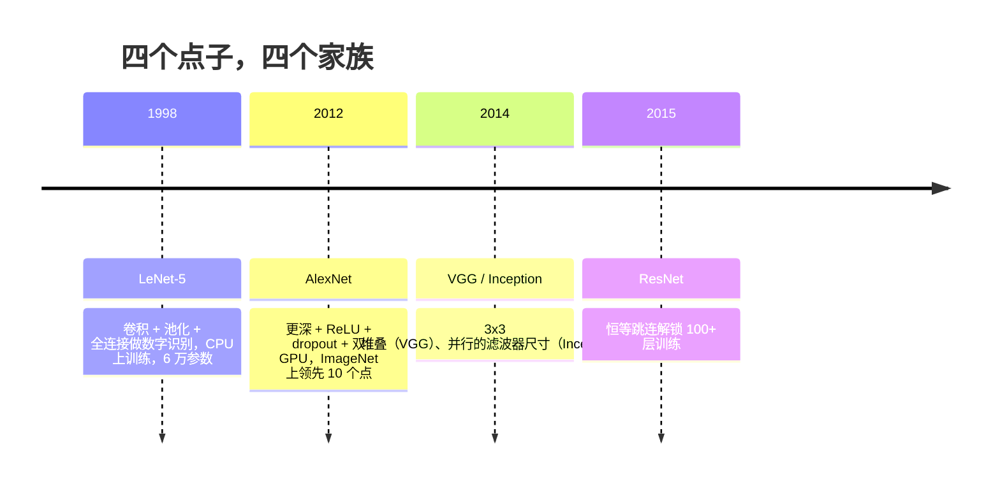
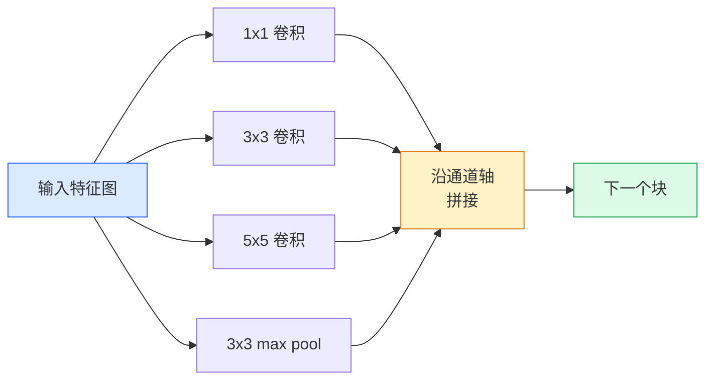
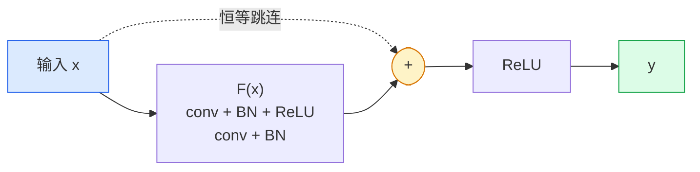

# CNN —— 从 LeNet 到 ResNet

> 过去三十年的每一个主流 CNN，都是同一套"卷积–非线性–下采样"配方，外加一个新点子拴在上面。按顺序把这些点子学一遍。

**类型：** Learn + Build
**语言：** Python
**前置要求：** 阶段 3 第 11 课（PyTorch）、阶段 4 第 01 课（图像基础）、阶段 4 第 02 课（从零实现卷积）
**预计时间：** ~75 分钟

## 学习目标

- 梳理架构脉络 LeNet-5 -> AlexNet -> VGG -> Inception -> ResNet，说出每个家族贡献的那一个新点子
- 用 PyTorch 实现 LeNet-5、一个 VGG 风格的块、一个 ResNet BasicBlock，每个都不超过 40 行
- 解释为什么残差连接能把一个 1,000 层的网络从无法训练变成业界最强
- 读懂一个现代骨干（ResNet-18、ResNet-50），在看源码之前就预测出它的输出形状、感受野和参数量

## 问题所在

2011 年，最好的 ImageNet 分类器 top-5 准确率约 74%。2012 年 AlexNet 拿到 85%。2015 年 ResNet 拿到 96%。没有新数据，没有新一代 GPU。这些提升来自架构上的点子。一个干活的视觉工程师必须知道哪个点子出自哪篇论文，因为你在 2026 年交付的每个生产骨干，都是这些同样部件的重新组合——而且这些点子还在不断迁移：分组卷积从 CNN 走到了 transformer，残差连接从 ResNet 走进了世上每一个 LLM，批归一化活在扩散模型里。

按顺序研究这些网络，还能让你对一个常见错误免疫：明明一个 LeNet 大小的网络就能解决问题，却伸手去抓手头最大的模型。MNIST 不需要 ResNet。知道每个家族的缩放曲线，你就知道自己该坐在曲线的哪个位置。

## 核心概念

### 改变视觉的四个点子



经典视觉里，没有任何别的东西能比这四次跳跃更要紧。

### LeNet-5（1998）

Yann LeCun 的数字识别器。6 万参数。两个卷积-池化块，两个全连接层，tanh 激活。它定义了每个 CNN 都继承的模板：

```
input (1, 32, 32)
  conv 5x5 -> (6, 28, 28)
  avg pool 2x2 -> (6, 14, 14)
  conv 5x5 -> (16, 10, 10)
  avg pool 2x2 -> (16, 5, 5)
  flatten -> 400
  dense -> 120
  dense -> 84
  dense -> 10
```

现代世界叫做 CNN 的一切——交替的卷积和下采样，喂给一个小小的分类头——都是层更多、通道更大、激活更好的 LeNet。

### AlexNet（2012）

三个改动合在一起攻破了 ImageNet：

1. **ReLU** 代替 tanh。梯度不再消失。训练快了六倍。
2. 全连接头里的 **Dropout**。正则化成了一个层，而不是一个小技巧。
3. **深度和宽度**。五个卷积层、三个全连接层、6000 万参数，在两块 GPU 上训练，模型被切开分布在两块卡上。

论文的图 2 至今还把 GPU 切分画成两条并行流。那个并行是硬件层面的权宜之计，不是架构洞见——但上面那三个点子，仍在你用的每个模型里。

### VGG（2014）

VGG 问的是：如果你只用 3x3 卷积，而且往深里堆，会怎样？

```
块:     conv 3x3 -> conv 3x3 -> pool 2x2
重复:    16 或 19 个卷积层
```

两个 3x3 卷积看到的 5x5 输入面积，和一个 5x5 卷积相同，但参数更少（2*9*C^2 = 18C^2 对 25*C^2），中间还多一个 ReLU。VGG 把这个观察变成了一整套架构。它的简单——一种块类型，重复堆——让它成了后来一切的参照点。

代价：1.38 亿参数，训练慢，推理贵。

### Inception（2014，同一年）

Google 对"我该用多大的核"这个问题的回答是：全都用，并行地用。



每个分支各有专长——1x1 做通道混合，3x3 做局部纹理，5x5 做更大的模式，池化做平移不变特征——拼接让下一层挑出哪个分支有用。Inception v1 在每个分支内部用 1x1 卷积当瓶颈，把参数量压在合理范围。

### 退化问题

到 2015 年，VGG-19 行，VGG-32 不行。深度本该有帮助，但过了约 20 层，训练损失和测试损失都变差了。这不是过拟合。这是优化器找不到有用的权重，因为梯度在穿过每一层时成倍缩小。

```
朴素深度网络：
  y = f_L( f_{L-1}( ... f_1(x) ... ) )

对早期层的梯度：
  dL/dW_1 = dL/dy * df_L/df_{L-1} * ... * df_2/df_1 * df_1/dW_1

每个乘性项的量级大约是（权重量级）*（激活增益）。
增益 < 1 的项叠 100 个，梯度实际上就是零。
```

VGG 在 19 层能行，是因为批归一化（同期发表）让激活保持良好缩放。但即便批归一化也救不了超过 30 层左右的深度。

### ResNet（2015）

He、Zhang、Ren、Sun 提出了一个改动，把一切都修好了：

```
标准块:   y = F(x)
残差块:   y = F(x) + x
```

那个 `+ x` 意味着该层总能通过把 `F(x)` 逼到零来选择"什么都不做"。一个 1,000 层的 ResNet 现在至多和一个 1 层网络一样糟，因为每个多出来的块都有一个轻松的逃生通道。有了这个保证，优化器就愿意让每个块都*稍微*有点用——而稍微有点用、叠 100 次，就是业界最强。



这个块的两个变体到处都是：

- **BasicBlock**（ResNet-18、ResNet-34）：两个 3x3 卷积，跳过两个。
- **Bottleneck**（ResNet-50、-101、-152）：1x1 降维、3x3 中间、1x1 升维，跳过这三个。通道数高时更便宜。

当跳连必须跨过一次下采样（stride=2）时，恒等路径被替换成一个 1x1 stride=2 的卷积来匹配形状。

### 为什么残差的意义超出了视觉

这个点子其实不真是关于图像分类的。它是关于把深度网络从"祈祷梯度能活下来"变成一个可靠、可扩展的工程工具。你下个阶段会读到的每个 transformer，在每个块里都有一模一样的跳连。没有 ResNet，就没有 GPT。

## 动手构建

### 第 1 步：LeNet-5

一个极简、忠实的 LeNet。tanh 激活，平均池化。唯一对现代的让步是我们在下游用 `nn.CrossEntropyLoss`，而不是原始的高斯连接。

```python
import torch
import torch.nn as nn
import torch.nn.functional as F

class LeNet5(nn.Module):
    def __init__(self, num_classes=10):
        super().__init__()
        self.conv1 = nn.Conv2d(1, 6, kernel_size=5)
        self.conv2 = nn.Conv2d(6, 16, kernel_size=5)
        self.pool = nn.AvgPool2d(2)
        self.fc1 = nn.Linear(16 * 5 * 5, 120)
        self.fc2 = nn.Linear(120, 84)
        self.fc3 = nn.Linear(84, num_classes)

    def forward(self, x):
        x = self.pool(torch.tanh(self.conv1(x)))
        x = self.pool(torch.tanh(self.conv2(x)))
        x = torch.flatten(x, 1)
        x = torch.tanh(self.fc1(x))
        x = torch.tanh(self.fc2(x))
        return self.fc3(x)

net = LeNet5()
x = torch.randn(1, 1, 32, 32)
print(f"output: {net(x).shape}")
print(f"params: {sum(p.numel() for p in net.parameters()):,}")
```

预期输出：`output: torch.Size([1, 10])`、`params: 61,706`。这就是开启了现代视觉的那整个数字分类器。

### 第 2 步：一个 VGG 块

一个可复用的块：两个 3x3 卷积、ReLU、批归一化、max pool。

```python
class VGGBlock(nn.Module):
    def __init__(self, in_c, out_c):
        super().__init__()
        self.conv1 = nn.Conv2d(in_c, out_c, kernel_size=3, padding=1)
        self.bn1 = nn.BatchNorm2d(out_c)
        self.conv2 = nn.Conv2d(out_c, out_c, kernel_size=3, padding=1)
        self.bn2 = nn.BatchNorm2d(out_c)
        self.pool = nn.MaxPool2d(2)

    def forward(self, x):
        x = F.relu(self.bn1(self.conv1(x)))
        x = F.relu(self.bn2(self.conv2(x)))
        return self.pool(x)

class MiniVGG(nn.Module):
    def __init__(self, num_classes=10):
        super().__init__()
        self.stack = nn.Sequential(
            VGGBlock(3, 32),
            VGGBlock(32, 64),
            VGGBlock(64, 128),
        )
        self.head = nn.Sequential(
            nn.AdaptiveAvgPool2d(1),
            nn.Flatten(),
            nn.Linear(128, num_classes),
        )

    def forward(self, x):
        return self.head(self.stack(x))

net = MiniVGG()
x = torch.randn(1, 3, 32, 32)
print(f"output: {net(x).shape}")
print(f"params: {sum(p.numel() for p in net.parameters()):,}")
```

CIFAR 尺寸输入上的三个 VGG 块、一个自适应池化、一个线性层。约 29 万参数。对 CIFAR-10 绰绰有余。

### 第 3 步：一个 ResNet BasicBlock

ResNet-18 和 ResNet-34 的核心构件。

```python
class BasicBlock(nn.Module):
    def __init__(self, in_c, out_c, stride=1):
        super().__init__()
        self.conv1 = nn.Conv2d(in_c, out_c, kernel_size=3, stride=stride, padding=1, bias=False)
        self.bn1 = nn.BatchNorm2d(out_c)
        self.conv2 = nn.Conv2d(out_c, out_c, kernel_size=3, stride=1, padding=1, bias=False)
        self.bn2 = nn.BatchNorm2d(out_c)
        if stride != 1 or in_c != out_c:
            self.shortcut = nn.Sequential(
                nn.Conv2d(in_c, out_c, kernel_size=1, stride=stride, bias=False),
                nn.BatchNorm2d(out_c),
            )
        else:
            self.shortcut = nn.Identity()

    def forward(self, x):
        out = F.relu(self.bn1(self.conv1(x)))
        out = self.bn2(self.conv2(out))
        out = out + self.shortcut(x)
        return F.relu(out)
```

卷积层上的 `bias=False` 是批归一化的惯例——BN 的 beta 参数已经处理了 bias，再带上卷积 bias 就是浪费。`shortcut` 只在 stride 或通道数变化时才需要真正的卷积；否则它就是个恒等空操作。

### 第 4 步：一个迷你 ResNet

堆四组 BasicBlock，得到一个能用的、面向 CIFAR 尺寸输入的 ResNet。

```python
class TinyResNet(nn.Module):
    def __init__(self, num_classes=10):
        super().__init__()
        self.stem = nn.Sequential(
            nn.Conv2d(3, 32, kernel_size=3, stride=1, padding=1, bias=False),
            nn.BatchNorm2d(32),
            nn.ReLU(inplace=True),
        )
        self.layer1 = self._make_group(32, 32, num_blocks=2, stride=1)
        self.layer2 = self._make_group(32, 64, num_blocks=2, stride=2)
        self.layer3 = self._make_group(64, 128, num_blocks=2, stride=2)
        self.layer4 = self._make_group(128, 256, num_blocks=2, stride=2)
        self.head = nn.Sequential(
            nn.AdaptiveAvgPool2d(1),
            nn.Flatten(),
            nn.Linear(256, num_classes),
        )

    def _make_group(self, in_c, out_c, num_blocks, stride):
        blocks = [BasicBlock(in_c, out_c, stride=stride)]
        for _ in range(num_blocks - 1):
            blocks.append(BasicBlock(out_c, out_c, stride=1))
        return nn.Sequential(*blocks)

    def forward(self, x):
        x = self.stem(x)
        x = self.layer1(x)
        x = self.layer2(x)
        x = self.layer3(x)
        x = self.layer4(x)
        return self.head(x)

net = TinyResNet()
x = torch.randn(1, 3, 32, 32)
print(f"output: {net(x).shape}")
print(f"params: {sum(p.numel() for p in net.parameters()):,}")
```

四组，每组两个块。第 2、3、4 组开头用 stride 2。每次下采样通道数翻倍。约 280 万参数。这就是能一路干净地缩放到 ResNet-152 的标准配方。

### 第 5 步：对比"参数换特征"的效率

让同一个输入跑过这三个网络，对比参数量。

```python
def summary(name, net, x):
    y = net(x)
    params = sum(p.numel() for p in net.parameters())
    print(f"{name:12s}  input {tuple(x.shape)} -> output {tuple(y.shape)}  params {params:>10,}")

x = torch.randn(1, 3, 32, 32)
summary("LeNet5",     LeNet5(),       torch.randn(1, 1, 32, 32))
summary("MiniVGG",    MiniVGG(),      x)
summary("TinyResNet", TinyResNet(),   x)
```

三个模型，三个时代，参数量相差三个数量级。CIFAR-10 上训练几个 epoch 后，准确率大致是：LeNet 60%、MiniVGG 89%、TinyResNet 93%。

## 上手使用

`torchvision.models` 给你上面所有这些的预训练版本。各家族的调用签名完全一致，这正是骨干这个抽象的意义所在。

```python
from torchvision.models import resnet18, ResNet18_Weights, vgg16, VGG16_Weights

r18 = resnet18(weights=ResNet18_Weights.IMAGENET1K_V1)
r18.eval()

print(f"ResNet-18 params: {sum(p.numel() for p in r18.parameters()):,}")
print(r18.layer1[0])
print()

v16 = vgg16(weights=VGG16_Weights.IMAGENET1K_V1)
v16.eval()
print(f"VGG-16   params: {sum(p.numel() for p in v16.parameters()):,}")
```

ResNet-18 有 1170 万参数。VGG-16 有 1.38 亿。ImageNet top-1 准确率相近（69.8% 对 71.6%）。残差连接给你换来了 12 倍的参数效率。这就是为什么从 2016 年到 2021 年 ViT 出现之前，ResNet 变体一直称霸——在算力是约束的真实部署里至今仍然称霸。

做迁移学习，配方永远一样：加载预训练，冻结骨干，替换分类头。

```python
for p in r18.parameters():
    p.requires_grad = False
r18.fc = nn.Linear(r18.fc.in_features, 10)
```

三行。你现在有了一个 10 类 CIFAR 分类器，它继承了 ImageNet 用钱砸出来的表示。

## 交付

这一课产出：

- `outputs/prompt-backbone-selector.md` —— 一个 prompt，给定任务、数据集规模和算力预算，挑出合适的 CNN 家族（LeNet/VGG/ResNet/MobileNet/ConvNeXt）。
- `outputs/skill-residual-block-reviewer.md` —— 一个 skill，读一个 PyTorch 模块并标出跳连错误（stride 变化时漏掉 shortcut、shortcut 的激活顺序、BN 相对于加法的位置）。

## 练习

1. **（简单）** 对 `TinyResNet` 逐层手算参数量。和 `sum(p.numel() for p in net.parameters())` 对比。参数预算的大头花在哪儿——卷积、BN 还是分类头？
2. **（中等）** 实现 Bottleneck 块（1x1 -> 3x3 -> 1x1 带跳连），用它为 CIFAR 搭一个 ResNet-50 风格的网络。和 `TinyResNet` 比参数量。
3. **（困难）** 从 `BasicBlock` 里去掉跳连，在 CIFAR-10 上各训练一个 34 块的"朴素"网络和一个 34 块的 ResNet，各 10 个 epoch。两者都画训练损失对 epoch 的曲线。复现 He 等人图 1 的结果：朴素深度网络收敛到的损失比它更浅的孪生网络更高。

## 关键术语

| 术语 | 大家嘴上怎么说 | 它实际是什么 |
|------|----------------|----------------------|
| 骨干（Backbone） | "模型" | 那一摞卷积块，产出喂给任务头的特征图 |
| 残差连接 | "跳连" | `y = F(x) + x`；通过把 F 设为零让优化器学到恒等，从而让任意深度都可训练 |
| BasicBlock | "两个带跳连的 3x3 卷积" | ResNet-18/34 的构件：conv-BN-ReLU-conv-BN-add-ReLU |
| Bottleneck | "1x1 降、3x3、1x1 升" | ResNet-50/101/152 的块；通道数高时便宜，因为 3x3 跑在缩减后的宽度上 |
| 退化问题 | "更深反而更差" | 过了约 20 个朴素卷积层，训练误差和测试误差都上升；靠残差连接解决，不是靠更多数据 |
| Stem | "第一层" | 把 3 通道输入转成基础特征宽度的初始卷积；ImageNet 上通常是 7x7 stride 2，CIFAR 上是 3x3 stride 1 |
| Head（头） | "分类器" | 最后一个骨干块之后的那些层：自适应池化、flatten、线性层 |
| 迁移学习 | "预训练权重" | 加载一个在 ImageNet 上训练好的骨干，只在你的任务上微调头部 |

## 延伸阅读

- [Deep Residual Learning for Image Recognition (He et al., 2015)](https://arxiv.org/abs/1512.03385) —— ResNet 论文；每张图都值得研究
- [Very Deep Convolutional Networks (Simonyan & Zisserman, 2014)](https://arxiv.org/abs/1409.1556) —— VGG 论文；至今仍是"为什么 3x3"的最佳参考
- [ImageNet Classification with Deep CNNs (Krizhevsky et al., 2012)](https://papers.nips.cc/paper_files/paper/2012/hash/c399862d3b9d6b76c8436e924a68c45b-Abstract.html) —— AlexNet；终结了手工特征时代的那篇论文
- [Going Deeper with Convolutions (Szegedy et al., 2014)](https://arxiv.org/abs/1409.4842) —— Inception v1；至今仍出现在视觉 transformer 里的并行滤波器点子
