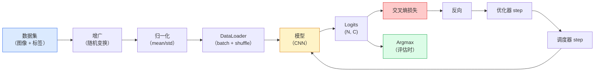

# 图像分类

> 分类器就是一个从像素到类别概率分布的函数。其余一切都是管道。

**类型：** Build
**语言：** Python
**前置要求：** 阶段 2 第 09 课（模型评估）、阶段 3 第 10 课（迷你框架）、阶段 4 第 03 课（CNN）
**预计时间：** ~75 分钟

## 学习目标

- 在 CIFAR-10 上搭一条端到端的图像分类流水线：数据集、增广、模型、训练循环、评估
- 解释每个组件（dataloader、损失、优化器、调度器、增广）的作用，并预测弄坏其中任何一个会在损失曲线上怎样显现
- 从零实现 mixup、cutout 和标签平滑，并说清各自什么时候值得加
- 读懂混淆矩阵和逐类精确率/召回率表，超越聚合准确率去诊断数据集和模型的故障

## 问题所在

每个能上线的视觉任务，在某个层面上都归结为图像分类。检测是对区域分类。分割是对像素分类。检索按与类别质心的相似度排序。把分类做对——数据循环、增广策略、损失、评估——这门手艺会迁移到本阶段的其他每个任务上。

大多数分类 bug 不在模型里。它们藏在流水线里：坏掉的归一化、没打乱的训练集、扭曲了标签的增广、被训练数据污染的验证划分、第 30 个 epoch 后悄悄发散的学习率。一个在正确配置下能在 CIFAR-10 上达到 93% 的 CNN，在配置坏掉时常常只有 70-75%，而损失曲线全程看起来都还说得过去。

这一课把整条流水线手工接起来，让每个部分都可检查。你不会用 `torchvision.datasets` 里任何可能藏 bug 的东西。

## 核心概念

### 分类流水线



这个循环里每一行都可能藏 bug。交叉熵接的是原始 logits，不是 softmax 输出，所以在损失之前做任何 `model(x).softmax()` 都会悄悄算出错误的梯度。增广只作用于输入，不作用于标签——除了 mixup，它把两者都混。`optimizer.zero_grad()` 必须每步一次；漏掉它会累积梯度，看起来像疯狂不稳定的学习率。这些 bug 每一个都会把学习曲线压平，却不报错。

### 交叉熵、logits 和 softmax

分类器为每张图像产生 `C` 个数，叫 logits。应用 softmax 把它们转成概率分布：

```
softmax(z)_i = exp(z_i) / sum_j exp(z_j)
```

交叉熵衡量正确类别的负对数概率：

```
CE(z, y) = -log( softmax(z)_y )
        = -z_y + log( sum_j exp(z_j) )
```

右边那个形式是数值稳定的版本（log-sum-exp）。PyTorch 的 `nn.CrossEntropyLoss` 把 softmax + NLL 融成一个操作，直接接原始 logits。自己先做 softmax 几乎总是 bug——你算的是 log(softmax(softmax(z)))，一个没有意义的量。

### 为什么增广有用

CNN 对平移有归纳偏置（来自权重共享），但对裁剪、翻转、色彩抖动或遮挡没有内建的不变性。教会它这些不变性的唯一办法，就是给它看锻炼这些不变性的像素。训练时每个随机变换都是在说："这两张图像有同一个标签；去学那些忽略差异的特征。"

```
原始裁剪:    "朝左的狗"
翻转:        "朝右的狗"               <- 同一标签，不同像素
旋转(+15):   "狗，轻微倾斜"
色彩抖动:    "暖光下的狗"
RandomErasing: "缺了一块的狗"
```

规则：增广必须保留标签。对一个数字做 cutout 和旋转，可能把"6"翻成"9"；对那种数据集，你用更小的旋转范围，并挑选尊重数字特有不变性的增广。

### Mixup 和 cutmix

普通增广变换像素但保持标签是 one-hot。**Mixup** 和 **cutmix** 打破这点，把两者都插值。

```
Mixup:
  lambda ~ Beta(a, a)
  x = lambda * x_i + (1 - lambda) * x_j
  y = lambda * y_i + (1 - lambda) * y_j

Cutmix:
  把 x_j 的一个随机矩形贴进 x_i
  y = y_i 和 y_j 的按面积加权混合
```

为什么有帮助：模型不再去死记尖锐的 one-hot 目标，而是学着在类别之间插值。训练损失上升，测试准确率上升。它是任何分类器最便宜的鲁棒性升级。

### 标签平滑

mixup 的表亲。不去对着 `[0, 0, 1, 0, 0]` 训练，而是对着 `[eps/C, eps/C, 1-eps, eps/C, eps/C]` 训练，`eps` 取一个像 0.1 的小值。它阻止模型产生任意尖锐的 logits，几乎零成本地改善校准。从 PyTorch 1.10 起内建于 `nn.CrossEntropyLoss(label_smoothing=0.1)`。

### 超越准确率的评估

聚合准确率掩盖了不平衡。一个 90-10 的二分类器，永远预测多数类就能拿 90%。真正告诉你发生了什么的工具：

- **逐类准确率** —— 每类一个数；立刻暴露表现差的类别。
- **混淆矩阵** —— C x C 的网格，第 i 行第 j 列 = 真实类别 i 被预测成类别 j 的计数；对角线是正确的，非对角线才是你的模型真正所在的地方。
- **Top-1 / Top-5** —— 正确类别是否在前 1 或前 5 个预测里；Top-5 对 ImageNet 要紧，因为像"Norwich terrier"和"Norfolk terrier"这样的类别确实有歧义。
- **校准（ECE）** —— 一个 0.8 置信度的预测，是不是 80% 的时候真的对？现代网络系统性地过度自信；用温度缩放或标签平滑修。

## 动手构建

### 第 1 步：一个确定性的合成数据集

CIFAR-10 在磁盘上。为了让这一课可复现且快，我们造一个看起来像 CIFAR 的合成数据集——32x32 的 RGB 图像，带模型必须学会的类别特有结构。完全相同的流水线在真实 CIFAR-10 上原封不动就能跑。

```python
import numpy as np
import torch
from torch.utils.data import Dataset


def synthetic_cifar(num_per_class=1000, num_classes=10, seed=0):
    rng = np.random.default_rng(seed)
    X = []
    Y = []
    for c in range(num_classes):
        centre = rng.uniform(0, 1, (3,))
        freq = 2 + c
        for _ in range(num_per_class):
            yy, xx = np.meshgrid(np.linspace(0, 1, 32), np.linspace(0, 1, 32), indexing="ij")
            r = np.sin(xx * freq) * 0.5 + centre[0]
            g = np.cos(yy * freq) * 0.5 + centre[1]
            b = (xx + yy) * 0.5 * centre[2]
            img = np.stack([r, g, b], axis=-1)
            img += rng.normal(0, 0.08, img.shape)
            img = np.clip(img, 0, 1)
            X.append(img.astype(np.float32))
            Y.append(c)
    X = np.stack(X)
    Y = np.array(Y)
    idx = rng.permutation(len(X))
    return X[idx], Y[idx]


class ArrayDataset(Dataset):
    def __init__(self, X, Y, transform=None):
        self.X = X
        self.Y = Y
        self.transform = transform

    def __len__(self):
        return len(self.X)

    def __getitem__(self, i):
        img = self.X[i]
        if self.transform is not None:
            img = self.transform(img)
        img = torch.from_numpy(img).permute(2, 0, 1)
        return img, int(self.Y[i])
```

每个类别有自己的调色板和频率模式，再加上高斯噪声，逼模型学信号而不是死记像素。十个类别，每类一千张，打乱。

### 第 2 步：归一化和增广

每条视觉流水线都有的两个变换。

```python
def standardize(mean, std):
    mean = np.array(mean, dtype=np.float32)
    std = np.array(std, dtype=np.float32)
    def _fn(img):
        return (img - mean) / std
    return _fn


def random_hflip(p=0.5):
    def _fn(img):
        if np.random.random() < p:
            return img[:, ::-1, :].copy()
        return img
    return _fn


def random_crop(pad=4):
    def _fn(img):
        h, w = img.shape[:2]
        padded = np.pad(img, ((pad, pad), (pad, pad), (0, 0)), mode="reflect")
        y = np.random.randint(0, 2 * pad)
        x = np.random.randint(0, 2 * pad)
        return padded[y:y + h, x:x + w, :]
    return _fn


def compose(*fns):
    def _fn(img):
        for fn in fns:
            img = fn(img)
        return img
    return _fn
```

裁剪前用反射填充（reflect-pad），不用零填充，因为黑边是个信号，模型会以一种没用的方式学着去忽略它。

### 第 3 步：Mixup

在训练步内部把两张图像和两个标签混合。实现成一个 batch 变换，让它紧挨着前向传播，而不是放在数据集里。

```python
def mixup_batch(x, y, num_classes, alpha=0.2):
    if alpha <= 0:
        return x, torch.nn.functional.one_hot(y, num_classes).float()
    lam = float(np.random.beta(alpha, alpha))
    idx = torch.randperm(x.size(0), device=x.device)
    x_mixed = lam * x + (1 - lam) * x[idx]
    y_onehot = torch.nn.functional.one_hot(y, num_classes).float()
    y_mixed = lam * y_onehot + (1 - lam) * y_onehot[idx]
    return x_mixed, y_mixed


def soft_cross_entropy(logits, soft_targets):
    log_probs = torch.log_softmax(logits, dim=-1)
    return -(soft_targets * log_probs).sum(dim=-1).mean()
```

`soft_cross_entropy` 是对着软标签分布算的交叉熵。当目标恰好是 one-hot 时，它退化为通常的 one-hot 情形。

### 第 4 步：训练循环

完整配方：在数据上过一遍，每个 batch 求一次梯度，每个 epoch 调度器走一步。

```python
import torch
import torch.nn as nn
from torch.utils.data import DataLoader
from torch.optim import SGD
from torch.optim.lr_scheduler import CosineAnnealingLR

def train_one_epoch(model, loader, optimizer, device, num_classes, use_mixup=True):
    model.train()
    total, correct, loss_sum = 0, 0, 0.0
    for x, y in loader:
        x, y = x.to(device), y.to(device)
        if use_mixup:
            x_m, y_soft = mixup_batch(x, y, num_classes)
            logits = model(x_m)
            loss = soft_cross_entropy(logits, y_soft)
        else:
            logits = model(x)
            loss = nn.functional.cross_entropy(logits, y, label_smoothing=0.1)
        optimizer.zero_grad()
        loss.backward()
        optimizer.step()
        loss_sum += loss.item() * x.size(0)
        total += x.size(0)
        # 开了 mixup 时，对着未混合标签 `y` 算的训练准确率只是个近似
        #（模型看到的是软目标，不是 y）。把它当成一个粗略的进度信号；
        # 真实性能靠验证准确率。
        with torch.no_grad():
            pred = logits.argmax(dim=-1)
            correct += (pred == y).sum().item()
    return loss_sum / total, correct / total


@torch.no_grad()
def evaluate(model, loader, device, num_classes):
    model.eval()
    total, correct = 0, 0
    loss_sum = 0.0
    cm = torch.zeros(num_classes, num_classes, dtype=torch.long)
    for x, y in loader:
        x, y = x.to(device), y.to(device)
        logits = model(x)
        loss = nn.functional.cross_entropy(logits, y)
        pred = logits.argmax(dim=-1)
        for t, p in zip(y.cpu(), pred.cpu()):
            cm[t, p] += 1
        loss_sum += loss.item() * x.size(0)
        total += x.size(0)
        correct += (pred == y).sum().item()
    return loss_sum / total, correct / total, cm
```

每次写训练循环都要检查的五个不变量：

1. 训练前 `model.train()`，评估前 `model.eval()`——切换 dropout 和 batchnorm 的行为。
2. `.backward()` 之前先 `.zero_grad()`。
3. 累积指标时用 `.item()`，免得有东西一直把计算图留着。
4. 评估时用 `@torch.no_grad()`——省内存省时间，防止微妙的意外。
5. 对原始 logits 做 argmax，不对 softmax——结果一样，少一个操作。

### 第 5 步：拼起来

用上一课的 `TinyResNet`，训几个 epoch，评估。

```python
from main import synthetic_cifar, ArrayDataset
from main import standardize, random_hflip, random_crop, compose
from main import mixup_batch, soft_cross_entropy
from main import train_one_epoch, evaluate
# TinyResNet 来自上一课（03-cnns-lenet-to-resnet）。
# 把 import 路径改成你存放上一课代码的地方。
from cnns_lenet_to_resnet import TinyResNet  # 示例占位

X, Y = synthetic_cifar(num_per_class=500)
split = int(0.9 * len(X))
X_train, Y_train = X[:split], Y[:split]
X_val, Y_val = X[split:], Y[split:]

mean = [0.5, 0.5, 0.5]
std = [0.25, 0.25, 0.25]
train_tf = compose(random_hflip(), random_crop(pad=4), standardize(mean, std))
eval_tf = standardize(mean, std)

train_ds = ArrayDataset(X_train, Y_train, transform=train_tf)
val_ds = ArrayDataset(X_val, Y_val, transform=eval_tf)

train_loader = DataLoader(train_ds, batch_size=128, shuffle=True, num_workers=0)
val_loader = DataLoader(val_ds, batch_size=256, shuffle=False, num_workers=0)

device = "cuda" if torch.cuda.is_available() else "cpu"
model = TinyResNet(num_classes=10).to(device)
optimizer = SGD(model.parameters(), lr=0.1, momentum=0.9, weight_decay=5e-4, nesterov=True)
scheduler = CosineAnnealingLR(optimizer, T_max=10)

for epoch in range(10):
    tr_loss, tr_acc = train_one_epoch(model, train_loader, optimizer, device, 10, use_mixup=True)
    va_loss, va_acc, _ = evaluate(model, val_loader, device, 10)
    scheduler.step()
    print(f"epoch {epoch:2d}  lr {scheduler.get_last_lr()[0]:.4f}  "
          f"train {tr_loss:.3f}/{tr_acc:.3f}  val {va_loss:.3f}/{va_acc:.3f}")
```

在合成数据集上，这会在五个 epoch 内达到接近完美的验证准确率，而这正是重点：流水线是对的，模型能学会可学的东西。把数据集换成真实 CIFAR-10，同一个循环不改一行就能训到约 90%。

### 第 6 步：读混淆矩阵

光看准确率永远告诉不了你模型在哪里失败。混淆矩阵能。

```python
def print_confusion(cm, labels=None):
    c = cm.shape[0]
    labels = labels or [str(i) for i in range(c)]
    print(f"{'':>6}" + "".join(f"{l:>5}" for l in labels))
    for i in range(c):
        row = cm[i].tolist()
        print(f"{labels[i]:>6}" + "".join(f"{v:>5}" for v in row))
    print()
    tp = cm.diag().float()
    fp = cm.sum(dim=0).float() - tp
    fn = cm.sum(dim=1).float() - tp
    prec = tp / (tp + fp).clamp_min(1)
    rec = tp / (tp + fn).clamp_min(1)
    f1 = 2 * prec * rec / (prec + rec).clamp_min(1e-9)
    for i in range(c):
        print(f"{labels[i]:>6}  prec {prec[i]:.3f}  rec {rec[i]:.3f}  f1 {f1[i]:.3f}")

_, _, cm = evaluate(model, val_loader, device, 10)
print_confusion(cm)
```

行是真实类别，列是预测。类别 3 和 5 之间有一簇非对角线计数，意味着模型把这两个搞混了，给了你一个起点去做针对性的数据采集或类别特定的增广。

## 上手使用

`torchvision` 把上面这一切包成了地道的组件。对真实 CIFAR-10，完整流水线就是四行加一个训练循环。

```python
from torchvision.datasets import CIFAR10
from torchvision.transforms import Compose, RandomCrop, RandomHorizontalFlip, ToTensor, Normalize

mean = (0.4914, 0.4822, 0.4465)
std = (0.2470, 0.2435, 0.2616)
train_tf = Compose([
    RandomCrop(32, padding=4, padding_mode="reflect"),
    RandomHorizontalFlip(),
    ToTensor(),
    Normalize(mean, std),
])
eval_tf = Compose([ToTensor(), Normalize(mean, std)])

train_ds = CIFAR10(root="./data", train=True,  download=True, transform=train_tf)
val_ds   = CIFAR10(root="./data", train=False, download=True, transform=eval_tf)
```

注意两点：mean/std 是**数据集特定的**——在 CIFAR-10 训练集上算的，不是 ImageNet——而且反射填充是社区默认的裁剪策略。把 ImageNet 统计量复制粘贴到这里，是一个约 1% 的准确率泄漏，没人会发现，直到有人去 profile 这个模型。

## 交付

这一课产出：

- `outputs/prompt-classifier-pipeline-auditor.md` —— 一个 prompt，审计一份训练脚本是否满足上面五个不变量，并暴露第一处违反。
- `outputs/skill-classification-diagnostics.md` —— 一个 skill，给定一个混淆矩阵和一份类别名列表，总结逐类故障并提出影响最大的那一个修复。

## 练习

1. **（简单）** 在合成数据集上用和不用 mixup 各训练同一个模型五个 epoch。两者都画训练和验证损失。解释为什么用了 mixup 训练损失更高，验证准确率却相近甚至更好。
2. **（中等）** 实现 Cutout——把每张训练图像里一个随机 8x8 方块清零——并做一次消融：无增广、hflip+crop、hflip+crop+cutout、hflip+crop+mixup。各报告验证准确率。
3. **（困难）** 搭一条 CIFAR-100 流水线（100 类，相同输入尺寸），复现一次 ResNet-34 训练，做到在已发表准确率 1% 以内。加分项：扫三个学习率和两个 weight decay，记到本地 CSV，产出最终的"混淆矩阵 top 易混项"表。

## 关键术语

| 术语 | 大家嘴上怎么说 | 它实际是什么 |
|------|----------------|----------------------|
| Logits | "原始输出" | 每张图像 softmax 之前的 C 维向量；交叉熵要的是它，不是 softmax 后的值 |
| 交叉熵 | "损失" | 正确类别的负对数概率；把 log-softmax 和 NLL 合成一个稳定的操作 |
| DataLoader | "组 batch 的" | 给数据集裹上打乱、组 batch 和（可选的）多 worker 加载；一半训练 bug 都赖在它头上 |
| 增广 | "随机变换" | 训练时任何保留标签的像素级变换；教会 CNN 它天生没有的不变性 |
| Mixup / Cutmix | "混两张图" | 把输入和标签都混合，让分类器学平滑的插值而不是硬边界 |
| 标签平滑 | "更软的目标" | 把 one-hot 换成 (1-eps, eps/(C-1), ...)；改善校准并稍微提升准确率 |
| Top-k 准确率 | "Top-5" | 正确类别在概率最高的 k 个预测里；用于类别确实有歧义的数据集 |
| 混淆矩阵 | "错误藏在哪" | C x C 表，条目 (i, j) 统计真实类别 i 被预测成 j 的图像数；对角线是对的，非对角线告诉你该修什么 |

## 延伸阅读

- [CS231n: Training Neural Networks](https://cs231n.github.io/neural-networks-3/) —— 至今仍是单页之内对训练流水线最清楚的讲解
- [Bag of Tricks for Image Classification (He et al., 2019)](https://arxiv.org/abs/1812.01187) —— 那些合在一起能给 ImageNet 上 ResNet 准确率加 3-4% 的小技巧
- [mixup: Beyond Empirical Risk Minimization (Zhang et al., 2017)](https://arxiv.org/abs/1710.09412) —— 原始 mixup 论文；三页理论加上有说服力的实验
- [Why temperature scaling matters (Guo et al., 2017)](https://arxiv.org/abs/1706.04599) —— 证明现代网络校准不准、并用一个标量参数修好它的那篇论文
