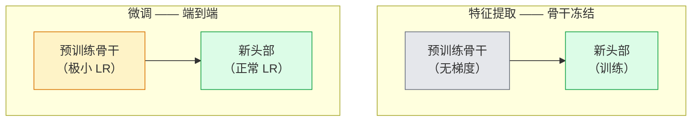

# 迁移学习与微调

> 别人花了一百万 GPU 小时，教会一个网络边缘、纹理和物体部件长什么样。在训练你自己的之前，你应该把那些特征借过来。

**类型：** Build
**语言：** Python
**前置要求：** 阶段 4 第 03 课（CNN）、阶段 4 第 04 课（图像分类）
**预计时间：** ~75 分钟

## 学习目标

- 区分特征提取和微调，并根据数据集规模、领域距离和算力预算挑对那一个
- 加载一个预训练骨干，替换它的分类头，只训练头部，在 20 行以内达到一个能用的基线
- 用差异化学习率渐进解冻各层，让早期的通用特征比后期的任务特定特征更新得更小
- 诊断三种常见故障：解冻块上学习率过高导致的特征漂移、小数据集上 BN 统计量崩溃、灾难性遗忘

## 问题所在

在 ImageNet 上训练一个 ResNet-50 大约要 2,000 GPU 小时。很少有团队能为他们交付的每个任务都掏这个预算。几乎每个团队实际交付的，是一个预训练骨干，配上一个在几百或几千张任务特定图像上训练的新头部。

这不是抄近路。任何 ImageNet 训练的 CNN，它的第一个卷积块学的是边缘和类 Gabor 滤波器。接下来几个块学纹理和简单图案。中间的块学物体部件。最后的块学那些开始像 1,000 个 ImageNet 类别的组合。这个层级前 90% 几乎原封不动地迁移到医学影像、工业检测、卫星数据和其他每个视觉任务——因为大自然的边缘和纹理词汇是有限的。最后 10% 才是你真正要训练的。

把迁移做对，有三个 bug 在等着你：用过高的学习率毁掉预训练特征、冻得太多让模型信息不足、让 BatchNorm 的运行统计量漂向一个网络其余部分从未学过的小数据集。这一课故意把每一个都走一遍。

## 核心概念

### 特征提取 vs 微调

两种模式，看你多信任预训练特征、手头有多少数据来选。



经验法则：

| 数据集规模 | 领域距离 | 配方 |
|--------------|-----------------|--------|
| < 1k 张 | 接近 ImageNet | 冻结骨干，只训练头部 |
| 1k-10k | 接近 | 冻结前 2-3 个阶段，微调其余 |
| 10k-100k | 任意 | 用差异化 LR 端到端微调 |
| 100k+ | 远 | 全部微调；如果领域足够远，考虑从零训练 |

"接近 ImageNet"大致意思是带物体内容的自然 RGB 照片。医学 CT 扫描、俯视卫星影像和显微图像是远领域——特征仍然有帮助，但你需要让更多层去适应。

### 冻结为什么能行得通

CNN 学到的 ImageNet 特征不是为那 1,000 个类别特化的。它们是为自然图像的统计量特化的：特定朝向的边缘、纹理、对比模式、形状原语。这些统计量在人类能叫得出名字的几乎每个视觉领域里都稳定。这就是为什么一个在 ImageNet 上训练、仅加一个新线性头（不微调骨干）就在 CIFAR-10 上零样本评估的模型，能达到 80%+ 的准确率。头部是在学：对这个任务，该给已经学到的特征里哪些加权。

### 差异化学习率

当你确实要解冻时，早期层应该比后期层训练得慢。早期层编码你想保留的通用特征；后期层编码你需要大幅移动的任务特定结构。

```
典型配方：

  stage 0（stem + 第一组）：    lr = base_lr / 100    （基本固定）
  stage 1：                     lr = base_lr / 10
  stage 2：                     lr = base_lr / 3
  stage 3（最后一个骨干组）：   lr = base_lr
  head：                        lr = base_lr  （或略高）
```

在 PyTorch 里，这就是传给优化器的一个参数组列表。一个模型，五个学习率，零额外代码。

### BatchNorm 问题

BN 层持有 `running_mean` 和 `running_var` 缓冲区，它们是在 ImageNet 上算的。如果你的任务有不同的像素分布——不同的光照、不同的传感器、不同的色彩空间——那些缓冲区就是错的。按偏好顺序排的三个选项：

1. **让 BN 处于 train 模式微调。** 让 BN 和其他一切一起更新它的运行统计量。任务数据集中等规模（>= 5k 样本）时的默认选择。
2. **让 BN 处于 eval 模式冻结。** 保留 ImageNet 统计量，只训练权重。当你的数据集小到 BN 的移动平均会很嘈杂时，这是对的。
3. **用 GroupNorm 替换 BN。** 彻底去掉移动平均问题。用于每 GPU batch size 极小的检测和分割骨干。

这个搞错了，会悄无声息地把准确率拉低 5-15%。

### 头部设计

分类头是 1-3 个线性层加一个可选的 dropout。每个 torchvision 骨干都自带一个默认头，你来替换它：

```
backbone.fc = nn.Linear(backbone.fc.in_features, num_classes)          # ResNet
backbone.classifier[1] = nn.Linear(..., num_classes)                    # EfficientNet、MobileNet
backbone.heads.head = nn.Linear(..., num_classes)                       # torchvision ViT
```

对小数据集，一个线性层通常就够。当任务分布离骨干的训练分布更远时，加一个隐藏层（Linear -> ReLU -> Dropout -> Linear）有帮助。

### 逐层 LR 衰减

差异化 LR 的一个更平滑版本，用于现代微调（BEiT、DINOv2、ViT-B 微调）。不是把层分组成阶段，而是给每一层一个比它上面那层略小的 LR：

```
lr_layer_k = base_lr * decay^(L - k)
```

decay = 0.75、L = 12 个 transformer 块时，第一块以头部 LR 的 `0.75^11 ≈ 0.04x` 训练。对 transformer 微调比对 CNN 更要紧，CNN 用按阶段分组的 LR 通常就够了。

### 评估什么

迁移学习的运行需要两个你在从零训练时不会去追踪的数：

- **仅预训练准确率** —— 骨干冻结时头部的准确率。这是你的下限。
- **微调后准确率** —— 同一个模型端到端训练后的准确率。这是你的上限。

如果微调后比仅预训练还低，你有一个学习率或 BN 的 bug。永远把两个都打印出来。

## 动手构建

### 第 1 步：加载一个预训练骨干并检查它

```python
import torch
import torch.nn as nn
from torchvision.models import resnet18, ResNet18_Weights

backbone = resnet18(weights=ResNet18_Weights.IMAGENET1K_V1)
print(backbone)
print()
print("classifier head:", backbone.fc)
print("feature dim:", backbone.fc.in_features)
```

`ResNet18` 有四个阶段（`layer1..layer4`），加一个 stem 和一个 `fc` 头。每个 torchvision 分类骨干都有类似的结构。

### 第 2 步：特征提取 —— 冻结一切，替换头部

```python
def make_feature_extractor(num_classes=10):
    model = resnet18(weights=ResNet18_Weights.IMAGENET1K_V1)
    for p in model.parameters():
        p.requires_grad = False
    model.fc = nn.Linear(model.fc.in_features, num_classes)
    return model

model = make_feature_extractor(num_classes=10)
trainable = sum(p.numel() for p in model.parameters() if p.requires_grad)
frozen = sum(p.numel() for p in model.parameters() if not p.requires_grad)
print(f"trainable: {trainable:>10,}")
print(f"frozen:    {frozen:>10,}")
```

只有 `model.fc` 可训练。骨干是一个冻结的特征提取器。

### 第 3 步：差异化微调

一个工具函数，构建带阶段特定学习率的参数组。

```python
def discriminative_param_groups(model, base_lr=1e-3, decay=0.3):
    stages = [
        ["conv1", "bn1"],
        ["layer1"],
        ["layer2"],
        ["layer3"],
        ["layer4"],
        ["fc"],
    ]
    groups = []
    for i, names in enumerate(stages):
        lr = base_lr * (decay ** (len(stages) - 1 - i))
        params = [p for n, p in model.named_parameters()
                  if any(n.startswith(k) for k in names)]
        if params:
            groups.append({"params": params, "lr": lr, "name": "_".join(names)})
    return groups

model = resnet18(weights=ResNet18_Weights.IMAGENET1K_V1)
model.fc = nn.Linear(model.fc.in_features, 10)
for p in model.parameters():
    p.requires_grad = True

groups = discriminative_param_groups(model)
for g in groups:
    print(f"{g['name']:>10s}  lr={g['lr']:.2e}  params={sum(p.numel() for p in g['params']):>8,}")
```

`decay=0.3` 意味着每个阶段以下一个阶段 30% 的速率训练。`fc` 拿到 `base_lr`，`layer4` 拿到 `0.3 * base_lr`，`conv1` 拿到 `0.3^5 * base_lr ≈ 0.00243 * base_lr`。听起来很极端；经验上它管用。

### 第 4 步：BatchNorm 处理

一个 helper，冻结 BN 的运行统计量但不冻结它的权重。

```python
def freeze_bn_stats(model):
    for m in model.modules():
        if isinstance(m, (nn.BatchNorm1d, nn.BatchNorm2d, nn.BatchNorm3d)):
            m.eval()
            for p in m.parameters():
                p.requires_grad = False
    return model
```

在每个 epoch 开头设置完 `model.train()` 之后调用它。`model.train()` 把一切翻到训练模式；这个只对 BN 层把它翻回去。

### 第 5 步：一个极简的端到端微调循环

```python
from torch.optim import SGD
from torch.utils.data import DataLoader
from torch.optim.lr_scheduler import CosineAnnealingLR
import torch.nn.functional as F

def fine_tune(model, train_loader, val_loader, device, epochs=5, base_lr=1e-3, freeze_bn=False):
    model = model.to(device)
    groups = discriminative_param_groups(model, base_lr=base_lr)
    optimizer = SGD(groups, momentum=0.9, weight_decay=1e-4, nesterov=True)
    scheduler = CosineAnnealingLR(optimizer, T_max=epochs)

    for epoch in range(epochs):
        model.train()
        if freeze_bn:
            freeze_bn_stats(model)
        tr_loss, tr_correct, tr_total = 0.0, 0, 0
        for x, y in train_loader:
            x, y = x.to(device), y.to(device)
            logits = model(x)
            loss = F.cross_entropy(logits, y, label_smoothing=0.1)
            optimizer.zero_grad()
            loss.backward()
            optimizer.step()
            tr_loss += loss.item() * x.size(0)
            tr_total += x.size(0)
            tr_correct += (logits.argmax(-1) == y).sum().item()
        scheduler.step()

        model.eval()
        va_total, va_correct = 0, 0
        with torch.no_grad():
            for x, y in val_loader:
                x, y = x.to(device), y.to(device)
                pred = model(x).argmax(-1)
                va_total += x.size(0)
                va_correct += (pred == y).sum().item()
        print(f"epoch {epoch}  train {tr_loss/tr_total:.3f}/{tr_correct/tr_total:.3f}  "
              f"val {va_correct/va_total:.3f}")
    return model
```

在 CIFAR-10 上用上面这个配方训五个 epoch，能把 `ResNet18-IMAGENET1K_V1` 从约 70% 的零样本线性探针准确率带到约 93% 的微调后准确率。单靠头部、永不触碰骨干的话，会在 86% 左右停滞。

### 第 6 步：渐进解冻

一个调度，从末端往开头方向每个 epoch 解冻一个阶段。以多花几个 epoch 为代价，缓解特征漂移。

```python
def progressive_unfreeze_schedule(model):
    stages = ["layer4", "layer3", "layer2", "layer1"]
    yielded = set()

    def start():
        for p in model.parameters():
            p.requires_grad = False
        for p in model.fc.parameters():
            p.requires_grad = True

    def unfreeze(epoch):
        if epoch < len(stages):
            name = stages[epoch]
            yielded.add(name)
            for n, p in model.named_parameters():
                if n.startswith(name):
                    p.requires_grad = True
            return name
        return None

    return start, unfreeze
```

第一个 epoch 之前调用一次 `start()`。每个 epoch 开头调用 `unfreeze(epoch)`。每当可训练参数的集合变化时就重建优化器，否则被冻结的参数仍持有缓存的动量，会把它搞糊涂。

## 上手使用

对大多数真实任务，`torchvision.models` + 三行就够了。上面那套更重的机制，是在你撞上库默认值修不了的问题时才要紧。

```python
from torchvision.models import resnet50, ResNet50_Weights

model = resnet50(weights=ResNet50_Weights.IMAGENET1K_V2)
model.fc = nn.Linear(model.fc.in_features, num_classes)
optimizer = torch.optim.AdamW(model.parameters(), lr=1e-4, weight_decay=1e-4)
```

另外两个生产级的默认选择：

- `timm` 提供约 800 个预训练视觉骨干，API 一致（`timm.create_model("resnet50", pretrained=True, num_classes=10)`）。任何超出 torchvision 模型库的微调，它都是标准。
- 对 transformer，`transformers.AutoModelForImageClassification.from_pretrained(name, num_labels=N)` 给你 ViT / BEiT / DeiT，加载语义和文本模型一样。

## 交付

这一课产出：

- `outputs/prompt-fine-tune-planner.md` —— 一个 prompt，根据数据集规模、领域距离和算力预算，在特征提取、渐进式、端到端微调之间挑选。
- `outputs/skill-freeze-inspector.md` —— 一个 skill，给定一个 PyTorch 模型，报告哪些参数可训练、哪些 BatchNorm 层处于 eval 模式，以及优化器是否真的拿到了那些可训练参数。

## 练习

1. **（简单）** 在同一个合成 CIFAR 数据集上，把一个 `ResNet18` 作为线性探针（骨干冻结）训一遍、再作为完整微调训一遍。把两个准确率并排报出来。解释哪个差距告诉你特征迁移得好，哪个告诉你它们迁移得不好。
2. **（中等）** 故意引入一个 bug：把骨干阶段的 `base_lr` 设成 `1e-1` 而不是头部的。展示训练损失爆炸，然后应用 `discriminative_param_groups` helper 恢复。记录每个阶段开始发散时的 LR。
3. **（困难）** 拿一个医学影像数据集（例如 CheXpert-small、PatchCamelyon 或 HAM10000），对比三种模式：(a) ImageNet 预训练冻结骨干 + 线性头；(b) ImageNet 预训练端到端微调；(c) 从零训练。各报告准确率和算力成本。在多大的数据集规模下，从零训练才变得有竞争力？

## 关键术语

| 术语 | 大家嘴上怎么说 | 它实际是什么 |
|------|----------------|----------------------|
| 特征提取 | "冻结并训练头部" | 骨干参数冻结，只有新分类头接收梯度 |
| 微调 | "端到端重新训练" | 所有参数可训练，通常 LR 比从零训练小得多 |
| 差异化 LR | "早期层用更小的 LR" | 优化器参数组中，早期阶段 LR 是后期阶段 LR 的一个分数 |
| 逐层 LR 衰减 | "平滑的 LR 梯度" | 每层 LR 乘以 decay^(L - k)；在 transformer 微调里常见 |
| 灾难性遗忘 | "模型丢了 ImageNet" | 过高的 LR 在新任务信号学到之前就覆盖了预训练特征 |
| BN 统计量漂移 | "running mean 错了" | BatchNorm 的 running_mean/var 是在与当前任务不同的分布上算的，悄悄拉低准确率 |
| 线性探针 | "冻结骨干 + 线性头" | 对预训练特征的评估——在冻结表示之上最好的线性分类器的准确率 |
| 灾难性崩溃 | "全都预测成一个类" | 用高到足以在头部梯度稳定之前就毁掉特征的 LR 微调时会发生 |

## 延伸阅读

- [How transferable are features in deep neural networks? (Yosinski et al., 2014)](https://arxiv.org/abs/1411.1792) —— 量化了特征跨层可迁移性的那篇论文
- [Universal Language Model Fine-tuning (ULMFiT, Howard & Ruder, 2018)](https://arxiv.org/abs/1801.06146) —— 最初的差异化 LR / 渐进解冻配方；这些点子直接迁移到视觉
- [timm documentation](https://huggingface.co/docs/timm) —— 现代视觉骨干，以及它们训练时所用精确微调默认值的参考
- [A Simple Framework for Linear-Probe Evaluation (Kornblith et al., 2019)](https://arxiv.org/abs/1805.08974) —— 为什么线性探针准确率要紧，以及如何正确地报告它
