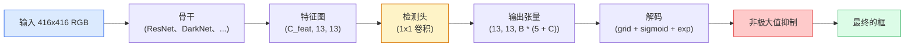

# 目标检测 —— 从零实现 YOLO

> 检测就是分类加回归，在特征图的每个位置上跑一遍，再用非极大值抑制清理干净。

**类型：** Build
**语言：** Python
**前置要求：** 阶段 4 第 03 课（CNN）、阶段 4 第 04 课（图像分类）、阶段 4 第 05 课（迁移学习）
**预计时间：** ~75 分钟

## 学习目标

- 解释把检测变成稠密预测问题的"网格 + anchor"设计，说出输出张量里每个数的含义
- 计算两个框之间的交并比（IoU），从零实现非极大值抑制
- 在一个预训练骨干之上搭一个极简的 YOLO 风格头，包括分类、objectness 和框回归损失
- 读懂一行检测指标（precision@0.5、recall、mAP@0.5、mAP@0.5:0.95），决定下一步该拧哪个旋钮

## 问题所在

分类说"这张图是狗"。检测说"在像素 (112, 40, 280, 210) 处有一只狗，在 (400, 180, 560, 310) 处有一只猫，画面里没别的了"。这一个结构性改变——预测数量可变的带标签的框，而不是每张图一个标签——是每个自动驾驶系统、每个监控产品、每个文档版面解析器、每条工厂视觉线所依赖的。

检测也是视觉里每个工程权衡同时冒出来的地方。你想要准确的框（回归头），你想要每个框有对的类别（分类头），你想要模型知道何时没东西可检测（objectness 分数），你想要每个真实物体恰好一个预测（非极大值抑制）。漏掉其中任何一个，流水线要么漏检物体，要么报出幻觉框，要么把同一个物体在略微不同的位置预测十五遍。

YOLO（You Only Look Once，Redmon 等人 2016）就是那个让这一切实时跑起来的设计——靠一个卷积网络的单次前向传播完成，而同样这些结构决策，至今仍是现代检测器（YOLOv8、YOLOv9、YOLO-NAS、RT-DETR）的骨干。学会核心，每个变体都变成了同样部件的重排。

## 核心概念

### 把检测当作稠密预测

分类器每张图输出 C 个数。一个 YOLO 风格的检测器每张图输出 `(S x S x (5 + C))` 个数，其中 S 是空间网格尺寸。



`S * S` 个网格单元每个预测 `B` 个框。对每个框：

- 4 个数描述几何：`tx, ty, tw, th`。
- 1 个数是 objectness 分数："这个单元里有没有一个以它为中心的物体？"
- C 个数是类别概率。

每个单元总计：`B * (5 + C)`。对 VOC，`S=13, B=2, C=20`，每个单元就是 50 个数。

### 为什么用网格和 anchor

朴素回归会把每个物体的 `(x, y, w, h)` 预测成绝对坐标。这对卷积网络很难，因为平移图像不应该把所有预测平移相同的量——每个物体都在空间上锚定。网格回答了这点：把每个真值框分配给它中心落入的那个网格单元；只有那个单元对那个物体负责。

anchor 解决第二个问题。一个 3x3 卷积很难从 16 像素感受野的特征单元里回归出一个 500 像素宽的框。于是，我们为每个单元预定义 `B` 个先验框形状（anchor），并预测相对每个 anchor 的小偏移量。模型学着挑对 anchor 再微调它，而不是从零回归。

```
anchor 框先验（416x416 输入的例子）：

  small:   (30,  60)
  medium:  (75,  170)
  large:   (200, 380)

每个网格单元上，每个 anchor 发出 (tx, ty, tw, th, obj, c_1, ..., c_C)。
```

现代检测器常用 FPN，每个分辨率配不同的 anchor 集——浅层高分辨率图上用小 anchor，深层低分辨率图上用大 anchor。同一个点子，更多尺度。

### 解码预测

原始的 `tx, ty, tw, th` 不是框坐标；它们是回归目标，画图前要先变换：

```
中心 x  = (sigmoid(tx) + cell_x) * stride
中心 y  = (sigmoid(ty) + cell_y) * stride
宽度    = anchor_w * exp(tw)
高度    = anchor_h * exp(th)
```

`sigmoid` 把中心偏移量限制在单元内。`exp` 让宽度从 anchor 自由缩放而不会变号。`stride` 把网格坐标缩放回像素。这个解码步骤从 v2 起在每个 YOLO 版本里都一样。

### IoU

检测里两个框之间通用的相似度度量：

```
IoU(A, B) = area(A 交 B) / area(A 并 B)
```

IoU = 1 表示完全相同；IoU = 0 表示无重叠。预测和真值框之间的 IoU 决定了一个预测是否算真阳性（通常 IoU >= 0.5）。两个预测之间的 IoU 是 NMS 用来去重的。

### 非极大值抑制

一个在相邻 anchor 上训练的卷积网络，常常会为同一个物体预测重叠的框。NMS 保留置信度最高的预测，删掉任何与之 IoU 超过阈值的其他预测。

```
NMS(boxes, scores, iou_threshold):
    按 score 降序排序 boxes
    keep = []
    while boxes 非空:
        取分数最高的框，加入 keep
        移除每个与所取框 IoU > iou_threshold 的框
    return keep
```

典型阈值：目标检测取 0.45。近期的检测器把标准 NMS 换成 `soft-NMS`、`DIoU-NMS`，或直接学习抑制（RT-DETR），但结构性目的是一样的。

### 损失

YOLO 损失是三个损失加权相加：

```
L = lambda_coord * L_box(pred, target, 在 obj=1 处)
  + lambda_obj   * L_obj(pred, 1,     在 obj=1 处)
  + lambda_noobj * L_obj(pred, 0,     在 obj=0 处)
  + lambda_cls   * L_cls(pred, target, 在 obj=1 处)
```

只有含物体的单元才对框回归和分类损失有贡献。不含物体的单元只对 objectness 损失有贡献（教模型保持沉默）。`lambda_noobj` 通常很小（约 0.5），因为绝大多数单元是空的，否则会主导总损失。

现代变体把 MSE 框损失换成 CIoU / DIoU（直接优化 IoU），用 focal loss 应对类别不平衡，用 quality focal loss 平衡 objectness。三组件结构不变。

### 检测指标

准确率迁移不到检测上。四个能迁移的数：

- **Precision@IoU=0.5** —— 被算作阳性的预测里，有多少真的对。
- **Recall@IoU=0.5** —— 真实物体里，我们找到了多少。
- **AP@0.5** —— IoU 阈值 0.5 下精确率-召回率曲线的面积；每类一个数。
- **mAP@0.5:0.95** —— 在 IoU 阈值 0.5、0.55、...、0.95 上的 AP 平均。COCO 指标；最严格、信息量最大。

四个都报。一个 mAP@0.5 强但 mAP@0.5:0.95 弱的检测器，定位是大致对、不够紧；用更好的框回归损失修。一个高精确率、低召回率的检测器太保守了；降低置信度阈值或提高 objectness 权重。

## 动手构建

### 第 1 步：IoU

整课的主力。作用于两组 `(x1, y1, x2, y2)` 格式的框数组。

```python
import numpy as np

def box_iou(boxes_a, boxes_b):
    ax1, ay1, ax2, ay2 = boxes_a[:, 0], boxes_a[:, 1], boxes_a[:, 2], boxes_a[:, 3]
    bx1, by1, bx2, by2 = boxes_b[:, 0], boxes_b[:, 1], boxes_b[:, 2], boxes_b[:, 3]

    inter_x1 = np.maximum(ax1[:, None], bx1[None, :])
    inter_y1 = np.maximum(ay1[:, None], by1[None, :])
    inter_x2 = np.minimum(ax2[:, None], bx2[None, :])
    inter_y2 = np.minimum(ay2[:, None], by2[None, :])

    inter_w = np.clip(inter_x2 - inter_x1, 0, None)
    inter_h = np.clip(inter_y2 - inter_y1, 0, None)
    inter = inter_w * inter_h

    area_a = (ax2 - ax1) * (ay2 - ay1)
    area_b = (bx2 - bx1) * (by2 - by1)
    union = area_a[:, None] + area_b[None, :] - inter
    return inter / np.clip(union, 1e-8, None)
```

返回一个 `(N_a, N_b)` 的成对 IoU 矩阵。要对单个真值框用它，就把其中一个数组做成 `(1, 4)` 形状。

### 第 2 步：非极大值抑制

```python
def nms(boxes, scores, iou_threshold=0.45):
    order = np.argsort(-scores)
    keep = []
    while len(order) > 0:
        i = order[0]
        keep.append(i)
        if len(order) == 1:
            break
        rest = order[1:]
        ious = box_iou(boxes[[i]], boxes[rest])[0]
        order = rest[ious <= iou_threshold]
    return np.array(keep, dtype=np.int64)
```

确定性的，排序带来 `O(N log N)`，在相同输入上和 `torchvision.ops.nms` 行为一致。

### 第 3 步：框的编码和解码

在像素坐标和网络实际回归的 `(tx, ty, tw, th)` 目标之间互转。

```python
def encode(box_xyxy, cell_x, cell_y, stride, anchor_wh):
    x1, y1, x2, y2 = box_xyxy
    cx = 0.5 * (x1 + x2)
    cy = 0.5 * (y1 + y2)
    w = x2 - x1
    h = y2 - y1
    tx = cx / stride - cell_x
    ty = cy / stride - cell_y
    tw = np.log(w / anchor_wh[0] + 1e-8)
    th = np.log(h / anchor_wh[1] + 1e-8)
    return np.array([tx, ty, tw, th])


def decode(tx_ty_tw_th, cell_x, cell_y, stride, anchor_wh):
    tx, ty, tw, th = tx_ty_tw_th
    cx = (sigmoid(tx) + cell_x) * stride
    cy = (sigmoid(ty) + cell_y) * stride
    w = anchor_wh[0] * np.exp(tw)
    h = anchor_wh[1] * np.exp(th)
    return np.array([cx - w / 2, cy - h / 2, cx + w / 2, cy + h / 2])


def sigmoid(x):
    return 1.0 / (1.0 + np.exp(-x))
```

测试：encode 一个框再 decode——你应该拿回非常接近原始的东西（除非 `tx` 不在 sigmoid 之后的范围内，导致 sigmoid 反函数不完全可逆）。

### 第 4 步：一个极简的 YOLO 头

在一个特征图上做一次 1x1 卷积，reshape 成 `(B, S, S, num_anchors, 5 + C)`。

```python
import torch
import torch.nn as nn

class YOLOHead(nn.Module):
    def __init__(self, in_c, num_anchors, num_classes):
        super().__init__()
        self.num_anchors = num_anchors
        self.num_classes = num_classes
        self.conv = nn.Conv2d(in_c, num_anchors * (5 + num_classes), kernel_size=1)

    def forward(self, x):
        n, _, h, w = x.shape
        y = self.conv(x)
        y = y.view(n, self.num_anchors, 5 + self.num_classes, h, w)
        y = y.permute(0, 3, 4, 1, 2).contiguous()
        return y
```

输出形状：`(N, H, W, num_anchors, 5 + C)`。最后一维存的是 `[tx, ty, tw, th, obj, cls_0, ..., cls_{C-1}]`。

### 第 5 步：真值分配

对每个真值框，决定哪个 `(cell, anchor)` 负责。

```python
def assign_targets(boxes_xyxy, classes, anchors, stride, grid_size, num_classes):
    num_anchors = len(anchors)
    target = np.zeros((grid_size, grid_size, num_anchors, 5 + num_classes), dtype=np.float32)
    has_obj = np.zeros((grid_size, grid_size, num_anchors), dtype=bool)

    for box, cls in zip(boxes_xyxy, classes):
        x1, y1, x2, y2 = box
        cx, cy = 0.5 * (x1 + x2), 0.5 * (y1 + y2)
        gx, gy = int(cx / stride), int(cy / stride)
        bw, bh = x2 - x1, y2 - y1

        ious = np.array([
            (min(bw, aw) * min(bh, ah)) / (bw * bh + aw * ah - min(bw, aw) * min(bh, ah))
            for aw, ah in anchors
        ])
        best = int(np.argmax(ious))
        aw, ah = anchors[best]

        target[gy, gx, best, 0] = cx / stride - gx
        target[gy, gx, best, 1] = cy / stride - gy
        target[gy, gx, best, 2] = np.log(bw / aw + 1e-8)
        target[gy, gx, best, 3] = np.log(bh / ah + 1e-8)
        target[gy, gx, best, 4] = 1.0
        target[gy, gx, best, 5 + cls] = 1.0
        has_obj[gy, gx, best] = True
    return target, has_obj
```

anchor 选择是"与真值的最佳形状 IoU"——一个便宜的代理，与 YOLOv2/v3 的分配方式一致。v5 及之后用更复杂的策略（任务对齐匹配、动态 k），它们精化了同一个点子。

### 第 6 步：三个损失

```python
def yolo_loss(pred, target, has_obj, lambda_coord=5.0, lambda_obj=1.0, lambda_noobj=0.5, lambda_cls=1.0):
    has_obj_t = torch.from_numpy(has_obj).bool()
    target_t = torch.from_numpy(target).float()

    # 框回归损失：只在含物体的单元上
    box_pred = pred[..., :4][has_obj_t]
    box_true = target_t[..., :4][has_obj_t]
    loss_box = torch.nn.functional.mse_loss(box_pred, box_true, reduction="sum")

    # objectness 损失
    obj_pred = pred[..., 4]
    obj_true = target_t[..., 4]
    loss_obj_pos = torch.nn.functional.binary_cross_entropy_with_logits(
        obj_pred[has_obj_t], obj_true[has_obj_t], reduction="sum")
    loss_obj_neg = torch.nn.functional.binary_cross_entropy_with_logits(
        obj_pred[~has_obj_t], obj_true[~has_obj_t], reduction="sum")

    # 含物体单元上的分类损失
    cls_pred = pred[..., 5:][has_obj_t]
    cls_true = target_t[..., 5:][has_obj_t]
    loss_cls = torch.nn.functional.binary_cross_entropy_with_logits(
        cls_pred, cls_true, reduction="sum")

    total = (lambda_coord * loss_box
             + lambda_obj * loss_obj_pos
             + lambda_noobj * loss_obj_neg
             + lambda_cls * loss_cls)
    return total, {"box": loss_box.item(), "obj_pos": loss_obj_pos.item(),
                   "obj_neg": loss_obj_neg.item(), "cls": loss_cls.item()}
```

每个 YOLO 教程要么写死、要么扫一遍的五个超参数。比例很要紧：`lambda_coord=5, lambda_noobj=0.5` 沿用了原始 YOLOv1 论文，至今仍是个合理的默认值。

### 第 7 步：推理流水线

解码原始头部输出，应用 sigmoid/exp，按 objectness 阈值过滤，再 NMS。

```python
def postprocess(pred_tensor, anchors, stride, img_size, conf_threshold=0.25, iou_threshold=0.45):
    pred = pred_tensor.detach().cpu().numpy()
    grid_h, grid_w = pred.shape[1], pred.shape[2]
    num_anchors = len(anchors)

    boxes, scores, classes = [], [], []
    for gy in range(grid_h):
        for gx in range(grid_w):
            for a in range(num_anchors):
                tx, ty, tw, th, obj, *cls = pred[0, gy, gx, a]
                score = sigmoid(obj) * sigmoid(np.array(cls)).max()
                if score < conf_threshold:
                    continue
                cls_idx = int(np.argmax(cls))
                cx = (sigmoid(tx) + gx) * stride
                cy = (sigmoid(ty) + gy) * stride
                w = anchors[a][0] * np.exp(tw)
                h = anchors[a][1] * np.exp(th)
                boxes.append([cx - w / 2, cy - h / 2, cx + w / 2, cy + h / 2])
                scores.append(float(score))
                classes.append(cls_idx)

    if not boxes:
        return np.zeros((0, 4)), np.zeros((0,)), np.zeros((0,), dtype=int)
    boxes = np.array(boxes)
    scores = np.array(scores)
    classes = np.array(classes)
    keep = nms(boxes, scores, iou_threshold)
    return boxes[keep], scores[keep], classes[keep]
```

这就是完整的评估路径：头部 -> 解码 -> 阈值 -> NMS。

## 上手使用

`torchvision.models.detection` 提供概念结构相同的生产级检测器。加载一个预训练模型三行就够。

```python
import torch
from torchvision.models.detection import fasterrcnn_resnet50_fpn_v2

model = fasterrcnn_resnet50_fpn_v2(weights="DEFAULT")
model.eval()
with torch.no_grad():
    predictions = model([torch.randn(3, 400, 600)])
print(predictions[0].keys())
print(f"boxes:  {predictions[0]['boxes'].shape}")
print(f"scores: {predictions[0]['scores'].shape}")
print(f"labels: {predictions[0]['labels'].shape}")
```

对实时推理流水线，`ultralytics`（YOLOv8/v9）是标准：`from ultralytics import YOLO; model = YOLO('yolov8n.pt'); model(img)`。模型在内部处理解码和 NMS，返回你上面搭出来的同一个 `boxes / scores / labels` 三元组。

## 交付

这一课产出：

- `outputs/prompt-detection-metric-reader.md` —— 一个 prompt，把一行 `precision, recall, AP, mAP@0.5:0.95` 变成一句话诊断和最有用的下一个实验。
- `outputs/skill-anchor-designer.md` —— 一个 skill，给定一份真值框数据集，对 `(w, h)` 跑 k-means，返回每个 FPN 层的 anchor 集，外加你挑对 anchor 数量所需的覆盖统计。

## 练习

1. **（简单）** 实现 `box_iou`，在 1,000 个随机框对上和 `torchvision.ops.box_iou` 对比。验证最大绝对差低于 `1e-6`。
2. **（中等）** 把 `yolo_loss` 移植成用 `CIoU` 框损失代替 MSE 的版本。在一个 100 张图的合成数据集上展示：相同 epoch 数下，CIoU 收敛到比 MSE 更好的最终 mAP@0.5:0.95。
3. **（困难）** 实现多尺度推理：把同一张图以三个分辨率喂给模型，把框预测合起来，最后跑一次 NMS。在留出集上测量相对单尺度推理的 mAP 提升。

## 关键术语

| 术语 | 大家嘴上怎么说 | 它实际是什么 |
|------|----------------|----------------------|
| Anchor | "框先验" | 每个网格单元上预定义的框形状，网络从它预测偏移量而不是绝对坐标 |
| IoU | "重叠" | 两个框的交并比；检测里通用的相似度度量 |
| NMS | "去重" | 贪心算法，保留分数最高的预测，移除与之重叠超过阈值的 |
| Objectness | "这里有没有东西" | 每 anchor、每单元的标量，预测是否有一个以该单元为中心的物体 |
| 网格 stride | "下采样倍数" | 每个网格单元对应的像素数；416 像素输入配 13 网格的头，stride 是 32 |
| mAP | "平均精度均值" | 精确率-召回率曲线下面积的平均，跨类别（COCO 还跨 IoU 阈值）求均值 |
| AP@0.5 | "PASCAL VOC AP" | IoU 阈值 0.5 的平均精度；这个指标宽松的版本 |
| mAP@0.5:0.95 | "COCO AP" | 在 IoU 阈值 0.5..0.95 步长 0.05 上求平均；严格版本，也是当前社区标准 |

## 延伸阅读

- [YOLOv1: You Only Look Once (Redmon et al., 2016)](https://arxiv.org/abs/1506.02640) —— 奠基论文；此后每个 YOLO 都是对这个结构的精化
- [YOLOv3 (Redmon & Farhadi, 2018)](https://arxiv.org/abs/1804.02767) —— 引入多尺度 FPN 风格头的那篇论文；至今图示最清楚
- [Ultralytics YOLOv8 docs](https://docs.ultralytics.com) —— 当前的生产参考；涵盖数据集格式、增广、训练配方
- [The Illustrated Guide to Object Detection (Jonathan Hui)](https://jonathan-hui.medium.com/object-detection-series-24d03a12f904) —— 对整个检测器家族最佳的大白话讲解；对理解 DETR、RetinaNet、FCOS 和 YOLO 之间的关系无价
